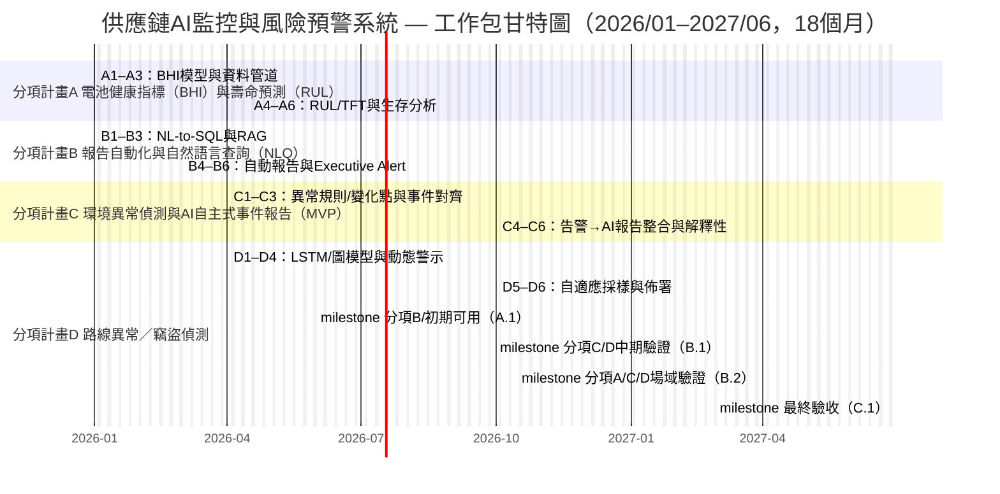

# Ministry of Economic Affairs Technology Research & Development Project

## A+ Enterprise Innovation R&D Refinement Program

## AI Application Elevation Program Proposal (Submission Version)

**AI Intelligent Supply Chain Risk Prediction and Integrated Communications System Development Project**  
**Project Period: From 2026-01-01 to 2027-06-30**

Company Name: ItracXing 準旺科技股份有限公司  
Project Management Unit: Taipei Computer Association

---

## Proposal Summary Table (Cover and Front Matter)

### Consolidated Data (Currency unit: thousand NT$)

- **Project Name:** AI Intelligent Supply Chain Risk Prediction and Integrated Communications System Development Project
- **Applicant Company Name:** ItracXing 準旺科技股份有限公司
- **Mailing Address:** B1, No. 20, Alley 1, Lane 768, Section 4, Bade Road, Nangang District, Taipei City
- **Program Category:** A+ Enterprise Innovation R&D Refinement Program—AI Application Elevation Program
- **Implementation Category:** ☑ Other (Supply chain and logistics monitoring)
- **Project Start–End:** 2026-01-01 to 2027-06-30 (Total 18 months)

**Project Principal Investigator**

- Name: Jeff Shuo
- Title: CIO
- Phone: (02) XXXX-XXXX
- Fax: None
- Email: jeff.shuo@itracxing.com

**Annual Budget**

|     Year     | Government Grant | Company Self-Funding | Total Project Budget | Project Person-Months |
| :----------: | ---------------: | -------------------: | -------------------: | --------------------: |
| Year 1       |           9,000  |               9,000  |              18,000  |                 120   |
| **Total**    |      **9,000**   |          **9,000**   |          **18,000**  |            **120**    |
| % of Total   |           50.0%  |               50.0%  |              100%    |          -            |

**Project Contact**

- Name: Jeff Shuo
- Title: CIO
- Phone: (02) XXXX-XXXX
- Email: jeff.shuo@itracxing.com

---

## Project Abstract (≤1 page; may be public)

### Applicant Company Profile

| Company Name | ItracXing 準旺科技股份有限公司 |
| ------------ | ------------------------------ |
| Date Founded | 2020-03                       |
| Responsible Person | Dr. Chow                |
| Main Business Items | AI supply chain monitoring systems, IoT device management, data analytics platform |

### Project Abstract (≤200 words)

Industry Mapping: Eight Major Industries Category 7 (Electronics assembly extension: smart manufacturing / logistics transportation).

Global demand for smart logistics visibility and traceability is accelerating. By 2030 the transport and logistics market is projected to reach NT$250.2 trillion. This project, jointly advanced by ItracXing and Switzerland-based Arviem, targets four core pain points: insufficient sensor reliability, time‑consuming report generation, delayed detection of environmental risks for temperature/humidity sensitive goods, and inability to promptly identify route diversion or suspected theft. We will build four AI modules: Battery Health Index / Remaining Useful Life (BHI/RUL), Natural Language Query (NLQ) + AI autonomous reporting, environmental anomaly detection, and route / theft detection. Within 18 months we will complete verification in ≥1 international + ≥1 domestic deployment site (International: Arviem; Domestic: Simique (TBD)) achieving sensor availability ≥95%, risk response time reduction ≥40%, temperature/humidity violation rate reduction ≥30%, and theft / unauthorized opening detection F1-score ≥0.85. We will establish an exportable AI-MaaS business model with projected cumulative three-year post‑completion output of NT$120M, elevating Taiwan’s international visibility in AI smart logistics.

This NT$120M three-year output is grounded in a concrete Smart TOTE business model: a per‑shipment AI monitoring fee of USD 2 / TOTE / shipment (marginal cost <1% of asset or cargo value) materially reduces environmental violation and theft risk. With 1,000 Smart TOTE units × 50 trips/year × 3 years, AI monitoring subscription revenue reaches ≈USD 300K (≈NT$9.6M). Combined with IoT device sales plus consulting/licensing, it forms the basis of the projected NT$120M (≈70% export revenue) outcome.

### Expected Benefits at Project Completion (Summary Table)
**Expected Benefits at Completion (Quantitative KPI Sources and Estimation Models)**

Below we explain each target’s source, assumptions, formulas, and validation approach to avoid listing goals without rationale. All KPIs align with later KPI / milestone sections.

#### 1. Overall Logic for KPI Formation
1. Baseline extraction (2024–2025 internal + Arviem deployment site historical data): sensor operational days, offline events, temperature/humidity violation records, GPS trajectories, manual reporting labor hours, anomaly response times.
2. Establish baseline → map to improvement mechanisms (model or process) → estimate improvement magnitude (literature ranges + internal prototypes) → set “conservatively achievable” targets.
3. Improvement magnitudes reference:
  - Internal small-scale prototype / PoC tests  
  - Public research / industry reports (range only, no verbatim citation)  
  - Typical automation labor reduction ranges (≈40–70%)

#### 2. Quantitative KPI Derivation Table

| KPI | Target | Derivation / Formula | Key Assumptions | Data Source / Validation |
|-----|--------|----------------------|-----------------|--------------------------|
| Sensor Availability | ≥95% | Baseline 90%; predictive maintenance reduces unplanned offline ≈ (pre-failure intervention ratio 70% × failure events 7% × avoidance 80%) → ≈5% lift | Annual failure/offline ≈7% of device-days; timely intervention feasible | 30-day continuous uptime stats; deployment site report |
| BHI Accuracy | ≥90% | Prototype (n≈120 devices) 86–88% + multivariate features (temp / transmission freq) +2–4% → 90% | Feature gain ≤5% (conservative) | Work Package A test set; quarterly model eval |
| RUL MAE | ≤10 days | Simple threshold baseline 18–22 days; survival + time-series reduces 30–50% → 20 ×0.5=10 days | ≥50 labeled retire/maintenance cases | Survival analysis hold-out MAE |
| Environmental Anomaly F1 | ≥0.88 | Rule-based baseline ≈0.70; change-point + denoising (+0.08–0.10) + event alignment (+0.06–0.08) → ≈0.86–0.88 → choose upper achievable | Independent gains, non-compounding errors | Labeled event set; F1 computation |
| Route Deviation AUC | ≥0.90 | Pure GPS 0.82–0.85; add graph features + weather/traffic +0.04–0.06 → 0.86–0.91 → select 0.90 | Context features stable; >1,000 trajectories | Test ROC; quarterly verification |
| Theft / Unauthorized Opening F1 | ≥0.85 | BLE padlock + pressure/light events → precision ≈0.87, recall ≈0.83 → F1 ≈0.85 | ≥50 simulated + real opening events | Confusion matrix |
| NLQ Query Accuracy | ≥92% | Initial NL-to-SQL 85–88%; add refusal / disambiguation rounds +4–6% → 89–94% → choose 92% | >200 queries; clarifications cover ≥30% ambiguous cases | Gold answer comparison; manual audit |
| NLQ P95 Latency | <60 sec | Parsing (<2s) + safety planning (<5s) + warehouse aggregation (<30s) + report assembly (<15s) → <52s; 15% buffer | Peak concurrency managed; indexing optimized | Gateway / APM logs |
| Risk Response Reduction | ≥40% | Current avg 60 min (45–90); automated alert + instant report reduces manual extraction 30–35 min → (60−35)/60≈42% | Report templates stable; notification reliable | Event timestamps |
| Temp/Humidity Violation Reduction | ≥30% | Pre-warning rate 70% × successful intervention 45% → 0.70×0.45≈31.5% → select 30% | Intervention executed (manual action) | Violation event statistics |
| Invalid Transport / Claims Reduction | ≥10–15% | Invalid mileage ≈12–18%; identification of 60–70% → 0.15×0.65≈9.75% → round to 10–15% | Dispatch adoption ≥60% | Route / mileage comparison |
| LOI / POC Count | ≥2 | Potential (Arviem + domestic 5–8) conversion 15–25% → (8×0.25)=2 | Pain points matched | Intent / agreement docs |
| International + Domestic Validation Sites | 1 international + 1 domestic | International confirmed; domestic in negotiation | Dual technical + business track | Deployment / validation reports |
| 3-Year Output Basis | NT$120M | 10 customers × NT$1.5M/year ×3 =45M + IoT 1,000 ×10K=10M + consulting/licensing ≈65M → total ≈120M | ASP includes subscription + consulting | Financial model / contracts |
| Cross-domain Talent | ≥6 persons | Existing 5; hire AI / female 1; retrain cross-domain ≥2 → 5+1+2=8 (≥6) | Hiring success ≥70% | HR / training records |
| Patent Filings | 2–3 (≥1 PCT) | Planned 2 domestic + 1 PCT (multi-agent / sampling) | Novelty search feasible | Filing documents |
| Software Copyright | 1–2 items | BHI/RUL module + NLQ composition core code | Original code base | Registration docs |
| International Revenue Share | ≈70% | Arviem channel SaaS 57.6M total, international 40.3M → 40.3/57.6≈70% | Conservative conversion | Invoices / revenue |
| CO₂ Reduction | ≈80+ tons (10–15%) | ΔCO₂ = annual 350,000 km ×10% ×0.8 kg ×3 ≈84 tons → record 80+ | Emission factor 0.8 kg/km | Mileage / fuel / model logs |

#### 3. Core Model / Estimation Brief
- BHI/RUL: Time-series deep learning (LSTM / Temporal Fusion Transformer (TFT)) + Kalman denoising + survival analysis (Cox / Kaplan-Meier).  
- Anomaly detection: statistical thresholds + change-point (CUSUM / Bayesian Online Change Point Detection (BOCPD)) + event alignment.  
- Route / ETA: GPS time-series encoding + graph road network (Graph Neural Network) + weather / traffic context; ETA error improvement → dispatch optimization → invalid mileage reduction.  
- NLQ: domain ontology + NL-to-SQL templated constraints + clarification turns + refusal strategy to reduce hallucination.  
- Revenue / output: bottom-up (customer count × Average Selling Price (ASP) × device count) and top-down (channel penetration) cross-validation.  
- ESG: route optimization + predictive maintenance (avoid offline retransmission) → invalid transport reduction; public emission factor for CO₂.

#### 4. Validation & Audit Mechanisms
- Quarterly model performance reports (BHI/RUL, environmental anomalies, route).  
- Event & mileage logs with retention (raw + action trail).  
- NLQ audit: semantic parse, SQL, result snapshot retained ≥12 months.  
- Financial / output: contracts, invoices, deployment lists cross-check.  
- ESG: route mileage, pre-warning intervention records, device sampling optimization (frequency shifts) consolidated reports.

#### 5. Risk Buffer
All targets “conservatively achievable”: If any model mid-term (M9–M10) underperforms (e.g., F1 <0.83), activate backup (feature enrichment / threshold tuning / ensemble). Business KPIs (LOI / POC) updated rolling; if lagging, accelerate second-channel development.

(This section can be public; excludes proprietary formula detail)

### Keywords

Supply chain AI monitoring, explainable AI (XAI), multi-agent (MA), IoT adaptive sampling, smart manufacturing, electronics assembly, logistics transportation, smart logistics, Eight Major Industries Category 7

---

## I. Participants Introduction

【Summary】This section describes the applicant’s positioning, R&D capacity, and partners, focusing on core supply chain AI monitoring capabilities and international export foundation aligned with execution feasibility and KPI allocation.

### 1. Primary Applicant

**Company Profile (template)**

- **Basic Data**
  - Company Name: ItracXing 準旺科技股份有限公司
  - Establishment Date: 2020-03-15
  - Industry Classification: Information services (Category J; computer systems design)
  - Top Three Shareholders / Holdings: 60%, technical team /25%, strategic investors /15%
  - R&D Headcount / Total Headcount: 12 / 15
  - 2024 Paid-in Capital (thousand NT$): 10,000
  - 2024 Revenue / R&D Expense (thousand NT$): 15,000 / 8,000
- **Business Model**
  - Core Competencies: AI-driven supply chain monitoring, IoT device management, adaptive sampling / dynamic thresholding, explainable AI (XAI)
  - Revenue Streams: AI-MaaS subscription, AI consulting, customized development
  - Channels: Direct sales, strategic partner (Arviem), online platform
  - Key Customers: Arviem AG and others
  - Cost Structure: R&D headcount (60%), cloud resources (25%), operations (15%)
  - Key Partner: Arviem
  - International Export Track Record: Joint global market development with Arviem
  - Inclusive Workplace Plan: Gender ratio ≥1/3, hire female R&D talent, flexible / remote work

### 2. Applicant / Partner AI R&D Capability

**ItracXing 準旺科技股份有限公司**: Focused on IoT sensing and satellite communication product development with integrated terminal sensors, communication modules, and cloud AI platform. Collaborating with global logistics visibility partners to fuse proprietary IoT devices and AI applications, developing “AI-Monitor as a Service” and “AI Logistics as a Service” subscription models targeting global supply chain visibility and smart logistics. Within this project it delivers an end-to-end architecture from sensor → satellite / mobile communication → cloud AI platform → decision dashboard, strengthening feasibility, industry diffusion potential, and international export relevance aligned to smart transport / smart logistics development priorities.

### 3. Competitive Landscape & Technical Advantage Analysis

#### (1) International Competitor Comparison

| Category | Typical Player Positioning | Key Strengths | Current Gaps | This Project Advantage |
|----------|---------------------------|---------------|--------------|------------------------|
| International digital forwarder / visibility platforms | Integrate booking, customs, tracking | Mature platforms, large customer base | Limited integration of IoT sensor data and AI predictive insight; NLQ mostly static queries | Focused “smart container + sensors” BHI/RUL, environmental pre-warning, route anomaly detection; NLQ direct querying of anomalies & supply chain risks |
| Sensor / device vendors | Provide temperature / vibration / location sensors + platform | Hardware variety, deployment experience | Predominantly rule-based alerts; lack of explainable AI and cross-container / lane learning | Kalman + deep time-series models produce explainable BHI/RUL & violation risk forecasts with auditable transparency |
| Cloud data & BI platforms | Data warehousing, dashboards | General-purpose, scalable | Heavy customization required for logistics IoT schemas & SOP | Logistics IoT semantic layer + NL-to-SQL; embeds container, lane, voyage vocabulary reducing customization burden |

#### (2) Technical Innovation & Differentiated Advantages

1. **Sensor Reliability & BHI/RUL: shift from “reactive alerts” to “predictive health management.”**  
  - Kalman filtering + deep time-series (LSTM/TFT) produce BHI and RUL, forecasting “when failure may occur,” not only signaling “already failed.”  
  - Incorporates temperature, usage patterns, transmission frequency to reduce false positives and extend service life.

2. **NLQ + Semantic Layer: shift from “reading static reports” to “ask and receive answers.”**  
  - Logistics domain ontology (Shipment, Lane, Container, Event, etc.) with NL-to-SQL ensures controlled, safe queries.  
  - Aggregates BHI, violation events, route anomalies, SLA KPIs—executives ask “What is this quarter’s Europe lane humidity violation trend?” instead of manual extraction.  
  - Tool constraints + refusal strategy: prevents hallucination and unauthorized retrieval—balancing usability and governance.

3. **Environmental & Route Anomaly: layered introduction minimizes false positives.**  
  - For temperature/humidity sensitive goods: “change-point + threshold + event alignment” MVP triggers AI autonomous event reports with P95 SLA ≤2 minutes and pre-warning rate targets.  
  - Route anomaly couples GPS, dwell pattern, weather / traffic context to distinguish “reasonable delay” vs. “high-risk diversion / theft,” prioritizing actionable alerts.

4. **Taiwan-first AI Logistics MaaS Architecture: replicable, verifiable, scalable.**  
  - Modular “AI function XaaS” (BHI/RUL, environmental pre-warning, route anomaly, NLQ reporting) enabling phased adoption by domestic SMEs (freight forwarders, warehousing, sensitive goods, security).  
  - Complete audit trails for models and decisions support GDPR / global compliance—emphasis on explainable, traceable AI governance.

---

#### (3) Market Entry & Taiwan Deployment Strategy

1. **Leverage existing international projects, feedback into Taiwan sites**  
  - Use current international customer deployment for initial data & model verification, accelerating accuracy and case evidence.  
  - Parallel small-scale Taiwan pilot (1–2 local forwarders / warehousing firms, tens of smart containers / totes).

2. **Focus on “high-value, high-risk goods” niches**  
  - Prioritize coffee beans, food ingredients, precision electronics—most sensitive to temperature/humidity, maximizing value demonstration.  
  - Reduced spoilage & claims + improved ETA & risk pre-warning generate quantifiable ROI (cost savings + premium service).

3. **Platform + licensing dual-track**  
  - Short term: LaaS / MaaS subscription (per device / container / query volume), reducing adoption friction.  
  - Mid/long term: model licensing / white-label for Taiwan system integrators or telecom operators embedding into 5G / AI solutions.

4. **International collaboration aligned with Taiwan value creation**  
  - Joint publications (academic / industry) with international partners (European logistics, universities) to amplify Taiwan’s AI + logistics profile.  
  - Core model & platform development anchored in Taiwan; local operational and maintenance talent retained.

## II. Project Content & Implementation Methods

【Summary】This section maps industry pain points to AI solutions and work packages (A–D), aligning “Pain Point → Solution → Milestone → KPI,” reinforcing data governance and security for measurable, traceable outcomes.

### 1. Project Origin & Industry Pain Points

The project targets four critical pain points driving “operational reliability, decision efficiency, customer experience” in smart logistics, each addressed by Work Packages A–D:

### **Pain Point 1 | Insufficient sensor reliability (battery degradation, environmental interference, data interruption)**

Sensors typically push data at fixed intervals lacking battery health or remaining life prediction. Offline events from voltage decay, signal attenuation, or interference surface only after data gaps occur—creating blind spots and raising maintenance cost.  
→ **Need:** Introduce Battery Health (BHI) and Remaining Useful Life (RUL) prediction for proactive maintenance, feeding Work Package B’s AI autonomous event reporting to lift system availability (Work Package A).

### **Pain Point 2 | Time-consuming report generation and lack of interactive access (manual consolidation, delayed decisions)**

Current report workflows manually stitch sensor time-series, GPS trajectories, door events, environmental records via spreadsheets or presentation decks, consuming hours to days. Semantic misalignment and version drift slow decisions. Executives cannot query insights directly via natural language, creating information latency.  
→ **Need:** Deploy AI autonomous reporting + Natural Language Query (NLQ) platform to enable automated data synthesis, rapid insight presentation, and interactive querying (Work Package B).

### **Pain Point 3 | Environmental risks for sensitive goods not preemptively surfaced (humidity fluctuations, insufficient root cause tracing)**

For humidity-sensitive goods (coffee beans, food ingredients, precision components), prolonged elevated humidity or abrupt oscillations cause spoilage, quality degradation, scrapping, and disputes. Existing systems focus on retrospective humidity curves without early alerts, causal context, or concise actionable summaries—hindering timely intervention.  
→ **Need:** Implement temperature/humidity anomaly detection + AI autonomous alert pipeline, integrating event reporting to compress detection → interpretation → action cycle (Work Package C).

### **Pain Point 4 | Route diversion & suspected theft not promptly identified (GPS deviation, manual interpretation)**

Monitoring relies on retrospective GPS review. Distinguishing “weather/traffic justified diversion” from “suspicious reroute or dwell” is difficult. Unauthorized container/tote opening often discovered only upon arrival, losing intervention window.  
Scenario: Semiconductor shipment (e.g., New Taipei/Hsinchu to Eindhoven). Typical path: Hsinchu factory → Port of Taipei (truck ~2 days) → port dwell (~1 day) → Rotterdam (ocean ~10 days) → port dwell (~2 days) → Eindhoven (truck ~2 days). Current system flags “truck >2 days not at port” as overdue—reactive. With pre-departure weather/traffic predictive signals, stakeholders receive proactive delay advisories. Route models learning normal sequences enable early warnings for abnormal diversion or high-risk zone dwell, plus padlock / pressure sensor triggers for unauthorized opening.  
→ **Need:** Build route anomaly & theft detection integrating GPS/NTN trajectories, geofence logic, pressure / lock states, external weather/traffic, reducing false alarms and pinpointing high-risk events, feeding AI reporting for investigation efficiency (Work Package D).

The project systematically maps these four pain points to Work Packages A–D with measurable KPIs to elevate reliability, safety, and international competitiveness.

### 2. AI Adoption Plan

【Explanation】This section links four pain points to Work Packages A–D AI technologies, plus data/model flow: A outputs BHI/RUL & sensor trust scores → consumed by B for query/report metrics; C/D anomaly events → trigger B’s AI reporting pipeline.

To balance innovation and feasibility, multi-agent (MA) collaboration and federated learning (FL) are layered into “mandatory MVP” vs. “exploratory PoC.” MVP emphasizes single-agent core functions (sensor health BHI/RUL, environmental & route anomaly detection, NLQ + AI autonomous reporting) validated in one international and one Taiwan deployment site with F1/AUC/MAE/latency/labor reduction KPIs, forming acceptance criteria. Multi-agent scheduling, coordinated risk scoring, cross-site FL aggregation remain exploratory prototypes not required for acceptance. This structure delivers commercial value within 18 months while preserving forward-looking R&D flexibility.

#### (1) Adoption Targets: Pain Point → Work Package → AI Solution

| Industry Pain Point | Work Package | Key AI Technologies | Purpose & Target Outcome |
|---------------------|-------------|---------------------|--------------------------|
| **Pain Point 1 | Sensor reliability degradation (battery decay, interference, data loss)** | **A. Sensor Reliability Optimization** | Battery State of Health (SoH) / BHI prediction, Remaining Useful Life (RUL), predictive maintenance models | Build BHI/RUL for proactive maintenance; raise sensor availability **90% → ≥95%** and enable intelligent maintenance scheduling. |
| **Pain Point 2 | Slow, non-interactive reporting (manual consolidation, decision lag)** | **B. AI Autonomous Reporting & NLQ** | Natural Language Query (NLQ), NL-to-SQL, Large Language Model (LLM) report composition | Enable executive & operations natural language access; shift reporting from “manual hours → automated seconds”; NLQ P95 latency <60 sec, query accuracy ≥90%. |
| **Pain Point 3 | Sensitive goods environmental risk not timely detected (humidity variation)** | **C. Sensitive Goods Environmental Anomaly Detection & AI Autonomous Event Reporting** | Change-point / statistical threshold anomaly detection, multivariate time-series models, event alignment (door / route segment) | Use temperature/humidity (T/H) & door events to detect sustained excursions / rapid spikes; auto-trigger event reporting. Targets: pre-warning rate ≥70%, violation rate reduction ≥30%, event report SLA (P95) ≤2 min. |
| **Pain Point 4 | Route diversion & suspected theft not promptly identified (GPS, manual)** | **D. Route Anomaly & Theft Detection (Smart TOTE)** | GPS/NTN spatiotemporal modeling, geofence behavioral analysis, lock/pressure anomaly detection, weather/traffic context modeling | Combine GPS/LTE/NTN + BLE padlock + pressure data + external context to classify reasonable delay vs. suspicious diversion / dwell / unauthorized opening. Targets: F1 ≥0.85, AUC ≥0.90, ETA MAE improvement ≥25%, false alert rate ≤15%, critical response time <30 min. |

> Smart TOTE features BLE Padlock, pressure sensing, GPS/LTE/NTN connectivity for door state and route tracking.  
> Source: (V5.0.X) iTX Smart TOTE Specification

---

#### (1-2) International State of the Art (SOTA) vs. Project Targets

Three representative KPI domains benchmarked against indicative international ranges (literature / industry). All project targets align with KPI table; external ranges drawn from battery health prognostics, cold-chain monitoring, real-time transportation visibility platform analyses (e.g., Energies, iScience surveys; Gartner RTTV reviews; project44 / Uber Freight ETA improvement disclosures).

#### ① BHI / RUL Battery Health & Life Prediction

| KPI | Typical International Range | Project Target (KPI) | Notes |
|-----|-----------------------------|----------------------|-------|
| Sensor Availability | ≈85–90% (reactive maintenance) | **≥95%** | Predictive maintenance reduces unplanned downtime. |
| BHI Accuracy | 80–88% (literature practical range) | **≥90%** | LSTM/TFT + Kalman + multivariate features + explainable outputs. |
| RUL MAE | 10–20 days (practical tolerance) | **≤10 days** | Survival + time-series modeling to remain at lower bound. |

> Sample references:  
> - Sylvestrin GR et al., “State-of-the-art in electric batteries’ state-of-health (SoH) prognostics,” Energies, 2025.  
> - Shu X. et al., iScience, 2021 (SoH prediction 80–88% range).  
> - Pohlmann S. et al., 2024 (Gaussian process SoH / RUL accuracy challenges).

#### ② Environmental Risk Pre-warning for Sensitive Goods (Pain Point 3)

| KPI | Typical International Range | Project Target | Notes |
|-----|-----------------------------|----------------|-------|
| Environmental Anomaly F1 | Rule-based ≈0.70–0.80 | **≥0.88** | Change-point + denoising + event alignment lifts F1 beyond thresholds. |
| Pre-warning Rate | <30% (reactive / threshold systems) | **≥70%** | Short-horizon prediction (30–60 min) triggers earlier intervention. |
| Event Report SLA (P95) | Hours (manual consolidation) | **≤2 min** | Direct anomaly → report pipeline automation. |

> Sample references:  
> - Xie Z. et al., “An anomaly detection scheme for data stream in cold chain logistics,” PLOS ONE, 2025.  
> - Zhang W. et al., “Data-driven framework for intelligent cold chain monitoring,” 2025.  
> - MarketsandMarkets, “Cold Chain Monitoring Market,” 2025.

#### ③ Route Diversion / Theft Detection & ETA Prediction (Pain Point 4)

| KPI | Typical International Range | Project Target | Notes |
|-----|-----------------------------|----------------|-------|
| Route Deviation AUC | 0.80–0.88 (pure GPS models) | **≥0.90** | Graph + context features push upper range. |
| Theft / Unauthorized Opening F1 | Limited public metrics; case-based | **≥0.85** | Smart TOTE sensor fusion; explicit measurable threshold. |
| ETA MAE | ≈1.5–3 hours (visibility platforms) | **≥25% improvement** | Context-enriched predictive modeling. |

> Sample references:  
> - Aldhahri EA et al., “GNN-RMNet…” PLOS ONE, 2025 (route anomaly AUC range).  
> - Wani AA et al., “Ten quick tips for improving ETA…,” PeerJ CS, 2025.  
> - Gartner RTTV platform reviews; project44 / Uber Freight ETA improvement disclosures.

All KPIs supported by the technical validation agreement and third-party / deployment site testing, tied to Milestones B.1 / B.2 to ensure auditable technical superiority.

---

#### (2) Before vs. After Adoption (Including Smart TOTE)

| Item | Before (Current Issues) | After (Expected Outcomes) |
|------|--------------------------|---------------------------|
| **Sensor Reliability & Predictive Maintenance (Pain Point 1 / Work Package A)** | Battery decay & offline events detected post-interruption; data gaps impair anomaly interpretation and raise maintenance costs. | AI-driven BHI/RUL enables proactive maintenance: **Availability ≥95%, RUL MAE ≤10 days, data integrity ≥95%**, reducing unplanned downtime. |
| **Reporting & Decision Efficiency (Pain Point 2 / Work Package B)** | Manual cross-system data collation; queries depend on email / ticket → multi-hour to multi-day delays; minimal auditability. | NLQ + autonomous reporting: **Generation from hours → <45 sec (early M1–M6)**; audit trails preserved; automated weekly/monthly executive summaries. |
| **Sensitive Goods Environmental Violations (Pain Point 3 / Work Package C)** | Predominantly retrospective review; limited early alerts & causal clarity; delayed intervention. | MVP anomaly detection + alert → AI event report; **Pre-warning ≥70%, violation reduction ≥30%, report SLA (P95) ≤2 min**; actionable summaries accelerate mitigation. |
| **Route Diversion, Delay Classification & Theft (Pain Point 4 / Work Package D)** | Retrospective GPS review; difficult to separate weather/traffic delays vs. suspicious activity; unauthorized opening discovered post-arrival. | GPS/NTN + weather/traffic context + Smart TOTE padlock / pressure fusion; **AUC ≥0.90, theft F1 ≥0.85, false alert ≤15%, response time <30 min**, ETA error improved ≥25%. |

#### (3) Information Security & Data Governance

- Data Classification: Internal (device time-series / events), external (weather / traffic / geospatial); maintain data catalog & lineage.
- Access Control: Role-Based / Attribute-Based (RBAC / ABAC), read-only whitelists, audit log retention ≥1 year.
- Personal / Sensitive Data: De-identification / anonymization (hashing / masking); cross-border handled via regional deployments + FL.
- Compliance Framework: GDPR / Data Protection Impact Assessment (DPIA), periodic SAST / dependency scans, quarterly vulnerability & failover drills.
- Versioning & Traceability: Dataset version control; model version / rollback; query routing & model output trace.

### 3. Execution Strategy

Work packages A–D implemented with milestone gating; international collaboration enhances validation & export. KPIs aligned with milestones for investment effectiveness assurance.

### (1) Deployment Sites, Validation Items & Methods

- Deployment Site Plan:
  - International: Arviem (Switzerland; international deployment site)
  - Domestic: Simique (TBD) (Taiwan; partner under negotiation)

- **Validation Items (By Work Package)**

  - **Work Package A (M1–M11) | Sensor Reliability Optimization**
    - BHI stability (3 batch comparison)  
    - RUL MAE ≤10 days (20% hold-out)  
    - Post-denoising SNR uplift ≥20%  
    - Data integrity ≥95%, availability ≥95% (30-day continuous return)

  - **Work Package B (M1–M5) | NLQ & Autonomous Report Generation**
    - NLQ accuracy ≥90% (≥200 query samples)  
    - NLQ P95 latency <180 sec (stress 500–1,000 QPS)  
    - Autonomous report completion rate ≥95% (100 reports)  
    - Manual labor reduction ≥70% (baseline comparison)

  - **Work Package C (M4–M15) | Environmental Anomaly Detection & Reporting (MVP)**
    - Temp/humidity anomaly F1 ≥0.88  
    - Early warning rate ≥70% (≥30 min lead)  
    - Event report SLA (P95) ≤2 min

  - **Work Package D (M4–M15) | Route Anomaly & Theft (Smart TOTE)**
    - Route deviation AUC ≥0.90 (≥20 route anomalies)  
    - Theft / unauthorized opening F1 ≥0.85  
    - ETA MAE ≤15 min (historic comparison)  
    - Opening / pressure event detection accuracy ≥95% (≥50 tests)

### (2) Work Packages

#### Work Package A | Sensor Reliability Optimization

Objective: Lift reliability >90% baseline, reduce unplanned downtime via AI-based BHI & RUL predictive maintenance.

**A1. Objectives & Success Criteria**  
Availability ≥95%, RUL MAE ≤10 days, BHI accuracy ≥90% (data integrity ≥95%).

**A2. Data Acquisition & Preparation**  
Voltage, temperature, transmission frequency, maintenance logs; gap filling & trend normalization.

**A3. Dataset Construction**  
Historical + event labels (failure / maintenance) forming train / validation sets with traceability.

**A4. Modeling & Training**  
Time-series deep learning (RNN/LSTM/TFT) for discharge / voltage decay; Kalman filtering for denoising; survival analysis (Cox / Kaplan-Meier) for RUL; safeguard rules for stability.

**A5. Evaluation & Optimization**  
Accuracy + error metrics; interpretable summaries (feature / trend rationale).

**A6. Deployment & Showcase**  
BHI/RUL APIs & dashboards; proactive maintenance scheduling and health state alerts.

> MVP Acceptance: Availability ≥95%, RUL MAE ≤10 days, BHI ≥90%, data integrity ≥95%. PoC (non-mandatory): multi-site longitudinal trend analysis, cross-customer generalization.

#### Work Package B | On-Demand Reporting & NLQ

Enable real-time natural language access and autonomous executive reporting.

**B1. Objectives & Success Criteria**  
Report labor reduction ≥50%; NLQ P95 latency <60 sec; accuracy ≥90%.

**B2. Data Acquisition & Preparation**  
Semantic layer & data dictionary; integrate time-series / events / external summaries.

**B3. Dataset Construction**  
Query patterns & report templates; maintain metadata catalog.

**B4. Modeling & Training**  
White-listed read-only DB connections; Executive Report Agent: metric extraction → semantic summarization → anomaly rationale → recommended actions; multi-turn follow-up support.

**B5. Evaluation & Optimization**  
Accuracy & latency monitoring; refusal & audit mechanisms; template iteration.

**B6. Deployment & Showcase**  
NLQ API, interactive dashboard, executive auto-report agent, scheduled reports; cross-trigger from anomalies (C/D) → Alert→Report pipeline.

> MVP Acceptance: NLQ accuracy ≥90%, P95 latency <60 sec, report labor reduced ≥50%. PoC: multi-agent composition refinement, multilingual (e.g., English) template expansion.

#### Work Package C | Environmental Anomaly Detection & AI Autonomous Event Reporting (MVP)

Initial MVP: anomaly detection + alert → AI summarization for actionable intervention; extended predictive features added as needed.

**C1. Objectives & Success Criteria**  
Temp/humidity anomaly F1 ≥0.88; pre-warning rate ≥70%; report SLA (P95) ≤2 min; violation reduction ≥30%.

**C2. Data Acquisition & Preparation**  
Temperature/humidity (T/H), door events, location / route segments.

**C3. Dataset Construction**  
Labeled anomalies (sustained excursion, rapid spike) aligned to load / open / route events; audit trail retention.

**C4. Modeling & Training (MVP → Extension)**  
MVP: Change-point (CUSUM / BOCPD / rolling IQR) + statistical thresholds + simple rules; event alignment & tagging. Extension: multivariate time-series (LSTM/GRU/TFT) + exogenous features for predictive improvement & explainability.

**C5. Evaluation & Optimization**  
Monitor F1, early warning %, false alert %, report SLA; drift detection & periodic retraining.

**C6. Deployment & Showcase**  
Real-time anomaly triggers Work Package B AI reporting (shared template); email push with window summary, impacted batches, alignment evidence, recommended action; dashboard drill-down & NLQ integration (C×B).

> MVP Acceptance: F1 ≥0.88, pre-warning ≥70%, SLA ≤2 min, violation reduction ≥30%. PoC: multi-site model sharing, regional risk heatmaps.

#### Work Package D | Theft Detection & Route Monitoring

Route deviation, suspicious dwell, and context modeling to identify diversion/theft and optimize alert prioritization.

**D1. Objectives & Success Criteria**  
AUC ≥0.90, F1 ≥0.85; ETA MAE improvement ≥25%; false alert ≤15% (weather/traffic filtered); critical response <30 min.

**D2. Data Acquisition & Preparation**  
GPS position, speed, dwell points, external traffic / weather summaries.

**D3. Dataset Construction**  
Trip segmentation & anomaly labeling; road network feature augmentation.

**D4. Modeling & Training**  
Time-series models (LSTM/GRU) for trajectory patterns; Graph Neural Networks for road topology & flow; context (weather/traffic) differentiation of reasonable vs. suspicious; Learning-to-Rank (LTR) + cost-sensitive scoring for alert prioritization; Smart TOTE BLE padlock + pressure sensor fusion for unauthorized opening; adaptive thresholds by site/time/goods type.

**D5. Evaluation & Optimization**  
AUC/F1 + latency; A/B testing for ranking efficacy.

**D6. Deployment & Showcase**  
Anomaly/theft alert services; route playback & root-cause analysis; Multi-Agent Control Plane (MCP) integration across packages.

> MVP Acceptance: AUC ≥0.90, theft/opening F1 ≥0.85, ETA improvement ≥25%, false alert ≤15%, response <30 min. PoC: multi-site road network collaborative modeling, cross-site FL aggregation, multi-agent alert orchestration demo.


### (3) International Collaboration Benefits

This project is led by ItracXing (Taiwan) in collaboration with Arviem AG (Switzerland). Arviem serves as the international deployment site (International Testbed).

- Scope of collaboration:
  - Arviem: provides global deployment sites, IoT devices and data access, joint validation, and customer onboarding (export value).

- Value to Taiwan:
  - International collaboration showcase: establish an “AI-MaaS for Logistics” export pathway with Taiwan as the technology hub.
  - Talent and technology uplift: two-way exchange between academia and industry, incorporating GDPR/AI Act compliance practices.

  ### (4) System Architecture and Data Flow

  The diagram below presents the end-to-end system architecture and data flow of this project (Figure 2-2), demonstrating how Work Packages A–D integrate into a complete intelligent supply chain monitoring and risk warning solution:

  **Figure 2-2: System Architecture and Data Flow (Inference and Alert Pipeline)**

  **Figure 2-2A: Frontend Process - Data Collection and Alert Generation**
  ```mermaid 
  flowchart LR
    %% ========== Device & Model Layer ==========
    subgraph S["Device & Model Layer<br/>📡 Sensor data transmitted via encrypted channels with authentication to iTracXing/Arviem Cloud"]
      S1["Smart TOTE / Gateway<br/>🔐 Encrypted transmission | Authentication<br/>Collect sensor data"]
      S2["AI Model Inference<br/>• Work Package A: BHI/RUL models (battery health & life prediction)<br/>• Work Package C: Environmental anomaly models (temp/humidity detection)<br/>• Work Package D: Route/theft models (GPS/opening anomalies)<br/>↓ Output risk_score / metrics"]
    end

    %% ========== Event & Alert Engine ==========
    subgraph E["Event & Alert Engine"]
      E1["Write to event queue / DB<br/>MODEL_EVAL event"]
      E2["Alert Rule Evaluation<br/>risk_score / dynamic thresholds / conditions"]
      E3["Deduplication & Suppression<br/>Avoid duplicate alerts"]
      E4["Create Alert object<br/>alert_id / severity / details"]
    end

    %% Flow
    S1 --> S2 --> E1
    E1 --> E2 --> E3 --> E4
    
    E4 --> OUTPUT["➡️ Alert object passed to backend process"]
    
    style OUTPUT fill:#f9f,stroke:#333,stroke-width:2px
  ```

  **Figure 2-2B: Backend Process - Report Generation and Notification**
  ```mermaid 
  flowchart LR
    INPUT["⬅️ Alert object<br/>(from Alert Engine)"]
    
    %% ========== (Optional) LLM Explanation ==========
    subgraph L["(Optional) LLM Explanation Layer<br/>👉 Work Package B: AI Autonomous Event Report / NLQ Dashboard"]
      L1["Insert Alert JSON into Prompt"]
      L2["LLM generates summary + recommended actions<br/>(Chinese/English)"]
    end

    %% ========== Notification Layer ==========
    subgraph N["Notification Service & Channels<br/>Security & Privacy: GDPR/compliance compliant"]
      N1["Select recipients & channels<br/>By customer/severity"]
      N2["Send notifications<br/>Email / LINE / Slack / Webhook"]
      N3["Log notification history<br/>For SLA / ESG report auditing"]
    end

    %% Flow
    INPUT --> L1
    INPUT -->|Without LLM<br/>Use fixed template directly| N1
    L1 --> L2 --> N1
    N1 --> N2 --> N3
    
    style INPUT fill:#f9f,stroke:#333,stroke-width:2px
  ```

  > **Architecture Notes and Training Flow Supplement**:  
  > This diagram illustrates the post-deployment "**Inference and Alert Pipeline**," showing how real-time data flows through AI models, alert engines, and notification services.  
  > The **Model Training and Re-training Flow** is conducted offline using historical data and labeled event sets, detailed in the "Work Packages A–D" sections under "II. Project Content and Implementation Methods"; trained model weights are periodically deployed to the "AI Model Inference" node in this diagram.

  **Architecture Description**:

  1. **Device & Model Layer**: Smart TOTE sensors collect temperature/humidity, GPS, and door state data, which are processed through AI models from Work Package A (BHI/RUL), C (environmental anomaly), and D (route/theft) to output risk scores and metrics.

  2. **Event & Alert Engine**: Model outputs are written to an event queue, evaluated by alert rules, deduplicated and suppressed, then formalized into structured Alert objects to ensure high-priority events are not overwhelmed.

  3. **LLM Explanation Layer (Optional)**: Corresponding to Work Package B's AI autonomous event reporting, can convert Alert JSON into Chinese/English summaries with recommended actions; if LLM is not used, fixed templates are applied directly, balancing cost and flexibility.

  4. **Notification Service & Channels**: Recipients and channels (Email/LINE/Slack/Webhook) are selected based on customer and severity, with notification history logged for SLA and ESG report auditing, ensuring governance transparency.

  This architecture design demonstrates three key features of the project: (1) modular AI functions can be independently scaled; (2) governance mechanisms (deduplication, auditing, SLA) are built into the process; (3) flexible deployment (optional LLM or fixed templates) lowers adoption barriers.

### IV. Project Execution Timeline and Checkpoints

The Gantt chart in this section aligns with the subsequent “Planned Schedule and Checkpoints” and the “AI Function—Milestone—KPI Mapping Table,” using milestone codes A.1/B.1/B.2/C.1 consistently.

### Gantt Chart (2026/01–2027/06, 18 months; work package view)




### Planned Schedule and Checkpoints

### Planned Schedule (fiscal year basis; at least one checkpoint every 6 months)

- 2026/01–2026/05 (M1–M5; corresponding to milestone A.1)  
  - Goal: Initial readiness for Work Packages A/B  
  - Key outcomes:  
    - Work Package A: Battery Health Index (BHI) data pipeline and denoising completed (A1–A3); initial BHI/Remaining Useful Life (RUL) models established  
    - Work Package B: NL-to-SQL and Retrieval-Augmented Generation (RAG) foundational capabilities available (B1–B3); automated reporting and Executive Alert prototype launched (early B4–B6)  
  - Checkpoint: A.1 (end of 2026/05)

- 2026/04–2026/09 (M4–M9; corresponding to milestone B.1)  
  - Goal: Mid-term models completed for Work Packages C/D  
  - Key outcomes:  
    - Work Package C: Anomaly rules/change-point detection and event alignment completed (C1–C3); alert → AI reporting integration available and meets expected F1/SLA  
    - Work Package D: Route anomaly/theft LSTM/graph models completed (D1–D4); dynamic alert logic operational in test sites  
  - Checkpoint: B.1 (end of 2026/09)

- 2026/04–2027/03 (M4–M15; corresponding to milestone B.2)  
  - Goal: Deployment site validation for Work Packages A/C/D  
  - Key outcomes:  
    - Work Package A: BHI/RUL models running continuously in real deployment sites; reliability and MAE on target  
    - Work Package C: Environmental anomaly detection achieves early warning rate and reporting SLA targets in deployment sites  
    - Work Package D: Route anomaly/theft detection completes A/B tests on real logistics routes; F1 and ETA MAE improvement on target  
  - Checkpoint: B.2 (end of 2027/03)

- 2027/01–2027/06 (M13–M18; corresponding to milestone C.1)  
  - Goal: Overall project completion and acceptance (A–D integrated and launched)  
  - Key outcomes:  
    - End-to-end cross-module integration and stability verification completed; data sync success rate ≥ 98%  
    - Final acceptance tests and production deployment completed; service availability ≥ 99.5%  
    - Produce final technical documentation and acceptance report  
  - Checkpoint: C.1 (end of 2027/06)

### Checkpoint Descriptions

- A.1 (end of 2026/05) — Work Packages A/B initial readiness:

  - Initial BHI/RUL model established; prediction MAE ≤ 15 days
  - Anomaly detection accuracy ≥ 85%; Kalman denoising SNR uplift ≥ 20%
  - MCP database integration completed to support real-time queries
  - Automated reporting and high-level alert summarization system online
  - Deliverables: system prototype, technical documents, test report
- B.1 (end of 2026/09) — Work Packages C/D mid-term:

  - Alert optimization models trained; F1-score ≥ 0.85
  - Deliverables: model training report, preliminary validation results
- B.2 (end of 2027/03) — Work Packages A/C/D deployment site validation completed:

   - BHI/RUL accuracy meets targets (RUL MAE ≤ 10 days, BHI accuracy ≥ 90%)
   - False alert rate ≤ 15% (including filtering of justified delays due to weather/traffic; ≥ 40% reduction vs. baseline)
   - Predictive maintenance mechanism validated; lab and site tests passed
   - Deployment site validation report completed
   - Deliverables: site test data, BHI/RUL model performance report, predictive maintenance benefit analysis
- C.1 (end of 2027/06) — Overall completion and acceptance:

  - End-to-end cross-module integration completed; data sync success rate ≥ 98%
  - Production environment deployment completed; API documentation complete
  - Service availability ≥ 99.5%; sustained decline in integration defect rate
  - Final acceptance testing and closure documentation completed

### Funding Disbursement and Key Decision Points (Milestone Control)

To ensure execution quality and controllable outcomes, adopt a milestone-based disbursement mechanism and set a Go/No-Go decision point at M15.

#### Funding Disbursement Schedule (by milestone mapped to work package groups)

| Milestone           | Period  | Key milestones (work package mapping)                 | Disbursement ratio | Disbursement amount | Retention  |
| ------------------- | ------- | ----------------------------------------------------- | ------------------ | ------------------- | ---------- |
| Milestone A (A.1)   | M1–M5   | Work Package B initial readiness + Work Package A data pipeline/denoising | 40%               | 3,600K              | —          |
| Milestone B (B.1/B.2) | M4–M15 | Work Packages C/D models and validation + Work Package A RUL/life extension | 35%               | 3,150K              | —          |
| Milestone C (C.1)   | M13–M18 | Overall acceptance + production deployment (cross-work package integration) | 20%               | 1,800K              | 5% (450K)* |
| Final acceptance    | M18+    | Pass acceptance tests                                 | 5%                | 450K                | —          |
| Total               | —       | —                                                     | 100%               | 9,000K              | —          |

*The final 5% retention will be released after passing acceptance tests, submitting patent applications, and delivering technical documents.

#### Key Decision Point: M6 Go/No-Go Review (metrics mapped to Work Packages A/B/D)

At the M6 milestone (2026/06), conduct a major review. At least 3 of the 4 indicators below must be met to proceed:

| Indicator                     | Target    | Minimum pass | Verification method             |
| ---------------------------- | --------- | ------------ | -------------------------------- |
| 1. Anomaly detection accuracy | ≥ 90%     | ≥ 85%        | Test set validation report       |
| 2. Kalman denoising SNR uplift | ≥ 20%    | ≥ 15%        | Comparative analysis on live data |
| 3. Arviem deployment agreement | Signed    | LOI confirmed | Collaboration agreement or LOI   |
| 4. Patent application progress | 1 filed   | 1 in draft    | Application documents or draft   |

Decision criteria:

- GO: Meet 3/4 indicators → proceed with subsequent work packages; disburse per plan
- Conditional GO: Meet 2/4 indicators → submit improvement plan; hold back 10% of subsequent budget; re-review at M9
- NO-GO: Meet fewer than 2 indicators → terminate or materially adjust scope; withhold later budget

#### Risk Control Mechanisms

1. Monthly progress reports: summarize progress and financial usage
2. Quarterly technical reviews: external experts conduct technical reviews
3. Budget flexibility: the 600K contingency can be reallocated upon approval
4. Workforce backup: if key personnel change, submit replacement plan within 30 days

This mechanism ensures efficient use of public funds, early detection of issues, and timely adjustments to protect deliverable quality.

### V. Expected Benefits

---

#### (1) Quantitative Benefits (technical and operational KPIs)

> Summarize quantitative benefits across “technology and operations,” including sensor reliability, anomaly detection performance, reporting and decision efficiency, service availability, and derived investments, with measurement methods and audit frequency.

1. Core technical and operational indicators (KPI summary)

| Indicator                              | Baseline                         | End target                         | Measurement / Data source                                                    |
|----------------------------------------|----------------------------------|------------------------------------|------------------------------------------------------------------------------|
| Sensor reliability (Availability)      | 90% (2024 annual average)        | ≥ 95%                              | IoT device monitoring system; daily online rate and data completeness; monthly |
| BHI prediction accuracy                | No baseline (new model)          | ≥ 90%                              | Work Package A model validation set accuracy; quarterly                     |
| RUL prediction error (MAE)             | No baseline (rule-based baseline) | ≤ 10 days                          | MAE between predicted RUL and actual life; quarterly                        |
| Environmental anomaly detection F1-score | Rule-based ≈ 0.7                 | ≥ 0.88                             | F1 computed on complete event sample set; quarterly                         |
| Route deviation AUC / theft alert F1-score | None (first introduction)      | AUC ≥ 0.90, F1 ≥ 0.85              | Independent test set and deployment site data; quarterly                    |
| NLQ query success rate                 | None (first introduction)        | ≥ 92%                              | Labeled query vs. NL-to-SQL accuracy; quarterly                             |
| NLQ P95 latency                        | Manual query > 10 minutes; no latency baseline | < 60 seconds            | NLQ Gateway and APM logs; weekly/monthly                                     |
| Incident response time                 | ≈ 45–90 minutes (manual process) | Reduce by ≥ 40%                    | Time from event trigger to resolution; monthly                               |
| Report production labor hours          | ≈ 200 hours/month                | Reduce by ≥ 50% (≤ 100 hours/month) | PMO timesheet system; monthly                                               |
| Service availability                   | 99.0% (current monitoring)       | ≥ 99.5%                            | Monitoring platform (Grafana/Datadog); weekly/monthly                       |

2. <mark>**Derived investment and workforce benefits (thousand NT$; non-core KPI this period)**</mark>

| Outcome item                         | Before | Year 1 | Year 2 | Evidence                          |
|--------------------------------------|------:|-------:|-------:|-----------------------------------|
| <mark>Patent applications/approvals</mark> |     0 |      2 |      3 | Patent applications and review docs |
| Derived investment amount            |     0 |  6,500 |  6,500 | Investment agreements and MOUs     |
| New jobs (headcount)                 |     0 |      5 |     10 | Employment contracts and HR records |
| Increased salary level for R&D staff (%) |  - |   +10% |   +15% | Payroll and HR supporting documents |

Breakdown of derived investment amounts (thousand NT$; post-completion investments; not core KPIs this period):

| Investment item                      | Investor              | Amount | Notes                                                                 |
|--------------------------------------|-----------------------|-------:|-----------------------------------------------------------------------|
| Smart logistics edge node testing and validation | External research institute |  3,000 | Trial deployment of edge nodes and performance validation; test nodes and AI acceleration servers |
| Edge AI Platform co-investment       | ItracXing & Arviem    |  2,000 | Extend project AI modules to edge computing; low-latency inference for smart logistics monitoring |
| International export collaboration (global sites) | Arviem AG           |  1,500 | Export integrated solution to Arviem customer sites for cross-border validation |

Total derived investment amount: approx. NT$6,500 thousand.

---

#### (2) Qualitative Benefits

> Describe long-term impacts on the applicant, industry ecosystem, international visibility, and talent development that are not fully captured by quantitative KPIs.

1. Benefits to the applicant (ItracXing)

- Technology upgrade:  
  - Establish complete AI modules for BHI/RUL, environmental anomaly detection, route/theft detection, and NLQ reporting, forming a replicable “AI Logistics MaaS” product line.  
  - Build capabilities in explainable AI (XAI), Learning-to-Rank, federated learning, and multi-agent collaboration to enhance competitiveness in AI compliance and governance projects.

- Product and business model:  
  - Transition from project-based delivery to an “IoT device + AI-MaaS/LaaS subscription” model, increasing gross margin and valuation.  
  - Deliver at least 1–2 replicable international deployment site showcases (international: Arviem; domestic: Simique (TBD)) as reference cases.

- Talent development:  
  - Train ≥ 6 cross-domain “AI + logistics/manufacturing” R&D and operations personnel, including ≥ 1 female R&D staff.  
  - Accumulate hands-on experience in cross-border collaboration and GDPR/AI Act compliance.

2. Benefits to the industry and local ecosystem

- Industry demonstration:  
  - Complete at least one representative AI deployment site (e.g., international ocean freight/temperature and humidity sensitive goods/electronics assembly supply chain) with a replicable blueprint and SOP.  
  - Through workshops, forums, and case sharing, catalyze collaboration among system integrators, telecoms, and device vendors.

- Technology spillover:  
  - Use open APIs, white papers, and selective open-sourcing to lower SME adoption barriers and raise overall digitization and AI levels.

3. International visibility and IP strategy

- International collaboration showcase:  
  - Complete proofs in European/global sites with Arviem and partners to elevate Taiwan’s visibility in “AI + smart logistics.”  
  - Arviem has indicated that, if approved and executed successfully, it will evaluate establishing a permanent presence or subsidiary in Taiwan as an APAC operations and technology hub. This intention can be evidenced by a Letter of Intent (LOI) and is expected to drive local employment and long-term collaboration, strengthening contributions to “international collaboration depth and foreign investment attraction.”

- IP and export:  
  - File 2–3 patents (including ≥ 1 PCT) and register 1–2 computer program copyrights by project close.  
  - Establish the “AI-MaaS for Logistics” export framework; target ≈ 70% international revenue share within three years post-completion.

---

#### (3) Energy-Saving and Carbon-Reduction Benefits

> Explain how adaptive sampling, route optimization, and early anomaly warnings achieve energy saving and ESG benefits, with transparent assumptions and CO₂ estimation.

1. Reduce invalid transport and waste from environmental violations for temperature and humidity sensitive goods

- Through early warnings and AI autonomous event reports, expect ≥ 30% reduction in environmental violations, lowering scrap, returns, and re-shipments.  
- Assuming 1,000 high-value shipments per year with 5% requiring re-shipments due to environmental anomalies, a 30% violation reduction avoids ≈ 15–20 long-haul re-shipments annually.  
  - Under the Smart TOTE business model, the per-trip AI monitoring fee of USD 2 per TOTE per shipment is < 1% of cargo or container asset value; preventing a single re-shipment or scrap offsets dozens to hundreds of AI service trips, while reducing invalid transport and CO₂ emissions—aligning financial and ESG benefits.

2. Route optimization and reduced invalid mileage

- Route anomaly detection and ETA prediction optimization help eliminate unjustified detours and suspicious dwell, replacing inefficient routes with better dispatching.  
- The KPI “ESG: invalid transport reduction ≥ 10–12%” is computed by comparing mileage and fuel before vs. after optimization.

3. CO₂ reduction estimation (illustrative formula)

Let:

- \(D_{base}\): average annual mileage (km) before adoption  
- \(r\): invalid transport reduction rate (10% conservative)  
- \(EF_{CO₂}\): CO₂ emission factor per km (kg CO₂/km)

Then three-year cumulative CO₂ reduction is:

\[
\Delta CO₂ \approx D_{base} \times r \times EF_{CO₂} \times 3
\]

Using typical fleets for temperature and humidity sensitive goods and general trucks at ≈ 0.8–1.0 kg CO₂/km and annual mileage of 300,000–400,000 km, a 10% reduction over three years yields ≈ 80+ tons CO₂e, consistent with the summary table estimate of “10–15% reduction, ≈ 80+ tons CO₂e.”

4. Data and method transparency

- Energy-saving and carbon-reduction metrics will be based on actual mileage, fuel use, and anomaly event statistics, with assumptions and data sources disclosed in the final report.

---

#### (4) Commercialization Plan and Targets (within three years post-completion)

> Focus on specific three-year post-completion commercialization pathways, revenue composition, and targets, aligned with current technical and site validation outcomes.

1. Market positioning and addressable market (SAM → SOM)

- Target high-value cargo scenarios (electronic components, precision equipment, coffee beans) in cross-border and temperature and humidity sensitive logistics with an integrated “IoT devices + AI-MaaS subscription” solution.  
- With Arviem’s > 5,000 multinational customers as a base, assume a conservative 1% adoption in three years (≈ 50 customers), each with ≈ USD 12,000 annual subscription revenue, yielding ≈ NT$19.2M per year (≈ NT$57.6M over three years). Adding IoT device sales and consulting/licensing, cumulative output ≈ NT$120M with ≈ 70% export share.

2. Smart TOTE business model and revenue scenario (representative)

This project centers on Smart TOTE + AI monitoring service, combining IoT hardware and a cloud AI platform with subscription pricing. In this phase, the primary model is a per-shipment AI monitoring fee; monthly rental and advanced plans are expansion options.

- Per-shipment primary model: charge ≈ USD 2 / TOTE / shipment for each door-to-door trip, covering T/H and location data, environmental anomaly detection, route deviation/theft risk detection, and AI event reporting. This lowers adoption friction and suits pilots and frequent rotations.
- Value and price rationality: with a Smart TOTE asset value ≈ USD 200 and per-shipment cargo value typically in the hundreds of thousands of USD, USD 2 per trip is < 1% of cargo/container value; avoiding a single environmental scrap or theft can repay dozens to hundreds of AI service trips while reducing re-shipments and CO₂ emissions, meeting ESG and risk requirements.
- Extended monthly rental (noted option): for long-term customers, offer ≈ USD 8–12 / TOTE / month (including hardware amortization, connectivity, and full AI services), recouping ≈ 1.5–2x container asset value over three years as an upgrade path after per-shipment maturation.

Under “1,000 Smart TOTE × 50 trips/year × USD 2/trip”:

- Three-year trips ≈ 1,000 × 50 × 3 ≈ 150,000 trips;
- At USD 2/trip, three-year AI monitoring revenue ≈ USD 300,000 (≈ NT$9.6M at 1:32);
- If some customers switch to monthly rental in years 2–3 (USD 8–12/month/TOTE), AI subscription revenue further increases, forming stable ARR—an important component of the “NT$120M in three years” outcome; the remainder is IoT sales plus consulting/licensing, as detailed in “Revenue Forecast and Mix (2026–2029).”

3. Market validation and customer commitment milestones (M1–M18)

- Demand validation (M1–M6):  
  - Complete ≥ 20 customer interviews and ≥ 50 pain-point priority surveys.  
  - Run pricing sensitivity tests with ≥ 15 customers; converge on USD 5–15K/month acceptable range.

- Customer commitment (M6–M9):  
  - Obtain LOIs from ≥ 2 customers; ≥ 1 POC agreement.  
  - Conclude one formal Arviem collaboration agreement (one of the M6 Go/No-Go indicators).

- Commercial validation (M10–M18):  
  - Pilot customers 2–5 before closure; deployed devices 100–500.  
  - ARR USD 30K–150K; customer retention ≥ 80%; NPS ≥ 40.

<mark>3. **Revenue Forecast and Mix (2026–2029)**</mark>

| Item                         | 2026                     | 2027                      | 2028                      | 2029                      |
|-----------------------------|--------------------------|---------------------------|---------------------------|---------------------------|
| IoT device sales (sets/ASP) | 75 × $1,000              | 600 × $1,000              | 900 × $1,000              | 1,200 × $1,000            |
| a. IoT device sales revenue | $75,000                  | $600,000                  | $900,000                  | $1,200,000                |
| Service revenue (customers/ASP/period) | 1 × $3,500/month × 3 months | 2 × $4,000/month × 12 months | 3 × $4,500/month × 12 months | 4 × $5,000/month × 12 months |
| b. Service revenue          | $10,500                  | $96,000                   | $162,000                  | $240,000                  |
| c. Consulting/licensing/other | $7,500                 | $56,000                   | $80,000                   | $120,000                  |
| Total revenue = a+b+c (USD) | $93,000                  | $752,000                  | $1,142,000                | $1,560,000                |
| ARR (NT$, exchange rate 1:32) | 2.98M                  | 24.06M                    | 36.54M                    | 49.92M                    |

4. Revenue mix and profit-sharing mechanism

- In the near term, hardware (IoT devices) contributes the majority of revenue; services (AI-MaaS/consulting/licensing) increase year over year, reaching ≈ 23% in 2029.  
- Channel profit-sharing with Arviem is 50:50; ItracXing direct sales are fully recognized by ItracXing; licensing is negotiated case by case.

5. Key commercialization targets within three years post-completion (KPIs)

- Cumulative paid or long-term trial (> 6 months) customers ≥ 10.  
- Deployed IoT devices (Smart TOTE/TC605 + LaaS) ≥ 1,000 units.  
- Three-year cumulative AI-MaaS/consulting/licensing revenue ≥ NT$80M, with ≈ 70% from international customers.

---
6. Explanation of the rationale for the three-year NT$120M output target

Combining the market analysis, Smart TOTE revenue model, KPIs, and international collaboration, the three-year NT$120M target is “conservatively achievable,” based on:

- Customer volume and conversion (via Arviem channel): Arviem serves > 5,000 international customers. If ≈ 1% (≈ 50) enter PoC/trials in three years and ≈ 20% (10) convert to paid or long-term, the KPI of “≥ 10 cumulative paid or long-term trial customers within three years” is met. This is a conservative penetration in SCM and smart logistics.  
- Device scale and Smart TOTE revenue scenario (aligned to 1,000 IoT devices KPI): With ≥ 1,000 deployed devices (Smart TOTE/TC605 + LaaS), the representative per-shipment scenario “1,000 Smart TOTE × 50 trips/year × USD 2/trip” yields ≈ USD 300,000 (≈ NT$9.6M) in three-year AI monitoring revenue—part of AI-MaaS subscription income. If some customers shift to monthly rental (USD 8–12/month/TOTE) in years 2–3, ARR increases. On hardware, at ≈ NT$10,000 average device price including activation, cumulative device revenue ≈ NT$10M, contributing to overall output.  
- AI‑MaaS/consulting/licensing revenue decomposition: For cross-border supply chains and temperature and humidity sensitive goods, NT$1–2M per customer per year for “AI-MaaS subscription, event analytics/reporting, system optimization consulting, and licensing” is reasonable. Using NT$1.5M/year mid-point, 10 customers over three years ≈ NT$45M. Combined with per-shipment/monthly Smart TOTE income, device refresh/expansion, project-based consulting, and white-label deals, and per the “Revenue Forecast and Mix (2026–2029)” table, three-year total ≈ NT$120M, with ≈ NT$80M from AI‑MaaS/consulting/licensing and ≈ NT$40M from IoT sales and refresh/expansion—aligned with the KPI “≥ NT$80M AI‑MaaS/consulting/licensing revenue.”  
- Cross-check with third-party market size: With SCM CAGR ≈ 8.7% (2025–2030), AI in Logistics CAGR ≈ 36.3%, and cold chain monitoring CAGR ≈ 12.6%, NT$120M over three years is a tiny fraction of the global smart logistics and cold chain markets, reflecting early adoption via the Arviem channel rather than overestimation. Against a combined 2028–2030 AI in Logistics + cold chain monitoring market of ≥ USD 5–6B (conservative), ≈ USD 3.7–3.8M (NT$120M) is on the order of one-thousandth.

Therefore, the NT$120M target is grounded in conservative customer counts (≥ 10), reasonable device scale (≈ 1,000), clear Smart TOTE pricing (USD 2/trip and USD 8–12/month), acceptable service ASPs, and third-party market growth, aligned with project KPIs (customers, device scale, international share), ensuring auditability and feasibility—and directly answering “how does this make money?” in reviews.

---
7. International tradeshow strategy (CES 2026 international showcase and pipeline development)

To support international validation and commercialization, the applicant plans a focused presence at CES 2026 (in planning), centered on AI‑MaaS + Smart TOTE NTN connectivity. CES serves as a showcase and pipeline development channel for project outcomes, not mere marketing of existing products, and will feature BHI/RUL, environmental anomaly detection, route/theft detection, and NLQ reporting.

- Showcase focus: a 3–5 minute scenario demo highlighting “improved sensor reliability, early environmental warnings, route/theft risk detection, and executive reporting,” emphasizing technical value and real scenarios. All content will be clearly marked as “prototype/demonstrator based on this project” to avoid confusion with mass products.  
- Collaboration: plan a joint booth or joint pitch with Arviem during CES, packaging “Taiwan-developed AI‑MaaS + Smart TOTE NTN connectivity” as an integrable solution for Arviem’s global customers—an international export demonstration of this project’s outcomes.  
- Target outcomes: collect feedback on pain-point priorities, adoption barriers, and pricing; aim for 3–5 LOIs/POC intents as a post-completion pipeline. Evidence includes intent letters and meeting minutes. These are commercialization plus items, not core technical milestones.

All CES 2026 and other tradeshow-related costs (booth, travel, materials) will be self-funded by the applicant and not drawn from government grants, ensuring grants prioritize AI model R&D, deployment site validation, and technical integration. If tradeshow plans change, the applicant will use online demos, regional professional events, or Arviem co-hosted briefings to achieve equivalent pipeline goals without impacting technical and validation milestones.

#### (5) Outreach and Dissemination Plan

> Describe how to amplify demonstration effects through outreach and knowledge sharing after achieving technical and commercial outcomes, supporting diffusion and export.

1. Technical publications and professional communities

- Present 1–2 technical papers or case reports at logistics/AI/sensitive goods/theft prevention forums domestically and internationally.  
- Host community talks for AI/data science audiences on explainable AI (XAI), Learning-to-Rank, and multi-agent collaboration practices.

2. Industry workshops and adoption blueprints

- Co-host ≥ 1 “AI Smart Logistics Adoption Workshop” with trade associations or alliances before closure.  
- Provide adoption blueprints and self-assessment tools (maturity model, questionnaires) to help enterprises assess readiness and priorities.

3. Exhibitions and media coverage

- Participate in key domestic shows (Smart City, Smart Manufacturing) and relevant international events; demo Smart TOTE, TC605 + LaaS, and AI consoles.  
- During CES 2026, co-present “AI‑MaaS (AI‑Monitor as a Service) + Smart TOTE NTN connectivity” with Arviem via joint pitch and scenario demo, packaging “sensor reliability optimization, early environmental warnings, route/theft detection, and NLQ reporting” as a commercializable international solution—a public showcase of grant outcomes.  
- Use press releases, interviews, and white papers to communicate contributions to supply chain resilience, carbon reduction, and international export.

4. Government and policy engagement

- Provide a closure briefing and policy recommendations upon request to inform policy makers about constraints and success factors.

5. Impact tracking and secondary diffusion

- Track usage and industry diffusion in deployment sites for ≥ 1 year post-closure.  
- Host follow-up sessions or supplementary reports as needed; convert success cases into training materials and tools.

---

#### (6) Benefit Indicators and Audit Mechanism (linked to KPIs and Technical Verification Agreement)

> Operationalize benefits into measurable KPIs and link to verification agreements to ensure auditability.

1. Overall KPI table (indicator/baseline/target/method/source/frequency)

| KPI                                  | Baseline (current)          | Target (final)            | Measurement                                    | Data source                          | Frequency |
|--------------------------------------|-----------------------------|---------------------------|-----------------------------------------------|--------------------------------------|----------|
| Sensor reliability (Availability)    | 90% (2024 annual average)   | ≥ 95%                     | Online rate/data completeness                  | iTracXing IoT Sensor DB              | Monthly  |
| BHI prediction accuracy              | No baseline (new model)     | ≥ 90%                     | Predicted BHI vs. actual health state          | Work Package A model validation set  | Quarterly|
| RUL prediction error (MAE)           | No baseline (new model)     | ≤ 10 days                 | MAE vs. actual life                            | Work Package A model                 | Quarterly|
| NLQ response latency (P95)           | Manual query > 10 minutes   | < 60 seconds              | API P95 latency                                | Work Package B NLQ Gateway logs      | Weekly   |
| NLQ query accuracy                   | None (first introduction)   | ≥ 92%                     | NL-to-SQL query accuracy                       | Work Package B model                 | Quarterly|
| Environmental early warning rate     | 0–2 hours (current systems) | ≥ 70%                     | Warning time − anomaly occurrence time         | Work Package C Sensor DB             | Monthly  |
| Environmental event report SLA (P95) | None (first introduction)   | ≤ 2 minutes               | End-to-end latency from trigger to report push | Work Packages B×C event/report pipeline | Monthly |
| Route deviation AUC                  | None (first introduction)   | ≥ 0.90                    | ROC-AUC evaluation                              | Work Package D GPS/NTN time-series   | Quarterly|
| Theft alert F1-score                 | None (first introduction)   | ≥ 0.85                    | Confusion matrix → F1                           | Work Package D GPS/NTN/labels        | Quarterly|
| ETA prediction error (MAE)           | MAE ≈ 1.8–3.2 hours         | ≥ 25% improvement         | Predicted vs. actual arrival                    | Work Package D model                 | Monthly  |
| ESG: invalid transport reduction     | None (first measurement)    | ≥ 10–12%                  | Mileage comparison before vs. after optimization | Work Package D routing logs          | Semiannual|
| ESG: reduced environmental anomalies (sensitive goods) | Anomaly rate X% (2024) | ≥ 15% improvement        | Anomaly event statistics                        | Work Package C Sensor DB             | Quarterly|
| Report production labor hours        | ≈ 200 hours/month (manual)  | ≤ 100 hours/month         | PMO timesheet system                            | PMO / timesheet system               | Monthly  |
| Service availability                 | 99.0% (current monitoring)  | ≥ 99.5%                   | Annual uptime over total time                   | Monitoring (Grafana/Datadog)         | Weekly/Monthly |

2. Technical Verification Agreement (ensuring measurable benefits) — summary

- BHI/RUL prediction accuracy verification (Work Packages A/B):  
  <mark>- Sites: (International site: Arviem; <mark> Domestic site: Simique (TBD) — 100 devices, 12 months of data.</mark>  
  - Models: LSTM/TFT + Kalman + survival analysis.  
  - Success criteria: BHI ≥ 90%, RUL MAE ≤ 10 days, early warning rate ≥ 85%, false alert rate ≤ 15%.  
  - Timeline: M1–M5 modeling; M6–M15 validation; M16–M18 production tracking (aligned to A.1, B.2).

- Alert optimization performance verification (Work Packages C/D):  
  - A/B comparison against existing rule-based engine.  
  - Metrics: false alert rate reduced from ≈ 25% to ≤ 15%, miss rate ≤ 5%, F1 ≥ 0.85, critical response time reduced from ≈ 60 minutes to < 30 minutes.  
  - Documentation: A/B test reports, real deployment site case reports, third-party verification as needed.

3. Quantitative benefits (cost and proportion overview)

- Cost reduction:  
  - Data transmission costs reduced by ≈ 60% via sampling/compression/edge decisions (validated by billing comparisons).  

- Quality and availability improvements:  
  - Environmental violation rate for sensitive goods reduced by ≥ 30%; theft/unauthorized opening detection F1 ≥ 0.85; service availability ≥ 99.5%.  

- Efficiency gains:  
  - Incident response time shortened by ≥ 40–50%; analysis labor reduced by ≥ 40–50%.  

- Revenue/output increase:  
  - Through AI-MaaS/consulting and international exports, cumulative output ≈ NT$120M over three years with ≈ 70% international share.  

All indicators map to the “Technical Verification Agreement,” the “Planned Schedule and Checkpoints,” and milestones (A.1/B.1/B.2/C.1), with clear measurement methods and data sources to ensure auditability.

### VI. Risk Assessment and Mitigation

#### 6-1 Risk Matrix and Response Strategies

| Risk Category | Specific Risk | Impact | Likelihood | Mitigation Measures | Responsible Unit |
| -------------- | --------------------------- | ---------- | ---------- | --------------------------------------------------------------------------------------------------------------- | ------------------ |
| Technical Risk | Model drift/data drift | High | Medium | • Periodic retraining (quarterly)<br>• Real-time monitoring thresholds<br>• Model versioning and rollback<br>• 300K contingency reserve | AI Team |
| Technical Risk | Dynamic thresholds/ranking strategy instability | Medium | Medium | • Multi-model fallback (LR/XGBoost/Learning-to-Rank (LTR))<br>• Cross-validation and hyperparameter tuning (Bayesian/grid)<br>• Graceful degradation to rules engine | AI Team |
| Data Risk | Poor deployment site data quality | High | Medium | • Validation with Arviem existing data<br>• Data cleaning and augmentation pipelines<br>• Synthetic data to augment training set | Data Team |
| Data Risk | Cross-border data transfer compliance | High | Low | • Regionalized deployments (EU/Asia)<br>• Federated learning (FL) to preserve privacy<br>• General Data Protection Regulation (GDPR) compliance review (external consultant) | Project Principal Investigator + Legal |
| Integration Risk | Heterogeneous device protocol differences | Medium | Medium | • Standardized APIs and middleware adapters<br>• Support mainstream protocols (MQTT/HTTP/CoAP)<br>• Deployment site compatibility testing | IoT Team |
| Workforce Risk | Turnover of key personnel (Project Principal Investigator) | Very High | Low | • Knowledge documentation (technical wiki)<br>• Deputy PI system (Gary Lin)<br>• External advisor pool (3 backups)<br>• Incentive mechanisms and project bonuses | Management |
| Workforce Risk | Delay in recruiting female AI engineer | Medium | Medium | • Multi-channel recruiting (104/LinkedIn/campus)<br>• Temporary external consultant support<br>• 100K execution risk buffer | HR + PM |
| Market Risk | Delay in Arviem collaboration progress | High | Medium | • Sign MOU/LOI early<br>• Quarterly joint review meetings<br>• Backup partners (domestic logistics operators)<br>• 200K market validation budget | BD + Project Principal Investigator |
| Market Risk | Global demand volatility | Medium | Medium | • Diversified segments (temperature/humidity-sensitive goods/security theft/manufacturing/ports)<br>• Flexible feature reprioritization<br>• Maintain parallel development of the domestic market | BD Team |
| Adoption Risk | Insufficient user adoption/internal rollout resistance | Medium | Medium | • Dashboard/report usability testing<br>• Training and manuals<br>• Adoption monitoring (active queries/DAU) and iterative improvements | PMO + Frontend Team |
| Regulatory Risk | Rising EU AI Act compliance costs | Medium | Medium | • Explainable AI (XAI) design (inherently aligned)<br>• Early compliance reviews<br>• Reserve legal advisory budget | Legal + External Consultant |
| Regulatory Risk | Export control and technology restrictions | Low | Low | • Avoid controlled technologies (military AI)<br>• Third-party compliance audits<br>• Patent strategy to protect core IP | Legal |
| Competitive Risk | Major vendors launch similar solutions | Medium | Medium | • Enhance differentiation (XAI)<br>• Rapid iteration and customer lock-in<br>• Patent protection (3 filings in progress) | Entire Team |
| Financial Risk | Budget overrun | Medium | Medium | • 600K contingency reserve<br>• Monthly budget tracking<br>• Milestone-based disbursement control | Finance + PM |

#### 6-2 Risk Monitoring Mechanisms

1. Weekly risk meeting: core team reviews the risk dashboard weekly
2. Monthly risk report: report risk status and mitigation progress to the managing unit
3. Quarterly external reviews: external experts participate in risk assessments
4. Emergency response: initiate countermeasures within 24 hours; submit a remediation plan within 72 hours

#### 6-3 Key Personnel Risk Reinforcement Plan

Given the Project Principal Investigator’s central role, the following backup mechanisms are established:

1. Knowledge Management:
  - Technical decision wiki updated weekly
  - Architecture design documents reviewed quarterly
  - Code reviews and commenting completeness requirements

2. Succession Plan:
  - 王國楨 serves as Deputy PI, with 6 months of mentoring
  - Monthly technical sharing sessions for team-wide knowledge transfer

3. Incentive Measures:
  - Project success bonus mechanism
  - Attribution for technical成果 and shared patents
  - Flexible work arrangements to improve retention

This comprehensive risk management framework ensures stable execution and rapid response to contingencies.

### Benefit Measurement and Tracking Mechanisms (Dashboards and Reports)

- KPI-level dashboards: real-time KPI board (reliability, NLQ latency/success rate, F1, early-warning rate).
- Weekly/monthly reports: compiled per the “overall project KPI table,” with trends and variance analysis.
- Iterative optimization: propose next-period improvement plans and required resources for underperforming KPIs.
- Audit and traceability: dashboard versions/query routing/model versions and outputs are retained for reproducible audits.

### Third-Party Data Supplement (Market Size and Growth)

- Global Supply Chain Management (SCM) market size and growth: the SCM solutions market is projected to grow from USD 38.51B in 2025 to USD 58.42B in 2030, a Compound Annual Growth Rate (CAGR) of about 8.7%, showing steady growth for “supply chain digitization and visibility solutions.” (Source: MarketsandMarkets, Supply Chain Management (SCM) Market, 2025)  
- AI in Supply Chain & Logistics market growth: applications of Artificial Intelligence in supply chain and logistics are growing rapidly, with the “AI in Supply Chain & Logistics” market projected to increase from USD 1.713B in 2023 to USD 3.377B in 2030, CAGR about 10.1%. (Source: Pyrops WMS compilation citing third-party market research)  
- High-growth submarket AI in Logistics: research focused on “AI in Logistics” indicates market size growth from USD 260M in 2022 to USD 4.346B in 2030, CAGR about 36.3%, showing smart logistics is a high-growth submarket that overlaps the project’s target customers. (Source: Research and Markets, AI in Logistics Market, 2023)  
- Cold chain monitoring market (temperature/humidity-sensitive goods scenarios): aligned with the project’s focus on temperature and humidity sensitive goods monitoring, the Cold Chain Monitoring market is projected to grow from USD 8.31B in 2025 to USD 15.04B in 2030, CAGR about 12.6%, one of the priority application domains for this project. (Source: MarketsandMarkets, Cold Chain Monitoring Market, 2025)  

These third-party studies show “supply chain digitization/smart logistics/cold chain monitoring” have clear, steady growth, while “AI in Logistics” is a high-growth submarket. This supports the project’s focus on AI modules (BHI/RUL, anomaly detection, route/theft detection, NLQ reporting) and temperature/humidity-sensitive goods scenarios, indicating sufficient international market space and commercialization potential.

Combined with observations from Arviem’s existing customer base, among Arviem’s 5,000+ international customers, about 20–30% are in high-value manufacturing (electronics assembly, precision equipment) and temperature/humidity-sensitive goods (food, agriculture), which highly overlap the project’s priority application scenarios. If only 1–2% of these customers enter PoC/adoption within three years, it is sufficient to support the targets of “≥ 10 customers, ≥ 1,000 IoT devices” and “three-year NT$120M output,” indicating the project’s assumptions are conservatively achievable and not based on overly optimistic market share.

### VII. Intellectual Property Statement

- Core algorithms and system designs will be protected via patents/copyrights; key IP ownership and licensing will follow collaboration agreements.
- Third-party rights (data/packages/modules) will be inventoried to ensure licensing compliance.
- Patent filing plan: 2 domestic, 1 foreign (priority on supply chain anomaly detection and intelligent sampling optimization).

### Deliverable Application (IP Filing Timeline and Ownership)

To clarify IP ownership and filing timeline, the application items, months, and right holders are listed below:

| Planned Application | Type | Jurisdiction | Planned Filing Month | Right Holder | Notes/Milestone |
| --- | --- | --- | --- | --- | --- |
| Event-triggered and variability-driven IoT sampling optimization method | Invention/utility patent | TW | 2026/05 filing (IDF 2026/03, draft 2026/04) | ItracXing 準旺科技股份有限公司 | Early成果 of Work Packages A/B |
| Explainable supply chain anomaly detection system | Invention patent | TW | 2026/06 filing (prior art search 2026/04) | ItracXing 準旺科技股份有限公司 | A/B integration (A2→B1) |
| Multi-Agent Supply Chain Monitoring with Federated Learning | PCT (international) | PCT | 2026/10 filing (priority from TW cases) | ItracXing 準旺科技股份有限公司 | International layout (subsequent operations), extend to US/EU |
| Battery Health Index (BHI) computation module | Computer program copyright | TW | 2026/02 registration | ItracXing 準旺科技股份有限公司 | Work Package A output (A2/A3) |
| Multi-Agent task scheduler (MCP/Agent Orchestrator) | Computer program copyright | TW | 2026/08 registration | ItracXing 準旺科技股份有限公司 | Work Package C/D output (B1/B2) |

Ownership and Licensing Principles
- IP owner: unless otherwise agreed in writing, all rights are held by “ItracXing 準旺科技股份有限公司”.
- Partner licensing: non-exclusive, non-transferable license per contract (domain/territory/term as agreed) for partner and its customer services.
- Background IP: each party retains its background IP; rights to derived improvements handled per agreement.
- Joint R&D deliverables: by default owned by ITracXing; partners obtain usage rights per contract; if joint patent filing is needed, the share ratio will be stated in the filing.

Internal Control and Timeline Milestones
- IDF (invention disclosure) submission: first round by M2 (2026/02), rolling updates.
- Novelty/patentability search: complete by M3 (2026/03) with records.
- Patent drafting and review: draft by M4 (2026/04), filing M5–M6.
- PCT layout: M10 (2026/10); enter national phase within 12–30 months by market.
- Open-source/third-party licensing inventory: establish SBOM and license ledger; complete compliance review before filing.

---

## III. R&D Team Description

[Summary] This section outlines the PI and core team background, division of labor, and person-months, aligned with work package schedules to strengthen feasibility and execution.

### 1. Project Principal Investigator Qualifications

- Name: Jeff Shuo | Title: CIO | Gender: Male | Industry: Information services
- Key achievements: 20+ years in AI/IoT systems, led multi-agent (MA) collaboration, AI safety, and supply chain blockchain projects. Cross-border US/Taiwan team leadership, with experience in AI safety, compliance, explainable AI (XAI) system design, and productization.
- Education/Experience/Projects:
  - Education:
   - M.S., Electrical Engineering and Computer Science, University of Illinois at Chicago (1992)
   - MBA, San Diego State University (2005)
  - Experience:
   - AI Agent Architect
    - Led and integrated LLM, Learning-to-Rank (LTR)/dynamic thresholds, LangChain/LangGraph, Retrieval-Augmented Generation (RAG), Multi-Agent Control Plane (MCP), ReAct
    - Supply chain security
   - Qualcomm Inc. — Director of Engineering (2004–2018)
    - Led 100+ IoT/AR/VR/smart device projects; managed 50+ engineers
    - Python/Keras/Node.js automated resource allocation systems
   - HTC Corp. — Sr. Technical Manager (2003–2004)
    - Led protocol engineering team; developed first Windows Mobile Phone
   - Qualcomm Inc. — Sr. Engineer (1997–2003)
    - Embedded drivers; CDMA/GlobalStar phones; RF/LCD/Bluetooth/ATE software
   - Motorola Inc. — Sr. Engineer (1994–1997)
    - Overseas CDMA base station/handset factory support; Windows OOD/OOP calibration software
   - IBM — Software Engineer (1993–1994)
    - AS/400 I/O subsystem C++ driver development
  - Projects:
   - Phoenix Multi-Agent SOC (2024–2025): MA collaboration, AI safety, compliance review
   - SecuX AI SOC, supply chain blockchain labels, HSM secure signing
   - Qualcomm/HTC/Google smart devices, embedded systems
  - Technical expertise:
   - Multi-agent collaboration (LangChain, LangGraph, AutoGPT, ReAct, MCP)
   - AI safety, compliance, explainable AI (XAI) system design
   - Embedded RTOS, ARM, Linux/Yocto, IoT (BLE, NB-IoT)
   - Blockchain/Web3 (ERC-1056, ERC-3643, DID, RWA tokenization)
   - Secure hardware (HSM, FIDO2, PKI)
  - Committed months: 18 months (100%)

### 2. Project Staffing Statistics (unit: person)

> Fill per template: by company, education, gender, average tenure, vacancies (vacancies ≤ 30% of total headcount)

| Company | Doctorate | Master’s | Bachelor’s | Gender (M/F) | Average tenure | Vacancies |
| ----------------- | ------ | ------ | ------ | --------------- | ---------- | ---------- |
| ItracXing | 1 | 4 | 1 | 5 / 1 | 8 years | 1 |
| Academic Research Center | 1 | 1 | 0 | 1 / 1 | 10 years | 0 |
| Total | 2 | 5 | 1 | 6 / 2 | 9 years | 1 |

### 3. Participant CVs

Per template: PI, key R&D, general R&D, and to-be-hired (person-months must align with planned schedule and total 120 person-months).

| Name | Title/Role | Education | Expertise/Responsibilities | Person-months | Gender | Company | Mapped Work Packages |
| --------- | ----------------- | ---------------------------------------- | ---------------------------------------------------------------------------------------------------------------------------------------------------------------------------------------------------- | ---- | -- | --------- | --------------- |
| Jeff Shuo | CIO / Project Principal Investigator | M.S. (Electrical Engineering and Computer Science, University of Illinois at Chicago); MBA (San Diego State University) | Multi-agent collaboration, AI safety, embedded and IoT–Edge–Cloud architecture, international deployment site integration; responsible for overall technical decisions, architecture reviews, cross-work-package integration; lead Work Package A BHI/RUL direction; align Work Package B NLQ/reporting with A/C/D data/model interfaces; oversee finalization and acceptance. | 18 | Male | ITracXing | A, B, C, D |
| 盧孝彰 | Firmware Engineer / IoT Edge Developer | Master’s (Musician’s Institute, GIT Performance) | Proficient in C/C++/Python/Java/Go, multithreading and protocols, memory management and performance optimization; familiar with ARM Cortex, RTOS, UART/SPI/I2C drivers and hardware testing; embedded AI/ML experience; RESTful API/MQTT/WebSocket; responsible for Work Package A sensor-end firmware, battery/state telemetry, and Edge integrations for Work Package C (temperature/humidity/quality) and Work Package D (Smart TOTE lock/pressure and positioning). | 12 | Male | ITracXing | A, C, D |
| 林昶睿 | Project Manager / AI Application Planning | B.S. (National Chin-Yi University of Technology, CSIE) | Python and computer vision (TensorFlow, YOLO) for face recognition, emotion analysis, age prediction; big data analytics and statistical modeling; familiar with NLP, speech recognition (STT), LLM text generation, Chatbot; multi-modal AI interaction optimization; responsible for Work Package B NLQ/automated reporting and MA architecture; support A/C/D model design and evaluation; own final demo scenario and content integration. | 12 | Male | ITracXing | A, B, C, D |
| 蔡以民 | Backend Engineer | M.S. (National Chin-Yi University of Technology, CSIE) | Backend development and operations (API design, database planning, server deployment); TypeScript, Node.js, Golang, FastAPI; basic TensorFlow/OpenCV/Scikit-learn to support AI services; Docker, Nginx, CI/CD; automate deployment to production; responsible for APIs/ETL across Work Packages A–D (BHI/RUL, NLQ, environmental prediction, route/theft detection), plus integration testing and go-live. | 12 | Male | ITracXing | A, B, C, D |
| 郭冠宏 | Full-stack Web Engineer | M.S. (National Chin-Yi University of Technology, CSIE) | Full-stack (React, Vue.js, Next.js, Node.js, FastAPI), real-time dashboards and data visualization (Chart.js, D3.js, ECharts); RESTful API integration and authorization; familiar with Hugging Face, LangChain, OpenAI API; responsible for end-to-end integrations, monitoring UI, Smart TOTE/risk warning dashboard, final showcase UI, international demo site/admin. | 12 | Male | ITracXing | A, B, C, D |
| 朱只耘 | Flutter Engineer | B.S. (National Chin-Yi University of Technology, CSIE) | Proficient in Flutter (Dart, MVVM, Provider, Riverpod), capable of independent iOS/Android app development; RESTful API/GraphQL/WebSocket; mobile AI integrations (chat, recommendations, behavior prediction, voice control); Firebase/SQLite/Hive; responsible for Work Packages B–D mobile app and field UI (alerts, on-site response and queries), and lightweight demo scenarios for international customers. | 10 | Male | ITracXing | B, C, D |
| (To be hired) | AI Engineer | Master’s (AI/CS) | Learning-to-Rank (LTR), Federated Learning (FL), model tuning and large-scale training; planned for mid/late-stage model training/validation; priority support for Work Packages C/D multi-site modeling/deployment; reinforce A/B advanced model optimization and MLOps as needed (as coverage backup/expansion). | 12 | Female | ITracXing | C, D (A/B as needed) |

## IV. Project Budget Requirements (thousand NT$)

[Summary] This section provides allocations for personnel, rental/cloud, collaborative R&D, travel, and contingency, with a 50%/50% split between government grant and self-funding, and milestone-based disbursement control.

> Fill template tables per category; below is a “blank + sample” you can paste directly.

### 1. Budget by Category

#### (1) Personnel Costs for Innovation or R&D Personnel (adjust by total budget allocation; please re-verify)

| Position | Average monthly salary (A) | Person-months (B) | Year 1 personnel cost (A×B) | Notes |
|-------------------------|-------------:|-------------------:|-----------------------:|----------------------------------|
| Project Principal Investigator | 141 | 18 | 2,538 | Full-time |
| Project Manager | 86 | 18 | 1,548 | Full-time |
| AI Engineers × 2 | 85 | 36 | 3,060 | Includes 1 to-be-hired |
| Full-stack/IoT Engineers × 2 | 80 | 24 | 1,920 | — |
| IoT Systems Engineers × 2 | 79 | 16 | 1,264 | 8 months × 2 persons |
| Financial Control | 81 | 12 | 972 | Administrative support (excluded from R&D person-months) |
| Administrative Assistant | 65 | 12 | 780 | Administrative support (excluded from R&D person-months) |
| Subtotal (company-booked personnel cost) | — | 108 (R&D) + 24 (Admin) | 12,082 thousand | Amount unit: thousand NT$; includes reclassification 2,982 thousand |

#### (2) Consumables and Raw Materials

| Item | Unit | Qty | Unit price | Year 1 | Purpose |
|-------------------------------|------|-----:|-----:|----------:|-------------------------------------|
| Subtotal (this category cost reclassified into Personnel) | — | — | — | 0 | Consumables reclassified to “Personnel” |

#### (3) Equipment Use/Maintenance/Cloud/EDA Rental

> Fill per template; equipment use is apportioned by depreciation A×B/60 (A=asset value; B=committed months). Cloud/rental by “monthly fee × months.” Cloud resources focus on training and inference.

##### 3-1 Equipment Use (Depreciation apportionment: A×B/60)

| Equipment | Asset value A | Months B | Apportionment (A×B/60) | Year 1 | Purpose |
|-----------------------------|-------:|-----------:|---------------:|----------:|-----------------------------------------|
| Subtotal (this category cost reclassified into Personnel) | — | — | — | 0 | Equipment depreciation reclassified to “Personnel” |

##### 3-2 Cloud/EDA Rental/Services (monthly)

| Item | Pricing | Monthly | Months | Year 1 | Purpose |
|-------------------------------------------|----------|-----:|-----:|----------:|---------------------------------------------------------------------------|
| API services and LLM inference (OpenAI/Anthropic) | Usage-based | 15 | 12 | 180 | Natural Language Query (NLQ) UI, prompt engineering tests, RAG; increase inference allowance |
| Monitoring/logs/APM (DataDog/New Relic) | Monthly | 8 | 13 | 104 | System performance monitoring, anomaly alerts, log analytics, observability |
| Containerized deployment (K8s/ECS/AKS) | Monthly | 7 | 14 | 98 | M6–M18 microservices deployment, edge agent management, CI/CD |
| AI developer assistant tools (IDE plugins/collab) | Monthly | 6 | 13 | 78 | Developer productivity (e.g., AI coding assist, review acceleration, doc generation) |
| Code security and quality scanning (Static Application Security Testing (SAST)/dependency checks) | Monthly | 5 | 14 | 70 | Supply chain security, vulnerability scanning, compliance |
| Subtotal | — | — | — | 530 | Amount unit: thousand NT$; only essential inference and monitoring/deployment services plus developer tools |

Cloud Resources and Developer Tools Strategy (revised)

1. Early stage (M1–M5): no local training; use cloud inference, demo/test containers, and basic monitoring; introduce AI developer assistants and SAST with CI/CD.
2. Mid stage (M6–M17): iterate features and A/B tests using cloud services and data pipelines; offline geo-redundant backups (no local training equipment).
3. Late stage (M18): complete production deployment and acceptance; cloud resources serve Minimal Viable Service hosting/monitoring; no model training.
4. Cost control: stop high-cost instances; usage-based billing with budget caps; auto shutdown off-hours; major changes require PR/review; monthly cost reviews and budget alerts.

##### 3-3 Equipment Maintenance (annual maintenance and spares)

| Item | Unit | Qty | Unit price | Year 1 | Purpose |
|-------------------------------|------|-----:|-----:|----------:|---------------------------------------|
| Subtotal (this category cost reclassified into Personnel) | — | — | — | 0 | Equipment maintenance reclassified to “Personnel” |

##### 3-4 Total (3-1 + 3-2)

| Total | | | | Year 1 | Notes |
|------|------|------|------|----------:|------------------------------------------------|
| — | — | — | — | 530 | Amount unit: thousand NT$; only “3-2 Cloud/EDA services” counted |

### (4) Technology Introduction, Contracted Research, and Collaborative R&D Costs (revised)

#### 1. Budgeting Principles

This project emphasizes in-house R&D. Only items requiring third-party neutrality, credibility, or compliance (e.g., security penetration tests, AI/GDPR compliance assessments, patents) are outsourced. Outsourcing is capped at 12.5% of total budget, per program rules.

Domestic/international partners (Arviem AG, Taiwan logistics deployment sites, international academic centers) support via collaboration or in-kind contributions to strengthen validation and international cooperation while ensuring auditable成果.

#### 2. Contracted Research and Professional Services

| Category | Partner/Provider | Scope | Amount (thousand) | Deliverables |
|--------------------|----------------------------------------|-----------------------------------------------------------------|-------------|---------------------------------|
| 1. Contracted research | External research institute (incl. ITRI/academia) | Federated learning (FL) architecture, joint AI model development, model validation | 800 | Model validation report, training datasets |
| 2. Consulting and compliance | External technical consultant | Data governance, GDPR/Privacy Impact Assessment (PIA) | 436 | GDPR/PIA compliance documents |
| 3. Patents and professional documents | Patent agent/legal counsel | Patent drafting, filing, technical white paper documentation | 581 | Three patent filing packages, technical white paper |
| 4. Testing and validation services | Third-party validator (incl. logistics/temperature-humidity-sensitive goods operators) | Deployment site device installation tests, data quality validation, IoT field tests, open/close event accuracy tests | 436 | Deployment site performance test report, data quality validation report |
| Outsourcing subtotal | — | — | 2,253 | — |

- Total project budget: 18,000 thousand NT$  
- Outsourcing total: 2,253 thousand NT$  
- Outsourcing share: 12.5%

#### 3. Collaborative R&D and Academic Research

| Partner | Collaboration scope | Funding form | Amount (thousand) | Notes |
|--------------------------------------------|----------------------------------------|-----------------|-------------|------------------------|
| International academic collaboration center | Federated learning and data collaboration research | Academic collaboration | 581 | Research collaboration |
| Arviem AG | Global cross-border data, international deployment sites | In-kind and data contribution | 580 | International collaboration |
| Taiwan logistics/temperature-humidity-sensitive goods operators (third-party deployment site testing service providers) | Deployment site installation tests, data quality validation, event accuracy tests, environmental stress tests | Third-party testing service | 100 | Validation support (adjust as needed) |

#### 4. Training and Tooling

| Item | Scope | Funding form | Amount (thousand) | Notes |
|-----------------------|-------------------------------------------|----------|-------------|----------|
| Developer tools and internal training | AI developer assistants, code security training, quarterly workshops | Training/tools | 771 | Capability uplift |

#### 5. Summary Table

| Category | Amount (thousand) | Share of total | Notes |
|--------------------------|-------------|------------|----------|
| Contracted research and professional services | 2,253 | 12.5% | Outsourcing |
| Academic collaboration | 581 | 3.2% | Research collaboration |
| International collaboration (in-kind) | 580 | 3.2% | International cooperation |
| Tools and training | 771 | 4.3% | Capability building |
| Taiwan deployment site collaboration | 0–100 | 0.5% | Validation support |
| Total budget | 18,000 | 100% | — |

#### 6. Compliance Statement

> Outsourcing share is 12.5%, compliant with program rules. Outsourced items include third-party testing, compliance assessments, and professional documentation with credibility. Core technical development (BHI/RUL, NLQ, anomaly detection, multi-agent collaboration, data pipelines, etc.) is led by the applicant to ensure mastery and autonomy. Domestic and international partners support via collaboration or in-kind contributions to enhance validation depth, technical readiness, international expansion, and compliance with Taiwan’s audit requirements.

### (5) Domestic Travel

> Limited to travel necessary for introduction/contracting/validation.

| Item | Unit | Qty | Unit price | Year 1 | Purpose |
|-----------------------------|------|-----:|-----:|----------:|---------------------------------|
| Academic center validation and meeting travel | times | 12 | 8 | 96 | Validation coordination, test meetings (HSP/CTSP) |
| Deployment site testing (ports/warehouses) travel | times | 16 | 7 | 112 | On-site deployment, sensor calibration and inspection |
| Customer/partner technical exchanges | times | 8 | 5 | 40 | Arviem/partner technical integration meetings |
| Expert meetings/review report travel | times | 7 | 6 | 42 | Reviews and milestone audit meetings |
| Total | — | — | — | 290 | Amount unit: thousand NT$ |

### (6) Patent Filing Incentives

> NT$30K per domestic case; NT$100K per foreign case; recognized upon filing (with supporting expense evidence).

| Item | Unit | Qty | Unit price | Year 1 | Purpose |
|--------------------|------|-----:|-----:|----------:|-------------------------------|
| Domestic patent filing incentive | case | 2 | 22 | 44 | Supply chain anomaly detection and intelligent sampling optimization |
| Foreign patent filing incentive | case | 1 | 72 | 72 | Multi-agent collaboration/explainability |
| Total | — | — | — | 116 | Amount unit: thousand NT$ |

### (7) Contingency Reserve and Risk Management

> Flexible budget for technical risks, market changes, and execution uncertainty.

| Item | Unit | Qty | Unit price | Year 1 | Purpose |
|--------------------|------|-----:|-----:|----------:|------------------------------------------|
| Technical risk contingency reserve | lot | 1 | 218 | 218 | Model retraining, algorithm adjustments, additional testing resources |
| Market validation and customer development | lot | 1 | 145 | 145 | Customer interviews, POC demos, market research |
| Execution risk buffer | lot | 1 | 72 | 72 | Hiring delays, equipment failures, schedule adjustments |
| Total | — | — | — | 435 | Amount unit: thousand NT$; ensure execution flexibility and risk control |

### 2. Expenditure Budget Allocation (Summary)

#### Budget Adjustment Notes

| Accounting item | Government grant | Company self-funding | Total | Share |
|---------------------------|---------:|---------:|---------:|-------:|
| 1. Personnel | 6,041 | 6,041 | 12,082 | 67.1% |
| 2. Consumables and raw materials | 0 | 0 | 0 | 0.0% |
| 3. Equipment use/Cloud rental | 265 | 265 | 530 | 2.9% |
| 4. Equipment maintenance | 0 | 0 | 0 | 0.0% |
| 5. Technology introduction/Collaborative R&D | 2,273 | 2,274 | 4,547 | 25.3% |
| 6. Domestic travel | 145 | 145 | 290 | 1.6% |
| 7. Patent filing incentives | 58 | 58 | 116 | 0.6% |
| 8. Contingency reserve and risk management | 218 | 217 | 435 | 2.4% |
| Total development budget | 9,000 | 9,000 | 18,000 | 100% |
| Percentages | 50.0% | 50.0% | 100% | — |

Note: Total budget 18,000K; cloud resources and equipment maintenance are adequate to support the full 18-month R&D needs. Government grant ratio remains 50.0%.

## V. Attachments (add as needed)

1. Attachment 1: Government projects previously applied (category/status/amount/benefits/differences).
2. Attachment 2: Collaboration agreement (per template).
3. Attachment 3: Technology introduction/contracted research/validation proposals and agreements.
4. Attachment 4: Advisor and domestic/international expert consent forms.
5. Attachment 5: Others (e.g., security audit, privacy impact assessment, communications plan).

## X. Conclusion

[Summary] This section concludes the mapping from pain points to outcomes, restating quantified KPIs, checkpoints, and governance mechanisms as complete, with diffusion and export potential.

This project centers on “AI-driven decision-making × supply chain monitoring × international collaboration,” focusing on improving reliability and decision efficiency for manufacturing and logistics. The 18-month R&D cycle demonstrates high feasibility within a limited budget and aligns with the Ministry of Economic Affairs “AI Application Elevation Program” review focus on innovation, technical superiority, and market value.

> Editorial notes:
>
> - All amounts are “thousand NT$,” rounded; grant ratio not exceeding 50%.
> - “Checkpoints,” “person-months,” and “expenditure items” must be consistent end-to-end; acceptance month must be listed as a checkpoint.
> - Maintain both a public summary and a restricted-detail version (attachments may include contracts/personnel, etc.).
