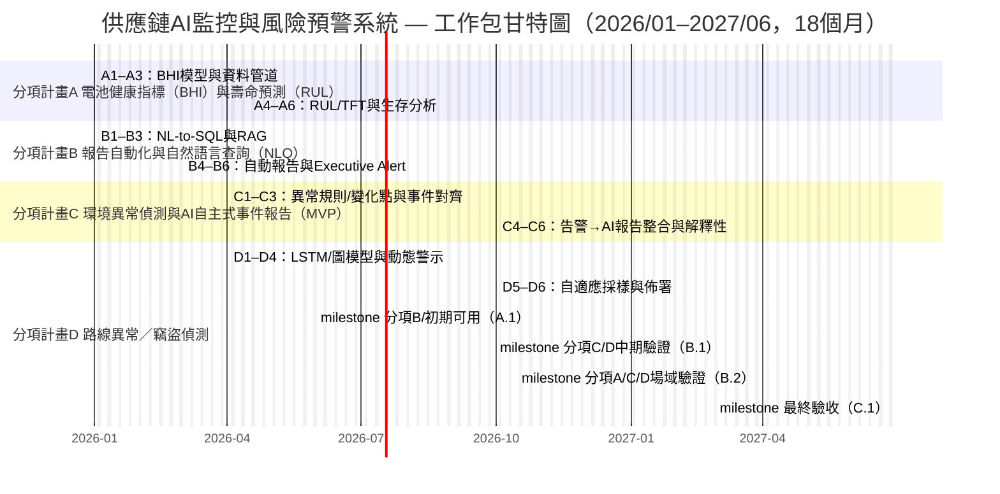

# Ministry of Economic Affairs Technology R&D Project

## A+ Enterprise Innovation R&D Acceleration Program

## AI Application Enhancement Program Proposal (Submission Version)

**AI智慧供應鏈風險預測與通訊整合應用系統開發計畫**  
**Project Period: From 2026/01/01 to 2027/06/30**

Company Name: ItracXing 準旺科技股份有限公司  
Project Management Unit: Taipei Computer Association

---

## Project Summary Table

### General Information (Amount in NT$1,000)

- **Project Title:** AI智慧供應鏈風險預測與通訊整合應用系統開發計畫
- **Applicant Company Name:** ItracXing 準旺科技股份有限公司
- **Address:** Banqiao District, New Taipei City
- **Program Category:** A+ Enterprise Innovation R&D Acceleration Program — AI Application Enhancement Program
- **Project Focus:** ☑ Other (supply-chain and logistics monitoring)
- **Project Duration:** 2026/01/01 to 2027/06/30 (total 18 months)

**Project Principal Investigator**

- Name: Jeff Shuo  
- Title: CIO  
- Phone: (02) XXXX-XXXX  
- Fax: N/A  
- E-mail: jeff.shuo@itracxing.com  

**Annual Budget**


|     Year      | Government Subsidy | Company Self-Funding | Total Project Budget | Total Person-Months |
| :-----------: | -----------------: | --------------------: | -------------------: | -------------------: |
|   Year 1      |             9,000 |                 9,000 |              18,000 |                120 |
|   **Total**   |         **9,000** |             **9,000** |          **18,000** |            **120** |
| Share of Total |           50.0% |               50.0% |               100% |                    - |

**Project Contact Person**

- Name: Jeff Shuo  
- Title: CIO  
- Phone: (02) XXXX-XXXX  
- E-mail: jeff.shuo@itracxing.com  

---

## Project Abstract (within 1 page; this abstract may be made public)

### Company Overview


| Company Name | ItracXing 準旺科技股份有限公司 |
| ------------ | ------------------------------ |
| Founded      | 2020/03                        |
| Responsible Person | Dr. Chow                 |
| Core Business | AI-based supply-chain monitoring systems, IoT device management, data analytics platforms |

### Project Abstract (≤ 200 words)

Industry Alignment: Category 7 of the Eight Key Industries (electronic assembly extension: smart manufacturing / logistics and transportation).

Global demand for smart logistics monitoring and end-to-end traceability continues to grow, with the transportation and logistics market expected to reach NT$250.2 trillion by 2030. ItracXing and Swiss partner Arviem will co-develop an AI-driven smart supply-chain monitoring and risk early-warning system, focusing on four core pain points:  
1) Sensor reliability — introduce AI-based Battery Health Index (BHI) and Remaining Useful Life (RUL) prediction models to enable predictive maintenance, improving reliability from 90% to ≥95%;  
2) Timely reporting — adopt Natural Language Query (NLQ) and multi-agent semantic orchestration to autonomously generate weekly/monthly reports and anomaly summaries, significantly shortening manual compilation and reducing risk response time by 40%;  
3) Environmental risk — use temperature/humidity anomaly detection plus AI-autonomous alert-triggered AI reports as the MVP, with defined report Service Level Agreement (SLA, P95 ≤ 2 minutes) and early-warning rate targets;  
4) Route and theft detection — fuse GPS, geo-fencing, and lock/pressure sensing (sensor fusion) to reduce false alarms and enhance security. Expected outcome: anomaly detection accuracy improved by 30%.

### Expected Outcomes at Project Completion (Summary)

Below are the core KPIs and target values under five benefit categories. Detailed quantitative methods, validation protocols, and KPI tracking are provided later in “V. Expected Benefits”, the KPI tables, and validation agreements.

| Category | Core KPI (Summary) | Target / Outcome |
|---------|--------------------|------------------|
| Technical | Improved anomaly detection accuracy; BHI/RUL prediction accuracy; reduced query response time; scalable edge–cloud collaborative architecture | +30% accuracy; RUL MAE ≤ 10 days; response time -40%; scalable architecture |
| Business | Reduced manual reporting hours; higher customer satisfaction; reduced theft, cargo damage, and claims; enhanced global competitiveness | ≥200 hours/month reduction in report labor; higher NPS; reduced cargo loss; differentiated offerings for export |
| Industrial | Cross-domain talent development; international academic–industry collaboration | Demonstration cases; deployment site replication; ≥ 6 talents developed; international collaboration network |
| IP / Export | Patents; open-source toolkits; commercializable AI models | 2–3 patents; ≥ 500 GitHub stars; SaaS/licensing models |
| Social | Higher supply-chain resilience; reduced carbon emissions; upgraded job skills; SME AI adoption best practices | Risk response time -40%; carbon emissions -10–15%; documented upskilling cases; SME adoption playbook |

(Notes) Baseline values and measurement frequencies are specified later (e.g., Availability, NLQ latency, early environmental violation warning rate, theft detection F1-score, carbon accounting, and talent development counts).

### Keywords

Supply-chain AI monitoring, explainable AI (XAI), multi-agent, IoT adaptive sampling, smart manufacturing, electronic assembly, logistics and transportation, smart logistics, Category 7 of the Eight Key Industries

---

## Proposal Table of Contents (per required format)

I.   Project Participants Summary    Page  
1.   Primary Applicant Company (for joint applications, each company shall fill separately)  
2.   AI R&D Capabilities of the Applicant and Cooperating Units  

II.  Project Content and Implementation Method  
1.   Project Background and Industry Pain Points  
2.   AI Adoption Plan  
3.   Implementation Strategy for AI Adoption  
4.   Project Timeline and Milestones  
5.   Expected Benefits  
6.   Risk Assessment and Mitigation Measures  
7.   Intellectual Property Rights  

III. R&D Team Description  
1.   Principal Investigator’s Background  
2.   Project Manpower Statistics  
3.   Project Personnel CVs  

IV.  Project Budget Requirements  
1.   Budget by Category  
2.   Overall Budget Allocation Table  
(Page numbers will follow the final print-ready version.)

---

## I. Project Participants Summary

[Summary] This section describes the applicant’s positioning, R&D capacity, and partners, emphasizing core capabilities in supply-chain AI monitoring and foundations for international scaling, which underpin subsequent execution plans and KPI design.

### 1. Primary Applicant Company

**Company Profile (per template)**

- **Basic Information**

  - Company Name: ItracXing 準旺科技股份有限公司  
  - Date of Incorporation: 2020.03.15  
  - Industry Category: Information Services (Category J; computer systems design)  
  - Top Three Shareholders / Ownership: Founders 60%, technical team 25%, strategic investors 15%  
  - Total R&D Staff / Total Employees: 12 / 15  
  - 2024 Paid-in Capital (NT$1,000): 10,000  
  - 2024 Revenue / R&D Expenditure (NT$1,000): 15,000 / 8,000  

- **Business Model**

  - Core Competencies: AI-driven supply-chain monitoring, IoT device management, adaptive sampling / dynamic thresholds, explainable AI (XAI)  
  - Revenue Streams: AI-MaaS subscription, AI consulting, customized development  
  - Channels: Direct sales, strategic partners (Arviem), online platforms  
  - Key Customers: Arviem AG and others  
  - Major Cost Items: R&D manpower (60%), cloud resources (25%), operations (15%)  
  - Key Partners: Arviem  
  - International Export Track Record: Jointly developing global markets with Arviem  
  - Inclusive Workplace Strategy: Gender ratio ≥ 1/3, additional female R&D hires, flexible hours / remote work

### 2. AI R&D Capabilities of Applicant / Partners

- **ItracXing 準旺科技**: Expertise in LangChain-based multi-agent architectures, learning-to-rank and cost-sensitive learning, Kalman filtering, Large Language Model (LLM) integration, Next.js full stack, and IoT system integration.

### 3. Competitive Landscape and Technical Advantages

#### (1) International Competitor Comparison

| Category            | Typical Player Positioning                        | Main Strengths              | Current Gaps                                                                 | Advantages of This Project                                                                                                       |
|---------------------|---------------------------------------------------|-----------------------------|------------------------------------------------------------------------------|----------------------------------------------------------------------------------------------------------------------------------|
| Global digital freight / visibility platforms | Integrate booking, customs declaration, and tracking | Mature platforms, large customer base | Limited integration of IoT sensor data and AI prediction; NLQ often limited to static queries | Focus on “smart containers + sensors” for BHI/RUL, environmental early warning, and route anomaly detection; NLQ supports direct querying of anomalies and supply-chain risks |
| Sensor / device vendors | Provide temperature/vibration/location sensors and platforms | Diverse hardware, rich deployment experience | Software is mostly rule-based alerting, lacking explainable AI and cross-ship / cross-route learning | Use Kalman filtering + deep time-series models to build explainable BHI/RUL and violation risk prediction, emphasizing transparency and auditability                     |
| Cloud data and BI platforms | Data warehousing and dashboards           | High generality and scalability | Require heavy customization to support detailed logistics IoT schemas and SOPs | Center on a “logistics IoT semantic layer + NL-to-SQL” that embeds container, bay, route semantics, reducing customization overhead                                  |

#### (2) Technical Innovation and Differentiation  

1. **From single-point alerts to predictive sensor health management (BHI/RUL)**  
   - Combine Kalman filtering and deep time-series models (e.g., LSTM, TFT) to build BHI (Battery Health Index) and RUL (Remaining Useful Life). The system not only reports “failed or not” but also “when it is likely to fail”.  
   - Compared with simple voltage-threshold schemes, the approach considers temperature, usage patterns, and transmission frequency to reduce misjudgment and extend sensor lifespan.

2. **From static dashboards to “ask a question, get an answer” via NLQ and a domain semantic layer**  
   - Design a logistics-specialized semantic layer (Shipment, Lane, Container, Event, etc.) and use NL-to-SQL to safely transform natural language queries into structured queries.  
   - Aggregate BHI, violations, route anomalies, and SLA KPIs so executives can directly ask, for example, “What is the trend of temperature/humidity violations on European lanes this quarter?” rather than manually assembling reports.  
   - Use tool-constraint and refusal mechanisms to prevent hallucinations and unauthorized access, balancing usability and governance.

3. **Layered environmental and route anomaly detection to reduce false alarms**  
   - For temperature/humidity-sensitive goods, use “change-point + thresholds + event alignment” as the MVP solution for anomaly detection and AI-autonomous incident reporting, with a defined report SLA (P95 ≤ 2 minutes) and early-warning KPI.  
   - Route anomaly detection combines GPS, dwell patterns, and weather/traffic context to distinguish “reasonable delays” from “suspicious detours/theft risks”, prioritizing truly high-risk cases.

4. **Taiwan-first AI Logistics MaaS architecture: replicable, verifiable, and scalable**  
   - Architect the system as modular “AI Function XaaS” (BHI/RUL, environmental early warning, route anomaly, NLQ reporting) so domestic small and medium logistics, warehousing, and cold-chain operators can adopt it incrementally.  
   - All models and decision processes maintain full audit trails to meet EU/GDPR and international customer audit requirements, emphasizing explainable, traceable AI governance.

---

#### (3) Market Entry and Taiwan Deployment Strategy  

1. **Leverage existing international projects to benefit Taiwan field sites**  
   - Use existing international customer projects as the first source of data and model validation, quickly building model accuracy and real-world cases.  
   - In parallel, build small-scale pilots in Taiwan (e.g., 1–2 local freight forwarders / warehouses, several dozen smart containers / pallets).

2. **Enter via “high-value, high-risk cargo” segments**  
   - Prioritize commodities like coffee beans, food ingredients, and precision components, which are highly sensitive to temperature/humidity and where damage and claims are costly.  
   - Demonstrate quantifiable ROI through reduced damage and claims and more accurate Estimated Time of Arrival (ETA) and risk alerts.

3. **Combine platformization with licensing models**  
   - In the short term, adopt SaaS/MaaS subscriptions (priced by device count, container count, or query volume) to lower the adoption threshold.  
   - In the medium to long term, provide model licensing and white-label offerings, enabling Taiwanese system integrators and telecom operators to embed the technology in their 5G/AI solutions and build a local ecosystem.

4. **International collaboration and Taiwan’s value proposition**  
   - Collaborate with international academia and industry partners (e.g., European logistics partners and universities) to jointly publish papers and evidence-based reports, increasing Taiwan’s visibility in “AI + logistics”.  
   - All core models and platform components will be developed in Taiwan, with operations and support teams based locally, ensuring technology and talent remain rooted in Taiwan.

---

## II. Project Content and Implementation Method

[Summary] This section derives AI solutions and work packages from industry pain points, clearly linking “Pain Point → Solution → Milestone → KPI” and reinforcing data governance and cybersecurity so that outcomes are measurable and traceable.

### 1. Project Background and Industry Pain Points

This project focuses on four core pain points in smart logistics that directly affect operational reliability, decision efficiency, and customer experience. Each is addressed by a dedicated work package A–D:

### **Pain Point 1 | Insufficient sensor reliability (battery degradation, environmental interference, data interruption)**

Most sensors currently report data at fixed intervals, lacking prediction of battery health and remaining lifetime. When sensors go offline due to battery depletion, signal attenuation, or environmental interference, issues are often discovered only after data interruption or incidents occur. This leads to monitoring blind spots, traceability difficulties, and higher maintenance costs.  
→ **Need:** Introduce BHI and RUL prediction models to build predictive sensor health management and preventive maintenance, and integrate with work package B’s AI-autonomous incident reporting to improve system availability (corresponding to work package A).

### **Pain Point 2 | Reporting is time-consuming and non-interactive (manual aggregation, delayed decisions)**

Report generation often requires manual cross-system aggregation of sensor time-series data, GPS trajectories, door events, and environmental records, then manual compilation in Excel or slide decks. This can take hours to days and is prone to inconsistencies across versions or interpretations, causing decision delays. Management cannot query key information via natural language, creating information gaps and efficiency bottlenecks.  
→ **Need:** Deploy AI-autonomous incident reporting and an NLQ platform to automate data aggregation, surface insights quickly, and support interactive real-time querying (corresponding to work package B).

### **Pain Point 3 | Environmental risk for sensitive goods is hard to capture in time (humidity changes, weak root-cause analysis)**

For humidity-sensitive goods (e.g., coffee beans, food ingredients, precision components), prolonged exposure to high humidity or sharp fluctuations during transport and storage can cause mold, quality degradation, scrappage, and dispute over claims. Most current systems only provide post-hoc humidity charts, lacking timely alerts, root-cause cues, and concise actionable event descriptions. This makes it difficult to intervene in time.  
→ **Need:** Build temperature/humidity anomaly detection and AI-autonomous alerting, integrated with AI-autonomous incident reporting to shorten anomaly notification, interpretation, and traceability cycles (corresponding to work package C).

### **Pain Point 4 | Route detours and suspected theft are not identified in real time (GPS deviation, manual interpretation)**

Current transport monitoring mainly relies on post-hoc review of GPS records or manual judgment, making it hard to distinguish “reasonable detours due to weather/traffic” from “suspicious detours / abnormal stops”. Unauthorized container or box openings are often discovered only upon warehouse arrival, missing the window for timely intervention.  
→ **Need:** Establish route anomaly and theft detection models combining GPS/NTN trajectories, geo-fencing, pressure/lock events, and external weather/traffic data to detect deviations, abnormal dwell, and unauthorized openings in real time, reduce false alarms, and improve detection accuracy. Integrate with AI-autonomous incident reporting to enhance investigation efficiency (corresponding to work package D).

This project addresses these four pain points through work packages A–D with corresponding AI solutions and measurable KPIs, systematically enhancing smart logistics reliability, safety, and international competitiveness.

### 2. AI Adoption Plan  

[Description] This section explains how the project maps the four industry pain points to work packages A–D, the underlying AI technologies, deployment objectives, and before/after effects, as well as data governance and cybersecurity mechanisms to ensure results are measurable and auditable.

### (1) Target AI Technologies: Pain Point → Work Package → AI Solution

| Industry Pain Point | Corresponding Work Package | Key AI Technologies | Objective and Target Outcome |
| --- | --- | --- | --- |
| **Pain Point 1: Insufficient sensor reliability (battery degradation, environmental interference, data loss)** | **A. Sensor reliability optimization** | Battery health prediction (SOH/BHI), remaining useful life (RUL) prediction, predictive maintenance models | Use AI-based BHI/RUL models to establish predictive maintenance, detect battery degradation and failure risk early, raise sensor reliability from **90% → 95%+**, and enable intelligent maintenance scheduling. |
| **Pain Point 2: Time-consuming, non-interactive reporting (manual aggregation, delayed decisions)** | **B. On-demand reporting and real-time queries (NLQ)** | Natural Language Query (NLQ), NL-to-SQL, LLM-based report generation | Allow management and operations staff to issue natural language queries for data and reports, reducing report generation from **“manual, hours” to “automatic, seconds”**, with NLQ P95 latency < 180 seconds and query accuracy ≥ 90%. |
| **Pain Point 3: Hard-to-capture risk for environmental-sensitive goods (humidity variation, weak root-cause analysis)** | **C. Environmental anomaly detection and AI-autonomous incident reporting** | Change-point / statistical-threshold anomaly detection, multivariate time-series models, event alignment (box open/close / route segments) | Centered on Smart TOTE temperature/humidity and box open/close events, detect prolonged exceedances and sharp fluctuations, align with route segments, and trigger AI-autonomous incident reports. Targets: **early warning rate ≥ 70%, report SLA (P95) ≤ 2 minutes**, enabling early risk management and root-cause tracing, reducing damage and claim risks. |
| **Pain Point 4: Route detours and suspected theft not detected in real time (GPS deviation, manual judgment)** | **D. Route anomaly and theft detection (Smart TOTE)** | GPS/NTN spatiotemporal trajectory modeling, geo-fence behavior analysis, lock/pressure anomaly detection, weather/traffic context modeling | Use Smart TOTE **GPS/LTE/NTN data + BLE padlock/pressure sensors**, plus weather and traffic data, to distinguish “reasonable delays” from true anomalies, and detect **detours, suspicious dwell, and unauthorized box openings/theft**. Targets: **detection F1 ≥ 0.85, ETA MAE improvement ≥ 25%, alert false-positive rate ≤ 15%, critical alert response time < 30 minutes**, directly addressing the inability to identify risks in real time (Pain Point 4). |

> Smart TOTE features BLE padlocks, pressure sensors, and GPS/LTE/NTN connectivity to track box open/close status, lock state, and routes in real time.  
> Source: (V5.0.X) iTX Smart TOTE Specification

---

### (1-2) International State of the Art (SOTA) vs. Project Targets

To highlight technical strengths and verifiability, this section lists three key metrics and compares typical international practice (from literature and industry reports) with this project’s targets. All target values are aligned with the KPI tables provided later. International figures are ranges aggregated from public studies and large supply-chain platforms for reference.

#### ① BHI / RUL Battery Health and Lifetime Prediction

| Metric | Typical Current / International Level (Reference) | Project Target (KPI) | Notes |
| --- | --- | --- | --- |
| Sensor reliability (Availability) | Approx. 85–90% (mostly reactive maintenance with post-failure replacement) | **≥ 95%** | With BHI/RUL-based predictive maintenance, reliability improves through condition monitoring and early alerts, reducing unplanned downtime. |
| BHI health status prediction accuracy | Many international battery health studies achieve approx. 80–88% in practice | **≥ 90%** | Use LSTM/TFT plus Kalman filtering to build BHI, targeting ≥ 90% accuracy, above typical public results (~80%+), with explainable outputs. |
| RUL prediction error (MAE) | Real-world battery RUL studies often consider 10–20 days MAE acceptable | **≤ 10 days** | Use survival analysis plus time-series models to predict RUL and keep MAE within 10 days, on par with or better than published results. |

#### ② Environmental Risk and Early Warning for Sensitive Goods (Pain Point 3)

| Metric | Typical Current / International Level (Reference) | Project Target (KPI) | Notes |
| --- | --- | --- | --- |
| Environmental anomaly detection F1-score | Cold-chain monitoring solutions using threshold + rule-based methods typically achieve F1 of 0.7–0.8 | **≥ 0.88** | Use change-point detection plus Kalman filtering / LSTM-based multivariate models for denoising and short-term forecasting, aligned with box events and route segments, to reach F1 ≥ 0.88, surpassing threshold-based approaches. |
| Violation / anomaly early-warning rate | Often “post-hoc” or alarm only at threshold crossings, with early warning < 30% | **≥ 70%** | Use Kalman / LSTM short-term forecasting (30–60 minutes look-ahead) to trigger alerts at least 30 minutes before expected cold-chain violations, with AI-autonomous incident reports providing interpretation, aligning directly with Pain Point 3. |
| Incident report SLA (P95) | Typically “hours” due to manual compilation and email notification | **≤ 2 minutes (end-to-end)** | Directly trigger AI-autonomous incident reports and push notifications from anomaly detection, significantly shortening time to notify. |

#### ③ Route Detours / Theft Detection and ETA Prediction (Pain Point 4)

| Metric | Typical Current / International Level (Reference) | Project Target (KPI) | Notes |
| --- | --- | --- | --- |
| Route deviation detection AUC | Logistics and connected-vehicle route anomaly models using only GPS features often report AUC of 0.80–0.88 | **≥ 0.90** | Combine LSTM and graph models with weather/traffic context to raise AUC to ≥ 0.90, meeting higher-end recent research benchmarks. |
| Theft / unauthorized opening F1-score | Often handled via access control or manual logs; few public F1 metrics, mostly case-based | **≥ 0.85** | Use Smart TOTE’s BLE padlock + pressure sensors and behavioral modeling to set a clear measurable target of F1 ≥ 0.85. |
| ETA prediction error (MAE) | International container and trunk transport ETA models often achieve MAE of 1.5–3 hours | **≥ 25% improvement** | Use historical routes plus real-time traffic/weather to reduce existing ETA MAE by ≥ 25%, consistent with or better than international practice. |

These metrics will be validated through the technical verification agreements, third-party testing, and deployment-site validation reports, and will be included in milestones B.1/B.2, ensuring “technical superiority” is supported by quantitative comparisons against international SOTA.

---

### (2) Before-and-After Comparison (Including Smart TOTE)

| Item | Before (Current Issues) | After (Expected Outcomes) |
|------|-------------------------|---------------------------|
| **Sensor reliability and intelligent maintenance (Pain Point 1 / Work Package A)** | Battery degradation and sensor offline events cannot be predicted; frequent “data gaps and costly re-measurement” make anomaly interpretation difficult and raise maintenance costs. | AI-based BHI/RUL models enable predictive maintenance to detect degradation and failure risk early. **Availability improves to ≥ 95%, RUL MAE ≤ 10 days, data completeness ≥ 95%**, reducing unplanned downtime and maintenance cost. |
| **Reporting and decision efficiency (Pain Point 2 / Work Package B)** | Reports require manual data aggregation; common queries follow “email/ticket → wait hours to days”; decisions are delayed and query/audit behavior is hard to trace. | NLQ and auto-reporting provide natural-language access. **Report generation is reduced from hours to < 45 seconds** (initial M1–M6 target), with full query audit trails. Supports executive summaries and routine weekly/monthly reports. |
| **Environmental violations and quality risk for sensitive goods (Pain Point 3 / Work Package C)** | Mostly “post-hoc review” with limited real-time alerts or concise explanations; difficult to quickly interpret causes or actions; early intervention windows are missed. | Use change-point / threshold rules plus simple heuristics to detect temperature/humidity anomalies aligned with box events and route segments. Automatically trigger work package B’s AI-autonomous incident reports and push notifications, including “incident summary + recommended actions”. **Early-warning rate ≥ 70%, violation rate reduced by ≥ 30%, incident report SLA (P95) ≤ 2 minutes**. |
| **Route detours, reasonable delays, and theft risk (Pain Point 4 / Work Package D)** | Heavily reliant on post-hoc GPS review; hard to separate weather/traffic-induced delays from suspicious behavior; unauthorized openings and lock tampering are often discovered only afterward. | Use GPS/NTN spatiotemporal models and **weather/traffic context** to build route prediction and anomaly detection, combined with Smart TOTE **BLE padlock/pressure sensors** for unauthorized opening detection. The system labels “reasonable delays (weather/traffic)” vs. “suspicious detours/dwell/illegal opening” in real time. Targets: **F1 ≥ 0.85, alert false-positive rate ≤ 15%, critical alert response time < 30 minutes**. |

### (3) Information Security and Data Governance (Compliance Mechanisms)

- Data classification and sources: internal (device time-series/events), external (weather/traffic/geospatial); maintain data catalogs and lineage.  
- Access control: role-based and attribute-based least-privilege (RBAC/ABAC), read-only whitelists, audit logs retained for ≥ 1 year.  
- Personal/sensitive data: de-identification/ anonymization (hashing/masking); use regional deployments and federated learning (FL) for cross-border data.  
- Compliance framework: GDPR and Data Protection Impact Assessment (DPIA), third-party security scans (SAST/dependency scanning), periodic vulnerability scans and disaster-recovery drills (quarterly).  
- Audit and versioning: data version control, model versioning/rollback, and full traceability of query routing and model outputs.

---

### 3. Implementation Strategy for AI Adoption

This section consolidates deployment sites, international collaboration, and execution strategy for work packages A–D as the basis for timelines and milestone design.

[Summary] Work packages A–D are organized around the pain points, each with clear milestones; international cooperation strengthens deployment-site validation and export readiness; KPIs are aligned with milestones to ensure ROI.

### (1) Deployment Sites, Validation Scope, and Adoption Method

- **Validation Focus by Work Package**

  - **Work Package A (M1–M11) | Smart sensor reliability optimization**  
    - BHI stability (compare variance across 3 distinct data batches)  
    - RUL prediction error MAE ≤ 10 days  
      (validated using a 20% hold-out test set)  
    - Post-denoising SNR improvement ≥ 20%  
      (measured by comparing pre-/post-processing signals from the same sensor)  
    - Sensor data completeness ≥ 95%, availability ≥ 95%  
      (based on 30 consecutive days of data)

  - **Work Package B (M1–M5) | NLQ and AI-autonomous report generation**  
    - NLQ accuracy ≥ 90%  
      (based on ≥ 200 labeled queries vs. human gold answers)  
    - NLQ latency P95 < 180 seconds  
      (under stress tests of 500–1,000 queries)  
    - AI-autonomous report completion rate ≥ 95%  
      (based on ≥ 100 auto-generated reports compared to manual versions)  
    - Manual reporting hours reduced by ≥ 70%  
      (comparing baseline with post-deployment time tracking)

  - **Work Package C (M4–M15) | Environmental anomaly detection and AI-autonomous reporting (MVP)**  
    - Temperature/humidity anomaly detection F1 ≥ 0.88  
      (evaluated on a labeled incident dataset)  
    - Violation/anomaly early-warning rate ≥ 70%  
      (alerts at least 30 minutes before violation; external features added if needed)  
    - Incident report SLA (P95) ≤ 2 minutes  
      (end-to-end from anomaly → report generation → push delivery)

  - **Work Package D (M4–M15) | Route anomaly and theft detection (Smart TOTE)**  
    - Route deviation detection AUC ≥ 0.90  
      (validated on at least 20 real route anomaly cases)  
    - Theft / unauthorized opening alert F1 ≥ 0.85  
      (based on BLE, pressure, light, and open events)  
    - ETA prediction error MAE ≤ 15 minutes  
      (using real transport historical data and a test set)  
    - Open/pressure event detection accuracy ≥ 95%  
      (based on ≥ 50 open/close test rounds)

### (2) Work Packages

#### Work Package A | Smart Sensor Reliability Optimization

Objective: raise sensor reliability from around 90% and reduce unplanned outages by building AI-based BHI and RUL models for predictive maintenance.

**A1. Objectives & Success Criteria**  
- Availability ≥ 95%; RUL MAE ≤ 10 days; BHI prediction accuracy ≥ 90%; data completeness ≥ 95%.

**A2. Data Acquisition & Preparation**  
- Use device voltage, temperature, transmission frequency, and maintenance logs; complete missing values and derive health trends.

**A3. Dataset Construction**  
- Integrate historical data and event labels (failure/maintenance) into traceable training and validation sets.

**A4. Modeling & Training**  
- Apply time-series deep learning (e.g., RNN, LSTM, Temporal Fusion Transformer (TFT)) to learn discharge curves and voltage degradation patterns and derive the BHI.  
- Use **Kalman filtering** for signal denoising and state estimation to suppress environmental noise and sensor reading artifacts.  
- Apply **survival analysis** (e.g., Cox proportional hazards, Kaplan–Meier estimators) for RUL prediction, handling right-censoring and uncertainty.  
- Combine with simple rules and thresholds to ensure stable, deployable outputs.

**A5. Evaluation & Optimization**  
- Evaluate primarily via accuracy and prediction error, with concise, explainable result summaries.

**A6. Deployment & Demonstration**  
- Provide BHI/RUL APIs and dashboards to support predictive maintenance scheduling, timely alerts on health changes, and optimized maintenance decisions.

#### Work Package B | On-Demand Reporting and NLQ

Enable management and operations teams to obtain insights via natural language in real time, and to auto-generate weekly/monthly and priority alert reports.

**B1. Objectives & Success Criteria**  
- Reporting time reduced by ≥ 50%; NLQ P95 latency < 180 seconds; accuracy ≥ 90%.

**B2. Data Acquisition & Preparation**  
- Build metric semantic layers and data dictionaries; integrate time-series/events and external summaries.

**B3. Dataset Construction**  
- Consolidate a library of common query patterns and report templates; maintain a data catalog.

**B4. Modeling & Training**  
- Connect to databases via whitelisted, read-only access, restricting query scope and avoiding hallucinated numeric facts.  
- Implement an Executive Report Agent (multi-agent orchestrator) that composes metric extraction → semantic summarization → anomaly explanation → recommended actions, supporting multi-turn follow-up queries and context retention.

**B5. Evaluation & Optimization**  
- Monitor accuracy and latency, enforce refusal and audit mechanisms, and continuously refine templates.

**B6. Deployment & Demonstration**  
- Deploy NLQ APIs, interactive dashboards, and an Executive Auto-Report Agent for periodic reports; support executive summaries plus interactive Q&A (follow-up / drill-down); integrate with work packages C/D so anomalies can directly trigger report generation and push delivery (Alert → Report pipeline).

#### Work Package C | Environmental Anomaly Detection and AI-Autonomous Incident Reporting (MVP)

Focus initially on temperature/humidity-sensitive goods (e.g., coffee beans) with an MVP of “anomaly detection + alert → AI report” to quickly provide actionable summaries and recommendations. Expand external features and prediction models as needed to improve early-warning performance.

**C1. Objectives & Success Criteria**  
- Temperature/humidity anomaly detection F1 ≥ 0.88; early-warning rate ≥ 70%; incident report SLA (P95) ≤ 2 minutes; violation rate reduced by ≥ 30%.

**C2. Data Acquisition & Preparation**  
- Use temperature/humidity (T/H), box open/close events, and location/route-segment information as core features.

**C3. Dataset Construction**  
- Create labeled anomaly datasets (long-duration exceedances, short-term sharp fluctuations) aligned with loading/unloading/open/close events on the time axis, preserving full audit trails.

**C4. Modeling & Training (MVP → Extended)**  
- MVP: change-point detection (e.g., CUSUM, BOCPD, rolling IQR), statistical thresholds, and simple rules; event alignment and labeling (e.g., pre-loading, in-transit environment, frequent openings).  
- Extended: introduce multivariate time-series models (e.g., LSTM/GRU/TFT) and external features as needed to enhance early-warning and explainability.

**C5. Evaluation & Optimization**  
- Monitor anomaly detection F1, early-warning rate, false-positive rate, and report SLA; establish drift monitoring and periodic retraining strategies.

**C6. Deployment & Demonstration**  
- Trigger work package B’s AI-autonomous incident reports upon anomalies (reusing templates) and push summaries via email (time window, affected batches, aligned evidence, suggested actions). Dashboards provide one-click drill-down and NLQ jumps (C×B integration).

#### Work Package D | Theft Detection and Route Monitoring

Use route deviation, suspicious dwell, and external context modeling to detect potential detours and theft while optimizing alert prioritization.

**D1. Objectives & Success Criteria**  
- Detection AUC ≥ 0.90; F1 ≥ 0.85; ETA MAE improvement ≥ 25%; alert false-positive rate ≤ 15% (including filters for weather/traffic delays); critical alert response time < 30 minutes.

**D2. Data Acquisition & Preparation**  
- Use GPS locations, speed, stops, and external traffic/weather summaries.

**D3. Dataset Construction**  
- Segment trips, label anomalies, and add road-network features.

**D4. Modeling & Training**  
- Use **time-series models (LSTM/GRU)** to analyze GPS trajectories and motion patterns, detecting deviations, abnormal dwell, and speed anomalies.  
- Apply **graph neural networks (GNNs)** to model road-network relationships and traffic flows, integrating **weather and traffic context** to differentiate reasonable delays from suspicious detours.  
- Implement a **dynamic alert prioritization mechanism** using **learning-to-rank (LTR)** and cost-sensitive learning to score alerts by risk level, historical patterns, and real-time context.  
- Integrate **Smart TOTE BLE padlock and pressure sensors** to detect unauthorized openings.  
- Implement **adaptive thresholding** by route, time-of-day, and cargo type to reduce false positives.

**D5. Evaluation & Optimization**  
- Track AUC/F1 and latency; conduct A/B tests against baseline rule-based systems.

**D6. Deployment & Demonstration**  
- Provide anomaly/theft alert services, route playback, and root-cause analysis; integrate with a Multi-Agent Control Plane (MCP) for cross-work-package orchestration.

### (3) International Collaboration Benefits

ItracXing (Taiwan) will lead the project, partnering with Arviem AG (Switzerland).

- Collaboration Scope:  
  - Arviem: global deployment sites, IoT devices and data access, joint validation, and customer onboarding (export value).

- Value for Taiwan:  
  - International cooperation showcase: position Taiwan as the technical hub and establish an “AI-MaaS for Logistics” export pathway.  
  - Talent and technology upgrading: two-way exchange between academia and industry, bringing in practical experience with GDPR, EU AI Act, and related global compliance frameworks.

---

### 4. Project Timeline and Milestones

The Gantt chart and the subsequent “Planned Progress and Milestones” and “AI Function–Milestone–KPI Mapping” are aligned through unified milestone codes A.1 / B.1 / B.2 / C.1.

### Gantt Chart (2026/01–2027/06, 18 Months; Work-Package View)



### Planned Progress and Milestones

#### Planned Progress (Year = Fiscal Year; at least one milestone every 6 months)

- 2026/01–2026/05 (M1–M5; Milestone A.1)  
  - Objective: Initial availability of work packages A/B  
  - Main Deliverables:  
    - Work Package A: BHI data pipeline and denoising flow completed (A1–A3); initial BHI/RUL model built  
    - Work Package B: NL-to-SQL and RAG base functions implemented (B1–B3); early prototype of auto-reporting and Executive Alert (B4–B6 initial phase)  
  - Milestone: A.1 (end of 2026/05)

- 2026/04–2026/09 (M4–M9; Milestone B.1)  
  - Objective: Mid-stage models for work packages C/D  
  - Main Deliverables:  
    - Work Package C: anomaly rules/change-point detection and event alignment completed (C1–C3); alert → AI report integration functional with target F1/SLA achieved in test environments  
    - Work Package D: LSTM/graph-based route anomaly / theft detection models completed (D1–D4); dynamic alert logic running in test sites  
  - Milestone: B.1 (end of 2026/09)

- 2026/04–2027/03 (M4–M15; Milestone B.2)  
  - Objective: Field validation for work packages A/C/D  
  - Main Deliverables:  
    - Work Package A: BHI/RUL models running continuously in real deployment sites with availability and MAE achieving targets  
    - Work Package C: environmental anomaly detection meeting early-warning and SLA targets in deployment sites  
    - Work Package D: route anomaly/theft detection A/B tested on real logistics routes, with F1 and ETA MAE improvement meeting targets  
  - Milestone: B.2 (end of 2027/03)

- 2027/01–2027/06 (M13–M18; Milestone C.1)  
  - Objective: Overall integration and final acceptance (A–D fully integrated and in production)  
  - Main Deliverables:  
    - End-to-end cross-module integration and stability validation completed; data synchronization success rate ≥ 98%  
    - Final acceptance tests and production deployment completed; service availability ≥ 99.5%  
    - Final technical documentation and acceptance reports delivered  
  - Milestone: C.1 (end of 2027/06)

### Milestone Descriptions

- **A.1 (end of 2026/05) — Initial availability of work packages A/B**:

  - Initial BHI/RUL model built, RUL MAE ≤ 15 days  
  - Anomaly detection accuracy ≥ 85%; Kalman-based SNR improvement ≥ 20%  
  - MCP database integration completed, supporting real-time queries  
  - Auto-reporting and executive alerting system online  
  - Deliverables: system prototype, technical documents, test reports  

- **B.1 (end of 2026/09) — Mid-stage for work packages C/D**:

  - Alert-optimization models trained, F1-score ≥ 0.85  
  - Deliverables: model training reports, initial validation results  

- **B.2 (end of 2027/03) — Field validation for work packages A/C/D completed**:

  - BHI/RUL prediction accuracy meets targets (RUL MAE ≤ 10 days, BHI accuracy ≥ 90%)  
  - Alert false-positive rate ≤ 15% (including rational delay filters for weather/traffic; ≥ 40% reduction vs. baseline)  
  - Predictive maintenance mechanism validated in both lab and deployment sites  
  - Field validation report completed  
  - Deliverables: field test datasets, BHI/RUL performance report, predictive maintenance benefit analysis  

- **C.1 (end of 2027/06) — Overall completion and acceptance**:

  - End-to-end cross-module integration completed; data synchronization success rate ≥ 98%  
  - Production deployment completed; API documentation finalized  
  - Service availability ≥ 99.5%; integration defects show a sustained downward trend  
  - Final acceptance test and closure documentation completed
  ### Milestones, Disbursement, and Decision Gates

  To ensure execution quality and controllability, the project adopts a **milestone-based disbursement** mechanism and sets a **Go/No-Go decision gate at M15**.

  #### Disbursement Schedule (Mapped to Milestones and Work-Packages)

  | Milestone        | Period  | Key Milestones (Work-Packages)                                           | Disbursement Ratio | Amount      | Retention |
  |------------------|---------|---------------------------------------------------------------------------|--------------------|-------------|-----------|
  | Milestone A (A.1) | M1–M5  | WP B initial availability + WP A data pipeline / denoising               | 40%                | 3,600K      | —         |
  | Milestone B (B.1/B.2) | M4–M15 | WP C/D models & validation + WP A RUL / lifetime extension             | 35%                | 3,150K      | —         |
  | Milestone C (C.1) | M13–M18 | Overall final acceptance and production deployment (cross-WP integration) | 20%                | 1,800K      | 5% (450K)* |
  | Final Acceptance | M18+    | Pass final acceptance tests                                               | 5%                 | 450K        | —         |
  | **Total**        | —       | —                                                                         | **100%**           | **9,000K**  | —         |

  \*The final 5% retention will be disbursed after passing acceptance tests and submitting patent applications and technical documentation.

  #### Key Decision Gate: M6 Go/No-Go Review (Indicators Linked to WP A / B / D)

  At M6 (June 2026), a **major review** will be conducted. At least **3 out of 4 indicators** must be achieved to continue subsequent work-packages:

  | Indicator                      | Target       | Minimum Pass Threshold | Verification Method                  |
  |-------------------------------|-------------|------------------------|--------------------------------------|
  | 1. Anomaly detection accuracy | ≥ 90%       | ≥ 85%                  | Test-set evaluation report           |
  | 2. Kalman SNR improvement     | ≥ 20%       | ≥ 15%                  | Real-data before/after comparison    |
  | 3. Arviem deployment agreement | Signed      | LOI confirmed          | Cooperation agreement or LOI         |
  | 4. Patent filing progress     | 1 filed     | 1 in draft/pre-filing  | Filing documents or draft            |

  **Decision Criteria**

  - **GO**: ≥ 3 / 4 indicators achieved → continue as planned, normal disbursement.
  - **Conditional GO**: 2 / 4 achieved → improvement plan required; 10% of subsequent budget reserved; re-review at M9.
  - **NO-GO**: < 2 achieved → terminate or substantially re-scope the project; no disbursement of remaining budget.

  #### Risk Control Mechanisms

  1. **Monthly progress report**: brief progress and financial use.
  2. **Quarterly technical review**: conducted by external experts.
  3. **Flexible budget reallocation**: 600K contingency fund can be reallocated upon approval.
  4. **Manpower contingency**: if key personnel change, a replacement plan must be submitted within 30 days.

  This mechanism ensures efficient use of public funds and enables early detection and correction of issues, safeguarding project outcomes.

  ---

  ### V. Expected Benefits

  [Summary] This section presents **quantitative KPIs plus validation agreements** to demonstrate technical and operational benefits, and defines measurement methods and frequencies to ensure traceability and auditability.

  ### (New) Market Size and Value Estimation (Domestic and Global)

  1. **Global Smart Logistics and Supply-Chain Monitoring Market**

    - According to MarketsandMarkets (2023), the global smart logistics market was about **USD 260B in 2023**, and is expected to reach **USD 450B by 2028**, with a CAGR of approximately **11.7%**.
    - Statista (2023) estimates that the global “IoT in Logistics” market will reach **about USD 63.7B by 2026**, indicating sustained growth for “device + platform + analytics service” solutions.
    - This project focuses on higher value-added sub-segments within these markets: smart containers, cold-chain monitoring, route/theft detection, and ESG-oriented carbon monitoring, rather than low-margin transport services.

  2. **Taiwan Smart Logistics-Related Market**

    - The Taiwan logistics industry (traditional + smart logistics) is estimated at about **USD 40B in 2024** (IMARC Group, 2024), with increasing share of investment in cold-chain, warehouse automation, and smart monitoring.
    - For cold-chain logistics, 2023 revenue has approached **NTD 100B**, with forecast **CAGR ≈ 6.9% for 2023–2028**, reaching **NTD 120B (≈ USD 4B)** by 2028 (Taiwan Smart Agriculture Expo report, 2025).
    - Assuming, conservatively, that **AI-based smart monitoring systems** reach **5–8%** penetration in Taiwan cold-chain and high-value logistics in 3–5 years:
      - Cold-chain portion: 4B USD × 5–8% ≈ **USD 200–320M**
      - Adding high-value cargo, electronics, and other smart logistics scenarios, Taiwan’s serviceable available market (SAM) is conservatively **NTD 8–12B**.

  3. **Project Addressable Market (SAM → SOM)**

    - Business model: “IoT devices + AI-MaaS subscription,” focused on:
      - Cross-border and cold-chain transport of high-value goods (electronics, precision equipment, coffee beans, etc.);
      - Medium-to-large logistics operators and upstream brand owners with ongoing transport needs and IoT deployment willingness.
    - Arviem already serves **> 5,000 multinational customers**. If **1% (≈ 50 customers)** adopt AI-MaaS within 3 years, with a conservative **USD 12,000 annual subscription per customer**:
      - Annual service revenue ≈ 50 × 12,000 ≈ **USD 600K / year**
      - At 1 USD ≈ NTD 32, this is about **NTD 19.2M / year**
      - Three-year cumulative (no growth compounding, conservative) ≈ **NTD 57.6M**
    - Adding IoT device sales (USD 1,000 per set) and consulting/licensing income, the project’s technology can conservatively generate **> NTD 120M** of direct revenue and licensing income in 3 years, plus additional value for system integrators, telcos, and device vendors.

  4. **Direct Link Between This 18-Month Project and Value Creation**

    - This 18-month project is not aimed at full revenue realization, but at completing **3–5 core AI modules + ≥ 2 domestic/international field validations + ≥ 2 LOI/POCs**, forming the technical base for scale-up.
    - The 3-year revenue forecast is grounded on:
      1. Completion and field verification of **BHI/RUL, environmental early warning, route anomaly detection, and NLQ reporting** modules with audited metrics;
      2. Securing **≥ 2 international LOI/POC** via this project and converting to 1–2 paid pilots;
      3. Scaling from pilots to **≈ 50 international customers + 2–3 Taiwan sites** in years 2–3.
    - In the short term, the project’s value can be measured by: number of adopting customers, number of deployed devices, number of signed LOI/POC, and annualized contract value; in the long term, by the 3-year revenue and export figures. The causal link between the 18-month deliverables and mid-term value is explicit and auditable.

  ---

  ### KPI Indicators and Measurement Methods

  | KPI                      | Baseline                 | Target (End of Project) | Measurement Method                                  | Data Source                     | Frequency  |
  |--------------------------|--------------------------|-------------------------|-----------------------------------------------------|----------------------------------|------------|
  | Sensor reliability (Availability) | 90% (2024 avg.)           | ≥ 95%                  | Uptime and data completeness (daily aggregation)    | iTracXing IoT Sensor DB         | Monthly    |
  | BHI prediction accuracy  | No baseline (new model)  | ≥ 90%                  | Predicted vs. actual health status                  | WP A model                      | Quarterly  |
  | RUL prediction error (MAE) | No baseline (new model) | ≤ 10 days              | MAE between predicted and actual remaining life     | WP A model                      | Quarterly  |
  | NLQ response latency (P95) | 2–5 min (manual)       | < 45 seconds           | P95 API latency logs                                | WP B NLQ gateway logs           | Weekly     |
  | NLQ query correctness    | No baseline (new)        | ≥ 92%                  | NL-to-SQL accuracy vs. gold answers                 | WP B model                      | Quarterly  |
  | Environmental early-warning rate | 0–2 hours (current)  | ≥ 70%                  | Alert time minus actual violation time              | WP C sensor DB                  | Monthly    |
  | Incident report SLA (P95) | None (new)              | ≤ 2 minutes            | End-to-end delay from anomaly to report & push      | WP B×C event/report pipeline    | Monthly    |
  | Route deviation AUC      | None (new)              | ≥ 0.90                 | ROC–AUC on labeled dataset                          | WP D GPS/NTN time-series data   | Quarterly  |
  | Theft alert F1-score     | None (new)              | ≥ 0.85                 | Confusion matrix → F1                               | WP D GPS/NTN data               | Quarterly  |
  | ETA prediction MAE       | 1.8–3.2 hours            | ≥ 25% improvement      | Predicted vs. actual ETA                            | WP D model                      | Monthly    |
  | ESG: ineffective transport reduction | None (new)      | ≥ 10–12%               | Route distance before/after optimization            | WP D routing logs               | Semiannual |
  | ESG: cold-chain / temperature anomaly reduction | X% (2024) | ≥ 15% improvement        | Anomaly statistics                                  | WP C sensor DB                  | Quarterly  |

  ---

  ### Technical Validation Agreements

  #### BHI / RUL Prediction Accuracy Validation

  To substantiate the core value of AI-based battery health and lifetime prediction, the project defines a rigorous protocol:

  **Baseline Data Collection**

  - Devices: 100 IoT sensors
  - Environment: Arviem field deployments (sea + land)
  - Duration: 12 months
  - Collected features: voltage, temperature, transmission frequency, usage patterns, failure events

  **Model Development**

  - Training data: first 9 months
  - Validation data: last 3 months
  - Models: time-series (LSTM/TFT) + survival analysis
  - Features: health trends, environmental conditions, usage patterns

  **Prediction Validation**

  - Devices: 50 IoT sensors (independent test set)
  - Environment: multiple scenarios (land, sea, cold-chain)
  - Duration: 6 months
  - Method: compare predictions with actual failure times

  **Success Criteria**

  1. BHI prediction accuracy ≥ 90%.
  2. RUL MAE ≤ 10 days.
  3. Early-warning rate ≥ 85% (alerts within 14 days before failure).
  4. False-positive rate ≤ 15%.
  5. Independent validation and formal test report completed.

  **Timeline**

  - M1–M5: data collection and feature engineering.
  - M6–M12: model training and preliminary validation.
  - M13–M15: independent test-set validation and tuning.
  - M16–M18: field deployment and long-term monitoring.

  #### Alert Optimization Performance Validation

  **Alert Optimization Setup**

  - Baseline: fixed-threshold rules engine.
  - Target: dynamic optimization (learning-to-rank + adaptive thresholds + anomaly score fusion).
  - Dataset: 18 months of Arviem historical data.
  - A/B test: 50/50 traffic split for 3 months.

  **Comparison Metrics**

  | Metric                     | Baseline (Rules) | Target (Dynamic) | Goal      |
  |----------------------------|------------------|------------------|-----------|
  | False-positive rate        | 25%              | ≤ 15%            | −40%      |
  | False-negative rate        | 8%               | ≤ 5%             | −37.5%    |
  | F1-score                   | 0.72             | ≥ 0.85           | +18%      |
  | Critical alert response time | 60 min         | < 30 min         | −50%      |
  | User satisfaction (NPS)    | Baseline         | +20 points       | —         |

  **Deliverables**

  1. System performance test report (M15).
  2. Arviem field validation report (M18).
  3. Independent third-party test report (pre-closure).

  ---

  ### Quantified Benefits (Amounts in NTD 1,000; with Methods and Evidence)

  #### Overall KPI Summary Table

  | Indicator                                   | Baseline                            | Target (End)                     | Measurement Method                                      | Data Source                        | Frequency |
  |--------------------------------------------|-------------------------------------|----------------------------------|--------------------------------------------------------|-------------------------------------|----------|
  | Sensor reliability (Availability)          | 90% (2024 avg.)                     | ≥ 95%                            | Effective online devices ÷ total devices (daily)      | IoT monitoring system, time-series DB | Weekly / Monthly |
  | BHI prediction accuracy                    | None (baseline built in first 3 months) | ≥ 90%                         | BHI predictions vs. actual state (accuracy)           | WP A validation set                 | Quarterly |
  | RUL MAE                                    | None (rule-based baseline)          | ≤ 10 days                        | MAE between predicted and actual lifetimes            | WP A model                          | Quarterly |
  | Anomaly detection accuracy (AUC/Precision) | ≈ 70% rule-based (2024)            | +30% → ≥ ~90%                    | Independent test-set + third-party report             | Third-party validation report       | Milestones |
  | NLQ correctness                            | None (new; 500 labeled baseline)    | ≥ 95%                            | NL-to-SQL accuracy vs. gold answers                   | NLQ gateway logs, APM               | Weekly   |
  | NLQ P95 latency                            | < 180 s (stress-test baseline)      | < 180 s                          | P95 latency under 200 concurrent / 1,000 queries      | APM, load-test report               | Weekly / Monthly |
  | Incident response time                     | 45–90 min (manual)                  | −40%                             | Timestamp difference from trigger to resolution       | Event DB, alerting system           | Monthly  |
  | Environmental early-warning rate           | ≈ 0–2 hours advance                 | ≥ 70% early-warning              | Alert lead time vs. violation events                  | Field logs, sensor DB               | Monthly  |
  | Theft detection F1-score                   | None (new; pseudo-label + cases)    | ≥ 0.85                           | Confusion matrix → F1                                | GPS/NTN time-series, labels         | Milestones |
  | Reporting labor hours                      | ≈ 200 hours / month                 | −50% → ≤ 100 hours / month       | PMO timesheets                                        | PMO, Jira / timesheet system        | Monthly  |
  | Service availability                       | 99.0% (current)                     | ≥ 99.5%                          | Annual uptime ÷ total time                            | Monitoring (Grafana / Datadog)      | Weekly / Monthly |

  #### Downstream Results and Follow-On Investment

  | Outcome Item                          | Before | Year 1 | Year 2 | Evidence                            |
  |--------------------------------------|-------:|-------:|-------:|-------------------------------------|
  | Patent applications / grants         | 0      | 2      | 3      | Patent filings and status documents |
  | Follow-on investment amount          | 0      | 6,500  | 6,500  | Investment agreements and MOUs      |
  | New jobs created (persons)           | 0      | 5      | 10     | Employment contracts and HR records |
  | R&D salary uplift (%)                | –      | +10%   | +15%   | Payroll and HR records              |

  **Follow-On Investment (Illustrative, Post-Project, Non-KPI)**

  | Investment Item                                 | Investor                    | Amount (NTD 1,000) | Description                                                                              |
  |-------------------------------------------------|----------------------------|--------------------:|------------------------------------------------------------------------------------------|
  | Smart logistics edge-node testbed (optional)    | External research institute | 3,000              | Edge-node deployments and performance validation (post-project extension, non-KPI)       |
  | Edge AI platform co-investment (optional)       | ItracXing & Arviem         | 2,000              | Extend AI modules to edge nodes (post-project extension, non-KPI)                       |
  | International export collaboration (optional)   | Arviem AG                  | 1,500              | Deploy integrated solution to global ports/customers (post-project extension, non-KPI)   |

  Total indicative follow-on investment: **NTD 6,500K** (post-project, non-core KPI; contingent on AI-MaaS and Arviem outcomes).

  **Benefit Ratios (Illustrative)**

  - **Cost reduction**: data transmission −60% (via sampling/compression/edge filtering).
  - **Quality / availability**: cold-chain violation rate −30%.
  - **Efficiency**: incident response time −50%; analysis labor hours −40%.
  - **Revenue / value**: additional AI-MaaS, consulting, and export-driven revenue.

  ---

  ### Qualitative Benefits and Commercialization Plan

  - **For the applicant**: technology upgrade, talent development, and global product-line expansion.
  - **For the industry**: higher value-added and autonomy, plus international collaboration.
  - **Energy and carbon**: CO₂ reduction via adaptive sampling and fewer service trips (calculation details in annex).
  - **Commercialization**: 3-year post-project revenue and value targets (with formulas documented in annex).
  - **Dissemination**: pre-closure demos and exhibitions showcasing technical highlights and validation results.

  ---

  ### Global Market Potential and Value Projection

  > **Assumptions and Methodology**  
  > All figures in this section are grounded in (1) external market reports, (2) this project’s measurable export capacity, and (3) realistic pricing and channel assumptions:  
  > 1. Market size and CAGR from MarketsandMarkets, Statista, and national institutes (MOEA, ITRI, etc.).  
  > 2. Arviem’s current base (> 5,000 multinational customers) plus our field validations and LOI/POC targets.  
  > 3. IoT hardware prices, subscription fees, and margin/RevShare are aligned with typical industry benchmarks.  

  **Key Assumptions**

  - Customer base: Arviem serves > 5,000 multinational enterprises.
  - Penetration: 1% adoption (≈ 50 customers) in the first 3 years.
  - Average subscription fee: USD 12K per customer per year.
  - FX: 1 USD = NTD 32 (conservative).

  **Annual AI-MaaS Revenue**

  - 50 customers × 12,000 USD × 32 ≈ **NTD 19.2M / year**.
  - 3-year cumulative (no growth compounding) ≈ **NTD 57.6M**.

  **Edge Computing Extensions (Post-Project, Non-KPI)**

  - Domestic edge-analytics value chain: ≈ NTD 30M / year (illustrative).
  - Overseas integrated smart logistics projects: ≈ NTD 90M over 3 years (illustrative).

  **Total Value with Multiplier**

  Using:

  \[
  \text{Projected Value (NTD)} = (\text{Customers} \times \text{Annual Fee}) \times 32 \times 3 \times 1.3
  \]

  - 3-year total direct + induced value ≈ **NTD 120M**.
  - Export share ≈ 70%; domestic contribution ≈ 30%.

  ---

  ### VI. Risk Assessment and Mitigation

  #### Detailed Risk Matrix and Response Strategies

  | Category       | Specific Risk                      | Impact | Likelihood | Mitigation                                                                                 | Owner            |
  |----------------|------------------------------------|--------|------------|-------------------------------------------------------------------------------------------|------------------|
  | Technical      | Model drift / data shift           | High   | Medium     | Quarterly retraining; drift monitoring; model versioning and rollback; 300K contingency   | AI team          |
  | Technical      | Unstable dynamic thresholds / LTR  | Medium | Medium     | Model redundancy (LR/XGBoost/LTR); CV and hyper-parameter optimization; fallback rules   | AI team          |
  | Data           | Poor field data quality            | High   | Medium     | Pre-validation; robust cleaning and augmentation; synthetic data to enrich training sets  | Data team        |
  | Data           | Cross-border transfer compliance   | High   | Low        | Regional deployment (EU/Asia); FL; external GDPR compliance review                        | Jeff + Legal     |
  | Integration    | Heterogeneous device protocols     | Medium | Medium     | Standardized APIs and adapters; MQTT/HTTP/CoAP support; field compatibility testing       | IoT team         |
  | Manpower       | Loss of key PI (Jeff)             | Very High | Low      | Knowledge docs/wiki; deputy PI; external expert pool; incentives and bonuses              | Management       |
  | Manpower       | Delay in hiring female AI engineer | Medium | Medium     | Multi-channel recruiting; short-term external support; 100K buffer                        | HR + PM          |
  | Market         | Arviem cooperation delays          | High   | Medium     | Early MOU/LOI; quarterly joint steering; backup domestic partners; 200K market-validation budget | BD + Jeff  |
  | Market         | Global demand volatility           | Medium | Medium     | Diversified segments (cold-chain / manufacturing / ports); flexible roadmap               | BD team          |
  | Adoption       | Low user adoption / internal resistance | Medium | Medium | UX tests; training and manuals; adoption metrics (active queries, DAU) and iteration     | PMO + Frontend   |
  | Regulatory     | Rising EU AI Act compliance costs  | Medium | Medium     | Native XAI design; early compliance review; legal advisory budget                         | Legal + Advisors |
  | Regulatory     | Export controls / tech restrictions | Low   | Low        | Avoid controlled tech; third-party compliance audits; IP strategy                         | Legal            |
  | Competition    | Similar offerings from large vendors | Medium | Medium   | Differentiation via XAI; rapid iteration; patent coverage (3 filings)                    | Whole team       |
  | Financial      | Budget overruns                    | Medium | Medium     | 600K contingency; monthly tracking; milestone-based disbursement                          | Finance + PM     |

  **Risk Monitoring**

  1. **Weekly risk meeting**: core team reviews risk dashboard.
  2. **Monthly risk report**: to supervising authority.
  3. **Quarterly external review**: external experts participate.
  4. **Emergency response**: action within 24 hours; corrective plan within 72 hours.

  **Key-Person Safeguards (Jeff)**

  1. **Knowledge Management**
    - Weekly updates to technical wiki.
    - Quarterly architecture document reviews.
    - Strict code review and documentation standards.
  2. **Succession**
    - Deputy PI mentored for 6 months.
    - Monthly internal tech-sharing sessions.
  3. **Incentives**
    - Success bonus.
    - Patent and publication credit.
    - Flexible work options.

  ---

  ### Benefit Tracking and Dashboards

  - **KPI dashboard**: real-time metrics (reliability, NLQ latency/correctness, F1, early-warning rate).
  - **Weekly/monthly reports**: aligned to the KPI table, with trends and variance analysis.
  - **Iteration loop**: improvement plans and resource needs for underperforming metrics.
  - **Audit and traceability**: versioned dashboards, query routing, model versions, and outputs to support reproducible audits.

  ---

  ### VII. Intellectual Property and Research Ethics

  - Core algorithms and system designs will be protected via patents and copyrights; IP ownership and licensing follow cooperation agreements.
  - Third-party rights (data, libraries, modules) will be inventoried to ensure licensing compliance.
  - Patent plan: 2 domestic, 1 international (priority on supply-chain anomaly detection and intelligent sampling).

  #### IP Application Timeline and Ownership

  | Item                                               | Type                  | Jurisdiction | Planned Filing Date                     | Owner                                  | Notes / Milestone              |
  |----------------------------------------------------|-----------------------|-------------|-----------------------------------------|----------------------------------------|--------------------------------|
  | Event-triggered, variance-driven IoT sampling optimization | Invention / Utility  | TW          | 2026/05 (IDF 2026/03, draft 2026/04)    | ItracXing Co., Ltd.                    | Early WP A/B results           |
  | Explainable supply-chain anomaly detection system  | Invention             | TW          | 2026/06 (search 2026/04)                | ItracXing Co., Ltd.                    | WP A/B integration             |
  | Multi-Agent Supply Chain Monitoring with FL        | PCT                   | PCT         | 2026/10 (priority from TW filing)       | ItracXing Co., Ltd.                    | International layout           |
  | BHI computation module                              | Software copyright    | TW          | 2026/02                                 | ItracXing Co., Ltd.                    | WP A output (A2/A3)            |
  | Multi-agent task scheduler (MCP / Orchestrator)    | Software copyright    | TW          | 2026/08                                 | ItracXing Co., Ltd.                    | WP C/D output (B1/B2)          |

  **Ownership and Licensing Principles**

  - Default IP owner: ItracXing Co., Ltd., unless otherwise agreed in writing.
  - Partner licenses: non-exclusive, non-transferable, with field/territory/term defined in contracts.
  - Background IP: remains with the originating party; improvements handled per agreement.
  - Joint developments: default ownership by ItracXing, with partner usage rights; joint patent filings possible with allocated shares.

  **Internal Governance and Timeline**

  - IDF submission: M2 (2026/02), rolling updates.
  - Novelty and patentability search: M3 (2026/03).
  - Drafting and internal review: M4 (2026/04); filings M5–M6.
  - PCT: M10 (2026/10); national phases within 12–30 months as needed.
  - SBOM and license inventory: maintained before filings to ensure compliance.

  ## III. R&D Team Description

  [Summary] This section presents the principal investigator and core team’s background, roles, and person-month commitments, aligned with the work package schedule to demonstrate feasibility and execution capability.

  ### 1. Principal Investigator’s Background

  - Name: Jeff Shuo ｜ Title: CIO ｜ Gender: Male ｜ Industry: Information Services  
  - Key Achievements: Over 20 years of experience in AI/IoT systems, leading multi-agent collaboration, AI security, and supply-chain blockchain projects. Extensive cross-border team management (U.S./Taiwan) with a proven track record in AI security, compliance, explainable system design, and productization.
  - **Education / Experience / Projects**:
    - Education:
      - M.S. in Electrical Engineering and Computer Science, University of Illinois at Chicago (1992)
      - MBA, San Diego State University (2005)
    - Experience:
      - AI Agent Architect  
        - Led the design and integration of LLM, learning-to-rank (LTR) / dynamic thresholds, LangChain / LangGraph, Retrieval-Augmented Generation (RAG), Model Context Protocol (MCP), ReAct and other multi-agent collaboration technologies  
        - Supply-chain security
      - Qualcomm Inc. — Director of Engineering (2004–2018)  
        - Led 100+ IoT/AR/VR/smart device projects; managed a team of 50+ engineers  
        - Built Python/Keras/Node.js-based automated resource allocation systems
      - HTC Corp. — Sr. Technical Manager (2003–2004)  
        - Led protocol engineering team; developed the first Windows Mobile Phone
      - Qualcomm Inc. — Sr. Engineer (1997–2003)  
        - Embedded drivers, CDMA/GlobalStar phones, RF/LCD/Bluetooth/ATE software
      - Motorola Inc. — Sr. Engineer (1994–1997)  
        - Supported overseas CDMA base-station/handset factories; developed Windows OOD/OOP calibration software
      - IBM — Software Engineer (1993–1994)  
        - Developed AS/400 I/O subsystem C++ drivers
    - Participated Projects:
      - Phoenix Multi-Agent SOC (2024–2025): multi-agent collaboration, AI security, compliance review
      - SecuX AI SOC, supply-chain blockchain tagging, HSM-secured signing
      - Qualcomm/HTC/Google smart devices and embedded systems
    - Technical Expertise:
      - Multi-agent collaboration (LangChain, LangGraph, AutoGPT, ReAct, MCP)
      - AI security, compliance, explainable AI (XAI) system design
      - Embedded RTOS, ARM, Linux/Yocto, IoT (BLE, NB-IoT)
      - Blockchain/Web3 (ERC-1056, ERC-3643, Decentralized Identifier (DID), Real-World Asset (RWA) tokenization)
      - Secure hardware (Hardware Security Module (HSM), FIDO2, Public Key Infrastructure (PKI))
    - Person-Month Commitment: 18 months (100%)

  ### 2. Project Manpower Statistics (Unit: Persons)

  > Fill in according to the template: by company, education, gender, average seniority, and number of positions to be filled (to-be-hired ≤ 30% of total headcount).

  | Company            | PhD | Master | Bachelor | Gender (M/F) | Avg. Seniority | To-be-Hired |
  | ------------------ |:---:|:------:|:--------:|:------------:|:--------------:|:-----------:|
  | ItracXing          |  1  |   4    |    1     |    5 / 1     |     8 years    |      1      |
  | Research Center    |  1  |   1    |    0     |    1 / 1     |    10 years    |      0      |
  | Total              |  2  |   5    |    1     |    6 / 2     |     9 years    |      1      |

  ### 3. Project Personnel CVs

  According to the template: principal investigator, key R&D staff, general R&D staff, and to-be-hired staff (person-month allocation must be consistent with the planned schedule and the total of 120 person-months).

  | Name      | Title / Role                 | Education                                                                 | Expertise / Responsibilities                                                                                                                                                                                                                                                                                                  | Person-Months | Gender | Company    | Corresponding Work Package |
  |-----------|-----------------------------|---------------------------------------------------------------------------|--------------------------------------------------------------------------------------------------------------------------------------------------------------------------------------------------------------------------------------------------------------------------------------------------------------------------------|--------------|--------|-----------|----------------------------|
  | Jeff Shuo | CIO / Principal Investigator | Master (Univ. of Illinois at Chicago, Electrical Engineering and Computer Science; MBA, San Diego State Univ.) | Multi-agent collaboration, AI security, embedded and IoT–edge–cloud architecture design, international deployment integration. Responsible for overall technical decisions, architecture review, and cross-work-package integration; leads the technical direction of Work Package A on BHI/RUL, coordinates Work Package B (NLQ/reporting) with data and model integration across A/C/D, and oversees final project closure and acceptance planning. | 18           | Male   | ITracXing | A, B, C, D                 |
  | Lu, Hsiao-Chang | Firmware Engineer / IoT Edge Developer | Master (Musician’s Institute GIT Performance)                             | Proficient in C/C++, Python, Java, and Go; expertise in multithreading, communication protocols, memory management, and performance optimization. Familiar with ARM Cortex, RTOS, UART/SPI/I2C drivers, and hardware testing; has embedded AI/ML experience and is familiar with RESTful API, MQTT, and WebSocket. Responsible for sensor-side firmware in Work Package A, battery and status monitoring data upload, and supporting edge integration for Work Package C (temperature/humidity / quality monitoring) and Work Package D (Smart TOTE lock/pressure sensing and positioning). | 12           | Male   | ITracXing | A, C, D                    |
  | Lin, Chang-Jui | Project Manager / AI Application Planning | Bachelor (National Chin-Yi University of Technology, Dept. of Information Management) | Background in Python and image recognition (TensorFlow, YOLO) applied to face recognition, emotion analysis, and age prediction; practical experience in big data analytics and statistical modeling; familiar with Natural Language Processing (NLP), speech-to-text (STT), Large Language Model (LLM) text generation, and chatbot development combined with Reinforcement Learning (RL) for interaction optimization. Responsible for Work Package B on NLQ/auto-reporting and multi-agent AI architecture design; assists with model design and evaluation in Work Packages A/C/D, and leads the overall demo script and content integration for project closure. | 12           | Male   | ITracXing | A, B, C, D                 |
  | Tsai, Yi-Min | Backend Engineer          | Master (National Chin-Yi University of Technology, Dept. of Computer Science and Information Engineering) | Backend system development and operations (API design, database schema design, server deployment); proficient in TypeScript, Node.js, Golang, and FastAPI. Has foundational experience with TensorFlow, OpenCV, and Scikit-learn and can implement services in collaboration with the AI team. Familiar with Docker, Nginx, and CI/CD for automated deployment to production. Responsible for backend services and data pipelines for Work Packages A–D (including BHI/RUL, NLQ, environmental prediction, route/theft detection APIs/ETL) and supports integration testing and production deployment for final acceptance. | 12           | Male   | ITracXing | A, B, C, D                 |
  | Kuo, Kuan-Hung | Full-Stack Web Engineer | Master (National Chin-Yi University of Technology, Dept. of Computer Science and Information Engineering) | Full-stack development (React, Vue.js, Next.js, Node.js, FastAPI); real-time dashboards and data visualization (Chart.js, D3.js, ECharts); RESTful API integration and access control. Familiar with Hugging Face, LangChain, and OpenAI API integration for AI services. Responsible for end-to-end integration of Work Packages A–D, monitoring interfaces, and Smart TOTE / risk early-warning dashboards; leads final project demo interfaces and the international demo website / admin console. | 12           | Male   | ITracXing | A, B, C, D                 |
  | Chu, Zhi-Yun | Flutter Engineer          | Bachelor (National Chin-Yi University of Technology, Dept. of Computer Science and Information Engineering) | Proficient in Flutter (Dart, MVVM, Provider, Riverpod) and capable of independently developing iOS/Android apps. Familiar with RESTful API, GraphQL, and WebSocket integration; has experience integrating on-device AI (conversational agents, recommendation, behavior prediction, voice control) and is familiar with Firebase, SQLite, and Hive. Responsible for mobile apps and on-site user interfaces in Work Packages B–D (e.g., anomaly push notifications, on-site incident handling feedback, and queries); supports mobile demos and lightweight usage scenarios for international customer PoCs. | 10           | Male   | ITracXing | B, C, D                    |
  | (To be hired) | AI Engineer              | Master (AI / Computer Science)                                          | Expertise in learning-to-rank (LTR), federated learning (FL), model tuning, and large-scale training. Planned responsibilities include mid-to-late-stage AI model training and validation, prioritizing Work Packages C/D for multi-deployment-site data modeling and deployment, and, as needed, strengthening advanced model optimization and operations for Work Packages A/B (serving as backup and capacity expansion for uncovered capabilities across work packages). | 12           | Female | ITracXing | C, D (A/B as needed)       |

  ---

  ## IV. Project Budget Requirements (NT$1,000)

  [Summary] This section presents the allocation for personnel, leasing/cloud, collaborative R&D, travel, and contingency funds. Government subsidy and self-funding each account for 50%, with milestone-based disbursement to manage funding risks.

  # Manpower Allocation: 6 AI Engineers, 1 Full-Stack Engineer, 1 Project Manager

  > Fill in each budget item table according to the template; the following is a directly usable “blank + sample estimate”.

  ### 1. Budget by Category

  ## (1) Personnel Expenses for Innovation or R&D Staff (adjusted by total project budget; please review)

  | Position                        | Avg. Monthly Salary (A) | Person-Months (B) | Year 1 Personnel Cost (A×B) | Notes                                                   |
  |---------------------------------|-------------------------:|------------------:|----------------------------:|--------------------------------------------------------|
  | Principal Investigator          |                     141 |                18 |                       2,538 | Full-time                                              |
  | Project Manager                |                      86 |                18 |                       1,548 | Full-time                                              |
  | AI Engineers × 2               |                      85 |                36 |                       3,060 | Including 1 to-be-hired staff                          |
  | Full-Stack / IoT Engineers × 2 |                      80 |                24 |                       1,920 | —                                                      |
  | IoT System Engineers × 2       |                      79 |                16 |                       1,264 | 8 months × 2 persons                                   |
  | Financial Control              |                      81 |                12 |                         972 | Administrative support (not counted in R&D person-months) |
  | Administrative Assistant       |                      65 |                12 |                         780 | Administrative support (not counted in R&D person-months) |
  | Subtotal (Company Personnel)   |                      —  | 108 (R&D) + 24 (Admin) |              12,082 | Unit: NT$1,000; including 2,982 transferred from other items |

  ## (2) Consumables and Raw Materials

  | Item                                       | Unit | Quantity | Unit Price | Year 1 | Purpose / Description                                                |
  |-------------------------------------------|:----:|---------:|-----------:|-------:|-----------------------------------------------------------------------|
  | Subtotal (costs merged into personnel)    |  —   |    —     |     —     |      0 | Consumables cost set to 0 and reallocated to “Personnel Expenses”.   |

  ## (3) Equipment Usage / Maintenance / Cloud / EDA Leasing Fees

  > Fill in the sub-tables according to the template. Equipment usage fees are calculated as A×B/60 (A = original price; B = number of months used). Cloud/leasing is calculated as monthly fee × months. Cloud resources are mainly for training and inference.

  ### 3-1 Equipment Usage (Depreciation Allocation: A×B/60)

  | Equipment Name                      | Original Value A | Months Used B | Allocation (A×B/60) | Year 1 | Purpose / Description                                             |
  |-------------------------------------|-----------------:|--------------:|--------------------:|-------:|-------------------------------------------------------------------|
  | Subtotal (costs merged into personnel) |        —        |       —       |          —          |      0 | Equipment depreciation set to 0 and reallocated to “Personnel Expenses”. |

  ### 3-2 Cloud / EDA Leasing / Service Fees (Monthly)

  | Item                                             | Pricing Model | Monthly Fee | Months | Year 1 | Purpose / Description                                                                                       |
  |--------------------------------------------------|--------------|------------:|-------:|-------:|--------------------------------------------------------------------------------------------------------------|
  | API Services and LLM Inference (OpenAI/Anthropic) | Pay-as-you-go |         15 |     12 |    180 | Natural language query interface, prompt engineering tests, RAG; **increased inference quota**              |
  | Monitoring / Logging / APM (Datadog/New Relic)  | Monthly      |          8 |     13 |    104 | System performance monitoring, anomaly alerts, log analysis, observability platform                         |
  | Containerized Deployment (K8s/ECS/AKS)          | Monthly      |          7 |     14 |     98 | Microservice deployment from M6–M18, edge agent management, CI/CD pipelines                                 |
  | AI Development Assistant Tools (IDE plugins/collab) | Monthly   |          6 |     13 |     78 | Developer productivity tools (e.g., AI coding assistance, review acceleration, documentation generation)    |
  | Code Security and Quality Scanning (SAST/dependency checks) | Monthly |       5 |     14 |     70 | Supply-chain security, vulnerability scanning, and compliance checks                                        |
  | Subtotal                                        | —            |        —   |    —   |    530 | Unit: NT$1,000; **only essential inference and monitoring/deployment services kept, with added dev tools** |

  **Cloud Resources and Development Tools Strategy (Revised)**

  - **Early Phase (M1–M5)**: No on-prem training; use cloud-based inference, demo/test containers, and basic monitoring; introduce AI development assistants and SAST tools, and establish CI/CD pipelines.
  - **Mid Phase (M6–M17)**: Use cloud services and data pipelines for feature iteration and A/B tests; data backup mainly via offline off-site backups (no local training equipment).
  - **Late Phase (M18)**: Complete production deployment and acceptance; cloud resources used to host and monitor the Minimal Viable Service (MVS), without model training.
  - **Cost Control Mechanisms**: Shut down high-cost compute instances; all resources use pay-as-you-go models with budget caps; automatically turn off non-working-hours resources; major changes require PR/review; monthly cost reviews and budget alerts.

  ### 3-3 Equipment Maintenance (Annual Maintenance and Spares)

  | Item                                      | Unit | Quantity | Unit Price | Year 1 | Purpose / Description                                                |
  |-------------------------------------------|:----:|---------:|-----------:|-------:|-----------------------------------------------------------------------|
  | Subtotal (costs merged into personnel)    |  —   |    —     |     —     |      0 | Equipment maintenance cost set to 0 and reallocated to “Personnel Expenses”. |

  ### 3-4 Total (3-1 + 3-2)

  | Total |     |     |     | 530 | Unit: NT$1,000; includes only “3-2 Cloud/EDA Service Fees”. |

  ## (4) Technology Introduction, Commissioned Research, and Collaborative R&D (Revised)

  ### (1) Budgeting Principles

  The project’s research and development activities are primarily led by the applicant through in-house R&D.  
  Only items requiring third-party neutrality, credibility, or compliance (such as penetration testing, AI/GDPR compliance review, and patent applications) are listed as commissioned expenses. Commissioned spending accounts for **12.5%** of the total budget, complying with program regulations.

  Domestic and international partners (Arviem AG, Taiwan logistics deployment sites, and international academic research centers) support the project through collaboration or in-kind contributions to strengthen technical validation and international collaboration, while ensuring that project outcomes are auditable.

  ---

  ### (2) Commissioned Research and Professional Services

  | Category                  | Partner / Provider     | Commissioned Content                                   | Amount (NT$1,000) | Deliverables                                      |
  |---------------------------|------------------------|--------------------------------------------------------|-------------------|---------------------------------------------------|
  | **1. Commissioned Research** | External research institute | Adaptive sampling, model validation, performance testing | **800**           | System performance test report, model validation datasets |
  | **2. Consulting and Compliance Services** | External technical consultants | AI security, data governance, GDPR compliance review      | **436**           | GDPR compliance review, AI security assessment    |
  | **3. Patents and Professional Documentation** | Patent agents / legal advisors | Domestic and foreign patent applications, technical white papers and documentation | **581** | 3 patent application packages, technical white paper |
  | **4. Testing and Certification Services** | Third-party certification body | Penetration testing, independent performance verification | **436**           | Cybersecurity penetration test report, performance verification report |
  | **Total Commissioned**   | —                      | —                                                      | **2,253**         | —                                                 |

  #### 📌 Commissioned Spending Ratio Calculation

  - Total project budget: **18,000 NT$1,000**  
  - Total commissioned spending: **2,253 NT$1,000**  
  - Commissioned spending ratio: **12.5%**

  ---

  ### (3) Collaborative R&D and Academic Research

  | Partner                       | Collaboration Content                          | Funding Form     | Amount (NT$1,000) | Notes           |
  |------------------------------|-----------------------------------------------|------------------|-------------------|-----------------|
  | International Academic Center | Federated learning research, AI ethics review | Academic collaboration | 581          | Research collaboration |
  | Arviem AG                    | Global deployment sites, equipment, cross-border data | In-kind contribution | 580          | International collaboration |
  | Taiwan logistics / cold-chain sites | Local equipment deployment, route testing, data feedback | Deployment-site collaboration | 0–100 | Support for validation |

  ---

  ### (4) Training and Tooling

  | Item                              | Content                                             | Funding Form     | Amount (NT$1,000) | Notes             |
  |-----------------------------------|-----------------------------------------------------|------------------|-------------------|-------------------|
  | Developer Tools and Internal Training | AI development assistants, secure coding training, quarterly workshops | Training / tools | 771               | Capability building |

  ---

  ### (5) Summary Table

  | Category                         | Amount (NT$1,000) | Share of Total | Notes         |
  |----------------------------------|-------------------|----------------|---------------|
  | **Commissioned Research & Professional Services** | **2,253**      | **12.5%**     | Commissioned |
  | Academic Collaboration           | 581               | 3.2%           | Research      |
  | International Collaboration (in-kind) | 580        | 3.2%           | International |
  | Tools and Training               | 771               | 4.3%           | Capability    |
  | Taiwan Deployment-Site Collaboration | 0–100       | 0.5%           | Validation    |
  | **Total Project Budget**         | **18,000**        | **100%**       | —             |

  ---

  ### (6) Compliance Statement

  > Commissioned spending accounts for **12.5%** of the total project budget, in line with relevant subsidy regulations. Commissioned items include third-party testing, compliance reviews, and professional documentation requiring neutrality and credibility.  
  > Core technical development (BHI/RUL, NLQ, anomaly detection, multi-agent collaboration, data pipelines, etc.) is led by the applicant, ensuring technical capability and outcome ownership.  
  > Domestic and international partners support the project through collaboration or in-kind contributions, enhancing validation depth, technical applicability, and international expansion, while meeting Taiwan’s deployment and audit requirements.

  ## (5) Domestic Travel Expenses

  > Limited to essential travel for technology introduction, commissioned work, and validation.

  | Item                                  | Unit | Quantity | Unit Price | Year 1 | Purpose / Description                               |
  |---------------------------------------|:----:|---------:|-----------:|-------:|----------------------------------------------------|
  | Research Center Validation and Meetings | Trip |      12 |         8 |     96 | Validation coordination and test meetings (Hsinchu / Central Taiwan Science Parks) |
  | Deployment-Site Testing (Port/Warehouse) Travel | Trip | 16 | 7 | 112 | On-site deployment, sensor calibration, and inspection |
  | Customer/Partner Technical Exchanges   | Trip |       8 |         5 |     40 | Technical alignment meetings with Arviem / partners |
  | Expert Review / Milestone Audit Travel | Trip |       7 |         6 |     42 | Review and milestone audit meetings                |
  | Total                                  |  —   |      —  |        —  |    290 | Unit: NT$1,000                                     |

  ## (6) Patent Application Incentives

  > Domestic: 30; International: 100 (NT$1,000). Recognized upon filing (actual cost documentation required).

  | Item                          | Unit | Quantity | Unit Price | Year 1 | Purpose / Description                                              |
  |-------------------------------|:----:|---------:|-----------:|-------:|--------------------------------------------------------------------|
  | Domestic Patent Filing Incentive | Case |      2 |        22 |     44 | Supply-chain anomaly detection and intelligent sampling optimization |
  | Foreign Patent Filing Incentive | Case |      1 |        72 |     72 | Multi-agent collaboration / explainability related                 |
  | Total                         |  —   |      —  |        —  |    116 | Unit: NT$1,000                                                     |

  ## (7) Contingency Fund and Risk Management

  > Flexible budget for technical risks, market changes, and execution uncertainty.

  | Item                          | Unit | Quantity | Unit Price | Year 1 | Purpose / Description                                              |
  |-------------------------------|:----:|---------:|-----------:|-------:|--------------------------------------------------------------------|
  | Technical Risk Contingency    | Batch |     1   |       218 |    218 | Model retraining, algorithm adjustment, additional testing resources |
  | Market Validation and Customer Development | Batch | 1 | 145 | 145 | Customer interviews, PoC demos, market research                   |
  | Execution Risk Buffer         | Batch |     1   |        72 |     72 | Hiring delays, equipment failures, schedule adjustments            |
  | Total                         |  —   |     —   |        —  |    435 | Unit: NT$1,000; **ensures execution flexibility and risk control** |

  ### 2. Overall Budget Allocation Table (Summary)

  ### Budget Adjustment Note

  | Accounting Category                 | Subsidy | Self-Funding | Total  | Share   |
  |-------------------------------------|--------:|-------------:|-------:|--------:|
  | 1. Personnel                        |  6,041 |        6,041 | 12,082 |  67.1%  |
  | 2. Consumables and Raw Materials    |      0 |            0 |      0 |   0.0%  |
  | 3. Equipment Usage / Cloud Leasing  |    265 |          265 |    530 |   2.9%  |
  | 4. Equipment Maintenance            |      0 |            0 |      0 |   0.0%  |
  | 5. Technology Introduction / Collaborative R&D | 2,273 | 2,274 | 4,547 | 25.3% |
  | 6. Domestic Travel                  |    145 |          145 |    290 |   1.6%  |
  | 7. Patent Application Incentives    |     58 |           58 |    116 |   0.6%  |
  | 8. Contingency and Risk Management  |    218 |          217 |    435 |   2.4%  |
  | **Total Development Budget**        | **9,000** | **9,000** | **18,000** | **100%** |
  | **Percentage**                      | **50.0%** | **50.0%** | **100%** |    —    |

  **Note**: Total budget is 18,000 (NT$1,000). Cloud resources and maintenance are adequately funded to support the full 18-month R&D period. Government subsidy remains at 50.0%.

  ---

  ## V. Appendices (Add as Needed)

  - Appendix 1: Previous government-funded projects (category/status/amount/benefit/differences).  
  - Appendix 2: Collaboration agreements (per template).  
  - Appendix 3: Technology introduction / commissioned research / validation project plans and agreements.  
  - Appendix 4: Letters of intent from consultants and domestic/international experts.  
  - Appendix 5: Others (e.g., security audits, privacy impact assessments, publicity plans).

  ---

  ## VI. Expected Benefits and Key Performance Indicators (KPIs)

  ### (1) Technical Benefits

  - Sensor/battery reliability improved by more than 30%.  
  - False-positive / false-negative rates reduced by more than 20%.  
  - System prediction accuracy reaches 90%, and Mean Time Between Failures (MTBF) increases by 25%.  
  - Edge AI energy-saving sampling strategies increase device battery life by 40–60%.

  ### (2) Economic and Industrial Benefits

  - Overall operating cost reduced by 20%.  
  - Maintenance and manual analytics hours reduced by 40%.  
  - Promote AI adoption in the supply chain and enhance Taiwan’s smart manufacturing capabilities.

  ### (3) Export and Internationalization Benefits

  - Jointly enter global markets with Arviem and build an AI logistics brand.  
  - Turn technical achievements into an AI-MaaS model with export potential, creating follow-on business opportunities.

  ---

  ## VII. Commercialization and Sustainability Strategy

  ### Basic Strategic Framework

  - Capital structure: 50% government subsidy and 50% corporate self-funding, ensuring risk-sharing and long-term commitment.  
  - Intellectual property management: core patents and algorithm IP belong to the lead company, licensed to partners according to collaboration agreements.  
  - Data and privacy protection: complies with GDPR and similar international regulations; establishes a federated learning (FL) framework.  
  - Commercialization: achieve derivative outcomes and revenue growth within three years after project completion (Annual Recurring Revenue (ARR) reaches NT$12M).  
  - International expansion: jointly promote AI-MaaS solutions co-developed with Arviem in global markets.

  ### Technology and Business Model Description

  #### NLQ Latency Tiered Pricing: Fees Based on Query Latency

  Service pricing is tiered by the average latency of Natural Language Query (NLQ):

  - **≤ 60 seconds: Standard Tier**  
  - **≤ 10 seconds: Premium Tier**  
  - **≤ 2 seconds: Realtime Tier**

  (Note) NLQ latency tiers correspond to service levels and pricing.

  ### Market Validation Plan (M1–M15 Mandatory)

  To ensure commercialization feasibility, the following market validation milestones are defined:

  #### Demand Validation Phase (M1–M6)

  **Objective**: Validate market demand and price acceptance.

  | Validation Item          | Target Quantity | Completion Criteria                         | Deliverables                    |
  |--------------------------|-----------------|---------------------------------------------|---------------------------------|
  | Potential customer interviews | 20 companies  | Logistics/cold-chain/manufacturing sectors  | Interview reports and needs analysis |
  | Pain-point prioritization survey | 50 questionnaires | Alert fatigue/battery cost/prediction capability | Survey results and statistical analysis |
  | Price sensitivity tests  | 15 in-depth interviews | Acceptance of USD 5–15K/month              | Pricing strategy report         |
  | Competitor analysis      | 5 major players | IBM/Uptake/C3 AI/Samsara                   | Competitive positioning matrix  |

  **Budget Source**: “Market Validation and Customer Development” (200K) from the contingency budget.

  #### Customer Commitment Phase (M6–M9)

  **Objective**: Obtain verifiable commercial intent.

  | Commitment Type                | Target | Minimum | Verification Method                         |
  |--------------------------------|--------|---------|---------------------------------------------|
  | **Letters of Intent (LOI)**   | 3      | 2       | Signed LOIs (including expected deployment scale) |
  | **POC Trial Agreements**      | 2      | 1       | Agreements (including pilot duration and success criteria) |
  | **Formal Collaboration Agreement with Arviem** | 1 | Mandatory | Includes revenue-sharing and market segmentation terms |
  | **Technical Partner MOUs**    | 2      | 1       | System integrator or device vendor partners |

  **Key Decision Point**: This is the 4th indicator in the M6 Go/No-Go Review (Arviem deployment-site agreement).

  #### Commercial Validation Phase (M10–M18)

  **Objective**: Achieve actual revenue and customer success cases.

  | Business KPI            | Mid-Term Target (M6–M15) | Late-Term Target (M16–M18) | Calculation Method                         |
  |-------------------------|--------------------------|----------------------------|--------------------------------------------|
  | Number of pilot customers | 2                    | 5                          | Paying or long-term trials (> 6 months)    |
  | Number of deployed devices | 100                 | 500                        | Arviem + other customers                   |
  | ARR (Annual Recurring Revenue) | USD 30K       | USD 150K                   | Monthly fee × 12 × number of customers     |
  | Customer retention rate | —                       | ≥ 80%                     | Renewal rate (pilot → formal contract)     |
  | Net Promoter Score (NPS) | —                     | ≥ 40                      | Customer satisfaction surveys              |

  **Collaboration Model and Revenue Sharing**:

  - Service revenue sharing: through Arviem’s channel, 70% of service revenue to Arviem and 30% to ItracXing; through direct sales, 100% of revenue to ItracXing; technology licensing to be negotiated (patent royalties).  
  - ItracXing designs and manufactures IoT tracking devices and IoT gateways based on Nordic NTN chips, sells them to Arviem, and also sells through Arviem into global markets.  
  - Arviem acts as the global sales and channel partner, promoting ItracXing’s own-branded or co-branded IoT devices.

  ### Revenue Forecast and Commercialization Path

  IoT device sales revenue will be led by ItracXing; Arviem may receive profit-sharing or channel rebates under the collaboration agreement.

  ## (1) 2027–2029 Three-Year Revenue Forecast (5G IoT Device Sales and Service Revenue; Post-Project Scenario, Not Current KPIs)

  | Item                           | 2026                     | 2027                      | 2028                      | 2029                      |
  |--------------------------------|--------------------------|---------------------------|---------------------------|---------------------------|
  | IoT device sales (sets / avg. price) | 75 × $1000          | 600 × $1000              | 900 × $1000              | 1200 × $1000             |
  | a. IoT device sales revenue    | $75,000                  | $600,000                  | $900,000                  | $1,200,000                |
  | Service revenue (customers / avg. price / period) | 1 × $3,500/month × 3 months | 2 × $4,000/month × 12 months | 3 × $4,500/month × 12 months | 4 × $5,000/month × 12 months |
  | b. Service revenue             | $10,500                  | $96,000                   | $162,000                  | $240,000                  |
  | c. Consulting / licensing and others | $7,500             | $56,000                   | $80,000                   | $120,000                  |
  | **Total revenue = a + b + c (USD)** | **$93,000**         | **$752,000**              | **$1,142,000**            | **$1,560,000**            |
  | **ARR (NT$, FX 1:32)**         | **2.98M**                | **24.06M**                | **36.54M**                | **49.92M**                |

  Note: This is a post-project revenue scenario for mid- to long-term commercialization planning only and not a deliverable or performance target of this project.

  ## (2) Revenue Forecast (2026–2029 + Edge Computing Projects/Licensing Revenue)

  | Item                                          | 2026 (USD) | 2027 (USD) | 2028 (USD) | 2029 (USD) |
  |-----------------------------------------------|------------|------------|------------|------------|
  | IoT device sales revenue (a)                  | $75,000    | $600,000   | $900,000   | $1,200,000 |
  | Service revenue (b)                           | $10,500    | $96,000    | $162,000   | $240,000   |
  | Consulting / licensing and others (c)         | $7,500     | $56,000    | $80,000    | $120,000   |
  | Edge-computing-related projects / licensing (d, post-project, not current KPIs) | $0 | $60,000 | $200,000 | $200,000 |
  | **Total revenue (a + b + c + d)**             | **$93,000** | **$812,000** | **$1,342,000** | **$1,760,000** |
  | **ARR (NT$, FX 1:32)**                        | **2.98M**  | **25.98M** | **42.94M** | **56.32M** |

  Note: Item d (edge-computing-related projects/licensing) is a post-project revenue source and not a current deliverable or performance target.

  ### Key Data Points:

  1. IoT device sales are projected to increase from 75 sets in 2026 to 1,200 sets in 2029, with an average price of $1,000 per set.  
  2. Service revenue (subscription-based or similar) grows steadily, with the number of customers increasing from 2 in 2027 to 4 in 2029, and monthly average fees also rising.  
  3. The forecast is a prudently assessed scenario that reflects high confidence in market response and customer adoption.

  ## (3) Total Revenue Structure: Hardware vs. Services (2026–2029)

  | Item              | 2026 (USD) | 2027 (USD) | 2028 (USD) | 2029 (USD) |
  |-------------------|------------|------------|------------|------------|
  | Total revenue     | $93,000    | $812,000   | $1,342,000 | $1,760,000 |
  | Hardware (a)      | $75,000    | $600,000   | $900,000   | $1,200,000 |
  | Services (b + c)  | $18,000    | $152,000   | $242,000   | $360,000   |
  | **Hardware share** | **80.65%** | **79.79%** | **78.81%** | **76.92%** |
  | **Service share** | **19.35%** | **20.21%** | **21.19%** | **23.08%** |

  ### Core Operational Insights:

  1. **Hardware-led revenue**: Throughout 2026–2029, IoT device sales remain the main revenue source, accounting for nearly 80% annually, indicating strong dependence on one-time hardware sales in the early stage. ItracXing’s revenue and risk are therefore closely tied to Arviem’s channel execution (delays) and market acceptance of the $1,000/set pricing (competitor price pressure).  
  2. **Rising importance of services**: Although hardware dominates, service-related revenue (b + c) shows a steady upward share from 19.35% to 23.08%, aligned with the mitigation measures of building **diversified revenue streams (consulting, licensing)**. Service revenue (b) represents recurring revenue such as AI-MaaS or “Logistics as a Service” (LaaS). Despite a smaller revenue share, its higher gross margin (hardware gross margin approx. 50%; services typically higher) means its contribution to profit and valuation can exceed its revenue proportion.  
  3. **Growth drivers**:  
     - **2026–2027**: Explosive growth in total revenue (from $93K to $752K), mainly driven by the jump in IoT device sales (from 75 to 600 units).  
     - **Post-2027**: Continued steady total revenue growth with a gradual increase in service share, indicating a shift from pure hardware sales to an integrated **“hardware + services”** solution model.

  ## Collaboration Model and Profit Sharing

  ### 1. Profit Sharing for IoT Device and Service Sales

  1) Via Arviem’s channel, 50% of profit goes to Arviem and 50% to ItracXing.  
  2) Via ItracXing’s direct sales channel, 100% of profit goes to ItracXing.  
  3) Technology licensing terms (patent royalties) are to be negotiated separately.

  ### 2. Role Allocation

  - **ItracXing**: Designs and manufactures IoT tracking devices and IoT gateways based on Nordic NTN chips; sells to Arviem AG and via Arviem to global markets.  
  - **Arviem**: Acts as a global sales and channel partner to promote ItracXing-branded or co-branded IoT devices.

  ### Profit Sharing Mechanism

  ```text
                      Sales Channels
                     /            \
                    /              \
               Arviem Channel    Direct Sales
                   |                 |
                   |                 |
              Profit split 50/50   100% profit to ItracXing
  ```

  ---

  ## IoT Tracking Device Suite Overview

  **ARVIEM/Solution (TC605 + IoT Sensors):**

  - Product 1: Smart TOTE  
  - Product 2: TC605 + LaaS IoT Devices  

  Each product set is priced at **US$1,000**, with an estimated gross margin of **50%**.

  ### Product 1: Smart TOTE

  **TOTE ME Design Stacking**

  - Concept: Modular stacking design  
  - Components include:
    - Antenna  
    - (TC605) NTN Module  
    - 4 × Waterproof covers  
    - I2C2 Label Module  
    - B2 Module  
    - Power/PMU Module  

  **TOTE ME Design**

  - Detail A: Detailed design views  
  - Features: Different configurations for open and closed lid states  
  - I2C2 Label Duck-Mouth Rubber design

  **TOTE Pallet Stacking**

  - Status: Pallet stacking state  
  - Pallet size: 1200×1000×150(H)  
  - Boxes per layer: 5  
  - Boxes per pallet: 15  

  ### Product 2: TC605 + LaaS IoT Devices

  The system integration architecture includes the following modules:

  **Core Systems:**

  - System network  
  - Big data platform  

  **Management Systems:**

  1. **Automatic Dispatch System**

     - Logistics optimization and cost reduction  
     - Integration with traffic signals  
     - Improve order turnover rate  
     - Real-time fleet management  

  2. **Order and Dispatch System**

     - MDR (Email/Fax)  
     - Customer app download  
     - Identity verification, data entry/storage  

  3. **Logistics Tracking System**

     - GPS positioning services  
     - CCTV/AV, customer portal  

  4. **User Management System**

     - Human resources and access control  
     - User and customer service logins  
     - Permission management  

  5. **Asset Management System**

     - OBD2 records and billing  
     - Utilization and turnover status  
     - Insurance, depreciation, GPS  

  6. **Financial Management System**

     - Business revenue analysis  
     - Cash-flow forecasting  
     - Accounting and bookkeeping  

  7. **Reporting and Management System**

     - Billing, customer service, historical data  
     - Health monitoring (health card records)  
     - Purchasing behavior and rating levels  

  8. **Security Management System**

     - CCTV/VMS  
     - Face recognition  
     - Tamper detection  

  9. **Warehouse Management System**

     - Inventory management  
     - Inbound reception and inspection  
     - Logistics and shipping methods  

  10. **Customer Service Management System**

      - Transaction units and market assessment  
      - Rating levels  

  11. **Customer Service System**

      - Chatbot  
      - Customer service interactions  
      - After-sales service records  

  ---

  ## Prudently Estimated Scenario

  1. **2026: ARR NT$2.98M** — Initial sales of IoT tracking devices and Smart TOTE; early customers (Arviem & Vector) sign contracts; market response exceeds expectations.  
  2. **2027: ARR NT$25.98M** — Significant growth in sales of IoT tracking devices, Smart TOTE, and TC605 + LaaS IoT devices; service revenue doubles; new large customers onboarded.  
  3. **2028: ARR NT$42.94M** — Expansion into multiple countries; contracts with international enterprise customers; extended product lines.  
  4. **2029: ARR NT$56.32M** — Increased global market penetration; diversified products and services drive high growth.

  ---

  ## Risk Factors

  1. **Delays in collaboration with Arviem**: May cause revenue targets to be missed and delay market expansion.  
  2. **Technical validation underperformance**: Failure to meet critical KPIs could affect subsequent funding and commercialization progress.  
  3. **Price competition from rivals**: Pricing strategies may need adjustment, potentially compressing margins.  
  4. **Key personnel turnover**: May cause technical gaps or reduced execution capability, affecting R&D progress.

  ---

  ## Mitigation Measures

  1. Develop the domestic market (Taiwan logistics) in parallel.  
  2. Build diversified revenue streams (consulting services, technology licensing).  
  3. Maintain lean operations to reduce the break-even point.  
  4. Use the market validation framework to tightly couple R&D with commercial demand, lowering the risk of productization failure.

  ---

  ## VIII. Risk Assessment and Mitigation Measures

  | Risk Category   | Potential Impact                 | Mitigation Strategy                                    |
  |-----------------|----------------------------------|--------------------------------------------------------|
  | Technical Risk  | Model drift and data shift       | Periodic retraining and threshold monitoring mechanisms |
  | Data Security   | Cross-border data transfer compliance | Zoned deployment and federated learning protections |
  | Integration Risk | Heterogeneous device interfaces | Standardized APIs and middleware modules               |
  | Manpower Risk   | Turnover of core team members    | Documented processes and external expert support       |
  | Policy Risk     | Changes in export control        | Compliance review processes and third-party audits     |
  | Adoption Risk   | Low user adoption                | Usability testing, training, and adoption-rate monitoring |

  ---

  ## IX. Intellectual Property and Research Ethics

  - Core algorithms, system designs, and validation methods will be protected via domestic and international patents (2 domestic, 1 international planned).  
  - All partner organizations will comply with research ethics and data confidentiality requirements to ensure traceability and regulatory compliance.  
  - A license inventory for third-party data and open-source components will be maintained to ensure lawful use.

  ---

  ## X. Conclusion

  [Summary] This section summarizes the linkage from pain points to outcomes and reiterates that quantitative KPIs, audit checkpoints, and governance mechanisms are in place, with strong replication and export potential.

  The project centers on “AI-Enhanced Learning × Supply-Chain Monitoring × International Collaboration” to improve reliability and decision efficiency in manufacturing and logistics. Over 18 months, the project aims to deliver highly feasible outcomes within a limited budget, satisfying the Ministry of Economic Affairs’ “AI Application Enhancement Program” evaluation criteria for innovation, technical superiority, and market value.

  > **Editor’s Notes**:
  >
  > - All amounts are in “NT$1,000” and rounded to the nearest integer; the subsidy ratio does not exceed 50%.  
  > - “Audit checkpoints,” person-months, and budget categories must be consistent across tables; the project closure month must include the acceptance checkpoint.  
  > - Both a public summary and a restricted detailed version (with contracts/personnel, etc., as annexes) should be retained.

