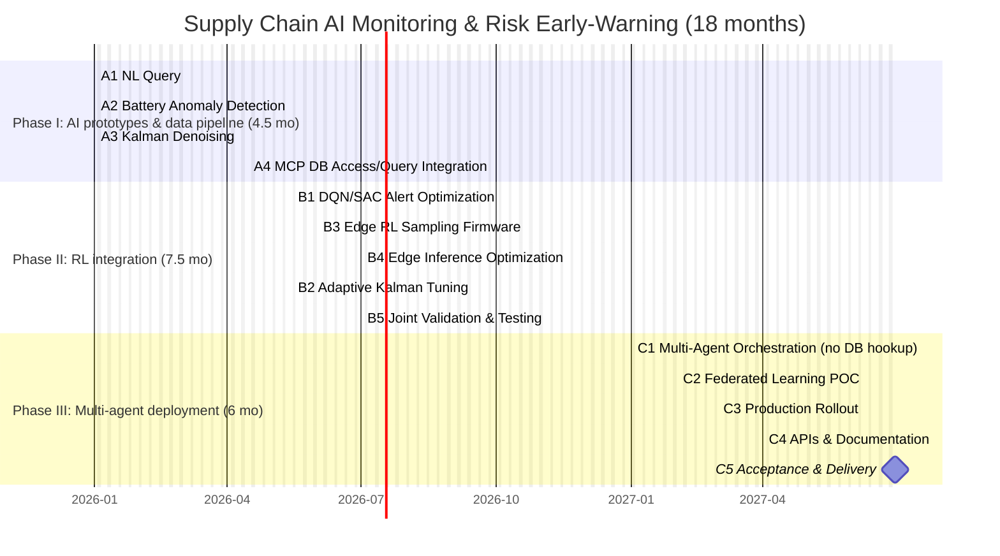

# Ministry of Economic Affairs – Science and Technology R&D Project
## A+ Enterprise Innovation R&D Refinement Program
## AI Application Leap Plan – Proposal (Submission Version)

ItracXing 準旺科技 x Arviem – Supply Chain AI Monitoring and Risk Early-Warning System Project  
Project Period: January 1, 2026 – June 30, 2027

Company Name: ItracXing 準旺科技 Co., Ltd.  
Project Management Unit: Taipei Computer Association (TCA)

---

## Proposal Summary Table

### General Information (Currency unit: thousand NTD)

- Project Title: ItracXing 準旺科技 x Arviem – Supply Chain AI Monitoring and Risk Early-Warning System  
- Applicant Company: ItracXing 準旺科技 Co., Ltd.  
- Address: Banqiao District, New Taipei City (full address to be filled)  
- Program: A+ Enterprise Innovation R&D Refinement – AI Application Leap Plan  
- Promotion Item: ☑ Other (Supply Chain & Logistics Monitoring)  
- Project Duration: Jan 1, 2026 – Jun 30, 2027 (18 months)

Principal Investigator  
- Name: Jeff Shuo  
- Title: CIO  
- Tel: (02) XXXX-XXXX  
- Fax: (02) XXXX-XXXX (if none, write “N/A”)  
- Email: jeff.shuo@itracxing.com  

Funding Summary

| Year | Gov. Grant | Company Match | Total Budget | Person-Months |
|:---:|-----------:|--------------:|-------------:|--------------:|
| Y1 | 12,395 | 12,395 | 24,790 | 120 |
| Total | 12,395 | 12,395 | 24,790 | 120 |
| Share of Total | 50.0% | 50.0% | 100% | - |

Project Contact  
- Name: Jeff Shuo  
- Title: CIO  
- Tel: (02) XXXX-XXXX  
- Email: jeff.shuo@itracxing.com  

---

## Executive Summary (≤1 page; may be published)

### Company Overview
| Company | ItracXing 準旺科技 Co., Ltd. |
|---|---|
| Founded | March 2020 |
| CEO | Dr. Chow |
| Core Business | AI Supply Chain Monitoring, IoT Device Management, Data Analytics Platform |

### Abstract (≤200 words)
To address pain points in global supply chain monitoring—alert overload/false alarms, inconsistent multi-sensor data quality, and lack of predictive decision-making—this project integrates Explainable AI, Reinforcement Learning (RL), and multi-agent technology to build a real-time anomaly detection and alert optimization platform, with adaptive edge sampling to extend battery life. Validations will be conducted in Arviem’s Swiss deployment and with ITRI/academic partners. Objectives include reducing false alarms, shortening response time, and improving operational efficiency.

### Expected Outcomes at Project Close (highlights)
- Technical: Anomaly detection accuracy ≥ 90%; NL query latency < 30s; battery life +40%–60%.  
- Operations: False alarm rate -20%–30%; incident response +50%; analyst hours -40%.  
- Economic: Opex -20%; data transmission cost -60%; battery replacement cost -70%.  
- Deliverables: Exportable SaaS solution, expansion into EU markets.

### Keywords
Supply Chain AI Monitoring, Reinforcement Learning, Explainable AI, Multi-Agent, IoT Edge Intelligence

---

## Table of Contents (aligned with template)
I. Participant Introduction  
II. Project Content & Implementation  
III. R&D Team  
IV. Budget  
V. Attachments

---

# I. Participant Introduction

### 1) Main Applicant
Company Profile (per template)  
- Basic Information  
  - Company: ItracXing 準旺科技 Co., Ltd.  
  - Established: 2020-03-15  
  - Industry: Information Services (J; Computer Systems Design)  
  - Top 3 Shareholders/Holdings: Founders 60%; Tech Team 25%; Strategic Investors 15%  
  - R&D Headcount / Total Headcount: 12 / 15  
  - 2024 Paid-in Capital (kNTD): 10,000  
  - 2024 Revenue / R&D Expenses (kNTD): 15,000 / 8,000  

- Business Model  
  - Core Capabilities: AI-driven supply chain monitoring, IoT device management, RL applications, Explainable AI  
  - Revenue Streams: SaaS subscriptions, AI consulting, custom development  
  - Channels: Direct sales, strategic partners (Arviem), online platform  
  - Key Customers: Arviem AG, etc.  
  - Cost Structure: R&D personnel (60%), cloud (25%), operations (15%)  
  - Key Partners: Arviem, ITRI AI Center, Taiwan–Amsterdam University AI Center  
  - International Footprint: Co-developing EU market with Arviem (DE/NL)  
  - Inclusive Workplace: ≥1/3 gender ratio, increase female R&D, flexible/remote work

### 2) AI R&D Capabilities of Applicant/Partners
- ItracXing 準旺科技: LangChain multi-agent, DQN/SAC, Kalman filtering, LLM integration, Next.js full-stack, edge AI & firmware.  
- ITRI (AI Center): RL validation and system performance testing.  
- Taiwan–Amsterdam Univ. AI Center: Federated learning, multi-agent, AI ethics.

### 3) Competitive Landscape & Technical Advantages

#### (1) International Competitor Comparison

| Solution | Core Tech | Market Position | Key Limits | Our Advantages |
|---|---|---|---|---|
| IBM Maximo | Rules + basic ML | Enterprise asset mgmt | • Expensive licenses • High customization cost • Weak edge intelligence | ✓ Flexible SaaS pricing ✓ RL-adaptive edge ✓ Explainable AI |
| Uptake | Predictive maintenance AI | Industrial IoT | • Black-box models • Cloud-dependent • No battery optimization | ✓ Transparent decisions ✓ Offline edge ops ✓ +60% battery life |
| C3 AI | Enterprise AI platform | Cross-industry AI | • High complexity • Long rollout cycles • Heavy IT resources | ✓ Supply-chain focused ✓ Fast deployment ✓ Low IT barrier |
| Samsara | IoT fleet mgmt | Logistics & transport | • Single vertical • Limited alert intelligence • No multi-agent | ✓ Cross-domain integration ✓ RL alert optimization ✓ Multi-agent architecture |
| ERP + IoT (legacy) | SAP/Oracle modules | ERP extensions | • Weak AI • Poor real-time • High false alarms | ✓ AI-native design ✓ <2s querying ✓ ≤15% false positives |

#### (2) Innovation Breakthroughs

a) Explainable AI Anomaly Detection (globally leading)  
- Pain point: Deep learning black-box models hinder trust in logistics ops  
- Our innovation: Kalman filtering + Z-score + feature importance reports per alert  
- Metrics: Accuracy ≥ 90%; False positives ≤ 15%; 100% decision rationale  
- Value: Complies with EU AI Act explainability; export readiness

b) RL-based Alert Optimization (first in Taiwan)  
- Pain point: Static thresholds cause alert fatigue; critical alerts missed  
- Our innovation: DQN/SAC dynamically tunes alert strategies from historical responses  
- Metrics: -30% false alarms; <30 min response on critical alerts; F1 ≥ 0.85  
- Value: -40% labor cost; higher customer satisfaction

c) Edge RL Adaptive Sampling (rare globally)  
- Pain point: Fixed IoT sampling drains batteries; 6-month replacements common  
- Our innovation: Lightweight RL agent on device adjusts sampling by context  
- Metrics: 10–14 months battery life (+67%–133%); data completeness ≥ 95%  
- Value: -70% maintenance cost; lower carbon; better TCO

d) Multi-Agent Collaboration (integration advantage)  
- Pain point: Monoliths can’t integrate ERP/WMS/TMS heterogeneity  
- Our innovation: MCP (Model Context Protocol) tool orchestration; federated learning privacy  
- Metrics: <2s cross-system query; data stays in-domain; privacy 100%  
- Value: Painless integration; GDPR-compliant; highly extensible

#### (3) Go-to-Market Strategy

Target Segments:  
1. Tier-1 (within 18 months): mid-sized logistics (Arviem-like), cold chain, cross-border e-commerce  
   - Pains: alert overload, battery cost, lack of AI  
   - Pricing: SaaS USD 5–15K/mo (100–500 devices)

2. Tier-2 (12 months post-close): manufacturing SCM, port warehousing, 3PL  
   - Pains: system integration, predictive maintenance, compliance reports  
   - Pricing: Enterprise USD 20–50K/mo + customization

3. 3-year Vision: AI PaaS export, vertical SaaS (medical cold chain, food safety)  
   - Biz model: API licensing + vertical solutions + consulting

Synergy with Arviem:  
- Arviem: global IoT network and >5,000 enterprise users  
- Ours: AI intelligence layer and edge optimization  
- Co-brand EU entry (DE/NL/CH) as Taiwan–EU joint solution

#### (4) IP Strategy & Moats

Patents (within 18 months):  
- TW ×2: RL-based IoT adaptive sampling; Explainable supply chain anomaly detection  
- PCT ×1: “Multi-Agent Supply Chain Monitoring with Federated Learning”

Moats:  
- Closed-source cores (RL reward design; Kalman adaptive parameters)  
- Encrypted edge firmware with OTA  
- Unique dataset (18 months Arviem field data)  
- Fast-iterating multi-agent framework

---

# II. Project Content & Implementation

## 1) Background & Pain Points
- Alert overload and high false positives → need intelligent classification/prioritization.  
- Inconsistent multi-sensor data quality → need denoising/adaptive calibration.  
- Lack of predictive decision support → need NL querying and AI recommendations.  
- Battery life and maintenance cost → need edge RL adaptive sampling.

## 2) AI Adoption Plan (before/after)
| Objective | Before (Current) | After (Target) |
|---|---|---|
| Explainable anomaly detection | Low accuracy rules, fixed thresholds | Kalman + Z-score; Accuracy ≥ 90%; explainable outputs |
| RL alert optimization | High false alarms; no learning | DQN/SAC; ≤15% false positives; <30m on critical |
| LLM NL querying | SQL/IT required | Executives self-serve with action suggestions |
| IoT edge AI sampling | Fixed; 6-month life | RL-adaptive; 10–14 months |
| Multi-agent orchestration | Hard to integrate | MCP tools; privacy-preserving FL |

## 3) Execution Strategy
### (1) Field, Validation Items, and Rollout
- Field: Arviem global IoT network; Euro–Asia lanes; manufacturing SCM systems.  
- Validation:  
  - Phase I (4.5 mo): anomaly accuracy, NL query latency, SNR gains.  
  - Phase II (7.5 mo): false alarms, battery life, edge inference latency.  
  - Phase III (6 mo): multi-agent throughput, FL privacy, stability.  
- Rollout: API integration (Arviem), cloud deploy, edge OTA, staged train-to-prod.

### (2) Work Packages (with share and owner)

Phase I: AI prototypes & data pipeline (4.5 mo, 27%) — starts 2026/01/01  
- A1 Natural Language Query (8%) – ItracXing 準旺科技  
- A2 Battery anomaly detection (10%) – ItracXing 準旺科技  
- A3 Kalman denoising (5%) – ItracXing 準旺科技  
- A4 MCP DB access/query integration (4%) – ItracXing 準旺科技

  <figure>
    <figcaption style="font-size:1.2em; font-weight:bold; margin-bottom:8px;">▲ Fig.1: Home dashboard with English queries. The system returns real-time anomaly summaries, key sensor traces, and alert rationales.</figcaption>
    
  </figure>
  <figure>
    <figcaption style="font-size:1.2em; font-weight:bold; margin-bottom:8px;">▲ Fig.2: Home dashboard with Traditional Chinese queries; users ask logistics/sensor/event questions directly.</figcaption>
    
  </figure>
  <figure>
    <figcaption style="font-size:1.2em; font-weight:bold; margin-bottom:8px;">▲ Fig.3: Querying “false alarm rate this month” yields stats, source explanation, and improvement suggestions.</figcaption>
    
  </figure>
  <figure>
    <figcaption style="font-size:1.2em; font-weight:bold; margin-bottom:8px;">▲ Fig.4: Multi-turn follow-ups supported; the system chains DB queries to answer in real time.</figcaption>
    
  </figure>

Phase II: RL integration (7.5 mo, 47%)  
- B1 DQN/SAC alert optimization (15%) – ItracXing 準旺科技 + ITRI (validation)  
- B2 Adaptive Kalman tuning (8%) – ItracXing 準旺科技  
- B3 Edge RL sampling firmware (12%) – ItracXing 準旺科技  
- B4 Edge inference optimization (7%) – ItracXing 準旺科技  
- B5 Joint validation & testing (5%) – ITRI + academia

Phase III: Multi-agent deployment (6 mo, 26%)  
- C1 Multi-agent orchestration & control (excludes DB hookup) (8%) – ItracXing 準旺科技  
- C2 Federated Learning POC (7%) – ItracXing 準旺科技 + academia  
- C3 Production rollout (6%) – ItracXing 準旺科技  
- C4 APIs & docs (3%) – ItracXing 準旺科技  
- C5 Acceptance & delivery (2%) – ItracXing 準旺科技 + ITRI

International Expansion Plan  
Partner with Arviem to enter EU markets; target Germany/Netherlands in 2026; co-branded Taiwan–EU solution.

Note: Why move MCP DB integration earlier  
- To ensure NL query (A1) and analytics align with actual data sources early, “MCP DB access/query integration” is moved from Phase III to Phase I (A4).  
- Early pipeline completion enables:  
  - Higher A/B test efficiency and reliable metrics (Phase I validated on real data).  
  - Lower Phase II iteration risk (RL/denoising iterate on stable data interfaces).  
  - Shorter TTM overall (Phase III focuses on multi-agent and production hardening).

Gantt (18 months overview)

## 4) Timeline & Checkpoints

Planned Schedule (accounting-year-based; ≥1 checkpoint per 6 months)  
- 2026/01–2026/Apr mid (Phase I H1): complete A1–A3 prototypes and metrics (Checkpoint A.1)  
- 2026/Apr mid–2026/May mid (Phase I H2): complete A4 MCP DB access/query integration (Checkpoint A.2)  
- 2026/May mid–2026/12 (Phase II): B1 training + A/B tests; B3 firmware v1; B4 edge inference (Checkpoints B.1, B.2)  
- 2027/01–2027/06 (Phase III): C1–C5 productionization and acceptance (Checkpoint C.1; final acceptance)

Checkpoint Notes (examples)  
- A.1 (2026/03): NL query < 2s; anomaly accuracy ≥ 85%; SNR +20%  
- A.2 (2026/05): MCP DB access/query integrated; NL query hits live DB  
- B.1 (2026/09): false positives ≤ 20%; F1 ≥ 0.85; edge inference < 10ms  
- B.2 (2026/12): battery life +40%; adaptive Kalman RMSE significantly down  
- C.1 (2027/06): multi-agent throughput target; FL privacy passed; acceptance complete

Stage Funding & Decision Gates (Milestone Control)

To ensure quality and controllability, staged disbursement is used, with a Go/No-Go decision at Phase II end.

Funding Schedule

| Stage | Period | Key Milestone | Disburse % | Amount | Retainage |
|---|---|---|---:|---:|---:|
| Phase I | M1–M6 | NLQ + Anomaly + Kalman | 40% | 4,960 | — |
| Phase II | M7–M12 | RL + Edge FW + Validation | 35% | 4,338 | — |
| Phase III | M13–M18 | Multi-Agent + Prod Deploy | 20% | 2,480 | 5% (620)* |
| Final Acceptance | M18+ | Pass tests | 5% | 620 | — |
| Total | — | — | 100% | 12,398 | — |

*Final 5% retained until acceptance tests pass, patent applications submitted, and technical docs delivered.

Go/No-Go Review at M6  
At Phase I end (Jun 2026), pass if ≥4 of 5 targets achieved:

| Metric | Target | Min Pass | Verification |
|---|---:|---:|---|
| 1. Anomaly accuracy | ≥ 90% | ≥ 85% | Test report (ITRI) |
| 2. NL query latency | < 2s | < 5s | Load test (100 conc.) |
| 3. Kalman SNR gain | ≥ 20% | ≥ 15% | Real data analysis |
| 4. Arviem field deploy | Signed | LOI | Agreement/LOI |
| 5. Patent application | 1 filed | 1 in prep | Filing or draft |

Decision Rules:  
- GO: 4/5 met → proceed Phase II/III; disburse per plan  
- Conditional: 3/5 → improvement plan; hold 10% of Phase II; re-review M9  
- NO-GO: <3 → terminate or major scope change; no Phase III funds

Risk Control Mechanisms  
1) Monthly progress reports (incl. financial)  
2) Quarterly technical reviews (ITRI + external experts)  
3) Flexible budget adjustment with 600K contingency (subject to approval)  
4) Personnel contingency: replacement plan within 30 days if key staff changes

## 5) Expected Benefits

### Technical Validation Protocols (measurable outcomes)

Battery Life Extension Validation (key metric)  
For the claim “battery life +40%–60%”:

Baseline:  
- Sampling: fixed every 30 min  
- Devices: 50 IoT sensors  
- Environment: Arviem field (sea/land mixed)  
- Period: 6 months  
- Expected life: 180 days

Experiment A (stable env):  
- Sampling: RL-adaptive (ΔT < 2°C/hour)  
- Devices: 50 sensors  
- Environment: Controlled land transport  
- Target life: ≥ 250 days (+39%)  
- Data completeness: ≥ 95%

Experiment B (dynamic env):  
- Sampling: RL-adaptive (ΔT > 5°C/hour)  
- Devices: 50 sensors  
- Environment: Sea cold chain (high fluctuation)  
- Target life: ≥ 290 days (+61%)  
- Data completeness: ≥ 95%

Success Criteria:  
1) A achieves ≥ 40% longer life with <5% data loss  
2) B achieves ≥ 50% longer life (RL advantage clearer in dynamic env)  
3) Anomaly accuracy stays ≥ 90% despite reduced sampling  
4) Independent validation reports by ITRI

Timeline:  
- Phase I (M4–M6): baseline data collection  
- Phase II (M7–M12): A/B experiments  
- Phase II (M13): 6-month analysis/report  
- Phase III (M14–M18): long-term tracking/optimization

RL Model Performance Validation  

Alert Optimization Metrics:  
- Baseline: rules engine (fixed thresholds)  
- Target: DQN/SAC dynamic tuning  
- Dataset: 18 months of Arviem historical data  
- A/B: 50/50 traffic split for 3 months

Comparative Metrics  
| Metric | Baseline (Rules) | Target (RL) | Goal |
|---|---:|---:|---:|
| False Positive Rate | 25% | ≤ 15% | -40% |
| False Negative Rate | 8% | ≤ 5% | -37.5% |
| F1-score | 0.72 | ≥ 0.85 | +18% |
| Critical alert response | 60 min | < 30 min | -50% |
| NPS (satisfaction) | baseline | +20 pts | — |

Deliverables:  
1) ITRI performance test report (end of Phase II)  
2) Arviem field validation report (end of Phase III)  
3) Third-party independent test report (pre-close)

### Quantified Benefits (kNTD; with formulas and evidence)
| Outcome | Before | Year 1 | Year 2 | Evidence |
|---|---:|---:|---:|---|
| Patents filed/approved | 0 | 1 | 2 | Filing/receipt docs |
| Follow-on investment | 0 | 5,000 | 10,000 | LOI/contract |
| New jobs (headcount) | - | 2 | 4 | HR reports |
| Avg R&D salary raise (%) | - | 5% | 8% | Payroll roster |
| ARR (recurring) | 0 | 6,000 | 12,000 | Contracts/invoices |
| Technical validation reports | 0 | 3 | 2 | ITRI/Arviem/3rd-party |

Adoption Benefits (ratios)  
- Cost reduction: data transmission -60% (sampling/compression/edge gating).  
- Quality/reliability: cold-chain violations -30%.  
- Efficiency: incident response -50%; analyst hours -40%.  
- Revenue/value: SaaS/consulting/export growth.

### Qualitative Benefits & Commercialization
- For Applicant: technology uplift, talent development, international productization.  
- For Industry: higher value-add and autonomy; enable international collaboration.  
- Sustainability: reduced CO₂ vs fixed sampling via energy/network/maintenance savings (calc attached).  
- Commercialization: 3-year follow-on goals and estimates (appendix).  
- Outreach: showcase/press before close; publish technical highlights and validation.

## 6) Risk Assessment & Mitigations

Detailed Risk Matrix

| Category | Specific Risk | Impact | Likelihood | Mitigation | Owner |
|---|---|---|---|---|---|
| Technical | Model shift/data drift | High | Med | • Quarterly retraining • Real-time guardrails • Model versioning/rollback • 300K contingency | AI + ITRI |
| Technical | RL non-convergence | Med | Med | • Backup algos (DQN/SAC/PPO) • ITRI expert support • Graceful degrade to rules | AI team |
| Technical | Edge compute limits | Med | Low | • Quantization/pruning • TFLite Micro tuning • HW upgrade via contingency | FW team |
| Data | Field data quality | High | Med | • Arviem validation • Cleaning/augmentation pipeline • Synthetic data supplement | Data team |
| Data | Cross-border compliance | High | Low | • Regional deployment (EU/Asia) • Federated learning privacy • GDPR legal review | Jeff + Legal |
| Integration | Heterogeneous protocols | Med | Med | • Standardized APIs/adapters • MQTT/HTTP/CoAP support • Field compatibility tests | IoT team |
| People | Key person risk (Jeff) | Very High | Low | • Knowledge wiki • Deputy lead (Gary Lin) • 3 external advisors • Incentives | Mgmt |
| People | Hiring delay (female AI eng.) | Med | Med | • Multi-channel recruiting • External temp consultants • 100K buffer | HR + PM |
| Market | Arviem delay | High | Med | • Early MOU/LOI • Quarterly joint reviews • Backup domestic partners • 200K market validation | BD + Jeff |
| Market | EU demand shifts | Med | Med | • Diversify segments • Flexible roadmap • Parallel domestic dev | BD team |
| Legal | EU AI Act cost up | Med | Med | • Explainable-by-design • Early compliance review • Legal budget reserve | Legal + advisors |
| Legal | Export controls | Low | Low | • Avoid controlled tech • 3rd-party compliance • Patent moat | Legal |
| Competitive | BigTech entry | Med | Med | • Differentiate (XAI + edge RL) • Fast iteration & stickiness • Patent protection | All |
| Financial | Budget overrun | Med | Med | • 600K contingency • Monthly tracking • Stage-gated control | Finance + PM |

Monitoring Mechanisms  
1) Weekly risk meeting; 2) Monthly risk report; 3) Quarterly external review (ITRI); 4) 24h emergency response; 72h remediation plan

Key Person Risk Reinforcement  
- Knowledge: weekly tech wiki; quarterly architecture reviews; code review and documentation rigor  
- Succession: deputy PI (Gary Lin) with 6-month mentorship; monthly tech talks; ITRI advisor support  
- Incentives: success bonuses; patent co-authorship; flexible work

## 7) IP Statement
- Core algorithms and designs protected by patents/copyright; IP ownership/licensing per contracts.  
- Third-party rights (data/libs/modules) inventoried for compliance.  
- Patent plan: TW ×2; foreign ×1 (focus on cold-chain anomaly detection; edge RL sampling).

---

# III. R&D Team

## 1) Principal Investigator
- Name: Jeff Shuo | Title: CIO | Gender: M | Industry: Information Services  
- Achievements: 20+ years in AI/IoT/embedded; led multi-agent orchestration, AI safety, supply-chain blockchain. Cross-border team leadership; expertise in AI safety/compliance/explainability and productization.  
- Education/Experience/Projects:  
  - Education:  
    - M.S. EECS, University of Illinois at Chicago (1992)  
    - MBA, San Diego State University (2005)  
  - Experience:  
    - AI Agent Architect  
      - Led design & integration of LLM, RL, LangChain/LangGraph, RAG, MCP, ReAct multi-agent tech  
      - Supply chain security  
    - Qualcomm Inc. — Director of Engineering (2004–2018)  
      - Led 100+ IoT/AR/VR/smart device projects; 50+ engineers  
      - Python/Keras/Node.js automated resource allocation  
    - HTC Corp. — Sr. Technical Manager (2003–2004)  
      - Led protocol eng. team; developed first Windows Mobile phone  
    - Qualcomm Inc. — Sr. Engineer (1997–2003)  
      - Embedded drivers; CDMA/GlobalStar phones; RF/LCD/Bluetooth/ATE SW  
    - Motorola Inc. — Sr. Engineer (1994–1997)  
      - Overseas CDMA BTS/handset mfg support; Windows OOD/OOP calibration SW  
    - IBM — Software Engineer (1993–1994)  
      - AS/400 I/O subsystem C++ driver dev  
  - Projects:  
    - Phoenix Multi-Agent SOC (2024–2025): multi-agent orchestration; AI safety; compliance  
    - SecuX AI SOC; supply chain blockchain labels; HSM secure signing  
    - Qualcomm/HTC/Google smart devices; embedded systems  
  - Skills:  
    - Multi-agent (LangChain, LangGraph, AutoGPT, ReAct, MCP)  
    - AI safety, compliance, explainable systems  
    - Embedded RTOS, ARM, Linux/Yocto, IoT (BLE, NB-IoT)  
    - Blockchain/Web3 (ERC-1056, ERC-3643, DID, RWA Tokenization)  
    - Secure HW (HSM, FIDO2, PKI)  
  - Commitment: 18 months (100%)  
  - Attachment: full CV at `proposal/attachments/CVs/Jeff_Shuo_Resume.pdf`

## 2) Headcount Summary (people)
Per template: by company/degree/gender/avg tenure; hires ≤ 30% of total.

| Company | PhD | MS | BS | Gender (M/F) | Avg Tenure | To Hire |
|---|---:|---:|---:|---|---|---:|
| ItracXing | 1 | 4 | 1 | 5 / 1 | 8 yrs | 1 |
| ITRI/Academia | 1 | 1 | 0 | 1 / 1 | 10 yrs | 0 |
| Total | 2 | 5 | 1 | 6 / 2 | 9 yrs | 1 |

## 3) Team CVs
Per template: PI, key R&D, general R&D, hires (person-months align with 120 PM total).

| Name | Title/Role | Education | Expertise/Work Items | PM | Gender | Company |
|---|---|---|---|---:|---|---|
| Jeff Shuo | CIO / PI | MS / MBA | Multi-agent orchestration, AI safety, embedded systems | 18 | M | ITracXing |
| Sean | AI Engineer | MS (CS) | NLP, LLM, semantic query, A1 NLQ | 12 | M | ITracXing |
| Gary Lin (林昶睿) | AI Lead / Data Scientist | MS (CS) | LangChain, multi-agent, LLM apps, anomaly detection, time series, A2 | 12 | M | ITracXing |
| Neil Tsai (蔡乙民) | ML Engineer | MS (CS) | RL (DQN/SAC), Kalman filtering, signal processing, A3 | 12 | M | ITracXing |
| Lark Kuo (郭冠宏) | Full-stack / Firmware | MS (CS) | DB design, API integration, embedded systems, edge AI, A4 | 12 | M | ITracXing |
| Cliff Chu (朱只耘) | Frontend / SWE | BS (CS) | React, Next.js, TypeScript, Tailwind CSS, A1–A4 support | 10 | M | ITracXing |
| (TBD) | AI Engineer | MS (AI/CS) | RL, FL, Phase II/III items | 12 | F | ITracXing |

---

## 4) Team Member Details (roles & duties)

PI – Jeff Shuo  
- Role: CIO / PI (Taipei)  
- Expertise: multi-agent orchestration, AI safety, embedded, cross-domain AI architecture  
- Duty: overall program from Phase I–III and reviews  
- Note: leads multi-agent system planning and validation

Key R&D #1 – Sean  
- Role: AI Engineer (Taipei)  
- Expertise: NLP, semantic queries, LLM apps  
- Duty: A1 NL Query (8%)  
- Commitment: 12 PM

Key R&D #2 – Gary Lin (林昶睿)  
- Dept: AI R&D  
- Title: AI Lead  
- Degree: MS in CS (National Chin-Yi University of Technology)  
- Experience: ITracXing AI Lead (2021–present) 4 yrs; prior ML Eng.  
- Skills: LangChain, multi-agent systems, LLM apps, prompt eng., anomaly/time-series  
- Project Roles: Phase I A1 main dev; Phase III C1 architect  
- Commitment: 12 PM

Key R&D #3 – Neil Tsai (蔡乙民)  
- Dept: AI R&D  
- Title: ML Engineer  
- Degree: MS in CS (National Chin-Yi University of Technology)  
- Experience: iTracXing Sr. Backend (2022–present) 3 yrs; iNEMU Lab RA (2018–2021)  
- Skills: RL (DQN/SAC), PyTorch, model optimization, Kalman filtering  
- Project Roles: Phase II B1 lead; Phase II B2 adaptive Kalman  
- Commitment: 12 PM

Key R&D #4 – Lark Kuo (郭冠宏)  
- Dept: IoT R&D  
- Title: Firmware Engineer  
- Degree: MS in CS (National Chin-Yi University of Technology)  
- Experience: ITracXing FW Eng. (2021–present) 4 yrs; prior embedded eng.  
- Skills: Embedded C/C++, FreeRTOS, TFLite Micro, edge AI, API integration  
- Project Roles: Phase II B3 edge RL agent FW; Phase II B4 edge inference  
- Commitment: 12 PM

General R&D – Cliff Chu (朱只耘)  
- Dept: Full-stack  
- Title: Frontend Engineer  
- Degree: BS in CS (National Chin-Yi Univ. of Tech.)  
- Experience: 準旺科技 Co., Ltd. SWE (2023–present) 2 yrs; KUAN YU Digital SWE (2020–2023) 3 yrs  
- Skills: Next.js, React, TypeScript, Tailwind, data pipelines  
- Commitment: 10 PM

TBD Hire – AI Engineer (F)  
- Degree: MS (AI/CS)  
- Skills: RL, FL, model tuning  
- Duties: Phase II/III agent training & validation  
- Commitment: 12 PM

# IV. Budget (kNTD)
Headcount: AI Eng ×6, Full-stack Eng ×1, Project Manager ×1  
Per template; below are forms + working examples (to be finalized).

## (1) Personnel Costs (adjust per final totals)
| Role | Avg Monthly (A) | PM (B) | Year 1 Personnel (A×B) | Notes |
|---|---:|---:|---:|---|
| PI | 165 | 18 | 2,970 | Full-time |
| Project Manager | 90 | 18 | 1,620 | Full-time |
| AI Engineers × 2 | 85 | 36 | 3,060 | incl. 1 hire |
| Full-stack Engineers × 2 | 80 | 24 | 1,920 | — |
| IoT FW Engineers × 2 | 80 | 16 | 1,280 | 8 mo × 2 |
| Finance Controller | 80 | 12 | 960 | Admin (non-R&D PM) |
| Administrative Assistant | 60 | 12 | 720 | Admin (non-R&D PM) |
| Subtotal (Company) | — | 108 (R&D) + 24 (Admin) | 12,530 | R&D 10,850 + Admin 1,680 |

Note: Company R&D PM total 108; Admin 24 PM not counted as R&D; remaining 12 PM (to reach 120) covered by ITRI/academia/external under “contracted research/validation,” not double-counted.

## (2) Consumables & Materials
| Item | Unit | Qty | Unit Price | Y1 | Purpose |
|---|---|---:|---:|---:|---|
| IoT sensor test kits (temp/humidity/vibration/cold-chain) | set | 6 | 40 | 240 | Field validation; anomaly data (Ph I–II) |
| Dev boards & comm modules (MCU/NB-IoT/BLE) | pcs | 10 | 25 | 250 | Edge RL sampling; FW prototype (Ph II–III) |
| Test batteries & consumables (18650/Li-ion/terminals) | lot | 12 | 15 | 180 | Battery life & sampling validation (Ph II) |
| NB-IoT SIM (prepaid) | pcs | 24 | 5 | 120 | Field telemetry & A/B tests |
| Cables, connectors, housings, mounts | lot | 6 | 10 | 60 | Prototyping & field mounting |
| microSD/USB storage media | pcs | 20 | 2 | 40 | Edge caching & logging |
| Spare sensors & replacements | set | 20 | 12 | 240 | Field maintenance & calibration |
| Small-run PCB | pcs | 6 | 40 | 240 | Edge adapter board prototyping |
| Solder paste/stencils/solder & lab supplies | lot | 4 | 15 | 60 | Prototype assembly |
| Lab supplies (ESD mats, gloves, tape, etc.) | lot | 1 | 30 | 30 | General lab use |
| Tooling consumables (tips/bits/blades) | lot | 1 | 52 | 52 | Prototyping & repair |
| Total | — | — | — | 1,620 | kNTD |

## (3) Equipment Usage / Cloud / EDA Rental
Per template. Equipment usage as depreciation A×B/60.

### 3-1 Equipment Usage (Depreciation A×B/60)
| Equipment | A (Cost) | B (PM) | Alloc (A×B/60) | Y1 | Purpose |
|---|---:|---:|---:|---:|
| R&D Server (owned) | 1,800 | 12 | 360 | 360 | Training/data processing |
| GPU Workstation (owned) | 2,400 | 12 | 480 | 480 | Prototype training/inference tuning |
| NAS Storage (owned) | 1,200 | 12 | 240 | 240 | TSDB/model versioning |
| Subtotal | — | — | — | 1,080 | kNTD |

### 3-2 Cloud/EDA Services (monthly)
| Item | Billing | Monthly | Months | Y1 | Purpose |
|---|---|---:|---:|---:|---|
| AWS/Azure compute (GPU training) | usage | 50 | 18 | 900 | RL (DQN/SAC), LLM finetune, anomaly models; staged training |
| Cloud DB & storage (RDS/S3/Blob) | monthly + capacity | 20 | 18 | 360 | TSDB, datasets, model registry, logs |
| API & LLM inference (OpenAI/Anthropic) | usage | 15 | 18 | 270 | NL query, prompt tests, RAG |
| Monitoring/logs/APM (DataDog/NewRelic) | monthly | 8 | 18 | 144 | Perf monitoring, alerting, log analytics |
| Container platform (K8s/ECS/AKS) | monthly | 7 | 18 | 126 | Microservices, edge agent mgmt, CI/CD |
| Subtotal | — | — | — | 1,800 | kNTD |

Cloud Resource Strategy:  
- Phase I: prototypes & model validation; higher GPU cost (~40%)  
- Phase II: RL iteration & A/B; compute + storage (~45%)  
- Phase III: production & optimization; lower training; higher inference (~15%)  
- Cost control: Spot instances; autoscaling; monthly cost reviews; budget alerts

### 3-3 Equipment Maintenance
| Item | Unit | Qty | Unit Price | Y1 | Purpose |
|---|---|---:|---:|---:|---|
| GPU maintenance/extended warranty & fan modules | year | 1 | 500 | 500 | HW maintenance contract & parts |
| NAS maintenance/RAID HDDs & warranty | year | 1 | 450 | 450 | Storage modules & controllers |
| Server maintenance/parts & warranty | year | 1 | 450 | 450 | PSU/memory/spares |
| Subtotal | — | — | — | 1,400 | kNTD |

### 3-4 Total (3-1 + 3-2)
| Total |  |  |  | 2,880 | kNTD |

## (4) Technology Import / Contracted Research / Co-development

Detailed Items  
| Partner | Scope | Type | Amount | Deliverables |
|---|---|---|---:|---|
| ITRI AI Center | RL validation & system testing | Cash | 1,600 | RL validation report; performance test report; 12 PM consulting |
| Arviem AG | Field tests & data | In-kind + tech support | 800 | EU field environment; IoT devices & data; joint development |
| Taiwan–Amsterdam Univ. AI Center | Federated learning research | Academic | 800 | FL POC; AI ethics review; joint paper |
| External advisors | AI safety & compliance | Consulting | 600 | GDPR compliance; model security; doc reviews |
| Patents & technical docs | Domestic/foreign filings | Services | 800 | 3 patent filings; whitepaper; API docs |
| Testing & validation | 3rd-party validation | Services | 600 | Independent perf tests; security testing; acceptance report |
| Total | — | — | 5,200 | Budget optimized with clear deliverables |

Roll-up  
| Item | Unit | Qty | Unit Price | Y1 | Notes |
|---|---|---|---|---:|---|
| Co-dev & validation | ITRI AI Center / Arviem AG / Taiwan–Amsterdam Univ. AI Center | 1 | — | 5,200 | Optimized structure: (1) ITRI RL/multi-agent co-dev & perf validation (600K cash). (2) Arviem EU field tests and cold-chain validation + cross-border telemetry (1,800K in-kind equipment & data). (3) Taiwan–Amsterdam Center: FL, AI ethics, explainability (800K). (4) External advisors, patents, 3rd-party validation (2,000K). Savings from 6,812K reallocated to cloud (+822K), maintenance (+400K), contingency (+390K).

## (5) Domestic Travel
| Item | Unit | Qty | Unit Price | Y1 | Purpose |
|---|---|---:|---:|---:|---|
| ITRI/Academia validation & meetings | trip | 12 | 8 | 96 | Validation, test meetings (HSP/CTSP) |
| Field testing (ports/warehouses) | trip | 16 | 10 | 160 | Deployment, calibration, inspection |
| Partner/customer tech sessions | trip | 8 | 10 | 80 | Arviem/partner integration |
| Expert/review meetings | trip | 8 | 8 | 64 | Reviews and milestone checks |
| Total | — | — | — | 400 | kNTD |

## (6) Patent Application Incentives
| Item | Unit | Qty | Unit Price | Y1 | Purpose |
|---|---|---:|---:|---:|---|
| Domestic patent incentive | case | 2 | 30 | 60 | Cold-chain anomaly & edge RL sampling |
| Foreign patent incentive | case | 1 | 100 | 100 | Multi-agent / explainability |
| Total | — | — | — | 160 | kNTD |

## (7) Contingency & Risk Management
| Item | Unit | Qty | Unit Price | Y1 | Purpose |
|---|---|---:|---:|---:|---|
| Technical contingency | lot | 1 | 300 | 300 | Retraining, algo adjustments, extra testing |
| Market validation & BD | lot | 1 | 200 | 200 | Customer interviews, POC demos, research |
| Execution buffer | lot | 1 | 100 | 100 | Hiring delays, equipment failures, timeline shifts |
| Total | — | — | — | 600 | kNTD |

## 2) Budget Allocation (roll-up)

Adjustments:  
1) Cloud: 978 → 1,800 (+822) to ensure GPU/inference capacity  
2) Maintenance: 1,000 → 1,400 (+400) for reliability  
3) Co-dev: 6,812 → 5,200 (-1,612) with clearer deliverables  
4) Add contingency: 600 for technical/market risks  
5) Total: 24,790 (50% grant)

| Account | Grant | Match | Total | Share |
|---|---:|---:|---:|---:|
| 1. Personnel | 6,270 | 6,260 | 12,530 | 51.0% |
| 2. Consumables | 810 | 810 | 1,620 | 6.6% |
| 3. Equip/Cloud | 1,440 | 1,440 | 2,880 | 11.7% |
| 4. Maintenance | 700 | 700 | 1,400 | 5.7% |
| 5. Tech import/Co-dev | 2,600 | 2,600 | 5,200 | 21.2% |
| 6. Domestic travel | 200 | 200 | 400 | 1.6% |
| 7. Patent incentives | 80 | 80 | 160 | 0.7% |
| 8. Contingency & risk | 300 | 300 | 600 | 2.4% |
| Total | 12,395 | 12,395 | 24,790 | 100% |
| Percent | 50.0% | 50.0% | 100% | — |

Note: Totals ensure sufficient cloud/maintenance for full 18-month R&D; grant ratio 50%.

---

# V. Attachments
- A: Prior gov programs (type/status/amount/outcomes/differences)  
- B: Cooperation contracts (per template)  
- C: Tech import/contracted research/validation proposals & agreements  
- D: Advisor & expert consent letters  
- E: Others (security audit, DPIA, outreach plan)

---
## VI. Expected Outcomes & KPIs

Technical  
- +30% reliability for batteries/sensors  
- -20%+ false/miss rates  
- 90% predictive accuracy; MTBF +25%  
- Edge AI adaptive sampling extends device life +40–60%

Economic & Industrial  
- -20% overall Opex  
- -40% ops and analysis hours  
- Accelerate AI adoption in Taiwan smart manufacturing

Export & Internationalization  
- Enter EU with Arviem (DE/NL); build AI logistics brand  
- Exportable SaaS creates follow-on opportunities

---

## VII. Commercialization & Sustainability Strategy

Strategy  
- Capital: 50% grant + 50% match for risk sharing and sustained investment  
- IP: Results’ patents/algorithms owned by lead; licensed per agreements  
- Data/privacy: GDPR-compliant; federated learning architecture  
- Commercialization: 3-year follow-on revenue targets (ARR NT$12M)  
- Export: Co-developed SaaS with Arviem listed/promoted in EU

Market Validation (Phase I–II must-hit)

Phase I: Demand Validation (M1–M6)  
- Goals: validate demand and price acceptance

| Item | Target Count | Completion | Deliverable |
|---|---:|---|---|
| Prospect interviews | 20 | Logistics/cold chain/manufacturing | Reports & needs analysis |
| Pain priority survey | 50 responses | Alert fatigue/battery/prediction | Survey & stats |
| Price sensitivity | 15 deep dives | USD 5–15K/mo acceptance | Pricing strategy report |
| Competitive analysis | 5 key vendors | IBM/Uptake/C3 AI/Samsara | Positioning matrix |

Budget: 200K from contingency (“market validation & BD”)

Phase II: Customer Commitments (M6–M9)  
- Goals: obtain verifiable commercial intent

| Commitment | Target | Minimum | Evidence |
|---|---:|---:|---|
| LOIs | 3 | 2 | Signed docs (expected scale) |
| POC agreements | 2 | 1 | Term + success criteria |
| Arviem formal agreement | 1 | Must | Revenue share & territory |
| Partner MOUs | 2 | 1 | SI/device partners |

Gate Link: corresponds to M6 Go/No-Go (item #4)

Phase III: Commercial Validation (M10–M18)  
- Goals: real revenue and case studies

| Metric | Phase II | Phase III | Formula |
|---|---:|---:|---|
| Pilot customers | 2 | 5 | Paying or >6-month trials |
| Devices deployed | 100 | 500 | Arviem + others |
| ARR (USD) | 30K | 150K | Monthly × 12 × customers |
| Retention | — | ≥ 80% | Renewal rate |
| NPS | — | ≥ 40 | Survey |

Business Model & Revenue Split  
- Service revenue: Arviem channel 70/30 (Arviem/ItracXing); direct sales 100% ItracXing; license fees separate  
- ItracXing designs/manufactures Nordic NTN-based IoT trackers & gateways; sells to Arviem and via Arviem worldwide  
- Arviem serves as global channel partner promoting ItracXing brand or co-brand devices

Revenue Forecast & Path  
IoT device sales led by ItracXing; Arviem revenue share per agreement. Service revenue per above split.

2027–2029 Forecast (IoT devices + services)

| Item | 2026 | 2027 | 2028 | 2029 |
|---|---|---|---|---|
| IoT devices (units/avg) | 1,000 × $25 | 8,000 × $25 | 16,000 × $25 | 30,000 × $25 |
| IoT device revenue | $25,000 | $200,000 | $400,000 | $750,000 |
| Gateways (units/avg) | 15 × $150 | 200 × $150 | 5,000 × $150 | 10,000 × $150 |
| Gateway revenue | $2,250 | $30,000 | $750,000 | $1,500,000 |
| Services (customers/avg) | 3 × $3,500/mo × 3 mo | 6 × $4,000/mo × 12 mo | 10 × $4,500/mo × 12 mo | 18 × $5,000/mo × 12 mo |
| Service revenue | $31,500 | $288,000 | $540,000 | $1,080,000 |
| Consulting/licensing/other | $7,500 | $56,000 | $80,000 | $120,000 |
| Total Revenue (USD) | $66,250 | $574,000 | $1,770,000 | $3,450,000 |
| ARR (NT$, fx 1:32) | 2.1M | 18.4M | 56.6M | 110.4M |

Upside Case  
- 2026: ARR NT$3.5M (early devices/gateway sales; early customer signings)  
- 2027: ARR NT$28M (device/gateway ramp; services double; large account wins)  
- 2028: ARR NT$85M (multi-country expansion; enterprise wins; portfolio expansion)  
- 2029: ARR NT$170M (global penetration; diversified products/services)

Risks:  
- Arviem delays; tech KPIs missed; pricing wars; key personnel churn

Mitigations:  
- Parallel domestic market dev; diversified revenue (consulting/licensing); lean ops for lower break-even

---

## VIII. Risk Assessment & Responses

| Risk | Impact | Strategy |
|---|---|---|
| Technical | Model drift/data shift | Periodic retraining; guardrail thresholds |
| Data Security | Cross-border compliance | Regional deployments; federated privacy |
| Integration | Heterogeneous interfaces | Standard APIs & adapters |
| People | Core member turnover | Documentation; external advisors |
| Policy | Export controls | Compliance workflow; 3rd-party audits |

---

## IX. IP & Research Ethics

- Patents for core algorithms/designs/validation methods (TW ×2; PCT ×1)  
- All partners comply with research ethics and confidentiality; ensure traceability and compliance  
- License inventory for third-party data and open-source to ensure lawful use

---

## X. Conclusion

This project centers on “RL × Supply Chain Monitoring × International Collaboration,” targeting improved reliability and decision efficiency across manufacturing and logistics. The 18-month plan is feasible within budget and aligns with the AI Application Leap Plan’s review focus on innovation, technical merit, and market value.

Editorial Notes:  
- Currency: thousand NTD (rounded); grant ratio ≤ 50%  
- Ensure consistency across checkpoints, person-months, and budget accounts; include final acceptance milestone in the last month  
- Maintain a public summary and a restricted-detail version (attachments include contracts/HR, etc.)
