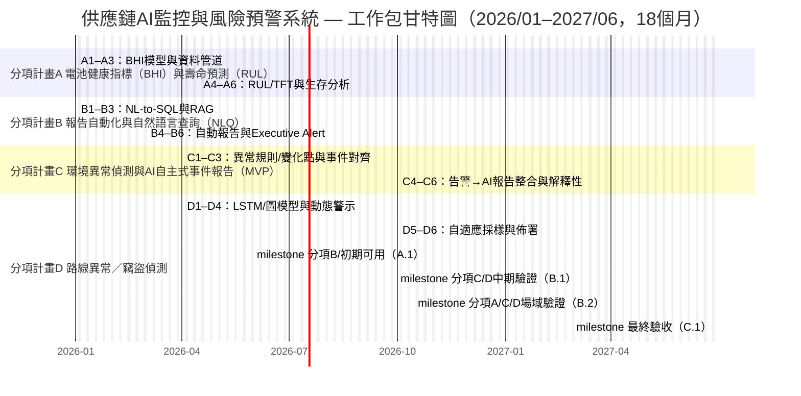

# Ministry of Economic Affairs Technology Research & Development Project

## A+ Enterprise Innovation R&D Refinement Program

## AI Application Acceleration Program Proposal (Submission Version)

**AI Intelligent Supply Chain Risk Prediction and Integrated Communications System Development Project**  
**Project Period: From 2026-01-01 To 2027-06-30**

Company Name: ItracXing 準旺科技股份有限公司  
Project Management Unit: Taipei Computer Association

---

## Proposal Summary Table (Cover and Preliminary Documents)

### Consolidated Information (Amount Unit: NT$ thousand)

- **Project Title:** AI Intelligent Supply Chain Risk Prediction and Integrated Communications System Development Project
- **Applicant Company Name:** ItracXing 準旺科技股份有限公司
- **Mailing Address:** Banqiao District, New Taipei City
- **Program Category:** A+ Enterprise Innovation R&D Refinement Program—AI Application Acceleration Program
- **Promotion Item:** ☑ Other (Supply Chain and Logistics Monitoring)
- **Project Start–End Time:** 2026-01-01 To 2027-06-30 (Total 18 months)

**Project Principal Investigator**

- Name: Jeff Shuo
- Title: CIO
- Phone: (02) XXXX-XXXX
- Fax: None
- Email: jeff.shuo@itracxing.com

**Annual Budget**

|     Year     | Government Subsidy | Company Self-Funding | Total Project Budget | Total Person-Months |
| :----------: | -----------------: | -------------------: | -------------------: | ------------------: |
| Year 1       |            9,000   |              9,000   |             18,000   |               120   |
| **Total**    |        **9,000**   |          **9,000**   |         **18,000**   |          **120**    |
| % of Total   |            50.0%   |              50.0%   |             100%     |                -    |

**Project Contact Person**

- Name: Jeff Shuo
- Title: CIO
- Phone: (02) XXXX-XXXX
- Email: jeff.shuo@itracxing.com

---

## Project Abstract (Within 1 Page; May Be Public)

### Applicant Company Profile

| Company Name | ItracXing 準旺科技股份有限公司 |
|--------------|--------------------------------|
| Founded      | 2020-03                        |
| Responsible Person | Dr. Chow                |
| Main Business Items | AI supply chain monitoring systems, IoT device management, data analytics platforms |

### Project Abstract (≤200 words)

Industry Alignment: Eight Key Industries Item 7 (Electronics Assembly Extension: Smart Manufacturing / Logistics Transportation).

Global demand for smart logistics monitoring and traceability is rapidly growing; by 2030, transportation and logistics market size is projected at NT$250.2 trillion. This project, co-driven by ItracXing and Switzerland-based Arviem, targets four pain points: insufficient sensor reliability, time-consuming report generation, delayed detection of risks for environmentally sensitive goods, and inability to promptly identify route deviations or suspected theft. Four AI modules will be developed: Battery Health Index (BHI) and Remaining Useful Life (RUL) prediction, Natural Language Query (NLQ) plus AI-automated reporting, environmental anomaly detection, and route/theft anomaly detection. Within 18 months we will complete international field validation and at least two demonstration deployment sites, achieving sensor availability ≥95%, risk response time reduction ≥40%, and cold-chain violation reduction ≥30%. A scalable AI-Monitoring-as-a-Service (AI-MaaS) model will be established. Estimated cumulative output over three years post-completion is approximately NT$120 million, enhancing Taiwan’s global visibility in AI smart logistics.

### Expected Outcomes at Project Completion (Summary Table)

Below are the key indicators and concrete, verifiable targets across five dimensions: technology, business, industry, intellectual property & internationalization, and social/ESG. All metrics are defined with measurement methods, data sources and tracking frequency in subsequent KPI tables, technical validation agreements, and milestone descriptions, ensuring measurability, auditability, and traceability.

| Category | Core Indicators (Summary) | Completion Targets (Concrete & Verifiable) |
|----------|---------------------------|--------------------------------------------|
| Technology | Sensor reliability & predictive capability; anomaly detection & query efficiency | Sensor availability raised from 90% to **≥95%**; BHI prediction accuracy **≥90%**; RUL prediction MAE **≤10 days**; environmental anomaly detection F1 **≥0.88**; route deviation detection AUC **≥0.90**; theft detection F1 **≥0.85**; NLQ query accuracy **≥92%**; P95 latency **<60 seconds**; overall risk response time shortened **≥40%**. |
| Business | Operational efficiency & cost optimization; subscription and project revenue foundation | Manual reporting effort (weekly/monthly/event analysis) reduced **≥200 hours/month**; cold-chain/environment violation rate decreased **≥30%**; losses from invalid transport/claims reduced **≥10–15%**; obtain **≥2 LOI/POC** domestically or internationally; complete **at least 1 international + 1 domestic paid or near-commercial validation**, supporting cumulative **≥NT$120M** output within three years post-completion. |
| Industry | Demonstration deployment, local ecosystem & cross-domain talent | Complete **≥1 representative AI deployment site** (e.g. international maritime/cold-chain/electronics assembly) forming a replicable blueprint & SOP; train or upskill **≥6 cross-domain (AI + logistics/manufacturing) personnel**, including **≥1 female R&D**; drive collaboration opportunities among domestic system integrators, telecoms, and device vendors via workshops/forums/case sharing. |
| IP / Internationalization | Intellectual property portfolio; AI model commercialization & export ratio | File **2–3 patent applications** (including **≥1 PCT**); register **1–2 key software modules** (e.g. BHI/RUL, anomaly detection, NLQ orchestration); establish AI-MaaS / Logistics-as-a-Service (LaaS) export framework; within three years post-completion international customer revenue ≈ **70%** of derived project income; publish **≥1 external technical white paper or open tool** supporting overseas promotion & secondary development. |
| Social / ESG | Supply chain resilience, energy saving & carbon reduction, SME demonstration | Reduce key risk event response time **≥40%**, enhancing cross-border supply chain resilience; adaptive sampling + route optimization estimated 3-year cumulative CO₂ emissions reduction **≈10–15%** (≈**80+ tons CO₂e**); complete **1–2 Taiwanese SME deployment demonstrations** (logistics/manufacturing/cold-chain) showing integrated data governance, AI adoption & business model for policy/industry reference. |

### Keywords

Supply chain AI monitoring, explainable AI (XAI), multi-agent, IoT adaptive sampling, smart manufacturing, electronics assembly, logistics transportation, smart logistics, Eight Key Industries Item 7

---

## I. Project Participants Introduction

[Summary] This section presents the applicant’s positioning, R&D capacity and partners, focusing on core supply chain AI monitoring capabilities and international export readiness as the basis for execution and KPI allocation.

### 1. Main Applicant

**Company Profile (Template-Based)**

- **Basic Information**
  - Company Name: ItracXing 準旺科技股份有限公司
  - Establishment Date: 2020.03.15
  - Industry Category: Information Services (Category J; Computer Systems Design)
  - Top Three Shareholders / Holdings: 60%, Technical Team / 25%, Strategic Investors / 15%
  - R&D Personnel / Total Employees: 12 / 15
  - 2024 Paid-in Capital (NT$ thousand): 10,000
  - 2024 Revenue / R&D Expense (NT$ thousand): 15,000 / 8,000
- **Business Model**
  - Core Capabilities: AI-driven supply chain monitoring, IoT device management, adaptive sampling / dynamic thresholds, explainable AI (XAI)
  - Revenue Items: AI-MaaS subscription, AI consulting, customized development
  - Channels: Direct sales, strategic partner (Arviem), online platform
  - Key Customers: Arviem AG etc.
  - Cost Items: R&D staffing (60%), cloud resources (25%), operations (15%)
  - Key Partner: Arviem
  - International Export Performance: Joint global market development with Arviem
  - Inclusive Workplace Planning: Gender ratio ≥1/3, hire more female R&D, flexible work / remote

### 2. AI R&D Capability of Applicant/Partners

**ItracXing 準旺科技股份有限公司** focuses on IoT sensing and satellite communication module development, with proven integration of endpoint sensors, communication modules, and cloud platforms. In collaboration with international logistics monitoring partners, it integrates proprietary IoT devices with AI applications to develop “AI-Monitor as a Service” and “Logistics as a Service” models targeting global supply chain monitoring and smart logistics markets. The project provides an end-to-end solution (endpoint sensor—satellite/mobile communications—cloud AI platform—decision dashboard) to enhance AI deployment feasibility, industrial diffusion, and international export potential aligned with smart transportation / smart logistics development directions.

### 3. Competitive Landscape and Technical Advantages

#### (1) International Competitors Comparison

| Category | Typical Player Positioning | Main Strengths | Current Gaps | This Project’s Advantages |
|----------|---------------------------|----------------|-------------|---------------------------|
| International digital freight forwarders / visibility platforms | Integrate booking, customs, tracking | Mature platforms, wide customer base | Limited integration of IoT sensor data with AI prediction; NLQ often static | Focus on “smart container + sensors” for BHI/RUL, environmental alerts & route anomaly detection; NLQ directly queries anomalies & supply chain risks |
| Sensor / device vendors | Provide temperature / vibration / location sensors & platforms | Diverse hardware, deployment experience | Mostly rule-based alerts; lack explainable AI and cross-container / cross-route learning | Use Kalman + deep time-series models to build explainable BHI/RUL & violation risk prediction with transparency & auditability |
| Cloud data & BI platforms | Data warehousing, dashboards | Strong generality, scalability | Require heavy customization for logistics IoT schema & SOP | Build specialized logistics IoT semantic layer + NL-to-SQL with shipment, lane, container vocab to reduce customization threshold |

#### (2) Technical Innovation and Differentiated Advantages

1. **Sensor Reliability and BHI/RUL: From “Single-Point Alerts” to “Predictive Health Management”**  
   - Kalman filtering + time-series deep learning (e.g. LSTM, Temporal Fusion Transformer (TFT)) to derive Battery Health Index (BHI) and Remaining Useful Life (RUL), enabling predictive maintenance.  
   - Considers voltage, temperature, usage patterns, and transmission frequency to reduce false alarms and extend sensor life.

2. **NLQ + Semantic Layer: From “Static Reports” to “Ask a Question, Get an Answer”**  
   - Logistics-specific semantic layer (Shipment, Lane, Container, Event) plus Natural Language to SQL (NL-to-SQL) for secure structured querying.  
   - Aggregates BHI, violation events, route anomalies, and SLA metrics; executives ask “What is this quarter’s humidity violation trend on European routes?” instead of manually compiling spreadsheets.  
   - Tool constraints & refusal logic mitigate hallucinations and unauthorized queries, balancing usability and governance.

3. **Environmental & Route Anomaly Detection: Layered Deployment to Reduce False Positives**  
   - For temperature/humidity-sensitive goods, MVP uses change-point + threshold + event alignment for anomaly detection and AI-automated event reporting; sets report SLA (P95 ≤ 2 min) and early warning rate targets.  
   - Route anomaly detection fuses GPS, dwell patterns, and weather/traffic to distinguish “legitimate delays” from “suspicious deviation / theft risk.”

4. **Taiwan-First AI Logistics MaaS Architecture: Replicable, Verifiable, Diffusible**  
   - Modular “AI Function XaaS” (BHI/RUL, environmental alerts, route anomalies, NLQ reporting) enabling phased adoption by domestic SMEs (forwarders, warehousing, cold-chain).  
   - Full audit trails for models and decision flows satisfying EU/GDPR and international compliance—transparent & traceable AI governance.

---

#### (3) Market Entry and Taiwan Deployment Strategy

1. **Leverage Existing International Projects to Benefit Taiwan Sites**  
   - Use current international customer projects as initial data and model validation sources.  
   - Parallel small-scale Taiwan pilots (1–2 local forwarders/warehouses, tens of smart containers/pallets).

2. **Focus on “High-Value, High-Risk Goods” Entry**  
   - Prioritize coffee beans, food raw materials, precision components—high sensitivity to temperature/humidity and high loss / claim potential.  
   - Demonstrate quantifiable ROI (cost saving + premium service) through reduced spoilage and better ETA risk warning.

3. **Platform and Licensing Dual Models**  
   - Short-term adopt LaaS / MaaS subscription (per device/container or query volume) to reduce adoption friction.  
   - Mid/long term offer model licensing and white-label solutions empowering system integrators or telecoms to integrate into 5G/AI offerings locally.

4. **International Collaboration and Taiwan Value**  
   - Collaborate with international academia and industry (European logistics partners, universities) for joint publications and validation to enhance Taiwan’s “AI + logistics” profile.  
   - Core model and platform development retained in Taiwan; local operations & maintenance teams first established domestically.

## II. Project Content and Implementation Methods

[Summary] This section links industry pain points to AI solutions and work packages, forming a clear chain “Pain Point → Solution → Milestones → KPI” while reinforcing data governance and cybersecurity compliance for measurable and traceable results.

### 1. Project Origin and Industry Pain Points

The project focuses on four core pain points in smart logistics that directly affect reliability, decision efficiency, and customer experience. They are addressed through Work Packages A–D:

### **Pain Point 1 | Insufficient Sensor Reliability (Battery Degradation, Environmental Interference, Data Interruptions)**

Sensors typically push data on fixed intervals without predictive battery health or remaining life estimation. Offline states due to power decay, signal attenuation, or interference are detected only after data gaps emerge, creating monitoring blind spots and higher maintenance cost.  
→ **Need:** Introduce battery health prediction (BHI) and remaining life prediction (RUL) models for predictive maintenance and integrate Work Package B’s AI-automated event reporting to improve system availability (Work Package A).

### **Pain Point 2 | Time-Consuming, Non-Interactive Reporting (Manual Aggregation, Decision Delays)**

Current reporting requires manual aggregation across sensor time-series, GPS tracks, door events, and environment logs via spreadsheets or slide decks, taking hours to days. Field interpretation inconsistencies cause delays; management cannot query in natural language, creating an efficiency bottleneck.  
→ **Need:** Deploy AI-automated event reporting and Natural Language Query (NLQ) platform to achieve fast data consolidation, rapid insight delivery, and interactive querying (Work Package B).

### **Pain Point 3 | Delayed Risk Awareness for Environment-Sensitive Goods (Humidity Variations, Insufficient Root Cause Traceability)**

Goods highly sensitive to humidity (coffee beans, food ingredients, precision components) risk mold or degradation under prolonged high humidity or volatility. Existing systems rely on retrospective curve inspection without real-time alerts or actionable explanations.  
→ **Need:** Build temperature/humidity anomaly detection and AI-automated alert mechanisms, integrated with AI-automated event reporting to shorten anomaly notification and investigation time (Work Package C).

### **Pain Point 4 | Inability to Promptly Identify Route Deviations and Suspected Theft (GPS Deviation, Manual Judgment)**

Monitoring often relies on post-hoc GPS review. Distinguishing weather/traffic delays from suspicious detours or dwell events is difficult. Unauthorized container openings are frequently discovered only at arrival.  
→ **Need:** Implement fused GPS/NTN trajectory, geofencing, pressure/lock events, and external weather/traffic data models for route anomaly and theft detection, reducing false positives and improving precision, triggering AI-automated reporting for investigative efficiency (Work Package D).

Work Packages A–D each address these pain points with measurable KPIs and structured AI solutions to elevate reliability, security, and international competitiveness.

### 2. AI Deployment Planning

[Explanation] This section maps four industry pain points to Work Packages A–D, outlining AI techniques and deployment goals. Data/model flow: A outputs BHI/RUL & sensor confidence → consumed by B for queries/reports; C/D generate environmental & route anomaly events → trigger B’s AI report & decision support.

#### (1) Technical Deployment Objectives: Pain Point → Work Package → AI Solution

| Industry Pain Point | Corresponding Work Package | Main AI Techniques | Purpose & Target Outcomes |
|---------------------|---------------------------|--------------------|---------------------------|
| **Pain Point 1 | Sensor reliability issues (battery degradation, interference, data loss)** | **A. Sensor Reliability Optimization** | Battery State of Health & Battery Health Index (BHI), Remaining Useful Life (RUL), predictive maintenance models | Use predictive BHI/RUL models to establish maintenance scheduling; raise sensor reliability **90% → 95%+** and enable proactive maintenance. |
| **Pain Point 2 | Reporting time, lack of interactivity (manual aggregation, decision delay)** | **B. On-Demand Reporting & Real-Time Query (NLQ)** | Natural Language Query (NLQ), NL-to-SQL, Large Language Model (LLM) report generation | Enable executives and operations to use natural language commands; transform reporting from **“manual hours → automated seconds”**. NLQ P95 latency <60 seconds, query accuracy ≥90%. |
| **Pain Point 3 | Delayed risk awareness for sensitive goods (humidity variation, insufficient root cause)** | **C. Sensitive Goods Environmental Anomaly Detection & AI-Automated Event Reports** | Change-point & threshold anomaly detection, multivariate time-series modeling, event alignment (container open / route segment) | Leverage Smart TOTE temperature/humidity (T/H) and door events to detect prolonged exceedance/volatility and align with operational events. Target early warning rate **≥70%**, event report SLA (P95) **≤2 minutes**, violation rate reduction ≥30%. |
| **Pain Point 4 | Route deviation & suspected theft not promptly identified (GPS deviation, manual review)** | **D. Route Anomaly & Theft Detection (Smart TOTE)** | GPS/NTN spatiotemporal trajectory modeling, geofence behavior analysis, lock/pressure anomaly detection, weather/traffic contextual modeling | Combine Smart TOTE GPS/LTE/NTN + BLE Padlock/pressure sensor + weather/traffic data to classify legitimate vs. suspicious anomalies. Targets: detection F1 ≥0.85, route deviation AUC ≥0.90, ETA MAE improvement ≥25%, false alert rate ≤15%, critical alert response <30 minutes. |

> Smart TOTE includes BLE Padlock, pressure sensing, and GPS/LTE/NTN connectivity for real-time container access and route tracking.  
> Source: (V5.0.X) iTX Smart TOTE Specification

---

#### (1-2) International State of the Art (SOTA) vs. Project Technical Targets

Three key indicator sets: current typical values vs. project target KPIs; international references from public research and industry practice.

#### ① BHI / RUL Battery Health and Life Prediction

| Metric | Typical / International Reference | Project Target (KPI) | Description |
|--------|-----------------------------------|----------------------|-------------|
| Sensor availability | ≈85–90% (reactive maintenance, post-failure replacement) | **≥95%** | Predictive maintenance reduces unplanned downtime. |
| BHI prediction accuracy | 80–88% common in practical studies | **≥90%** | LSTM/TFT + Kalman, improved beyond typical published results. |
| RUL prediction error (MAE) | 10–20 days acceptable in operational studies | **≤10 days** | Survival analysis + time-series modeling for tighter error bounds. |

#### ② Environmental Risk & Early Warning (Pain Point 3)

| Metric | Typical / International Reference | Project Target (KPI) | Description |
|--------|-----------------------------------|----------------------|-------------|
| Environmental anomaly detection F1 | Rule-based methods ≈0.7–0.8 | **≥0.88** | Change-point + multivariate modeling + event alignment improve performance. |
| Violation/anomaly early warning rate | Often <30% (reactive alerts) | **≥70%** | Short-term predictive modeling (30–60 min horizon) enables proactive alerts. |
| Event report SLA (P95) | Often measured in “hours” via manual email | **≤2 minutes (end-to-end)** | Direct anomaly → report → push pipeline. |

#### ③ Route Deviation / Theft Detection & ETA Prediction (Pain Point 4)

| Metric | Typical / International Reference | Project Target (KPI) | Description |
|--------|-----------------------------------|----------------------|-------------|
| Route deviation detection AUC | Pure GPS feature anomaly models ≈0.80–0.88 | **≥0.90** | LSTM + graph models with contextual features elevate performance. |
| Theft / unauthorized opening F1 | Sparse public F1 data (case-based reporting) | **≥0.85** | BLE padlock + pressure sensing + behavior modeling define measurable threshold. |
| ETA prediction error (MAE) | 1.5–3 hour MAE in public container studies | **≥25% improvement** | Combine historical route + real-time context for significant error reduction. |

These targets will be validated via technical agreements, third-party tests, and milestone audits (B.1/B.2), ensuring claims are quantitatively grounded.

---

#### (2) Before vs. After Deployment (Including Smart TOTE)

| Item | Pre-Deployment Issues | Post-Deployment Expected Outcomes |
|------|-----------------------|------------------------------------|
| **Sensor Reliability & Predictive Maintenance (Pain Point 1 / Work Package A)** | Battery degradation/offline states detected post data loss; higher maintenance & blind spots. | Predictive BHI/RUL enables proactive scheduling; **availability ≥95%, RUL MAE ≤10 days, data integrity ≥95%**, lowering unplanned downtime & maintenance cost. |
| **Reporting & Decision Efficiency (Pain Point 2 / Work Package B)** | Manual multi-system compilation; multi-hour delays; limited traceability of data access. | NLQ + automated reporting; **report generation reduced to <45 seconds (M1–M6 target)**; audit trails retained. |
| **Sensitive Goods Violation & Quality Risk (Pain Point 3 / Work Package C)** | Retrospective curve analysis; delayed alerts; root cause ambiguity. | Change-point + threshold + event alignment triggers AI reports; **early warning rate ≥70%, violation rate ↓ ≥30%, SLA (P95) ≤2 min**. |
| **Route Deviation, Legitimate Delay vs. Theft (Pain Point 4 / Work Package D)** | Manual GPS review; difficult classification; unauthorized openings discovered post-arrival. | Spatiotemporal + weather/traffic + Smart TOTE (BLE padlock/pressure) integration; **F1 ≥0.85, false alert ≤15%, critical alert response <30 min**. |

#### (3) Information Security & Data Governance (Compliance Mechanisms)

- Data classification & source mapping (internal sensors/events; external weather/traffic/geospatial); data catalog & lineage.
- Access control: Role-Based Access Control (RBAC) / Attribute-Based Access Control (ABAC); read-only whitelists; audit logs retention ≥1 year.
- Personal/sensitive data: de-identification (hash/masking); regional deployment & federated learning (FL) for cross-border privacy.
- Compliance frameworks: GDPR Data Protection Impact Assessment (DPIA); third-party security scans (SAST/dependency); quarterly vulnerability scans & failover drills.
- Audit & versioning: data version control; model versioning & rollback; query routing & model outputs traceable end-to-end.

### 3. Execution Strategy

[Summary] Work Packages A–D structured by pain points with defined checkpoints; international collaboration reinforces validation and export; KPIs and milestones aligned for investment effectiveness.

### (1) Field Sites, Validation Items & Deployment Approach

- **Validation Items (By Work Package)**

  - **Work Package A (M1–M11) | Sensor Reliability Optimization**
    - BHI stability across 3 batch datasets
    - RUL prediction MAE ≤10 days (20% hold-out test set)
    - Post-denoise Signal-to-Noise Ratio (SNR) improvement ≥20%
    - Sensor data integrity ≥95%, availability ≥95% (30-day continuous records)

  - **Work Package B (M1–M5) | NLQ & AI-Automated Reporting**
    - NLQ query accuracy ≥90% (≥200 labeled queries)
    - NLQ latency P95 <180 seconds (stress test 500–1,000 QPS)
    - Automated report completion rate ≥95% (100 reports comparison)
    - Manual labor hours reduction ≥70% (baseline vs. post)

  - **Work Package C (M4–M15) | Sensitive Goods Environmental Anomaly Detection & Reporting (MVP)**
    - Temperature/humidity anomaly detection F1 ≥0.88
    - Violation/anomaly early warning rate ≥70%
    - Event report SLA (P95) ≤2 minutes (end-to-end)

  - **Work Package D (M4–M15) | Route & Theft Detection (Smart TOTE)**
    - Route deviation detection AUC ≥0.90 (≥20 actual anomalous route samples)
    - Theft / unauthorized opening F1 ≥0.85 (BLE pressure/light/open events)
    - ETA prediction MAE ≤15 minutes
    - Opening / pressure change event detection accuracy ≥95% (≥50 test cycles)

### (2) Work Packages

#### Work Package A | Sensor Reliability Optimization (BHI/RUL)

Objective: Elevate availability from ≈90% and reduce unplanned downtime via predictive BHI/RUL models.

**A1. Objectives & Success Criteria**  
- Availability ≥95%, RUL MAE ≤10 days, BHI prediction accuracy ≥90%, data integrity ≥95%.

**A2. Data Acquisition & Preparation**  
- Voltage, temperature, transmission frequency, maintenance records; gap-filling and trend normalization.

**A3. Dataset Construction**  
- Historical integration with event labels (failure/maintenance) for reproducible training & validation sets.

**A4. Modeling & Training**  
- Time-series deep learning (RNN/LSTM/TFT) for discharge curve and voltage decay patterns; derive BHI.  
- Kalman filtering for noise reduction & state estimation.  
- Survival analysis (Cox proportional hazards, Kaplan-Meier) for RUL considering censoring.  
- Supplementary rules for stability and operational transparency.

**A5. Evaluation & Optimization**  
- Accuracy & error metrics; interpretable summaries for maintenance decision support.

**A6. Deployment & Showcase**  
- BHI/RUL APIs & dashboard; predictive maintenance scheduling, proactive battery health alerts.

#### Work Package B | On-Demand Reporting & Natural Language Query (NLQ)

Enable management and operations to retrieve insights instantly via natural language and automated periodic reports.

**B1. Objectives & Success Criteria**  
- Report production time ↓ ≥50%; NLQ P95 latency <60 seconds; accuracy ≥90%.

**B2. Data Acquisition & Preparation**  
- Semantic layer & data dictionary; integrate time-series & event data plus external summaries.

**B3. Dataset Construction**  
- Common query patterns & report templates; maintainable data catalog.

**B4. Modeling & Training**  
- Read-only whitelisted database linkage; restrict scope to prevent hallucinated numerics.  
- Executive Report Agent (multi-agent orchestration): metric extraction → semantic summarization → anomaly explanation → recommended actions; supports follow-up queries & context retention.

**B5. Evaluation & Optimization**  
- Accuracy & latency monitoring; refusal & audit mechanisms; iterative template refinement.

**B6. Deployment & Showcase**  
- NLQ API, interactive dashboard, executive auto-report agent, scheduled reports; integration with Work Packages C/D anomaly triggers (Alert → Report pipeline).

#### Work Package C | Environmental Anomaly Detection & AI-Automated Event Reporting (MVP)

Focus on temperature/humidity-sensitive goods (e.g. coffee beans) with “anomaly → alert → AI report” MVP for rapid, actionable insights.

**C1. Objectives & Success Criteria**  
- Temp/humidity anomaly F1 ≥0.88; early warning rate ≥70%; report SLA (P95) ≤2 minutes; violation rate ↓ ≥30%.

**C2. Data Acquisition & Preparation**  
- Temperature/humidity (T/H), container door events, location/route segments.

**C3. Dataset Construction**  
- Labeled anomalies (prolonged exceedance, short-term volatility) aligned to operational events (loading/opening).

**C4. Modeling & Training (MVP → Extension)**  
- MVP: change-point detection (CUSUM/BOCPD/rolling IQR) + thresholds/rules; event alignment & tagging.  
- Extension: introduce multivariate time-series models (LSTM/GRU/TFT) & exogenous features for enhanced predictive early warning.

**C5. Evaluation & Optimization**  
- Monitor F1, early warning rate, false alert rate, report SLA; drift monitoring & periodic retraining.

**C6. Deployment & Showcase**  
- Direct anomaly-triggered AI reports (shared template with B); email push summarizing window, affected batches, aligned evidence, recommended actions; dashboard drill-down and NLQ jump (C×B integration).

#### Work Package D | Theft Detection & Route Monitoring

Detect potential detours, suspicious dwell, and unauthorized openings with contextual risk ranking.

**D1. Objectives & Success Criteria**  
- AUC ≥0.90, F1 ≥0.85; ETA MAE improvement ≥25%; false alert rate ≤15%; critical alert response <30 minutes.

**D2. Data Acquisition & Preparation**  
- GPS location, speed, dwell points, external traffic/weather summaries.

**D3. Dataset Construction**  
- Trip segmentation with anomaly labeling and route network features.

**D4. Modeling & Training**  
- Time-series (LSTM/GRU) for trajectory patterns; Graph Neural Networks (GNN) for route topology and traffic flow; contextual weather/traffic separation of legitimate delay vs. anomalous deviation.  
- Dynamic alert prioritization via Learning-to-Rank (LTR) and cost-sensitive scoring (risk level, historical pattern, real-time context).  
- Integration of Smart TOTE BLE padlock & pressure sensing for unauthorized opening detection.  
- Adaptive threshold adjustment by site, time, and cargo type to reduce false positives.

**D5. Evaluation & Optimization**  
- AUC/F1 & latency tracking; A/B testing.

**D6. Deployment & Showcase**  
- Anomaly/theft alert service; route replay & root cause analysis; MCP agent orchestration (cross-work-package).

### (3) International Collaboration Benefits

Led by ItracXing (Taiwan) partnering with Arviem AG (Switzerland).

- Collaboration Scope:
  - Arviem: global field sites, IoT device/data access, joint validation & customer onboarding.

- Taiwan Value:
  - International demonstration: Taiwan as technical center with AI-MaaS for logistics export path.
  - Talent & technical uplift: GDPR / anticipated AI Act compliance integration.

### 4. Execution Timeline and Checkpoints

Gantt chart, progress schedule, and AI function–milestone–KPI mapping aligned via milestone codes A.1 / B.1 / B.2 / C.1.

### Gantt Chart (2026/01–2027/06, 18 months; Work Package Perspective)

### Planned Progress Schedule & Checkpoints

### Scheduled Progress (Year = Fiscal Year; ≥1 Checkpoint Every 6 Months)

- 2026/01–2026/05 (M1–M5; Milestone A.1)  
  - Goal: Work Packages A/B initial usability  
  - Key Deliverables:  
    - A: BHI data pipeline & denoising (A1–A3), initial BHI/RUL models  
    - B: NL-to-SQL & RAG basics (B1–B3), prototype automated executive alerts (B4–B6 early)  
  - Checkpoint: A.1 (End of May 2026)

- 2026/04–2026/09 (M4–M9; Milestone B.1)  
  - Goal: Work Packages C/D mid-stage models  
  - Key Deliverables:  
    - C: Change-point rules & event alignment (C1–C3), alert→report integration meeting F1/SLA targets  
    - D: Route/theft detection LSTM/graph models (D1–D4), dynamic alert logic test-site operation  
  - Checkpoint: B.1 (End of Sept 2026)

- 2026/04–2027/03 (M4–M15; Milestone B.2)  
  - Goal: A/C/D field validation  
  - Key Deliverables:  
    - A: Continuous BHI/RUL operation meeting reliability & MAE targets  
    - C: Environmental anomaly early warning & report SLA achieved on site  
    - D: Route/theft detection A/B tests on real logistics routes; F1 & ETA improvement targets met  
  - Checkpoint: B.2 (End of Mar 2027)

- 2027/01–2027/06 (M13–M18; Milestone C.1)  
  - Goal: Final integration & acceptance (A–D consolidated)  
  - Key Deliverables:  
    - End-to-end cross-module integration, data sync success ≥98%  
    - Production deployment & acceptance test; service availability ≥99.5%  
    - Final technical documentation & acceptance report  
  - Checkpoint: C.1 (End of Jun 2027)

### Checkpoint Descriptions

- **A.1 (End May 2026) — Work Packages A/B Initial Usability**:
  - Initial BHI/RUL models with RUL MAE ≤15 days
  - Anomaly detection accuracy ≥85%; Kalman SNR improvement ≥20%
  - MCP database integration for real-time query
  - Automated reporting & executive alert system online
  - Deliverables: prototype system, technical docs, test report

- **B.1 (End Sept 2026) — Work Packages C/D Mid-Stage**:
  - Alert optimization model F1 ≥0.85
  - Deliverables: training report, initial validation results

- **B.2 (End Mar 2027) — A/C/D Field Validation Completed**:
  - RUL MAE ≤10 days, BHI accuracy ≥90%
  - False alert rate ≤15% (weather/traffic delay filtered; ≥40% reduction)
  - Predictive maintenance validated, lab & field tests passed
  - Deliverables: field data, performance report, maintenance impact analysis

- **C.1 (End Jun 2027) — Final Integration & Acceptance**:
  - Cross-module integration with data sync success ≥98%
  - Production environment deployment, complete API docs
  - Service availability ≥99.5%, defect rate trending down
  - Final acceptance tests & closure documents

### Budget Disbursement & Key Decision Points (Milestone Control)

Milestone-based disbursement with a Go/No-Go decision at M15.

#### Budget Disbursement Schedule (Milestones vs. Work Package Groups)

| Milestone | Period | Key Milestone (Work Package Scope) | Disbursement % | Amount (K) | Retention |
|-----------|--------|-------------------------------------|----------------|-----------:|----------:|
| Milestone A (A.1) | M1–M5 | Work Package B initial + Work Package A data pipeline/denoising | 40% | 3,600K | — |
| Milestone B (B.1/B.2) | M4–M15 | Work Packages C/D models & validation + A RUL/life extension | 35% | 3,150K | — |
| Milestone C (C.1) | M13–M18 | Final acceptance + cross-package production integration | 20% | 1,800K | 5% (450K)* |
| Final Acceptance | M18+ | Pass acceptance testing | 5% | 450K | — |
| **Total** | — | — | **100%** | **9,000K** | — |

*Retention 5% released after acceptance tests, patent filing submission, and documentation handover.

#### Key Decision Point: M6 Go/No-Go Review (Indicators mapped to Work Packages A/B/D)

At M6 (June 2026) major review—must meet ≥3 of 4 indicators to continue:

| Indicator | Target | Minimum Pass | Verification Method |
|-----------|--------|--------------|---------------------|
| 1. Anomaly detection accuracy | ≥90% | ≥85% | Test set validation report |
| 2. Kalman SNR improvement | ≥20% | ≥15% | Empirical pre/post analysis |
| 3. Arviem deployment agreement | Signed | LOI confirmed | Agreement / intent letter |
| 4. Patent application progress | 1 filed | 1 draft ready | Application documents |

**Decision Rules**:
- **GO**: ≥3/4 achieved → continue & disburse per plan
- **Conditional GO**: 2/4 achieved → submit remediation; hold 10% until M9 review
- **NO-GO**: <2 achieved → terminate or major scope revision; later budgets withheld

#### Risk Control Mechanisms

1. Monthly progress summary & financial usage report  
2. Quarterly technical reviews by external experts  
3. Contingency reserve 600K adjustable on approval  
4. Key personnel contingency: replacement plan within 30 days if needed

### 5. Expected Benefits

[Summary] Following Ministry templates: six dimensions—quantitative benefits, qualitative benefits, energy saving & carbon reduction, commercialization planning & targets (three years post-completion), dissemination activities, and KPI audit mechanisms. All quantitative metrics align with earlier KPI tables and validation agreements for measurability and traceability.

---

#### (I) Quantitative Benefits (Technical & Operational Metrics)

> Core technical & operational KPIs: sensor reliability, anomaly detection performance, reporting efficiency, service availability, derived investments.

1. **Core Technical & Operational KPIs (Summary)**

| KPI | Baseline | Target | Measurement / Source |
|-----|----------|--------|----------------------|
| Sensor availability | 90% (2024 average) | ≥95% | Daily uptime & data integrity, monthly aggregation |
| BHI prediction accuracy | None (new model) | ≥90% | Work Package A validation set |
| RUL prediction MAE | None (rule-based baseline) | ≤10 days | Predicted vs. actual life, quarterly |
| Environmental anomaly F1 | Rule-based ≈0.7 | ≥0.88 | Labeled event test set |
| Route deviation AUC / theft F1 | None | AUC ≥0.90, F1 ≥0.85 | Independent test set & field data |
| NLQ query success rate | None | ≥92% | Labeled NL-to-SQL comparison |
| NLQ P95 latency | Manual >10 min | <60 seconds | NLQ gateway & APM logs |
| Risk response time | ≈45–90 minutes | Reduction ≥40% | Event trigger to mitigation |
| Report production labor hours | ≈200 hours/month | Decrease ≥50% (≤100) | PMO time tracking |
| Service availability | 99.0% | ≥99.5% | Monitoring platform weekly/monthly |

2. **Derived Investment & Personnel Benefits (NT$ thousand; Non-core KPIs)**

| Outcome | Pre | Year 1 | Year 2 | Evidence |
|---------|-----|--------|--------|----------|
| Patent applications (filed) | 0 | 2 | 3 | Patent filings |
| Derived investment | 0 | 6,500 | 6,500 | Investment agreements |
| New employment (headcount) | 0 | 5 | 10 | HR records |
| R&D salary level uplift (%) | — | +10% | +15% | Payroll records |

Derived investment breakdown (NT$ thousand):

| Investment Item | Entity | Amount | Description |
|-----------------|--------|-------:|-------------|
| Smart logistics edge test & validation | External research institute | 3,000 | Edge deployment & AI accelerator setup |
| Edge AI platform co-investment | ItracXing & Arviem | 2,000 | Extend models to edge compute nodes |
| Global export collaboration | Arviem AG | 1,500 | Export integrated solution to global sites |

Total derived investment: ≈ NT$6,500 thousand.

---

#### (II) Qualitative Benefits

> Long-term impact on applicant, ecosystem, international visibility, and talent.

1. **Applicant (ItracXing) Benefits**
   - Technical: Full suite (BHI/RUL, environmental anomaly detection, route/theft detection, NLQ reporting) forming a replicable AI Logistics MaaS product line; competencies in explainable AI, Learning-to-Rank (LTR), federated learning (FL), multi-agent governance.
   - Business Model: Transition from project-based to device + subscription (AI-MaaS/LaaS); ≥1–2 replicable international demonstration cases.
   - Talent: Train ≥6 cross-domain personnel (AI + logistics/manufacturing), with ≥1 female R&D; accumulate GDPR / AI Act compliance experience.

2. **Industry & Local Ecosystem**
   - Demonstration site enabling SOP & blueprint replication.
   - Knowledge spillover via open API, white paper, selective tooling lowering SME adoption barriers.

3. **International Visibility & IP**
   - Joint European/global field validation.
   - 2–3 patents (≥1 PCT) + 1–2 software copyright registrations.
   - AI-MaaS export architecture with ~70% international revenue share after three years.

---

#### (III) Energy Saving & Carbon Reduction

> Mechanisms: adaptive sampling, route optimization, proactive anomaly intervention.

1. Reduce invalid transport & cold-chain violation waste: violation rate ↓ ≥30%, fewer re-shipments (15–20 long-distance avoided annually).
2. Route optimization & invalid mileage reduction: ESG KPI “invalid transport reduction ≥10–12%.”
3. CO₂ Reduction Estimation:

\[
\Delta CO₂ \approx D_{base} \times r \times EF_{CO₂} \times 3
\]

Where \(D_{base}\) = annual baseline km, \(r\) = 10% reduction, \(EF_{CO₂}\) ≈0.8–1.0 kg/km. Using 300,000–400,000 km/year baseline yields ≈80+ tons CO₂e reduction over 3 years (aligns with summary).

4. Transparency: Post-project report will disclose assumptions & data sources.

---

#### (IV) Commercialization Planning & Targets (Within 3 Years Post-Completion)

> Market route, revenue structure, milestone-linked customer acquisition.

1. **Market Position & Addressable Segment**  
   - High-value cross-border & cold-chain cargo (electronics, precision parts, coffee beans). AI-MaaS + device integrated solution.  
   - Leverage Arviem’s >5,000 customers; conservative penetration 1% (≈50 customers) at ~USD 12,000 annual subscription → USD 600,000/year (~NT$19.2M). Add device sales + consulting/licensing → cumulative ~NT$120M over three years, ~70% export share.

2. **Customer Commitment Milestones (M1–M18)**
   - Demand Validation (M1–M6): ≥20 customer interviews; ≥50 pain surveys; ≥15 pricing sensitivity tests.
   - Customer Commitment (M6–M9): ≥2 LOI, ≥1 POC agreement; signed Arviem cooperation (Go/No-Go indicator).
   - Commercial Validation (M10–M18): Pilot customers 2–5; devices 100–500 units; ARR USD 30K–150K; retention ≥80%; NPS ≥40.

3. **Revenue Forecast (2026–2029)**

| Item | 2026 | 2027 | 2028 | 2029 |
|------|------|------|------|------|
| IoT device sales (units × avg price) | 75 × $1,000 | 600 × $1,000 | 900 × $1,000 | 1,200 × $1,000 |
| a. IoT device revenue | $75,000 | $600,000 | $900,000 | $1,200,000 |
| Service revenue (customers × avg monthly × period) | 1 × $3,500/mo × 3 mo | 2 × $4,000/mo × 12 mo | 3 × $4,500/mo × 12 mo | 4 × $5,000/mo × 12 mo |
| b. Service revenue | $10,500 | $96,000 | $162,000 | $240,000 |
| c. Consulting/licensing & other | $7,500 | $56,000 | $80,000 | $120,000 |
| **Total (USD)** | **$93,000** | **$752,000** | **$1,142,000** | **$1,560,000** |
| **ARR (NT$, FX 1:32)** | **2.98M** | **24.06M** | **36.54M** | **49.92M** |

4. **Revenue Mix & Profit Distribution**
   - Early: hardware dominant; service share grows to ~23% by 2029.
   - Channel sharing with Arviem 50:50; direct sales fully recognized by ItracXing; licensing negotiated per project.

5. **Three-Year Post-Completion Commercialization Targets**
   - ≥10 paying or extended trial (>6 months) customers.
   - ≥1,000 deployed IoT devices (Smart TOTE / TC605 + LaaS).
   - Cumulative AI-MaaS / consulting / licensing revenue ≥NT$80M; international share ≈70%.

---

#### (V) Results Dissemination Plan

1. **Technical Publication & Professional Communities**
   - 1–2 papers or empirical reports (smart logistics, AI in supply chain, cold-chain forums).
   - Domestic AI/data science community sessions on explainable AI (XAI), LTR, multi-agent collaboration.

2. **Industry Workshops & Deployment Blueprint**
   - ≥1 AI smart logistics workshop with trade associations.
   - Deployment blueprint & self-assessment toolkit (maturity model, questionnaire).

3. **Exhibitions & Media Exposure**
   - Domestic exhibitions (Smart City, Smart Manufacturing) + select international expos; showcase Smart TOTE, TC605 + LaaS, AI console demos.
   - Press releases, interviews, white papers highlighting resilience, carbon reduction, export contribution.

4. **Government & Policy Engagement**
   - Provide concise results briefing & policy recommendation summary.

5. **Effect Tracking & Secondary Diffusion**
   - Post-completion one-year tracking of adoption metrics; follow-up sharing or supplemental reports as needed.

---

#### (VI) Benefit Metrics & Audit Mechanisms (KPI & Validation Link)

1. **Comprehensive KPI Table (Metric / Baseline / Target / Method / Source / Frequency)**

| KPI | Baseline | Target | Measurement | Source | Frequency |
|-----|----------|--------|------------|--------|-----------|
| Sensor availability | 90% | ≥95% | Uptime/data integrity | Sensor DB | Monthly |
| BHI prediction accuracy | None | ≥90% | Predicted vs. actual health state | Work Package A validation | Quarterly |
| RUL MAE | None | ≤10 days | MAE vs. actual life | Work Package A models | Quarterly |
| NLQ P95 latency | Manual >10 min | <60 seconds | API latency P95 | NLQ gateway logs | Weekly |
| NLQ accuracy | None | ≥92% | Query correctness vs. labeled | Work Package B models | Quarterly |
| Environmental early warning rate | 0–2 hours | ≥70% | Alert lead time vs. anomaly onset | Work Package C sensor DB | Monthly |
| Event report SLA (P95) | None | ≤2 minutes | Anomaly→report→push latency | Work Package B×C pipeline | Monthly |
| Route deviation AUC | None | ≥0.90 | ROC-AUC | Work Package D GPS/NTN data | Quarterly |
| Theft alert F1 | None | ≥0.85 | Confusion matrix | Work Package D labeled events | Quarterly |
| ETA MAE | 1.8–3.2 hours | ≥25% improvement | ETA vs. actual arrival | Work Package D models | Monthly |
| ESG: invalid transport reduction | None | ≥10–12% | Mileage pre/post optimization | Routing logs | Semiannual |
| ESG: cold-chain temp control anomaly reduction | 2024 baseline | ≥15% reduction | Anomaly statistics | Sensor DB | Quarterly |
| Report labor hours | ≈200/month | ≤100/month | PMO timesheets | PMO system | Monthly |
| Service availability | 99.0% | ≥99.5% | Annual uptime / total time | Monitoring (Grafana/Datadog) | Weekly/Monthly |

2. **Technical Validation Agreement (Summary)**

- BHI/RUL prediction accuracy (Work Package A/B):
  - Field: Arviem site 100 devices, 12 months data.
  - Models: LSTM/TFT + Kalman + survival analysis.
  - Criteria: BHI ≥90%, RUL MAE ≤10 days, early warning rate ≥85%, false alert ≤15%.
  - Timeline: M1–M5 modeling; M6–M15 validation; M16–M18 production tracking (A.1, B.2).

- Alert optimization (Work Packages C/D):
  - A/B vs. rule-based baseline.
  - Targets: False alert rate from ≈25% → ≤15%, miss rate ≤5%, F1 ≥0.85, response time 60 → <30 minutes.
  - Documentation: A/B test report, field case studies, optional third-party audit.

3. **Quantitative Benefit (Cost & Value Summary)**

- Cost Reduction:
  - Data transmission costs ↓ ≈60% (adaptive sampling/compression/edge filtering).
- Quality & Availability:
  - Cold-chain violation rate ↓ ≥30%; service availability ≥99.5%.
- Efficiency:
  - Incident response time ↓ ≥40–50%; analysis labor ↓ ≥40–50%.
- Revenue Growth:
  - AI-MaaS + consulting + export revenue cumulative ≈ NT$120M (three years); international share ≈70%.

All indicators map to validation agreements, progress schedules, and milestones (A.1 / B.1 / B.2 / C.1) with defined measurement methods and data sources.

### 6. Risk Assessment & Mitigation

#### 6-1 Risk Matrix & Mitigation Strategies

| Risk Category | Specific Risk | Impact | Likelihood | Mitigation | Owner |
|---------------|--------------|--------|-----------|------------|-------|
| Technical | Model drift / data drift | High | Medium | Quarterly retraining; real-time drift thresholds; version rollback; 300K contingency | AI Team |
| Technical | Dynamic threshold / ranking instability | Medium | Medium | Backup models (LR/XGBoost/LTR); cross-validation & hyperparameter tuning; fallback to rule engine | AI Team |
| Data | Field data quality degradation | High | Medium | Arviem data pre-validation; cleansing/enrichment pipeline; synthetic data augmentation | Data Team |
| Data | Cross-border compliance | High | Low | Regional deployment; FL privacy; GDPR audit (external consultant) | Jeff Shuo + Legal |
| Integration | Heterogeneous device protocol variance | Medium | Medium | Standardized API & adapter layer; support MQTT/HTTP/CoAP; compatibility field tests | IoT Team |
| Personnel | Key personnel turnover (Jeff Shuo) | Very High | Low | Documentation (Wiki); deputy lead; external consultant pool; retention incentives | Management |
| Personnel | Delay in hiring female AI engineer | Medium | Medium | Multi-channel recruitment; interim external support; 100K risk buffer | HR + PM |
| Market | Arviem cooperation delay | High | Medium | Early MOU/LOI; quarterly joint review; backup domestic partners; 200K market validation fund | BD + Jeff Shuo |
| Market | Global demand volatility | Medium | Medium | Diversify sectors (cold-chain/manufacturing/ports); feature prioritization flexibility; domestic parallel development | BD Team |
| Adoption | Low user adoption / internal resistance | Medium | Medium | Usability testing; training & manuals; active query/DAU monitoring & iterative UX improvement | PMO + Frontend |
| Regulatory | EU AI Act compliance cost increase | Medium | Medium | Built-in explainable AI design; early compliance gap analysis; legal advisory budget | Legal + External |
| Regulatory | Export control restrictions | Low | Low | Avoid controlled tech domains; third-party compliance audits; IP protection | Legal |
| Competitive | Large vendor releasing similar solution | Medium | Medium | Differentiate via explainable AI; rapid iteration; patent protection (3 filings) | All Teams |
| Financial | Budget overrun | Medium | Medium | 600K contingency; monthly budget tracking; milestone disbursement control | Finance + PM |

#### 6-2 Risk Monitoring Mechanisms

1. Weekly risk dashboard review  
2. Monthly risk status reporting  
3. Quarterly external expert assessment  
4. Emergency response: initiate within 24 hours; mitigation plan within 72 hours

#### 6-3 Key Personnel Risk Reinforcement

1. **Knowledge Management**: Weekly Wiki updates; quarterly architecture review; code review & documentation standards  
2. **Succession Plan**: Deputy (Gary Lin) mentored over 6 months; monthly technical sharing  
3. **Retention Incentives**: Project success bonus; patent co-authorship; flexible scheduling

Comprehensive framework ensures robust execution and rapid response to disruptions.

### Benefit Measurement & Tracking (Dashboards & Reports)

- KPI dashboard: availability, NLQ latency/success, F1, early warning rate.
- Weekly/monthly reports: trend & variance analysis.
- Iterative improvement plans for underperforming metrics.
- Auditability: versioned dashboards, query routing logs, model versions & outputs.

### 7. Intellectual Property (IP) Statement

- Core algorithms & system designs: patent and copyright filings; IP ownership and licensing per cooperation agreements.
- Third-party rights (data/packages/modules) inventoried for license compliance.
- Patent plan: 2 domestic, 1 international (PCT) prioritizing supply chain anomaly detection & intelligent sampling.

### Results Application (IP Filing Timeline & Ownership)

| Proposed Filing | Type | Region | Planned Month | Rights Holder | Notes / Milestone |
|-----------------|------|--------|---------------|---------------|-------------------|
| Event-trigger & variance-driven IoT sampling optimization method | Invention/Utility Patent | TW | 2026/05 filing (IDF 2026/03, draft 2026/04) | ItracXing 準旺科技股份有限公司 | A/B early outcomes |
| Explainable supply chain anomaly detection system | Invention Patent | TW | 2026/06 filing (search 2026/04) | ItracXing 準旺科技股份有限公司 | A/B integration (A2→B1) |
| Multi-Agent Supply Chain Monitoring with Federated Learning | PCT | PCT | 2026/10 filing | ItracXing 準旺科技股份有限公司 | International layout |
| Battery Health Index (BHI) computation module | Software Copyright | TW | 2026/02 registration | ItracXing 準旺科技股份有限公司 | Work Package A (A2/A3) |
| Multi-agent task orchestrator (MCP/Agent Orchestrator) | Software Copyright | TW | 2026/08 registration | ItracXing 準旺科技股份有限公司 | Work Package C/D (B1/B2) |

Ownership & Licensing Principles:
- IP Owner: Unless otherwise agreed in writing, “ItracXing 準旺科技股份有限公司”.
- Partner License: Non-exclusive, non-transferable use per contract (scope/territory/term defined).
- Background IP: Each party retains existing rights; derivative improvements governed by agreement.
- Joint Development Deliverables: Default ownership by ItracXing; partner usage via contract; joint patent filings denote proportional shares.

Internal Control & Timeline:
- Invention Disclosure (IDF): M2 (2026/02) initial round.
- Novelty/patentability search: M3 (2026/03).
- Drafting & review: M4 (2026/04) draft; M5–M6 filing.
- PCT filing: M10 (2026/10); national phase within 12–30 months based on markets.
- Open-source / third-party license audit: SBOM & license inventory pre-submission compliance review.

---

## III. R&D Team Description

[Summary] Presents PI and core team credentials, roles, and person-months aligned with work package scheduling to demonstrate feasibility and execution capacity.

### 1. Principal Investigator Profile

- Name: Jeff Shuo | Title: CIO | Gender: Male | Industry: Information Services
- Achievements: 20+ years in AI/IoT systems; led multi-agent collaboration, AI security, supply chain blockchain projects; cross-national team leadership; expertise in AI safety, compliance, explainable AI systems, productization.
- **Education / Experience / Projects**:
  - Education:
    - M.S. Electrical Engineering and Computer Science, University of Illinois at Chicago (1992)
    - MBA, San Diego State University (2005)
  - Experience:
    - AI Agent Architect: multi-agent collaboration (LangChain/LangGraph, RAG, MCP, ReAct), AI safety, supply chain security
    - Qualcomm Inc. — Director of Engineering (2004–2018): led 100+ IoT/AR/VR/smart device projects; 50+ engineer team management
    - HTC Corp. — Sr. Technical Manager (2003–2004): protocol engineering team; first Windows Mobile phone
    - Qualcomm Inc. — Sr. Engineer (1997–2003): embedded drivers, CDMA/GlobalStar handsets, RF/LCD/Bluetooth/ATE software
    - Motorola Inc. — Sr. Engineer (1994–1997): overseas CDMA base station/handset factory support
    - IBM — Software Engineer (1993–1994): AS/400 I/O subsystem C++ driver development
  - Projects:
    - Phoenix Multi-Agent SOC (2024–2025): multi-agent collaboration, AI safety, compliance review
    - SecuX AI SOC, supply chain blockchain tagging, HSM secure signing
    - Qualcomm/HTC/Google smart devices, embedded systems
  - Technical Expertise:
    - Multi-agent (LangChain, LangGraph, AutoGPT, ReAct, MCP)
    - AI safety, compliance, explainable system design
    - Embedded RTOS, ARM, Linux/Yocto, IoT (BLE, NB-IoT)
    - Blockchain/Web3 (ERC-1056, ERC-3643, DID, RWA tokenization)
    - Hardware security (HSM, FIDO2, PKI)
  - Person-Months: 18 (100%)

### 2. Project Personnel Statistics (Unit: Persons)

| Company | PhD | Master | Bachelor | Gender (M/F) | Avg Tenure | To Hire |
|---------|-----|-------|----------|--------------|------------|--------|
| ItracXing | 1 | 4 | 1 | 5 / 1 | 8 years | 1 |
| Academic Center | 1 | 1 | 0 | 1 / 1 | 10 years | 0 |
| Total | 2 | 5 | 1 | 6 / 2 | 9 years | 1 |

### 3. Personnel CV Table

| Name | Title / Role | Education | Expertise / Responsibilities | Person-Months | Gender | Company | Related Work Packages |
|------|--------------|----------|------------------------------|---------------|--------|---------|-----------------------|
| Jeff Shuo | CIO / PI | M.S. EECS (UIC), MBA SDSU | Multi-agent collaboration, AI safety, embedded & IoT-edge-cloud architecture, international integration; lead overall technical decisions, architecture reviews, cross-package integration; directs BHI/RUL (A), coordinates NLQ/reporting (B) with data/model linkage (A/C/D), oversees final acceptance. | 18 | M | ItracXing | A, B, C, D |
| Lu, Hsiao-Chang | Firmware Engineer / IoT Edge | Master (Musician’s Institute GIT Performance) | C/C++, Python, Java, Go, multi-threading, protocols, memory & performance optimization; ARM Cortex, RTOS, UART/SPI/I2C drivers; embedded AI/ML; RESTful API/MQTT/WebSocket; handles sensor-side firmware, battery monitoring (A), supports temp/humidity (C) & Smart TOTE lock/pressure/position (D). | 12 | M | ItracXing | A, C, D |
| Lin, Chang-Rui | Project Manager / AI Application Planning | B.S. Computer Science | Python, computer vision (TensorFlow, YOLO), facial/emotion/age recognition; big data analytics & statistical modeling; NLP, speech recognition (STT), LLM generation & chatbot with reinforcement learning (RL); leads NLQ/reporting multi-agent architecture (B), assists modeling/evaluation (A/C/D), compiles final demo scenarios. | 12 | M | ItracXing | A, B, C, D |
| Tsai, Yi-Min | Backend Engineer | M.S. Computer Science | Backend/API design, DB planning, server deployment; TypeScript, Node.js, Golang, FastAPI; TensorFlow, OpenCV, Scikit-learn basics; Docker, Nginx, CI/CD; implements backend services & data pipelines (A–D), including BHI/RUL, NLQ, environmental prediction, route/theft detection APIs/ETL, integration testing & production deployment. | 12 | M | ItracXing | A, B, C, D |
| Kuo, Kuan-Hung | Web Full-Stack Engineer | M.S. Computer Science | Full-stack (React/Vue.js/Next.js/Node.js/FastAPI), real-time dashboards & data visualization (Chart.js, D3.js, ECharts); RESTful API & auth; Hugging Face, LangChain, OpenAI API integration; builds interfaces & Smart TOTE / risk dashboards, final demo site & admin console. | 12 | M | ItracXing | A, B, C, D |
| Chu, Zhi-Yun | Flutter Engineer | B.S. Computer Science | Flutter (Dart, MVVM, Provider, Riverpod) for iOS/Android; REST/GraphQL/WebSocket; mobile AI integration (dialogue, recommendation, behavior prediction, voice control); Firebase, SQLite, Hive; develops mobile app (B–D) for anomaly push, on-site response & querying; supports international PoC demos. | 10 | M | ItracXing | B, C, D |
| (To Hire) | AI Engineer | M.S. (AI / CS) | Learning-to-Rank (LTR), federated learning (FL), large-scale model tuning; mid/late-stage training & validation support for C/D site modeling; augment A/B advanced optimization & maintenance capacity. | 12 | F | ItracXing | C, D (as needed A/B) |

## IV. Budget Requirements (NT$ thousand)

[Summary] Personnel, leasing/cloud, collaborative research, travel, and contingency allocation; subsidy and self-funding each 50%, managed by milestone-based disbursement.

> Template tables retained; illustrative example values.

### 1. Budget by Category

#### (1) Personnel Costs (Validate Distribution)

| Position | Avg Monthly (A) | Person-Months (B) | Year 1 Personnel (A×B) | Notes |
|----------|----------------:|------------------:|-----------------------:|-------|
| PI | 141 | 18 | 2,538 | Full-time |
| Project Manager | 86 | 18 | 1,548 | Full-time |
| AI Engineers ×2 | 85 | 36 | 3,060 | Includes 1 to hire |
| Full-Stack / IoT Engineers ×2 | 80 | 24 | 1,920 | — |
| IoT System Engineers ×2 | 79 | 16 | 1,264 | 8 months ×2 |
| Finance Control | 81 | 12 | 972 | Administrative (excluded from R&D person-month count) |
| Administrative Assistant | 65 | 12 | 780 | Administrative |
| Subtotal | — | 108 (R&D) + 24 (Admin) | 12,082 | NT$ thousand |

#### (2) Consumables & Raw Materials

| Item | Unit | Qty | Unit Price | Year 1 | Description |
|------|------|----:|-----------:|-------:|-------------|
| Subtotal (Cost shifted to Personnel) | — | — | — | 0 | Reclassified |

#### (3) Equipment Usage / Maintenance / Cloud / EDA Leasing

##### 3-1 Equipment Usage (Depreciation A×B/60)

| Equipment | Original A | Months B | Allocation (A×B/60) | Year 1 | Description |
|-----------|------------|---------:|--------------------:|-------:|-------------|
| Subtotal (Shifted) | — | — | — | 0 | Reclassified |

##### 3-2 Cloud / EDA / Services (Monthly)

| Item | Pricing | Monthly | Months | Year 1 | Description |
|------|---------|--------:|-------:|-------:|-------------|
| API & LLM inference (OpenAI/Anthropic) | Usage | 15 | 12 | 180 | NLQ interface, prompt engineering, RAG |
| Monitoring / logs / APM (DataDog/NewRelic) | Monthly | 8 | 13 | 104 | Observability & alerting |
| Container deployment (K8s/ECS/AKS) | Monthly | 7 | 14 | 98 | Microservices, edge agent management |
| AI dev assistant tools | Monthly | 6 | 13 | 78 | Developer productivity |
| Code security & SAST/dependency scanning | Monthly | 5 | 14 | 70 | Supply chain security |
| Subtotal | — | — | — | 530 | Essential inference & monitoring services |

**Cloud Resource Strategy**
1. Early (M1–M5): Cloud inference only; minimal containers & monitoring; dev tools + SAST.  
2. Mid (M6–M17): Cloud services for iteration & A/B tests; offline backup only.  
3. Late (M18): Production minimal viable service hosting & monitoring; no large-scale training.  
4. Cost Control: Auto-shutdown off-hours; usage caps; monthly cost review & alerts.

##### 3-3 Equipment Maintenance

| Item | Unit | Qty | Unit Price | Year 1 | Description |
|------|------|----:|-----------:|-------:|-------------|
| Subtotal (Shifted) | — | — | — | 0 | Reclassified |

##### 3-4 Total (3-1 + 3-2)

| Total | | | | Year 1 | Notes |
|-------|--|--|--|-------:|------|
| — | — | — | — | 530 | Cloud/EDA only |

### (4) Technology Introduction, Commissioned Research & Collaborative R&D (Revised)

#### 1. Principles

Core development in-house; only neutrality/compliance items (security testing, GDPR/AI compliance, patent drafting) outsourced. Commissioned ratio **12.5%** of total budget.

#### 2. Commissioned Research & Professional Services

| Category | Provider | Content | Amount | Deliverables |
|----------|----------|---------|-------:|-------------|
| **1. Commissioned Research** | External institute (incl. ITRI/academia) | Federated learning architecture, joint model development, validation | **800** | Model validation report & dataset |
| **2. Compliance Consulting** | External consultants | Data governance, GDPR / privacy impact assessment (PIA) | **436** | GDPR/PIA documents |
| **3. Patent & Documentation** | Patent/legal advisors | Patent drafting, filing, technical white paper | **581** | 3 patent filings, white paper |
| **4. Testing & Validation** | Third-party (logistics/cold-chain site) | Field deployment test, data quality validation, IoT real tests, opening event accuracy | **436** | Field performance & data quality reports |
| **Total Commissioned** | — | — | **2,253** | — |

Total budget: **18,000K**; commissioned: **2,253K** (12.5%).

#### 3. Collaborative R&D & Academic Research

| Partner | Scope | Form | Amount | Notes |
|---------|-------|------|-------:|------|
| International academic center | Federated learning & data collaboration | Academic | 581 | Research |
| Arviem AG | Global cross-border data & field sites | In-kind/data | 580 | International |
| Taiwan logistics/cold-chain site | Field deployment, data quality, event accuracy, environmental stress tests | Third-party test | 100 | Validation |

#### 4. Training & Tooling

| Item | Content | Form | Amount | Notes |
|------|---------|------|-------:|------|
| Developer tools & internal training | AI dev assistants, code security training, quarterly workshops | Training/tools | 771 | Capability uplift |

#### 5. Summary

| Category | Amount | % of Total | Notes |
|----------|-------:|-----------:|------|
| Commissioned research & services | 2,253 | 12.5% | Outsourced |
| Academic cooperation | 581 | 3.2% | Research |
| International cooperation (in-kind) | 580 | 3.2% | Collaboration |
| Tools & training | 771 | 4.3% | Capability |
| Taiwan field cooperation | 0–100 | 0.5% | Validation |
| **Total** | **18,000** | **100%** | — |

#### 6. Compliance Statement

Commissioned spend 12.5% complies with subsidy rules; core development retained internally ensuring capability and autonomy; partnerships enhance validation depth and export readiness.

### (5) Domestic Travel

| Item | Unit | Qty | Unit Price | Year 1 | Description |
|------|------|----:|-----------:|-------:|-------------|
| Academic center validation meetings | Trips | 12 | 8 | 96 | Verification coordination |
| Field tests (port/warehouse) | Trips | 16 | 7 | 112 | Deployment, sensor calibration |
| Customer / partner technical sync | Trips | 8 | 5 | 40 | Arviem / partner integration |
| Expert review / milestone audits | Trips | 7 | 6 | 42 | Review & checkpoints |
| Total | — | — | — | 290 | NT$ thousand |

### (6) Patent Application Incentives

| Item | Unit | Qty | Unit Price | Year 1 | Description |
|------|------|----:|-----------:|-------:|-------------|
| Domestic patent incentive | Case | 2 | 22 | 44 | Anomaly detection & sampling optimization |
| Foreign patent incentive | Case | 1 | 72 | 72 | Multi-agent collaboration / explainability |
| Total | — | — | — | 116 | NT$ thousand |

### (7) Contingency & Risk Management

| Item | Unit | Qty | Unit Price | Year 1 | Description |
|------|------|----:|-----------:|-------:|-------------|
| Technical contingency | Lot | 1 | 218 | 218 | Model retraining, algorithm adjustments |
| Market validation & customer development | Lot | 1 | 145 | 145 | Interviews, PoC demos, research |
| Execution risk buffer | Lot | 1 | 72 | 72 | Hiring delays, equipment failure |
| Total | — | — | — | 435 | NT$ thousand |

### 2. Summary Budget Allocation

| Account Category | Subsidy | Self-Funded | Total | Share |
|------------------|--------:|------------:|------:|------:|
| 1. Personnel | 6,041 | 6,041 | 12,082 | 67.1% |
| 2. Consumables | 0 | 0 | 0 | 0.0% |
| 3. Equipment Usage / Cloud | 265 | 265 | 530 | 2.9% |
| 4. Maintenance | 0 | 0 | 0 | 0.0% |
| 5. Technology Intro / Collaborative R&D | 2,273 | 2,274 | 4,547 | 25.3% |
| 6. Domestic Travel | 145 | 145 | 290 | 1.6% |
| 7. Patent Incentives | 58 | 58 | 116 | 0.6% |
| 8. Contingency & Risk | 218 | 217 | 435 | 2.4% |
| **Total** | **9,000** | **9,000** | **18,000** | **100%** |
| **Percent** | **50.0%** | **50.0%** | **100%** | — |

Note: Total budget NT$18,000K; government subsidy share maintained at 50%.

## V. Attachments (Add as Needed)

1. Prior government project applications (category / status / amount / effect / differences).  
2. Cooperation agreements (template-based).  
3. Technology introduction / commissioned research / validation agreements.  
4. Consultant & expert engagement consents.  
5. Others (security audits, privacy impact assessment, dissemination plan).

## X. Conclusion

[Summary] Reinforces mapping from pain points to outcomes; restates quantitative KPIs, checkpoints, and governance mechanisms ensuring diffusion and export potential.

This project applies reinforcement learning (RL), explainable AI (XAI), and multi-agent collaboration to supply chain monitoring via international cooperation. The 18‑month R&D cycle delivers high feasibility outcomes within constrained budget, meeting the “AI Application Acceleration Program” criteria of innovation, technical superiority, and market value.

> **Editorial Notes**:  
> - All amounts NT$ thousand, rounded; subsidy ratio ≤50%.  
> - Consistency across tables (checkpoints, person-months, budget categories); final month includes acceptance checkpoint.  
> - Maintain both public abstract and restricted detailed version (attachments for contracts/personnel).

