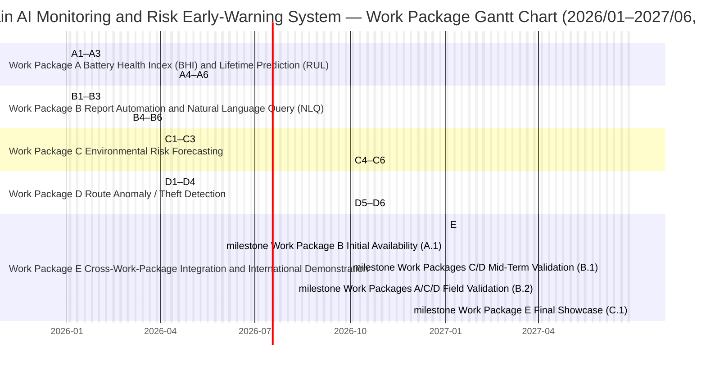
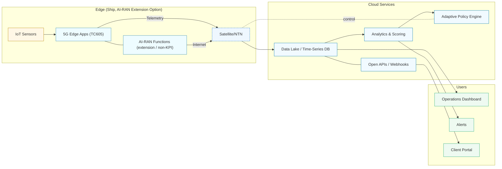

# Ministry of Economic Affairs Technology R&D Program

## A+ Corporate Innovation R&D Acceleration Program

## AI Application Enhancement Program Proposal (Submission Version)

**AI智慧供應鏈風險預測與通訊整合應用系統開發計畫**
**Project Period: From January 1, 2026 to June 30, 2027**

Company Name: ItracXing 準旺科技股份有限公司
Project Management Unit: Taipei Computer Association (TCA)

---

## Project Summary Sheet

### General Information (Amounts in NT$1,000)

- **計畫名稱：** AI智慧供應鏈風險預測與通訊整合應用系統開發計畫
- **Applicant Company Name:** ItracXing 準旺科技股份有限公司
- **Registered Address:** Banqiao District, New Taipei City
- **Program Category:** A+ Corporate Innovation R&D Acceleration Program — AI Application Enhancement Program
- **Promotion Item:** ☑ Other (Supply Chain and Logistics Monitoring)
- **Project Period:** January 1, 2026 to June 30, 2027 (Total 18 months)

**Project Principal Investigator (PI)**

- Name: Jeff Shuo
- Title: CIO
- Tel: (02) XXXX-XXXX
- Fax: N/A
- Email: jeff.shuo@itracxing.com

**Annual Budget**


|      Year      | Government Subsidy | Applicant Self-Funding | Total Project Budget | Total Person-Months |
| :------------: | -----------------: | ----------------------: | -------------------: | ------------------: |
|   Year 1       |              9,000 |                  9,000 |               18,000 |                 120 |
|   **Total**    |         **9,000** |               **9,000** |            **18,000** |            **120** |
| Share of Total |             50.0% |                  50.0% |                 100% |                   - |

**Project Contact Person**

- Name: Jeff Shuo
- Title: CIO
- Tel: (02) XXXX-XXXX
- Email: jeff.shuo@itracxing.com

---

## Project Abstract (Within 1 Page; This Abstract May Be Made Public)

### Applicant Company Profile


| Company Name | ItracXing 準旺科技股份有限公司 |
| ------------ | -------------------------------- |
| Date Founded | March 2020                       |
| Responsible Person | Dr. Chow                  |
| Main Business Items | AI supply chain monitoring systems, IoT device management, data analytics platforms |

### Project Abstract (≤ 200 Words)

Industry Mapping: Item 7 of the Eight Key Industries (Electronics Assembly Extension: Smart Manufacturing / Logistics and Transportation).

Global demand for intelligent logistics monitoring and traceability continues to rise, and the transportation and logistics market is projected to reach NT$250.2 trillion by 2030. ItracXing and Switzerland-based Arviem are jointly developing an AI-driven smart supply chain monitoring and risk early-warning system addressing four core pain points:<br>**1) Sensor reliability** — leveraging AI-based Battery Health Index (BHI) and Remaining Useful Life (RUL) prediction models to enable predictive maintenance, increasing reliability from 90% to ≥95%;<br>**2) Timely reporting** — introducing natural language query (NLQ) and multi-agent semantic orchestration to automatically generate weekly/monthly reports and anomaly summaries, significantly reducing manual compilation effort and shortening risk response time by 40%;<br>**3) Environmental risk** — integrating meteorological and traffic exogenous features to improve early warning rates for sensitive cargo (e.g., coffee beans);<br>**4) Route and theft detection** — fusing GPS, geofencing, and lock/pressure sensing (sensor fusion) to reduce false alarms and enhance security. The anomaly detection accuracy is expected to improve by 30%.

This phase does **not** focus on AI-RAN / O-RAN as the main axis, but will complete interface and integration-readiness verification. If execution results with Arviem’s AI-MaaS are positive, AI-RAN / O-RAN will be positioned as a key integration and business model expansion lever after project completion, building Taiwan’s international demonstration capabilities in smart logistics.

### Expected Outcomes at Project Completion (Summary)

The following are the core indicators and target values under five outcome categories. Detailed quantification, verification methods, and Key Performance Indicator (KPI) tracking can be found in Section V “Expected Benefits” and in the subsequent KPI tables and verification protocol sections.

| Category | Core Indicators (Summary) | Target Values / Outcome Goals |
|---------|---------------------------|-------------------------------|
| Technology | Improvement in anomaly detection accuracy; BHI/RUL prediction accuracy; shortened query response time; edge–cloud collaborative architecture | +30% accuracy; RUL MAE ≤ 10 days; response time -40%; architecture scalable |
| Business | Reduced manual reporting hours; improved customer satisfaction; reduced theft, cargo damage, and claims; enhanced international competitiveness | Reporting hours -200+ hours/month; higher NPS; lower cargo damage; differentiated offerings |
| Industry | Replicability of benchmark cases; O-RAN/AI-RAN readiness and roadmap (not a KPI this phase); cross-domain talent cultivation; international academia–industry collaboration | Demonstration cases; application scenario diffusion; ≥ 6 talents trained; international collaboration network established |
| IP/Export | Patent applications; open-source toolkits; commercializable AI models | 2–3 patents; GitHub stars ≥ 500; SaaS/licensing models |
| Social | Enhanced supply chain resilience; carbon reduction; upskilled workforce; SME AI adoption showcase | Risk response time -40%; carbon reduced by 10–15%; upskilling cases; demonstration pathways |

(*Note:* Baseline values and measurement frequencies for metrics such as availability, NLQ latency, early warning rate for violations, theft detection F1 score, carbon reduction estimation, and talent cultivation numbers are specified later in the document.)

### Keywords

Supply chain AI monitoring, explainable AI (XAI), multi-agent, IoT adaptive sampling, smart manufacturing, electronics assembly, logistics and transportation, smart logistics, Item 7 of the Eight Key Industries

---

## Table of Contents (Per Required Format)

I. Project Participants Introduction    Page No.
1. Primary Applicant Company (If multiple companies apply jointly, each should fill out a separate section)    
2. AI R&D Capability Description of Applicant / Partner Organizations                      

II. Project Content and Implementation Methods
1. Project Background and Industry Pain Points                                         
2. AI Adoption Plan                                              
3. Project Implementation Strategy                                            
4. Project Schedule and Checkpoints                                        
5. Expected Benefits                                                    
6. Risk Assessment and Mitigation Measures                                         
7. Intellectual Property Rights Statement                                              

III. R&D Team Description
1. PI Credentials                                          
2. Project Personnel Statistics                                            
3. Project Participants CVs                                          

IV. Project Budget Requirements
1. Budget Allocation by Line Item                                            
2. Expenditure Budget Summary                                              
(Actual page numbers will follow the final print-ready version.)

---

## I. Project Participants Introduction

[Summary] This section describes the positioning, R&D capacity, and key partners of the applicant, focusing on its core capabilities in supply chain AI monitoring and international export readiness as the basis for subsequent implementation and KPI planning.

### 1. Primary Applicant Company

**Company Profile (per template)**

- **Basic Information**

  - Company Name: ItracXing 準旺科技股份有限公司
  - Date of Establishment: 2020.03.15
  - Industry Classification: Information Service Industry (Category J; Computer Systems Design)
  - Top Three Shareholders/Shareholding: 60% (founder), 25% (technical team), 15% (strategic investors)
  - R&D Headcount / Total Staff: 12 / 15
  - 2024 Paid-in Capital (NT$1,000): 10,000
  - 2024 Revenue / R&D Expenditure (NT$1,000): 15,000 / 8,000
- **Business Model**

  - Core Competencies: AI-driven supply chain monitoring, IoT device management, adaptive sampling/dynamic thresholds, explainable AI (XAI)
  - Revenue Streams: AI-MaaS subscriptions, AI consulting, customized development
  - Channels: Direct sales, strategic partners (Arviem), online platforms
  - Key Customers: Arviem AG, etc.
  - Cost Structure: R&D personnel (60%), cloud resources (25%), operations (15%)
  - Key Partners: Arviem
  - International Track Record: Co-developing global markets with Arviem
  - Workplace Diversity: Gender ratio ≥ 1/3, additional female R&D hires, flexible/remote work

### 2. AI R&D Capabilities of Applicant / Partner Organizations

- **ItracXing 準旺科技**: LangChain-based multi-agent systems, learning-to-rank and cost-sensitive learning, Kalman filtering, large language model (LLM) integration, full-stack Next.js, IoT system integration.

### 3. Competitive Landscape and Technical Advantages

#### (1) International Competitor Comparison

| Category | Typical Player Positioning | Strengths | Current Gaps | Advantages of This Project |
|----------|----------------------------|----------|-------------|----------------------------|
| International digital freight / visibility platforms | Integrate booking, customs, and tracking | Mature platforms, broad customer base | Limited integration of IoT sensor data with AI prediction; NLQ mostly static queries | Focus on “smart containers + sensors” for BHI/RUL, environmental early warning, and route anomaly detection; NLQ directly queries anomaly events and supply chain risks |
| Sensor / device vendors | Provide temperature/vibration/location sensors and platforms | Diverse hardware, extensive deployment experience | Software mostly rule-based alarms, lacking explainable AI and cross-container/route learning | Use Kalman filtering + deep/time-series models to build explainable BHI/RUL and violation risk prediction, emphasizing model transparency and auditability |
| Cloud data and BI platforms | Data warehousing and dashboards | Strong generality and scalability | Require heavy customization to fully support logistics IoT schemas and SOPs | Build a “logistics IoT semantic layer + NL-to-SQL” core, with built-in vocabularies such as container, slot, route, etc., lowering customization barriers |

#### (2) Technical Innovation and Differentiated Strengths

1. **Sensor Reliability and BHI/RUL: From “Single-Point Alarm” to “Predictive Health Management”**  
	- Use Kalman filtering plus time-series deep learning (e.g., LSTM / Temporal Fusion Transformer, TFT) to build BHI and RUL, not only indicating “whether it has failed” but also “when it will likely fail.”  
	- Compared with solutions using only voltage thresholds, the approach jointly considers temperature, usage patterns, and transmission frequency, reducing misclassification and extending sensor lifetime.

2. **NLQ + Semantic Layer: From “Viewing Reports” to “Asking Questions and Getting Answers”**  
	- Design a logistics-specific semantic layer (Shipment, Lane, Container, Event, etc.) and use NL-to-SQL to safely transform natural language queries into structured queries.  
	- Aggregate BHI, violation events, route anomalies, and SLA indicators so that executives can ask questions such as “What is the temperature/humidity violation trend on Europe lanes this quarter?” instead of manually compiling reports.  
	- Apply tool constraints and refusal mechanisms to avoid hallucinations and unauthorized queries, balancing usability with governance.

3. **Environmental Forecasting and Route Anomaly Detection: Incorporating Weather/Traffic for Fewer False Alarms**  
	- For temperature/humidity-sensitive cargo, use multivariate time-series models to forecast future in-container conditions, treating weather and seasonality as exogenous features to enhance early-warning capability for violations.  
	- Route anomaly detection combines GPS, dwell patterns, and weather/traffic information to distinguish “reasonable delays” from “suspicious detours/theft risks,” prioritizing truly high-risk cases.

4. **Taiwan-First AI Logistics MaaS Architecture: Replicable, Verifiable, and Scalable**  
	- Design the system as modular “AI Function XaaS” (BHI/RUL, environmental early warning, route anomaly detection, NLQ reports) that domestic SMEs in freight forwarding, warehousing, and cold chain can adopt gradually.  
	- Keep full audit trails for all models and decision processes to satisfy EU/GDPR and international customer requirements for audits, emphasizing “explainable and traceable” AI governance.
 
  ---

  #### (3) Market Entry and Taiwan Deployment Strategy

  1. **Leverage Existing International Projects to Feed Back into Taiwan Deployment Sites**  
    - Use existing international customer projects as the first wave of data and model validation sources to rapidly accumulate model accuracy and case experience.  
    - In parallel, build small-scale pilots in Taiwan (e.g., 1–2 local freight forwarders/warehousing companies, several dozen smart containers/totes).

  2. **Focus on High-Value, High-Risk Cargo for Initial Penetration**  
    - Prioritize cargo categories such as coffee beans, food ingredients, and precision components, which are highly sensitive to temperature/humidity and damage, and can best showcase the project’s value.  
    - By reducing cargo damage and claims and enabling more accurate ETA and risk early warnings, deliver quantifiable ROI (cost savings plus premium services).

  3. **Platform and Licensing Models in Parallel**  
    - In the short term, adopt SaaS/MaaS subscription models (priced by number of devices, containers, or queries) to lower adoption barriers.  
    - In the mid to long term, provide model licensing and white-label offerings so that Taiwanese system integrators or telecom operators can integrate the technology into their own 5G/AI solutions, forming a local ecosystem.

  4. **International Collaboration and Taiwan Value**  
    - Collaborate with international industry and academia (e.g., European logistics partners and universities) to jointly publish papers and case reports, raising Taiwan’s visibility in “AI + logistics.”  
    - Develop all key models and platform cores in Taiwan and prioritize building local operations and SRE teams to ensure technology and talent remain in-country.

  ## II. Project Content and Implementation Methods

  [Summary] This section connects industry pain points with AI solutions and work packages, clearly linking “pain points → solutions → milestones → KPIs,” while reinforcing data governance and information security compliance to ensure measurability and traceability.

  ### 1. Project Background and Industry Pain Points

  This project focuses on smart logistics deployment sites, prioritizing core pain points affecting reliability, efficiency, and customer experience, and addressing them via work packages (A–E).
  - Pain Point 1 | Insufficient sensor reliability (battery degradation, environmental interference, data loss) → requires predictive battery health and lifetime management (Work Package A).
  - Pain Point 2 | Time-consuming and non-interactive reporting (manual aggregation, decision delays) → requires on-demand reporting and natural language query (Work Package B).
  - Pain Point 3 | Violation risks for environmentally sensitive cargo (e.g., humidity for coffee beans) → requires environmental condition forecasting and violation risk early warning (Work Package C; external weather and seasonal changes affect in-container temperature and humidity dynamics, so weather is treated as an exogenous feature in the environmental prediction model to improve early warning capability).
  - Pain Point 4 | Route detours and potential theft (GPS deviation, weather and traffic impacts) → requires route anomaly and theft detection (Work Package D; weather and traffic influence detours and dwell patterns, and incorporating these signals helps distinguish reasonable delays from true anomalies, reducing false alarms and enhancing theft detection).

  ### 2. AI Adoption Plan

  [Description] This section explains how the project maps the four major industry pain points to AI technologies and adoption goals in work packages A–D, and how pre-/post-adoption effects and data governance/infosec mechanisms ensure measurable and auditable outcomes.

  ### (1) Target AI Technologies: Pain Points → Work Packages → AI Solutions

  | Industry Pain Points | Corresponding Work Package | Key AI Technologies | Adoption Objectives and Outcome Targets |
  | --- | --- | --- | --- |
  | **Pain Point 1 | Insufficient sensor reliability (battery degradation, environmental interference, data loss)** | **A. Sensor Reliability Optimization** | Battery health prediction (SOH/BHI), remaining lifetime prediction (RUL), predictive maintenance models | Use AI-based BHI/RUL prediction models to establish predictive maintenance, detecting battery degradation and failure risks in advance, increasing sensor reliability from **90% → 95%+** and enabling intelligent maintenance scheduling. |
  | **Pain Point 2 | Time-consuming and non-interactive reporting (manual aggregation, decision delays)** | **B. On-Demand Reporting and Real-Time Query (NLQ)** | Natural language query (NLQ), NL-to-SQL, LLM-based report generation | Allow management and operations staff to retrieve data and reports via natural language commands, shortening report generation from **“manual, several hours → automated, seconds”**, with NLQ P95 latency target < 45 seconds and query correctness ≥ 90%. |
  | **Pain Point 3 | Violation risk for environmentally sensitive cargo (e.g., coffee bean humidity)** | **C. Environmental Risk Early Warning for Sensitive Cargo** | Multivariate temperature/humidity/quality prediction models, digital twin, weather feature modeling | Use temperature/humidity (T/H) data from Smart TOTE devices combined with external weather and seasons as exogenous features to build environmental condition forecasting and violation risk models, achieving **early warning rates for violations ≥ 70%** and reducing cold-chain/temperature-control violations and related loss/claims. |
  | **Pain Point 4 | Route detours and potential theft (GPS deviation, weather and traffic impacts)** | **D. Route Anomaly and Theft Detection (Smart TOTE)** | GPS/NTN spatiotemporal trajectory models, geofence behavior analysis, lock/pressure anomaly detection, weather/traffic context modeling | Use Smart TOTE **GPS/LTE/NTN route data + BLE padlock/pressure sensor states**, combined with weather and traffic information, to distinguish “reasonable delays” from “true anomalies,” and provide real-time alerts for **detours, suspicious dwell, and unauthorized opening/theft** with target F1 ≥ 0.85, ETA MAE improvement ≥ 25%, and false alarm rate ≤ 15%. |

  > Smart TOTE is equipped with BLE padlocks, pressure sensing, and GPS/LTE/NTN connectivity to continuously track box open/close events, lock states, and routes.  
  > Source: (V5.0.X) iTX Smart TOTE Specification

---

### (2) Before-and-After Comparison of AI Adoption (Including Smart TOTE)

| Item | Before Adoption (Current Issues) | After Adoption (Expected Outcomes) |
| --- | --- | --- |
| **Sensor Reliability and Intelligent Maintenance<br>(Pain Point 1 / Work Package A)** | Sensor battery degradation and offline incidents cannot be predicted in advance, frequently causing data gaps and costly re-measurements, which complicate anomaly interpretation and raise maintenance costs. | Use AI-based BHI/RUL prediction models to establish predictive maintenance. Proactively identify battery degradation and failure risks, achieving **availability ≥ 95%, RUL prediction MAE ≤ 10 days, and data completeness ≥ 95%**, thereby reducing unplanned downtime and maintenance costs. |
| **Report Generation and Decision-Making Efficiency<br>(Pain Point 2 / Work Package B)** | Reports are compiled manually. Most queries require “sending an email / opening a ticket → waiting hours to days,” leading to delayed decisions and poor traceability regarding who accessed which data. | Build an NLQ + automated reporting system so that management and operations can directly query in natural language. **Report generation is shortened from several hours to < 45 seconds** (initial goal for M1–M6). Query audit trails are preserved, and weekly/monthly management reports are automatically produced. |
| **Violation and Quality Risks for Environmentally Sensitive Cargo<br>(Pain Point 3 / Work Package C)** | For sensitive cargo such as coffee beans, current practice is mostly “after-the-fact investigation,” reviewing environmental data only after violations or damage occur; there is no early warning or prescriptive mitigation. | Collect Smart TOTE temperature/humidity and location data online, combined with external **weather/season** as exogenous features to build environmental condition and violation risk prediction models. Achieve **violation early warning rates ≥ 70%**, reduce violation rates by ≥ 30%, and provide concrete recommendations such as “change stowage position, adjust ventilation, add/remove desiccants.” |
| **Route Detours, Reasonable Delays, and Theft Risks<br>(Pain Point 4 / Work Package D)** | Currently, operators mainly rely on post-hoc GPS playback and manual judgment. It is hard to distinguish delays caused by weather/traffic from “route detours for theft.” Unauthorized container openings or lock tampering are often discovered only after the fact. | Use GPS/NTN trajectories and **weather/traffic information** to build route prediction and anomaly models, combined with Smart TOTE **BLE padlock/pressure sensor** data to detect unauthorized openings. The system labels “reasonable delays (due to weather/traffic congestion)” versus “suspicious detours/dwell/unauthorized opening,” targeting **F1 ≥ 0.85, false alarm rate ≤ 15%, and incident response time < 30 minutes** for critical alerts. |

### (3) Information Security and Data Governance (Compliance Mechanisms)

- **Data classification and sources:** Internal (device time-series/events), external (weather/traffic/geospatial); maintain data catalogs and lineage.
- **Access control:** Role-/attribute-based access (RBAC/ABAC) with least-privilege; read-only whitelisting for queries; retain audit logs for ≥ 1 year.
- **Personal/sensitive data:** De-identification/ anonymization (hashing/masking); for cross-border data, use regional deployments and federated learning (FL).
- **Compliance framework:** GDPR/DPIA checklists; third-party security assessments (SAST/dependency scanning); periodic vulnerability scans and DR drills (every quarter).
- **Audit and versioning:** Data version control; model versioning/rollback; full traceability of query routing and model outputs.

### 3. Project Implementation Strategy

This section consolidates deployment sites, international collaboration, and execution strategies for work packages (A–E), serving as the basis for the subsequent schedule and checkpoint design.

[Summary] Work packages are organized around pain points and executed as A–E with explicit checkpoints. International collaboration strengthens field validation and export readiness, while KPIs and milestones are aligned to ensure return on investment.

#### (1) Deployment Sites, Validation Items, and Adoption Methods

- **Validation Items (by Work Package)**

  - **Work Package A (M1–M11) | Smart Sensor Reliability Optimization**
    - BHI stability (compare fluctuations across 3 different data batches).
    - RUL prediction error MAE ≤ 10 days  
      (verified using a 20% hold-out test set).
    - Post-denoising SNR improvement ≥ 20%  
      (measured by before/after signal comparison on the same sensor).
    - Sensor data completeness ≥ 95%, availability ≥ 95%  
      (computed from 30 days of continuous telemetry).

  - **Work Package B (M1–M5) | NLQ and Automated Report Generation**
    - NLQ query correctness ≥ 90%  
      (based on ≥ 200 labeled queries compared to ground-truth answers).
    - NLQ latency P95 < 60 seconds  
      (measured via load tests with 500–1,000 queries).
    - Automated report completion rate ≥ 95%  
      (100 auto-generated reports compared with manual baselines).
    - Manual working hours reduced by ≥ 70%  
      (comparing baseline versus post-adoption time tracking).

  - **Work Package C (M4–M15) | Environmental Risk Prediction for Sensitive Cargo**
    - Environmental condition (temperature/humidity) prediction accuracy ≥ 92%  
      (evaluated via MAE/RMSE against on-site measurements).
    - Violation/abnormal event early warning rate ≥ 85%  
      (alerts triggered at least 30 minutes before events).
    - Anomaly detection F1 ≥ 0.88  
      (evaluated on a comprehensive labeled event dataset).

  - **Work Package D (M4–M15) | Route Anomaly and Theft Detection (Smart TOTE)**
    - Route-deviation detection AUC ≥ 0.90  
      (validated with at least 20 real-world abnormal route samples).
    - Theft/unauthorized opening alert F1 ≥ 0.90  
      (using BLE pressure/light/open events as ground truth).
    - ETA prediction MAE ≤ 15 minutes  
      (validated on historical transportation data and a held-out test set).
    - Open/pressure-change event detection accuracy ≥ 95%  
      (based on ≥ 50 open/close test cycles).

  - **Work Package E (M12–M18) | Cross-Module Integration and International Export Validation**
    - Cross-module (A–D) data synchronization success rate ≥ 98%  
      (daily comparison on 10,000+ records for drift).
    - Alert alignment P95 < 5 seconds  
      (based on end-to-end latency measurements).
    - Integrated NLQ latency P95 < 60 seconds  
      (across A–D modules under 1,000-query load tests).
    - ≥ 1 international showcase (e.g., Arviem / Vector / EU sites),  
      with evidence such as event records, slide decks, and partner letters.
    - ≥ 2 LOI/POC opportunities  
      (with formal letters, slide decks, or email proof).
    - ≥ 1 white paper / technical video (delivered at project closure).
    - Overall service availability ≥ 99.5%  
      (verified using 90 consecutive days of SLA monitoring).
    - System stability (crash-free rate) ≥ 99%  
      (based on backend logs and APM stats).

#### (2) International Collaboration Benefits

The project is led by ItracXing (Taiwan) in collaboration with Arviem AG (Switzerland).

- **Scope of Collaboration:**
  - Arviem: Global deployment sites, IoT devices and data access, joint validation, and customer rollouts (export value).

- **Value to Taiwan:**
  - International demonstration: Position Taiwan as the technology center and establish an “AI-MaaS for Logistics” export pathway.
  - Talent and technology uplift: Two-way collaboration between academia and industry, introducing practical experience with GDPR/AI Act compliance.

- **Industry Impact:**
  - AI-RAN/O-RAN is framed as a medium-to-long term extension (this phase focuses on AI-MaaS). The project first verifies integration points and data/interface readiness to lay the groundwork for future edge AI integration and standardization.
  - Later-stage integration (M13–M18) will focus on multi-agent throughput, federated learning privacy, and stability.

#### (3) Work Packages (Detailed Description)

##### Work Package A | Smart Sensor Reliability Optimization

Objective: Increase sensor reliability from about 90% and reduce unplanned downtime by building AI-based Battery Health Index (BHI) and Remaining Useful Life (RUL) models to enable predictive maintenance.

**A1. Objectives & Success Criteria**  
- Availability ≥ 95%; RUL MAE ≤ 10 days; BHI prediction accuracy ≥ 90% (data completeness ≥ 95%).

**A2. Data Acquisition & Preparation**  
- Use device voltage, temperature, transmission frequency, and maintenance records. Perform imputation for missing data and establish health trends.

**A3. Dataset Construction**  
- Integrate historical data with event labels (failure/maintenance) to build reproducible training and validation sets.

**A4. Modeling & Training**  
- Apply **RNN/LSTM/TFT (Temporal Fusion Transformer)** time-series models to analyze discharge curves and voltage degradation and derive BHI.  
- Combine **Kalman filtering** for signal denoising and state estimation to remove environmental interference and sensor noise.  
- Use **survival analysis** methods (e.g., Cox proportional hazards, Kaplan–Meier estimates) for RUL prediction, handling right-censored data and uncertainty.  
- Add simple rules and threshold checks to ensure stable and production-ready outputs.

**A5. Evaluation & Optimization**  
- Evaluate using accuracy and prediction error; provide concise, explainable results for operations teams.

**A6. Deployment & Showcase**  
- Deliver BHI/RUL APIs and dashboards supporting predictive maintenance scheduling, timely health alerts, and optimized maintenance decisions.

##### Work Package B | On-Demand Reporting and Natural Language Query (NLQ)

Goal: Enable executives and operations to obtain insights via natural language, and automatically generate weekly/monthly reports and prioritized alert summaries.

**B1. Objectives & Success Criteria**  
- Reduce report preparation time by ≥ 50%; NLQ P95 latency < 45 seconds; correctness ≥ 90%.

**B2. Data Acquisition & Preparation**  
- Build a semantic layer and data dictionary; integrate time-series/ event data and external aggregates.

**B3. Dataset Construction**  
- Compile common query patterns and report templates to create a maintainable data catalog and query corpus.

**B4. Modeling & Training**  
- Use whitelisted, read-only connections to the database, constraining query scopes and preventing hallucination on hard numerical facts.  
- Build an Executive Report Agent to orchestrate metric retrieval → semantic summarization → anomaly explanation → recommended actions, with support for follow-up questions and context carryover.

**B5. Evaluation & Optimization**  
- Monitor correctness and latency; refine prompt templates and refusal strategies based on audit logs.

**B6. Deployment & Showcase**  
- Launch NLQ APIs, interactive dashboards, and an Executive Auto-Report Agent with scheduled reports and interactive follow-up/drill-down.

##### Work Package C | Environmental Condition Monitoring and Forecasting

Focus: For temperature/humidity-sensitive cargo such as coffee beans, build environmental forecasting and violation risk early-warning mechanisms to reduce spoilage and claims.

**C1. Objectives & Success Criteria**  
- Achieve reasonable prediction errors; violation early warning rate ≥ 70%; violation rate reduction ≥ 30%.

**C2. Data Acquisition & Preparation**  
- Use temperature, humidity, and location data combined with route, season, and external weather information (weather as exogenous features).

**C3. Dataset Construction**  
- Build multivariate datasets with labels covering key routes and container scenarios.

**C4. Modeling & Training**  
- Apply **multivariate time-series forecasting models** such as **TFT (Temporal Fusion Transformer)**, Prophet, ARIMA/SARIMAX to predict future temperature/humidity trends.  
- Incorporate **external weather and season** as exogenous variables to improve forecast accuracy.  
- Include simple priors (e.g., physical limits, basic heat transfer heuristics) and logical checks to ensure plausible outputs.  
- Implement a **violation risk scoring mechanism** that combines predictions, confidence intervals, and historical violation patterns to trigger early alerts.

**C5. Evaluation & Optimization**  
- Evaluate using prediction error and violation detection metrics; continuously monitor concept drift.

**C6. Deployment & Showcase**  
- Provide early-warning APIs and mitigation recommendations and integrate these into customer reports (aligned with Work Package B).

##### Work Package D | Theft Detection and Route Monitoring

Goal: Use route deviation, suspicious dwell patterns, and weather/traffic context to identify potential detours and theft, and optimize alert prioritization.

**D1. Objectives & Success Criteria**  
- Detection AUC ≥ 0.90, F1 ≥ 0.85; ETA MAE improvement ≥ 25%; false alarm rate ≤ 15% (including filtering of weather/traffic-related delays); critical alert response time < 30 minutes.

**D2. Data Acquisition & Preparation**  
- Use GPS position, speed, stop points, and external traffic/weather summaries.

**D3. Dataset Construction**  
- Slice trips and label anomalies; enrich with road network features.

**D4. Modeling & Training**  
- Use **time-series models (LSTM/GRU)** to analyze GPS trajectories and movement patterns and detect deviations, unusual dwell, and speed changes.  
- Apply **graph neural networks (GNNs)** to model road-network relationships and traffic flows, and combine **weather/traffic context** to distinguish reasonable delays from abnormal detours.  
- Implement a **dynamic alert prioritization mechanism** using **Learning-to-Rank (LTR)** and cost-sensitive learning to score alerts based on risk, historical patterns, and real-time context.  
- Integrate **Smart TOTE BLE padlock and pressure sensors** to detect unauthorized opening events.  
- Implement **adaptive thresholding** that adjusts anomaly sensitivity by route, time-of-day, and cargo type to reduce false alarms.

**D5. Evaluation & Optimization**  
- Use AUC/F1 and latency metrics; conduct A/B tests against rule-based baselines.

**D6. Deployment & Showcase**  
- Deliver anomaly/theft alert services; route playback and root-cause analysis views; integrate with MCP agents for cross-work-package orchestration.

##### Work Package E | Cross-Work-Package Integration, Technical Validation, and International Export

Goal: Integrate work packages A–D into a stable, reproducible demonstration system, complete cross-module technical validation and 1–2 international showcases, and produce export-oriented white papers and go-to-market processes.

**E1. Objectives & Success Criteria**  
- End-to-end integration of A–D (APIs/events/metrics): data synchronization success rate ≥ 98%; cross-module alert alignment P95 < 5 seconds.  
- 1–2 international showcases (e.g., TOC Asia / LogiMAT / Transport Logistic), and ≥ 2 LOIs or POC agreements.  
- Deliver 1 technical white paper, 1 technical explainer video, and 1 patent highlight package (including explainability use cases and methodology sections).  
- Expert/media rating ≥ 4/5; demo defect rate shows a downward trend for three consecutive weeks.

**E2. Integration & Validation Items**  
- Metric-layer integration: unify semantics for BHI/RUL, false alarm rate, violation early-warning rate, route anomaly AUC, ETA MAE, etc.  
- Event-flow and data consistency: time alignment, timezone handling, data lineage and validators.  
- Performance and stability: NLQ end-to-end latency baseline P95 < 60 seconds, optimization targets P95 ≤ 10 seconds and ultimately ≤ 2 seconds; alert processing pipeline P95 < 5 seconds; availability ≥ 99.5%.  
- Security and compliance: GDPR/DPIA checks; regionalized deployment/federated learning; audit logs.

**E3. Main Work Items (WPs)**  
- E3-1 Demo/PoC consolidation: dashboards, API gateway, MCP agents, data catalog and dictionaries.  
- E3-2 Explainability toolkit: generate explanation reports for each alert type (feature contributions, decision paths, confidence intervals).  
- E3-3 White paper and standardization: methods, metrics, validation protocols, reproducibility steps; align with EU AI Act and O-RAN/AI-RAN extension participation (interface-level, not a deliverable this phase).  
- E3-4 International showcase operations: rehearsal plans, on-site scripts, backup topologies (live streams vs. replay), lead capture flows and legal templates (NDA/LOI/POC).  
- E3-5 Business conversion: CRM-based lead management, pricing and packaging, partnership models (Arviem channel / direct / licensing), and post-project tracking.

**E4. KPIs & Checkpoints (Milestones & KPIs)**  
- Technical integration: data synchronization success rate ≥ 98%; cross-module alert P95 latency < 5 seconds; NLQ correctness ≥ 90%, P95 latency baseline < 60 seconds and end-of-project target < 45 seconds (subsequent phases may further refine to ≤ 30 seconds, then ≤ 10 seconds, and long-term ≤ 2 seconds).  
- Showcases and export: ≥ 1 international showcase; ≥ 2 LOI/POC agreements; white paper / video / website pages online; ≥ 10 qualified leads within 30 days post-event.  
- Quality and stability: zero P1 defects in the two weeks before the showcase; decreasing integration defect rate; service availability ≥ 99.5%.

**E5. Risks & Mitigation**  
- Event schedule or partner delays → backup events or online launch; co-branded releases with partner sites; early “preview” white paper if needed.  
- Unstable connectivity during showcases → dual fallback designs with warm-up datasets + live streams; offline caches and replay; degraded read-only mode.  
- Compliance reviews not completed → use anonymized/synthetic data and regional deployments, switch to live data after approval; move third-party audits earlier.  
- Demo bugs and stability issues → rehearsal checklists, rollback playbooks, gray releases, and dedicated read-only demo accounts.

**E6. Deployment & Showcase Deliverables**  
- Production environment: cloud-based minimal viable service, monitoring dashboards, and DR topology.  
- Showcase assets: technical white paper, video, casebook, media kit (including charts and metric explanations).  
- Legal/commercial artifacts: LOI/POC templates, NDA, pricing and licensing outlines, and partnership model descriptions.  
- Acceptance documents: checkpoint reports, third-party validation summaries, post-event performance reports (leads and conversion rates).

**AI Functions – Milestone – KPI Mapping Table**

| AI Function | Milestone | Core KPI | End-of-Project Target |
| --- | --- | --- | --- |
| BHI/RUL Battery Health Prediction | A.1 / A.2 | Availability | ≥ 95% |
| NLQ and Auto-Reporting (Including Executive Agent) | A.1 / B.1 | NLQ P95 Latency | < 45 seconds |
| Environmental Condition Prediction | B.1 | Violation Early Warning Rate | ≥ 70% |
| Route/Theft Detection | B.1 / B.2 | Detection F1 / ETA MAE | F1 ≥ 0.85 / MAE improvement ≥ 25% |

### 4. Project Schedule and Checkpoints

This section’s Gantt chart aligns with the subsequent “Planned Progress and Checkpoints” and “AI Function – Milestone – KPI Mapping Table,” using milestone codes A.1 / B.1 / B.2 / C.1.

### Gantt Chart (2026/01–2027/06, 18 Months; Work Package View)



### Planned Progress and Checkpoints

#### Planned Progress (Fiscal Year Basis; At Least One Checkpoint Every Six Months)

- **2026/01–2026/05 (M1–M5; Milestone A.1)**  
  - Objective: Initial availability for Work Packages A/B.  
  - Main Deliverables:  
    - Work Package A: BHI data pipelines and denoising flows completed (A1–A3); initial BHI/RUL models trained.  
    - Work Package B: Foundational NL-to-SQL and RAG functions available (B1–B3); early prototype of auto-reporting and Executive Alerts online (early B4–B6).  
  - Checkpoint: A.1 (end of May 2026).

- **2026/04–2026/09 (M4–M9; Milestone B.1)**  
  - Objective: Mid-term model completion for Work Packages C/D.  
  - Main Deliverables:  
    - Work Package C: Multivariate time-series datasets and TFT models (C1–C3) with environmental risk prediction meeting target AUC/MAE.  
    - Work Package D: Route anomaly/theft detection LSTM/graph models (D1–D4) with dynamic alert logic operational in test sites.  
  - Checkpoint: B.1 (end of September 2026).

- **2026/04–2027/03 (M4–M15; Milestone B.2)**  
  - Objective: Field validation for Work Packages A/C/D.  
  - Main Deliverables:  
    - Work Package A: BHI/RUL models running in production sites with reliability and MAE meeting targets.  
    - Work Package C: Environmental risk prediction achieving early-warning targets in selected deployment sites.  
    - Work Package D: Route anomaly/theft detection completing A/B tests on real logistics routes with F1 and ETA MAE improvements meeting targets.  
  - Checkpoint: B.2 (end of March 2027).

- **2027/01–2027/06 (M13–M18; Milestone C.1)**  
  - Objective: Work Package E — international showcases, cross-work-package integration, and acceptance.  
  - Main Deliverables:  
    - Work Package E: End-to-end integrated demo across modules, including dashboard, MCP agents, data catalog, and explainability toolkit.  
    - Completion of 1–2 international showcases; delivery of white paper, technical video, and commercialization collateral.  
    - Achieve service stability and availability targets (availability ≥ 99.5%, integration defect rate trending downward).  
  - Checkpoint: C.1 (end of June 2027).

#### Checkpoint Descriptions

- **A.1 (End of May 2026) — Work Packages A/B Initial Availability**  
  - Initial BHI/RUL models with RUL MAE ≤ 15 days.  
  - Anomaly detection accuracy ≥ 85%; Kalman-based denoising SNR improvement ≥ 20%.  
  - MCP database integration completed with real-time query support.  
  - Auto-reporting and executive alert system online.  
  - Deliverables: System prototypes, technical documentation, test reports.

- **B.1 (End of September 2026) — Work Packages C/D Mid-Term**  
  - Alert optimization models trained; F1-score ≥ 0.85.  
  - Deliverables: Model training reports and mid-term validation results.

- **B.2 (End of March 2027) — Work Packages A/C/D Field Validation**  
  - BHI/RUL targets met (RUL MAE ≤ 10 days; BHI accuracy ≥ 90%).  
  - False alarm rate ≤ 15% (including filtering of weather/traffic-driven delays; ≥ 40% improvement over baseline).  
  - Predictive maintenance mechanism validated in both lab and field tests.  
  - Deliverables: Field test datasets, BHI/RUL performance reports, predictive maintenance benefit analysis.

- **C.1 (End of June 2027) — Work Package E Final Showcase and Acceptance**  
  - Multi-agent collaboration stack fully deployed with target throughput.  
  - Federated learning POC passes privacy and performance checks.  
  - Production environment deployment complete with full API documentation.  
  - Final acceptance and international showcase completed.  
  - Deliverables: Production system, API docs, acceptance report, and showcase materials.

### Milestones & Disbursement (Control Mechanism)

To ensure quality and controllability, the project adopts a **milestone-based disbursement** mechanism and defines a **Go/No-Go decision point** at M15.

#### Disbursement Schedule (Milestones vs. Work Package Groups)

| Milestone | Period | Key Milestones (Work Package Grouping) | Disbursement Share | Disbursement Amount | Retained Amount |
| --- | --- | --- | --- | --- | --- |
| Milestone A (A.1) | M1–M5 | Work Package B initial availability + Work Package A data pipelines/denoising | 40% | 3,600K | — |
| Milestone B (B.1/B.2) | M4–M15 | Work Packages C/D models and validation + Work Package A RUL/lifetime extension | 35% | 3,150K | — |
| Milestone C (C.1) | M13–M18 | Work Package E international showcases + production deployment (cross-work-package integration) | 20% | 1,800K | 5% (450K)* |
| Final Acceptance | M18+ | Pass acceptance tests | 5% | 450K | — |
| **Total** | — | — | **100%** | **9,000K** | — |

*The final 5% retention is disbursed after passing acceptance tests and delivering patent filings and technical documentation.

#### Critical Decision Point: M6 Go/No-Go Review (Mapped to Work Packages A/B/D)

At the M6 milestone (June 2026), a **major review** is conducted. At least **3 out of 4 indicators** must be met to proceed to subsequent work packages:

| Indicator | Target | Minimum Passing Threshold | Verification Method |
| --- | --- | --- | --- |
| 1. Anomaly detection accuracy | ≥ 90% | ≥ 85% | Test-set evaluation report |
| 2. Kalman denoising SNR improvement | ≥ 20% | ≥ 15% | Empirical comparison on real sensor data |
| 3. Arviem deployment agreement | Signed | LOI confirmed | Cooperation agreement or letter of intent |
| 4. Patent filing progress | 1 filed | 1 in preparation | Patent filing documents or drafts |

**Decision Rules:**  
- **Go:** 3/4 indicators met → proceed with subsequent work packages and planned disbursements.  
- **Conditional Go:** 2/4 indicators met → submit improvement plan; withhold 10% of later-stage budget and re-review at M9.  
- **No-Go:** < 2 indicators met → terminate the project or significantly down-scope; no disbursement of remaining funds.

#### Risk Control Mechanisms

1. **Monthly Progress Reports:** Summarize technical progress and financial usage.  
2. **Quarterly Technical Reviews:** Invite external experts to assess technical progress.  
3. **Flexible Budget Reallocation:** 600K contingency budget may be reallocated with approval.  
4. **Key Personnel Backup:** If key staff change, a replacement plan must be submitted within 30 days.

### 5. Expected Benefits

[Summary] This section presents technical and operational benefits using quantitative KPIs and verification protocols, defining measurement methods and frequencies to ensure traceability and auditability.

### KPI Metrics and Measurement Methods

| KPI | Baseline | Target (End of Project) | Measurement Method | Data Source | Frequency |
| --- | --- | --- | --- | --- | --- |
| Sensor Availability | 90% (2024 average) | ≥ 95% | Daily uptime and data completeness aggregation | iTracXing IoT Sensor DB | Monthly |
| BHI Prediction Accuracy | No baseline (new model) | ≥ 90% | BHI predictions vs. actual health state | Work Package A models | Quarterly |
| RUL Prediction Accuracy (MAE) | No baseline (new model) | ≤ 10 days | RUL MAE | Work Package A models | Quarterly |
| NLQ Response Latency (P95) | 2–5 minutes (manual queries) | < 45 seconds | P95 API latency logs | Work Package B NLQ gateway logs | Weekly |
| NLQ Query Correctness | No baseline (first-time adoption) | ≥ 92% | NL-to-SQL query accuracy | Work Package B models | Quarterly |
| Environmental Violation Early Warning Rate | 0–2 hours (existing systems) | ≥ 70% | Time between alert and violation | Work Package C sensor DB | Monthly |
| Route Deviation Detection AUC | No baseline (new model) | ≥ 0.90 | ROC-AUC | Work Package D GPS/NTN data | Quarterly |
| Theft Alert F1-score | No baseline (new model) | ≥ 0.85 | Confusion matrix-derived F1 | Work Package D GPS/NTN data | Quarterly |
| ETA MAE | Current MAE ≈ 1.8–3.2 hours | ≥ 25% improvement | ETA estimates vs. actual arrival times | Work Package D models | Monthly |
| ESG: Inefficient Transport Reduction | No baseline (first measurement) | ≥ 10–12% | Route distance before/after optimization | Work Package D routing logs | Semi-annually |
| ESG: Cold-chain/temperature-control anomaly reduction | Anomaly rate X% (2024) | ≥ 15% improvement | Anomaly statistics | Work Package C sensor DB | Quarterly |

### Technical Verification Protocols (Ensuring Measurable Benefits)

#### BHI/RUL Accuracy Verification (Key KPI)

For the core value proposition of “AI-based battery health index and remaining lifetime prediction,” the project defines a rigorous verification protocol:

**Baseline Data Collection**  
- Devices: 100 IoT sensors.  
- Environment: Arviem logistics sites (mixed sea/land).  
- Duration: 12 months.  
- Metrics: Voltage, temperature, transmission frequency, usage patterns, failure events.

**Model Development**  
- Training data: First 9 months of historical data.  
- Validation data: Last 3 months of data.  
- AI models: Time-series models (LSTM/TFT) + survival analysis.  
- Feature engineering: Battery health trends, environmental factors, usage patterns.

**Prediction Validation**  
- Devices: 50 IoT sensors (independent test set).  
- Environments: Multiple scenarios (land, sea, cold chain).  
- Period: 6 months.  
- Method: Compare predictions against actual failure times.

**Success Criteria**  
1. BHI prediction accuracy ≥ 90% (correct classification of health states).  
2. RUL MAE ≤ 10 days.  
3. Early warning rate ≥ 85% (alerts issued within 14 days before failure).  
4. False alarm rate ≤ 15%.  
5. Independent validation and test reports completed.

**Timeline**  
- Early phase (M1–M5): Historical data collection and feature engineering.  
- Mid phase (M6–M12): Model training and initial validation.  
- Validation phase (M13–M15): Independent test validation and fine-tuning.  
- Late phase (M16–M18): Field deployment and long-term tracking.

#### Alert Optimization Performance Verification

**Alert Optimization KPIs**  
- Baseline: Fixed-threshold rules engine.  
- Target: Dynamic optimization (learning-to-rank, adaptive thresholds, anomaly scoring).  
- Dataset: 18 months of historical data (from Arviem).  
- A/B test: 50/50 traffic split for 3 months.

**Comparison Metrics**

| Metric | Baseline Rules | Dynamic System | Improvement Goal |
| --- | --- | --- | --- |
| False alarm rate (incl. weather/traffic filtered) | 25% | ≤ 15% | -40% |
| Miss rate | 8% | ≤ 5% | -37.5% |
| F1-score | 0.72 | ≥ 0.85 | +18% |
| Critical alert response time | 60 minutes | < 30 minutes | -50% |
| User satisfaction (NPS) | Baseline | +20 points | — |

**Verification Deliverables**  
1. System performance test report (M15).  
2. Arviem field-validation report (M18).  
3. Third-party independent test report (before closure).

### Quantified Benefits (Amounts in NT$1,000; With Calculation Methods and Evidence)

#### Overall KPI Table (Indicator/Baseline/Target/Method/Source/Frequency)

| KPI | Baseline | Target | Measurement | Data Source | Frequency |
| --- | --- | --- | --- | --- | --- |
| Sensor Availability | 90% (2024 average) | ≥ 95% | Uptime ratio: active devices ÷ total devices, aggregated daily | IoT monitoring system, time-series DB | Weekly/Monthly |
| BHI Prediction Accuracy | No baseline (first 3 months used to build baseline) | ≥ 90% | BHI prediction vs. actual health state | Work Package A validation set | Quarterly |
| RUL MAE | Rule-based baseline only | ≤ 10 days | MAE between predicted RUL and actual lifetime | Work Package A models | Quarterly |
| Anomaly Detection Accuracy (Composite AUC/Precision) | ≈ 70% (rule-based 2024 baseline) | **+30% → ≥ 90%** | Independent test set + third-party test report | Third-party reports | Milestones |
| NLQ Query Success Rate (Correctness) | No baseline (500 labeled queries to establish) | ≥ 95% | NL-to-SQL correctness vs. gold answers | NLQ gateway logs, APM | Weekly |
| NLQ P95 Latency | < 60 seconds (load-test baseline) | < 45 seconds | Load test (200 concurrent, 1,000 queries) | APM, test reports | Weekly/Monthly |
| Incident Response Time | ≈ 45–90 minutes (manual) | -40% | Timestamp difference from alert to mitigation | Event DB, alert system | Monthly |
| Environmental Violation Early Warning Rate | ≈ 0–2 hours early | ≥ 70% | Alert lead time ÷ violation event window | Site logs, sensor DB | Monthly |
| Theft F1-score | No baseline (pseudo-labeling + real incidents) | ≥ 0.85 | Confusion matrix-based F1 | GPS/NTN labeled data | Milestones |
| Report Preparation Hours | ≈ 200 hours/month (manual) | ≤ 100 hours/month | PMO time-tracking system | PMO, Jira/time-tracking tools | Monthly |
| Service Availability | 99.0% (current) | ≥ 99.5% | Total uptime ÷ total time | Monitoring platform (Grafana/Datadog) | Weekly/Monthly |

| Outcome Item | Before | Year 1 | Year 2 | Evidence |
| --- | --- | --- | --- | --- |
| Patent applications approved/filed | 0 | 2 | 3 | Patent filings and office actions |
| Induced investment | 0 | 6,500 | 6,500 | Investment agreements and MOUs |
| New jobs created (persons) | 0 | 5 | 10 | Employment contracts and HR records |
| R&D salary uplift (%) | — | +10% | +15% | Payroll and HR documentation |

#### Induced Investment (New Items)

| Investment Item | Investor | Amount (NT$1,000) | Description |
| --- | --- | --- | --- |
| AI-RAN/O-RAN Testing and Validation (Extension Option) | External research institute | 3,000 | Post-project extension (non-KPI this phase) for AI-RAN/O-RAN trial deployments and performance validation, including test nodes and AI accelerator servers. |
| AI-RAN Edge AI Platform Co-Development (Extension Option) | ItracXing & Arviem | 2,000 | Post-project extension (non-KPI this phase) of AI modules to AI-RAN edge nodes for low-latency logistics monitoring. |
| International Export Collaboration (Global Sites; Extension Option) | Arviem AG | 1,500 | Exporting the AI-RAN-integrated solution to Arviem customer sites (e.g., major ports) as cross-border validation (post-project extension, non-KPI this phase). |

Total induced investment: NT$6,500K.  
Note: AI-RAN/O-RAN items are post-project extension investments (not core deliverables or KPIs this phase) and will be activated only if AI-MaaS collaboration with Arviem meets performance expectations.

**Adoption Benefits (Summary)**  
- **Cost reduction:** Data transmission costs -60% (via adaptive sampling/compression/edge pre-filtering).  
- **Yield/service availability:** Cold-chain violations -30%.  
- **Efficiency:** Incident response time -50%; analysis labor hours -40%.  
- **Revenue/production:** Additional AI-MaaS/consulting/export revenues.

### Qualitative Benefits and Commercialization Plan

- **For the applicant:** Technology upgrade, talent development, and expansion of product lines into international markets.  
- **For the industry:** Increased value-add and autonomy, enabling international collaboration.  
- **Energy and carbon reduction:** Relative to fixed sampling, estimate annual CO₂ reduction through energy savings and reduced maintenance trips (calculation formulas in appendices).  
- **Commercialization:** Set post-project 3-year targets for induced investment and revenues (ARR targets and formulas are provided in attachments).  
- **Dissemination:** Organize showcases or conference sessions before closure to publicize technical highlights and validation results.

The project will also, within three years after completion, leverage AI-RAN/O-RAN extension investments (this phase only completes interface design and feasibility verification, not as a KPI) with external research institutes to build a commercializable AI edge-computing platform. This forms new application scenarios combining smart logistics monitoring with 5G low-latency computing and serves as a foundation for international export and future standardization work. It will also act as a demonstration case for a domestic AI-RAN ecosystem.

#### O-RAN/AI-RAN Positioning (This Phase vs. Mid/Long Term)

- **This phase (18 months):** Focus on AI-MaaS (BHI/RUL, NLQ, auto-reporting, environmental forecasting, route/theft detection). Complete “integration readiness” for AI-RAN/O-RAN interfaces and data paths.  
- **Post-project:** Depending on AI-MaaS performance with Arviem, extend modules to O-RAN/AI-RAN edge nodes as a key integration and business expansion lever.



Note: AI-RAN components in the diagram are mid/long-term extensions and not part of this phase’s deliverables.

### International Market Potential and Revenue Estimates

**Assumptions**  
- Customer base: Arviem has > 5,000 multinational customers.  
- Adoption rate: 1% (≈ 50 customers) in three years.  
- Average subscription: USD 12K/year/customer.  
- FX: 1 USD ≈ NT$32.

**Annual Service Revenue (AI-MaaS)**  
- Customers × annual price × FX ≈ 50 × 12,000 × 32 = NT$19.2M/year.  
- Three-year cumulative (without compounding, conservative): ≈ NT$57.6M.

**AI-RAN/O-RAN Extension (Post-Project, Non-KPI)**  
- Domestic AI-RAN ecosystem annual value: ≈ NT$30M.  
- Overseas export (AI-RAN integration projects and services, three-year cumulative): ≈ NT$90M.

**Overall Production Value (Including Multipliers)**  

$$
  	ext{Estimated Production Value (NT$)} = (\text{Customers} \times \text{Annual Subscription}) \times 32 \times 3 \times 1.3
$$

- Three-year cumulative total (AI-MaaS + AI-RAN extension, including upstream/downstream effects): ≈ NT$120M.  
- Export share: ≈ 70%; domestic contribution: ≈ 30%.

### 6. Risk Assessment and Mitigation Measures

#### Detailed Risk Matrix and Mitigation Strategies

| Risk Category | Specific Risk | Impact | Likelihood | Mitigation Strategy | Owner |
| --- | --- | --- | --- | --- | --- |
| **Technical** | Model drift/data shift | High | Medium | Quarterly retraining; real-time monitoring thresholds; model versioning and rollback; 300K contingency for re-training and tuning. | AI team |
| **Technical** | Instability of dynamic thresholds/ranking policies | Medium | Medium | Model ensembles (LR/XGBoost/LTR); cross-validation and hyperparameter tuning; rule-engine fallback. | AI team |
| **Data** | Poor field data quality | High | Medium | Use Arviem’s existing datasets; build data cleaning and enrichment pipelines; supplement training with synthetic data. | Data team |
| **Data** | Cross-border compliance challenges | High | Low | Regional deployments (EU/Asia); federated learning; external GDPR compliance consultants. | Jeff Shuo + Legal |
| **Integration** | Heterogeneous device/protocol differences | Medium | Medium | Standardized APIs and adapter layers; support MQTT/HTTP/CoAP; multi-site compatibility tests. | IoT team |
| **Human Resources** | Key-person risk (Jeff Shuo) | Very High | Low | Weekly updated technical wiki; quarterly architecture reviews; deputy PI (Gary Lin); external expert pool (3 backups); incentives and bonuses. | Management |
| **Human Resources** | Delay in hiring female AI engineer | Medium | Medium | Multi-channel recruiting; external contractor support; 100K execution-risk buffer. | HR + PM |
| **Market** | Delays in Arviem collaboration | High | Medium | Early MOU/LOI; quarterly joint reviews; backup domestic logistics partners; 200K market-validation budget. | BD + Jeff Shuo |
| **Market** | Global demand fluctuations | Medium | Medium | Diversify verticals (cold chain/manufacturing/ports); flexible feature prioritization; parallel domestic-market development. | BD team |
| **Adoption** | Low user adoption / internal resistance | Medium | Medium | UX testing for dashboards/reports; training and manuals; monitor adoption metrics (active queries/DAU) and iterate. | PMO + Frontend team |
| **Regulatory** | Rising EU AI Act compliance costs | Medium | Medium | Design for explainability; early compliance reviews; budget for legal consultation. | Legal + external counsel |
| **Regulatory** | Export-control constraints | Low | Low | Avoid controlled technologies (e.g., military AI); third-party compliance audits; IP strategy to protect core know-how. | Legal |
| **Competitive** | Large vendors launching similar solutions | Medium | Medium | Strengthen differentiation via explainable AI; agile iteration with customer lock-in; 3 planned patent filings. | Entire team |
| **Financial** | Budget overrun | Medium | Medium | 600K contingency; monthly budget tracking; milestone-based disbursement controls. | Finance + PM |

#### Risk Monitoring Mechanisms

1. **Weekly risk meeting:** Core team reviews risk dashboards.  
2. **Monthly risk reports:** Submitted to the program office.  
3. **Quarterly external reviews:** External experts provide independent assessment.  
4. **Emergency response process:** Initiate response within 24 hours; submit remediation plan within 72 hours.

#### Key-Person Risk Reinforcement

Given Jeff Shuo’s central role, the project implements:

1. **Knowledge management:**  
   - Weekly updates to technical wiki.  
   - Quarterly architecture document reviews.  
   - Code review and documentation standards.

2. **Succession planning:**  
   - Deputy PI (Gary Lin) mentored over 6 months.  
   - Monthly technical sharing sessions for team-wide knowledge.

3. **Incentives:**  
   - Success-based project bonuses.  
   - Attribution in technical outputs and patents.  
   - Flexible work arrangements.

### Benefit Tracking and Dashboards

- KPI dashboards for availability, NLQ latency/success rate, F1, early warning rates.  
- Weekly/monthly reports aligned with the KPI table, including trends and gap analyses.  
- Iterative improvement plans for underperforming metrics.  
- Full audit trails for dashboards, query routing, and model versions/outputs.

### 7. Intellectual Property Rights Statement

- Core algorithms and system designs will be protected via patents and copyrights, with IP ownership and licensing governed by collaboration agreements.  
- Third-party rights (data/libraries/modules) will be inventoried to ensure proper licensing.  
- Patent plan: 2 domestic filings and 1 international filing (focusing on supply-chain anomaly detection and intelligent sampling).

### Application of Results (IP Timeline and Ownership)

To clarify IP ownership and exploitation timeline, the following table lists planned filings, timing, and rightsholders:

| Planned Item | Type | Region | Expected Filing Month | Rightsholder | Notes/Milestone |
| --- | --- | --- | --- | --- | --- |
| IoT Sampling Optimization Driven by Event Triggers and Variance | Invention/Utility Model | TW | 2026/05 (IDF 2026/03; draft 2026/04) | ItracXing 準旺科技股份有限公司 | Early Work Packages A/B outputs |
| Explainable Supply Chain Anomaly Detection System | Invention | TW | 2026/06 (prior art search 2026/04) | ItracXing 準旺科技股份有限公司 | Bridge between Work Packages A/B |
| Multi-Agent Supply Chain Monitoring with Federated Learning | PCT | PCT | 2026/10 (priority from TW) | ItracXing 準旺科技股份有限公司 | Work Package E international IP footprint |
| Battery Health Index (BHI) Computation Module | Software Copyright | TW | 2026/02 | ItracXing 準旺科技股份有限公司 | Work Package A output (A2/A3) |
| Multi-Agent Task Orchestrator (MCP/Agent Orchestrator) | Software Copyright | TW | 2026/08 | ItracXing 準旺科技股份有限公司 | Work Package C/D outputs (B1/B2) |

**Ownership and Licensing Principles**  
- IP owner: Unless otherwise agreed in writing, IP is owned by **ItracXing 準旺科技股份有限公司**.  
- Partner licenses: Non-exclusive, non-transferable licenses granted per contract for specific domains/territories/terms.  
- Background IP: Each party retains ownership of its pre-existing IP; improvements handled as agreed.  
- Jointly developed artifacts: Default ownership by ItracXing with contractual usage rights for partners; joint patents will reflect share ratios in filing documents.

**Internal Governance and Milestones**  
- IDFs submitted by M2 (2026/02), with rolling updates.  
- Novelty/patentability searches completed by M3 (2026/03).  
- Drafting/review by M4 (2026/04); filings in M5–M6.  
- PCT filing by M10 (2026/10); national-phase entries within 12–30 months.  
- SBOM and license inventories completed before filing to ensure open-source and third-party compliance.

---

## III. R&D Team Description

[Summary] This section presents the PI and core team credentials, division of labor, and person-month allocation aligned with work package progress to demonstrate feasibility and execution capacity.

### 1. PI Credentials

- Name: Jeff Shuo | Title: CIO | Gender: Male | Industry: Information Services  
- Key Achievements: 20+ years of AI/IoT systems experience; led multi-agent collaboration, AI safety, and supply-chain blockchain projects; experience managing cross-border teams in the US and Taiwan and building explainable, compliant AI systems.

**Education/Experience/Projects**  
- Education:  
  - M.S., Electrical Engineering and Computer Science, University of Illinois at Chicago (1992).  
  - MBA, San Diego State University (2005).
  
- Experience:  
  - AI Agent Architect  
    - Led design and integration of LLMs, learning-to-rank/dynamic thresholds, LangChain/LangGraph, RAG, MCP, and ReAct-style multi-agent architectures.  
    - Focused on supply-chain security.  
  - Qualcomm Inc. — Director of Engineering (2004–2018)  
    - Led 100+ IoT/AR/VR/smart device projects and 50+ engineer teams.  
    - Built Python/Keras/Node.js systems for automatic resource scheduling.  
  - HTC Corp. — Senior Technical Manager (2003–2004)  
    - Led protocol engineering teams, developed the first Windows Mobile phone.  
  - Qualcomm Inc. — Senior Engineer (1997–2003)  
    - Embedded driver development for CDMA/GlobalStar phones and RF/LCD/Bluetooth/ATE software.  
  - Motorola Inc. — Senior Engineer (1994–1997)  
    - Supported overseas CDMA base station/handset factories and built Windows OOD/OOP calibration tools.  
  - IBM — Software Engineer (1993–1994)  
    - AS/400 I/O subsystem C++ driver development.

- Representative Projects:  
  - Phoenix Multi-Agent SOC (2024–2025): Multi-agent collaboration, AI safety, and compliance.  
  - SecuX AI SOC, supply-chain blockchain tagging, HSM-secured signing.  
  - Qualcomm/HTC/Google smart device and embedded projects.

- Technical Expertise:  
  - Multi-agent orchestration (LangChain, LangGraph, AutoGPT, ReAct, MCP).  
  - AI safety, compliance, and explainable AI systems.  
  - Embedded RTOS, ARM, Linux/Yocto, IoT (BLE, NB-IoT).  
  - Blockchain/Web3 (ERC-1056, ERC-3643, DID, RWA tokenization).  
  - Secure hardware (HSM, FIDO2, PKI).

- Person-Month Commitment: 18 months (100%).

### 2. Project Personnel Statistics (Headcount)

> Per template: by company, highest degree, gender, average seniority, and “positions to be hired” (≤ 30% of total headcount).

| Company | PhD | Master’s | Bachelor’s | Gender (M/F) | Avg. Seniority | Positions to Hire |
| --- | --- | --- | --- | --- | --- | --- |
| ItracXing | 1 | 4 | 1 | 5 / 1 | 8 years | 1 |
| Research Center | 1 | 1 | 0 | 1 / 1 | 10 years | 0 |
| Total | 2 | 5 | 1 | 6 / 2 | 9 years | 1 |

### 3. Project Participants CVs

Per template: PI, key R&D, general R&D, and to-be-hired (person-months aligned with the 120 total person-months).

| Name | Title/Role | Education | Expertise/Responsibility | Person-Months | Gender | Company | Work Packages |
| --- | --- | --- | --- | --- | --- | --- | --- |
| Jeff Shuo | CIO / PI | M.S. (Univ. of Illinois at Chicago, EECS), MBA (San Diego State Univ.) | Multi-agent collaboration, AI safety, embedded and IoT edge–cloud architecture, international site integration; responsible for overall technical decisions, architecture reviews, and cross-work-package integration; leads BHI/RUL technical direction in Work Package A, coordinates NLQ/reporting requirements in Work Package B with data/model flows in A/C/D, and leads Work Package E (international showcases, technical validation, and white papers). | 18 | M | ItracXing | A, B, C, D, E |
| Lu, Hsiao-Chang | Firmware Engineer / IoT Edge | M.S. (Musician’s Institute, GIT Performance) | C/C++, Python, Java, Go; multithreading, protocols, memory management, and performance optimization; ARM Cortex, RTOS, UART/SPI/I2C drivers and hardware testing; embedded AI/ML; RESTful API, MQTT, WebSocket; responsible for sensor-side firmware, battery and state telemetry (Work Package A), and Smart TOTE integration for C (environment) and D (lock/pressure/location). | 12 | M | ItracXing | A, C, D |
| Lin, Chang-Jui | Project Manager / AI Applications | B.S. (National Chin-Yi Univ. of Technology, CS) | Python and computer vision (TensorFlow, YOLO) for face recognition, emotion and age prediction; big data analytics and statistical modeling; NLP, speech recognition (STT), LLM-based text generation and chatbots with RL-based interaction optimization; responsible for NLQ/auto-reporting and multi-agent architecture (Work Package B), supports model design/evaluation in A/C/D, and co-leads Work Package E (overall AI application planning, demo scripts, and international showcases). | 12 | M | ItracXing | A, B, C, D, E |
| Tsai, Yi-Min | Backend Engineer | M.S. (National Chin-Yi Univ. of Technology, CS) | Backend development and operations (API design, DB design, server deployment); TypeScript, Node.js, Golang, FastAPI; TensorFlow, OpenCV, scikit-learn basics; Docker, Nginx, CI/CD; responsible for backend services and data pipelines across A–D (BHI/RUL, NLQ, environmental forecasting, route/theft detection APIs/ETL) and supports integration testing and deployment in Work Package E. | 12 | M | ItracXing | A, B, C, D, E |
| Kuo, Kuan-Hung | Full-Stack Web Engineer | M.S. (National Chin-Yi Univ. of Technology, CS) | Full-stack development (React, Vue.js, Next.js, Node.js, FastAPI); real-time dashboards and data visualization (Chart.js, D3.js, ECharts); RESTful APIs and auth; integrates AI services (Hugging Face, LangChain, OpenAI API); responsible for front/back integration and monitoring dashboards across A–D (including Smart TOTE/alert dashboards), and leads integrated demo sites/admin consoles in Work Package E. | 12 | M | ItracXing | A, B, C, D, E |
| Chu, Chih-Yun | Flutter Engineer | B.S. (National Chin-Yi Univ. of Technology, CS) | Flutter (Dart, MVVM, Provider, Riverpod) with independent iOS/Android delivery; RESTful API/GraphQL/WebSocket integration; mobile AI (chat, recommendation, behavior prediction, voice control); Firebase, SQLite, Hive; responsible for mobile apps and field UIs for B–D (alerts, on-site responses and queries), and supports mobile demos and light-weight use cases in Work Package E. | 10 | M | ItracXing | B, C, D, E |
| (To be hired) | AI Engineer | M.S. (AI/CS) | Learning-to-rank, federated learning, large-scale training and model tuning; planned to support mid-to-late AI agent training and validation, focusing on Work Packages C/D for multi-site modeling and deployment, and as needed for A/B/E advanced model optimization and operations. | 12 | F | ItracXing | C, D (and as needed A/B/E) |

---

## IV. Project Budget Requirements (NT$1,000)

[Summary] This section presents personnel, cloud/lease, collaborative R&D, travel, and contingency allocations, with a 50/50 split between subsidy and self-funding, and milestone-based disbursement to control risk.

### 1. Budget Allocation by Line Item

#### (1) Personnel Costs for Innovative/R&D Staff

| Role | Avg. Monthly Salary (A) | Person-Months (B) | Year 1 Personnel Cost (A×B) | Notes |
| --- | ---: | ---: | ---: | --- |
| PI | 141 | 18 | 2,538 | Full-time |
| Project Manager | 86 | 18 | 1,548 | Full-time |
| AI Engineers ×2 | 85 | 36 | 3,060 | Including 1 to-be-hired |
| Full-Stack/IoT Engineers ×2 | 80 | 24 | 1,920 | — |
| IoT System Engineers ×2 | 79 | 16 | 1,264 | 8 months × 2 |
| Financial Controller | 81 | 12 | 972 | Admin (not counted as R&D person-months) |
| Administrative Assistant | 65 | 12 | 780 | Admin (not counted as R&D person-months) |
| **Subtotal (Company Personnel)** | — | 108 (R&D) + 24 (Admin) | **12,082** | Amounts in NT$1,000; includes reallocated items (2,982K) |

Note: Company R&D person-months total 108; admin support 24 person-months not counted as R&D; remaining 12 person-months (to reach 120) are covered by academic partners and external experts under “commissioned research/validation,” avoiding double-counting.

#### (2) Consumables and Raw Materials

| Item | Unit | Quantity | Unit Price | Year 1 | Purpose |
| --- | --- | ---: | ---: | ---: | --- |
| Subtotal (rolled into personnel costs) | — | — | — | 0 | Consumables reallocated to personnel costs |

#### (3) Equipment Usage/Maintenance/Cloud/EDA Rental

##### 3-1 Equipment Usage (Depreciation: A×B/60)

| Equipment | Original Cost (A) | Person-Months (B) | Allocated (A×B/60) | Year 1 | Purpose |
| --- | ---: | ---: | ---: | ---: | --- |
| Subtotal (rolled into personnel costs) | — | — | — | 0 | Depreciation reallocated to personnel costs |

##### 3-2 Cloud/EDA Rental/Services

| Item | Pricing Model | Monthly Fee | Months | Year 1 | Purpose |
| --- | --- | ---: | ---: | ---: | --- |
| API and LLM Inference (OpenAI/Anthropic) | Usage-based | 15 | 12 | 180 | NLQ and RAG prompting and evaluation; additional inference capacity. |
| Monitoring/Logging/APM (DataDog/NewRelic) | Monthly | 8 | 13 | 104 | Performance monitoring, alerting, log analysis, observability. |
| Containerized Deployment (K8s/ECS/AKS) | Monthly | 7 | 14 | 98 | M6–M18 microservice deployment, edge-agent management, CI/CD. |
| AI Dev Tools (IDE plugins/collab) | Monthly | 6 | 13 | 78 | Development productivity (AI coding assistants, reviews, documentation generation). |
| Code Security & Quality (SAST/dependency checks) | Monthly | 5 | 14 | 70 | Supply-chain security and vulnerability scanning. |
| **Subtotal** | — | — | — | **530** | Amounts in NT$1,000; only inference and essential monitoring/deployment tools retained. |

**Cloud Resource and Tooling Strategy (Revised)**  
- **Early (M1–M5):** No local training; use cloud inference, demo/test containers, basic monitoring, AI dev tools, and SAST; CI/CD pipelines established.  
- **Mid (M6–M17):** Use cloud services and pipelines for feature iteration and A/B tests; resilience via offline backups, not local training hardware.  
- **Late (M18):** Production deployment and acceptance; cloud resources sized for minimal viable service.  
- **Cost Control:** Turn off high-cost compute; usage-based billing with budget caps; non-working hours shutdown; all major changes go through PR/review; monthly cost review and alerts.

##### 3-3 Equipment Maintenance

| Item | Unit | Quantity | Unit Price | Year 1 | Purpose |
| --- | --- | ---: | ---: | ---: | --- |
| Subtotal (rolled into personnel costs) | — | — | — | 0 | Maintenance reallocated to personnel costs |

##### 3-4 Subtotal (3-1 + 3-2)

| Subtotal |  |  |  | 530 | NT$1,000; only 3-2 cloud/EDA services counted |

#### (4) Technology Introduction, Commissioned Research, and Collaborative R&D (Revised)

##### Principles

Most R&D work is performed in-house. Only items requiring third-party neutrality, credibility, or compliance (e.g., penetration testing, AI/GDPR compliance, patent work) are commissioned. Commissioned spending is **12.5%** of total budget, in line with program rules.

International partners (Arviem AG, domestic logistics sites, international research centers) contribute via collaboration or in-kind support to strengthen validation and export potential while satisfying Taiwan’s verification requirements.

##### Commissioned Research & Professional Services

| Category | Partner | Scope | Amount (NT$1,000) | Deliverables |
| --- | --- | --- | ---: | --- |
| **1. Commissioned Research** | External research institution | Adaptive sampling, model validation, and performance testing | **800** | Performance test reports and validation datasets |
| **2. Consulting & Compliance** | External experts | AI safety, data governance, GDPR compliance | **436** | GDPR/AI safety assessments |
| **3. Patents & Professional Docs** | Patent/legal firms | Domestic/foreign patent filings, technical white papers | **581** | 3 patent filings, white paper |
| **4. Testing & Certification** | Third-party labs | Penetration testing and independent performance validation | **436** | Security and performance reports |
| **Total Commissioned** | — | — | **2,253** | — |

Commissioned share: Total budget 18,000K; commissioned 2,253K → **12.5%**.

##### Academic and Collaborative R&D

| Partner | Scope | Form | Amount (NT$1,000) | Notes |
| --- | --- | --- | ---: | --- |
| International research center | Federated learning and AI ethics | Academic collaboration | 581 | Research collaboration |
| Arviem AG | Global sites, devices, and cross-border data | In-kind | 580 | International collaboration |
| Domestic logistics/cold-chain sites | On-site deployment, routing tests, data | Field collaboration | 0–100 | In-kind support |

##### Training and Tools

| Item | Scope | Form | Amount (NT$1,000) | Notes |
| --- | --- | --- | ---: | --- |
| Dev tools and internal training | AI coding assistants, secure coding training, quarterly workshops | Training/tools | 771 | Capability-building |

##### Summary (Per MOEA Format)

| Category | Amount (NT$1,000) | Share of Total | Notes |
| --- | ---: | ---: | --- |
| Commissioned research & professional services | **2,253** | **12.5%** | Commissioned |
| Academic collaboration | 581 | 3.2% | Research collaboration |
| International collaboration (in-kind) | 580 | 3.2% | International |
| Tools and training | 771 | 4.3% | Capability building |
| Domestic field collaboration | 0–100 | 0.5% | Validation support |
| **Total** | **18,000** | **100%** | — |

Program compliance: Commissioned spending is 12.5% of total budget; core technologies (BHI/RUL, NLQ, anomaly detection, multi-agent orchestration, pipelines) are developed in-house; partners strengthen validation and export without undermining autonomy.

#### (5) Domestic Travel

| Item | Unit | Quantity | Unit Price | Year 1 | Purpose |
| --- | --- | ---: | ---: | ---: | --- |
| Research center validation/travel | Trip | 12 | 8 | 96 | Lab coordination and testing (Hsinchu/Central Taiwan Science Parks) |
| Site tests (ports/warehouses) | Trip | 16 | 7 | 112 | On-site deployment, sensor calibration, and inspections |
| Customer/partner technical meetings | Trip | 8 | 5 | 40 | Arviem and local partner integration meetings |
| Expert review meetings | Trip | 7 | 6 | 42 | Review and checkpoint assessments |
| **Subtotal** | — | — | — | **290** | NT$1,000 |

#### (6) Patent Application Incentives

| Item | Unit | Quantity | Unit Price | Year 1 | Purpose |
| --- | --- | ---: | ---: | ---: | --- |
| Domestic patent incentives | Case | 2 | 22 | 44 | Supply-chain anomaly detection and sampling optimization |
| Foreign patent incentives | Case | 1 | 72 | 72 | Multi-agent/explainability-related |
| **Subtotal** | — | — | — | **116** | NT$1,000 |

#### (7) Contingency and Risk Management

| Item | Unit | Quantity | Unit Price | Year 1 | Purpose |
| --- | --- | ---: | ---: | ---: | --- |
| Technical risk contingency | Lot | 1 | 218 | 218 | Model retraining, algorithm changes, extra testing |
| Market validation & customer development | Lot | 1 | 145 | 145 | Customer interviews, POCs, and market research |
| Execution risk buffer | Lot | 1 | 72 | 72 | Hiring delays, equipment issues, schedule adjustments |
| **Subtotal** | — | — | — | **435** | NT$1,000; ensures execution flexibility and risk control |

### 2. Expenditure Budget Summary

#### Revised Budget Summary

| Line Item | Subsidy | Self-Funding | Total | Share |
| --- | ---: | ---: | ---: | ---: |
| 1. Personnel | 6,041 | 6,041 | 12,082 | 67.1% |
| 2. Consumables/Raw Materials | 0 | 0 | 0 | 0.0% |
| 3. Equipment Usage/Cloud Rental | 265 | 265 | 530 | 2.9% |
| 4. Equipment Maintenance | 0 | 0 | 0 | 0.0% |
| 5. Technology Introduction/Collaborative R&D | 2,273 | 2,274 | 4,547 | 25.3% |
| 6. Domestic Travel | 145 | 145 | 290 | 1.6% |
| 7. Patent Incentives | 58 | 58 | 116 | 0.6% |
| 8. Contingency and Risk Management | 218 | 217 | 435 | 2.4% |
| **Total R&D Budget** | **9,000** | **9,000** | **18,000** | **100%** |
| **Percent** | **50.0%** | **50.0%** | **100%** | — |

Note: Total budget is 18,000K, with sufficient cloud and operations allowance to support 18 months of development. Government subsidy is capped at 50.0%.

---

## V. Attachments

- Attachment 1: Previous government-funded projects (category/status/amount/benefits/differences).  
- Attachment 2: Collaboration agreements (per template).  
- Attachment 3: Technology introduction/commissioned research/validation proposals and contracts.  
- Attachment 4: Advisor and expert consent forms.  
- Attachment 5: Others (e.g., security audits, DPIAs, communication/promotion plans).

### Appendix A: Timeline and Work Package Mapping Table

To preserve existing labels (A1–C5) and help reviewers, the appendix maps them to the new work packages:

- A1 (NLQ) → Work Package B (NLQ & reporting).  
- A2 (battery anomaly detection) → Work Package A (BHI/RUL & reliability).  
- A3 (Kalman denoising) → Work Packages A (pre-processing/denoising) and C (forecast pre-processing).  
- A4 (MCP DB/query integration) → Cross-work-package data layer (A–D).  
- A5 (management reports/executive summaries) → Work Package B (Executive Alerts).
- B1 (alert optimization/route anomaly) → Work Package D (theft/route monitoring).  
- B2 (IoT smart sampling) → Work Packages A×D (lifetime extension × alert performance).  
- B3 (joint validation/testing) → Work Packages A/C/D field validation.  
- C1–C4 (multi-agent/FL/deployment/API) → Cross-work-package integration (A–D).  
- C5 (acceptance and delivery) → Work Package E (showcase and closure).

### Appendix B: Revision Log

- Reviewer comment: “Use work packages instead of raw technology lists.”  
  - Revision: Introduced Work Packages A–E following a six-step structure (objectives/data/dataset/modeling/evaluation/deployment).  
- Reviewer comment: “Pain points are written as solutions; rewrite from the industry perspective.”  
  - Revision: Rewrote Section II.1 with four industry pain points and linked them to WPs.  
- Reviewer comment: “Strengthen international collaboration value.”  
  - Revision: Added “International Collaboration Benefits” under implementation strategy.
- Reviewer comment: “Technical methods not concrete enough (e.g., RNN for discharge curves).”  
  - Revision: Detailed RNN/LSTM/TFT and survival analysis in Work Package A; added time-series/graph models and adaptive alerts in C/D.  
- Reviewer comment: “Use work packages to connect quantitative indicators and validation.”  
  - Revision: Added KPIs and evaluation methods per WP; preserved A/B testing protocols.  
- Reviewer comment: “Market/exhibition work (WP5) should be explicit.”  
  - Revision: Added Work Package E for international showcases/export.  
- Reviewer comment: “Data governance and infosec description is insufficient.”  
  - Revision: Added dedicated data governance/information security subsection (GDPR, DPIA, audit logs).
- Other suggestions not adopted: Long-term multi-language NLQ and new product lines, which are reserved for future expansion.

### Appendix C: Reviewer Feedback Consolidation (Robert)

| Original Comment | Status | Incorporated Section | Notes |
| --- | --- | --- | --- |
| Present as “work packages” instead of technology lists | Adopted | II.3 Work Packages A–E | Six-step structure (objectives/data/dataset/modeling/evaluation/deployment). |
| Describe pain points from customer perspective | Adopted | II.1 pain points + matrix | Links pain points → WPs → KPIs. |
| Strengthen international collaboration value | Adopted | II.3 international collaboration benefits | Highlights Arviem and academic partners. |
| NLQ/technical indicators too technical | Partially adopted | KPI table and milestones | Focused on service benefits and KPIs. |
| Add quantified market/economic benefits | Adopted | Section V expected benefits | New KPIs and revenue projections. |
| Explicit WP5 for marketing/showcases | Adopted | Work Package E | International exhibition and export metrics. |
| Insufficient data governance/infosec detail | Adopted | II.2(3) data governance | Compliance and audit mechanisms. |
| Other non-adopted suggestions | Not adopted | — | Long-term multilingual NLQ/new product lines for future phases. |

---

## VI. Expected Benefits and Key Performance Indicators (KPI)

### (1) Technical Benefits

- Battery and sensor reliability improved by ≥ 30%.  
- False-positive/false-negative rates reduced by ≥ 20%.  
- Prediction accuracy ≥ 90%; MTBF improved by ≥ 25%.  
- Edge AI adaptive sampling increases device battery life by 40–60%.

### (2) Economic and Industry Benefits

- Overall operating costs reduced by ≥ 20%.  
- Maintenance and manual analysis labor hours reduced by ≥ 40%.  
- Accelerated supply-chain AI adoption, strengthening Taiwan’s smart-manufacturing ecosystem.

### (3) Export and Internationalization Benefits

- Joint global-market entry with Arviem, building an AI logistics brand.  
- AI-MaaS solution positioned for export, generating follow-on business.

---

## VII. Commercialization and Sustainability Strategy

### Strategy Framework

- **Capital structure:** 50% government subsidy, 50% corporate self-funding to ensure shared risk and long-term commitment.  
- **IP management:** Core IP owned by the applicant, with licenses granted to partners per contracts.  
- **Data and privacy:** GDPR-compliant design and federated-learning architecture.  
- **Commercialization:** Achieve post-project 3-year ARR of NT$12M from induced revenues.  
- **Internationalization:** Launch the jointly developed AI-MaaS solution globally via Arviem.

### Technical and Business Model Description

#### NLQ Latency–Based Tiered Pricing

Pricing tiers based on average NLQ latency:

- **≤ 60 seconds:** Standard tier.  
- **≤ 10 seconds:** Premium tier.  
- **≤ 2 seconds:** Real-time tier.

Latency-based SLAs map to service tiers and pricing.

### Market Validation Plan (M1–M15 Must-Hit)

To ensure commercialization feasibility, the project defines the following milestones:

#### Demand Validation (M1–M6)

**Objective:** Validate market demand and pricing tolerance.

| Item | Target | Completion Criteria | Deliverables |
| --- | --- | --- | --- |
| Customer interviews | 20 companies | Logistics/cold-chain/manufacturing | Interview reports and needs analysis |
| Pain-point surveys | 50 responses | Focus on alert fatigue, battery cost, predictive capabilities | Survey results and statistics |
| Price-sensitivity tests | 15 deep interviews | Acceptance of USD 5–15K/month range | Pricing strategy report |
| Competitive analysis | 5 key competitors | IBM, Uptake, C3 AI, Samsara, etc. | Competitive positioning matrix |

Budget source: 200K from contingency under “market validation and customer development.”

#### Customer Commitment (M6–M9)

**Objective:** Secure verifiable commercial intent.

| Commitment Type | Target | Minimum | Verification |
| --- | --- | --- | --- |
| LOIs | 3 | 2 | Signed documents with expected adoption scope |
| POC agreements | 2 | 1 | Agreements specifying test periods and success criteria |
| Arviem formal collaboration | 1 | Must-have | Contract including revenue-sharing and territory clauses |
| Technology partner MOUs | 2 | 1 | SI or equipment vendor partnerships |

This checkpoint maps to item 3 in the M6 Go/No-Go review (Arviem deployment agreement).

#### Commercial Validation (M10–M18)

**Objective:** Generate actual revenue and success stories.

| Metric | Mid-Term (M6–M15) | Late (M16–M18) | Calculation |
| --- | --- | --- | --- |
| Pilot customers | 2 | 5 | Paying or long-term trials (> 6 months) |
| Deployed devices | 100 | 500 | Arviem + others |
| ARR (services) | USD 30K | USD 150K | Monthly price × 12 × customers |
| Customer retention | — | ≥ 80% | Pilot → full deployment |
| NPS | — | ≥ 40 | Customer satisfaction survey |

**Collaboration and Revenue Split**  
- Via Arviem: 70% of revenue to Arviem, 30% to ItracXing.  
- Direct sales: 100% to ItracXing.  
- Licensing: Separate patent licensing terms.

ItracXing designs and manufactures Nordic NTN-based IoT trackers and gateways, selling them to Arviem and via Arviem’s global channels. Arviem acts as global channel partner for ItracXing-branded or co-branded IoT devices.

### Revenue Forecast and Commercialization Path

IoT hardware revenue is led by ItracXing; Arviem receives revenue shares or channel rebates per contract.

#### (1) 2027–2029 Three-Year Forecast (IoT Devices + Services; Post-Project, Non-KPI)

| Item | 2026 | 2027 | 2028 | 2029 |
| --- | --- | --- | --- | --- |
| IoT Device Sales (sets/price) | 75 × $1,000 | 600 × $1,000 | 900 × $1,000 | 1,200 × $1,000 |
| a. IoT Device Revenue | $75,000 | $600,000 | $900,000 | $1,200,000 |
| Services (customers/price/duration) | 1 × $3,500/month × 3 months | 2 × $4,000/month × 12 | 3 × $4,500/month × 12 | 4 × $5,000/month × 12 |
| b. Service Revenue | $10,500 | $96,000 | $162,000 | $240,000 |
| c. Consulting/Licensing & Others | $7,500 | $56,000 | $80,000 | $120,000 |
| **Total (a+b+c)** | **$93,000** | **$752,000** | **$1,142,000** | **$1,560,000** |
| **ARR (NT$, 1:32)** | **2.98M** | **24.06M** | **36.54M** | **49.92M** |

Note: This is a post-project revenue scenario for planning only, not a target KPI.

#### (2) Revenue Forecast (2026–2029 + O-RAN/AI-RAN Projects/Licensing)

| Item | 2026 (USD) | 2027 (USD) | 2028 (USD) | 2029 (USD) |
| --- | --- | --- | --- | --- |
| IoT Device Revenue (a) | $75,000 | $600,000 | $900,000 | $1,200,000 |
| Service Revenue (b) | $10,500 | $96,000 | $162,000 | $240,000 |
| Consulting/Licensing & Others (c) | $7,500 | $56,000 | $80,000 | $120,000 |
| O-RAN/AI-RAN Projects/Licensing (d, post-project, non-KPI) | $0 | $60,000 | $200,000 | $200,000 |
| **Total (a+b+c+d)** | **$93,000** | **$812,000** | **$1,342,000** | **$1,760,000** |
| **ARR (NT$, 1:32)** | **2.98M** | **25.98M** | **42.94M** | **56.32M** |

#### (3) Revenue Structure: Hardware vs. Services (2026–2029)

| Item | 2026 (USD) | 2027 (USD) | 2028 (USD) | 2029 (USD) |
| --- | --- | --- | --- | --- |
| Total revenue | $93,000 | $812,000 | $1,342,000 | $1,760,000 |
| Hardware (a) | $75,000 | $600,000 | $900,000 | $1,200,000 |
| Services (b+c) | $18,000 | $152,000 | $242,000 | $360,000 |
| **Hardware share** | **80.65%** | **79.79%** | **78.81%** | **76.92%** |
| **Service share** | **19.35%** | **20.21%** | **21.19%** | **23.08%** |

Key observations:  
1. **Hardware-led revenue:** IoT device sales remain the primary revenue source (≈ 80%) in early years, with business risk tied to Arviem’s execution and customer price sensitivity at ~$1,000 per device.  
2. **Rising service importance:** Service revenue share increases steadily. Given its higher margin, its contribution to profits and valuation exceeds its share of top-line revenue.  
3. **Growth drivers:**  
   - 2026–2027: Explosive growth from 75 to 600 devices.  
   - 2027 onward: Steady growth with expanding service share, shifting toward a “hardware + services” model.

### Collaboration Model and Profit-Sharing

#### 1. Profit Sharing

1) Via Arviem: 50% of gross profit to Arviem, 50% to ItracXing.  
2) Direct sales: 100% of gross profit to ItracXing.  
3) Separate patent licensing terms for IP.

#### 2. Roles

- **ItracXing:** Designs and manufactures Nordic NTN-based IoT trackers and gateways; sells to Arviem and through Arviem to global markets.  
- **Arviem:** Acts as global sales/channel partner and promotes ItracXing-branded or co-branded IoT devices.

```text
                    Sales Channel
                   /            \
                  /              \
            Arviem Channel      Direct Sales
                 |                  |
                 |                  |
            Profit Split 50/50   100% to ItracXing
```

---

## VIII. Risk Assessment and Response Measures

| Risk Item | Potential Impact | Mitigation Strategy |
| --- | --- | --- |
| Technical | Model drift/data shift | Periodic retraining and threshold monitoring |
| Data security | Cross-border compliance | Regional deployments and federated learning |
| Integration | Heterogeneous device interfaces | Standardized APIs and adapter modules |
| Human resources | Core staff turnover | Documentation and external expert support |
| Policy | Export-control changes | Compliance reviews and third-party audits |
| Adoption | Low usage/adoption | UX testing, training, and adoption metrics tracking |

---

## IX. Intellectual Property and Research Ethics

- Core algorithms, system designs, and validation methods will be protected via domestic and international patents (target: 2 domestic, 1 international).  
- All partners adhere to research-ethics and data confidentiality requirements, ensuring traceability and compliance.  
- Third-party data and open-source components are tracked via license inventories.

---

## X. Conclusion

[Summary] This section recaps the linkage from pain points to outcomes, emphasizing that quantitative KPIs, checkpoints, and governance mechanisms are in place and that the solution is extensible and export-ready.

The project centers on “AI-enhanced learning for supply-chain monitoring via international collaboration,” aiming to improve reliability and decision-making efficiency in manufacturing and logistics. The 18-month schedule delivers high-impact, feasible results aligned with the AI Application Enhancement Program’s criteria on innovation, technical superiority, and market value.

> **Editorial Notes:**  
> - All amounts are in NT$1,000 (rounded); government subsidy ≤ 50%.  
> - Checkpoints, person-months, and budget line items are consistent across tables; final month includes acceptance checkpoints.  
> - A public summary and restricted detailed version (with contracts/personnel) are maintained.
