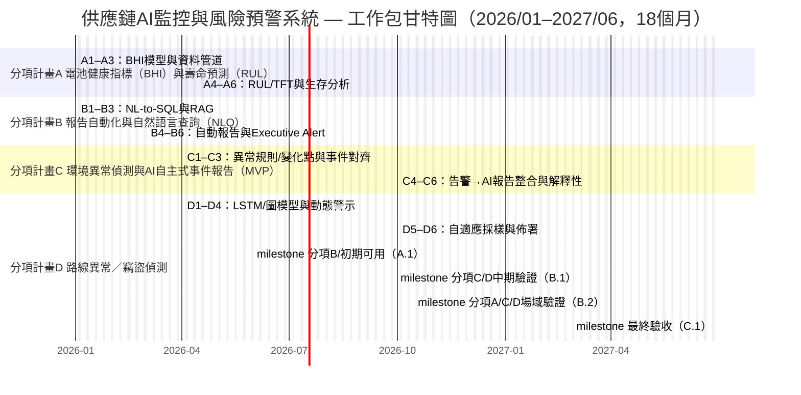

# Ministry of Economic Affairs Technology R&D Project

## A+ Corporate Innovation R&D Refinement Program

## AI Application Elevation Program Proposal (Submission Version)

**AI Smart Supply Chain Risk Prediction and Communications Integration System Development Project**  
**Project Period: From 2026-01-01 To 2027-06-30**

Company Name: ItracXing 準旺科技股份有限公司  
Managing Organization: Taipei Computer Association

---

## Proposal Summary Table (Cover and Front Matter)

### Consolidated Information (Amount Unit: thousand NT$)

- **Project Name:** AI Smart Supply Chain Risk Prediction and Communications Integration System Development Project
- **Applicant Company Name:** ItracXing 準旺科技股份有限公司
- **Mailing Address:** B1, No.20, Alley 1, Lane 768, Section 4, Bade Road, Nangang District, Taipei City
- **Program Category:** A+ Corporate Innovation R&D Refinement Program — AI Application Elevation Program
- **Promotion Item:** ☑ Other (Supply Chain & Logistics Monitoring)
- **Project Start–End Time:** 2026-01-01 To 2027-06-30 (Total 18 months)

**Project Principal Investigator**

- Name: Jeff Shuo
- Title: CIO
- Tel: (02) XXXX-XXXX
- Fax: None
- Email: jeff.shuo@itracxing.com

**Annual Budget**

|     Year     | Government Subsidy | Company Self-Funding | Total Project Budget | Project Person-Months |
| :-----------: | -----------------: | --------------------: | -------------------: | --------------------: |
|   Year 1      |            9,000 |               9,000 |             18,000 |                120 |
|   **Total**   |        **9,000** |           **9,000** |         **18,000** |            **120** |
| Share of Total |            50.0% |               50.0% |             100% |                  - |

**Project Contact**

- Name: Jeff Shuo
- Title: CIO
- Tel: (02) XXXX-XXXX
- Email: jeff.shuo@itracxing.com

---

## Project Abstract (≤200 words; may be publicly disclosed)

### Applicant Company Profile

| Company Name | ItracXing 準旺科技股份有限公司 |
| ------------ | ------------------------------- |
| Founded      | 2020-03 |
| Responsible Person | Dr. Chow |
| Main Business Items | AI supply chain monitoring systems, IoT device management, data analytics platforms |

### Project Abstract (≤200 words)

Industry Mapping: Eight Key Industries item 7 (extension of electronic assembly: smart manufacturing / logistics & transportation).

Global demand for smart logistics visibility and traceability is accelerating; transportation and logistics market size is projected to reach NT$250.2 trillion by 2030. This project, jointly advanced by ItracXing and Swiss partner Arviem, targets four pain points: insufficient sensor reliability, time‑consuming report generation, delayed risk awareness for environment-sensitive goods, and inability to promptly identify route deviation or suspected theft. It will build four AI modules: Battery Health Index (BHI), Remaining Useful Life (RUL) prediction, Natural Language Query (NLQ) plus AI autonomous reporting, environment anomaly detection, and route/theft detection. Within 18 months it will complete at least 1 international + 1 domestic deployment site (International: Arviem; Domestic: Simique (TBD)), achieving sensor availability ≥95%, risk response time shortened ≥40%, environment violation rate for temperature/humidity sensitive goods reduced ≥30%, theft/unauthorized opening detection F1 ≥0.85, and establishing an exportable AI-MaaS business model. Estimated cumulative post‑project 3‑year output ≈ NT$120 million, enhancing Taiwan’s international visibility in AI smart logistics.

### Expected Outcomes at Project Completion (Summary Table)

Below summarizes key measurable targets across five dimensions (technology, business, industry, intellectual property & export, social/ESG). All KPIs (Key Performance Indicators) have defined measurement methods, data sources, and update frequencies in later sections to ensure auditability.

| Category | Core Indicators (Summary) | Completion Targets (Measurable & Verifiable) |
|----------|---------------------------|----------------------------------------------|
| Technology | Sensor reliability & predictive capability; anomaly detection & query efficiency | Sensor availability from 90% to **≥95%**; BHI accuracy **≥90%**; RUL MAE **≤10 days**; environment anomaly F1 **≥0.88**; route deviation AUC **≥0.90**; theft detection F1 **≥0.85**; NLQ accuracy **≥92%**; NLQ P95 latency **<60 s**; risk response time reduced **≥40%**. |
| Business | Operational efficiency & cost optimization; subscription and project revenue foundation | Manual weekly/monthly report labor reduced **≥200 hours/month**; environment violation rate decreased **≥30%**; theft/unauthorized opening detection F1 **≥0.85**; invalid transport & claims loss reduced **≥10–15%**; secure **≥2** LOI/POC (domestic or international); complete **≥1 international + 1 domestic deployment site** (International: Arviem; Domestic: Simique (TBD)) forming verifiable basis for cumulative **≥NT$120M** 3‑year output after completion. |
| Industry | Deployment site demonstration; local ecosystem & cross-domain talent cultivation | Complete **≥1** representative smart logistics AI deployment (e.g., international maritime / temperature-sensitive goods / electronic assembly supply chain) with a reproducible blueprint & SOP; cultivate **≥6** cross-domain “AI + logistics/manufacturing” talents including **≥1** female R&D staff; enable cooperation via workshops, forums, and case sharing. |
| IP / Export | Intellectual property layout; AI model commercialization & export ratio | File **2–3** patent applications (including **≥1 PCT**); register **1–2** core module computer program copyrights (e.g., BHI/RUL, anomaly detection, NLQ orchestration); establish AI-MaaS / LaaS export framework with international customer revenue ≈ **70%** of derivative income within 3 years; publish **≥1** external technical white paper or open tool. |
| Social / ESG | Supply chain resilience; energy saving & carbon reduction; SME demonstration | Risk response time for critical anomalies shortened **≥40%** improving cross-border resilience; adaptive sampling + route optimization yields estimated 3‑year CO₂ reduction **≈10–15%** (~**80+ tons CO₂e**); complete **1–2** Taiwan SME demonstrations (logistics / manufacturing / temperature-sensitive goods) forming auditable cases for policy reference. |

### Keywords

Supply chain AI monitoring, explainable AI (XAI), multi-agent (MA), IoT adaptive sampling, smart manufacturing, electronic assembly, logistics & transportation, smart logistics, Eight Key Industries item 7

---

## I. Participant Introduction

Summary: This section presents the applicant’s positioning, R&D capacity, and partners—focusing on supply chain AI monitoring core capabilities and international export foundation aligned with execution feasibility and KPI allocation.

### 1. Main Applicant

**Company Profile (Template)**

- **Basic Information**
  - Company Name: ItracXing 準旺科技股份有限公司
  - Established: 2020-03-15
  - Industry Classification: Information Services (Category J; Computer Systems Design)
  - Top Three Shareholders / Holdings: 60%, Technical Team / 25%, Strategic Investor / 15%
  - R&D Personnel / Total Headcount: 12 / 15
  - 2024 Paid-in Capital (thousand NT$): 10,000
  - 2024 Revenue / R&D Expense (thousand NT$): 15,000 / 8,000
- **Business Model**
  - Core Competencies: AI-driven supply chain monitoring, IoT device management, adaptive sampling / dynamic thresholds, explainable AI (XAI)
  - Revenue Items: AI-MaaS subscriptions, AI consulting, customized development
  - Channels: Direct sales, strategic partner (Arviem), online platform
  - Major Customers: Arviem AG and others
  - Cost Components: R&D personnel (60%), cloud resources (25%), operations (15%)
  - Key Partner: Arviem
  - International Export Track Record: Joint development of global market with Arviem
  - Inclusive Workplace Plan: Gender ratio ≥1/3, hire additional female R&D staff, flexible / remote work

### 2. Applicant / Partner AI R&D Capability

**ItracXing 準旺科技** focuses on IoT sensing and satellite communications chain product development, integrating endpoint sensors, communications modules, and cloud platforms. It collaborates with international logistics monitoring partners, combining proprietary IoT devices and AI applications to develop “AI-Monitor as a Service (AI-MaaS)” and “AI Logistics as a Service (LaaS)” subscription models aimed at global supply chain monitoring and smart logistics markets. In this project it provides an end-to-end solution from “endpoint sensors—satellite / mobile communications—cloud AI platform—decision dashboard,” strengthening deployment feasibility, industry diffusion potential, and export capacity aligned with smart transportation / smart logistics priorities.

### 3. Competitive Landscape and Technical Advantage Analysis

#### (1) International Competitor Comparison

| Category | Typical Player Positioning | Strengths | Current Gaps | Project Advantages |
| -------- | -------------------------- | --------- | ------------ | ------------------ |
| International digital forwarders / visibility platforms | Booking, customs, tracking integration | Mature platforms, broad customer base | Limited integration of IoT sensor data with predictive AI; NLQ often static | Focus on “smart containers + sensors” for BHI/RUL, environment early warning, route anomaly detection; NLQ retrieves anomalies and supply chain risk directly |
| Sensor / device vendors | Provide temperature / vibration / location sensors & platforms | Hardware variety, deployment experience | Mostly rule-based alerts; lacks explainable AI (XAI) and cross-container / route learning | Kalman + deep time series (LSTM/TFT) to build explainable BHI/RUL with transparent model audit |
| Cloud data & BI platforms | Data warehousing, dashboards | General-purpose scalability | Heavy customization needed for detailed logistics IoT schema & SOP | Logistics IoT semantic layer + NL-to-SQL, embedding container, lane, route vocabulary reducing customization |

#### (2) Technical Innovation and Differentiated Advantages

1. **Sensor Reliability & BHI/RUL: Transition from “single-point alert” to “predictive health management”**  
   - Kalman filtering + time-series deep learning (e.g., LSTM / Temporal Fusion Transformer) derive BHI (Battery Health Index) and RUL (Remaining Useful Life), enabling early indication of degradation.  
   - Considers temperature, usage pattern, and transmission frequency versus simple voltage thresholds—reduces false alarms and extends service life.

2. **NLQ + Semantic Layer: Shift from “viewing static reports” to “asking questions gets answers”**  
   - Domain-specific semantics (Shipment, Lane, Container, Event) with NL-to-SQL secure translation of natural language to structured queries.  
   - Consolidates BHI, violation events, route anomalies, and SLA metrics—executives ask “What is Q2 humidity violation trend on Europe lanes?” instead of manual extraction.  
   - Tool constraints and refusal safeguards reduce hallucination and unauthorized queries—balancing usability and governance.

3. **Environment & Route Anomaly Detection: Layered deployment reduces false positives**  
   - For temperature/humidity sensitive goods: “change-point + threshold + event alignment” as MVP for anomaly detection and autonomous reporting; defines report SLA (P95 ≤ 2 min) and early warning rate.  
   - Route anomaly combines GPS patterns with weather/traffic context to distinguish “reasonable delay” from “high-risk deviation,” prioritizing real threats.

4. **Taiwan-first AI Logistics MaaS Architecture: Reproducible, auditable, extensible**  
   - Modular AI Function XaaS (BHI/RUL, environment warning, route anomaly, NLQ reporting) enabling gradual adoption by local forwarders, warehouses, temperature-sensitive and security-focused operators.  
   - Full audit trails for all models and decisions to meet EU/GDPR and international compliance—emphasis on explainability and traceability (XAI governance).

---

#### (3) Market Entry and Taiwan Deployment Strategy

1. **Leverage existing international projects to accelerate Taiwan site feedback**  
   - Use international customer deployments as initial data/model validation source for rapid accuracy improvement.  
   - Parallel small-scale Taiwan pilot (1–2 domestic forwarders/warehouses; dozens of smart containers/pallets).

2. **Focus on “high-value, high-risk goods” segment**  
   - Prioritize coffee beans, food ingredients, precision components—temperature/humidity sensitive and loss-prone, maximizing demonstrable value.  
   - Reduced spoilage and claim costs plus improved ETA and risk alerts yield quantifiable ROI (cost saving + premium service).

3. **Platform subscription and licensing dual track**  
   - Near-term LaaS / MaaS subscription (priced by device/container/query volume) lowers adoption barriers.  
   - Mid-term offers model licensing / white-label for Taiwanese system integrators or telecoms integrating into 5G/AI solutions; fosters ecosystem.

4. **International collaboration amplifies Taiwan value**  
   - Joint publications (academic / industry) with global logistics partners and universities boost Taiwan visibility in “AI + logistics.”  
   - Core model and platform development retained in Taiwan; local operations and SRE team ensure domestic talent anchoring.

## II. Project Content and Implementation Method

Summary: This section traces industry pain points to AI solutions and work packages, linking “pain point → solution → milestone → KPI,” with data governance and security for measurable tracking.

### 1. Project Origin and Industry Pain Points

The project addresses four core pain points directly impacting “operational reliability, decision efficiency, and customer experience” in smart logistics. Work packages A–D correspond to specific solutions.

### **Pain Point 1 | Insufficient sensor reliability (battery degradation, environmental interference, data interruption)**

Fixed-period sensor transmission lacks predictive battery health and remaining life (RUL) intelligence. Failures from power decay, signal attenuation, or environmental noise are detected only after data gaps emerge, creating blind spots and elevated maintenance cost.  
→ **Need:** Implement Battery Health Index (BHI) and Remaining Useful Life (RUL) predictive models enabling proactive maintenance and integrate autonomous event reporting from work package B to raise system availability (Work Package A).

### **Pain Point 2 | Report generation is labor-intensive and non-interactive (manual aggregation, decision latency)**

Current workflows manually merge sensor time series, GPS traces, door events, and environment logs with spreadsheets—often consuming hours to days. Field interpretation inconsistencies cause decision delays. Executives cannot query data interactively via natural language, creating an information gap.  
→ **Need:** Deploy NLQ and AI autonomous reporting to automate aggregation, accelerate insight delivery, and enable interactive querying (Work Package B).

### **Pain Point 3 | Environment-sensitive goods risk not identified early (humidity variance, insufficient cause tracing)**

For humidity-sensitive goods (coffee beans, food raw materials, precision components), prolonged high humidity or volatile swings cause spoilage, quality loss, disposal, or claims. Existing systems rely on post-hoc curve inspection, lacking real-time alerts, causal context, and actionable summaries—delaying intervention.  
→ **Need:** Build temperature/humidity anomaly detection and autonomous alerting integrated with AI event reporting to shorten detection, interpretation, and escalation cycles (Work Package C).

### **Pain Point 4 | Route deviation and suspected theft not promptly identified (GPS drift, manual review)**

Monitoring relies on retrospective GPS playback; distinguishing “weather/traffic justified detour” from “suspicious deviation or dwell” is difficult. Unauthorized container or box openings often discovered post-arrival, missing intervention windows.  
→ **Need:** Implement route anomaly and theft detection models combining GPS/NTN trajectories, geofencing, lock/pressure sensor events, weather, and traffic data to identify deviation, dwell, and unauthorized access with lower false positives, integrated with autonomous event reporting for investigation efficiency (Work Package D).

The project converts these four pain points into AI solutions and measurable KPIs across work packages A–D, systematically elevating smart logistics reliability, security, and international competitiveness.

### 2. AI Adoption Plan

Explains mapping from four industry pain points to Work Packages A–D AI techniques and objectives, plus data/model flow: A outputs BHI/RUL & sensor trust to B for query/report; C/D generate environment & route anomalies → trigger B’s AI reporting pipeline.

To balance innovation and feasibility, the project separates adoption of multi-agent collaboration, Reinforcement Learning (RL), and Federated Learning (FL) into two tiers: mandatory MVP and exploratory PoC. The MVP (single-agent) prioritizes delivery of core functions—sensor health management (BHI/RUL), environment and route anomaly detection, and NLQ + AI autonomous event reporting—meeting defined KPIs (F1, AUC, MAE, latency, labor hours reduction) in one international and one Taiwan site; these are required for acceptance. Multi-agent scheduling and risk co-decision, RL-based dynamic sampling and communication rate adjustment, and cross-site FL model aggregation are positioned as cloud-layer prototypes/PoCs to be attempted but not enforced as acceptance criteria. This layered approach enables commercially valuable AI monitoring and reporting within 18 months while preserving flexibility for validating frontier techniques and later productization.

#### (1) Adoption Objectives: Pain Point → Work Package → AI Solution

| Industry Pain Point | Work Package | Core AI Techniques | Purpose & Target Outcomes |
| --- | --- | --- | --- |
| **Pain Point 1: Sensor reliability deficiency (battery decay, interference, data loss)** | **A. Sensor Reliability Optimization** | Battery health prediction (State of Health / BHI), Remaining Useful Life (RUL), predictive maintenance modeling | AI-driven BHI/RUL forecasting enables proactive maintenance, raising sensor availability **90% → ≥95%**, enabling intelligent maintenance scheduling. |
| **Pain Point 2: Labor-heavy, non-interactive reporting** | **B. AI Autonomous Reporting & Real-Time NLQ** | Natural Language Query (NLQ), NL-to-SQL, LLM-driven report generation | Natural language queries deliver structured insights; report production shifts from “hours manual → seconds automated.” NLQ P95 latency <60 s; accuracy ≥90%. |
| **Pain Point 3: Late detection of environment-sensitive goods risk** | **C. Environment Anomaly Detection & AI Autonomous Event Reporting** | Change-point / statistical threshold anomaly detection, multivariate time-series model, event alignment (door / route) | Temperature/humidity anomalies for Smart TOTE trigger autonomous event reports; **early warning rate ≥70%**, report SLA (P95) ≤2 min; violation rate reduction ≥30%. |
| **Pain Point 4: Route deviation & suspected theft delayed detection** | **D. Route Anomaly & Theft Detection (Smart TOTE)** | GPS/NTN spatio-temporal modeling, geo-fence behavioral analysis, lock/pressure anomaly detection, weather/traffic context modeling | Smart TOTE GPS/LTE/NTN + BLE padlock & pressure + external context to classify “justified delay” vs “deviation/theft.” Targets: detection F1 ≥0.85, AUC ≥0.90, ETA MAE improvement ≥25%, false alarm ≤15%, critical alert response <30 min. |

> Smart TOTE integrates BLE padlock, pressure sensing, GPS/LTE/NTN for real-time door state and route tracking.  
> Source: (V5.0.X) iTX Smart TOTE Specification

---

#### (1-2) International State of the Art (SOTA) vs Project Targets

Three representative indicator groups benchmarked against published studies and industry practice (battery prognostics, cold chain monitoring, real-time transport visibility). Project targets align or exceed typical attainable ranges.

##### ① BHI / RUL Battery Health & Life Prediction

| Indicator | Typical International Range | Project Target (KPI) | Notes |
| --- | --- | --- | --- |
| Sensor Availability | ≈85–90% (reactive maintenance) | **≥95%** | Predictive maintenance reduces unplanned downtime. |
| BHI Accuracy | 80–88% common in practical studies | **≥90%** | LSTM/TFT + Kalman improves robustness and interpretability. |
| RUL MAE | 10–20 day error typical | **≤10 days** | Survival analysis + time series reduces forecast error. |

References (Examples):  
- Sylvestrin GR et al., “State-of-the-art in electric batteries’ state-of-health (SoH) prognostics,” Energies, 2025.  
- Shu X. et al., iScience, 2021 (SoH predictive accuracy 80–88%).  
- Pohlmann S. et al., 2024 (practical SoH/RUL challenges).

##### ② Environment-Sensitive Goods Early Risk & Warning

| Indicator | Typical Range | Project Target | Notes |
| --- | --- | --- | --- |
| Environment Anomaly F1 | Threshold/rule-based ≈0.7–0.8 | **≥0.88** | Change-point + Kalman / LSTM enhances noise reduction & detection precision. |
| Early Warning Rate | Often <30% (reactive) | **≥70%** | Short-term predictive modeling triggers pre‑violation alerts (≥30 min prior). |
| Event Report SLA (P95) | Hours (manual) | **≤2 min** | Autonomous pipeline compression (anomaly → report → push). |

References (Examples):  
- Xie Z. et al., PLOS ONE, 2025.  
- Zhang W. et al., 2025 (cold chain ML integration).  
- MarketsandMarkets, Cold Chain Monitoring Market, 2025.

##### ③ Route Deviation / Suspected Theft & ETA Prediction

| Indicator | Typical Range | Project Target | Notes |
| --- | --- | --- | --- |
| Route Deviation AUC | GPS-only anomaly 0.80–0.88 | **≥0.90** | Graph + context features raise discriminative performance. |
| Theft / Unauthorized Opening F1 | Sparse formal benchmarks | **≥0.85** | Sensor fusion (BLE padlock + pressure + behavior modeling). |
| ETA MAE | 1.5–3 hour typical | **≥25% improvement** | Historical + real-time traffic/weather adjustments. |

References (Examples):  
- Aldhahri EA et al., PLOS ONE, 2025 (GNN for route anomalies).  
- Wani AA et al., PeerJ CS, 2025 (ETA improvement factors).  
- Gartner RTTV reviews; project44 (2025), Uber Freight (2023) ETA engine reports.

All metrics will be verified through defined “technical validation agreements” and third-party testing reports, feeding milestone reviews (B.1 / B.2) to ensure quantitative superiority beyond qualitative claims.

---

#### (2) Before vs After Adoption (Including Smart TOTE)

| Item | Before (Current Issues) | After (Expected Outcomes) |
| ---- | ----------------------- | -------------------------- |
| **Sensor Reliability & Predictive Maintenance (Pain Point 1 / Work Package A)** | Battery decay & disconnects discovered post-failure; data gaps raise diagnostic cost and degrade trust. | AI BHI/RUL forecasting enables proactive replacement: **Availability ≥95%, RUL MAE ≤10 days, data integrity ≥95%**; reduced unplanned downtime & maintenance cost. |
| **Report Production & Decision Efficiency (Pain Point 2 / Work Package B)** | Multi-system manual consolidation; queries via email/task request → hours/days latency; weak traceability. | NLQ + autonomous reporting: natural language questions yield structured outputs; **report generation reduced to <45 s (early M1–M6 target)** with audit trail and automated weekly/monthly summaries. |
| **Environment-Sensitive Goods Violations & Quality Risk (Pain Point 3 / Work Package C)** | Post-event log inspection; lack of real-time cause context; late intervention. | Change-point + threshold + event alignment triggers autonomous reports: **early warning ≥70%, violation rate ↓ ≥30%, report SLA (P95) ≤2 min** with summarized impact & recommended action. |
| **Route Deviation, Justified Delay & Potential Theft (Pain Point 4 / Work Package D)** | Retroactive GPS review; difficult to separate weather/traffic delays from malicious deviation; late discovery of unauthorized opening. | GPS/NTN + weather/traffic context + Smart TOTE BLE padlock/pressure: classify justified vs suspicious; **F1 ≥0.85, false alarm ≤15%, critical alert response <30 min**; ETA error reduced ≥25%. |

#### (3) Information Security & Data Governance (Compliance Mechanisms)

- Data classification & lineage: internal (device time series / events), external (weather / traffic / geospatial), catalog with lineage tracking.
- Access control: role-based / attribute-based (RBAC/ABAC), read-only whitelists, audit logs retained ≥1 year.
- Personal / sensitive data: de-identification (hash/mask), cross-border handling via regionalization & Federated Learning (FL).
- Compliance framework: GDPR / DPIA review, third-party security scanning (SAST / dependency), periodic vulnerability & failover drills (quarterly).
- Audit & versioning: dataset version control, model version rollback, full query & inference traceability.

### 3. Execution Strategy for Adoption

This section consolidates deployment sites, international collaboration, and Work Package A–D strategies for scheduling and milestone alignment.

Summary: Work packages are pain-point driven (A–D) with milestone checks; international collaboration strengthens validation and export; KPIs align with milestones for investment effectiveness.

### (1) Deployment Sites, Validation Items & Adoption Method

- Deployment Sites  
  - International Site: Arviem (Switzerland; international validation)  
  - Domestic Site: Simique (TBD) (Taiwan; partner under negotiation)

- **Validation Items (by Work Package)**

  - **Work Package A (M1–M11) | Smart Sensor Reliability Optimization**
    - BHI stability (compare variance across 3 distinct batches)
    - RUL MAE ≤10 days (20% hold-out test set)
    - Post-denoising SNR improvement ≥20% (pre/post differential per sensor)
    - Data integrity ≥95%, availability ≥95% (30-day continuous transmission logs)

  - **Work Package B (M1–M5) | NLQ & Autonomous Report Generation**
    - NLQ accuracy ≥90% (≥200 query samples vs human ground truth)
    - NLQ P95 latency <180 s (load test 500–1,000 QPS)
    - Autonomous report completion rate ≥95% (100 reports vs manual baseline)
    - Manual labor hours reduction ≥70% (baseline vs post-adoption)

  - **Work Package C (M4–M15) | Environment Anomaly Detection & Reporting (MVP)**
    - Temperature/humidity anomaly F1 ≥0.88 (full event sample set)
    - Early warning rate ≥70% (≥30 min pre-violation alerts; external feature expansion as needed)
    - Event report SLA (P95) ≤2 min (anomaly → report → push)

  - **Work Package D (M4–M15) | Route Anomaly & Theft Detection (Smart TOTE)**
    - Route deviation AUC ≥0.90 (≥20 actual route anomaly samples)
    - Theft / unauthorized opening F1 ≥0.85 (BLE pressure, light, opening events)
    - ETA MAE ≤15 min (historical transport test set)
    - Opening / pressure event detection accuracy ≥95% (≥50 open/close tests)

### (2) Work Packages

#### Work Package A | Smart Sensor Reliability Optimization

Objective: Elevate sensor availability from ~90% and reduce unplanned stoppages via predictive BHI/RUL models.

**A1. Objectives & Success Criteria**  
Availability ≥95%, RUL MAE ≤10 days, BHI accuracy ≥90%, data integrity ≥95%.

**A2. Data Acquisition & Preparation**  
Collect device voltage, temperature, transmission frequency, maintenance records; fill gaps and derive health trends.

**A3. Dataset Construction**  
Integrate historical data and labeled events (failure / maintenance) for train/validation sets.

**A4. Modeling & Training**  
Apply RNN / LSTM / TFT (Temporal Fusion Transformer) for discharge curve and voltage decay; Kalman filtering for noise reduction; survival analysis (Cox model, Kaplan-Meier) for RUL with censored data; augment with guardrail rules.

**A5. Evaluation & Optimization**  
Track accuracy and error metrics; provide interpretable summaries.

**A6. Deployment & Showcase**  
Expose BHI/RUL APIs & dashboards; support predictive maintenance scheduling and early health deviation alerts.

#### Work Package B | On-Demand Reporting & Natural Language Query (NLQ)

Enable executives and operations to obtain insights interactively and automate periodic reporting.

**B1. Objectives & Success Criteria**  
Report labor time ↓ ≥50%; NLQ P95 latency <60 s; accuracy ≥90%.

**B2. Data Acquisition & Preparation**  
Build indicator semantic layer & data dictionary; connect time series / event data and external summaries.

**B3. Dataset Construction**  
Aggregate common query intents and report templates; maintain data catalog.

**B4. Modeling & Training**  
Whitelist read-only DB access limiting scope; reject unsafe queries; implement Executive Report Agent (multi-agent orchestration) for metric extraction → semantic summary → anomaly explanation → recommended actions; support follow-up queries (context retention).

**B5. Evaluation & Optimization**  
Monitor accuracy & latency; maintain refusal and audit mechanisms; iterate templates.

**B6. Deployment & Showcase**  
Launch NLQ API, interactive dashboard, Executive Auto-Report Agent, scheduled reports; integrate anomaly-triggered reporting pipeline (Alert → Report) from Work Packages C/D.

#### Work Package C | Environment Anomaly Detection & AI Autonomous Event Reporting (MVP)

Focus on temperature/humidity sensitive goods (e.g., coffee beans); start with “anomaly detection + alert → AI report” MVP for actionable summaries; expand external features as needed for enhanced early warning.

**C1. Objectives & Success Criteria**  
Temp/humidity anomaly F1 ≥0.88; early warning rate ≥70%; report SLA (P95) ≤2 min; violation rate ↓ ≥30%.

**C2. Data Acquisition & Preparation**  
Temperature/humidity (T/H), box door events, position/segment data.

**C3. Dataset Construction**  
Label anomalies (prolonged exceedance, rapid swings); align with load/unload door events; preserve audit trail.

**C4. Modeling & Training (MVP → Expansion)**  
MVP: change-point detection (CUSUM / BOCPD / rolling IQR) + statistical thresholds + simple rules; event alignment & tagging (pre-load, in-transit environment, frequent openings). Expansion: incorporate multivariate time-series (LSTM / GRU / TFT) & external covariates for improved pre-violation prediction & explainability.

**C5. Evaluation & Optimization**  
Track F1, early warning rate, false alarm rate, report SLA; implement drift monitoring & periodic retraining.

**C6. Deployment & Showcase**  
Real-time anomaly triggers autonomous reporting (shared templates with B); push event summary (time window, impacted batch, aligned evidence, recommended action); dashboard drill‑down & NLQ jump (C × B integration).

#### Work Package D | Theft Detection & Route Monitoring

Utilize route deviation, suspicious dwell, and contextual modeling to identify detours and theft while optimizing alert prioritization.

**D1. Objectives & Success Criteria**  
Detection AUC ≥0.90, F1 ≥0.85; ETA MAE improvement ≥25%; false alarm rate ≤15% (including justified delay filtering); critical alert response <30 min.

**D2. Data Acquisition & Preparation**  
GPS coordinates, velocity, stop points, external traffic/weather summaries.

**D3. Dataset Construction**  
Segment trips, label anomalies, enrich with route network features.

**D4. Modeling & Training**  
Time-series (LSTM / GRU) for trajectory and movement patterns; Graph Neural Networks (GNN) for route network & flow; integrate weather/traffic context to distinguish justified delay vs anomalous deviation; dynamic alert prioritization via Learning-to-Rank (LTR) and cost-sensitive modeling; Smart TOTE BLE padlock & pressure sensor fusion for unauthorized opening; adaptive threshold tuning by site, time, cargo class to reduce false positives.

**D5. Evaluation & Optimization**  
Monitor AUC, F1, latency; perform A/B alert strategy tests.

**D6. Deployment & Showcase**  
Deploy anomaly/theft alert services; route replay & root cause analysis; multi-agent (MA) orchestration via MCP for cross-work-package integration.

### (3) International Collaboration Benefits

This project is led by ItracXing (Taiwan) in partnership with Arviem AG (Switzerland). Arviem acts as the international deployment site (International Testbed).

- Collaboration scope:
  - Arviem: Provides global deployment sites, IoT devices and data access, joint validation and customer onboarding (export value).

- Value to Taiwan:
  - International collaboration showcase: Positions Taiwan as the technology hub and establishes the export pathway for AI-MaaS for Logistics.
  - Talent and technology uplift: Bidirectional academic–industry knowledge exchange and introduction of GDPR / EU AI Act compliance practices.

### IV. Project Execution Timeline and Milestones

This section’s Gantt chart aligns with the subsequent “Planned Schedule and Checkpoints” and the “AI Function—Milestone—KPI Mapping Table,” using unified milestone codes A.1 / B.1 / B.2 / C.1.

### Gantt Chart (2026/01–2027/06, 18 months; work package view)

### Planned Schedule and Checkpoints

### Planned Schedule (Fiscal year basis; at least one checkpoint every 6 months)

- 2026/01–2026/05 (M1–M5; Milestone A.1)  
  - Objective: Work Packages A/B initial usability  
  - Key outputs:  
    - Work Package A: Battery Health Index (BHI) data pipeline and denoising (A1–A3), initial Battery Health Index (BHI) and Remaining Useful Life (RUL) model  
    - Work Package B: Natural Language to SQL (NL-to-SQL) and Retrieval-Augmented Generation (RAG) baseline functions (B1–B3); automated report and Executive Alert prototype online (early B4–B6)  
  - Checkpoint: A.1 (end of 2026/05)

- 2026/04–2026/09 (M4–M9; Milestone B.1)  
  - Objective: Work Packages C/D mid-term models completed  
  - Key outputs:  
    - Work Package C: Anomaly rules / change-point and event alignment (C1–C3), alert → AI report integration delivering expected F1 / SLA  
    - Work Package D: Route anomaly / theft detection LSTM / graph-based model (D1–D4), dynamic alert logic operating in test site  
  - Checkpoint: B.1 (end of 2026/09)

- 2026/04–2027/03 (M4–M15; Milestone B.2)  
  - Objective: Field validation for Work Packages A / C / D  
  - Key outputs:  
    - Work Package A: BHI / RUL models operating continuously, availability and MAE meeting targets  
    - Work Package C: Environment anomaly detection achieves early warning rate and report SLA targets in deployment site  
    - Work Package D: Route anomaly / theft detection completes A/B tests on real logistics routes; F1 and ETA MAE improvement meet targets  
  - Checkpoint: B.2 (end of 2027/03)

- 2027/01–2027/06 (M13–M18; Milestone C.1)  
  - Objective: Full integration and acceptance (Work Packages A–D consolidated and online)  
  - Key outputs:  
    - End-to-end cross-module integration and stability verification; data synchronization success rate ≥ 98%  
    - Final acceptance testing and production deployment; service availability ≥ 99.5%  
    - Delivery of closure technical documents and acceptance report  
  - Checkpoint: C.1 (end of 2027/06)

### Checkpoint Descriptions

- A.1 (end of 2026/05) — Work Packages A/B initial usability:
  - Initial BHI / RUL model with RUL prediction MAE ≤15 days
  - Anomaly detection accuracy ≥85%; Kalman denoising signal-to-noise ratio improvement ≥20%
  - Model Context Protocol (MCP) database integration completed; supports real-time query
  - Automated reporting and high-level alert summarization system online
  - Deliverables: prototype system, technical document, test report

- B.1 (end of 2026/09) — Work Packages C/D mid-term:
  - Alert optimization model training completed; F1-score ≥0.85
  - Deliverables: model training report, initial validation results

- B.2 (end of 2027/03) — Work Packages A/C/D field validation completed:
  - BHI / RUL prediction performance achieved (RUL MAE ≤10 days, BHI accuracy ≥90%)
  - Alert false positive rate ≤15% (includes filtering of justified delays due to weather / traffic; ≥40% reduction vs baseline)
  - Predictive maintenance mechanism validated; lab + field tests passed
  - Field validation report completed
  - Deliverables: field test dataset, BHI / RUL performance report, predictive maintenance benefit analysis

- C.1 (end of 2027/06) — Final closure and acceptance:
  - End-to-end cross-module integration complete; data synchronization success rate ≥98%
  - Production deployment complete; API documentation finalized
  - Service availability ≥99.5%; integration defect rate continuously declining
  - Final acceptance tests and closure documents delivered

### Funding Disbursement and Key Decision Points (Milestone Governance)

A milestone-based disbursement mechanism is adopted with a Go/No-Go decision point at M15.

#### Funding Disbursement Schedule (Milestones mapped to work package groups)

| Milestone     | Period   | Key milestone (work package mapping)                             | Disbursement % | Amount      | Retention     |
|---------------|----------|------------------------------------------------------------------|---------------:|------------:|--------------:|
| Milestone A (A.1) | M1–M5   | Work Package B initial usability + Work Package A data pipeline / denoising | 40%           | 3,600K      | —             |
| Milestone B (B.1 / B.2) | M4–M15  | Work Packages C/D model + validation + Work Package A RUL / life extension | 35%           | 3,150K      | —             |
| Milestone C (C.1) | M13–M18 | Final closure acceptance + production deployment (cross-work package integration) | 20%           | 1,800K      | 5% (450K)*    |
| Final acceptance    | M18+    | Passed acceptance tests                                        | 5%            | 450K        | —             |
| Total          | —        | —                                                                | 100%          | 9,000K      | —             |

*Final 5% retention released after passing acceptance tests, patent filing submission, and technical document delivery.

#### Key Decision Point: M6 Go/No-Go Review (Indicators mapped to Work Packages A / B / D)

At M6 (June 2026) a major review is conducted. At least 3 of 4 indicators must be met to proceed.

| Indicator                    | Target    | Minimum Pass Threshold | Verification Method              |
|-----------------------------|-----------|------------------------|----------------------------------|
| 1. Anomaly detection accuracy | ≥90%     | ≥85%                   | Test set validation report       |
| 2. Kalman denoising SNR gain  | ≥20%     | ≥15%                   | Empirical data comparative study |
| 3. Arviem site deployment agreement | Signed   | LOI (Letter of Intent) confirmed | Agreement or intent letter       |
| 4. Patent filing progress     | 1 filed  | 1 in preparation       | Application documents or draft   |

Decision criteria:
- GO: ≥3 of 4 achieved → continue as planned; disbursement proceeds
- Conditional GO: 2 of 4 → submit improvement plan; retain 10% of subsequent budget; re-evaluate at M9
- NO-GO: <2 → terminate or significantly adjust scope; subsequent budget withheld

#### Risk Control Mechanism

1. Monthly progress reports: summary of progress and financial utilization  
2. Quarterly technical review: external expert assessments  
3. Budget flexibility: contingency reserve of 600K adjustable upon approval  
4. Personnel risk backup: replacement plan required within 30 days for critical staff changes

This mechanism ensures efficient use of public funding and early corrective action to protect outcome quality.

### V. Expected Benefits

---

#### (1) Quantitative Benefits (Technology and Operations KPIs)

Summary of quantitative benefits across technology and operational dimensions: sensor reliability, anomaly detection performance, reporting and decision efficiency, service availability, and derivative investment. Measurement methods and update frequency are defined for auditability.

1. Core technology & operational KPIs (summary)

| KPI                                    | Baseline (Current)                        | Final Target                               | Measurement / Data Source                                                     |
|----------------------------------------|-------------------------------------------|--------------------------------------------|-------------------------------------------------------------------------------|
| Sensor reliability (Availability)      | 90% (2024 annual average)                 | ≥95%                                       | IoT monitoring system daily uptime & data completeness; monthly aggregation   |
| Battery Health Index (BHI) prediction accuracy | No baseline (new model)                 | ≥90%                                       | Work Package A model validation set classification accuracy; quarterly        |
| Remaining Useful Life (RUL) prediction MAE | No baseline (rule-based baseline)       | ≤10 days                                   | RUL prediction vs actual life MAE; quarterly                                  |
| Environment anomaly detection F1-score | Rule-based ≈0.7                           | ≥0.88                                      | Full labeled event dataset F1; quarterly                                      |
| Route deviation AUC / theft alert F1-score | None (first introduction)               | AUC ≥0.90, F1 ≥0.85                        | Independent test set + field data validation; quarterly                       |
| Natural Language Query (NLQ) success rate | None (first introduction)                | ≥92%                                       | Query annotation vs NL-to-SQL translation accuracy; quarterly                 |
| NLQ P95 latency                        | Manual query >10 minutes                  | <60 seconds                                | NLQ gateway + APM logs; weekly / monthly                                      |
| Incident response time (Risk response) | ≈45–90 minutes (manual workflow)          | ≥40% reduction                             | Time from event trigger to resolution completion; monthly                     |
| Report preparation labor hours         | ≈200 hours / month                        | ≥50% reduction (≤100 hours / month)        | PMO timesheet system; monthly                                                 |
| Service availability                   | 99.0% (current monitoring)                | ≥99.5%                                     | Monitoring platforms (Grafana / Datadog); weekly / monthly                    |

2. <mark> Derivative investment & talent benefits (thousand NT$; non-core current-period KPIs) </mark>

| Outcome Item                          | Before | Year 1 | Year 2 | Verification Method                       |
|---------------------------------------|-------:|-------:|-------:|-------------------------------------------|
| <mark> Patent applications / approvals </mark> | 0     | 2     | 3     | Patent filings and examination documents  |
| Derivative investment amount          | 0     | 6,500  | 6,500  | Investment agreements / MOUs              |
| New employment (persons)              | 0     | 5      | 10     | Employment contracts / HR records         |
| Increase in participating R&D staff salary (%) | - | +10% | +15% | Payroll documents / HR evidence           |

Derivative investment itemization (thousand NT$; post-project extension investment—non-core KPI):

| Investment Item                       | Investor(s)            | Amount | Description                                                                     |
|---------------------------------------|-----------------------:|-------:|---------------------------------------------------------------------------------|
| Smart logistics edge node test & validation | External research institute | 3,000 | Edge test nodes and AI acceleration servers                                     |
| Edge AI Platform co-development       | ItracXing & Arviem     | 2,000  | Extending project AI modules to edge for low-latency logistics monitoring       |
| International export collaboration (global sites) | Arviem AG            | 1,500  | Integration into Arviem customer environments for cross-border validation       |

Total derivative investment: ≈ NT$6,500 thousand.

---

#### (2) Qualitative Benefits

Explains long-term impact on applicant, ecosystem, international visibility, and talent cultivation beyond what quantitative KPIs capture.

1. Applicant (ItracXing) benefits:
- Technology uplift:  
  - Establish full AI module suite (BHI / RUL, environment anomaly detection, route / theft detection, NLQ reporting) forming a replicable AI Logistics MaaS product line.  
  - Build explainable AI (XAI), Learning-to-Rank, Federated Learning, and multi-agent orchestration capabilities for future governance and compliance projects.
- Product & business model transformation:  
  - Shift from project-based delivery to “IoT devices + AI-MaaS / Logistics as a Service (LaaS)” subscription improving margin and valuation.  
  - Complete at least 1–2 replicable international deployment demonstrations (International: Arviem; Domestic: Simique (TBD)) as benchmark cases.
- Talent development:  
  - Train ≥6 cross-domain “AI + logistics / manufacturing” professionals including ≥1 female R&D member.  
  - Accumulate experience in cross-border collaboration and GDPR / EU AI Act compliance.

2. Industry & local ecosystem benefits:
- Industry demonstration:  
  - Deliver ≥1 representative AI deployment (e.g., international maritime / temperature-sensitive cargo / electronic assembly supply chain) with reproducible blueprints and SOP.  
  - Facilitate cooperation via workshops, forums, and benchmark case sharing, engaging system integrators, telecoms, and equipment vendors.
- Technology spillover:  
  - Provide open APIs, technical white papers, and selective open tools to reduce SME adoption barriers and accelerate sector digitalization.

3. International visibility & intellectual property (IP) layout:
- International showcase:  
  - Joint validation with Arviem in European / global sites elevates Taiwan’s position in AI smart logistics.
- IP & export:  
  - File 2–3 patents (≥1 PCT) and register 1–2 core computer program copyrights.  
  - Establish export architecture for AI-MaaS with international customer revenue ≈70% of derivative income within 3 years.

---

#### (3) Energy Saving and Carbon Reduction Benefits

Describes how adaptive sampling, route optimization and early anomaly warning deliver CO₂ reduction and ESG impact with transparent assumptions.

1. Reduction of invalid transport and waste from temperature / humidity violations:
- Early environment anomaly warning and autonomous reporting expected to reduce violation rate ≥30%, lowering spoilage, returns and re-shipment.
- Assuming 1,000 monitored high-value batches per year, 5% re-shipment due to environmental failure, and a 30% reduction in violations → ~15–20 long-distance re-shipments avoided annually.

2. Route optimization and invalid mileage reduction:
- Route anomaly detection and improved ETA forecasts reduce unjustified detours and suspicious dwell time.  
- ESG KPI: Invalid transport reduction ≥10–12% measured by distance and fuel consumption before vs after optimization.

3. CO₂ reduction estimation (illustrative formula):

\[
\Delta CO₂ \approx D_{base} \times r \times EF_{CO₂} \times 3
\]

Where:
- \(D_{base}\): annual baseline mileage (km)  
- \(r\): invalid transport reduction ratio (10% conservative)  
- \(EF_{CO₂}\): emission factor per km (kg CO₂/km)

Using typical fleet mileage 300,000–400,000 km/year and 0.8–1.0 kg CO₂/km, a 10% reduction across 3 years yields ≥80 tons CO₂e reduction, matching summary table estimate (≈10–15% reduction; ~80+ tons CO₂e).

4. Transparency:
- Carbon reduction KPIs will be calculated from actual mileage, fuel usage and anomaly statistics; assumptions disclosed in final report.

---

#### (4) Commercialization Plan and Targets (Within Three Years Post-Completion)

Focuses on “three-year post-project” commercialization pathway, revenue structure and target KPIs aligned with in-project technical and site validation.

1. Market positioning and Served Available Market (SAM) → Serviceable Obtainable Market (SOM):
- Target cross-border high-value and temperature-sensitive cargo (electronics components, precision equipment, coffee beans) with an integrated “IoT device + AI-MaaS subscription” offering.  
- Using Arviem’s >5,000 multinational customers as pipeline, conservative 1% adoption (≈50) and 20% conversion to paid / long-term (≈10) yields annual subscription revenue ≈ NT$19.2M (USD 12,000 × 50 customer equivalents), plus IoT device sales and consulting/licensing to reach three-year cumulative ≈ NT$120M with ~70% export share.

2. Market validation & customer commitment milestones (M1–M18):
- Demand validation (M1–M6): ≥20 customer interviews; ≥50 pain point priority surveys; pricing sensitivity across ≥15 customers (acceptable USD 5–15K / month range).
- Commitment phase (M6–M9): LOI (Letter of Intent) ≥2; POC (Proof of Concept) agreement ≥1; formal Arviem cooperation agreement (M6 Go/No-Go key indicator).
- Commercial validation (M10–M18): Pilot customers 2–5; 100–500 devices deployed; ARR USD 30K–150K; customer retention ≥80%; NPS ≥40.

<mark> 3. Revenue Forecast and Structure (2026–2029) </mark>

| Item                          | 2026                      | 2027                       | 2028                       | 2029                       |
|-------------------------------|---------------------------|----------------------------|----------------------------|----------------------------|
| IoT device units / avg price  | 75 × $1,000               | 600 × $1,000               | 900 × $1,000               | 1,200 × $1,000             |
| a. IoT device revenue         | $75,000                   | $600,000                   | $900,000                   | $1,200,000                 |
| Service revenue (customers / avg / period) | 1 × $3,500 / month × 3 months | 2 × $4,000 / month × 12 months | 3 × $4,500 / month × 12 months | 4 × $5,000 / month × 12 months |
| b. Service revenue            | $10,500                   | $96,000                    | $162,000                   | $240,000                   |
| c. Consulting / licensing / other | $7,500                | $56,000                    | $80,000                    | $120,000                   |
| Total revenue = a+b+c (USD)   | $93,000                   | $752,000                   | $1,142,000                 | $1,560,000                 |
| ARR (NT$, FX 1:32)            | 2.98M                     | 24.06M                     | 36.54M                     | 49.92M                     |

4. Revenue mix and margin evolution:
- Short to mid-term revenue dominated by hardware (IoT devices); service (AI-MaaS / consulting / licensing) share grows annually; expected service share ≈23% by 2029.  
- Channel profit-sharing with Arviem at 50:50; direct sales fully recognized by ItracXing; licensing negotiated case-by-case.

5. Post-project three-year commercialization targets (KPIs):
- Cumulative paying or long-term trial (>6 months) customers ≥10  
- Deployed IoT devices (Smart TOTE / TC605 + LaaS) ≥1,000 units  
- Three-year cumulative AI-MaaS / consulting / licensing revenue ≥ NT$80M with ~70% international share

---
6. Justification of NT$120M Three-Year Output Target

The NT$120M cumulative output target is conservative and grounded in market and channel assumptions:

- Customer conversion (Arviem channel): From >5,000 customers, only ~1% (≈50) entering POC/trial and ~20% (10) converting meets the KPI ≥10 customers; this is a modest penetration rate.
- Device scale (1,000 units KPI): Spread across 10 customers (~100 each) at NT$10,000 average (hardware + activation) → ≈ NT$10M device revenue (minor portion of total).
- AI-MaaS / consulting / licensing revenue: International customers for cross-border and temperature-sensitive logistics reasonably pay NT$1–2M annually for analytics, event interpretation and governance; using NT$1.5M midpoint: 10 × NT$1.5M × 3 years ≈ NT$45M. Adding refresh / expansion devices, specialized consulting, licensing / white-label deals, revenue projection aligns to NT$120M (≈ NT$80M service + NT$40M devices).
- Market scale comparison: Relative to global SCM CAGR 8.7%, AI in Logistics CAGR 36.3%, Cold Chain Monitoring CAGR 12.6%, the NT$120M (≈ USD 3.7–3.8M) goal is ≪0.1% of aggregated global AI logistics / cold chain market (USD 5–6B by 2028–2030), indicating no aggressive overestimation.

Therefore the NT$120M target is consistent with KPI assumptions (customers, device scale, export ratio) and audit-ready.

---
7. International Expo Strategy (CES 2026 Showcase and Lead Generation)

To support international validation and commercialization diffusion, the applicant plans a CES 2026 presence (under planning) focusing on AI-MaaS + Smart TOTE NTN connectivity.

- Showcase focus: 3–5 minute scenario demo highlighting improved sensor reliability, early environment risk warning, route/theft risk detection, and executive reporting. Clearly labeled as “prototype / demonstration based on project R&D outcomes.”  
- Collaboration: Joint booth or pitch with Arviem; package “Taiwan-developed AI-MaaS + Smart TOTE NTN” as an exportable integrated solution for Arviem’s global base.  
- Expected outcome: Collect international customer feedback on pain point prioritization, adoption barriers and pricing models; secure 3–5 LOI / POC intents (non-mandatory, commercialization enhancement). Evidence via intent letters / meeting minutes.

All CES-related costs (booth, travel, materials) covered by self-funded budget; no government subsidy allocation. If CES format changes, alternatives (online demo, regional event, joint briefing) will substitute without affecting technical / validation milestones.

#### (5) Outcome Communication and Dissemination Plan

Explains how achievements will be communicated to amplify demonstration impact and support scale-out and export.

1. Technical publication & professional communities:
- 1–2 technical papers or empirical reports at logistics AI / supply chain visibility / temperature-sensitive cargo or theft prevention forums.  
- Domestic AI / data science community sessions on explainable AI, Learning-to-Rank, multi-agent orchestration.

2. Industry workshops & adoption blueprint:
- ≥1 “AI Smart Logistics Adoption Workshop” with associations before closure.  
- Provide adoption blueprint and self-assessment (maturity model, questionnaire).

3. Exhibitions & media visibility:
- Participate in domestic expos (Smart City, Smart Manufacturing) and selected international events.  
- CES 2026 joint pitch with Arviem for AI-MaaS + Smart TOTE NTN demo as a government-funded outcome showcase.  
- Use press releases, interviews and technical white papers to highlight resilience, carbon reduction and export impact.

4. Government & policy interaction:
- Provide closure briefing and policy recommendation summary upon authority request.

5. Post-project tracking & secondary diffusion:
- Track deployment site usage for ≥1 year post-project.  
- Host follow-up sharing or supplemental report; convert success cases to training materials and tools.

---

#### (6) Benefit Metrics and Verification Mechanism (KPI & Technical Validation Agreement Linkage)

This section formalizes benefits as measurable KPIs linked to validation agreements to ensure auditability.

1. Overall KPI Table (Indicator / Baseline / Target / Method / Source / Frequency)

| KPI                                 | Baseline (Current)          | Target (Final)             | Measurement Method                               | Data Source                        | Update Frequency |
|-------------------------------------|-----------------------------|----------------------------|--------------------------------------------------|------------------------------------|------------------|
| Sensor reliability (Availability)   | 90% (2024 annual average)   | ≥95%                       | Uptime / data completeness statistics            | iTracXing IoT Sensor DB            | Monthly          |
| Battery Health Index (BHI) accuracy | None (new model)            | ≥90%                       | Predicted vs actual battery health classification | Work Package A validation set      | Quarterly        |
| Remaining Useful Life (RUL) MAE     | None (new model)            | ≤10 days                   | Predicted vs actual lifetime MAE                 | Work Package A model               | Quarterly        |
| NLQ response latency (P95)          | Manual >10 minutes          | <60 seconds                | API latency P95                                  | Work Package B NLQ gateway logs    | Weekly           |
| NLQ query accuracy                  | None (first introduction)   | ≥92%                       | NL-to-SQL query correctness                      | Work Package B model               | Quarterly        |
| Environment anomaly early warning rate | 0–2 hours (legacy)       | ≥70%                       | Warning trigger time − anomaly onset             | Work Package C Sensor DB           | Monthly          |
| Environment anomaly report SLA (P95) | None (first introduction)  | ≤2 minutes                 | End-to-end time (trigger → report → push)        | Work Package B × C pipeline        | Monthly          |
| Route deviation AUC                 | None (first introduction)   | ≥0.90                      | ROC-AUC evaluation                               | Work Package D GPS / NTN data      | Quarterly        |
| Theft alert F1-score                | None (first introduction)   | ≥0.85                      | Confusion matrix → F1                            | Work Package D labeled events      | Quarterly        |
| ETA prediction MAE                  | MAE ≈1.8–3.2 hours          | ≥25% improvement           | ETA estimate vs actual arrival                   | Work Package D model               | Monthly          |
| ESG: Invalid transport reduction    | None (first measurement)    | ≥10–12%                    | Distance before vs after optimization            | Work Package D routing logs        | Semiannual       |
| ESG: Temperature-sensitive anomaly reduction | Anomaly rate X% (2024) | ≥15% improvement           | Anomaly event statistics                         | Work Package C Sensor DB           | Quarterly        |
| Report labor hours                  | ≈200 hours / month          | ≤100 hours / month         | PMO timesheet system                             | PMO / time tracking                | Monthly          |
| Service availability                | 99.0% (current)             | ≥99.5%                     | Annual uptime vs total time                      | Monitoring platforms (Grafana / Datadog) | Weekly / Monthly |

2. Technical Validation Agreement (ensuring measurable benefits)—Overview:
- Per-KPI validation protocols define dataset scope, sampling approach, evaluation metrics, acceptance thresholds and audit log retention.
- Independent field test reports (international + domestic) support cross-site reproducibility.
- Versioning for datasets, models and inference outputs guarantees traceability and rollback capability.

- BHI/RUL predictive accuracy validation (Work Packages A/B):  
  <mark> - Deployment sites: (International site: Arviem; <mark> Domestic site: Simique (TBD)) 100 devices, 12 months of data. </mark> 
  - Models: LSTM/Temporal Fusion Transformer (TFT) + Kalman + survival analysis.  
  - Success criteria: BHI ≥90%, RUL MAE ≤10 days, early warning rate ≥85%, false alarm rate ≤15%.  
  - Schedule: M1–M5 modeling, M6–M15 validation, M16–M18 production tracking (aligned with milestones A.1, B.2).

- Alert optimization mechanism performance validation (Work Packages C/D):  
  - A/B comparison with existing rule-based engine.  
  - KPIs: Alert false alarm rate reduced from ≈25% to ≤15%; miss rate ≤5%; F1 ≥0.85; critical alert response time reduced from ≈60 minutes to <30 minutes.  
  - Documentation: A/B test report, real deployment site case report, third-party validation if required.

3. Quantitative benefits (amount and proportion summary)

- Cost reduction:  
  - Data transmission fees (via adaptive sampling/compression/edge decision) expected to decrease by ≈60% (verified against actual billing).  

- Quality and service availability improvement:  
  - Environment violation rate for temperature/humidity sensitive goods decreased ≥30%; theft/unauthorized opening event detection F1 ≥0.85; service availability improved to ≥99.5%.  

- Efficiency improvement:  
  - Event response time shortened ≥40–50%; analytical labor hours reduced ≥40–50%.  

- Revenue/output increase:  
  - Added revenue through AI-MaaS, consulting, and international export; cumulative output ≈ NT$120M three years post-completion, with ≈70% international income share.  

All indicators map to the Technical Validation Agreement, Planned Schedule & Checkpoints, and milestones (A.1/B.1/B.2/C.1), with explicit measurement methods and data sources ensuring auditability.

### VI. Risk Assessment and Mitigation Measures

#### 6-1 Risk Matrix and Mitigation Strategies

| Risk Category | Specific Risk | Impact Level | Probability | Mitigation Measures | Responsible Unit |
| -------------- | ------------- | ------------ | ----------- | ------------------- | ---------------- |
| Technical Risk | Model drift / data drift | High | Medium | • Quarterly retraining • Real-time monitoring thresholds • Model versioning & rollback • Emergency reserve 300K | AI Team |
| Technical Risk | Dynamic thresholds / ranking strategy instability | Medium | Medium | • Multi-model redundancy (Logistic Regression / XGBoost / Learning-to-Rank) • Cross-validation & hyperparameter tuning (Bayesian/grid) • Fallback to rule engine | AI Team |
| Data Risk | Poor deployment site data quality | High | Medium | • Arviem existing data validation • Data cleaning & augmentation pipelines • Synthetic data to supplement training | Data Team |
| Data Risk | Cross-border transfer compliance | High | Low | • Regionalized deployment (EU/Asia) • Federated learning (privacy preservation) • GDPR compliance review (external consultant) | Principal Investigator + Legal |
| Integration Risk | Heterogeneous device protocol differences | Medium | Medium | • Standardized API & adapter layer • Support mainstream protocols (MQTT/HTTP/CoAP) • Site tests for compatibility | IoT Team |
| Personnel Risk | Key personnel turnover (Principal Investigator) | Very High | Low | • Knowledge documentation (technical wiki) • Deputy PI system (Wang Guo-Zhen) • External consultant pool (3 backups) • Incentives & project bonus | Management |
| Personnel Risk | Delay in recruiting female AI engineer | Medium | Medium | • Multi-channel recruitment (104/LinkedIn/campus) • Temporary external consultant support • Execution risk buffer 100K | HR + PM |
| Market Risk | Arviem collaboration progress delay | High | Medium | • Early MOU/LOI signing • Quarterly joint review meetings • Backup partners (domestic logistics) • Market validation budget 200K | BD + Principal Investigator |
| Market Risk | Global market demand fluctuation | Medium | Medium | • Diversified customer segments (temperature-sensitive/high-value/security/manufacturing/port) • Flexible feature prioritization • Parallel domestic market development | BD Team |
| Adoption Risk | User adoption insufficiency / internal resistance | Medium | Medium | • Usability tests for dashboards/reports • Training & manuals • Adoption metrics (active queries/DAU) tracked and iterated | PMO + Frontend Team |
| Regulatory Risk | EU AI Act compliance cost increase | Medium | Medium | • Built-in explainable AI (XAI) design • Early compliance review • Reserved legal consultation budget | Legal + External Consultant |
| Regulatory Risk | Export control and technology restrictions | Low | Low | • Avoid controlled technologies (military-use AI) • Third-party compliance audit • Patent portfolio protection | Legal |
| Competitive Risk | Major vendors release similar solutions | Medium | Medium | • Strengthen differentiation (explainable AI) • Rapid iteration & customer lock-in • Patent protection (3 filings in progress) | Whole Team |
| Financial Risk | Budget overrun | Medium | Medium | • Emergency reserve 600K • Monthly budget tracking • Milestone-based disbursement control | Finance + PM |

#### 6-2 Risk Monitoring Mechanism

1. Weekly risk meeting: Core team reviews risk dashboard.
2. Monthly risk report: Submitted to management with mitigation progress.
3. Quarterly external review: External experts participate in assessment.
4. Emergency response workflow: Initiate within 24 hours; submit remediation plan within 72 hours.

#### 6-3 Key Personnel Risk Reinforcement Plan

Given the Principal Investigator’s centrality, a layered backup mechanism is established:

1. Knowledge Management:
   - Technical decision wiki updated weekly.
   - Architecture design documents reviewed quarterly.
   - Code review plus mandatory commenting standards.
2. Succession Plan:
   - Deputy: Wang Guo-Zhen with 6-month mentoring.
   - Monthly technical sharing sessions for knowledge diffusion.
3. Incentive Measures:
   - Success-based project bonus.
   - Named credit & shared patent authorship.
   - Flexible work arrangements to improve retention.

This comprehensive risk management framework ensures stable execution and rapid response to contingencies.

### Benefit Measurement and Tracking Mechanism (Dashboards and Reports)

- KPI layer dashboards: Real-time reliability, NLQ latency/success rate, F1, early warning rate.
- Weekly/monthly reports: Consolidated per overall KPI table with trends and variance analysis.
- Iterative optimization: Action plan and resource request for any underperforming KPI.
- Audit & traceability: Dashboard versioning, query routing, model version and output logs enabling reproducible inspection.

### Third-Party Data Supplement (Market Size and Growth)

- Global Supply Chain Management (SCM) Market Size and Growth: Expected to grow from USD 38.51B (2025) to USD 58.42B (2030) at 8.7% CAGR, showing stable expansion for digitalization and visibility solutions. (Source: MarketsandMarkets, Supply Chain Management (SCM) Market, 2025)  
- AI in Supply Chain & Logistics Market Growth: Global “AI in Supply Chain & Logistics” projected to grow from USD 1.713B (2023) to USD 3.377B (2030), CAGR ≈10.1%. (Source: Pyrops WMS summary citing third-party research)  
- High-Growth AI in Logistics Submarket: “AI in Logistics” projected from USD 260M (2022) to USD 4.346B (2030), CAGR ≈36.3%, indicating high-growth alignment with project target segments. (Source: Research and Markets, AI in Logistics Market, 2023)  
- Cold Chain Monitoring Market (temperature/humidity sensitive scenarios): Projected from USD 8.31B (2025) to USD 15.04B (2030), CAGR ≈12.6%, matching priority application domains. (Source: MarketsandMarkets, Cold Chain Monitoring Market, 2025)  

These third-party market studies confirm “supply chain digitalization,” “smart logistics,” and “cold chain monitoring” have clear, sustainable growth, while “AI in Logistics” forms a high-growth submarket supporting the project’s AI modules (BHI/RUL, environment anomaly detection, route/theft detection, NLQ reporting) and temperature/humidity sensitive cargo scenarios as commercially viable with sufficient international demand.

Combining the above data with Arviem’s customer base (over 5,000 international customers; ≈20–30% in high-value manufacturing and temperature/humidity sensitive sectors), a conservative 1–2% conversion to PoC/adoption within three years supports the stated KPIs (≥10 customers, ≥1,000 IoT devices, NT$120M three-year output). Assumptions are conservative and not based on aggressive market share projections.

### VII. Intellectual Property Statement

- Core algorithms and system designs will be protected via patents and copyrights; key IP ownership and licensing follow cooperation agreements.
- Third-party rights (data/packages/modules) will be inventoried to ensure licensing compliance.
- Patent filing plan: 2 domestic, 1 international (priority on supply chain anomaly detection and intelligent sampling optimization).

### IP Application Timeline and Rights Allocation

To clarify IP ownership and application schedule, the following items, months, and rights holders are listed:

| Planned Application Item | Type | Filing Region | Expected Filing Month | Rights Holder | Notes/Milestone |
| --- | --- | --- | --- | --- | --- |
| IoT sampling optimization method driven by event triggers and variance | Invention/Utility Patent | TW | 2026/05 submission (Invention Disclosure 2026/03, draft 2026/04) | ItracXing 準旺科技股份有限公司 | Early Work Packages A/B output |
| Explainable supply chain anomaly detection system | Invention Patent | TW | 2026/06 submission (search 2026/04) | ItracXing 準旺科技股份有限公司 | Work Package A/B integration (A2→B1) |
| Multi-Agent Supply Chain Monitoring with Federated Learning | PCT (International) | PCT | 2026/10 submission (priority from TW case) | ItracXing 準旺科技股份有限公司 | International layout; subsequent US/EU national phase |
| Battery Health Index (BHI) computation module | Computer Program Copyright | TW | 2026/02 registration | ItracXing 準旺科技股份有限公司 | Work Package A output (A2/A3) |
| Multi-agent task scheduler (MCP/Agent Orchestrator) | Computer Program Copyright | TW | 2026/08 registration | ItracXing 準旺科技股份有限公司 | Work Packages C/D output (B1/B2) |

Rights Ownership and Licensing Principles
- IP Rights Holder: Unless otherwise agreed in writing, “ItracXing 準旺科技股份有限公司” holds ownership.
- Partner License: Non-exclusive, non-transferable usage rights within agreed domain/territory/term for partner and its customers.
- Background IP: Pre-existing IP remains with original party; derivative improvements governed by agreement.
- Joint Development Deliverables: Default ownership by ItracXing; partner receives usage license; joint patent filing includes defined ownership ratio in documents.

Internal Control and Timeline Checkpoints
- Invention disclosure (IDF): First round completed M2 (2026/02), rolling updates thereafter.
- Novelty/patentability search: Completed M3 (2026/03) with recorded results.
- Patent drafting/review: Draft complete M4 (2026/04); filings M5–M6.
- PCT layout: M10 (2026/10); national phase entry 12–30 months based on market priority.
- Open source / third-party license audit: SBOM and licensing inventory completed prior to submission for compliance.

---

## III. R&D Team Description

[Summary] This section presents the credentials, roles, and allocated person-months of the Principal Investigator and core team, aligned with work package schedules to strengthen feasibility and execution capacity.

### 1. Principal Investigator Credentials

- Name: Jeff Shuo | Title: CIO | Gender: Male | Industry Field: Information Services
- Key Achievements: 20+ years in AI/IoT systems, led multi-agent collaboration, AI security, supply chain blockchain projects. US/Taiwan cross-border team management with proven AI security, compliance, explainable system design, and productization.
- Education/Experience/Projects:
  - Education:
    - M.S. Electrical Engineering and Computer Science, University of Illinois at Chicago (1992)
    - MBA, San Diego State University (2005)
  - Experience:
    - AI Agent Architect  
      - Lead design and integration of LLM, Learning-to-Rank, dynamic thresholds, LangChain/LangGraph, Retrieval-Augmented Generation (RAG), Model Context Protocol (MCP), ReAct multi-agent collaboration technologies  
      - Supply chain security
    - Qualcomm Inc. — Director of Engineering (2004–2018)  
      - Led 100+ IoT/AR/VR/smart device projects; managed 50+ engineer teams  
      - Python/Keras/Node.js automated resource allocation system
    - HTC Corp. — Sr. Technical Manager (2003–2004)  
      - Led protocol engineering team; developed first Windows Mobile Phone
    - Qualcomm Inc. — Sr. Engineer (1997–2003)  
      - Embedded drivers, CDMA/GlobalStar phones, RF/LCD/Bluetooth/ATE software
    - Motorola Inc. — Sr. Engineer (1994–1997)  
      - Overseas CDMA base station/phone factory support; Windows OOD/OOP calibration software
    - IBM — Software Engineer (1993–1994)  
      - AS/400 I/O subsystem C++ driver development
  - Selected Projects:
    - Phoenix Multi-Agent SOC (2024–2025): Multi-agent collaboration, AI security, compliance review
    - SecuX AI SOC, supply chain blockchain label, HSM secure signing
    - Qualcomm/HTC/Google smart device, embedded systems
  - Technical Expertise:
    - Multi-agent collaboration (LangChain, LangGraph, AutoGPT, ReAct, MCP)
    - AI security, compliance, explainable AI (XAI) system design
    - Embedded RTOS, ARM, Linux/Yocto, IoT (BLE, NB-IoT)
    - Blockchain/Web3 (ERC-1056, ERC-3643, DID, RWA tokenization)
    - Secure hardware (HSM, FIDO2, PKI)
  - Committed Person-Months: 18 (100%)

### 2. Project Personnel Statistics (Unit: Persons)

> Per template: company, education level, gender, average years of experience, open positions (open ≤30% of total).

| Company | PhD | Master | Bachelor | Gender (M/F) | Average Years Experience | Open Positions |
| ------- | --- | ------ | -------- | ------------ | ------------------------ | -------------- |
| ItracXing | 1 | 4 | 1 | 5 / 1 | 8 years | 1 |
| Academic Center | 1 | 1 | 0 | 1 / 1 | 10 years | 0 |
| Total | 2 | 5 | 1 | 6 / 2 | 9 years | 1 |

### 3. Project Personnel CV Table

Per template: Principal Investigator, key R&D, general R&D, open position (total person-months must align with planned schedule and overall 120 project person-months).

| Name | Title / Role | Education | Expertise / Responsibilities | Person-Months | Gender | Company | Associated Work Packages |
| ---- | ------------ | --------- | --------------------------- | ------------- | ------ | ------- | ------------------------ |
| Jeff Shuo | CIO / Principal Investigator | M.S. Univ. of Illinois at Chicago (EECS), MBA San Diego State Univ. | Multi-agent collaboration, AI security, embedded & IoT–Edge–Cloud architecture; responsible for overall technical decisions, architecture review and cross-work-package integration; leads Work Package A (BHI/RUL), coordinates Work Package B (NLQ/reporting) interface and data/model linkage with A/C/D, and oversees end-to-end acceptance planning. | 18 | Male | ItracXing | A, B, C, D |
| Lu Hsiao-Chang | Firmware Engineer / IoT Edge Development | Master (Musician’s Institute GIT Performance) | C/C++, Python, Java, Go; multithreading, protocol design, memory management, performance optimization; ARM Cortex, RTOS, UART/SPI/I2C drivers, hardware testing; embedded AI/ML; RESTful API, MQTT, WebSocket; responsible for sensor-side firmware, battery & state monitoring (Work Package A), supports Work Package C (temperature/humidity/quality) and Work Package D (Smart TOTE lock/pressure sensing & positioning) edge integration. | 12 | Male | ItracXing | A, C, D |
| Lin Chang-Rui | Project Manager / AI Application Planning | Bachelor (National Chin-Yi University of Technology, CS) | Python & computer vision (TensorFlow, YOLO) for facial/emotion/age analytics; big data/statistical modeling; NLP, speech recognition (STT), LLM text generation & chatbot with Reinforcement Learning (RL) optimization; responsible for Work Package B (NLQ/automated reporting & multi-agent AI architecture), assists model design/evaluation in Work Packages A/C/D, and coordinates final deliverable demo scripting & content integration. | 12 | Male | ItracXing | A, B, C, D |
| Tsai Yi-Min | Backend Engineer | Master (National Chin-Yi University of Technology, CS) | Backend development & operations (API design, database schema, server deployment); TypeScript, Node.js, Golang, FastAPI; TensorFlow, OpenCV, Scikit-learn basics; Docker, Nginx, CI/CD automated production deployment; responsible for backend services & data pipelines across Work Packages A–D (BHI/RUL, NLQ, environment prediction, route/theft detection APIs/ETL), supports integration testing & production release. | 12 | Male | ItracXing | A, B, C, D |
| Kuo Kuan-Hung | Web Full-Stack Engineer | Master (National Chin-Yi University of Technology, CS) | Full-stack (React, Vue.js, Next.js, Node.js, FastAPI); real-time dashboards & data visualization (Chart.js, D3.js, ECharts); RESTful API integration & access control; Hugging Face, LangChain, OpenAI API integration; responsible for front/back integration, monitoring interface & Smart TOTE/risk warning dashboard (A–D), plus final demo user interface & international demo site/admin console. | 12 | Male | ItracXing | A, B, C, D |
| Chu Chih-Yun | Flutter Engineer | Bachelor (National Chin-Yi University of Technology, CS) | Flutter (Dart, MVVM, Provider, Riverpod); independent iOS/Android app development; RESTful API, GraphQL, WebSocket integration; mobile AI integration (chat, recommendation, behavior prediction, voice control); Firebase, SQLite, Hive; responsible for mobile app & field user interfaces (alert push, incident handling reporting, query) in Work Packages B–D, supports international customer PoC mobile scenarios. | 10 | Male | ItracXing | B, C, D |
| (Open Position) | AI Engineer | Master (AI/CS) | Learning-to-Rank, federated learning, model tuning & large-scale training; expected to handle mid/late-stage AI model training & validation, prioritize multi-site data modeling & deployment for Work Packages C/D, and reinforce advanced optimization & operations for A/B as needed (serving as capability backup/extension). | 12 | Female | ItracXing | C, D (as needed A/B) |

## IV. Project Budget Requirements (Unit: Thousand NT$)

[Summary] This section provides allocations for personnel, leasing/cloud, cooperative R&D, travel, and risk reserve. Subsidy and self-funding each 50%, controlled by milestone-based disbursement to mitigate risk.

> Per template tables; below is a directly insertable “blank + illustrative calculation” set.

### 1. Budget Breakdown by Category

#### (1) Personnel Costs for Innovative or R&D Staff (Adjust per total budget; re-verify)

| Position | Average Monthly Salary (A) | Person-Months (B) | Year 1 Personnel Cost (A×B) | Notes |
|---------|---------------------------:|------------------:|----------------------------:|-------|
| Principal Investigator | 141 | 18 | 2,538 | Full-time |
| Project Manager | 86 | 18 | 1,548 | Full-time |
| AI Engineers × 2 | 85 | 36 | 3,060 | Includes 1 open position |
| Full-Stack/IoT Engineers × 2 | 80 | 24 | 1,920 | — |
| IoT Systems Engineers × 2 | 79 | 16 | 1,264 | 8 months × 2 people |
| Finance Control | 81 | 12 | 972 | Administrative support (not counted in R&D person-months) |
| Administrative Assistant | 65 | 12 | 780 | Administrative support (not counted in R&D person-months) |
| Subtotal (Company Personnel Cost) | — | 108 (R&D) + 24 (Admin) | 12,082 | Unit: thousand NT$; includes reallocation 2,982 |
 
#### (2) Consumables and Raw Materials

| Item | Unit | Qty | Unit Price | Year 1 | Purpose |
|------|------|----:|-----------:|-------:|---------|
| Subtotal (Cost reallocated to Personnel) | — | — | — | 0 | Consumables set to 0, reallocated to Personnel |

#### (3) Equipment Usage / Maintenance / Cloud / EDA Leasing

> Per template sub-tables. Equipment usage depreciation A×B/60 (A=original value; B=months used). Cloud/leasing by “monthly fee × months”. Cloud resources mainly for training & inference.

##### 3-1 Equipment Usage (Depreciation Allocation: A×B/60)

| Equipment Name | Original Value A | Months Used B | Allocation (A×B/60) | Year 1 | Purpose |
|----------------|-----------------:|--------------:|--------------------:|-------:|---------|
| Subtotal (Cost reallocated to Personnel) | — | — | — | 0 | Equipment depreciation set to 0, reallocated to Personnel |

##### 3-2 Cloud / EDA Leasing / Services (Monthly)

| Item | Pricing Mode | Monthly Fee | Months | Year 1 | Purpose |
|------|--------------|-----------:|-------:|-------:|---------|
| API services & LLM inference (OpenAI/Anthropic) | Usage-based | 15 | 12 | 180 | Natural language query interface, prompt engineering tests, RAG retrieval augmentation; increased inference quota |
| Monitoring / Logs / APM (DataDog/NewRelic) | Monthly | 8 | 13 | 104 | System performance monitoring, alerting, log analytics, observability platform |
| Container deployment (K8s/ECS/AKS) | Monthly | 7 | 14 | 98 | M6–M18 microservice deployment, edge agent management, CI/CD pipeline |
| AI development assistant tools (IDE plugins/collaboration) | Monthly | 6 | 13 | 78 | Developer productivity (AI code assist, review acceleration, documentation generation) |
| Code security & quality scanning (SAST/dependency) | Monthly | 5 | 14 | 70 | Supply chain security & vulnerability scanning, compliance checks |
| Subtotal | — | — | — | 530 | Unit: thousand NT$; retains only necessary inference + monitoring/deployment services plus development tools |

Cloud Resource & Development Tool Strategy (Revised)
1. Early phase (M1–M5): No local training; use cloud inference, demo/test containers & basic monitoring; introduce AI development assistant & SAST tools, establish CI/CD.
2. Mid phase (M6–M17): Iterate features & A/B tests via cloud services and data pipelines; offsite offline backup for data redundancy (no local training hardware).
3. Late phase (M18): Complete production deployment & acceptance; cloud resources host minimal viable service with monitoring; no model training.
4. Cost control: Decommission high-cost compute; usage-based caps; auto-shutdown non-working hours; major changes require PR/review; monthly cost review & budget alerts.

##### 3-3 Equipment Maintenance (Annual Maintenance & Spare Parts)

| Item | Unit | Qty | Unit Price | Year 1 | Purpose |
|------|------|----:|-----------:|-------:|---------|
| Subtotal (Cost reallocated to Personnel) | — | — | — | 0 | Maintenance cost set to 0, reallocated to Personnel |

##### 3-4 Total (3-1 + 3-2)

| Total |  |  |  | Year 1 | Notes |
|-------|--|--|--|-------:|-------|
| — | — | — | — | 530 | Unit: thousand NT$; includes only “3-2 Cloud / EDA Service Fees” |

### (4) Technology Introduction, Contracted Research & Cooperative R&D (Revised)

#### 1. Budgeting Principles

Research and development primarily in-house. Only items requiring neutral credibility or compliance (e.g., security penetration test, AI/GDPR compliance review, patent filing) listed as outsourced, ensuring outsourced spending is 12.5% of total—compliant with program rules.

Domestic/international partners (Arviem AG, Taiwanese logistics deployment sites, international academic centers) provide cooperative or in-kind support to enhance validation depth, international collaboration effect, and auditability.

#### 2. Contracted Research & Professional Services

| Category | Partner / Provider | Scope | Amount (Thousand NT$) | Deliverables |
|---------|--------------------|-------|-----------------------:|-------------|
| 1. Contracted Research | External research institute (incl. ITRI/academic) | Federated learning architecture design, AI model co-development, model validation | 800 | Model validation report, training datasets |
| 2. Advisory & Compliance Services | External technical consultants | Data governance, GDPR / Privacy Impact Assessment (PIA) | 436 | GDPR / PIA compliance documents |
| 3. Patent & Professional Documentation | Patent agents / legal advisors | Patent drafting, filing, technical white paper documentation | 581 | 3 patent application documents, technical white paper |
| 4. Testing & Validation Services | Third-party validation (incl. logistics / temperature-sensitive cargo site providers) | On-site device deployment tests, data quality validation, IoT functional tests, opening event accuracy tests | 436 | Field performance test report, data quality validation report |
| Outsourcing Subtotal | — | — | 2,253 | — |

- Total project budget: 18,000 thousand NT$  
- Outsourcing total: 2,253 thousand NT$  
- Outsourcing ratio: 12.5%

#### 3. Cooperative R&D & Academic Research

| Partner | Scope | Funding Form | Amount (Thousand NT$) | Notes |
|--------|-------|-------------|----------------------:|------|
| International academic collaboration center | Federated learning & data cooperation research | Academic cooperation | 581 | Research collaboration |
| Arviem AG | Global cross-border data, international deployment sites | In-kind & data contribution | 580 | International cooperation |
| Taiwanese logistics / temperature-sensitive cargo operators (third-party test service providers) | Deployment testing, data quality validation, event accuracy tests, environmental stress tests | Third-party test service | 100 | Validation support (adjust as needed) |

#### 4. Training & Tool Introduction

| Item | Scope | Funding Form | Amount (Thousand NT$) | Notes |
|------|-------|-------------|----------------------:|------|
| Developer tools & internal training | AI development assistant, code security training, quarterly workshops | Training / tools | 771 | Capability enhancement |

#### 5. Summary Table

| Category | Amount (Thousand NT$) | Share of Total | Notes |
|---------|-----------------------:|---------------:|------|
| Outsourced research & professional services | 2,253 | 12.5% | Outsourcing |
| Academic cooperation | 581 | 3.2% | Research cooperation |
| International cooperation (in-kind) | 580 | 3.2% | International collaboration |
| Tools & training | 771 | 4.3% | Capability enhancement |
| Taiwan deployment site cooperation | 0–100 | 0.5% | Validation support |
| Total Budget | 18,000 | 100% | — |

#### 6. Compliance Statement

> Outsourced spending ratio 12.5%, compliant with subsidy regulations. Outsourced items include third-party testing, compliance review, and professional documentation with public credibility. Core technology development (BHI/RUL, NLQ, anomaly detection, multi-agent collaboration, data pipelines) is led in-house, ensuring autonomy. Domestic/international partners contribute cooperation or in-kind support enhancing validation depth, technical usability, export readiness, and Taiwan-based audit needs.

### (5) Domestic Travel Expenses

> Limited to introduction/outsourcing/validation-essential travel.

| Item | Unit | Qty | Unit Price | Year 1 | Purpose |
|------|------|----:|-----------:|-------:|---------|
| Academic center validation & meeting travel | Trip | 12 | 8 | 96 | Validation coordination, test meetings (Hsinchu Science Park / Central Taiwan Science Park) |
| Field tests (port/warehouse) travel | Trip | 16 | 7 | 112 | On-site deployment, sensor calibration & inspection |
| Customer/partner technical exchange | Trip | 8 | 5 | 40 | Arviem / partner technical alignment meetings |
| Expert review / milestone checkpoint travel | Trip | 7 | 6 | 42 | Review & milestone audit meetings |
| Total | — | — | — | 290 | Unit: thousand NT$ |

### (6) Patent Application Incentives

> Domestic per case 30; international per case 100 (thousand NT$); recognized upon application (documentation required).

| Item | Unit | Qty | Unit Price | Year 1 | Purpose |
|------|------|----:|-----------:|-------:|---------|
| Domestic patent application incentive | Case | 2 | 22 | 44 | Supply chain anomaly detection & intelligent sampling optimization |
| International patent application incentive | Case | 1 | 72 | 72 | Multi-agent collaboration / explainability |
| Total | — | — | — | 116 | Unit: thousand NT$ |

### (7) Emergency Reserve and Risk Management

> Flexible budget for technical risk, market shifts, execution uncertainty.

| Item | Unit | Qty | Unit Price | Year 1 | Purpose |
|------|------|----:|-----------:|-------:|---------|
| Technical risk emergency reserve | Lot | 1 | 218 | 218 | Model retraining, algorithm adjustments, extra testing resources |
| Market validation & customer development | Lot | 1 | 145 | 145 | Customer interviews, PoC demos, market research |
| Execution risk buffer | Lot | 1 | 72 | 72 | Hiring delays, device failure, schedule adjustment |
| Total | — | — | — | 435 | Unit: thousand NT$; ensures execution flexibility & risk control |

### 2. Expenditure Allocation Summary (Consolidated)

#### Budget Adjustment Notes

| Accounting Category | Subsidy | Self-Funded | Total | Share |
|---------------------|--------:|-----------:|------:|------:|
| 1. Personnel | 6,041 | 6,041 | 12,082 | 67.1% |
| 2. Consumables / Raw Materials | 0 | 0 | 0 | 0.0% |
| 3. Equipment Usage / Cloud Leasing | 265 | 265 | 530 | 2.9% |
| 4. Equipment Maintenance | 0 | 0 | 0 | 0.0% |
| 5. Technology Introduction / Cooperative R&D | 2,273 | 2,274 | 4,547 | 25.3% |
| 6. Domestic Travel | 145 | 145 | 290 | 1.6% |
| 7. Patent Application Incentives | 58 | 58 | 116 | 0.6% |
| 8. Emergency Reserve & Risk Management | 218 | 217 | 435 | 2.4% |
| Total Development Budget | 9,000 | 9,000 | 18,000 | 100% |
| Percentage | 50.0% | 50.0% | 100% | — |

Note: Total budget 18,000K; ensures adequate cloud and maintenance resources supporting full 18-month R&D needs. Government subsidy share maintained at 50.0%.

## V. Appendices (Add as Needed)

1. Appendix 1: Previously applied government projects (category/status/amount/benefit/differences).  
2. Appendix 2: Cooperation agreement (per template).  
3. Appendix 3: Technology introduction / contracted research / validation project plans and agreements.  
4. Appendix 4: Consultant and domestic/international expert willingness letters.  
5. Appendix 5: Others (e.g., security audit, Privacy Impact Assessment, communication plan).

## X. Conclusion

[Summary] This section summarizes the mapping from pain points to outcomes, reiterates quantitative KPIs, checkpoints, and governance mechanisms are complete, and emphasizes scalability and export potential.

This project centers on “AI reinforcement learning (RL) × supply chain monitoring × international collaboration,” focusing on improving reliability and decision efficiency in manufacturing and logistics. The 18‑month R&D cycle achieves high-feasibility outcomes within a controlled budget and meets the Ministry of Economic Affairs “AI Application Elevation Program” review focus on innovation, technical excellence, and market value.

> Editorial Notes:
>
> - All amounts are “thousand NT$” and rounded; subsidy ratio not exceeding 50%.  
> - Cross-table consistency required (checkpoints, person-month inputs, expenditure categories); acceptance month must appear as a checkpoint.  
> - Maintain both publishable summary and restricted detail versions (attachments may include contracts/personnel).  

準旺科技股份有限公司
