# Ministry of Economic Affairs Technology R&D Project

## A+ Enterprise Innovation R&D Refinement Program

## AI Application Enhancement Program Proposal

AI Smart Supply Chain Risk Prediction and Communications Integration System Development Project  
Project Period: From January 1, 2026 to June 30, 2027

Company Name: ItracXing Technology Co., Ltd.  
Project Management Unit: Taipei Computer Association

---

## Proposal Summary Table (Cover and Front Matter)

### General Information (Currency unit: TWD thousand)

- Project Title: AI Smart Supply Chain Risk Prediction and Communications Integration System Development Project
- Applicant Company: ItracXing Technology Co., Ltd.
- Mailing Address: B1, No. 20, Lane 1, Alley 768, Section 4, Bade Road, Nangang District, Taipei City
- Program Category: A+ Enterprise Innovation R&D Refinement Program — AI Application Enhancement Program
- Promotion Item: ☑ Other (Supply chain and logistics monitoring)
- Project Duration: January 1, 2026 to June 30, 2027 (18 months total)

Project Principal Investigator

- Name: Jeff Shuo
- Title: CIO
- Phone: (09)82134834
- Fax: N/A
- Email: jeff.shuo@itracxing.com

Annual Budget

|      Year      | Gov. Subsidy | Company Self-funding | Total Budget | Total Person-Months |
| :------------: | -----------: | -------------------: | -----------: | ------------------: |
|     Year 1     |       9,000  |               9,000  |      18,000  |               120   |
|     Total      |    9,000     |            9,000     |   18,000     |           120       |
| Share of Total |      50.0%   |              50.0%   |       100%   |          —          |

Project Contact

- Name: Jeff Shuo
- Title: CIO
- Phone: (09)82134834
- Email: jeff.shuo@itracxing.com

---

## Project Abstract

### Company Profile

| Company Name | ItracXing Technology Co., Ltd. |
| ------------ | ------------------------------- |
| Founded      | March 2020                      |
| Principal    | Dr. Chow                        |
| Main Business| AI supply chain monitoring systems, IoT device management, data analytics platform |

### Project Summary (≤200 words)

Industry Mapping: Eight Key Industries No. 7 (Electronics assembly extension: smart manufacturing/logistics & transportation).

Global smart logistics monitoring and traceability needs are rapidly growing; by 2030, logistics and transportation market size is projected to reach TWD 250.2 trillion. Co-driven by ItracXing and Arviem (Switzerland), this project targets four core pain points: insufficient sensor reliability, time-consuming report generation, difficulty in timely managing risks for environment-sensitive goods, and inability to promptly identify route detours and suspected theft. We will build four AI modules: battery Remaining Useful Life (RUL) prediction, NLQ + AI autonomous reporting, environmental anomaly detection, and route/theft detection. Within 18 months, we will complete at least one international and one domestic testbed (International: Arviem; Domestic: SimiQue), achieving sensor availability ≥95%, incident response time reduction ≥40%, temperature/humidity compliance violations reduced ≥30%, unauthorized opening/theft detection F1-score ≥0.85, and establish an exportable AI‑MaaS service model. Post-project, three-year cumulative output is estimated at ~TWD 120M, elevating Taiwan’s global visibility in AI smart logistics.

The projected three-year TWD 120M output is grounded in a concrete Smart TOTE business model: the primary pricing is “per-box per-shipment AI monitoring service.” Each smart logistics box is charged ~USD 2 per end-to-end shipment, a marginal cost under 1% of shipment value or asset cost, yet significantly reduces environmental violations and theft risks. For 1,000 Smart TOTEs × average 50 shipments/year × 3 years, this yields ~USD 300K (~TWD 9.6M) AI monitoring subscription revenue; adding IoT hardware sales and consulting/licensing income composes the “~TWD 120M in three years (≈70% export)” basis detailed later.

### Expected Benefits at Project Closure (Summary Table)
Quantitative indicators — sources and estimation models

We explain “source, assumptions, formulas, and validation” for each figure in the summary to avoid listing targets without logic. All indicators align with later KPI/milestones.

#### 1) Overall logic for indicator formation
1. Inventory 2024–2025 internal and partner (Arviem) historical data: sensor operating days, offline events, temperature/humidity violations, GPS tracks, average manual report hours, incident response time.
2. Establish Baseline → map to improvement mechanisms (models/process) → estimate improvements (literature ranges + internal tests) → set “conservatively attainable” targets.
3. Improvement ranges referencing three sources:  
  - Internal small-scale pilots (Prototype/PoC)  
  - Typical ranges from public research/industry reports (magnitude only; no verbatim citations)  
  - Expected labor savings via process automation (generally 40–70%)

#### 2) Quantitative indicator derivation

| Indicator                      | Target     | Derivation / Formula                                                                                                                                          | Main Assumptions                                                                 | Data Source / Validation                                  |
|-------------------------------|------------|---------------------------------------------------------------------------------------------------------------------------------------------------------------|----------------------------------------------------------------------------------|-----------------------------------------------------------|
| Sensor Availability           | ≥95%       | Baseline 90%; predictive maintenance lowers unplanned offline rate ≈ (pre-failure alert intervention rate 70% × failure events 7% × avoidance rate 80%) → +~5% | Annual failures/offline events ≈7% of daily devices; early alerts enable swaps   | 30-day continuous uptime stats; field validation          |
| RUL Prediction Accuracy       | ≥90%       | Small sample initial test (n≈120 devices, 86–88% accuracy) + multivariate features (temp/transmission freq) +2–4% → 90%                                      | Feature gains ≤5% (conservative)                                                 | Work Package A test set; quarterly model evaluation         |
| RUL MAE                       | ≤10 days   | Simple threshold baseline error 18–22 days; survival analysis + time series reduces 30–50% (literature) → take 50%: 20 × 0.5 = 10 days                        | Sufficient retirement/maintenance labels (>50 cases)                             | Survival analysis tests; hold-out MAE                     |
| Env. anomaly F1-score         | ≥0.88      | Rule-based baseline ≈0.70; add change-point (+0.08–0.10) + event alignment (+0.06–0.08) → 0.86–0.88 → choose upper bound                                     | Gains from change-point and alignment are independent (non-overlapping)          | Labeled event set; F1 calculation                         |
| Route deviation AUC           | ≥0.90      | Pure GPS model AUC 0.82–0.85; add road-network and behavioral context +0.04–0.06 → 0.86–0.91 → choose 0.90                                                   | Context features are stable; sample size >1,000 tracks                            | Test-set ROC; quarterly validation                        |
| Theft/unauthorized opening F1 | ≥0.85      | BLE padlock + pressure/light events → balanced samples yield Precision ≈0.87, Recall ≈0.83 → F1 ≈0.85                                                         | Enough simulated and field opening events (≥50)                                   | Event confusion matrix                                    |
| NLQ Query Accuracy            | ≥92%       | Initial NL-to-SQL (template + semantic layer) 85–88%; add refusal/clarification rounds +4–6% → 89–94% → pick mid-high 92%                                     | QA set >200; clarification covers ≥30% ambiguous queries                          | Golden answers; manual sampling                           |
| NLQ P95 Latency               | <60 s      | Parsing (<2s) + safety planning (<5s) + warehouse aggregation (<30s) + report assembly (<15s) → total <52s; 15% buffer                                        | Effective peak concurrency; indexing optimized                                    | Gateway/APM logs                                          |
| Incident response time        | ≥40%↓      | Baseline 45–90 min (avg 60); auto-alert + instant report: detection <2 min + backup flow reduces manual data pulling 30–35 min → (60−35)/60 ≈42%             | Stable report templates; reliable notification pipeline                           | Event start/end timestamps                                 |
| T/H violation rate            | ≥30%↓      | Baseline violation batch rate X; early warning 70% × successful intervention 45% → 0.70×0.45 ≈31.5% → take 30%                                                | Early warnings are acted upon (human intervention)                                 | Violation event statistics                                 |
| Ineffective transport/loss    | ≥10–15%↓   | Ineffective miles ≈12–18% of total; route deviation + ETA improvements identify/adjust 60–70% → 0.15 ×0.65 ≈9.75% → round up 10–15%                          | Dispatch adoption ≥60%                                                            | Route/mileage comparisons                                  |
| LOI/POC count                 | ≥2         | Target segments (Arviem clients + 5–8 domestic prospects) conversion 15–25% → (8×0.25)=2                                                                      | Clear pain-point mapping                                                          | Intent/agreements                                          |
| Intl + domestic testbeds      | 1 intl + 1 domestic | Existing international partnership confirmed; domestic testbed from T/H-sensitive shipper                                                    | Dual track: technology + business                                                | Deployment/validation reports                              |
| 3-year output base            | TWD 120M   | Clients 10 × avg annual revenue 1.5M × 3 years = 45M + IoT 1,000 units ×10K = 10M + consulting/licensing/expansion ≈65M → total ≈120M                        | Annual revenue includes subscription + consulting                                  | Financial model/contracts                                  |
| Talent development (cross-domain) | ≥6     | Current 5; add 1 AI/female R&D; internal cross-training ≥2 → 5+1+2=8 (≥6)                                               | Hiring success ≥70%                                                               | HR/training records                                        |
| Patent applications           | 2–3 (≥1 PCT) | Plan 2 domestic + 1 PCT (multi-agent/sampling)                                                                         | Positive novelty search                                                           | Application documents                                      |
| Software copyrights           | 1–2        | Battery RUL module + NLQ orchestration core code                                                                        | Clear originality in code                                                         | Registration documents                                     |
| Intl revenue share            | ≈70%       | From Arviem customer SaaS income 57.6M, intl ~40.3M → 40.3/57.6 ≈70%                                                    | Conservative intl conversion rate                                                 | Invoices/revenue                                           |
| CO₂ reduction                 | ≈80+ tons (10–15%) | ΔCO₂ = annual miles 350,000 km ×10% ×0.8 kg ×3 years ≈84 tons → quote 80+                                           | Emission factor 0.8 kg/km                                                         | Mileage/fuel/model                                         |

#### 3) Key models / estimation methods (brief)
- Battery RUL: time-series deep learning (LSTM/TFT) + survival analysis.  
- Anomaly detection: statistical thresholds + change-point (CUSUM/BOCPD) + event alignment (door/segment).  
- Route deviation/ETA: GPS sequence encoding + graph road network (GNN) features; ETA error improvement → dispatch optimization → ineffective miles down.  
- NLQ: domain ontology + NL-to-SQL templating constraints + clarification rounds (refusal policy reduces hallucinations).  
- Cost/output: bottom-up (clients × ASP × devices) × top-down (channel penetration) cross-check.  
- ESG: route optimization and predictive maintenance (avoid offline re-dispatch) → fewer ineffective trips; CO₂ estimated using public factors.

#### 4) Validation and audit package
- Quarterly model performance reports (RUL, anomalies, routes).  
- Traceable event and mileage logs (raw + actions).  
- NLQ audit: semantic transform, SQL, and result snapshots retained ≥12 months.  
- Finance/output: cross-audit contracts/invoices/deployment lists.  
- ESG: consolidated reports for mileage, interventions, and device energy saving (sampling rate changes).

#### 5) Cooperation documents and attachments (International + Domestic)

To strengthen “international cooperation,” “domestic demo testbeds,” and “in-Taiwan autonomous R&D” auditability, the following are prepared and attached:

- International Cooperation / Testbed Proof:  
  - Memorandum of Understanding (MOU) & Letter of Intent (LOI) between ItracXing Technology Co., Ltd. and Arviem AG (Attachment: MOU_Arviem.md).  
  - Clarifies this proposal is under MOEA’s A+ Enterprise Innovation R&D Refinement Program—AI Application Enhancement; Arviem provides global routes and real logistics cases as the “international testbed,” commits USD 10,000 for proposal preparation and feasibility study, and grants data usage rights for model training and validation during the project.  
  - Foreground IP is owned solely by ItracXing; R&D primarily conducted in Taiwan to meet “technical autonomy and local R&D” subsidy principles.

- Domestic Demo Testbed Proof:  
  - MOU — AI Smart Supply Chain Monitoring System Testbed Collaboration (Attachment: MOU_Simique.md), signed with intended domestic partner (e.g., SimiQue, Inc.).  
  - Specifies the partner provides actual warehouse/fleet/transfer center as the “domestic demo testbed,” and supplies necessary de-identified operational data/resources to meet KPI: “at least 1 international + 1 domestic testbed validation.”  
  - Data rights and confidentiality defined; project-developed AI models, algorithms, and software copyrights belong to ItracXing to avoid future IP disputes.

These documents both support KPIs/milestones (e.g., testbeds, international cooperation, three-year output, intl revenue share) and concretely address reviewers’ concerns on “international cooperation feasibility,” “domestic testbed readiness,” and “IP/data rights clarity,” improving feasibility and execution confidence.

#### 5) Risk buffer
All targets are “conservatively attainable”: if any mid-term (M9–M10) model underperforms (e.g., F1 <0.83), activate backup (feature enhancement / threshold tuning / model blending) to ensure closure targets; business indicators (LOI/POC) updated iteratively; if lagging, accelerate secondary channel expansion.

(This section may be public; no sensitive formula details)

### Keywords

Supply chain AI monitoring, explainable AI, multi-agent, IoT adaptive sampling, smart manufacturing, electronics assembly, logistics & transportation, smart logistics, Eight Key Industries No. 7

---

## I. Project Participants

Summary: This section presents the applicant’s positioning, R&D capacity, and partners, focusing on core capabilities in supply chain AI monitoring and international export foundations, as the basis for execution and KPI design.

### 1) Primary Applicant

Company Overview

- Basic Information
  - Company: ItracXing Technology Co., Ltd.
  - Established: 2020-03-15
  - Industry: Information Services (Category J; Computer Systems Design)
  - Top three shareholders/holdings: Founding team 60%, technical team 25%, strategic investor 15%
  - R&D headcount / total employees: 12 / 15
  - 2024 paid-in capital (TWD thousand): 10,000
  - 2024 revenue / R&D expense (TWD thousand): 15,000 / 8,000
- Business Model
  - Core capabilities: AI-driven supply chain monitoring, IoT device management, adaptive sampling/dynamic thresholds, explainable AI
  - Revenue streams: AI‑MaaS subscription, AI consulting, custom development
  - Channels: Direct sales, strategic partners (Arviem), online platform
  - Key customers: Arviem AG, etc.
  - Cost structure: R&D personnel (60%), cloud resources (25%), operations (15%)
  - Key partner: Arviem
  - International export track record: Co-developing global markets with Arviem
  - Inclusive workplace plan: Gender ratio ≥ ~1/3; plan to hire female R&D staff; flexible hours and remote work

### 2) AI R&D capabilities of applicant/partners

ItracXing Technology: Focused on product development in IoT sensing and satellite communications, with proven integration of edge sensors, communications modules, and cloud platforms. Currently co-developing with international logistics monitoring partners to combine proprietary IoT devices with AI applications, building AI‑Monitor as a Service and AI Logistics as a Service subscription models targeting the global supply chain monitoring and smart logistics market. For this project, we provide an end-to-end solution from “edge sensors — satellite/cellular communications — cloud AI platform — decision dashboards,” improving AI adoption feasibility, industry diffusion, and international export potential, aligned with smart transportation/logistics priorities.

### 3) Competitive landscape and technical advantages

#### (1) International competitor comparison

| Category                       | Typical player positioning               | Main strengths                | Current gaps                                                     | Our corresponding advantages                                                                 |
|-------------------------------|------------------------------------------|-------------------------------|------------------------------------------------------------------|----------------------------------------------------------------------------------------------|
| Digital freight / visibility  | Booking, customs, tracking integration   | Mature platforms, broad base  | Limited integration of IoT sensor data and AI prediction; NLQ often static | Focused on “smart containers + sensors” RUL, environmental alerts, route anomaly detection; NLQ queries on incidents and risks |
| Sensor/device vendors         | Provide temperature/location sensors     | Hardware variety, deployment  | Mostly rule-based alerts; lack explainable AI and cross-voyage/lane learning | Time-series models for explainable battery RUL and violation risk; emphasize transparency and auditability |
| Cloud data / BI platforms     | Data warehousing, dashboards             | General-purpose, scalable     | Heavy customization needed for logistics IoT schema/SOP          | “Logistics IoT semantic layer + NL-to-SQL” core; built-in shipment, lane, container, events to cut customization |

#### (2) Technical innovation and differentiation

1. Sensor reliability & predictive maintenance: upgrade from “point alerts” to “predictable life and reliability management”  
  - Analyze discharge/use patterns via time-series deep learning (LSTM/TFT) to build battery RUL, enabling proactive maintenance (“when it will fail,” not just “broken or not”).  
  - Beyond simple voltage thresholds, also consider temperature, usage, and transmission frequency to reduce misjudgment and extend sensor lifespan.

2. NLQ + semantic layer: from “viewing reports” to “ask a question, get the answer”  
  - Logistics-specific semantic layer (Shipment, Lane, Container, Event), with NL-to-SQL safely transforming natural language into structured queries.  
  - Aggregate sensor reliability/RUL, violations, route anomalies, and SLA metrics; executives can ask “T/H violation trends for Europe lanes this quarter?” instead of manual compilation.  
  - Tooling constraints and refusal mechanisms avoid hallucinations and overreach, balancing usability and governance.

3. Environmental and route anomaly detection: staged rollout, lower false alarms  
  - For temperature/humidity-sensitive goods, MVP uses “change-point + thresholds + event alignment” for anomalies and AI autonomous incident reports; set report SLA (P95 ≤ 2 min) and early warning targets.  
  - Route anomaly detection combines GPS and dwell/behavioral features to differentiate “reasonable delays” from “detours/theft risk,” prioritizing truly high-risk events.

4. Taiwan-first AI Logistics MaaS architecture: replicable, verifiable, diffusive  
  - Modular “AI function XaaS” (RUL, environmental alerts, route anomalies, NLQ reporting) enables stepwise adoption by domestic SMEs (freight forwarders, warehousing, T/H-sensitive goods, security).  
  - All models and decision processes retain audit trails to meet EU/GDPR and international client audit needs, emphasizing “explainable & traceable” AI governance.

---

#### (3) Market entry and local strategy

1. Start from existing international projects, feed benefits back to Taiwan testbeds  
  - Use current international client projects as the first data/model validation source to quickly accumulate accuracy and cases.  
  - Simultaneously build small pilots in Taiwan (e.g., 1–2 local forwarders/warehouses, dozens of smart containers/pallets).

2. Focus on “high-value, high-risk goods”  
  - Prioritize coffee beans, food ingredients, precision components—highly sensitive to T/H and losses—where project value is most visible.  
  - By reducing loss/claims and improving ETA and risk warning precision, generate quantifiable ROI (cost savings + premium service).

3. Platform and licensing in parallel  
  - Short-term use LaaS/MaaS subscriptions (priced by devices, containers, or query volume), lowering adoption thresholds.  
  - Mid-to-long term provide model licensing and white-label offerings for Taiwan SIs/telcos to integrate into 5G/AI portfolios, forming a local ecosystem.

4. International cooperation and Taiwan’s value  
  - Collaborate with international academia and industry (e.g., European logistics partners, universities) to publish papers and case studies, enhancing Taiwan’s visibility in “AI + logistics.”  
  - All key models and platform core development are done in Taiwan, with Taiwan-based operations and maintenance teams to ensure technology and talent remain local.
  ## II. Project Content and Implementation Method

  Summary: This section is guided by industry pain points to define AI solutions and work packages, clearly linking “pain point → solution → milestone → KPI,” and strengthening data governance and cybersecurity compliance to ensure measurability and traceability.

  ### 1. Project Background and Industry Pain Points

  The project focuses on four core pain points in smart logistics that directly affect operational reliability, decision efficiency, and customer experience, with Subprojects A–D addressing and solving them:

  #### Pain Point 1 | Insufficient sensor reliability (battery degradation, environmental interference, data interruption)

  Current sensors mostly upload on fixed intervals and lack Remaining Useful Life (RUL) prediction. When devices go offline due to battery drain, signal attenuation, or environmental interference, issues are discovered passively after data has already been interrupted and anomalies have occurred, creating monitoring blind spots, hindering root cause analysis, and increasing O&M costs.

  Example: A smart warehouse deployed hundreds of environmental sensors. One sensor’s Li battery progressively degraded and dropped suddenly during summer heat, causing early offline. The gap was only noticed days later when reports were reviewed, and during the offline period warehouse temperature spiked, damaging sensitive goods. This illustrates the lack of RUL prediction and preventive maintenance: once a sensor dies, data gaps form and critical events are missed in real time. By contrast, industry leaders have begun adopting robust battery monitoring and maintenance for IoT devices. For instance, a global shipping leader’s smart containers track sensor battery levels in real time to ensure continuous operation across long trips without mid-journey power loss.

  → Need: Introduce battery RUL prediction models and preventive maintenance. Use ML over voltage, temperature, and discharge curves to predict battery depletion and notify for proactive replacement. Integrate with Work Package B’s AI autonomous incident report so that when sensors go offline, the system auto-reports and marks the last valid data point, enabling rapid intervention and improving availability (mapped to Work Package A).

  #### Pain Point 2 | Report generation is time-consuming and lacks interactivity (manual aggregation, delayed decisions)

  Reports require manual aggregation across systems: sensor time series, GPS tracks, door events, and environmental records, then assembled in spreadsheets or slides. This takes hours to days and is error-prone due to field/unit interpretation and version mismatches, delaying decisions. Traditional BI tools demand schema knowledge and query skills; supervisors often rely on IT to craft offline reports.

  Example: A food logistics supervisor weekly compiles a cold-chain performance report by exporting temperature/humidity series, downloading GPS tracks, and gathering WMS door logs. Hours are spent copy-pasting into Excel, repeatedly aligning units and timestamps. One case misattributed a delay due to time misalignment across sources, only corrected later in meetings. Teams end up chasing data lineage and consistency instead of acting promptly. Traditional tools also impede ad-hoc Q&A: even when managers know the question, systems don’t easily yield answers without IT support.

  → Need: Deploy AI autonomous incident reporting and NLQ so aggregation and reporting are automated; managers ask in natural language and get instant insights. With a domain semantic layer and NL-to-SQL, questions like “How many over-temp alerts in the South warehouse yesterday and main causes?” translate safely into queries and answers, significantly reducing manual efforts and information delay (mapped to Work Package B).

  #### Pain Point 3 | Hard to grasp risks for environment-sensitive goods in time (humidity swings, weak root-cause tracing)

  For humidity-sensitive goods (coffee beans, food ingredients, precision components), prolonged high humidity or volatility in transit/storage leads to mold, quality decline, scrap, and claims. Many systems only offer retrospective curves, lacking real-time alerts, automatic correlation to contextual events, and concise explanations.

  Example: Premium coffee beans stored a week at a port warehouse during monsoon season faced poor ventilation and rain, with humidity over 80% for long periods. Sensors captured data but no timely alert was raised. A week later, bags showed mold and cargo was scrapped. If alerts had been timely, loss might have been avoided. Industry notes that real-time monitoring combined with AI alerts can prevent issues before they escalate.

  → Need: Build temperature/humidity anomaly detection and AI autonomous alerting. For sustained threshold breaches or rapid swings, automatically notify via SMS/app, triggering predefined response flows. Add AI autonomous incident reports to summarize related data (doors, equipment state, weather) and generate natural-language explanations and likely causes to aid rapid triage, reducing damage risk (mapped to Work Package C).

  #### Pain Point 4 | Route detours and suspected theft are not identified promptly (GPS deviation, manual judgment)

  Current monitoring relies on retrospective GPS reviews and manual judgment, making it hard to separate “operationally reasonable detours” from “suspicious reroutes and abnormal dwell.” Unauthorised opening is often discovered post-factum at destination, missing the intervention window.

  Example: Semiconductor cargo routes: Hsinchu factory → Port of Taipei (truck, ~2 days) → port dwell (~1 day) → Rotterdam (sea, ~10 days) → port dwell (~2 days) → Eindhoven (truck, ~2 days). Systems often alert only when truck exceeds expected window, a reactive approach. If models learn historical congestion and operations, they can pre-alert expected major delays before departure, shifting to feed-forward management. If models learn normal routes and dwell points for common lanes, deviations, abnormal reroutes, or high-risk area stops raise theft/fraud warnings in real time, not after playback.

  → Need: Build route anomaly and theft detection using GPS/NTN trajectories, geo-fences, pressure/lock events, and behavioral features to detect deviation, dwell, and unauthorized opening with reduced false alarms and improved precision. Integrate AI autonomous reporting for efficient investigations (mapped to Work Package D).

  The project addresses these four pain points with Subprojects A–D, each delivering AI solutions with measurable KPIs to systemically enhance reliability, safety, and international competitiveness.

  ### 2. AI Introduction Plan

  Description: Map the four pain points to Subprojects A–D, define AI techniques and goals, and detail pre/post benefits plus data governance/security to ensure measurability and auditability. Data/model flows: A produces RUL and sensor trust indicators → consumed by B for queries/reports; C/D produce environment and route anomaly events → trigger B’s AI reports and decision support.

  To balance innovation and feasibility, multi-agent collaboration and federated learning (FL) are split into MVP and exploratory PoC layers. MVP delivers single-agent core functions—battery RUL & reliability, environment/route anomalies, NLQ + AI autonomous incident reporting—with F1/AUC/MAE/latency/work-hour KPIs achieved in 1 international and 1 Taiwan site, forming acceptance criteria. Multi-agent scheduling/risk co-decisions and cross-site FL aggregation are cloud prototype/PoC, attempted but not hard acceptance gates. This layered design ensures commercially valuable monitoring/reporting in 18 months while validating frontier tech and productizing later.

  #### (1) Introduction Goals: Pain Points → Subprojects → AI Solutions

  | Pain Point | Work Package | Core AI | Purpose & Target Outcomes |
  | --- | --- | --- | --- |
  | Sensor reliability shortfalls (battery, interference, data loss) | A. Sensor Reliability Optimization | Battery RUL prediction; predictive maintenance | Predict battery degradation/failure and schedule maintenance proactively; raise availability from 90% to ≥95%; enable intelligent maintenance scheduling. |
  | Reports are slow and not interactive | B. AI Autonomous Reporting & NLQ | NLQ; NL-to-SQL; LLM report generation | Natural-language access for managers/operators; reduce report time from “hours manual” to “seconds automated,” NLQ P95 latency <60 s, accuracy ≥90%. |
  | Environment-sensitive goods risk hard to catch early | C. Environment Anomaly Detection & AI Incident Report | Change-point/statistical thresholds; multivariate time series; event alignment | Detect prolonged threshold breaches/rapid swings; align with door/segment events; auto-trigger AI reports; Early-warning rate ≥70%; report SLA (P95) ≤ 2 min; violation reduction ≥30%. |
  | Route detours and suspected theft not identified in time | D. Route Anomaly & Theft Detection (Smart TOTE) | GPS/NTN spatiotemporal modeling; geo-fence behavior; lock/pressure anomaly | Distinguish reasonable delay vs. true anomaly; detect detours, suspicious dwell, unauthorized opening; F1 ≥0.85; improve ETA MAE ≥25%; false alarms ≤15%; response time <30 min. |

  Note: Smart TOTE supports BLE Padlock, pressure sensing, GPS/LTE/NTN connectivity for door/lock state and route tracking. Source: (V5.0.X) iTX Smart TOTE Specification

  ---

  #### (1-2) International SOTA vs. Project Targets

  We list three core indicators comparing typical international ranges (literature/industry) and our targets. Targets align with KPI tables earlier. References are magnitude-level summaries from public battery RUL, cold-chain monitoring, and transportation visibility reports and platform examples.

  ① Battery RUL Prediction

  | Indicator | Typical Intl Level | Project Target | Notes |
  | --- | --- | --- | --- |
  | Sensor availability | ~85–90% (reactive maintenance) | ≥95% | RUL + preventive maintenance lowers unplanned downtime. |
  | RUL accuracy | ~80–88% common | ≥90% | LSTM/TFT time-series models aim beyond typical public results. |
  | RUL MAE | ~10–20 days acceptable | ≤10 days | Survival + time series targets ≤10 days. |

  Sample references:
  - Energies, 2025, SoH/RUL prognostics review: practical errors around 10–20 days.
  - iScience, 2021: SoH prediction with ~80–88% accuracy ranges.
  - Recent SoH works outline real-world requirements/challenges for error ranges.

  ② Environment anomalies and early warning (Pain Point 3)

  | Indicator | Typical Intl Level | Project Target | Notes |
  | --- | --- | --- | --- |
  | Env. anomaly F1 | Rule-based ~0.7–0.8 | ≥0.88 | Change-point + multivariate models + event alignment. |
  | Early-warning rate | Often post-hoc, <30% | ≥70% | Short-term forecasting 30–60 min ahead to pre-alert. |
  | Report SLA (P95) | Hours via manual/email | ≤2 min end-to-end | Direct alert → AI report → push pipeline. |

  Sample references:
  - Cold-chain anomaly detection schemes highlighting limits of rule-only approaches.
  - Data-driven cold-chain monitoring frameworks showing ML gains in detection/early warning.
  - Market growth reports contextualizing domain focus.

  ③ Route anomaly/theft and ETA (Pain Point 4)

  | Indicator | Typical Intl Level | Project Target | Notes |
  | --- | --- | --- | --- |
  | Route-deviation AUC | Pure GPS 0.80–0.88 | ≥0.90 | Add road-network + behavioral context features. |
  | Theft/unauthorized opening F1 | Few public F1; case-based | ≥0.85 | BLE padlock + pressure + behavior modeling. |
  | ETA MAE | 1.5–3 hr common | ≥25% improvement | Historical lane models reduce MAE ≥25%. |

  Sample references:
  - Fleet ETA tips summarizing MAE ranges and error sources.
  - Visibility platform reviews: GPS + traffic/weather for ETA prediction and anomaly alerts.
  - Project platform case notes on AI-driven ETA accuracy improvements.

  These indicators will be audited via “technical validation agreements,” third-party tests, and site reports, linked to milestones B.1/B.2 to ensure quantitative, internationally benchmarked superiority.

  ---

  #### (2) Before vs. After (incl. Smart TOTE)

  | Item | Before (Issues) | After (Outcomes) |
  | --- | --- | --- |
  | Sensor reliability & intelligent maintenance (Pain Point 1 / Work Package A) | No forecast for battery/drift/offline, causing data gaps, costly re-measurement, and harder anomaly interpretation; higher O&M costs. | Battery RUL prediction + predictive maintenance; Availability ≥95%; RUL MAE ≤10 days; data completeness ≥95%; lower unplanned downtime and maintenance costs. |
  | Report generation & decision efficiency (Pain Point 2 / Work Package B) | Manual aggregation; requests via tickets/emails; hours/days delays; poor traceability of queries. | NLQ + auto-reporting; leaders/operators ask via NL; report generation “hours → <45 s” (M1–M6 initial); audit trails retained; scheduled executive/weekly/monthly auto-reports. |
  | Environment-sensitive goods risk (Pain Point 3 / Work Package C) | Mostly post-hoc review; lack real-time alerting and plain-language explanations; missed intervention windows. | Change-point/stat thresholds + simple rules for T/H anomalies; align with box-open/segment events; auto-trigger Work Package B AI report/push; “summary + recommended actions”; Early-warning ≥70%; violation rate ↓ ≥30%; report SLA (P95) ≤ 2 min. |
  | Route detours, reasonable delays vs. theft (Pain Point 4 / Work Package D) | Retrospective GPS playback/manual judgment; hard to separate reasonable delay vs. suspicious reroute; unauthorized opening discovered post-factum. | GPS/NTN trajectory + behavior modeling; Smart TOTE BLE Padlock/pressure detect unauthorized opening; label “reasonable delay” vs. “suspicious reroute/dwell/unlawful opening”; F1 ≥0.85; false alarms ≤15%; response time <30 min. |

  #### (3) Security and Data Governance (Compliance)

  - Data classification & sources: internal (device time series/events), external (route/geospatial); data catalog and lineage.
  - Access control: RBAC/ABAC least privilege; read-only whitelists; audit logs retained ≥12 months.
  - Personal/sensitive data: de-identification/anonymization (hash/mask); cross-border handled by regional deployment + FL.
  - Compliance framework: GDPR/DPIA checks; third-party security scans (SAST/dependencies); regular vuln scans and DR drills (quarterly).
  - Audit/versioning: data version control; model version/rollback; query routing and model outputs fully traceable.

  ### 3. Execution Strategy

  This section consolidates sites, international cooperation, and work packages (A–D) with execution strategies and methods, anchoring schedules and checkpoints.

  Summary: Work packages follow pain points, executed as A–D with checkpoints; international cooperation strengthens site validation and export; KPIs and milestones aligned to ensure investment outcomes.

  ### (1) Sites, Validation Items, and Introduction Methods

  - Sites

    - International: MOU with Arviem (Switzerland). Arviem provides intercontinental sea/air/cold-chain logistics sites for long-cycle operational data and international AI validation.

    - Domestic: MOU with SimiQue (Taiwan). SimiQue provides defense logistics warehousing/transfer centers/fleet sites for device deployment, data collection, and effectiveness validation as a local demo site and foundation for diffusion.

  - Validation (by subproject)

    - Work Package A (M1–M11) | Sensor reliability optimization  
      - Battery life indicators and stability (compare 3 batches for variance)  
      - RUL MAE ≤10 days (20% hold-out validation)  
      - Data quality/stability indices achieved (pre/post signal quality comparison for same sensor)  
      - Data completeness ≥95%, availability ≥95% (30-day continuous records)

    - Work Package B (M1–M5) | NLQ & AI autonomous reporting  
      - NLQ accuracy ≥90% (200+ labeled queries)  
      - NLQ P95 latency <180 s (stress test 500–1,000 QPS)  
      - Auto-report generation completion ≥95% (100 reports vs. human versions)  
      - Manual hours ↓ ≥70% (baseline vs. post-adoption)

    - Work Package C (M4–M15) | Environment anomalies & reporting (MVP)  
      - T/H anomaly F1-score ≥0.88 (event dataset)  
      - Early-warning rate ≥70% (≥30 min in advance; exogenous features as needed)  
      - Report SLA (P95) ≤2 min (alert → report → push end-to-end)

    - Work Package D (M4–M15) | Route anomalies & theft (Smart TOTE)  
      - Route deviation AUC ≥0.90 (20 real route anomaly samples)  
      - Theft/unauthorized opening F1 ≥0.85 (BLE pressure/light/open events)  
      - ETA MAE ≤15 min (historical deliveries/test sets)  
      - Open/pressure-event detection accuracy ≥95% (≥50 open/close tests)

  ### (2) Subprojects

  #### Work Package A | Sensor Reliability Optimization

  Objective: Raise availability from ~90% and lower unplanned downtime by modeling battery RUL for predictive maintenance.

  A1. Objectives & Success Criteria
  - Availability ≥95%; RUL MAE ≤10 days; data completeness ≥95%.

  A2. Data Acquisition & Preparation
  - Use device voltage, temperature, transmission frequency, and maintenance logs; fill gaps; establish life/degradation trends.

  A3. Dataset for Modeling
  - Integrate history and labeled events (failure/maintenance) to form traceable train/validation sets.

  A4. Modeling & Training
  - Use RNN/LSTM/TFT time-series models to learn discharge curves and voltage degradation for direct RUL prediction.
  - Apply survival analysis to handle right-censoring and uncertainty.
  - Add simple rules/threshold checks to stabilize outputs.

  A5. Evaluation & Optimization
  - Evaluate accuracy and error, provide concise explainability.

  A6. Deployment & Showcase
  - Provide RUL API and dashboard; support maintenance scheduling; timely early warnings for battery risk; optimize maintenance decisions.

  MVP Acceptance: Availability ≥95%; RUL MAE ≤10 days; data completeness ≥95%. PoC (non-hard acceptance): multi-site long-term trend analysis; cross-customer generalization.

  #### Work Package B | On-demand Reporting and NLQ

  Allow leaders/operators to obtain insights in natural language and auto-generate weekly/monthly reports and prioritized executive summaries.

  B1. Objectives & Success Criteria
  - Report hours ↓ ≥50%; NLQ P95 <60 s; accuracy ≥90%.

  B2. Data Preparation
  - Build semantic layer and data dictionary; connect time series/events and external summaries.

  B3. Dataset
  - Compile common query patterns and report templates; maintainable data catalog.

  B4. Modeling & Training
  - Read-only, whitelisted DB connections; constrain query scope; avoid factual hallucinations.
  - Build Executive Report Agent: metric extraction → semantic summary → anomaly explanation → suggested actions; support follow-ups and context.

  B5. Evaluation & Optimization
  - Monitor accuracy/latency; refusal and auditing; iterate templates.

  B6. Deployment & Showcase
  - Launch NLQ API, interactive dashboard, executive auto-report agent, scheduled reports; support C/D-triggered alerts flowing into report/push (Alert→Report Pipeline).

  MVP Acceptance: NLQ accuracy ≥90%, P95 <60 s, report hours ↓ ≥50%. PoC: multi-agent report choreography; cross-language executive templates.

  #### Work Package C | Environment Anomaly Detection & AI Incident Reporting (MVP)

  Focus on T/H-sensitive goods (e.g., coffee beans). MVP delivers anomaly detection + alert → AI report for actionable summaries; add exogenous features and predictive models as needed for stronger early warning.

  C1. Objectives & Success Criteria
  - T/H anomaly F1 ≥0.88; early-warning ≥70%; report SLA (P95) ≤2 min; violation ↓ ≥30%.

  C2. Data Preparation
  - Use T/H, box open/close, and location/segment information (required).

  C3. Dataset
  - Build labeled anomalies (long-over-threshold, short-term volatility), align with packing/opening events; retain audit trails.

  C4. Modeling & Training (MVP → Extension)
  - MVP: change-point (e.g., CUSUM/BOCPD/rolling IQR) + statistical thresholds + simple rules; event alignment/labeling (suspected pre-loading/in-transit environment/frequent opening).
  - Extension: add multivariate time series (LSTM/GRU/TFT) and exogenous features to strengthen early warning and explainability.

  C5. Evaluation & Optimization
  - Monitor F1, early-warning rate, false alarms, report SLA; data/model drift monitoring; periodic retraining.

  C6. Deployment & Showcase
  - Real-time anomalies trigger Work Package B’s AI report using templates; Email/app pushes with time window, affected batches, aligned evidence, suggested actions; dashboard drill-down and NLQ jump (C×B integration).

  MVP Acceptance: F1 ≥0.88; early-warning ≥70%; SLA ≤2 min; violation ↓ ≥30%. PoC: multi-site T/H model sharing/tuning; cross-region risk heatmaps.

  #### Work Package D | Theft Detection and Route Monitoring

  Model route deviation, suspicious dwell, and behaviors to identify reroutes/theft; optimize alert prioritization.

  D1. Objectives & Success Criteria
  - AUC ≥0.90; F1 ≥0.85; ETA MAE improvement ≥25%; false alarms ≤15%; response <30 min.

  D2. Data Preparation
  - GPS position, speed, dwell points, route attributes.

  D3. Dataset
  - Trip slicing and anomaly labeling; add road-network features.

  D4. Modeling & Training
  - Time-series (LSTM/GRU) over trajectories and movement patterns for deviation/dwell/speed-change detection.
  - Road-network structure and behavior features to separate reasonable delays vs. anomalous reroutes.
  - Dynamic alert prioritization via cost-sensitive learning and ops rules with risk/context scoring.
  - Integrate Smart TOTE BLE Padlock and pressure sensing to detect unauthorized opening.
  - Adaptive thresholds by site/time/cargo type to reduce false alarms.

  D5. Evaluation & Optimization
  - Monitor AUC/F1 and latency; A/B testing.

  D6. Deployment & Showcase
  - Real-time anomaly/theft alerts; route replay; root-cause analysis; MCP agent orchestration across subprojects.

  MVP Acceptance: AUC ≥0.90; F1 ≥0.85; ETA MAE improvement ≥25%; false alarms ≤15%; response <30 min. PoC: multi-site road-network collaborative modeling; cross-site FL aggregation; multi-agent alert-priority orchestration demo.

  ### (4) System Architecture, Dashboard, and Technical Description

**Figure 4-1: Operations Dashboard**


Figure 4-1 shows the core operations dashboard of this project. It consolidates and displays key indicators including Battery Remaining Useful Life (RUL), environmental anomaly events (temperature/humidity), route and theft risks, AI autonomous reports, and international testbed status. Users can monitor multi-site KPIs, alert lists, and map/timeline visualizations in a single view, reducing cross-system lookup and manual compilation time. This serves as the primary interface for daily operations monitoring and routine management meetings.


  The following diagram presents the end-to-end system architecture and data flow (Diagram 4-2), showing how Subprojects A–D integrate into a complete smart supply chain monitoring and risk warning solution:

  Diagram 4-2: System Architecture (Inference and Alert Pipeline)

  Diagram 4-2A: Frontend Flow — Data Collection and Alert Generation
  ```mermaid
  flowchart LR
    %% ========== Device & Model Layer ==========
    subgraph S["Device & Model Layer<br/>📡 Sensor data is transmitted securely with authentication and written to iTracXing/Arviem Cloud"]
      S1["Smart TOTE / Gateway<br/>🔐 Encrypted transmission | Identity verification<br/>Collect sensor data"]
      S2["AI Model Inference<br/>• Subproject A: Battery Remaining Useful Life (RUL)<br/>• Subproject C: Environmental anomaly (Temp/Humidity)<br/>• Subproject D: Route/Theft (GPS/Unauthorized opening)<br/>↓ Output risk_score / metrics"]
    end

    %% ========== Event & Alert Engine ==========
    subgraph E["Event & Alert Rule Engine"]
      E1["Write to event queue / DB<br/>MODEL_EVAL events"]
      E2["Alert rule evaluation<br/>risk_score / dynamic thresholds / conditions"]
      E3["Deduplication and suppression<br/>Avoid duplicate alerts"]
      E4["Create Alert object<br/>alert_id / severity / details"]
    end

    %% Flow
    S1 --> S2 --> E1
    E1 --> E2 --> E3 --> E4

    E4 --> OUTPUT["➡️ Alert object delivered to backend flow"]

    style OUTPUT fill:#f9f,stroke:#333,stroke-width:2px
  ```

  Diagram 4-2B: Backend Flow — Report Generation and Notification
  ```mermaid
  flowchart LR
    INPUT["⬅️ Alert object<br/>(from the alert engine)"]

    %% ========== (Optional) LLM Explanation ==========
    subgraph L["(Optional) LLM Explanation Layer<br/>👉 Subproject B: AI Autonomous Incident Report / NLQ Dashboard"]
      L1["Put Alert JSON into prompt"]
      L2["LLM generates bilingual summary + recommended actions"]
    end

    %% ========== Notification Layer ==========
    subgraph N["Notification services and channels<br/>Security & privacy compliance: GDPR/data governance"]
      N1["Select recipients and channels<br/>by customer/severity"]
      N2["Send notifications<br/>Email / LINE / Slack / Webhook"]
      N3["Record notification history<br/>for SLA / ESG audit reports"]
    end

    %% Flow
    INPUT --> L1
    INPUT -->|When not using LLM<br/>apply fixed templates directly| N1
    L1 --> L2 --> N1
    N1 --> N2 --> N3

    style INPUT fill:#f9f,stroke:#333,stroke-width:2px
  ```

  Architecture notes and training flow:

  This diagram shows the online Inference & Alert Pipeline, explaining how real-time data flows through AI models, the alert engine, and notification services. Model training and re-training are performed offline using historical data and labeled event sets, detailed under “II. Project Content and Implementation Method” in Subprojects A–D. Trained model weights are periodically deployed to the “AI Model Inference” node shown here.

  Architecture description:

  1. Device & Model Layer: Smart TOTE sensors collect temperature/humidity, GPS, and open/close state. Subprojects A (battery RUL), C (environment anomalies), and D (route/theft) perform inference to output risk scores and metrics.

  2. Event & Alert Engine: Model outputs are written to an event queue, evaluated by alert rules, deduplicated/suppressed, and structured into Alert objects to ensure high-priority events are not buried.

  3. LLM Explanation Layer (optional): For Subproject B’s AI autonomous incident reporting, the Alert JSON can be converted into bilingual summaries and recommended actions. If LLM is not used, fixed templates are applied, balancing cost and flexibility.

  4. Notification Services and Channels: Recipients and channels (Email/LINE/Slack/Webhook) are chosen by customer and severity. Notification history is recorded for SLA and ESG audit reporting to ensure governance transparency.

  This architecture showcases three key features: (1) modular AI functions that can be extended independently; (2) built-in governance mechanisms (deduplication, auditing, SLA); (3) flexible deployment (optional LLM vs fixed templates) to lower adoption barriers.

  ## RUL prediction flow overview##

  ```mermaid
  flowchart LR
    subgraph Device ["Edge Device (Smart IoT Tracker)"]
      V["Voltage measurement V(t)"]
      T["Temperature measurement T(t) (optional)"]
      TS[Timestamp]
    end

    subgraph Cloud ["Cloud Data Platform / IoT Backend"]
      RAW["Raw telemetry<br/>V, T, TS, reporting frequency, status"]
      PROC["Preprocessing<br/>sorting, cleaning, imputation, Δt alignment"]
      FAIL["Failure / fault event detection<br/>last report time, voltage below threshold"]
      RULLBL["RUL label calculation<br/>RUL(t) = t_failure - t"]
      FEAT["Feature engineering<br/>voltage slope, mean, variance, temp stats…"]
    end

    V --> RAW
    T --> RAW
    TS --> RAW

    RAW --> PROC
    PROC --> FAIL
    PROC --> FEAT
    FAIL --> RULLBL

    FEAT -.->|features →| LSTM_INPUT[(LSTM input tensor)]
    RULLBL -.->|supervised labels →| LSTM_LABEL[(LSTM target tensor)]
  ```

  The above LSTM inputs/labels serve as the starting point for the training/inference shown below.

  ```mermaid
  flowchart LR
    subgraph Model ["AI Model Training / Inference"]
      LSTM[("LSTM/GRU<br/>time-series model")]
      PRED["RUL prediction<br/>(remaining service life in days/hours)"]
      ALERT["Ops decisions<br/>battery replacement / avoid dispatching near-failure nodes"]
    end

    LSTM_INPUT[(from prior features)] --> LSTM
    LSTM_LABEL[(from prior labels)] --> LSTM
    LSTM --> PRED
    PRED --> ALERT
  ```

  As shown in Diagram 4-3, the RUL prediction module uses voltage time series from the NTN (Non-Terrestrial Network) smart tracker, optionally temperature, and timestamps, reconstructing discharge trajectories and actual failure times in the cloud to compute Remaining Useful Life (RUL) labels. Time-series models (e.g., LSTM/GRU) learn the relationship between “voltage patterns × usage context” and RUL, outputting real-time remaining service days per node during operations and triggering preventive maintenance/battery replacement decisions to reduce unexpected offline events and improve monitoring availability.

  Diagram 4-3: RUL Prediction Flow Overview

  ### Environmental anomaly (Temp/Humidity) prediction flow overview##

  ```mermaid
  flowchart LR
    %% Upstream: edge layer and cloud data platform (connected via Feature Store)

    subgraph EDGE["Edge｜Smart TOTE / IoT sensors"]
      T_SENSOR[Temp/Humidity sensor<br/>Temp / RH]
      T_GATEWAY[Gateway<br/>BLE / LTE / NTN]
    end

    subgraph INGEST["Cloud data platform｜ingestion & feature engineering"]
      T_STREAM[Streaming ingestion<br/>time-series ingest]
      T_FEATURE[Feature engineering<br/>segment averages / gradients / cumulative exposure]
      T_STORE[(Feature Store)]
    end

    %% Data flow (Upstream)
    T_SENSOR --> T_GATEWAY
    T_GATEWAY --> T_STREAM
    T_STREAM --> T_FEATURE
    T_FEATURE --> T_STORE
  ```

  ```mermaid
  flowchart LR
    %% Downstream: AI/ML, application layer, and feedback (Feature Store as input)

    T_STORE[(Feature Store)]

    subgraph AIML["AI/ML environmental anomaly engine"]
      T_MODEL[Environmental anomaly model<br/>LSTM / Isolation Forest / BOCPD]
      T_RULE[Regulatory/SOP rule checks<br/>Good Distribution Practice / site SOP thresholds]
      T_SCORE[(Risk scoring engine<br/>Risk Score 0–100)]
    end

    subgraph APPS["Application layer｜alerts & reports"]
      T_ALERT[Real-time alerts<br/>SMS / Email / ChatOps]
      T_DASH[Monitoring dashboard<br/>cold-chain route / cargo visualization]
      T_REPORT[Audit & compliance reports<br/>claims / disputes / audit documents]
    end

    subgraph FEEDBACK["Feedback & continuous learning"]
      T_LABEL[Human labeling & feedback<br/>true anomaly / false alarm tags]
      T_RETRAIN[Periodic retraining pipeline<br/>Model Retraining]
    end

    %% Data flow (Downstream)
    T_STORE --> T_MODEL
    T_STORE --> T_RULE

    T_MODEL -->|anomaly probability / score| T_SCORE
    T_RULE -->|threshold violation events| T_SCORE

    T_SCORE -->|high risk| T_ALERT
    T_SCORE --> T_DASH
    T_SCORE --> T_REPORT

    %% Feedback loop
    T_ALERT --> T_LABEL
    T_DASH --> T_LABEL
    T_LABEL --> T_RETRAIN
    T_RETRAIN --> T_MODEL
  ```

  Diagram 4-4: Environmental anomaly (Temp/Humidity) prediction flow overview

  This section explains the end-to-end flow and responsibilities for environmental anomaly prediction. Upstream, Smart TOTE/IoT sensors stream temperature, relative humidity, and timestamps via the gateway to the cloud, where cleaning, alignment, and feature engineering (segment averages, gradients, cumulative exposure) are performed and written to a unified Feature Store. Downstream, anomaly detection models (e.g., LSTM, Isolation Forest, BOCPD) combined with regulatory/SOP thresholds (GDP/site SOP) produce risk scores and trigger alerts, while updating dashboards and generating audit/compliance reports. Feedback from alert usage and dashboards (true anomaly/false alarm tags) flows back into the retraining pipeline to form a continuous learning loop, ensuring stable attainment of F1-score, early warning rate, and report SLA KPIs.

  ## Route anomaly and theft detection##

  ```mermaid
  flowchart LR
    %% Diagram 1: Edge devices & cloud ingest → Feature Store
    subgraph Edge["Edge / smart IoT devices"]
      GPS[Routing data<br/>GPS, speed, route ID]
      LOCK[Lock state<br/>open/close, tamper events]
      PRESS[Pressure sensor<br/>kPa, pressure change ΔP]
    end

    subgraph Ingest["Cloud data platform"]
      RAW[Telemetry ingest<br/>time-series storage]
      FEAT[Feature engineering<br/>route deviation, dwell time,<br/>unlock events, pressure stats]
      FEAT_HUB[(Feature Store)]
    end

    GPS --> RAW
    LOCK --> RAW
    PRESS --> RAW

    RAW --> FEAT
    FEAT -->|features| FEAT_HUB
  ```

  ```mermaid
  flowchart LR
    %% Diagram 2: AI/ML → Application services (consume Feature Store)
    FEAT_HUB[(Feature Store)]

    subgraph AI["AI / ML anomaly detection engine"]
      ISOF[Unsupervised models<br/>Isolation Forest / LSTM AE]
      RISK[(Risk scoring<br/>risk_score 0–1)]
      RULES[[Rule engine<br/>geofences, unlock time windows,<br/>pressure thresholds]]
      FUSE[Decision fusion<br/>combine ML scores and rules]
    end

    subgraph Apps["Application services"]
      ALERT[Real-time alerts<br/>SMS / Email / LINE / Webhook]
      DASH[Operations dashboard<br/>map, timeline, event viewer]
      REPORT[AI reports<br/>daily/weekly risk summaries]
    end

    FEAT_HUB --> ISOF
    FEAT_HUB --> RISK

    ISOF --> RISK
    RISK --> FUSE
    RULES --> FUSE

    FUSE --> ALERT
    FUSE --> DASH
    FUSE --> REPORT
  ```

  As shown in Diagram 4-5, the end-to-end flow is “Edge → Cloud → Feature Store → AI/Rules → Decisions.” Smart locks and smart boxes return GPS trajectories, lock state (open/close/tamper), and pressure time series. The cloud platform ingests and stores the data, performs feature engineering (route deviation, dwell time, abnormal unlock statistics, pressure changes), and writes to a unified Feature Store as reusable model inputs. The AI anomaly detection module (e.g., Isolation Forest, LSTM Autoencoder) learns “normal transport behavior” from the Feature Store, outputs an anomaly score and converts it to a 0–1 risk score. Meanwhile, the rule engine sets geofences, unlock windows, and pressure thresholds per operations needs. Decision fusion combines AI risk scores and rules to push real-time alerts (SMS/Email/LINE/Webhook), annotate anomalies on the operations dashboard, and auto-generate daily/weekly risk analysis reports to quickly highlight high-risk routes and sites.

  ## Federated Learning (FL) for multi-party collaboration as an expandable business opportunity##

  ```mermaid
  flowchart LR

    %% ===========================
    %%   iTracXing Platform
    %% ===========================
    subgraph ITX["iTracXing Platform (Taiwan)"]
      ITX_Data["iTracXing data<br>BLE / Padlock / NTN / TOTE"]
      ITX_ML["iTracXing local FL training node"]
      ITX_UI["iTracXing dashboard<br/>(iTracXing customers only)"]
    end

    ITX_Data --> ITX_ML
    ITX_ML --> ITX_UI


    %% ===========================
    %%   Arviem Platform
    %% ===========================
    subgraph ARV["Arviem Platform (EU/US/APAC)"]
      ARV_Data["Arviem data<br>JA Device / Motion / GPS"]
      ARV_ML["Arviem local FL training node"]
      ARV_UI["Arviem dashboard<br/>(Arviem customers only)"]
    end

    ARV_Data --> ARV_ML
    ARV_ML --> ARV_UI


    %% ===========================
    %%   Vector Platform
    %% ===========================
    subgraph VEC["Vector Platform (US / global retail loop)"]
      VEC_Data["Vector LPMS data<br/>Retail / reverse logistics / Smart TOTE"]
      VEC_ML["Vector local FL training node"]
      VEC_UI["Vector dashboard<br/>(Vector customers only)"]
    end

    VEC_Data --> VEC_ML
    VEC_ML --> VEC_UI


    %% ===========================
    %%   Federated Aggregation Layer
    %% ===========================
    ITX_ML -->|Encrypted ΔW| AGG
    ARV_ML -->|Encrypted ΔW| AGG
    VEC_ML -->|Encrypted ΔW| AGG

    subgraph FED["Federated Learning Aggregation Layer"]
      AGG["Secure aggregator<br/>FedAvg / FedProx / FedAdam<br/>(no raw data shared)"]
      GM["Global shared model<br/>Logistics risk prediction AI"]
    end

    AGG --> GM

    %% Redistribute globally updated model
    GM -->|Updated model Wₜ₊₁| ITX_ML
    GM -->|Updated model Wₜ₊₁| ARV_ML
    GM -->|Updated model Wₜ₊₁| VEC_ML
  ```
  Diagram 4-6

  Federated Learning will be a core component of AI systems over the next 5–10 years. Drivers include tightening privacy regulations (GDPR/PIPL/PDPA), multi-party collaboration where data cannot be centralized, the shift of training to Edge/IoT, co-evolution of cloud and devices, and continuous investment by major tech firms. For logistics and supply chains (shippers/carriers/forwarders/cold-chain/insurance/ports/satellite IoT), FL enables cross-institution collaborative training on shared models without sharing raw data, directly addressing “data cannot be centralized” adoption barriers.

  - Why now: Cross-border and privacy laws enforce “learning without sending raw data”; Edge/IoT data volume and personalization needs make on-device training + cloud aggregation necessary.
  - Business positioning: Standard component of supply chain AI (aligned with Deloitte/McKinsey/BCG trends); “FL-Ready models and pipelines” become compliant AI capabilities quickly embedded by channel partners (Arviem/Vector).
  - Monetization (scalable):
    - Federated Training as a Service: priced by node/round/model size.
    - Compliant AI package licensing (FL-Ready Models): RUL/environment anomaly/route deviation/theft detection.
    - Edge node management and compliance consulting: GDPR/PIA/data governance/audit.
  - Growth engines:
    1) Channel expansion (Arviem customer base → replicate across countries).
    2) Model network effects (more sites participating → global shared model performance improves).
    3) Edge deployment scale (Smart TOTE/Gateway nodes increase → ops and subscription revenue accumulates).
  - Entry strategy:
    - MVP delivers centralized usable models first; introduce FL aggregation (FedAvg/FedProx) as sites and regulations require.
    - Provide technical/compliance whitepapers and audit tools for “data stays in-domain, only parameters uploaded” to lower adoption barriers.
    - Co-branded FL SDK/API with partners to shorten integration cycles.
  - Risks and mitigation: data quality variance / non-IID federated data / unstable nodes → use hierarchical aggregation, adaptive weighting, node health checks and rollback; regulatory changes → annual external compliance reviews and policy fallback strategies.

  Conclusion: FL is not a standalone market but the foundational capability for “privacy-preserving multi-party collaborative AI.” Centered on FL-Ready supply chain AI components and services, combined with channel partners and edge node growth, this forms a high-margin, replicable, cross-border expansion business landscape.

### AI Modules × Milestones × KPI Overview

> Note: This table lists the project’s main AI modules and technical roadmap, separating MVP/mandatory items from extended/advanced items, so reviewers can grasp the technical focus and targets within 1 minute.

| Module | Type | Key Milestones (Month) | End-of-Project KPI | Notes |
| --- | --- | --- | --- | --- |
| Battery Life Prediction (RUL, Smart Tracker) | MVP | M6 complete v1 RUL model and data pipeline; M12 site validation | RUL MAE ≤ 10 days; Early-warning rate ≥ 80%; Unplanned offline events ↓ ≥ 30% | Mandatory; maps to Pain Point 1 (sensor reliability and battery life), Work Package A |
| Environmental Anomaly Detection + Risk Scoring (Temp/Humidity + Event Alignment) | MVP | M6 prototype; M12 site validation | F1 ≥ 0.85; Violation rate ↓ ≥ 30%; Incident report SLA (P95) ≤ 2 minutes | Mandatory; maps to Pain Point 3 (environment-sensitive goods risk), Work Package C |
| NLQ + Auto Reporting (AI Autonomous Summaries & Management Dashboard) | MVP | M6 prototype; M12 internal trial; M18 site rollout | NLQ accuracy ≥ 90%; P95 latency ≤ 60 seconds; Reporting work-hours ↓ ≥ 50% | Mandatory; maps to Pain Point 2 (time-consuming reporting), Work Package B |
| Route/Theft Anomaly Detection (Smart TOTE + GPS/Padlock) | MVP | M12 model demo; M18 site validation | Route deviation AUC ≥ 0.90; Theft/unauthorized opening F1 ≥ 0.85; Critical alert response time < 30 minutes | Mandatory; maps to Pain Point 4 (detours/theft), Work Package D |
| Multi-Party Federated Learning (FL, cross-party data collaboration) | Extended | M12 complete FL architecture design and PoC plan; M18 complete ≥1 cross-site PoC | ≥ 2–3 nodes participate in FL training; deliver 1 “Privacy & Federated Learning Whitepaper”; centralized vs. FL performance gap ≤ 5% | Advanced; emphasizes collaboration/GDPR/alliance: multi-party collaboration, data stays in-domain, supports building international/local AI alliances (not a hard acceptance gate; technical/business extension) |
| Training AI Coding / vibe coding process | Support | M3 establish internal dev guidelines; M9 integrate into CI; continuous optimization | Typical development lead time ↓ ≥ 20–30%; Major defect rate does not rise (vs. 2024 baseline) | Internal R&D efficiency/quality control; supports Work Packages A–D; not an external audit KPI |

### (5) International Cooperation Benefits

The project is led by ItracXing (Taiwan), in collaboration with Arviem AG (Switzerland), which serves as the International Testbed.

- Scope:
  - Arviem: provides global sites, IoT devices and data access, joint validation, and customer onboarding (export value).

- Value to Taiwan:
  - International showcase: Taiwan as the technical hub, establishing the “AI‑MaaS for Logistics” export path.
  - Talent and technology uplift: academia–industry exchange, real-world GDPR/AI Act compliance practices.

### IV. Project Schedule and Checkpoints

This section’s Gantt chart aligns with “Planned Schedule & Checkpoints” and “AI Functions—Milestones—KPI Mapping,” using milestone codes A.1/B.1/B.2/C.1 consistently.

### Gantt (2026/01–2027/06, 18 months; subproject view)

```mermaid
gantt
  title Supply Chain AI Monitoring & Risk Warning — Work Package Gantt (2026/01–2027/06, 18 months)
  dateFormat  YYYY-MM-DD
  axisFormat  %Y-%m
  excludes    weekends

  section Work Package A Battery RUL Prediction
  A1–A3: Battery life models & data pipelines      :a1, 2026-01-01, 4m
  A4–A6: RUL/TFT & survival analysis               :a2, 2026-04-15, 6m

  section Work Package B Reporting Automation & NLQ
  B1–B3: NL-to-SQL & RAG                           :b1, 2026-01-01, 3.5m
  B4–B6: Auto reporting & Executive Alert          :b2, 2026-03-01, 2.5m

  section Work Package C Environmental Anomalies & AI Incident Reports (MVP)
  C1–C3: Rules/change-points & event alignment     :c1, 2026-04-01, 8m
  C4–C6: Alert → AI report integration & explainability :c2, 2026-10-01, 4m

  section Work Package D Route / Theft Detection
  D1–D4: LSTM/graph models & dynamic alerts        :d1, 2026-04-01, 9m
  D5–D6: Adaptive sampling & deployment            :d2, 2026-10-01, 5m

  milestone Work Package B / Early usable (A.1)      :m1, 2026-05-31, 0d
  milestone Subprojects C/D mid validation (B.1)   :m2, 2026-09-30, 0d
  milestone Subprojects A/C/D site validation (B.2):m3, 2027-03-31, 0d
  milestone Final acceptance (C.1)                 :m4, 2027-06-30, 0d
```



### Planned Schedule and Checkpoints

### Planned schedule (fiscal year; at least one checkpoint every 6 months)

- 2026/01–2026/05 (M1–M5; Milestone A.1)
  - Goal: Subprojects A/B early usability
  - Key deliverables:
    - Work Package A: battery life data pipelines and preprocessing (A1–A3), initial RUL model
    - Work Package B: NL-to-SQL & RAG basics (B1–B3), auto-reporting & Executive Alert prototype live (early B4–B6)
  - Checkpoint: A.1 (end of 2026/05)

- 2026/04–2026/09 (M4–M9; Milestone B.1)
  - Goal: Subprojects C/D mid-stage models
  - Key deliverables:
    - Work Package C: rules/change-points & event alignment (C1–C3), alert → AI report integration meeting F1/SLA goals
    - Work Package D: route/theft detection LSTM/graph models (D1–D4), dynamic alert logic running in test sites
  - Checkpoint: B.1 (end of 2026/09)

- 2026/04–2027/03 (M4–M15; Milestone B.2)
  - Goal: Subprojects A/C/D site validation
  - Key deliverables:
    - Work Package A: RUL model running continuously in sites, availability and MAE meet targets
    - Work Package C: environmental anomalies meet early-warning rate and report SLA in sites
    - Work Package D: real routes A/B tests meet F1 and ETA MAE improvement targets
  - Checkpoint: B.2 (end of 2027/03)

- 2027/01–2027/06 (M13–M18; Milestone C.1)
  - Goal: end-to-end integration and acceptance (A–D)
  - Key deliverables:
    - Cross-module integration and stability, data sync success ≥ 98%
    - Final acceptance tests and production deployment, service availability ≥ 99.5%
    - Final technical docs and acceptance reports
  - Checkpoint: C.1 (end of 2027/06)

### Checkpoint Details

A.1 (end of 2026/05) — Subprojects A/B early usable:
  - Initial battery life prediction with MAE ≤ 15 days
  - Anomaly detection accuracy ≥ 85%
  - MCP DB integration complete, supports real-time queries
  - Auto-reporting and executive alerting live
  - Deliverables: system prototype, technical docs, test report

B.1 (end of 2026/09) — Subprojects C/D mid-stage:
  - Alert optimization model trained, F1-score ≥ 0.85
  - Deliverables: training report, initial validation results

B.2 (end of 2027/03) — Subprojects A/C/D site validation complete:
  - Battery RUL meets target (RUL MAE ≤ 10 days)
  - False alert rate ≤ 15% (≥ 40% reduction vs baseline)
  - Predictive maintenance validated; lab and field tests passed
  - Site validation report complete
  - Deliverables: site data, RUL performance report, maintenance benefit analysis

C.1 (end of 2027/06) — Final integration and acceptance:
  - End-to-end cross-module integration, data sync success ≥ 98%
  - Production deployment complete, full API docs
  - Service availability ≥ 99.5%, defect rate trending down
  - Final acceptance tests and closure documents

### Milestone-based Disbursement and Key Decision Points

To ensure quality and controllability, adopt milestone-based disbursement and set a Go/No-Go decision at M15.

#### Disbursement Schedule (mapped to subproject groups)

| Milestone | Period | Key milestones (subprojects) | Disbursement | Amount | Retainage |
| --- | --- | --- | --- | --- | --- |
| Milestone A (A.1) | M1–M5 | Work Package B early usable + Work Package A data pipelines/preprocessing | 40% | 3,600K | — |
| Milestone B (B.1/B.2) | M4–M15 | Subprojects C/D models & validation + Work Package A RUL/life extension | 35% | 3,150K | — |
| Milestone C (C.1) | M13–M18 | Final acceptance + production deployment (cross-subproject integration) | 20% | 1,800K | 5% (450K)* |
| Final acceptance | M18+ | Pass acceptance tests | 5% | 450K | — |
| Total | — | — | 100% | 9,000K | — |

*Final 5% released after acceptance tests, patent filing, and technical document delivery.

#### Key Decision: M6 Go/No-Go Review (mapped to Subprojects A/B/D)

At M6 (June 2026), a major review requires meeting at least 3 of 4 criteria to proceed:

| Metric | Target | Minimum pass | Verification |
| --- | --- | --- | --- |
| 1. Anomaly detection accuracy | ≥ 90% | ≥ 85% | Test-set validation report |
| 2. Sensor reliability improvement | ≥ 5% | ≥ 3% | Uptime and offline event stats |
| 3. Arviem site deployment agreement | Signed | LOI confirmed | Agreement or LOI |
| 4. Patent filing progress | 1 filed | 1 in preparation | Filing or draft |

Decision rules:
- Go: meet 3/4 → proceed and disburse per plan
- Conditional Go: meet 2/4 → submit improvement plan; retain 10% until M9 re-review
- No-Go: <2 → terminate or materially adjust; withhold later budget

#### Risk Controls

1. Monthly progress reports: summary and financial usage
2. Quarterly technical reviews: external experts
3. Budget flexibility: 600K contingency upon approval
4. Personnel backup: replacement plan within 30 days for key staff changes

This mechanism ensures efficient use of public funds, early issue detection, and timely adjustments to safeguard project outcomes.
### V. Expected Benefits

---

#### (1) Quantitative Benefits (Technical and Operational Metrics)

> Consolidates the project’s quantitative benefits across “technical” and “operational” dimensions, including sensor reliability, anomaly detection performance, reporting and decision efficiency, service availability, and derivative investments. Also describes measurement methods and audit frequency.

1. Core technical and operational indicators (KPI summary)

| Indicator                                 | Baseline                                 | End Target                                | Measurement method / Data source                                           |
|-------------------------------------------|-------------------------------------------|-------------------------------------------|----------------------------------------------------------------------------|
| Sensor reliability (Availability)         | 90% (2024 annual average)                 | ≥95%                                       | IoT device monitoring system; daily online rate and data completeness; monthly summary |
| RUL prediction accuracy                   | No baseline (new model)                   | ≥90%                                       | Classification accuracy on Work Package A validation set; quarterly updates  |
| RUL prediction error (MAE)                | No baseline (rule-based baseline)         | ≤10 days                                   | MAE between RUL predictions and actual life; quarterly updates             |
| Environmental anomaly detection F1-score  | Current rule-based ≈ 0.7                  | ≥0.88                                      | F1 on complete event sample set; quarterly audits                          |
| Route deviation AUC / theft alert F1      | None (first-time introduction)            | AUC ≥0.90, F1 ≥0.85                        | Validated with independent test set and site data; quarterly audits        |
| NLQ query success rate                    | None (first-time introduction)            | ≥92%                                       | Accuracy by comparing labeled queries vs NL-to-SQL; quarterly review       |
| NLQ P95 latency                           | Manual querying >10 minutes; no baseline  | <60 seconds                                | NLQ Gateway and APM logs; weekly/monthly review                            |
| Incident response time                    | ≈ 45–90 minutes (manual flow)             | ≥40% reduction                             | Time difference from event trigger to completion; monthly audits           |
| Reporting work-hours                      | ≈ 200 hours/month                         | ≥50% reduction (≤100 hours/month)          | PMO timesheet statistics; monthly tracking                                 |
| Service availability                      | 99.0% (current monitoring)                | ≥99.5%                                     | Monitoring platform (Grafana / Datadog); weekly/monthly summaries          |

2. Derivative investments and workforce benefits (TWD thousand; non-core KPIs for this term)

| Outcome item                      | Before | Year 1 | Year 2 | Evidence                          |
|-----------------------------------|-------:|-------:|-------:|-----------------------------------|
| Patents filed / granted           |      0 |      2 |      3 | Patent filings and examination docs |
| Derivative investment amount      |      0 |  6,500 |  6,500 | Investment MOUs and agreements    |
| New jobs (headcount)              |      0 |      5 |     10 | Employment contracts and HR records |
| Increased R&D salary level (%)    |      - |   +10% |   +15% | Payroll and HR supporting documents |

Derivative investment breakdown (unit: TWD thousand; post-project investments, not core KPIs for this term):

| Investment item                     | Investor              | Amount | Description                                                                            |
|-------------------------------------|-----------------------|-------:|----------------------------------------------------------------------------------------|
| Smart logistics edge node testing   | External research org |  3,000 | Testbed deployments and performance validation; build test nodes and AI accelerator servers |
| Edge AI Platform co-investment      | ItracXing & Arviem    |  2,000 | Extend project AI modules to edge computing nodes; support low-latency smart logistics monitoring |
| International export cooperation    | Arviem AG             |  1,500 | Export integrated smart logistics monitoring solution to Arviem customer sites; cross-border validation |

Total derivative investment: ≈ NT$6,500 thousand.

---

#### (2) Qualitative Benefits

> Describes the long-term impact on the applicant, industry ecosystem, international visibility, and talent development, supplementing value beyond quantitative indicators.

1. Benefits to the applicant (ItracXing)

- Technology upgrade:
  - Establish complete AI modules: Battery RUL, environmental anomaly detection, route/theft detection, and NLQ reporting, forming a replicable “AI Logistics MaaS” product line.
  - Build capabilities in explainable AI, federated learning, and multi-agent orchestration, strengthening competitiveness in future AI compliance and governance projects.

- Products and business model:
  - Transform from project-based delivery to “IoT devices + AI-MaaS/LaaS subscription,” raising margins and valuation.
  - Complete 1–2 replicable international site showcases (International: Arviem; Domestic: Simique) as future reference cases.

- Talent development:
  - Train ≥6 cross-domain R&D/practitioners in “AI + logistics/manufacturing,” including ≥1 female R&D member.
  - Accumulate real-world experience in cross-border collaboration and GDPR/AI Act compliance.

2. Benefits to industry and local ecosystem

- Industry showcase:
  - Complete at least one representative AI deployment site (e.g., international maritime / humidity-sensitive goods / electronics assembly supply chain), forming a replicable blueprint and SOP.
  - Through workshops, industry forums, and benchmark case sharing, foster collaboration among system integrators, telcos, and device vendors.

- Technology spillover:
  - Use open APIs, technical whitepapers, and partial tooling open-source to lower adoption barriers for SMEs, raising overall digitization and AI maturity.

3. International visibility and IP strategy

- International cooperation showcase:
  - Execute proofs in European/global sites with Arviem to boost Taiwan’s visibility in “AI + smart logistics.”
  - Arviem has indicated that if this project is approved and executed successfully, it will actively evaluate establishing a permanent presence or branch in Taiwan as an Asia operations and technical hub; this intent can be evidenced via LOIs, expected to drive local employment and long-term technical cooperation, reinforcing contributions to “depth of international cooperation and foreign investment attraction.”

- IP and export:
  - File 2–3 patents (including ≥1 PCT) and register 1–2 software copyrights before closure.
  - Establish the “AI-MaaS for Logistics” export framework, with international customer revenue expected to account for ~70% of derivative revenue within three years post-project.

---

#### (3) Energy Saving and Carbon Reduction Benefits
Explain how this project achieves energy saving, carbon reduction, and ESG benefits through battery life optimization, route optimization, waste prevention, and IoT device life extension, with transparent assumptions and illustrative formulas for CO₂ reduction composition.

1. CO₂ reduction composition and illustrative values (CO₂ calculation formulas)

- Battery optimization — reduced battery manufacturing emissions: ≈ 1,950 kg CO₂e  
  Use battery Remaining Useful Life (RUL) prediction and predictive maintenance to avoid unnecessary early replacement and disposal, reducing per‑battery manufacturing emissions.

- Route optimization — reduced fuel consumption: ≈ 1,728 kg CO₂e  
  Route anomaly detection and ETA optimization reduce ineffective detours and idling, cutting fuel use.

- Waste prevention — avoid product damage: ≈ 11,000 kg CO₂e  
  Early environmental anomaly warnings plus AI autonomous incident reports reduce scrap and rework for temperature/humidity‑sensitive goods, converted using per‑unit product waste emission factors.

- IoT device life extension — longer equipment lifespan: ≈ 46 kg CO₂e  
  Battery/device health management extends IoT device service life, lowering manufacturing and disposal emissions of new devices.

- Illustrative total reduction:  
  ΔCO₂,total ≈ 1,950 + 1,728 + 11,000 + 46 ≈ 14,725 kg CO₂e (illustrative value for one representative site/year).

2. Calculation boundary statement

- The four reduction components (battery optimization, route optimization, waste prevention, IoT device life extension) are mutually exclusive; each event is counted once to avoid double counting.  
- “Per shipment batch” is defined as end‑to‑end transport from origin to destination, including interim warehousing and transshipment.  
- Waste prevention includes only product loss‑related emissions and does not double count transport energy (transport energy is included under “route optimization/fuel reduction”).  
- The 14,725 kg CO₂e figure is an illustrative estimate for a representative site/year. Summed across sites/years, it aligns with earlier KPIs: three‑year cumulative CO₂ reduction ≈ 10–15% (≈ 80+ tons CO₂e).

3. Measurement methods and data sources

Calculation standards  
- Follow ISO 14064‑1 for organizational GHG inventory and tracking.  
- Map to GHG Protocol Scopes 1–3: fuel use (Scope 1), purchased electricity/refrigerants (Scope 2), outsourced transport/product waste (Scope 3).  
- Reference Taiwan EPA carbon footprint guidance and related technical documents for emission factors and activity data selection.

Data sources  
- Real‑time IoT sensors and Smart TOTE devices: mileage, fuel estimation, device lifespan, environmental anomaly logs.  
- Emission factors from Taiwan EPA and international public databases (energy, transport, waste).  
- Industry benchmarks (EPD, LCA reports, supplier product carbon footprints) used as per‑unit product/equipment baselines.

Emission factor baselines (illustrative)  
- Battery manufacturing: ≈ 75 kg CO₂e per cell (source: EPD/battery environmental product declarations).  
- Diesel combustion: ≈ 2.68 kg CO₂e per liter (source: EPA published emission factors).  
- Food waste: ≈ 2.5 kg CO₂e per kg (source: LCA literature and environmental product declarations).  
- IoT device manufacturing: ≈ 45 kg CO₂e per unit (source: industry averages and supplier environmental declarations).

---

#### (4) Commercialization Plan and Targets (within three years post-project)

> Focuses on concrete commercialization paths, revenue structure, and target metrics for the three years post-project, linking to this term’s technical and site validations.

1. Market positioning and addressable market (SAM → SOM)

- Based on global smart logistics and logistics IoT markets, target cross-border and T/H-sensitive goods for high-value items (electronic components, precision equipment, coffee beans), offering “IoT devices + AI-MaaS subscription” integrated solutions.
- With Arviem’s >5,000 multinational customers, conservatively assume 1% adoption (≈50 customers) within three years, each with average annual subscription ~USD 12,000, yielding ~NT$19.2M per year (NT$57.6M across three years). Adding IoT hardware sales, consulting, and licensing, cumulative three-year output ~NT$120M, with export share ~70%.

2. Smart TOTE business model and revenue estimation (representative scenario)

This project’s core product is Smart TOTE + AI monitoring service, combining IoT hardware and a cloud AI platform, charged via subscription. In this term, the primary mode is “per box per shipment AI monitoring fee,” with monthly plans as future options.

- Per-shipment primary mode: charge ~USD 2 per Smart TOTE per end-to-end shipment (door-to-door), covering T/H and location data collection, environmental anomaly detection, route deviation/theft risk detection, and AI incident reporting. Low adoption barrier, suitable for pilots and high turnover customers.
- Value and pricing rationale: with Smart TOTE asset value ≈ USD 200 and batch shipment values often in hundreds of thousands of USD, USD 2/shipment is under 1% of shipment value or asset cost; preventing one environmental scrap or theft event pays back dozens to hundreds of shipments’ AI fees while cutting re-shipments and CO₂ emissions, meeting ESG and risk management needs—high value-for-money.
- Extended monthly subscription (brief mention): for long-term customers, offer ~USD 8–12 per TOTE per month, including hardware amortization, connectivity, and full AI platform services. Over three years, recover ~1.5–2x asset value, serving as an upgrade path after per-shipment mode matures.

Under this pricing:

- Three-year total shipments ≈ 1,000 TOTEs × 50 shipments/year × 3 years ≈ 150,000 shipments;
- At USD 2/shipment, three-year AI monitoring service revenue ≈ USD 300,000 (≈ NT$9.6M at 1:32);
- If some customers switch to monthly subscriptions in years 2–3 (USD 8–12/month/TOTE), AI subscription revenue increases further, forming stable ARR—one key source of the “NT$120M / three years” output in the summary. The remainder comes from IoT hardware sales and consulting/licensing income; see “Revenue Forecast and Structure (2026–2029)” for details.

3. Market validation and customer commitment milestones (aligned to M1–M18)

- Demand validation (M1–M6):
  - Complete ≥20 potential customer interviews and ≥50 pain-point priority surveys.
  - Conduct pricing sensitivity tests with ≥15 customers; converge acceptable range USD 5–15K/month.

- Customer commitment (M6–M9):
  - Obtain ≥2 LOIs and ≥1 POC trial agreement.
  - Finalize one formal cooperation agreement with Arviem (a key M6 Go/No-Go indicator).

- Commercial validation (M10–M18):
  - Achieve 2–5 pilot customers before closure; deploy 100–500 devices.
  - ARR USD 30K–150K; customer retention ≥80%; NPS ≥40.

3. Revenue forecast and structure (2026–2029)

| Item                          | 2026                     | 2027                      | 2028                      | 2029                      |
|-------------------------------|--------------------------|---------------------------|---------------------------|---------------------------|
| IoT device sales (sets / ASP) | 75 × $1,000              | 600 × $1,000              | 900 × $1,000              | 1,200 × $1,000            |
| a. IoT device revenue         | $75,000                  | $600,000                  | $900,000                  | $1,200,000                |
| Service revenue (cust/ASP/term) | 1 × $3,500/mo × 3 mo    | 2 × $4,000/mo × 12 mo     | 3 × $4,500/mo × 12 mo     | 4 × $5,000/mo × 12 mo     |
| b. Service revenue            | $10,500                  | $96,000                   | $162,000                  | $240,000                  |
| c. Consulting/licensing/other | $7,500                   | $56,000                   | $80,000                   | $120,000                  |
| Total revenue = a+b+c (USD)   | $93,000                  | $752,000                  | $1,142,000                | $1,560,000                |
| ARR (NT$, FX 1:32)            | 2.98M                    | 24.06M                    | 36.54M                    | 49.92M                    |

4. Revenue mix and profit split

- Short-to-mid term: hardware (IoT devices) is the main revenue source; services (AI-MaaS / consulting / licensing) share increases yearly, expected to reach ~23% by 2029.
- Channel sales with Arviem: 50% : 50% profit split; ItracXing direct sales fully recognized by ItracXing; licensing negotiated per case.

5. Key commercialization targets (within three years post-project)

- Cumulative paid or long-term trials (>6 months) ≥10 customers.
- Deployed IoT devices (Smart TOTE / TC605 + LaaS) ≥1,000 units.
- Cumulative AI-MaaS / consulting / licensing revenue ≥ NT$80M over three years, with international share ~70%.

---
6. Rationale for the NT$120M three-year output target

Integrating market analysis, Smart TOTE revenue models, KPIs, and international cooperation foundations, the NT$120M three-year post-project output is conservatively attainable, based on:

- Customer count and conversion (Arviem channel): Arviem serves 5,000+ international customers; if ~1% (≈50) enter POC/trial in three years and ~20% (10) convert to paid or long-term, the KPI “≥10 paid or long-term trial customers in three years” is achieved. This is a conservative penetration in international SCM and smart logistics.
- Device scale and Smart TOTE revenue (1,000 IoT devices KPI): With ≥1,000 devices over three years, using the “1,000 Smart TOTEs × 50 shipments/year × USD 2/shipment” scenario yields ~USD 300K (≈ NT$9.6M) in AI monitoring revenue—part of AI-MaaS subscription income. If some customers switch to monthly (USD 8–12/month/TOTE) in years 2–3, subscription revenue rises and ARR stabilizes. Hardware at NT$10,000 per device average (incl. activation) yields ~NT$10M cumulative device revenue—forming the IoT base in total output.
- AI‑MaaS / consulting / licensing decomposition: For cross-border supply chains and T/H-sensitive goods, annual payments of NT$1–2M per customer for AI-MaaS subscription, incident analysis/reporting, optimization consulting, and licensing are reasonable. Using NT$1.5M/year as a conservative mid-point, 10 customers yield NT$45M over three years (=10 × 1.5M × 3). Combined with per-shipment/monthly subscription, device refresh/expansion, project consulting, and white-label deals, per the “Revenue Forecast and Structure (2026–2029),” total reaches ~NT$120M, with ~NT$80M from AI-MaaS + consulting/licensing and ~NT$40M from IoT device sales/refresh/expansion, aligning with the KPI “≥NT$80M AI‑MaaS/consulting/licensing revenue in three years.”
- Third-party market benchmarks: Global SCM CAGR ~8.7% (2025–2030), AI in Logistics CAGR ~36.3%, cold chain monitoring CAGR ~12.6%. The NT$120M target is a tiny fraction of global smart logistics and cold chain markets, mainly reflecting “early-stage adoption via existing international channel (Arviem),” not an overestimate. With combined AI in Logistics and cold chain markets conservatively >USD 5–6B by 2028–2030, NT$120M (~USD 3.7–3.8M) is roughly one-thousandth of the target market.

Thus, the NT$120M three-year target is based on conservative customer count (≥10), reasonable device scale (~1,000), clear Smart TOTE pricing (USD 2/shipment and USD 8–12/month), acceptable service ASPs, and third-party growth data, consistent with project KPIs (customers, devices, international revenue share). It is auditable, feasible, and directly answers “how does this make money?” in reviews.

---
7. International trade show strategy (CES 2026 showcase and business development)

To support international validation and commercialization diffusion of project outcomes, the applicant plans a focused showcase at CES 2026 (in planning) centered on AI‑MaaS + Smart TOTE NTN connectivity, engaging potential customers. CES activities are positioned as “international showcase and biz-dev support for matured project outcomes,” not mere marketing of existing products, featuring the project modules: RUL, environmental anomaly, route/theft detection, and NLQ reporting.

- Showcase focus: 3–5 minute simplified scenario demos highlighting “sensor reliability improvement, early environmental warning, route/theft risk detection, and executive reporting,” emphasizing technical value and real scenarios. All content clearly labeled as “prototypes/demos based on this project’s R&D” to avoid confusion with mass-production products.
- Cooperation: Plan joint booth or joint pitch with Arviem at CES, packaging “Taiwan-developed AI‑MaaS + Smart TOTE NTN connectivity” as an integrated solution deployable to Arviem’s global customers, serving as an international demonstration of subsidized outcomes.
- Target outcomes: Collect feedback on pain-point priorities, adoption barriers, and pricing models; aim for 3–5 expected LOIs/POC intents as potential customers for post-project international revenue and device expansion. These indicators will be evidenced via intent letters/meeting records, not counted as core technical milestones, but treated as commercialization value-add.

This plan explains reasonable use of CES as a channel for outcome showcase and biz-dev without altering the premise that this project focuses on domestic/international site validation and AI model R&D. It also meets the requirement that subsidized funds are not for marketing of existing products.

Additionally, all CES 2026 and other international trade show costs (booth, travel, materials) will be covered by the applicant’s own budget, not by this project’s public funds, ensuring subsidies prioritize AI model R&D, site validation, and technical integration. If CES timing or external factors change participation format, the applicant will use online demos, regional professional shows, or joint customer briefings with Arviem to achieve similar biz-dev goals without impacting technical/site validation core objectives or audit mechanisms.

#### (5) Outcome Promotion Plan

> Explains how, after achieving technical and business outcomes, promotion and knowledge diffusion will amplify demonstration effects, supporting further diffusion and international export.

1. Technical publications and professional communities

- Publish 1–2 technical papers or proof reports at domestic/international conferences (smart logistics, AI in supply chain, T/H-sensitive goods, theft prevention).
- Host technical sharing sessions for domestic AI/data science communities on explainable AI and multi-agent orchestration practices.

2. Industry workshops and adoption blueprint

- Collaborate with associations or industry alliances to host ≥1 “AI smart logistics adoption workshop” before project closure.
- Provide adoption blueprints and self-assessment tools (maturity models, questionnaires) to help enterprises evaluate readiness and priorities.

3. Exhibitions and media exposure

- Participate in major domestic exhibitions (Smart City Expo, Smart Manufacturing Expo) and relevant international shows, demonstrating Smart TOTE, TC605 + LaaS, and AI console demos.
- Plan joint pitch and scenario demo with Arviem at CES 2026 for AI‑MaaS + Smart TOTE NTN connectivity, fully packaging project outcomes as a commercializable international solution, serving as a government-subsidized outcome showcase on the global stage.
- Use press releases, interviews, and technical whitepapers to explain contributions to supply chain resilience, carbon reduction, and international export.

4. Government and policy exchange

- Provide closure briefings and policy recommendations per authority needs to help policymakers understand real-world site constraints and success factors.

5. Outcome tracking and secondary diffusion

- Track site usage and industry diffusion for at least one year post-closure.
- Conduct follow-up sharing sessions or supplemental reports as needed, turning success cases into materials and tools.

---

#### (6) Benefit Indicators and Audit Mechanisms (KPI linked to Technical Validation Agreements)

> This section concretizes benefits into measurable KPI tables and links them to technical validation agreements to ensure auditability.

1. Overall KPI table (Indicator / Baseline / Target / Method / Source / Frequency)

| KPI                                  | Baseline                     | Target                  | Measurement                                     | Data Source                       | Frequency        |
|--------------------------------------|------------------------------|-------------------------|-------------------------------------------------|------------------------------------|------------------|
| Sensor reliability (Availability)    | 90% (2024 annual average)    | ≥95%                    | Online rate / data completeness                 | iTracXing IoT Sensor DB            | Monthly          |
| RUL prediction accuracy              | No baseline (new model)      | ≥90%                    | Predicted RUL vs actual life                    | Work Package A validation set        | Quarterly        |
| RUL prediction error (MAE)           | No baseline (new model)      | ≤10 days                | MAE between predicted and actual life           | Work Package A model                 | Quarterly        |
| NLQ response latency (P95)           | Manual >10 minutes           | <60 seconds             | API P95 latency                                 | Work Package B NLQ Gateway log       | Weekly           |
| NLQ query accuracy                   | None (first-time introduction) | ≥92%                  | NL-to-SQL query accuracy                        | Work Package B model                 | Quarterly        |
| Environmental early-warning rate     | 0–2 hours (existing systems) | ≥70%                    | Warning trigger time − anomaly time             | Work Package C sensor DB             | Monthly          |
| Environmental incident report SLA (P95) | None (first-time introduction) | ≤2 minutes           | End-to-end latency: alert → report → push       | Work Package B×C event/report pipeline | Monthly        |
| Route deviation AUC                  | None (first-time introduction) | ≥0.90                 | ROC-AUC                                         | Work Package D GPS/NTN time series   | Quarterly        |
| Theft alert F1-score                 | None (first-time introduction) | ≥0.85                 | Confusion matrix → F1                           | Work Package D GPS/NTN / event labels | Quarterly       |
| ETA prediction error (MAE)           | ≈ 1.8–3.2 hours              | ≥25% improvement        | ETA estimate vs actual arrival                  | Work Package D model                 | Monthly          |
| ESG: ineffective transport reduction | None (first-time measurement) | ≥10–12%               | Mileage comparison before/after optimization    | Work Package D routing log           | Semiannual       |
| ESG: reduced T/H anomaly rate        | Anomaly rate X% (2024)       | ≥15% improvement        | Anomaly event statistics                        | Work Package C sensor DB             | Quarterly        |
| Reporting work-hours                 | ≈200 hours/month (manual)    | ≤100 hours/month        | PMO timesheet system                            | PMO / timesheet system             | Monthly          |
| Service availability                 | 99.0% (current monitoring)   | ≥99.5%                  | Annual uptime / total time                      | Monitoring (Grafana / Datadog)     | Weekly/Monthly   |

2. Technical validation agreements (ensure measurable benefits) — overview

- Battery RUL accuracy validation (Subprojects A/B):
  - Sites: (International: Arviem; Domestic: SimiQue; ~100 devices; 12 months of data.)
  - Models: LSTM/TFT with survival analysis.
  - Success criteria: RUL accuracy ≥90%, RUL MAE ≤10 days, early-warning rate ≥85%, false alert rate ≤15%.
  - Timeline: M1–M5 modeling; M6–M15 validation; M16–M18 production tracking (aligned to A.1, B.2).

- Alert optimization mechanism performance validation (Subprojects C/D):
  - A/B comparison with existing rule-based engine.
  - Metrics: reduce false alert rate from ~25% to ≤15%, miss rate ≤5%, F1 ≥0.85, reduce critical alert response from ~60 minutes to <30 minutes.
  - Documentation: A/B test report, real site case reports, third-party validation if needed.

3. Quantified benefits (amounts and ratios — overview)

- Cost reduction:
  - Data transmission costs (via sampling/compression/edge decisions) expected to decrease ≈60% (compare actual invoices).

- Quality and availability improvement:
  - T/H-sensitive goods violation rate ↓ ≥30%; theft/unauthorized opening detection F1 ≥0.85; service availability ≥99.5%.

- Efficiency improvement:
  - Incident response time ↓ ≥40–50%; analysis work-hours ↓ ≥40–50%.

- Revenue/output increase:
  - AI-MaaS / consulting and international export increase revenue; three-year cumulative output ≈ NT$120M; international share ≈ 70%.

All indicators align with “Technical Validation Agreements,” “Planned Schedule & Checkpoints,” and milestones (A.1 / B.1 / B.2 / C.1), with clear measurement methods and data sources ensuring auditability.

## VI. Risk Assessment and Mitigation

This project centers on “AI risk prediction models + global/local site data.” Risks are mainly in: (1) model/data quality, (2) data and regulatory compliance, (3) site and market adoption, (4) key personnel and financial control, (5) process and quality management for AI-assisted coding (vibe coding). The following succinct risk matrix emphasizes using federated learning (FL) and regionalized deployment to reduce cross-border data and compliance risks.

### 6-1 Core Risk Matrix and Mitigation (incl. FL and AI-assisted development)

| Risk type           | Specific risk                                         | Impact | Likelihood | Main mitigation (incl. FL / AI-assisted dev)                                                                 | Owner            |
|---------------------|--------------------------------------------------------|--------|------------|--------------------------------------------------------------------------------------------------------------|------------------|
| Technical           | Model/data drift causing poor predictions              | High   | Medium     | 1) Model monitoring (error, F1, risk score distribution) daily; 2) Quarterly retraining & cross-validation; 3) Rule-engine fallback for critical sites |
| Technical           | Unstable thresholds and risk ranking                   | Medium | Medium     | 1) Multi-model backup (stats + ML ranking like LR/XGBoost/LTR); 2) A/B tests with ops cases; 3) Dual-condition design for high-risk alerts            |
| Data                | Poor site data quality (missing, sparse labels, offline) | High | Medium     | 1) Data quality dashboard (missing, offline, anomaly rates); 2) Use international data as initial training; 3) Synthetic data & scenario simulation for sparse events |
| Data/Regulatory     | Cross-border restrictions (GDPR, defense logistics data) block central training | High | Medium | 1) Regionalized deployment + FL: EU/defense data trained locally; only parameters/gradients uploaded; 2) No raw time-series cross-border; 3) De-identification, RBAC, external GDPR/PIA review |
| Regulatory          | EU AI Act raises compliance costs for high-risk AI     | Medium | Medium     | 1) Use explainable AI (e.g., SHAP, feature contributions) to retain decision reasons; 2) Combined with FL to avoid single centralized “black box”; 3) Annual external legal/compliance review |
| Site/Market         | Delayed cooperation at sites → insufficient proofs or missed output | High | Medium     | 1) Pre-sign MOU/LOI; quarterly joint reviews; 2) Backup site (≥1 domestic logistics/cold-chain); 3) Reserve “market validation budget” for small POCs |
| Adoption            | Low user adoption (ops/managers)                       | Medium | Medium     | 1) Co-creation workshops for dashboards/reports; 2) Training and SOP per site; 3) Adoption KPIs (active queries, report usage, alert response), iterate UX if under target |
| Process/Quality     | AI-assisted coding (vibe coding) risks in code quality/security/maintainability | Medium | Medium | 1) Clear usage policy: AI code never goes straight to prod; must pass peer review & security checks; 2) Static analysis, unit tests, security scans; 3) Regular “Training AI Coding / vibe coding” workshops |
| People/Finance      | Key personnel turnover, budget overrun                 | Medium | Medium     | 1) Deputy PI succession; document key designs (tech wiki, architecture docs, code review); 2) Monthly staffing/cost vs budget checks; 3) 3–5% contingency |

Note: FL + regionalized deployment are positioned as key technical means to mitigate data/regulatory risks; AI-assisted coding is governed by clear policies and training to improve dev efficiency without sacrificing quality.

---

### 6-2 Risk Monitoring and FL Governance Mechanisms

To ensure continuous monitoring and adjustment, the project establishes the following auditable governance mechanisms:

1. Risk Dashboard
   - Monthly updates on three indicator groups:
     - Technical: model performance (error/F1/AUC), false alert rate, retraining count.
     - Data & compliance: missing rate, cross-border transfer ratio, FL node participation rate.
     - Business & sites: number of adoptions, active users, trial running days (≥45 required).
   - Dashboard informs weekly/monthly reviews; adjust priorities and resources when needed.

2. Routine risk review cadence
   - Weekly (core team): inspect system anomalies, model monitoring, site feedback; trigger rollback or hot fixes as needed.
   - Monthly (internal management): consolidate risk dashboard; assess impacts on checkpoints or annual KPIs.
   - Quarterly (incl. external experts/consultants): review data/compliance, FL architecture, and AI-assisted dev processes; ensure no GDPR/AI Act violations and no quality/security risks from vibe coding.

3. Federated Learning (FL) Governance
   - For sites using FL, maintain simple “training and aggregation logs”:
     - Participating nodes per round, rounds, aggregation results and differences.
     - If FL performance is notably below centralized models, initiate “root cause analysis and parameter adjustment.”
   - FL policy document: which sites use FL vs centralized training, rationale and switch conditions, serving as future audit basis.

---

### 6-3 Key Personnel, AI-Assisted Development, and Organizational Resilience

Given the project’s heavy reliance on AI modeling and system integration, and extensive use of AI-assisted programming tools (Training AI Coding / vibe coding), we strengthen key personnel risk and organizational resilience:

1. Knowledge management and documentation
   - Important architecture designs, model selections, and parameter decisions documented in a technical wiki, updated monthly.
   - Major modules (anomaly detection, NLQ, risk scoring, multi-site data integration, FL architecture) require design docs, API specs, and test cases.
   - For AI-assisted dev, establish standard prompt templates and usage guidelines, included in documentation scope.

2. Succession and backup
   - A deputy PI with practical experience handles day-to-day management; monthly handover between PI and deputy.
   - Each key module has ≥2 engineers familiar with the codebase; use pair programming + internal vibe coding training to shorten onboarding and avoid single-person dependency.

3. AI Coding Training and retention
   - Regular “Training AI Coding / vibe coding” workshops covering safe, efficient use of AI tools (including security, licensing, privacy).
   - Attribute key technical outputs (patents, papers, technical reports) to contributing R&D staff and adopt internal bonus mechanisms.
   - Flexible work arrangements and tech sharing sessions to reduce attrition and improve team acceptance of AI tools/new tech.

By managing risks across technology/data/compliance/sites/personnel and AI-assisted dev processes, plus FL introduction, the project remains resilient against cross-border data constraints, regulatory changes, market uncertainty, and process shifts, ensuring KPIs and expected benefits are achieved.

### 6-2 Risk Monitoring and Federated Learning Governance Mechanisms

To ensure continuous monitoring and adjustment of the above risks, this project establishes the following auditable governance mechanisms:

1. Risk Dashboard
  - Monthly updates across three indicator groups:
    - Technical indicators: model performance (error/F1/AUC), alert false positive rate, model retraining count.
    - Data and compliance indicators: data missing rate, cross-border data transfer ratio, FL node participation rate.
    - Business and site indicators: number of adoptions, active users, pilot running days (≥ 45 days required).
  - The dashboard serves as the basis for weekly meetings/monthly reports, and priorities/resources are adjusted when necessary.

2. Routine Risk Review Cadence
  - Weekly (core team): review system anomalies, model monitoring, site feedback; initiate model rollback or hot fixes if needed.
  - Monthly (internal management): consolidate the risk dashboard; check impact on checkpoints or annual KPIs.
  - Quarterly (with external experts/consultants): audit data/compliance, FL architecture, and AI-assisted development processes, ensuring no violations of GDPR/AI Act or local laws, and preventing quality/security risks due to vibe coding.

3. Federated Learning (FL) Governance
  - For sites using FL, maintain simple “training and aggregation logs”:
    - Participating nodes per round, number of rounds, aggregation results and differences.
    - If FL performance is significantly below centralized models, initiate a “root cause analysis and parameter adjustment” process.
  - FL policy document: specify which sites use FL vs. centralized training, with rationale and switching conditions, serving as future audit evidence.

---

### 6-3 Key Personnel, AI-Assisted Development, and Organizational Resilience

Given the project’s heavy reliance on AI modeling and system integration, and extensive use of AI-assisted development tools (Training AI Coding / vibe coding), we strengthen key personnel risk management and organizational resilience:

1. Knowledge Management and Documentation
  - Document important architecture designs, model selection, and parameter decisions in a technical wiki, updated at least monthly.
  - Each core module (anomaly detection, NLQ, risk scoring, multi-site data integration, FL architecture) must include design docs, API specs, and test cases.
  - For AI-assisted development, establish standard prompt templates and usage guidelines, included within the documentation scope.

2. Succession and Backup
  - A deputy PI with practical experience manages day-to-day operations; monthly handover meetings between PI and deputy.
  - At least two engineers per key module are familiar with the codebase; use pair programming + internal vibe coding training to shorten onboarding and avoid single-person dependency.

3. AI Coding Training and Retention
  - Regular “Training AI Coding / vibe coding” workshops to ensure safe and efficient use of AI tools (including security, licensing, and privacy considerations).
  - Attribute key technical outputs (e.g., patents, papers, technical reports) to contributing R&D staff and adopt internal bonus mechanisms.
  - Flexible work arrangements and technical sharing sessions to reduce attrition and improve team acceptance of AI tools and new technologies.

By managing risks across technology, data, compliance, sites, personnel, and AI-assisted development, and introducing federated learning, the project remains resilient against cross-border data constraints, regulatory changes, market uncertainty, and process evolution, ensuring achievement of checkpoints and expected benefits.

## VII. Effectiveness Measurement and Checkpoint Management

This project measures effectiveness across four dimensions:
1. Technical KPIs: model accuracy, system performance, and service stability.
2. Operational and Adoption KPIs: site pilot days, user adoption rate, and alert effectiveness.
3. Business and Market KPIs: revenue/output, number of customers, number of devices deployed.
4. ESG and R&D Productivity: carbon reduction, ineffective transport reduction, and efficiency gains from AI-assisted development (vibe coding).

Below we outline KPI structure, phased checkpoints, and tracking mechanisms.

---

### 7-1 Overall KPI Structure Overview

| Category | KPI | Description | Baseline (FY 2023/Current) | End-of-project Target | Verification Method | Owner |
| --- | --- | --- | --- | --- | --- | --- |
| Technical | Sensor/Device Availability (Uptime) | Percentage of devices reporting data normally | ~90% | ≥ 95% | System logs and monitoring reports | IoT Team |
| Technical | Environmental/Route Anomaly Detection F1 Score | Evaluate F1 based on labeled or human-verified events | No systematic measurement | ≥ 0.85 | Test dataset + practical case validation report | AI Team |
| Technical | NLQ Query P95 Latency | Time to respond to risk/report queries via NLQ | Traditional reports take hours of manual compilation | P95 ≤ 60 seconds | System monitoring, query logs | Platform Team |
| Technical | NLQ Query Success Rate | Percentage of user queries returning valid results | No systematic measurement | ≥ 90% | Usage records and error logs | Platform + AI Team |
| Operations/Adoption | Pilot Running Days per Site | Actual online operation days per site, meeting program requirements | No systematic measurement | ≥ 45 days per site; at least 1 domestic + 1 international | Site check-in records, system logs | PMO |
| Operations/Adoption | Active Users (MAU) | Monthly users who log in and run queries or view reports | 0 | ≥ 30 by end (domestic and international sites) | System accounts and activity logs | PMO + Frontend Team |
| Operations/Adoption | Alert Response Rate | Percentage of alerts confirmed and processed within SLA | No systematic measurement | ≥ 70% | Alert handling records | Site POCs + PMO |
| Business/Market | Cumulative Customer Adoptions | Customers completing pilots or paid deployments (domestic/international) | 0 | ≥ 10 by end (≥ 3 domestic, ≥ 7 international; may include LOI→PoC→paid) | Contracts/LOI/PoC documents | BD Team |
| Business/Market | Cumulative Smart TOTE/Tracker Deployments | Number of devices deployed and actively online | 0 | ≥ 1,000 by end | Shipment/installation records | IoT + BD |
| Business/Market | Cumulative Related Output/Revenue | AI-MaaS subscription, device sales, consulting | 0 | 3-year cumulative ≥ NT$120M (≥ NT$30–40M within project term) | Internal financial reports | Finance + BD |
| ESG | Ineffective Transport Mileage Reduction | Reduction in “empty runs/re-shipment” mileage due to risk alerts | No systematic measurement | ≥ 10% reduction at demo sites | Site transport records/comparative analysis | PMO + Site Units |
| ESG | Annual CO₂ Reduction (tCO₂e) | Annual CO₂ reduction estimated from avoided ineffective transport, reduced cargo loss, improved cold-chain temperature control | No systematic measurement | ≥ 80 tCO₂e cumulative in pilot sites | GHG methodology estimation report | PMO + External Consultant |
| R&D Efficiency | Lead Time (Requirement to Go-Live) | Average time from requirement confirmation to feature go-live | Traditional 8–12 weeks | 4–6 weeks under security and quality controls | Project management tool records | CTO + PMO |
| R&D Efficiency | AI-Assisted Development Coverage | Percentage of modules developed with “Training AI Coding / vibe coding” (passed manual review) | Limited trials | ≥ 50% of core modules use AI assistance by end | Code review records and markers | CTO + AI Team |

---

### 7-2 Phased Checkpoints and Milestone Mapping

The project spans 18 months with checkpoints at least every six months, mapped to KPIs as follows:

| Time | Key Milestone | Quantitative Targets (excerpt) | Verification Documents/Methods |
| --- | --- | --- | --- |
| Month 6 | Complete core data pipelines and v1 Risk Dashboard; NLQ prototype and single site (internal or sandbox) trial run | - Data ingestion/cleaning flow completed<br>- NLQ P95 latency ≤ 90 seconds (test env)<br>- ≥ 1 test site connected and running ≥ 30 days | System demo, test report, log screenshots |
| Month 12 | Complete 1 domestic + 1 international pilot; anomaly detection and risk scoring live for trial use | - ≥ 45 days online per site<br>- Anomaly detection F1 ≥ 0.80 (validated with labeled data)<br>- Active users (MAU) ≥ 15<br>- Smart TOTE/Tracker deployments ≥ 300 | Site records, KPI dashboard screenshots, technical report |
| Month 18 (Final) | Complete multi-site validation and business model verification; achieve core technical and output KPIs | - Anomaly detection F1 ≥ 0.85<br>- NLQ P95 latency ≤ 60 seconds, success rate ≥ 90%<br>- ≥ 10 cumulative customers (domestic/international)<br>- ≥ 1,000 cumulative Smart TOTE/Tracker deployments<br>- ≥ NT$30–40M cumulative output within project term<br>- Ineffective mileage reduction ≥ 10%, annual CO₂ reduction ≥ 80 tCO₂e | KPI dashboard, financial reports, site effectiveness reports, third-party supporting docs |

---

### 7-3 Dashboard and Report Tracking Mechanisms

To ensure KPIs are visible, trackable, and auditable, we implement a unified effectiveness tracking dashboard and reporting mechanism:

1. KPI Dashboard
  - Displays key technical/operations/output/ESG indicators:
    - System and models: Uptime, anomaly detection F1, NLQ latency and success rate.
    - Sites and adoption: pilot days, MAU, alert response rate.
    - Output: cumulative revenue/output, customer count, device count.
    - ESG: ineffective mileage reduction, estimated CO₂ reduction.
  - Dashboard auto-updates daily for real-time monitoring.

2. Weekly/Monthly Reporting
  - Weekly: PMO consolidates technical and site progress, major anomalies, and provisional countermeasures.
  - Monthly: Compare against KPI table, review monthly and cumulative attainment; for unmet items, provide root cause analysis and next-month improvement plan.
  - When necessary, link monthly reports with finance/output data as internal management and external briefing references.

3. Iterative Optimization Process
  - For indicators under target for two consecutive months, initiate a “KPI Improvement Project” to reassess:
    - Model and feature design adjustments;
    - Site process and training optimization;
    - UI/UX impact on adoption.
  - For modules using AI-assisted development, specifically track bug rate and maintenance cost; adjust AI Coding guidelines if needed.

4. Audit and Traceability
  - Record all KPI calculation logic and data sources in a “KPI Calculation Document,” including formulas, table sources, and filters.
  - Preserve change logs for dashboard versions, model versions, and alert rule modifications for MOEA audits or third-party review.

---

### 7-4 Third-Party Market Benchmarks and Output Reasonableness Checks

To avoid overly optimistic output and market forecasts, the output estimates reference multiple international studies and cross-check with Arviem’s customer structure as internal reasonableness benchmarks:

1. Market Growth Benchmarks (listed in proposal summary only; not used in checkpoint calculations)
  - Global SCM, AI in Supply Chain & Logistics, AI in Logistics, and cold-chain monitoring reports show 8–36% CAGR, with smart logistics as a high-growth submarket.
  - Assuming 1–2% of Arviem’s 5,000+ international customers enter PoC/adoption within three years supports targets of “≥ 10 customers, ≥ 1,000 devices, NT$120M over three years,” which is conservative.

2. Internal Output Checks
  - Annually review actual signed customers, device deployments, and AI-MaaS subscription revenue versus original scenarios (conservative/neutral/optimistic).
  - If progress lags the neutral scenario, BD must propose reinforcement strategies (adjust region/segment/partners) in the monthly report and update next-year targets and internal estimates.

Through the above KPI framework, phased checkpoints, and dashboard/report governance, the project’s technical effectiveness, site adoption, output achievement, and ESG contributions are continuously tracked with quantitative evidence, supporting MOEA review and subsequent audits.

### VII. Intellectual Property Statement

- Core algorithms and system designs will be protected via patents/copyright; IP ownership and licensing per cooperation contracts.
- Inventory third-party rights (data/packages/modules) to ensure licensing compliance.
- Patent plan: 2 domestic, 1 international (priority for supply chain anomaly detection and intelligent sampling optimization).

### Application of Results (IP Filing Timeline and Ownership)

To clarify IP ownership and application timelines, the following items, months, and right holders are listed:

| Filing Item | Type | Region | Planned Filing Month | Right Holder | Notes/Milestones |
| --- | --- | --- | --- | --- | --- |
| IoT Sampling Optimization via Event Triggers and Variance-Driven Method | Invention/Utility Patent | TW | 2026/05 filing (IDF 2026/03, draft 2026/04) | ItracXing Technology Co., Ltd. | Subprojects A/B early outputs |
| Explainable Supply Chain Anomaly Detection System | Invention Patent | TW | 2026/06 filing (novelty search 2026/04) | ItracXing Technology Co., Ltd. | Subprojects A/B integration (A2→B1) |
| Multi-Agent Supply Chain Monitoring with Federated Learning | PCT (International) | PCT | 2026/10 filing (priority from TW case) | ItracXing Technology Co., Ltd. | International layout, extend to US/EU |
| Battery RUL Prediction Module | Software Copyright | TW | 2026/02 registration | ItracXing Technology Co., Ltd. | Work Package A outputs (A2/A3) |
| Multi-Agent Task Scheduler (MCP/Agent Orchestrator) | Software Copyright | TW | 2026/08 registration | ItracXing Technology Co., Ltd. | Subprojects C/D outputs (B1/B2) |

Ownership and Licensing Principles
- IP owner: unless otherwise agreed in writing, owned by ItracXing Technology Co., Ltd.
- Partner licensing: non-exclusive, non-transferable usage per contract (domain/territory/term as agreed) for partner and its customers.
- Background IP: existing technologies remain with each party; rights to derivative improvements as per contract.
- Joint R&D deliverables: default owned by ItracXing; partners obtain usage rights per contract; for joint patent filings, share ratios will be stated in filing documents.

Internal Controls and Timeline
- IDF submission: M2 (2026/02) first round, rolling updates.
- Novelty/patentability search: M3 (2026/03) completed.
- Patent drafting and review: draft by M4 (2026/04), filings in M5–M6.
- PCT layout: M10 (2026/10); enter national phases within 12–30 months per market selection.
- Open-source/third-party licensing inventory: establish SBOM and licensing registry; complete compliance review before filing.

---

## VIII. R&D Team Description

Summary: This section presents the PI and core team’s credentials, division of work, and person-month commitments aligned with work package progress to reinforce feasibility and execution capability.

### 1. PI Credentials

- Name: Jeff Shuo | Title: CIO | Gender: Male | Industry: Information Services
- Key Achievements: 20+ years in AI/IoT systems; led multi-agent collaboration, AI security, and supply chain blockchain projects. US/TW cross-border team management with proven achievements in AI safety, compliance, explainable systems, and productization.
- Education/Experience/Projects:
  - Education:
   - M.S. in Electrical Engineering and Computer Science, University of Illinois at Chicago (1992)
   - MBA, San Diego State University (2005)
  - Experience:
   - AI Agent Architect
    - Lead, design, integration of LLM, dynamic thresholds, LangChain/LangGraph, RAG, MCP, ReAct multi-agent collaboration
    - Supply chain security
   - Qualcomm Inc. — Director of Engineering (2004–2018)
    - Led 100+ IoT/AR/VR/smart device projects; managed 50+ engineers
    - Python/Keras/Node.js automated resource allocation system
   - HTC Corp. — Sr. Technical Manager (2003–2004)
    - Led protocol engineering; developed first Windows Mobile Phone
   - Qualcomm Inc. — Sr. Engineer (1997–2003)
    - Embedded drivers; CDMA/GlobalStar phones; RF/LCD/Bluetooth/ATE software
   - Motorola Inc. — Sr. Engineer (1994–1997)
    - Overseas CDMA base station/phone factory support; Windows OOD/OOP calibration software
   - IBM — Software Engineer (1993–1994)
    - AS/400 I/O subsystem C++ driver development
  - Projects:
   - Phoenix Multi-Agent SOC (2024–2025): multi-agent collaboration, AI security, compliance review
   - SecuX AI SOC; supply chain blockchain labels; HSM secure signing
   - Qualcomm/HTC/Google smart devices; embedded systems
  - Technical Expertise:
   - Multi-agent collaboration (LangChain, LangGraph, AutoGPT, ReAct, MCP)
   - AI safety, compliance, explainability
   - Embedded RTOS, ARM, Linux/Yocto, IoT (BLE, NB-IoT)
   - Blockchain/Web3 (ERC-1056, ERC-3643, DID, RWA Tokenization)
   - Security hardware (HSM, FIDO2, PKI)
  - Person-months: 18 (100%)

### 2. Project Staffing Summary (Headcount)

The table summarizes participating organizations, education breakdown, gender ratio, average tenure, and open positions for review/audit.

| Organization | PhD | MS | BS | Gender (M/F) | Avg Tenure | Open Positions |
| --- | ---: | ---: | ---: | --- | ---: | ---: |
| ItracXing | 1 | 4 | 1 | 5 / 1 | 8 years | 1 |
| Research Center | 1 | 1 | 0 | 1 / 1 | 10 years | 0 |
| Total | 2 | 5 | 1 | 6 / 2 | 9 years | 1 |

### 3. Team CVs

This section lists the PI, key R&D staff, general R&D, and open positions, with education, expertise, division of work, and person-month commitments matching the total 120 person-months and planned schedule.

| Name | Title/Role | Education | Expertise/Responsibilities | Person-Months | Gender | Company | Subprojects |
| --- | --- | --- | --- | ---: | --- | --- | --- |
| Jeff Shuo | CIO/PI | MS (Univ. of Illinois at Chicago EECS), MBA (SDSU) | Multi-agent collaboration; AI safety; embedded and IoT–Edge–Cloud architecture; international site integration. Leads overall technical decisions, architecture review, cross-subproject integration; leads Work Package A (battery RUL), aligns Work Package B (NLQ/reporting) with A/C/D data and models; oversees final acceptance planning. | 18 | M | ItracXing | A, B, C, D |
| Hsiao-Chang Lu | Firmware Engineer/IoT Edge Dev | MS (Musician’s Institute GIT Performance) | C/C++/Python/Java/Go, multithreading, protocols, memory/performance optimization; ARM Cortex, RTOS, UART/SPI/I2C drivers and hardware testing; embedded AI/ML; REST/MQTT/WebSocket. Responsible for Work Package A sensor firmware and battery/state monitoring uploads; supports Work Package C (T/H monitoring) and Work Package D (Smart TOTE lock/pressure/location) edge integration. | 12 | M | ItracXing | A, C, D |
| Chang-Rui Lin | PM/AI Application Planner | BS (NCUT CS) | Python and vision (TensorFlow, YOLO): face recognition, emotion analysis, age prediction; big data and stats modeling; NLP, STT, LLM text generation, chatbot; multimodal AI interaction optimization. Leads Work Package B NLQ/auto-reporting and multi-agent AI architecture; assists A/C/D modeling/evaluation; oversees final demo script and content integration. | 12 | M | ItracXing | A, B, C, D |
| Yi-Min Tsai | Backend Engineer | MS (NCUT CS) | Backend dev/Ops (API design, DB planning, server deployment); TypeScript/Node.js/Golang/FastAPI; TensorFlow/OpenCV/Scikit-learn foundations; Docker/Nginx/CI/CD; automated production deployment. Implements backend services and data pipelines for A–D (RUL, NLQ, environmental, route/theft APIs/ETL); supports integration testing and production deployment. | 12 | M | ItracXing | A, B, C, D |
| Kuan-Hung Kuo | Web Full-Stack Engineer | MS (NCUT CS) | Full-stack (React, Vue.js, Next.js, Node.js, FastAPI); realtime dashboards and data viz (Chart.js, D3.js, ECharts); REST API integration and auth; integrates AI services (Hugging Face, LangChain, OpenAI API). Responsible for A–D frontend/backend integration, monitoring UI, Smart TOTE/risk alert dashboards; oversees final showcase UI and international demo site/admin. | 12 | M | ItracXing | A, B, C, D |
| Zhi-Yun Chu | Flutter Engineer | BS (NCUT CS) | Flutter (Dart, MVVM, Provider, Riverpod); independent iOS/Android app dev; REST/GraphQL/WebSocket integration; mobile AI integration (chat, recommendation, behavior prediction, voice control); Firebase/SQLite/Hive. Builds mobile apps and onsite UIs for B–D (alert push, incident reporting, queries); supports international customer PoC mobile demos/light usage scenarios. | 10 | M | ItracXing | B, C, D |
| (To Hire) | AI Engineer | MS (AI/CS) | Federated learning, model tuning, large-scale training; responsible for mid/late-stage modeling/validation; prioritizes multi-site modeling/deployment for C/D; supports A/B advanced optimization/Ops as needed (backup capacity for uncovered skills). | 12 | F | ItracXing | C, D (A/B as needed) |

## IX. Project Budget Requirements (TWD thousand)

Summary: This section explains personnel, leasing/cloud, contracted R&D, travel, and contingency funds. Government subsidy and self-funding are each 50%, with milestone-based disbursement to control risk. All amounts/ratios are fully detailed for audit.

### 1. Budget by Category

#### (1) Personnel for Innovation/R&D Staff

| Role | Avg Monthly Salary (A) | Person-Months (B) | Year 1 Personnel (A×B) | Notes |
| --- | ---: | ---: | ---: | --- |
| PI | 141 | 18 | 2,538 | Full-time |
| PM | 86 | 18 | 1,548 | Full-time |
| AI Engineers × 2 | 85 | 36 | 3,060 | Includes 1 to hire |
| Full-stack/IoT Engineers × 2 | 80 | 24 | 1,920 | — |
| IoT Systems Engineers × 2 | 79 | 16 | 1,264 | 8 months × 2 people |
| Finance Control | 81 | 12 | 972 | Admin support (excluded from R&D person-months) |
| Administrative Assistant | 65 | 12 | 780 | Admin support (excluded from R&D person-months) |
| Subtotal (Company Personnel) | — | 108 (R&D) + 24 (Admin) | 12,082 | Amount unit: TWD thousand; includes 2,982 reclassified |

#### (2) Consumables and Raw Materials

| Item | Unit | Qty | Unit Price | Year 1 | Description |
| --- | --- | ---: | ---: | ---: | --- |
| Subtotal (cost reclassified to Personnel) | — | — | — | 0 | Consumables reclassified to Personnel |

#### (3) Equipment Use/Maintenance/Cloud/EDA Leasing

By template; equipment use is allocated via depreciation A×B/60 (A=original value; B=months used). Cloud/leasing by “monthly fee × months.” Cloud resources primarily for inference and testing.

##### 3-1 Equipment Use (Depreciation A×B/60)

| Equipment | Original A | Months B | Allocation (A×B/60) | Year 1 | Description |
| --- | ---: | ---: | ---: | ---: | --- |
| Subtotal (cost reclassified to Personnel) | — | — | — | 0 | Equipment depreciation reclassified to Personnel |

##### 3-2 Cloud/EDA Leasing/Services (Monthly)

| Item | Pricing | Monthly | Months | Year 1 | Description |
| --- | --- | ---: | ---: | ---: | --- |
| API Services and LLM Inference (OpenAI/Anthropic) | Pay-as-you-go | 15 | 12 | 180 | NLQ interface, prompt engineering tests, RAG |
| Monitoring/Logs/APM (DataDog/NewRelic) | Monthly | 8 | 13 | 104 | Performance monitoring, anomaly alerts, log analysis, observability |
| Containerized Deployment (K8s/ECS/AKS) | Monthly | 7 | 14 | 98 | M6–M18 microservices deployment, edge proxy management, CI/CD |
| AI Dev Assistant Tools (IDE plugins/collab) | Monthly | 6 | 13 | 78 | Dev productivity tools (AI coding assist, review acceleration, doc generation) |
| Code Security and Quality Scan (SAST/dependency checks) | Monthly | 5 | 14 | 70 | Supply chain security, vulnerability scans, compliance checks |
| Subtotal | — | — | — | 530 | TWD thousand; only essential inference/monitoring/deployment services retained; dev tools added |

Cloud Resources and Dev Tools Strategy (Revised)
1. Early (M1–M5): No local training; use cloud inference, demo/test containers, and basic monitoring; introduce AI dev assistants and SAST, establish CI/CD.
2. Mid (M6–M17): Iterate features via cloud services and data pipelines; backups via offline geo-redundant storage (no local training hardware).
3. Late (M18): Complete production deployment and acceptance; cloud resources act as Minimal Viable Service hosting/monitoring; no model training.
4. Cost control: disable high-cost instances; strictly pay-as-you-go with budget caps; auto-shutdown off-hours; major changes require PR/review; monthly cost reviews and budget alerts.

##### 3-3 Equipment Maintenance (Annual/Spare Parts)

| Item | Unit | Qty | Unit Price | Year 1 | Description |
| --- | --- | ---: | ---: | ---: | --- |
| Subtotal (cost reclassified to Personnel) | — | — | — | 0 | Maintenance reclassified to Personnel |

##### 3-4 Total (3-1 + 3-2)

| Total |  |  |  | Year 1 | Notes |
| --- | --- | --- | --- | ---: | --- |
| — | — | — | — | 530 | TWD thousand; includes only 3-2 Cloud/EDA services |

### (4) Technology Introduction, Contracted Research, and Cooperative R&D (Revised)

#### 1. Budgeting Principles

R&D is primarily performed in-house. Only items needing third-party neutrality, credibility, or compliance (e.g., penetration testing, AI/GDPR compliance reviews, patent filing) are contracted, with contracted spend at 12.5% of total, meeting program rules.

Domestic/international partners (Arviem AG, Taiwan logistics sites, international academic centers) support via cooperation or in-kind contributions to strengthen validation and international collaboration while ensuring auditability.

#### 2. Contracted Research and Professional Services

| Category | Partner/Provider | Contracted Scope | Amount (TWD thousand) | Deliverables |
| --- | --- | --- | ---: | --- |
| 1. Contracted Research | External research org (incl. ITRI/academia) | FL architecture design, joint AI modeling, model validation | 800 | Model validation report, training datasets |
| 2. Consulting and Compliance | External technical consultant | Data governance, GDPR/PIA | 436 | GDPR/PIA compliance documents |
| 3. Patents and Professional Docs | Patent agents/legal | Patent drafting/filing, technical whitepapers | 581 | 3 patent filings, technical whitepaper |
| 4. Testing and Validation | Third-party validators (incl. logistics/cold-chain sites) | Site device deployment tests, data quality validation, IoT field tests, open/close event accuracy tests | 436 | Site performance test report, data quality validation report |
| Contracted Total | — | — | 2,253 | — |

- Total project budget: 18,000
- Contracted total: 2,253
- Contracted ratio: 12.5%

#### 3. Cooperative R&D and Academic Research

| Partner | Scope | Funding Type | Amount (TWD thousand) | Notes |
| --- | --- | --- | ---: | --- |
| International Academic Center | Federated learning and data collaboration research | Academic cooperation | 581 | Research collaboration |
| Arviem AG | Global cross-border data, international sites | In-kind/data contribution | 580 | International cooperation |
| Taiwan logistics/cold-chain site (third-party testing provider) | Site deployment tests, data quality validation, event accuracy tests, environmental stress tests | Third-party testing | 100 | Validation support (adjust as needed) |

#### 4. Training and Tooling

| Item | Scope | Funding Type | Amount (TWD thousand) | Notes |
| --- | --- | --- | ---: | --- |
| Dev tools and internal training | AI dev assistant, secure coding training, quarterly workshops | Training/Tools | 771 | Capability building |

#### 5. Summary

| Category | Amount (TWD thousand) | Share | Notes |
| --- | ---: | ---: | --- |
| Contracted research/pro services | 2,253 | 12.5% | Contracted |
| Academic cooperation | 581 | 3.2% | Research |
| International cooperation (in-kind) | 580 | 3.2% | Intl collaboration |
| Tools and training | 771 | 4.3% | Capability uplift |
| Taiwan site cooperation | 0–100 | 0.5% | Validation support |
| Total Budget | 18,000 | 100% | — |

#### 6. Compliance Notes

Contracted spend is 12.5%, meeting subsidy rules. Contracted items include third-party testing, compliance reviews, and professional documentation for credibility. Core technology (battery RUL, NLQ, anomaly detection, multi-agent collaboration, data pipelines) is led and completed by the applicant to ensure technical autonomy. Domestic/international partners support via cooperation or in-kind contributions to deepen validation, usability, and international expansion while meeting Taiwan’s audit requirements.

### (5) Domestic Travel

Only for necessary introduction/contracting/validation trips.

| Item | Unit | Qty | Unit Price | Year 1 | Description |
| --- | --- | ---: | ---: | ---: | --- |
| Research center validation/meeting travel | Trip | 12 | 8 | 96 | Validation coordination, test meetings (HSP/CTSP) |
| Site testing (port/warehouse) travel | Trip | 16 | 7 | 112 | Onsite deployment, sensor calibration, inspection |
| Customer/partner technical exchanges | Trip | 8 | 5 | 40 | Arviem/partner technical alignment |
| Expert meetings/review report travel | Trip | 7 | 6 | 42 | Reviews and milestone checkpoint meetings |
| Total | — | — | — | 290 | TWD thousand |

### (6) Patent Application Incentives

Domestic NT$30K per case; international NT$100K per case. Recognition requires supporting expense evidence.

| Item | Unit | Qty | Unit Price | Year 1 | Description |
| --- | --- | ---: | ---: | ---: | --- |
| Domestic patent application incentive | Case | 2 | 22 | 44 | Supply chain anomaly detection and intelligent sampling |
| International patent application incentive | Case | 1 | 72 | 72 | Multi-agent collaboration/explainability |
| Total | — | — | — | 116 | TWD thousand |

### (7) Contingency and Risk Management

Flexible budget for technical risks, market changes, and execution uncertainty.

| Item | Unit | Qty | Unit Price | Year 1 | Description |
| --- | --- | ---: | ---: | ---: | --- |
| Technical risk contingency | Lot | 1 | 218 | 218 | Model retraining, algorithm tuning, extra test resources |
| Market validation and customer development | Lot | 1 | 145 | 145 | Customer interviews, PoC demos, market research |
| Execution risk buffer | Lot | 1 | 72 | 72 | Hiring delays, equipment failures, schedule adjustment |
| Total | — | — | — | 435 | TWD thousand; ensures execution flexibility and risk control |

### 2. Expenditure Allocation (Summary)

Budget Adjustment Notes

| Account | Subsidy | Self-Fund | Total | Share |
| --- | ---: | ---: | ---: | ---: |
| 1. Personnel | 6,041 | 6,041 | 12,082 | 67.1% |
| 2. Consumables/Raw Materials | 0 | 0 | 0 | 0.0% |
| 3. Equipment Use/Cloud Leasing | 265 | 265 | 530 | 2.9% |
| 4. Equipment Maintenance | 0 | 0 | 0 | 0.0% |
| 5. Tech Introduction/Co-op R&D | 2,273 | 2,274 | 4,547 | 25.3% |
| 6. Domestic Travel | 145 | 145 | 290 | 1.6% |
| 7. Patent Incentives | 58 | 58 | 116 | 0.6% |
| 8. Contingency & Risk Mgmt | 218 | 217 | 435 | 2.4% |
| Total Development Budget | 9,000 | 9,000 | 18,000 | 100% |
| Percent | 50.0% | 50.0% | 100% | — |

Note: Total budget NT$18,000K ensures sufficient cloud resources and maintenance for the full 18-month R&D term. Government subsidy remains 50.0%.

## X. Attachments (add as needed)

1. Attachment 1: Previously applied government programs (category/status/amount/benefits/differences).
2. Attachment 2: Cooperation contract (per template).
3. Attachment 3: Technology introduction/contracted research/validation proposals and agreements.
4. Attachment 4: Consultant and domestic/international expert consent letters.
5. Attachment 5: Others (e.g., security audit, privacy impact assessment, publicity plan).

## XI. Conclusion

Summary: This section ties pain points to outcomes, reiterating quantitative KPIs, checkpoints, and governance mechanisms are complete, with diffusion and export potential.

This project centers on “AI decision-making × supply chain monitoring × international cooperation,” focusing on improving reliability and decision efficiency for manufacturing and logistics. Within the 18-month R&D cycle and limited budget, it can deliver highly feasible results, meeting MOEA’s AI Application Enhancement Program criteria in innovation, technical excellence, and market value.

Editorial Notes:
- All amounts are “TWD thousand,” rounded; subsidy share ≤ 50%.
- “Checkpoints,” “person-months,” and “expenditure categories” are consistent across tables; closure month is listed as an acceptance checkpoint.
- Maintain both public summary and restricted-detail versions (attachments include contracts/personnel, etc.).
