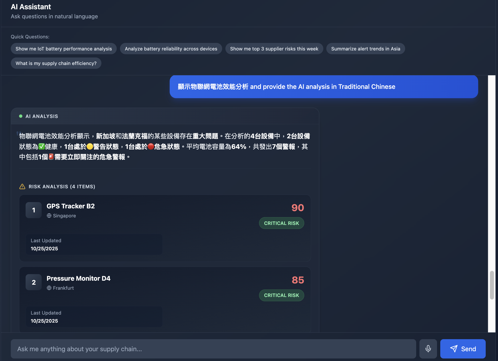
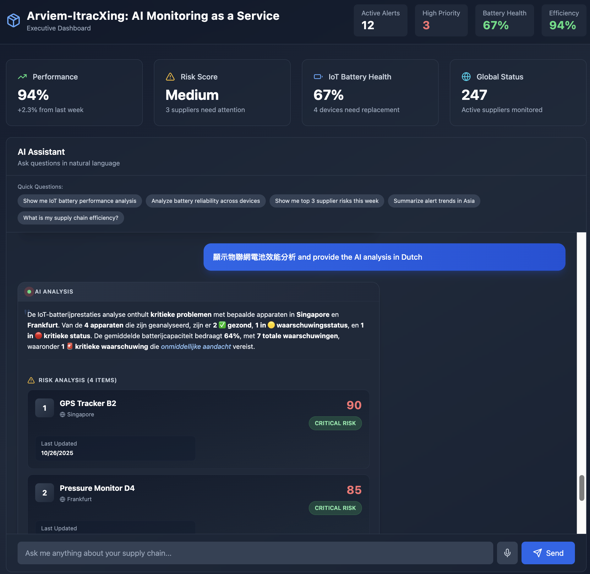

# Ministry of Economic Affairs Technology R&D Project

## A+ Enterprise Innovation R&D Excellence Program

## AI Application Enhancement Program Proposal (Submission Version)

**AI-Driven Smart Supply-Chain Risk Prediction and Connectivity Integration System Development Project**
**Project Period: January 1, 2026 to June 30, 2027**

Company Name: ItracXing Corporation
Project Management Unit: Taipei Computer Association

---

## Proposal Executive Summary Table

### Comprehensive Data (Amount Unit: Thousand NTD)

- **計畫名稱：** AI智慧供應鏈風險預測與通訊整合應用系統開發計畫
(AI-Driven Smart Supply-Chain Risk Prediction and Connectivity Integration System)
- **Applicant Company Name:** ItracXing Corporation
- **Mailing Address:** Banqiao District, New Taipei City
- **Project Category:** A+ Enterprise Innovation R&D Excellence Program—AI Application Enhancement Program
- **Promotion Item:** ☑ Other (Supply Chain and Logistics Monitoring)
- **Project Duration:** January 1, 2026 to June 30, 2027 (Total 18 months)

**Project Principal Investigator**

- Name: Jeff Shuo
- Title: CIO
- Phone: (02) XXXX-XXXX
- Fax: None
- Email: jeff.shuo@itracxing.com

**Annual Budget**

| Year | Government Subsidy | Company Self-funding | Total Project Budget | Project Person-Months |
|:----:|-------------------:|---------------------:|---------------------:|----------------------:|
| Year 1 | 9,000 | 9,000 | 18,000 | 120 |
| **Total** | **9,000** | **9,000** | **18,000** | **120** |
| Percentage of Total Budget | 50.0% | 50.0% | 100% | - |

**Project Contact Person**

- Name: Jeff Shuo
- Title: CIO
- Phone: (02) XXXX-XXXX
- Email: jeff.shuo@itracxing.com

---

## Project Abstract (Within 1 page; This abstract may be publicly disclosed)

### Applicant Company Profile

| Company Name | ItracXing Corporation |
|--------------|----------------------|
| Established | March 2020 |
| Responsible Person | Dr. Chow |
| Main Business Scope | AI supply chain monitoring systems, IoT device management, data analytics platforms |

### Project Abstract (≤200 words)

Driven by the continuous growth in global supply chain optimization, traceability, and security demands, the transportation and logistics market is projected to reach NT$250.2 trillion by 2030. ItracXing collaborates with Switzerland-based Arviem to develop an AI-driven smart logistics monitoring and risk warning system, assisting enterprises in enhancing efficiency and international competitiveness.

Phase I (AI-Driven Interactive Real-time Reporting Service): Complete sensor data integration and cleansing, establish Battery Health Index (BHI) and real-time monitoring dashboard, support natural language queries, weekly/monthly automated reports, and executive priority alert summaries to improve decision-making efficiency and reduce manual compilation time.

Phase II: Introduce AI model training and optimization to improve anomaly detection accuracy and equipment energy efficiency, reducing operational costs.

Phase III: Build multi-site collaborative and privacy-preserving platforms, promoting cross-border data sharing and commercial deployment.

This project is expected to improve anomaly detection accuracy by 30%, extend sensor lifespan by 50%, and shorten risk response time by 40%. Future plans include integration with AI-RAN/O-RAN architecture, extending smart monitoring to 5G edge nodes, strengthening real-time analysis and communication coordination, and promoting Taiwan as an international demonstration center for AI smart logistics.

(Corresponding to the eight major industries: Item 7—Electronic Assembly Extension 〈Smart Logistics Applications〉; covering "Smart Manufacturing/Electronic Assembly/Logistics & Transportation".)

### Expected Benefits at Project Completion (Key Highlights)

- Technology: Anomaly detection accuracy ≥90%, battery life +40%~60%.
- Operations: False positive rate -20%~30%, incident response speed +50%, analytical labor hours -40%.
- Economics: Operating costs -20%, data transmission costs -60%, battery replacement costs -70%.
- Outputs: Form exportable AI-MaaS solutions, expand global markets.

### Keywords

Supply chain AI monitoring, reinforcement learning, explainable AI (XAI), multi-agent, IoT intelligent sampling, smart manufacturing, electronic assembly, logistics & transportation, smart logistics, eight major industries item 7

---

## Proposal Table of Contents (Aligned with format)

I. Project Participant Introduction
II. Project Content and Implementation Methods
III. R&D Team Description
IV. Project Budget Requirements
V. Attachments

---

# I. Project Participant Introduction

### 1. Main Applicant Company

**Company Profile (Per Template)**

- **Basic Information**
   - Company Name: ItracXing Corporation
   - Establishment Date: March 15, 2020
   - Industry Category: Information Services (Class J; Computer System Design)
   - Top Three Shareholders/Holdings: 60%, Technical Team/25%, Strategic Investors/15%
   - Total R&D Personnel/Total Company Personnel: 12/15
   - 2024 Paid-in Capital (Thousand NTD): 10,000
   - 2024 Revenue/R&D Expenditure (Thousand NTD): 15,000 / 8,000

- **Business Model**
   - Core Capabilities: AI-driven supply chain monitoring, IoT device management, RL applications, explainable AI (XAI)
   - Revenue Streams: AI-MaaS subscriptions, AI consulting, customized development
   - Channels: Direct sales, strategic partners (Arviem), online platforms
   - Major Customers: Arviem AG, etc.
   - Cost Items: R&D personnel (60%), cloud resources (25%), operations (15%)
   - Key Collaboration Partners: Arviem, ITRI AI Center, Taiwan-Amsterdam University AI Center
   - International Export Track Record: Jointly cultivating global markets with Arviem
   - Friendly Workplace Plan: Gender ratio ≥1/3, recruit more female R&D staff, flexible hours/remote work

### 2. Applicant/Partner AI R&D Capability Description

- **ItracXing Corporation**: LangChain multi-agent, DQN reinforcement learning, Kalman filtering, LLM integration, Next.js full-stack, IoT system integration.
- **ITRI (ITRI AI Center)**: RL verification and system performance testing.
- **Taiwan-Amsterdam University AI Cooperation Center**: Federated learning, multi-agent, AI ethics.

### 3. Competitive Landscape and Technical Advantage Analysis

#### (1) International Product Comparison

| Solution | Core Technology | Market Positioning | Main Limitations | Our Advantages |
|----------|-----------------|--------------------|--------------------|----------------|
| **IBM Maximo** | Rule engine + basic ML | Large enterprise asset management | • High licensing fees • High customization costs • Lack of intelligent optimization | ✓ AI-MaaS flexible pricing ✓ RL adaptive sampling ✓ Explainable AI |
| **Uptake** | Predictive maintenance AI | Industrial IoT monitoring | • Black-box model • Cloud-dependent computing • Battery life not optimized | ✓ Transparent decision-making ✓ Edge offline operation ✓ Battery life +60% |
| **C3 AI** | Enterprise AI platform | Cross-industry AI applications | • High complexity • Long implementation cycle • Requires extensive IT resources | ✓ Supply chain focus ✓ Rapid deployment ✓ Low IT barrier |
| **Samsara** | IoT fleet management | Logistics & transportation | • Single vertical domain • Insufficient alert intelligence • No multi-agent collaboration | ✓ Cross-site integration ✓ RL alert optimization ✓ Multi-agent architecture |
| **Traditional ERP+IoT** | SAP/Oracle extension modules | Existing ERP extension | • Weak AI capabilities • Poor real-time performance • High false positive rate | ✓ AI-native design ✓ <2s query ✓ False positive rate ≤15% |

#### (2) Technological Innovation Breakthrough Points

**a. Explainable AI Anomaly Detection (Internationally Leading)**

- **Existing Technology Bottleneck**: Most competitors use deep learning black-box models with opaque decision-making processes, making it difficult for logistics operators to trust
- **Our Innovation**: Kalman filtering + Z-score statistics + feature importance analysis, providing interpretative reports with each alert
- **Validation Metrics**: Accuracy ≥90%, false positive ≤15%, each alert accompanied by explanation and feature contribution (third-party scale assessment ≥4/5)
- **Business Value**: Complies with EU AI Act explainability requirements, supports international exports

**b. Reinforcement Learning Alert Optimization (First in Taiwan)**

- **Existing Technology Bottleneck**: Fixed thresholds lead to alert fatigue, operational personnel ignore critical events
- **Our Innovation**: DQN dynamically adjusts alert strategies, learning optimal priorities based on historical responses
- **Validation Metrics**: False positive rate -30%, critical alert response time <30 minutes, F1-score ≥0.85
- **Business Value**: Reduces labor costs by 40%, improves customer satisfaction

**c. Cloud RL Adaptive Sampling Optimization (Globally Rare)**

- **Existing Technology Bottleneck**: IoT devices use fixed sampling frequencies, battery life of 6 months requires frequent replacements
- **Our Innovation**: Train optimal sampling strategies through cloud-based multi-agent RL framework; IoT devices receive and execute optimized sampling parameters
- **Validation Metrics**: Battery life 10–14 months (+67%–133%), data integrity ≥95%
- **Business Value**: Maintenance costs -70%, reduced carbon footprint, improved customer TCO

**d. Multi-Agent Collaborative Architecture (Technology Integration Advantage)**

- **Existing Technology Bottleneck**: Monolithic systems struggle to integrate heterogeneous systems like ERP, WMS, TMS
- **Our Innovation**: MCP (Model Context Protocol) standardized tool collaboration, federated learning preserves privacy
- **Validation Metrics**: Data stays on-premises, passes GDPR/DPIA or third-party compliance audits
- **Business Value**: Seamless integration with existing systems, GDPR-compliant, strong scalability

#### (3) Market Entry Strategy

**Target Customer Segmentation**:

1. **Tier-1 Target (Within 18 months)**: Mid-sized logistics operators (Arviem-like), cold chain transport, cross-border e-commerce
    - Pain Points: Alert overload, battery costs, lack of AI capabilities
    - Pricing: AI-MaaS subscription USD 5–15K/month (includes 100–500 devices)

2. **Tier-2 Target (12 months post-project)**: Manufacturing supply chain management, port warehousing, third-party logistics
    - Pain Points: Multi-system integration, predictive maintenance, compliance reporting
    - Pricing: Enterprise version USD 20–50K/month + customization services

3. **Long-term Vision (3 years)**: AI PaaS platform export, vertical AI-MaaS expansion (medical cold chain, food safety)
    - Business Model: API licensing + industry solutions + consulting services

**Synergy with Arviem**:

- Arviem provides global IoT network and customer base (>5,000 enterprise users)
- We provide AI intelligence layer and edge optimization technology
- Joint branding to enter global markets, creating an international technology export model

#### (4) Intellectual Property Protection and Technical Barriers

**Patent Portfolio (Within 18 months)**:

- 2 domestic patents: "IoT Sampling Optimization Method Based on Reinforcement Learning", "Explainable Supply Chain Anomaly Detection System"
- 1 international patent (PCT): "Multi-Agent Supply Chain Monitoring with Federated Learning"

**Technical Moat**:

- Core algorithms closed-source (RL reward function design, Kalman adaptive parameters)
- IoT firmware encryption and secure communication mechanisms
- Training datasets (18-month accumulation from Arviem sites) difficult to replicate
- Multi-agent collaboration framework rapid iteration advantage

---

# II. Project Content and Implementation Methods

## 1. Project Background and Industry Pain Points

- **Pain Point 1: Alert Overload and Frequent False Alarms** → Need intelligent alert classification/prioritization.
- **Pain Point 2: Inconsistent Multi-Sensor Data Quality** → Need noise reduction/adaptive calibration.
- **Pain Point 3: Lack of Predictive Decision-Making** → Need natural language queries and AI recommendations.
- **Pain Point 4: Battery Life and Maintenance Costs** → Need cloud RL training for adaptive sampling strategies.

## 2. Project AI Implementation Plan (Before/After Comparison Table)

To clearly correspond to the eight major industries, this project focuses on Item 7 "Electronic Assembly Extension (Smart Logistics Applications)"; AI is implemented in smart logistics sites to optimize electronic assembly supply chains and in-plant logistics scheduling, integrating "Smart Manufacturing/Electronic Assembly/Logistics & Transportation" scenarios.

| Implementation Technology Goal | Before Implementation (Current Status) | After Implementation (Expected Results) |
|-------------------------------|----------------------------------------|----------------------------------------|
| Explainable AI Anomaly Detection | Rule engine with low accuracy, fixed thresholds | Kalman+Z-score accuracy ≥90%, explainable outputs |
| RL Alert Optimization | High false positives, no learning capability | DQN false positive ≤15%, critical alerts <30 minutes |
| LLM Natural Language Query | Requires SQL and IT support | Executive real-time queries with actionable recommendations |
| IoT Intelligent Sampling Optimization | Fixed sampling, 6-month lifespan | Cloud RL trains adaptive strategies, lifespan 10–14 months |
| Multi-Agent Collaboration | Difficult cross-domain integration | MCP tool collaboration, federated learning preserves privacy |

## 3. Project Implementation Strategy

### (1) Sites, Validation Items, and Implementation Methods

- **Sites**: Arviem global IoT monitoring network, Eurasian cross-border routes, manufacturing supply chain systems.
- **Validation Items**:
   - Phase I (5 months): Anomaly detection accuracy, NL query latency, noise reduction SNR.
   - Phase II (12 months): Alert false positive rate, battery life, sampling strategy optimization effectiveness.
   - Phase III (6 months): Multi-agent throughput, federated learning privacy, stability.
- **Implementation Methods**: API integration (Arviem), cloud deployment, phased training and go-live.

### (2) Project Work Item Implementation Methods (Including Percentage/Unit)

### **Phase I: AI-Driven Interactive Real-time Reporting Service (Arviem Customers) (5 months)—Start Date: 2026/01/01**

(1) Battery Life and Sensor Reliability
Arviem sensors integrate multiple environmental measurement functions with current reliability around 90%, but main failure causes are battery depletion and temperature variations. Battery discharge curves are unstable, high temperatures accelerate degradation, and there is a lack of unified **Battery Health Index (BHI)** and lifespan warning mechanisms, preventing maintenance units from predicting or planning replacements in advance.

(2) Customer Reporting and Data Query Efficiency
Currently, weekly/monthly reports are mostly manually compiled, time-consuming and lacking interactivity. Customers cannot query cargo status and battery status in real-time, nor is there capability to automatically generate executive management reports, causing decision delays and information opacity.

### **Implementation Focus and Metrics**

1. **Goals and Success Criteria**
    - Establish multi-source battery monitoring database covering ≥95% sensor upload data.
    - Provide real-time visualization interface and query services
    - Establish battery lifespan key performance indicators (KPI) (Battery Health Index, BHI), covering temperature, capacity, and voltage variations.
    - Weekly/monthly reports automatically generated, reducing manual report preparation time by ≥50%.

2. **Data Acquisition and Integration**
    - Integrate battery voltage (V), remaining capacity (%), temperature (°C), and other data.
    - Introduce preliminary cleaning and smoothing mechanisms (such as moving average and Kalman filter).
    - Generate daily battery capacity change rate (ΔCapacity/Δt), average voltage curves, and temperature distributions.

3. **Real-time Monitoring and Visualization System Development**
    - Establish battery lifespan real-time monitoring dashboard displaying remaining lifespan estimates and anomaly indicators for each sensor.
    - Provide natural language query interface (e.g., "Which sensors have battery life below 30% this week?").
    - Features include battery voltage-temperature interaction charts, lifespan degradation curves, transmission frequency distributions, and other analytical functions.

4. **Automated Reporting and Alert Mechanisms**
    - Automatically generate executive weekly/monthly reports through system database integration and metric calculation mechanisms.
    - Support email notifications or dashboard push through MCP and database scheduling integration.
    - Added "Executive Priority Alert Report": For major anomalies, SLA risks, and operational impacts, automatically compile Top N events, root cause summaries, recommended actions, and responsible units daily/weekly, providing email and dashboard-specific real-time push.

5. **Testing and Demonstration**
    - Test data integrity rate, query latency, BHI update frequency.
    - Demonstrate "Battery Life Real-time Dashboard" and automated report generation process.

> <mark>Note: Phase I does not include AI model training, only data integration, query system prototype, and functional verification. AI model training and optimization will be conducted in Phase II.</mark>

This work package will significantly improve report generation efficiency (including real-time queries and periodic reports), strengthen customer real-time decision-making capabilities, and support diversified management needs.

- A1 Natural Language Query (8%) – ItracXing Corporation
- A2 Battery Anomaly Detection (10%) – ItracXing Corporation
- A3 Kalman Noise Reduction (5%) – ItracXing Corporation
- A4 MCP Database Access/Query Integration (4%) – ItracXing Corporation
- A5 AI Agent and MCP Integration Support for Periodic Management Reports and Executive Priority Alert Reports (5%) – ItracXing Corporation

   <figure>
      <figcaption style="font-size:1.2em; font-weight:bold; margin-bottom:8px;">▲ Figure 1: System homepage interface supporting English queries. System returns real-time anomaly event summaries with key sensor data and alert reasons.</figcaption>
      
   </figure>
   <figure>
      <figcaption style="font-size:1.2em; font-weight:bold; margin-bottom:8px;">▲ Figure 2: System homepage interface supporting Traditional Chinese queries. Users can directly input logistics, sensor, or event-related questions.</figcaption>
      
   </figure>
   <figure>
      <figcaption style="font-size:1.2em; font-weight:bold; margin-bottom:8px;">▲ Figure 3: Querying "this month's false positive rate" provides statistical analysis results. System automatically explains metric sources and provides improvement recommendations.</figcaption>
      
   </figure>
   <figure>
      <figcaption style="font-size:1.2em; font-weight:bold; margin-bottom:8px;">▲ Figure 4: Supports multi-turn follow-up questions. Users can ask detailed follow-up questions on query results; system automatically connects to database for real-time responses.</figcaption>
      
   </figure>

### **Phase II: AI Alert Optimization and Intelligent Sampling Integration (12 months)—Start Date: 2026/04/01**

**Note**: Phase II overlaps with Phase I for 2 months (2026/04-05) for data pipeline handover and model training preparation, ensuring seamless transition. Actual execution period is M4-M15 (total 12 months).

(1) Anomaly Alert and Route Detection Accuracy
Current anomaly detection mainly relies on rule-based threshold settings, unable to respond in real-time to road conditions, weather, and multinational logistics variables. The system struggles to distinguish between "tolerable delays" and "potential fraud detours", causing high false positive rates and frequent manual interventions. To improve accuracy and timeliness, this phase will introduce AI models for time-series analysis and alert optimization, reducing false positives and improving alert response speed.

(2) Sensor Energy Consumption and Sampling Frequency Issues
Arviem IoT sensors are often limited by battery life and network bandwidth during long-distance transportation. Current fixed sampling intervals (every 10 minutes) cannot balance data integrity and energy efficiency, leading to data redundancy or premature battery depletion. This phase will develop intelligent sampling strategies centered on reinforcement learning (RL), automatically adjusting sampling frequencies based on environmental changes to balance power consumption and data quality.

---

### **Implementation Focus and Metrics**

1. **Goals and Success Criteria**
    - Establish anomaly behavior prediction and alert models to improve alert accuracy and timeliness.
    - Develop intelligent sampling mechanisms to improve data integrity rate ≥95%, extend battery life ≥40%.
    - Implement cross-sensor node alert integration and automated reporting, reducing manual intervention by ≥50%.
    - Actual deployment on Arviem experimental containers, complete field testing and joint verification.

2. **Data Acquisition and Integration**
    - Integrate IoT sensor GPS, temperature/humidity, vibration, voltage, RSSI, and other multi-dimensional data.
    - Combine external traffic and weather data to build training multi-dimensional time-series datasets.
    - Perform data cleaning, time-series synchronization, and anomaly sample annotation.

3. **AI Model Construction and Training**
    - Apply LSTM/Transformer models to predict route anomalies and potential fraud behavior.
    - Use DQN/SAC reinforcement learning algorithms to design intelligent sampling strategies.
    - Monitor model convergence and performance to ensure stable operation under multiple routes and environmental conditions.

4. **Model Optimization and Testing**
    - Compare baseline rule engine and AI model performance through simulation and actual testing.
    - Verify main KPIs: F1 ≥0.85, false positive rate ≤15%, data loss rate <5%.
    - Evaluate battery life extension rate and data quality improvement, complete performance verification report.

5. **Deployment and Demonstration**
    - Deploy on Arviem sensor nodes, actually test intelligent sampling and anomaly alert integration performance.
    - Demonstrate "Anomaly Event Prediction Dashboard" and "Adaptive Sampling Life Prediction System".
    - Complete joint testing and ITRI technical verification report as basis for Phase III multi-agent integration.

---

### **Expected Results and Impact**

This phase will establish a closed-loop AI system from anomaly detection to sampling decisions. Through intelligent alerts and energy optimization, it will effectively improve overall transportation monitoring efficiency and operational sustainability. Upon completion, Arviem customers can monitor cargo in real-time, reduce fraud risks, extend sensor lifespan, and reduce operational costs.

- B1 Alert Optimization and Route Anomaly Prediction (15%) – ItracXing Corporation (M4-M9)
- B2 IoT Intelligent Sampling Strategy Optimization and Deployment (19%) – ItracXing Corporation (M4-M11)
- B3 Joint Verification and Testing (5%) – ITRI + Research Centers (M13-M15)

### **Phase III: Multi-Agent Deployment and International Demonstration (6 months)—Start Date: 2027/01/01**

**Note**: Phase III actual execution period is M13–M18 (2027/01–2027/06). Total project period is 18 months (2026/01/01 - 2027/06/30).

(1) Multi-Agent Collaboration and Monitoring Architecture
To respond to dynamic changes across sensor nodes, different routes, and cargo environmental conditions, a multi-agent collaborative platform is needed. Each agent is responsible for different tasks such as anomaly detection, environmental prediction, sampling decisions, and data integration. This platform can dynamically allocate resources, balance energy consumption, exchange anomaly information in real-time, and ensure stability and reliability of cross-regional transportation.

(2) Federated Learning and Data Privacy
To meet the strict data privacy requirements of the EU and international customers, **Federated Learning (FL)** architecture will be introduced, allowing each Arviem sensor and customer node to perform collaborative model training without sharing raw data. This mechanism can balance AI accuracy and data sovereignty while supporting cross-border regulatory compliance.

(3) Actual Deployment and Demonstration
This phase will integrate Phase II achievements (anomaly alerts and intelligent sampling models), complete cloud-edge collaborative operation architecture, and actually deploy on Arviem international containers and IoT nodes. Simultaneously conduct international demonstrations and marketing promotions, participate in international transportation and logistics forums, and showcase Taiwan's AI technology's leading applications in supply chain data intelligence.

---

### **Implementation Focus and Metrics**

1. **Goals and Success Criteria**
    - Establish multi-agent collaboration framework supporting multi-task real-time coordination (alerts, sampling, environmental monitoring).
    - Introduce federated learning technology to ensure cross-customer data privacy protection.
    - Complete cloud and edge node model integration, enabling simultaneous operation of multiple models.
    - International demonstration and promotion: Showcase system achievements at major logistics conferences to promote industry adoption.

2. **Data Acquisition and Integration**
    - Integrate AI models, sensor data, and alert records generated from Phase I–II.
    - Consolidate environmental conditions (humidity, temperature, vibration), route GPS, and fraud prediction results into multi-agent environment.
    - Establish cross-node communication and state synchronization modules.

3. **Multi-Agent Collaboration and Training**
    - Design "task allocation mechanisms" using RL-based Agent and Task Scheduler.
    - Define agent roles (monitoring, sampling, alerts, energy management), establish communication protocols and decision hierarchy.
    - Simulate multi-container/multi-environmental condition collaboration scenarios, verify reaction time and resource utilization efficiency.

4. **Federated Learning POC and Model Synchronization**
    - Implement cross-node training process based on Federated Averaging.
    - Test synchronization efficiency of model parameters between each client (such as international container transport scenarios) and cloud.
    - Verify model accuracy degradation ≤5% while maintaining privacy compliance.

5. **Production Deployment and Demonstration**
    - Perform edge computing deployment and cloud monitoring API integration.
    - Establish APIs, documentation, and dashboards to support management unit queries and system maintenance.
    - Complete acceptance testing and ITRI joint report.
    - Demonstrate achievements at international transportation and logistics forums to promote market penetration and international cooperation.

---

### **Expected Results and Impact**

Upon Phase III completion, the system will have "distributed collaboration, privacy protection, real-time early warning" AI supply chain monitoring capabilities. Integrating anomaly alerts, environmental monitoring, and intelligent sampling decision-making can support Arviem customers in monitoring transportation risks in real-time and proactively adjusting container configurations. Through international demonstrations and federated learning verification, it showcases Taiwan's AI technology's landing value and brand influence in the global supply chain.

- C1 Multi-Agent Collaboration and Control (Excluding DB Access) (8%) – ItracXing Corporation (M18)
- C2 Federated Learning POC (7%) – ItracXing Corporation + Research Centers (M18)
- C3 Production Deployment (6%) – ItracXing Corporation (M18)
- C4 API and Documentation (3%) – ItracXing Corporation (M18)
- C5 Acceptance and Delivery (2%) – ItracXing Corporation + ITRI (M18)

**Note**: Phase III concentrates on M18 to complete integration, verification, and delivery work, based on cumulative achievements from Phase I-II for rapid integrated deployment.

### International Export Plan

Collaborate with Arviem to enter global markets, targeting key regional markets in 2026, establishing international joint solution brands.

### Note: Rationale for Advancing MCP Database Access

- Early completion of data pipeline can:
   - Improve A/B testing and metric verification efficiency (Phase I can verify performance with real data).
   - Reduce Phase II model iteration risks (RL and noise reduction algorithms can rapidly iterate on stable data interfaces).
   - Shorten overall time-to-market (Phase III focuses on multi-agent collaboration and productization, no longer constrained by data access timelines).

### Gantt Chart (18-Month Timeline Overview)
## Risk Scenario Analysis:

1. **Market Validation Failure:** Unable to secure overseas clients, resulting in liquidity crisis
2. **Technical Verification Falls Short:** Key indicators fail verification, impacting subsequent funding disbursement and commercialization process
3. **Competitor Price War:** Pricing strategy adjustment required, potentially compressing gross margin
4. **Key Personnel Turnover:** Technical knowledge gap or declining execution capacity, affecting R&D progress

---

## Mitigation Measures:

1. Simultaneously develop domestic market (Taiwan logistics industry)
2. Establish diversified revenue streams (consulting services, technology licensing)
3. Maintain lean operations, lowering break-even point
4. This market validation framework ensures tight integration between technical R&D and commercial demand, reducing product development failure risk.

---

## VIII. Risk Assessment and Mitigation Measures

| Risk Category | Potential Impact | Mitigation Strategy |
| ---------- | -------------------- | ------------------------------ |
| Technical Risk | Model drift, data shift | Regular retraining and threshold monitoring mechanism |
| Data Security | Cross-border data transmission compliance | Adopt regional deployment and federated learning protection mechanism |
| Integration Risk | Heterogeneous device interface discrepancies | Establish standard API and middleware module |
| Personnel Risk | Core member turnover | Establish documented processes and external consultant support |
| Policy Risk | Changes in international export controls | Establish compliance review process and third-party audit |

---

## IX. Intellectual Property Rights and Research Ethics

- Core algorithms, system designs, and validation methods from project outcomes will be filed for domestic and international patents (expected: 2 domestic, 1 international)
- All partner institutions shall adhere to research ethics and data confidentiality principles, ensuring technical traceability and compliance
- For third-party data and open-source components, establish licensing inventory to ensure lawful use

---

## X. Conclusion

This project, centered on "AI Reinforcement Learning × Supply Chain Monitoring × International Collaboration," focuses on enhancing reliability and decision-making efficiency in manufacturing and logistics industries. The 18-month R&D cycle can demonstrate highly feasible outcomes within limited budget, and aligns with the Ministry of Economic Affairs' "AI Application Enhancement Program" evaluation criteria for innovation, technical superiority, and market value.

> **Editorial Note**:
>
> - All amounts are in "NT$ thousands" and rounded; subsidy ratio shall not exceed 50%.
> - "Milestones," "person-months," and "budget items" across all tables must be consistent; final month must include acceptance milestone.
> - Both public-facing abstract and confidential detailed versions (appendices containing contracts/personnel information, etc.) must be retained.
