# Ministry of Economic Affairs Technology Research and Development Project

## A+ Enterprise Innovation R&D Excellence Program

## AI Application Enhancement Program Proposal (Submission Version)

**AI-Driven Smart Supply-Chain Risk Prediction and Connectivity Integration System**
**Project Period: January 1, 2026 to June 30, 2027**

Company Name: ItracXing Corporation
Project Management Unit: Taipei Computer Association

---

## Proposal Summary Table

### Comprehensive Information (Amount Unit: Thousand NTD)

- **Project Name:** AI智慧供應鏈風險預測與通訊整合應用系統開發計畫
(AI-Driven Smart Supply-Chain Risk Prediction and Connectivity Integration System)
- **Applicant Company Name:** ItracXing Corporation
- **Mailing Address:** Banqiao District, New Taipei City
- **Project Category:** A+ Enterprise Innovation R&D Excellence Program—AI Application Enhancement Program
- **Implementation Focus:** ☑ Others (Supply Chain and Logistics Monitoring)
- **Project Duration:** January 1, 2026 to June 30, 2027 (18 months total)

**Principal Investigator**

- Name: Jeff Shuo
- Title: CIO
- Phone: (02) XXXX-XXXX
- Fax: None
- Email: jeff.shuo@itracxing.com

**Annual Budget**

| Year | Government Subsidy | Company Self-Funding | Total Project Budget | Person-Months |
|:---:|---:|---:|---:|---:|
| Year 1 | 9,000 | 9,000 | 18,000 | 120 |
| **Total** | **9,000** | **9,000** | **18,000** | **120** |
| % of Total | 50.0% | 50.0% | 100% | - |

**Project Contact Person**

- Name: Jeff Shuo
- Title: CIO
- Phone: (02) XXXX-XXXX
- Email: jeff.shuo@itracxing.com

---

## Project Summary (Within 1 page; may be made public)

### Applicant Company Profile

| Company Name | ItracXing Corporation |
|---|---|
| Establishment Date | March 2020 |
| Principal | Dr. Chow |
| Main Business Activities | AI supply chain monitoring systems, IoT device management, data analytics platforms |

### Project Summary (≤200 words)

Driven by global demand for supply chain optimization, traceability, and security, the transportation and logistics market is projected to reach NT$250.2 trillion by 2030. ItracXing, in partnership with Switzerland-based Arviem, is developing an AI-driven smart logistics monitoring and risk prediction system to enhance enterprise efficiency and international competitiveness.

Phase I (AI-Driven Interactive Real-Time Reporting Service): Complete sensor data integration and cleansing, establish Battery Health Index (BHI) and real-time monitoring dashboards, support natural language queries, weekly/monthly automated reports, and executive alert summaries to improve decision-making efficiency and reduce manual consolidation time.

Phase II: Implement AI model training and optimization to improve anomaly detection accuracy and device energy efficiency, reducing operational costs.

Phase III: Build multi-site collaborative and privacy-preserving platforms to promote cross-border data sharing and commercial deployment.

The project is expected to improve anomaly detection accuracy by 30%, extend sensor lifespan by 50%, and shorten risk response time by 40%. Future integration with AI-RAN/O-RAN architecture will extend smart monitoring to 5G edge nodes, strengthening real-time analytics and communication synergy, positioning Taiwan as an international AI smart logistics demonstration center.

(Aligned with the Eight Major Industries: Item 7—Electronics Assembly Extension 〈Smart Logistics Applications〉; covering "Smart Manufacturing / Electronics Assembly / Logistics Transportation")

### Expected Benefits at Project Completion (Key Highlights)

- **Technical**: Anomaly detection accuracy ≥90%, battery lifespan +40%–60%.
- **Operational**: False alarm rate -20%–30%, incident response speed +50%, analysis labor hours -40%.
- **Economic**: Operating costs -20%, data transmission costs -60%, battery replacement costs -70%.
- **Export**: Establish exportable AI-MaaS (Monitoring-as-a-Service) solution, expand global markets.

### Keywords

Supply chain AI monitoring, reinforcement learning, explainable AI, multi-agent, IoT intelligent sampling, smart manufacturing, electronics assembly, logistics transportation, smart logistics, Eight Major Industries Item 7

---

## Table of Contents (Aligned with Format)

I. Project Participant Introduction
II. Project Content and Implementation Methods
III. R&D Team Description
IV. Project Budget Requirements
V. Appendices

---

# I. Project Participant Introduction

### 1. Primary Applicant

**Company Profile (Template-Based)**

- **Basic Information**
    - Company Name: ItracXing Corporation
    - Establishment Date: March 15, 2020
    - Industry Sector: Information Services (Category J; Computer System Design)
    - Top Three Shareholders/Holdings: 60%, Technical Team/25%, Strategic Investors/15%
    - Total R&D Personnel/Total Employees: 12/15
    - 2024 Paid-in Capital (Thousand NTD): 10,000
    - 2024 Revenue/R&D Expenditure (Thousand NTD): 15,000 / 8,000

- **Business Model**
    - Core Competencies: AI-driven supply chain monitoring, IoT device management, RL applications, explainable AI
    - Revenue Streams: AI-MaaS subscriptions, AI consulting, customized development
    - Channels: Direct sales, strategic partners (Arviem), online platforms
    - Major Customers: Arviem AG, etc.
    - Cost Structure: R&D personnel (60%), cloud resources (25%), operations (15%)
    - Key Partners: Arviem, ITRI AI Center, Taiwan-Amsterdam University AI Center
準旺科技股份有限公司
- **計畫名稱：** AI智慧供應鏈風險預測與通訊整合應用系統開發計畫
(AI-Driven Smart Supply-Chain Risk Prediction and Connectivity Integration System)
        
    </figure>
</div>

### **Phase II: AI Alert Optimization and Intelligent Sampling Integration (12 months) — Start Date: April 1, 2026**

**Note**: Phase II overlaps with Phase I for 2 months (April-May 2026) for data pipeline handoff and model training preparation, ensuring seamless transition. Actual execution period is M4-M15 (12 months total).

(1) Anomaly Alert and Route Detection Accuracy
Current anomaly detection primarily relies on rule-based threshold settings, unable to respond in real-time to road conditions, weather, and multinational logistics variables. The system struggles to distinguish "tolerable delays" from "potential fraud detours," causing high false alarm rates and frequent manual interventions. To improve accuracy and timeliness, this phase will introduce AI models for time-series analysis and alert optimization, reducing false alarms and improving alert response speed.

(2) Sensor Energy Consumption and Sampling Frequency Issues
Arviem IoT sensors are often limited by battery life and network bandwidth during long-haul transportation. Current fixed sampling intervals (every 10 minutes) cannot balance data integrity and energy efficiency, leading to data redundancy or premature battery depletion. This phase will develop an RL-based intelligent sampling strategy that automatically adjusts sampling frequency based on environmental changes, balancing power consumption and data quality.

---

### **Implementation Focus and Metrics**

1. **Objectives and Success Criteria**
     - Establish anomaly behavior prediction and alert models to improve alert accuracy and timeliness.
     - Develop intelligent sampling mechanisms, achieving data integrity ≥95% and battery life extension ≥40%.
     - Achieve cross-sensor node alert integration and automated reporting, reducing manual intervention by ≥50%.
     - Deploy to Arviem experimental containers, complete field testing and joint validation.

2. **Data Acquisition and Integration**
     - Integrate IoT sensor GPS, temperature/humidity, vibration, voltage, RSSI, and other multi-dimensional data.
     - Combine external traffic and weather data to build training multi-dimensional time-series datasets.
     - Perform data cleansing, time-series synchronization, and anomaly sample annotation.

3. **AI Model Building and Training**
     - Apply LSTM/Transformer models to predict route anomalies and potential fraudulent behaviors.
     - Use DQN/SAC reinforcement learning algorithms to design intelligent sampling strategies.
     - Monitor model convergence and performance, ensuring stable operation under multiple routes and environmental conditions.

4. **Model Optimization and Testing**
     - Compare baseline rule engine with AI model performance through simulation and field testing.
     - Validate primary KPIs: F1 ≥0.85, false alarm rate ≤15%, data loss rate <5%.
     - Evaluate battery life extension and data quality improvement, complete performance validation report.

5. **Deployment and Demonstration**
     - Deploy to Arviem sensor nodes, field test intelligent sampling and anomaly alert integration performance.
     - Demonstrate "Anomaly Event Prediction Dashboard" and "Adaptive Sampling Lifespan Prediction System".
     - Complete joint testing and ITRI technical validation report as foundation for Phase III multi-agent integration.

---

### **Expected Outcomes and Impact**

This phase will establish a closed-loop AI system from anomaly detection to sampling decisions. Through intelligent alerts and energy optimization, it will effectively improve overall transportation monitoring efficiency and operational sustainability. Upon completion, Arviem customers can grasp shipment status in real-time, reduce fraud risks, extend sensor lifespan, and lower operational costs.

- B1 Alert Optimization and Route Anomaly Prediction (15%) – ItracXing Corporation (M4-M9)
- B2 IoT Intelligent Sampling Strategy Optimization and Deployment (19%) – ItracXing Corporation (M4-M11)
- B3 Joint Validation and Testing (5%) – ITRI + Research Center (M13-M15)

### **Phase III: Multi-Agent Deployment and International Demonstration (6 months) — Start Date: January 1, 2027**

**Note**: Phase III actual execution period is M13–M18 (January 2027–June 2027); total project duration is 18 months (January 1, 2026 - June 30, 2027).

(1) Multi-Agent Collaboration and Monitoring Architecture
To address dynamic changes across sensor nodes, different routes, and cargo environmental conditions, a Multi-Agent collaborative platform is needed. Each agent is responsible for different tasks such as anomaly detection, environmental prediction, sampling decisions, and data integration. This platform can dynamically allocate resources, balance energy consumption, exchange anomaly information in real-time, ensuring stability and reliability of cross-regional transportation.

(2) Federated Learning and Data Privacy
In response to strict data privacy requirements from the EU and international clients, **Federated Learning** architecture will be implemented, allowing Arviem sensors and customer nodes to conduct collaborative model training without sharing raw data. This mechanism balances AI accuracy with data sovereignty and supports cross-border regulatory compliance.

(3) Actual Deployment and Demonstration
This phase will integrate Phase II outcomes (anomaly alerts and intelligent sampling models), complete cloud-edge collaborative operating architecture, and deploy to Arviem international containers and IoT nodes. Simultaneously conduct international demonstrations and marketing promotion, participate in international transportation and logistics forums, showcasing Taiwan's AI technology leadership in supply chain data intelligence applications.

---

### **Implementation Focus and Metrics**

1. **Objectives and Success Criteria**
     - Establish multi-agent collaboration framework supporting multi-task real-time collaboration (alerts, sampling, environmental monitoring).
     - Implement federated learning technology ensuring cross-customer data privacy protection.
     - Complete cloud and edge node model integration, enabling concurrent multi-model operation.
     - International demonstration and promotion: Showcase system achievements at major logistics conferences, promote industry adoption.

2. **Data Acquisition and Integration**
     - Integrate AI models, sensor data, and alert records generated in Phase I–II.
     - Consolidate environmental conditions (humidity, temperature, vibration), route GPS, and fraud prediction results into multi-agent environment.
     - Establish cross-node communication and state synchronization modules.

3. **Multi-Agent Collaboration and Training**
     - Design "task allocation mechanism" with RL-based Agent and Task Scheduler.
     - Define Agent roles (monitoring, sampling, alerting, energy management), establish communication protocols and decision hierarchies.
     - Simulate multi-container/multi-environmental condition collaboration scenarios, verify response time and resource utilization efficiency.

4. **Federated Learning POC and Model Synchronization**
     - Implement cross-node training workflow based on Federated Averaging.
     - Test synchronization efficiency between each client (e.g., international container transportation scenarios) and cloud model parameters.
     - Verify model accuracy degradation ≤5% while maintaining privacy compliance.

5. **Production Deployment and Demonstration**
     - Perform edge computing deployment and cloud monitoring API integration.
     - Build APIs, documentation, and dashboards to support management unit queries and system maintenance.
     - Complete acceptance testing and ITRI joint report.
     - Demonstrate achievements at international transportation and logistics forums, promote market penetration and international cooperation.

---

### **Expected Outcomes and Impact**

Upon Phase III completion, the system will possess "distributed collaboration, privacy protection, real-time early warning" AI supply chain monitoring capabilities. Integrating anomaly alerts, environmental monitoring, and intelligent sampling decisions can support Arviem customers in grasping transportation risks in real-time and proactively adjusting container configurations. Through international demonstrations and federated learning validation, it will showcase Taiwan's AI technology deployment value and brand influence in the global supply chain.

- C1 Multi-Agent Collaboration and Control (Excluding DB Access) (8%) – ItracXing Corporation (M18)
- C2 Federated Learning POC (7%) – ItracXing Corporation + Research Center (M18)
- C3 Production Deployment (6%) – ItracXing Corporation (M18)
- C4 API and Documentation (3%) – ItracXing Corporation (M18)
- C5 Acceptance and Delivery (2%) – ItracXing Corporation + ITRI (M18)

**Note**: Phase III concentrates on M18 completion of integration, validation, and delivery work, based on rapid integration deployment of Phase I-II accumulated achievements.

### International Export Planning

Collaborate with Arviem to enter global markets; 2026 target is to expand key regional markets and establish international joint solution brand.

### Note: Rationale for Advancing MCP Database Access

- Early completion of data pipelines can:
    - Improve A/B testing and metric validation efficiency (Phase I can verify performance with real data).
    - Reduce Phase II model iteration risks (RL and noise reduction algorithms can iterate rapidly on stable data interfaces).
    - Shorten overall time-to-market (Phase III focuses on multi-agent collaboration and production, no longer constrained by data access timeline).
- Establish a multi-agent (MA) collaboration framework supporting real-time coordination across multiple tasks (alerts, sampling, environmental monitoring).
- Implement federated learning (FL) to ensure cross-customer data privacy protection.
- Complete cloud–edge node model integration to enable concurrent multi-model operation.
- International demonstration and promotion: showcase system outcomes at major logistics conferences to accelerate industry adoption.

2. Data Acquisition and Integration

- Integrate AI models, sensor data, and alert records generated in Phase I–II.
- Consolidate environmental conditions (humidity, temperature, vibration), route GPS, and fraud (Fraud) prediction results into the multi-agent environment.
- Establish cross-node communication and state synchronization modules.

3. Multi-Agent Collaboration and Training

- Design a “task allocation mechanism” using RL-based agents and a task scheduler.
- Define agent roles (monitoring, sampling, alerting, energy management), and establish communication protocols and decision hierarchies.
- Simulate collaboration scenarios across multiple containers and environmental conditions; validate response time and resource utilization efficiency.

4. Federated Learning Proof of Concept (POC) and Model Synchronization

- Implement a cross-node training workflow based on Federated Averaging.
- Test model parameter synchronization efficiency between each client (e.g., international container transportation scenarios) and the cloud.
- Verify that model accuracy degradation is ≤ 5% while maintaining privacy compliance.

5. Production Deployment and Demonstration

- Perform edge computing deployment and cloud monitoring API integration.
- Build APIs, documentation, and dashboards to support management unit queries and system maintenance.
- Complete acceptance testing and the joint ITRI report.
- Showcase results at international transportation and logistics forums to drive market penetration and international cooperation.

---

### Expected Outcomes and Impact

Upon completion of Phase III, the system will provide AI supply chain monitoring capabilities with “distributed collaboration, privacy protection, and real-time early warning.” By integrating anomaly alerts, environmental monitoring, and intelligent sampling decisions, Arviem customers can grasp transportation risks in real time and proactively adjust container configurations. Through international demonstrations and federated learning validation, it will highlight Taiwan’s deployment value and brand influence in global supply chains.

- C1 Multi-agent collaboration and control (excluding DB access) (8%) – ItracXing (準旺科技) (M18)
- C2 Federated learning POC (7%) – ItracXing (準旺科技) + Research Center (M18)
- C3 Production deployment (6%) – ItracXing (準旺科技) (M18)
- C4 API and documentation (3%) – ItracXing (準旺科技) (M18)
- C5 Acceptance and delivery (2%) – ItracXing (準旺科技) + ITRI (M18)

Note: Phase III focuses on completing integration, validation, and delivery by M18, with rapid integration and deployment based on outcomes accumulated in Phase I–II.

### International Export Planning

Collaborate with Arviem to enter global markets; the 2026 target is to expand key regional markets and establish a joint international solution brand.

### Note: Rationale for Advancing MCP Database Access

- Early completion of data pipelines can:
    - Improve A/B testing and KPI validation efficiency (Phase I can validate performance with real data).
    - Reduce Phase II model iteration risks (RL and noise reduction algorithms can iterate rapidly on stable data interfaces).
    - Shorten overall time-to-market (Phase III focuses on multi-agent collaboration and productionization without being constrained by data access timelines).

### Gantt Chart (18-Month Timeline Overview)

```mermaid
gantt
        title 供應鏈AI監控與風險預警系統 — 18個月時程總覽
        dateFormat  YYYY-MM-DD
        axisFormat  %Y-%m
        excludes    weekends

        %% -------------------------
        %% Phase I: 2026-01-01 ~ 2026-05-31 (5m, M1-M5)
        %% -------------------------
        section Phase I: AI原型與資料管道（M1-M5）
        A1 自然語言查詢                       :a1, 2026-01-01, 3.5m
        A2 電池異常偵測                       :a2, 2026-01-01, 3.5m
        A3 Kalman 降噪                        :a3, 2026-01-01, 3.0m
        A4 MCP 資料庫存取／查詢整合            :a4, 2026-04-01, 2026-05-31
        A5 自動報告與高階警示彙報             :a5, 2026-03-15, 2026-05-31
        A.1 Checkpoint（Phase I 完成）        :milestone, a_cp, 2026-05-31, 0d

        %% -------------------------
        %% Phase II: 2026-04-01 ~ 2027-03-31 (12m, M4-M15)
        %% 註：2026/04-05 為與Phase I重疊準備期
        %% -------------------------
        section Phase II: AI警示優化與智慧採樣（M4-M15）
        B1 警示優化與路線異常預測                       :b1, 2026-04-01, 6m
        B2 IoT 智慧採樣策略（DQN／SAC）                 :b2, 2026-04-01, 8m
        B3 模型訓練與資料整合                          :b3, 2026-05-01, 7m
        B4 模型優化與性能比較（Baseline vs AI）          :b4, 2026-10-01, 4m
        B.1 Checkpoint（Phase II 前期完成）             :milestone, b1_cp, 2026-12-31, 0d
        B5 聯合驗證與測試（ITRI＋學研中心）             :b5, 2027-01-01, 3m
        B.2 Checkpoint（Phase II 完成+ITRI報告）        :milestone, b2_cp, 2027-03-31, 0d

        %% -------------------------
        %% Phase III: 2027-01-01 ~ 2027-06-30 (6m, M13-M18)
        %% -------------------------
        section Phase III: 多智能體部署與展示（M13-M18）
        C1 多智能體協作整合                             :c1, 2027-01-01, 6m
        C2 聯邦學習 POC 驗證                             :c2, 2027-01-01, 6m
        C3 生產部署與上線                               :c3, 2027-01-01, 6m
        C4 API 文件交付                                  :c4, 2027-01-01, 6m
        C5 驗收與交付（結案）                            :milestone, c5, 2027-06-30, 0d

```



## IV. Project Execution Timeline and Checkpoints

### Planned Schedule (fiscal year; at least one checkpoint every 6 months)

- 2026/01–2026/05 (Phase I, M1–M5): Complete A1–A5 prototypes and KPI tests, including natural language query, battery anomaly detection, Kalman denoising, MCP database integration, and automated reporting system (Checkpoint A.1)
- 2026/04–2026/09 (Phase II early stage, M4–M9): Complete B1 alert optimization and route anomaly prediction (Checkpoint B.1)
- 2026/04–2027/03 (Phase II full period, M4–M15): Complete B2 IoT intelligent sampling strategy development and B3 joint validation and testing; ITRI joint validation report (Checkpoint B.2)
- 2027/01–2027/06 (Phase III, M13–M18): Complete C1–C5 multi-agent collaboration, federated learning POC, production deployment, API documentation, acceptance and delivery (Checkpoint C.1; final acceptance)

### Planned Checkpoint Descriptions

- A.1 (end of 2026/05) — End of Phase I:
    - Anomaly detection accuracy ≥85%; Kalman denoising signal-to-noise ratio (SNR) improvement ≥20%
    - MCP database integration completed, supports real-time queries
    - Automated reporting and executive alert summarization system online
    - Deliverables: system prototype, technical documentation, test report

- B.1 (end of 2026/09) — End of Phase II early stage:
    - Alert optimization model training completed, F1-score ≥0.85
    - Deliverables: model training report, preliminary validation results

- B.2 (end of 2027/03) — End of Phase II:
    - Alert false alarm rate ≤15% (≥40% reduction vs. baseline)
    - IoT intelligent sampling strategy development completed; passed lab and field tests
    - Battery lifespan extended ≥40% (validated in real deployment sites)
    - ITRI joint validation report completed
    - Deliverables: ITRI validation report, field test data, performance comparison analysis, sampling strategy documentation

- C.1 (end of 2027/06) — End of Phase III (final acceptance):
    - Multi-agent collaboration system deployed; throughput meets targets
    - Federated learning POC validated; privacy protection mechanism confirmed
    - Production environment deployment completed; API documentation complete
    - Final acceptance and international demonstration completed
    - Deliverables: production system, API documentation, acceptance report, presentation materials

### Phased Fund Disbursement and Critical Decision Points (Milestone Governance)

To ensure execution quality and controllable outcomes, adopt a phased disbursement mechanism, and set a Go/No-Go decision point at the end of Phase II.

#### Fund Disbursement Schedule

| Phase        | Period | Key milestone                         | Disbursement ratio | Disbursement amount | Retention     |
| ------------ | ------ | ------------------------------------- | ------------------: | ------------------: | ------------- |
| Phase I      | M1–M5  | NLQ (Natural Language Query) + anomaly detection + Kalman denoising | 40%                | 3,600K              | —             |
| Phase II     | M4–M15 | RL alerts + sampling optimization + validation | 35%                | 3,150K              | —             |
| Phase III    | M13–M18| Multi-agent + production deployment   | 20%                | 1,800K              | 5% (450K)*    |
| Final acceptance | M18+ | Pass acceptance tests               | 5%                 | 450K                | —             |
| Total        | —      | —                                     | 100%               | 9,000K              | —             |

*The final 5% retention will be released upon passing acceptance tests, patent filing submission, and delivery of technical documentation.

#### Critical Decision Point: M6 Go/No-Go Review

At the end of Phase I (June 2026), conduct a major review. At least 3 out of 4 KPIs must be achieved to proceed to Phase II/III:

| Indicator                  | Target | Minimum pass standard | Validation method                     |
| -------------------------- | ------ | --------------------- | ------------------------------------- |
| 1. Anomaly detection accuracy | ≥90%  | ≥85%                  | Test set validation report (ITRI)     |
| 2. Kalman denoising SNR improvement | ≥20% | ≥15%               | Comparative analysis on real data     |
| 3. Arviem deployment site agreement | Signed | LOI confirmation | Cooperation agreement or Letter of Intent (LOI) |
| 4. Patent filing progress  | 1 filed | 1 in preparation      | Filing documents or drafts            |

Decision Criteria:
- Pass (GO): Achieve 3/4 KPIs → proceed with Phase II/III; disburse as planned
- Conditional pass: Achieve 2/4 KPIs → submit an improvement plan; retain 10% of Phase II budget; re-review at M9
- Suspend (NO-GO): Achieve fewer than 2 KPIs → terminate or significantly adjust scope; do not disburse Phase III budget

#### Risk Control Mechanisms

1. Monthly progress reports: submit progress summary and financial usage each month
2. Quarterly technical reviews: ITRI and external experts conduct technical reviews each quarter
3. Flexible budget adjustments: contingency reserve 600K can be reallocated upon approval
4. Personnel risk backup: if key staff change, submit a replacement plan within 30 days

This mechanism ensures efficient use of government subsidies and enables early detection and adjustment to safeguard project quality.

## V. Expected Benefits

### Technical Validation Protocol (to ensure measurable benefits)

#### Battery Lifespan Extension Validation Method (key KPI)

Baseline Group (Baseline):
- Sampling strategy: fixed 30-minute interval
- Number of devices: 50 IoT sensors
- Test environment: Arviem real deployment sites (mixed sea/land)
- Test period: 6 months
- Expected lifespan: 180 days (baseline)

Experiment Group A (stable environment):
- Sampling strategy: RL adaptive (temperature change <2°C/hour)
- Number of devices: 50 IoT sensors
- Test environment: Land transport constant-temperature environment
- Target lifespan: ≥250 days (+39% or higher)
- Data integrity requirement: ≥95%

Experiment Group B (dynamic environment):
- Sampling strategy: RL adaptive (temperature change >5°C/hour)
- Number of devices: 50 IoT sensors
- Test environment: Maritime cold chain (large temperature/humidity fluctuations)
- Target lifespan: ≥290 days (+61% or higher)
- Data integrity requirement: ≥95%

Success Criteria:
1. Group A achieves ≥40% lifespan extension with data loss <5%
2. Group B achieves ≥50% lifespan extension (RL advantage more evident in dynamic environments)
3. Anomaly detection accuracy does not degrade due to reduced sampling (maintain ≥90%)
4. Pass ITRI independent validation and test report

Validation Timeline:
- Phase I (M4–M5): baseline data collection begins
- Phase II (M7–M12): Group A/B parallel testing
- Phase II (M13): 6-month data analysis and reporting
- Phase III (M14–M18): long-term tracking and optimization

#### RL Model Performance Validation Protocol

Alert Optimization KPIs:
- Baseline system: rule engine (fixed thresholds)
- Target system: DQN dynamic adjustment
- Test dataset: 18 months of historical data (provided by Arviem)
- A/B test: 50/50 traffic split for 3 months

Comparison KPIs:

| KPI                      | Rule engine (Baseline) | RL system (Target) | Improvement target |
| ------------------------ | ----------------------: | ------------------: | ------------------: |
| False alarm rate         | 25%                     | ≤15%                | -40%                |
| Miss rate                | 8%                      | ≤5%                 | -37.5%              |
| F1-score                 | 0.72                    | ≥0.85               | +18%                |
| Critical alert response time | 60 minutes         | <30 minutes         | -50%                |
| User satisfaction (NPS)  | Baseline                | +20 points or more  | —                   |

Validation Deliverables:
1. ITRI system performance test report (end of Phase II)
2. Arviem deployment site validation report (end of Phase III)
3. Third-party independent test report (before final close)

### Quantified Benefits (amount unit: thousand NTD; provide calculation method and evidence)

| Deliverable item                                | Before | Year 1 | Year 2 | Evidence method                          |
| ----------------------------------------------- | -----: | -----: | -----: | ---------------------------------------- |
| Number of patents filed/approved                |    0   |     2  |     3  | Patent applications and examination status |
| Derived investment amount                       |    0   | 6,500  | 6,500  | Investment cooperation agreements and MOUs |
| New employment opportunities (persons)          |    0   |     5  |    10  | Employment contracts and HR records      |
| Salary uplift for participating R&D staff (%)   |    -   |  +10%  |  +15%  | Payslips and HR supporting documents     |

#### Derived Investment Amount (new item descriptions)

| Investment item                                  | Investor                          | Investment amount (thousand NTD) | Description                                                                                                  |
| ------------------------------------------------ | --------------------------------- | -------------------------------: | ------------------------------------------------------------------------------------------------------------ |
| ITRI AI-RAN/O-RAN testing and validation         | ITRI Communication and Networking Research Institute | 3,000                         | Collaborate with ITRI to deploy AI-RAN/O-RAN pilot sites and performance validation; build test nodes and AI accelerator servers |
| AI-RAN Edge AI Platform co-investment            | ItracXing & Arviem                | 2,000                            | Extend this project’s AI modules to AI-RAN edge nodes to support low-latency computing and smart logistics monitoring |
| International export cooperation (global sites)  | Arviem AG                         | 1,500                            | Export the AI-RAN integrated solution to Arviem customer sites (e.g., major international ports) for cross-border validation |

Total derived investment amount: NT$6,500 thousand

Implementation Benefits (ratios)
- Cost reduction: data transmission cost -60% (sampling/compression/edge decisions).
- Yield/service availability improvement: cold chain violation rate -30%.
- Efficiency improvement: event response time -50%; analysis man-hours -40%.
- Revenue/output increase: revenue growth via AI-MaaS and consulting/export.

### Qualitative Benefits and Commercialization Plan

- For the applicant: technology upgrade, talent development, expansion of product lines internationally.
- For the industry: improved value-add and autonomy; enable international cooperation.
- Energy saving and carbon reduction: annual CO₂ reduction vs. fixed sampling (estimated by power savings/maintenance shipment reduction; calculation attached).
- Commercialization: 3-year post-completion derived investment/output targets with estimation formulas (attached).
- Outreach: conduct release/exhibition before project close; publicize technical highlights and validation outcomes.

(New) Qualitative benefits and commercialization plan

Within three years after project completion, through extended AI-RAN/O-RAN investment with the Industrial Technology Research Institute (ITRI), we will establish a commercializable AI edge computing network platform, forming new application domains integrating smart logistics monitoring with 5G low-latency computing. This will serve as the basis for subsequent international export and standardization, and act as a demonstration case for the domestication of the AI-RAN ecosystem, strengthening industrial linkages and international cooperation potential.

````mermaid

flowchart LR
    %% High-level architecture
    subgraph Edge["Edge (Ship, AI-RAN)"]
        direction TB
        Sensors["IoT Sensors"]:::sensor
        EdgeApps["5G Edge Apps (TC605)"]:::edge
        AIRAN["AI-RAN Functions"]:::edge
        NTN["Satellite/NTN"]:::link
        Sensors --> EdgeApps
    end

    subgraph Cloud["Cloud Services"]
        direction TB
        DL["Data Lake / Time-Series DB"]:::cloud
        Analytics["Analytics & Scoring"]:::cloud
        Policy["RL/Policy Engine"]:::cloud
        API["Open APIs / Webhooks"]:::cloud
        DL --> Analytics --> Policy
        DL --- API
    end

    subgraph Users["Users"]
        direction TB
        Ops["Operations Dashboard"]:::ui
        Alerts["Alerts"]:::ui
        Client["Client Portal"]:::ui
    end

    EdgeApps -->|Telemetry| NTN
    AIRAN -->|Internet| NTN
    EdgeApps --- AIRAN
    NTN --> DL
    DL --> Ops
    Analytics --> Alerts
    API --> Client
    Policy -. control .- NTN

    classDef sensor fill:#fff7e6,stroke:#b80,stroke-width:1px;
    classDef edge fill:#eefcff,stroke:#38a,stroke-width:1px;
    classDef link fill:#eef7ff,stroke:#06c,stroke-width:1px,stroke-dasharray: 4 2;
    classDef cloud fill:#f1faff,stroke:#07a,stroke-width:1px;
    classDef ui fill:#eefaf1,stroke:#2a7,stroke-width:1px;


````

### International Market Potential and Output Value Estimation (supplement)

Assumptions
- Customer base: Arviem existing multinational enterprise customers > 5,000
- Penetration: 1% adoption in the first 3 years (≈ 50 companies)
- Average subscription: USD 12K/year/customer (1 USD ≈ NT$32)
- Exchange rate assumption: 1 USD = NT$32 (conservative)

Annual service revenue (AI-MaaS)
- Customers × annual subscription × FX ≈ 50 × 12,000 × 32 = NT$19.2M/year
- Three-year cumulative (no growth compounding; conservative) ≈ NT$57.6M

AI-RAN/O-RAN extended applications (co-development driven)
- Domestic AI-RAN industry annual output value: about NT$30M per year
- Overseas export (AI-RAN integrated projects and services): three-year cumulative about NT$90M

Overall output estimation (including multiplier effect)
- Output estimation formula:

$$
     ext{預估產值 (NT$)} = (\text{客戶數} \times \text{年訂閱價}) \times 32 \times 3\text{年} \times 1.3
$$

- Three-year cumulative overall output (AI-MaaS + AI-RAN driven, including upstream/midstream/downstream): about NT$120M
- Export ratio: about 70%; domestic contribution: about 30%

Notes
- KPI alignment: supports quantification for “industrial value and export potential” (MOEA review metrics)
- Conservatism: does not include scenarios with >1% penetration or ARPU uplift (sensitivity analysis available upon review)

## VI. Risk Assessment and Mitigation Strategies

### Detailed Risk Matrix and Response Strategies

| Risk category  | Specific risk                      | Impact | Likelihood | Mitigation                                                                                       | Owner               |
| -------------- | ----------------------------------- | ------ | ---------- | ------------------------------------------------------------------------------------------------- | ------------------- |
| Technical risk | Model shift/data drift              | High   | Medium     | • Quarterly retraining • Real-time monitoring thresholds • Model versioning/rollback • 300K contingency | AI Team + ITRI      |
| Technical risk | RL training non-convergence         | Medium | Medium     | • Multiple algorithm backups (DQN/PPO) • ITRI expert intervention • Degrade to rule engine       | AI Team             |
| Data risk      | Poor field data quality             | High   | Medium     | • Validate with Arviem data • Data cleansing/augmentation pipeline • Synthetic data for training | Data Team           |
| Data risk      | Cross-border transmission compliance| High   | Low        | • Regionalized deployment (EU/Asia) • Federated learning for privacy • GDPR review (external)    | Jeff Shuo + Legal   |
| Integration risk | Heterogeneous device protocol gaps| Medium | Medium     | • Standardized APIs and adapter layer • Support common protocols (MQTT/HTTP/CoAP) • Field compatibility tests | IoT Team     |
| Personnel risk | Key personnel mobility (Jeff Shuo)  | Very High | Low     | • Knowledge documentation (technical wiki) • Deputy PI model (Gary Lin) • External advisor pool (3 backups) • Incentives | Management |
| Personnel risk | Delay in hiring female AI engineers | Medium | Medium     | • Multi-channel recruiting (104/LinkedIn/campus) • Temporary external advisors • 100K execution buffer | HR + PM       |
| Market risk    | Delay in Arviem cooperation         | High   | Medium     | • Early MOU/LOI • Quarterly joint review meetings • Backup partners (domestic logistics) • 200K market validation budget | BD + Jeff Shuo |
| Market risk    | Global demand shifts                | Medium | Medium     | • Diversified customers (cold chain/manufacturing/ports) • Adjust feature priorities • Develop domestic market | BD Team    |
| Regulatory risk| Rising EU AI Act compliance costs   | Medium | Medium     | • XAI-first design • Early compliance review • Reserve legal budget                              | Legal + External    |
| Regulatory risk| Export control and technical limits | Low    | Low        | • Avoid controlled tech (military AI) • Third-party compliance audit • Patent protection         | Legal               |
| Competitive risk| Similar solutions by large vendors | Medium | Medium     | • Strengthen differentiation (XAI) • Rapid iteration and customer lock-in • Patent protection (3 filings) | All Teams  |
| Financial risk | Budget overrun                      | Medium | Medium     | • 600K contingency • Monthly budget tracking • Phased disbursement control                       | Finance + PM        |

### Risk Monitoring Mechanisms

1. Weekly risk meeting: core team reviews risk dashboard weekly
2. Monthly risk report: report risk status and mitigation progress to the management unit monthly
3. Quarterly external review: ITRI and external experts participate in risk assessment
4. Emergency response: initiate within 24 hours; submit remediation plan within 72 hours

### Special Reinforcement Plan for Key Personnel Risk

Given Jeff Shuo’s central role, the following backups are established:

1. Knowledge management:
     - Weekly updates to the technical decision wiki
     - Quarterly review of architecture documents
     - Code reviews and commentary completeness requirements

2. Succession plan:
     - Gary Lin serves as deputy PI; 6-month mentorship
     - Monthly technical sharing; team-wide knowledge sharing
     - ITRI advisors available for on-demand support

3. Incentives:
     - Project success bonus
     - Authorship and shared patent credit
     - Flexible work arrangements to improve retention

This comprehensive risk management framework ensures stable execution and rapid response to contingencies.

## VII. Intellectual Property Description

- Core algorithms and system designs will be protected by patents/copyright; IP ownership and licensing follow cooperation agreements.
- Inventory third-party rights (data/libraries/modules) to ensure licensing compliance.
- Patent plan: 2 domestic, 1 international (priority on supply chain anomaly detection and intelligent sampling optimization).

### Application of Results (IP filing timeline and ownership)

To clarify IP ownership and result application timelines, the filing items, months, and rightsholders are listed below:

| Proposed filing item                                | Type                  | Jurisdiction | Planned filing month                 | Rightsholder                                 | Notes/milestone                 |
| ---                                                 | ---                   | ---          | ---                                   | ---                                          | ---                            |
| RL-based IoT sampling optimization method           | Invention/utility patent | TW        | 2026/05 filing (IDF 2026/03, draft 2026/04) | ItracXing 準旺科技股份有限公司               | Phase II early result (B2)     |
| Explainable supply chain anomaly detection system   | Invention patent      | TW           | 2026/06 filing (search 2026/04)        | ItracXing 準旺科技股份有限公司               | Phase I/II linkage (A2→B1)     |
| Multi-Agent Supply Chain Monitoring with Federated Learning | PCT (international) | PCT          | 2026/10 filing (priority from TW)      | ItracXing 準旺科技股份有限公司               | Phase III layout; extend US/EU |
| Battery Health Index (BHI) computation module       | Computer program copyright | TW       | 2026/02 registration                   | ItracXing 準旺科技股份有限公司               | Phase I output (A2/A3)         |
| Multi-agent task scheduler (MCP/Agent Orchestrator) | Computer program copyright | TW       | 2026/08 registration                   | ItracXing 準旺科技股份有限公司               | Phase II output (B1/B2)        |

Ownership and Licensing Principles
- IP rightsholder: unless otherwise agreed in writing, all belong to “ItracXing 準旺科技股份有限公司”.
- Partner licensing: non-exclusive, non-transferable usage license per contract (domain/territory/term as agreed) for partner and its customers.
- Background IP: each party retains existing IP; ownership of derivative improvements per agreement.
- Joint R&D deliverables: by default owned by ITracXing; partners obtain usage rights per contract; if joint patenting is needed, share ratios will be stated in filings.

Internal Control and Timeline
- IDF (invention disclosure) submission: M2 (2026/02) first round; rolling updates.
- Novelty/patentability search: M3 (2026/03) complete search and records.
- Patent drafting and review: M4 (2026/04) draft complete; M5–M6 filing.
- PCT layout: M10 (2026/10); enter national phase within 12–30 months per market selection.
- Open-source/third-party licensing inventory: establish SBOM and license list; complete compliance review before filing.

---

# III. R&D Team Description

## I. Principal Investigator Qualifications

- Name: Jeff Shuo | Title: CIO | Gender: Male | Industry: Information Services
- Major achievements: 20+ years in AI/IoT systems; led multi-agent collaboration, AI security, and supply chain blockchain projects. Managed cross-border teams (US/Taiwan); track record in AI safety, compliance, XAI system design, and productization.
- Education/Experience/Projects:
    - Education:
        - M.S., Electrical Engineering and Computer Science, University of Illinois at Chicago (1992)
        - MBA, San Diego State University (2005)
    - Experience:
        - AI Agent Architect
            - Led design and integration of LLM, RL, LangChain/LangGraph, RAG, MCP, ReAct multi-agent collaboration technologies
            - Supply chain security
        - Qualcomm Inc. — Director of Engineering (2004–2018)
            - Led 100+ IoT/AR/VR/smart device projects; managed 50+ engineers
            - Python/Keras/Node.js automated resource allocation system
        - HTC Corp. — Sr. Technical Manager (2003–2004)
            - Led protocol engineering team; developed the first Windows Mobile Phone
        - Qualcomm Inc. — Sr. Engineer (1997–2003)
            - Embedded drivers; CDMA/GlobalStar phones; RF/LCD/Bluetooth/ATE software
        - Motorola Inc. — Sr. Engineer (1994–1997)
            - Overseas CDMA base station/phone factory support; Windows OOD/OOP calibration software
        - IBM — Software Engineer (1993–1994)
            - AS/400 I/O subsystem C++ driver development
    - Projects:
        - Phoenix Multi-Agent SOC (2024–2025): multi-agent collaboration, AI safety, compliance review
        - SecuX AI SOC, supply chain blockchain labeling, HSM secure signing
        - Qualcomm/HTC/Google smart devices, embedded systems
    - Technical expertise:
        - Multi-agent collaboration (LangChain, LangGraph, AutoGPT, ReAct, MCP)
        - AI safety, compliance, XAI system design
        - Embedded RTOS, ARM, Linux/Yocto, IoT (BLE, NB-IoT)
        - Blockchain/Web3 (ERC-1056, ERC-3643, DID, RWA Tokenization)
        - Security hardware (HSM, FIDO2, PKI)
    - Committed months: 18 months (100%)

## II. Participating Project Personnel Statistics (unit: persons)

> Fill per template: company, education, gender, average seniority, headcount to be hired (to-hire ≤ 30% of total)

| Company            | PhD | Master’s | Bachelor’s | Gender (M/F) | Avg. seniority | To hire |
| ------------------ | --: | -------: | ---------: | ------------ | -------------- | ------: |
| ItracXing          |   1 |        4 |         1  | 5 / 1        | 8 years        |       1 |
| ITRI/Research Center | 1 |        1 |         0  | 1 / 1        | 10 years       |       0 |
| Total              |   2 |        5 |         1  | 6 / 2        | 9 years        |       1 |

## III. Resumes of Participating Personnel

Per template: PI, key R&D, general R&D, to-hire (committed months must align with planned schedule; total person-months 120).

| Name               | Title/Role            | Education            | Expertise/Responsibilities                                            | Months | Gender | Company   |
| ------------------ | --------------------- | -------------------- | -------------------------------------------------------------------- | -----: | ------ | --------- |
| Jeff Shuo          | CIO / PI              | Master’s / Master’s  | Multi-agent collaboration, AI security, embedded systems             |     18 | Male   | ITracXing |
| Sean               | AI Engineer           | Master’s (CS)        | NLP, LLM, semantic search, A1 Natural Language Query                 |     12 | Male   | ITracXing |
| Gary Lin (林昶睿)   | AI Lead / Data Scientist | Master’s (CS)    | LangChain, multi-agent systems, LLM apps, anomaly detection, time series, A2 | 12 | Male | ITracXing |
| Neil Tsai (蔡乙民)  | ML Engineer           | Master’s (CS)        | RL (DQN), Kalman filtering, signal processing, A3                    |     12 | Male   | ITracXing |
| Lark Kuo (郭冠宏)   | Full-Stack/IoT Eng.   | Master’s (CS)        | Database design, API integration, IoT system integration, A4         |     12 | Male   | ITracXing |
| Cliff Chu (朱只耘)  | Frontend/Software Eng.| Bachelor’s (CS)      | React, Next.js, TypeScript, Tailwind CSS, support A1–A4              |     10 | Male   | ITracXing |
| (To hire)          | AI Engineer           | Master’s (AI/CS)     | Reinforcement learning, federated learning, Phase II/III tasks       |     12 | Female | ITracXing |

---

## IV. Team Member Descriptions (by role and responsibilities)

### 🔹 PI

Jeff Shuo
- Role: CIO / PI
- Location: Taipei
- Expertise: multi-agent collaboration, AI security, IoT architecture, cross-domain AI architecture design
- Responsibilities: overall orchestration; Phase I–III schedule and reviews
- Notes: leads overall planning and multi-agent system validation.

### 🔹 Key R&D #1

Sean
- Role: IoT Firmware Engineer
- Location: Taipei
- Expertise: embedded systems, LoRa/NB-IoT sensor firmware, BLE communications, battery management and power optimization
- Responsibilities: A2 battery anomaly detection and IoT firmware integration (10%)
- Committed months: 12 months
- Notes: responsible for Phase I firmware and data upload integration and calibration; collaborates with Gary Lin and Neil Tsai on battery lifespan data collection and testing.

---

### 🔹 Key R&D #2

Gary Lin (林昶睿)
- Department: AI R&D
- Title: AI Lead
- Expertise: LangChain, multi-agent systems, LLM applications, prompt engineering, anomaly detection, time-series analysis
- Responsibilities: A1 Natural Language Query system lead developer (8%)
- Committed months: 12 months

---

### 🔹 Key R&D #3

Neil Tsai (蔡乙民)
- Title: Machine Learning Engineer
- Expertise: RL (DQN), PyTorch, Kalman filtering, model optimization
- Responsibilities: A3 Kalman denoising and time-series data processing (5%)
- Committed months: 12 months

---

### 🔹 Key R&D #4

Lark Kuo (郭冠宏)
- Title: Full-Stack/IoT Engineer
- Expertise: Python, Node.js, IoT system integration, API development, firmware deployment
- Responsibilities: A4 MCP database integration and API connectivity (4%)
- Committed months: 12 months

---

### 🔹 General R&D #5

Cliff Chu (朱只耘)
- Title: Frontend Engineer
- Expertise: Next.js, React, TypeScript, Tailwind CSS
- Responsibilities: A5 reporting system frontend development (5%)
- Committed months: 10 months

### 🔹 To-Hire

(To hire) AI Engineer
- Education: Master’s (AI/CS)
- Expertise: RL, FL, model tuning
- Responsibilities: Phase II/III agent training and validation
- Committed months: 12 months
- Gender: Female
- Company: ItracXing

# IV. Project Budget Requirements (thousand NTD)

# Staffing: AI Engineers × 6, Full-Stack Engineer × 1, Project Manager × 1

> Fill per template for each budget line; below is a paste-ready “blank + example”

## (I) Personnel Expenses for Innovation/R&D Staff (adjust based on total budget; please review)

| Position                      | Avg. monthly salary (A) | Person-months (B) | Year 1 personnel cost (A×B) | Notes                                              |
| ----------------------------- | ----------------------: | -----------------: | ---------------------------: | -------------------------------------------------- |
| Principal Investigator        |                     141 |                18  |                       2,538  | Full-time                                          |
| Project Manager               |                      86 |                18  |                       1,548  | Full-time                                          |
| AI Engineers × 2              |                      85 |                36  |                       3,060  | Includes 1 to-hire                                 |
| Full-Stack/IoT Engineers × 2  |                      80 |                24  |                       1,920  | —                                                  |
| IoT Systems Engineers × 2     |                      79 |                16  |                       1,264  | 8 months × 2 persons                               |
| Finance Controller            |                      81 |                12  |                         972  | Administrative support (excluded from R&D counting)|
| Administrative Assistant      |                      65 |                12  |                         780  | Administrative support (excluded from R&D counting)|
| Subtotal (company personnel)  |                     —   | 108 (R&D) + 24 (Admin) |             12,082 thousand | Amount unit: thousand NTD; includes reallocation 2,982 thousand |

Notes: Company R&D person-months total 108 PM; administrative 24 PM excluded from R&D statistics; the remaining 12 PM of the 120 PM project total will be provided by ITRI/academic units and external advisors (counted under “commissioned research/validation”), not double-counted in company personnel expenses.

## (II) Consumables and Raw Materials

| Item                                   | Unit | Qty | Unit price | Year 1 | Purpose                                      |
| -------------------------------------- | ---- | --: | ---------: | -----: | -------------------------------------------- |
| Subtotal (cost reallocated to personnel) | —  |  —  |        —   |      0 | Consumables adjusted to 0; reallocated to “Personnel” |

## (III) Equipment Usage/Maintenance/Cloud/EDA Rental

> Fill per template; equipment usage amortized A×B/60 (A=asset cost; B=months used). Cloud/rental as monthly fee × months. Cloud resources primarily for training and inference.

### 3-1 Equipment Usage (amortization: A×B/60)

| Equipment                 | Asset (A) | Months (B) | Amortization (A×B/60) | Year 1 | Purpose                         |
| ------------------------- | --------: | ---------: | ---------------------: | -----: | ------------------------------- |
| Subtotal (cost reallocated to personnel) | —      | —         | —                     | 0      | Equipment amortization adjusted to 0; reallocated to “Personnel” |

### 3-2 Cloud/EDA Rentals/Services (monthly)

| Item                                        | Pricing     | Monthly | Months | Year 1 | Purpose                                                                        |
| ------------------------------------------- | ----------- | ------: | -----: | -----: | ------------------------------------------------------------------------------ |
| API services and LLM inference (OpenAI/Anthropic) | Pay-as-you-go | 15     | 12     | 180    | Natural language query interface, prompt testing, RAG; increase inference quota |
| Monitoring/Logs/APM (DataDog/NewRelic)      | Monthly     | 8       | 13     | 104    | Performance monitoring, alerting, log analysis, observability                  |
| Containerized deployment (K8s/ECS/AKS)      | Monthly     | 7       | 14     | 98     | Phase II–III microservices deployment, edge agent management, CI/CD            |
| AI dev assistant tools (IDE plugins/collab) | Monthly     | 6       | 13     | 78     | Developer productivity tools (e.g., AI coding assist, review acceleration, docs) |
| Code security and quality scanning (SAST/deps) | Monthly   | 5       | 14     | 70     | Supply chain security, vulnerability scanning, compliance checks               |
| Subtotal                                    | —           | —       | —      | 530    | Amount unit: thousand NTD; only essential inference, monitoring, deployment, plus dev tools |

Revised Cloud Resource and Dev Tools Strategy:
- Phase I (M1–M5): no local training; use cloud inference, demo/test containers, baseline monitoring; introduce AI dev assistant and SAST; establish CI/CD.
- Phase II (M6–M17): iterate features and run A/B testing via cloud services and data pipelines; use offline geo-redundant backups (no on-prem training equipment).
- Phase III (M18): complete production deployment and acceptance; cloud resources host the minimal viable service with monitoring; no model training.
- Cost control: disable high-cost compute; enforce usage caps and off-hours shutdown; major changes require PR/review; monthly cost review and budget alerts.

### 3-3 Equipment Maintenance (annual maintenance and spares)

| Item                            | Unit | Qty | Unit price | Year 1 | Purpose                                           |
| ------------------------------- | ---- | --: | ---------: | -----: | ------------------------------------------------- |
| Subtotal (cost reallocated to personnel) | —  |  —  |        —   | 0      | Maintenance adjusted to 0; reallocated to “Personnel” |

### 3-4 Total (3-1 + 3-2)

| Total |  |  |  | 530 | Amount unit: thousand NTD; includes only “3-2 Cloud/EDA services” |

## (IV) Technology Introduction, Commissioned Research, or Cooperative R&D

### Detailed Items

| Partner                          | Scope                                   | Funding type        | Amount | Deliverables                                                                          |
| -------------------------------- | --------------------------------------- | ------------------- | -----: | ------------------------------------------------------------------------------------- |
| ITRI AI Center                   | RL validation and system testing        | Cash support        | 1,162  | • RL model validation report • System performance test report • Technical consulting (12 PM) |
| Arviem AG                        | Field testing and data                  | In-kind + technical | 580    | • Global field test environment • IoT devices and data access • Technical co-development     |
| Taiwan–Amsterdam University AI Center | Federated learning research        | Academic cooperation | 581    | • Federated learning POC • AI ethics review report • Joint academic publication       |
| External technical advisors      | AI security and compliance              | Consulting fees     | 436    | • GDPR compliance review • AI model security assessment • Technical document review   |
| Patent filing and technical docs | Domestic/international patent filings   | Professional services| 581    | • 3 patent applications • Technical whitepaper • API documentation                    |
| Testing and validation services  | Third-party validation                  | Service fees        | 436    | • Independent performance testing • Security penetration testing • Acceptance report  |
| Developer tools and training     | AI dev assistant, code security, training/workshops | Services/Training | 771    | • AI tool adoption and training plan • Quarterly internal workshops • Dev productivity report |
| Total                            | —                                       | —                   | 4,547  | Budget optimized with detailed deliverables (incl. developer tools and training)      |

### Summary

| Item                     | Unit                                                     | Qty | Unit price | Year 1 | Description                                                                                                                                                                                                                                                                                                                                                 |
| ------------------------ | -------------------------------------------------------- | --: | ---------: | -----: | ----------------------------------------------------------------------------------------------------------------------------------------------------------------------------------------------------------------------------------------------------------------------------------------------------------------------------------------------------------- |
| Cooperative R&D and validation | ITRI AI Center / Arviem AG / Taiwan–Amsterdam University AI Collaboration Center | 1   | —          | 4,547  | Optimized budget structure (revised):<br>(1) ITRI AI Center: co-develop RL and MA modules; performance validation and test report (cash 1,162K).<br>(2) Arviem AG: global field testing, IoT cold chain data validation, cross-border data returns (in-kind 580K).<br>(3) Taiwan–Amsterdam University AI Center: FL, AI ethics, and XAI research (academic 581K).<br>(4) External advisors, patents, third-party validation (872K).<br>(5) Developer tools and training (771K). |

## (V) Domestic Travel

> Limited to essential trips for introduction/commissioning/validation.

| Item                                  | Unit | Qty | Unit price | Year 1 | Purpose                                     |
| ------------------------------------- | ---- | --: | ---------: | -----: | ------------------------------------------- |
| ITRI/Academic validation and meetings | Trip |  12 |         8  |     96 | Validation coordination; test meetings (HSP/CTSP) |
| Field testing (ports/warehouses)      | Trip |  16 |         7  |    112 | On-site deployment; sensor calibration and inspection |
| Customer/partner technical exchanges  | Trip |   8 |         5  |     40 | Arviem/partner technical alignment meetings |
| Expert review/inspection travel       | Trip |   7 |         6  |     42 | Reviews and milestone check meetings        |
| Total                                 | —    |  —  |        —   |    290 | Amount unit: thousand NTD                   |

## (VI) Patent Filing Incentives

> Domestic: 30 each; International: 100 (thousand NTD). Recognized upon filing (evidence required).

| Item                    | Unit | Qty | Unit price | Year 1 | Purpose                              |
| ----------------------- | ---- | --: | ---------: | -----: | ------------------------------------ |
| Domestic patent filing incentive | Case | 2 | 22 |  44 | Supply chain anomaly detection and intelligent sampling optimization |
| International patent filing incentive | Case | 1 | 72 | 72 | Multi-agent collaboration/XAI related |
| Total                  | —    | —   | —         | 116    | Amount unit: thousand NTD            |

## (VII) Contingency and Risk Management

> Flexible budget for technical risk, market changes, and execution uncertainty.

| Item                       | Unit | Qty | Unit price | Year 1 | Purpose                                        |
| -------------------------- | ---- | --: | ---------: | -----: | ---------------------------------------------- |
| Technical risk contingency | Lot  |   1 |       218  |    218 | Model retraining, algorithm adjustments, extra testing resources |
| Market validation and customer development | Lot | 1 | 145 | 145 | Customer interviews, POC demos, market research |
| Execution risk buffer      | Lot  |   1 |        72  |     72 | Hiring delays, equipment failures, schedule adjustments |
| Total                      | —    |  —  |       —    |    435 | Amount unit: thousand NTD; ensures flexibility and risk control |

## II. Expenditure Budget Allocation (Summary)

### Budget Adjustment Notes

| Account Item                             | Subsidy | Self-funding | Total  | Share  |
| ---------------------------------------- | ------: | -----------: | -----: | -----: |
| 1. Personnel                             |  6,041 |        6,041 | 12,082 |  67.1% |
| 2. Consumables and raw materials         |      0 |            0 |      0 |   0.0% |
| 3. Equipment usage/Cloud rental          |    265 |          265 |    530 |   2.9% |
| 4. Equipment maintenance                 |      0 |            0 |      0 |   0.0% |
| 5. Technology introduction/Cooperative R&D | 2,273 |        2,274 |  4,547 |  25.3% |
| 6. Domestic travel                       |    145 |          145 |    290 |   1.6% |
| 7. Patent filing incentives              |     58 |           58 |    116 |   0.6% |
| 8. Contingency and risk management       |    218 |          217 |    435 |   2.4% |
| Total development budget                 |  9,000 |        9,000 | 18,000 | 100%   |
| Percentage                                |  50.0%|        50.0% | 100%   | —      |

Note: Total budget 18,000K; ensure adequate cloud resources and equipment maintenance to support the full 18-month R&D needs. Government subsidy ratio remains 50.0%.

---

# V. Appendices (add as needed)

- Appendix 1: Previously applied government projects (type/status/amount/benefits/differences).
- Appendix 2: Cooperation agreements (per template).
- Appendix 3: Technology introduction/commissioned research/validation proposals and agreements.
- Appendix 4: Advisor and expert consent letters (domestic/international).
- Appendix 5: Others (e.g., security audit, privacy impact assessment, outreach plan).

---

## VI. Expected Benefits and Key Performance Indicators (KPI)

### (A) Technical Benefits

- Battery and sensor reliability improved by over 30%
- False/missed alarm rates reduced by over 20%
- System prediction accuracy reaches 90%; MTBF improved by 25%
- Edge AI energy-saving sampling extends device endurance by 40–60%

### (B) Economic and Industry Benefits

- Overall operating cost reduced by 20%
- O&M and manual analysis man-hours reduced by 40%
- Drive AI adoption in supply chains; enhance Taiwan’s smart manufacturing capacity

### (C) Export and Internationalization Benefits

- Enter global markets jointly with Arviem to build an AI logistics brand
- Results form an exportable AI-MaaS model, creating follow-on business opportunities

---

## VII. Commercialization and Sustainability Strategy

### Strategy Framework

- Capital structure: 50% government subsidy, 50% corporate self-funding; ensure risk sharing and long-term commitment
- IP management: core patents and algorithm rights owned by the lead company; license to partners per contract
- Data and privacy protection: comply with GDPR and other international regulations; implement FL architecture
- Commercialization: achieve derived outcomes and revenue growth within 3 years post-completion (ARR NT$12M)
- International expansion: jointly promote AI-MaaS solutions with Arviem in global markets

### Market Validation Plan (Phase I–II must-achieve)

To ensure commercial viability, the following market validation milestones are set:

#### Stage 1: Demand Validation (M1–M6)

Goal: validate market demand and price acceptance

| Validation item           | Target qty | Completion criteria                         | Deliverable               |
| ------------------------- | ---------- | ------------------------------------------- | ------------------------- |
| Potential customer interviews | 20 companies | Logistics/cold chain/manufacturing        | Interview report and needs analysis |
| Pain point prioritization survey | 50 questionnaires | Alert fatigue/battery cost/predictive capability | Survey results and statistics |
| Price sensitivity testing | 15 in-depth interviews | USD 5–15K/month acceptance                | Pricing strategy report   |
| Competitive analysis      | 5 major competitors | IBM/Uptake/C3 AI/Samsara                  | Competitive positioning matrix |

Budget source: 200K from contingency “market validation and customer development”

#### Stage 2: Customer Commitment (M6–M9)

Goal: obtain verifiable commercial intent

| Commitment type            | Target | Minimum | Validation method                                   |
| -------------------------- | -----: | ------: | --------------------------------------------------- |
| Letter of Intent (LOI)     | 3      | 2       | Signed documents (including expected scale)         |
| POC trial agreement        | 2      | 1       | Agreement (test period and success criteria)        |
| Formal Arviem cooperation agreement | 1 | Must | Includes revenue sharing and market segmentation    |
| Technical partner MOU      | 2      | 1       | System integrator or device vendor                  |

Critical decision point: this is KPI #3 for the M6 Go/No-Go Review (Arviem site deployment agreement)

#### Stage 3: Commercial Validation (M10–M18)

Goal: actual revenue and customer success cases

| Business KPI              | Phase II target | Phase III target | Calculation                         |
| ------------------------- | --------------: | ---------------: | ----------------------------------- |
| Pilot customers           | 2               | 5                | Paid or long-term trials (>6 months)|
| Devices deployed          | 100             | 500              | Arviem + other customers            |
| ARR (annual recurring revenue) | USD 30K   | USD 150K         | Monthly fee × 12 × number of customers |
| Customer retention        | —               | ≥80%             | Renewal rate (pilot to paid)        |
| NPS (net promoter score)  | —               | ≥40              | Customer satisfaction survey        |

Cooperation Model and Revenue Sharing:
- Service revenue sharing: via Arviem channel, 70% to Arviem and 30% to ItracXing; direct sales: 100% to ItracXing; technology licensing negotiated (patent royalties).
- ItracXing designs and manufactures IoT trackers and IoT gateways based on Nordic NTN chips, and sells to Arviem and through Arviem’s global channels.
- Arviem serves as the global sales/channel partner and promotes ItracXing-branded or co-branded IoT devices.

### Revenue Forecast and Commercialization Path

IoT device sales revenue will be led by ItracXing; Arviem may receive profit sharing or channel rebates per agreement.

## (I) 2027–2029 Three-Year Revenue Forecast (5G IoT & AI-RAN device sales and service revenue)

| Item                                 | 2026                     | 2027                     | 2028                     | 2029                     |
| ------------------------------------ | ------------------------ | ----------------------- | ----------------------- | ----------------------- |
| IoT device sales (sets/avg. price)   | 75 × $1000               | 600 × $1000             | 900 × $1000             | 1200 × $1000            |
| a. IoT device sales revenue          | $75,000                  | $600,000                | $900,000                | $1,200,000              |
| Service revenue (customers/avg./period) | 1 × $3,500/mo × 3 months | 2 × $4,000/mo × 12 months | 3 × $4,500/mo × 12 months | 4 × $5,000/mo × 12 months |
| b. Service revenue                   | $10,500                  | $96,000                 | $162,000                | $240,000                |
| c. Consulting/tech licensing/other   | $7,500                   | $56,000                 | $80,000                 | $120,000                |
| d. ITRI O-RAN/AI-RAN projects/licensing | $0                     | $60,000                 | $200,000                | $200,000                |
| Total revenue = a+b+c+d (USD)        | $93,000                  | $812,000                | $1,342,000              | $1,760,000              |
| ARR (NT$, FX 1:32)                   | 2.98M                    | 25.98M                  | 42.94M                  | 56.32M                  |

Note: ITRI O-RAN/AI-RAN revenue (d) estimated as 2027: 2 × $30,000; 2028: 8 × $25,000; 2029: 10 × $20,000; totals recalculated accordingly.

## (II) Revenue Forecast (2026–2029, cautious scenario)

| Item                                  | 2026 (USD) | 2027 (USD) | 2028 (USD) | 2029 (USD) |
| ------------------------------------- | ----------:| ----------:| ----------:| ----------:|
| IoT device sales revenue (a)          | $75,000    | $600,000   | $900,000   | $1,200,000 |
| Service revenue (b)                   | $10,500    | $96,000    | $162,000   | $240,000   |
| Consulting/tech licensing/other (c)   | $7,500     | $56,000    | $80,000    | $120,000   |
| ITRI O-RAN/AI-RAN projects/licensing (d) | $0       | $60,000    | $200,000   | $200,000   |
| Total revenue (a+b+c+d)               | $93,000    | $812,000   | $1,342,000 | $1,760,000 |
| ARR (NT$, FX 1:32)                    | 2.98M      | 25.98M     | 42.94M     | 56.32M     |

### Core Data Points:

1. IoT device sales volume grows from 75 sets in 2026 to 1,200 sets in 2029, at $1,000 average price.
2. Service revenue (subscription or similar) grows steadily; customers increase from 2 (2027) to 4 (2029), with gradual ARPU uplift.
3. Forecast is a cautious scenario, reflecting strong confidence in market response and customer adoption.

## (III) Revenue Structure: Hardware vs. Services (2026–2029)

| Item           | 2026 (USD) | 2027 (USD) | 2028 (USD) | 2029 (USD) |
| -------------- | ----------: | ----------:| ----------:| ----------:|
| Total revenue  | $93,000     | $812,000   | $1,342,000 | $1,760,000 |
| Hardware (a)   | $75,000     | $600,000   | $900,000   | $1,200,000 |
| Services (b+c) | $18,000     | $152,000   | $242,000   | $360,000   |
| Hardware share | 80.65%      | 79.79%     | 78.81%     | 76.92%     |
| Service share  | 19.35%      | 20.21%     | 21.19%     | 23.08%     |

### Core Operations Notes and Analysis:

1. Hardware-led revenue: throughout 2026–2029, IoT hardware dominates, near 80% annually. Early-stage model relies on one-time hardware sales. ItracXing’s revenue risk correlates with Arviem channel execution and market acceptance of the $1,000/set pricing (and competitive pricing pressure).
2. Rising importance of services: though smaller in share, services (b+c) steadily increase (19.35% → 23.08%), aligning with the strategy to diversify revenue (consulting, tech licensing). Given higher margins, services may contribute disproportionately to profit and valuation.
3. Growth drivers:
     - 2026–2027: explosive growth ($93K → $752K) mainly from device volume (75 → 600 sets).
     - Post-2027: steady overall growth with rising services share, shifting towards a “hardware + services” solution model.

## Cooperation Model and Profit Sharing

### 1. Profit sharing for devices and services:

1) Via Arviem channel: 50% of profit to Arviem, 50% to ItracXing;
2) ItracXing direct sales: 100% of profit to ItracXing;
3) Technology licensing negotiated (patent royalties).

### 2. Role division:

- ItracXing designs and manufactures IoT tracking devices and IoT gateways based on Nordic NTN chips, selling to Arviem AG and through Arviem globally.
- Arviem serves as global sales/channel partner, promoting ItracXing-branded or co-branded IoT devices.

### Profit Sharing Mechanism:

```
                                        Sales Channels
                                     /              \
                                    /                \
                         Arviem Channel     Direct Sales
                                    |                 |
                                    |                 |
                            50/50 profit       100% to ItracXing
```

---

## IoT Tracking Device Kit Overview

ARVIEM/Solution (TC605 + IoT Sensors):

- Product 1: Smart TOTE
- Product 2: TC605 + LaaS IoT Devices

Each kit sales price: US$1,000; estimated gross margin: 50%.

### Product 1: Smart TOTE

TOTE ME Design Stacking
- Concept: modular stacking design
- Components include:
    - Antenna
    - (TC605) NTN Module
    - 4 × Waterproof_cover
    - I2C2 Label Module
    - B2 Module
    - Power/PMU Module

TOTE ME Design
- Detail A: detailed design view
- Features: configurations for open/closed lid
- I2C2 Label Duck Mouth Rubber design

TOTE Pallet Stacking
- Status: pallet stacking
- Pallet Size: 1200×1000×150(H)
- Boxes/Layer: 5 boxes
- Boxes/Pallet: 15 boxes

### Product 2: TC605 + LaaS IoT Devices

System integration architecture includes the following modules:

Core Systems:
- System network
- Big data platform

Management Systems:
1. Automated order dispatch
     - Logistics optimization/cost reduction
     - Traffic signal integration
     - Improve order turnover
     - Real-time fleet management
2. Order and dispatch
     - MDR (Email/Fax)
     - Customer app download
     - Identity verification, form submission/archive
3. Logistics tracking
     - GPS positioning (Services)
     - CCTV/AV, Customer Portal
4. User management
     - HR management, access control
     - User/CSR login
     - Permission gating
5. Asset management
     - OBD2 records, billing
     - Utilization, turnover
     - Insurance, depreciation, GPS
6. Finance management
     - Operating account analytics
     - Cash flow forecasting
     - Accounting
7. Reporting and management
     - Billing, customer service, data history
     - Health monitoring (health card logs)
     - Buying behavior, rating levels
8. Security management
     - CCTV/VMS
     - Face data detection
     - Tamper-proofing
9. Warehouse management
     - Inventory management
     - Inbound, acceptance
     - Logistics, shipping
10. Customer service management
        - Transaction unit, market assessment
        - Rating levels
11. Customer service system
        - ChatBOT
        - Customer support dialogues
        - After-sales service records

---

## Cautious Forecast

1. 2026: ARR NT$2.98M (first batch of IoT trackers and Smart TOTE sales; early customers Arviem & Vector signed; market response better than expected)
2. 2027: ARR NT$25.98M (significant growth in IoT device sales; service revenue doubles; new large customers)
3. 2028: ARR NT$42.94M (multi-country expansion; enterprise contracts; product line expansion)
4. 2029: ARR NT$56.32M (higher global penetration; diversified products/services drive growth)

---

## Risk Factors

1. Arviem cooperation delays: may jeopardize revenue targets and expansion timeline
2. Technical validation shortfalls: missing KPIs may affect disbursements and commercialization progress
3. Competitive price wars: may force pricing strategy changes and compress margins
4. Key personnel turnover: knowledge gaps or execution slowdown impacting R&D schedule

---

## Countermeasures

1. Develop the domestic (Taiwan) market in parallel
2. Build diversified revenue streams (consulting, technology licensing)
3. Maintain lean operations to lower break-even point
4. This market validation framework ties R&D to business needs, reducing productization risk.

---

## VIII. Risk Assessment and Mitigation Measures

| Risk item  | Potential impact         | Mitigation strategy                         |
| ---------- | ------------------------ | ------------------------------------------- |
| Technical  | Model drift, data shift  | Periodic retraining and threshold monitoring|
| Data security | Cross-border compliance | Zoned deployment and federated learning     |
| Integration | Heterogeneous interfaces | Standardized APIs and middleware modules    |
| Personnel | Core member turnover      | Documented processes and external advisors  |
| Policy    | Export control changes    | Compliance review workflow and third-party audits |

---

## IX. Intellectual Property and Research Ethics

- Core algorithms, system designs, and validation methods will be patented domestically and internationally (planned: 2 domestic, 1 international)
- All partners follow research ethics and data confidentiality to ensure traceability and compliance
- For third-party data and open-source components, maintain a license registry to ensure lawful use

---

## X. Conclusion

This project centers on “RL × supply chain monitoring × international cooperation,” focusing on improving reliability and decision efficiency in manufacturing and logistics. The 18-month R&D cycle delivers highly feasible results within a limited budget and meets the Ministry of Economic Affairs’ AI Application Enhancement Program review criteria for innovation, technical superiority, and market value.

Editor’s Notes:
- All amounts are in thousand NTD and rounded; subsidy ratio not exceeding 50%.
- “Checkpoints,” “committed months,” and “budget accounts” must remain consistent across tables; the closing month must list the acceptance checkpoint.
- Maintain both a public summary and a restricted-details version (appendices include agreements/personnel, etc.).
