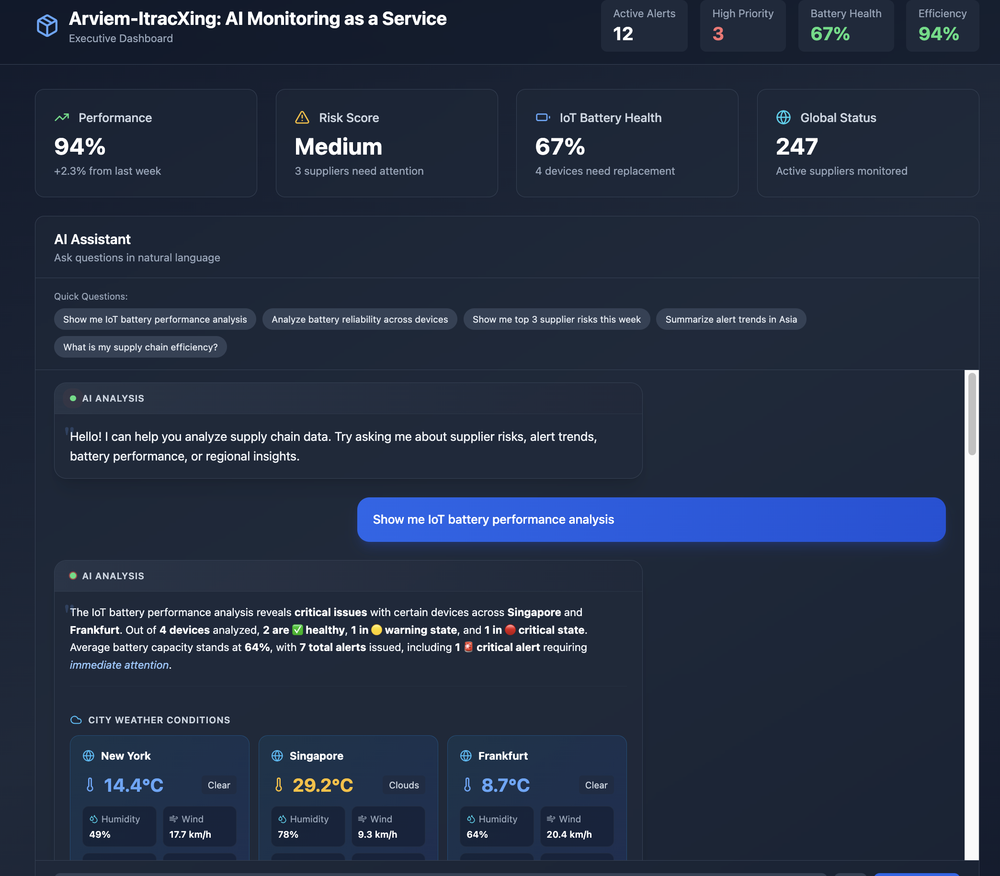
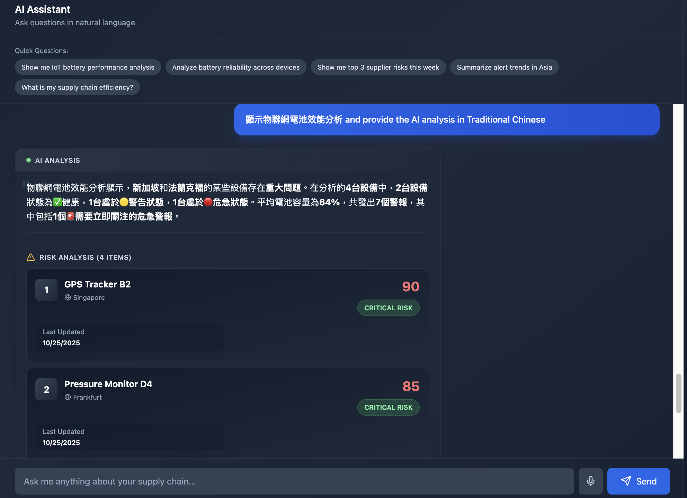
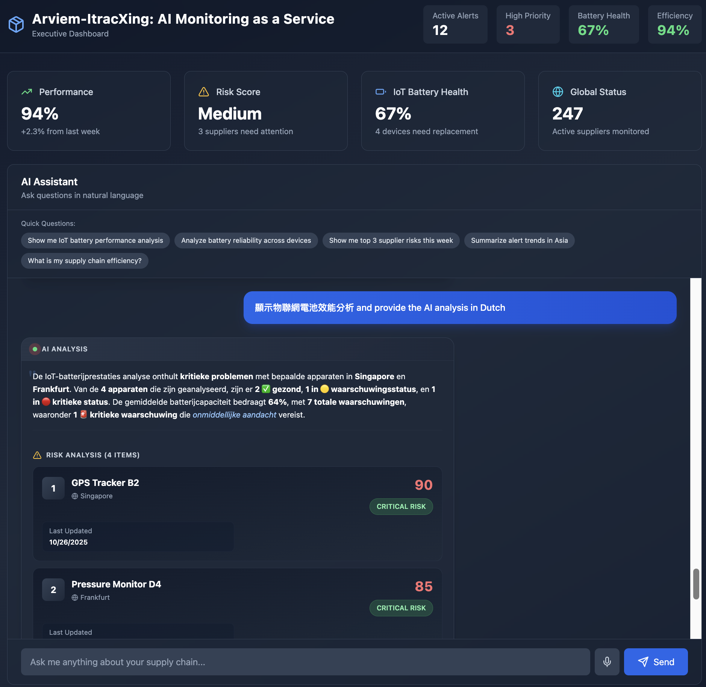
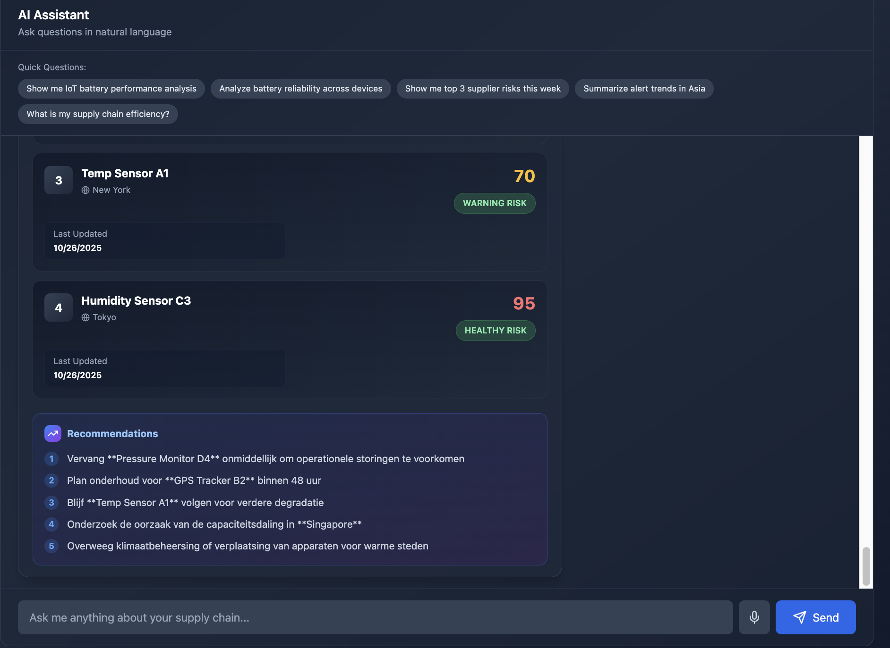
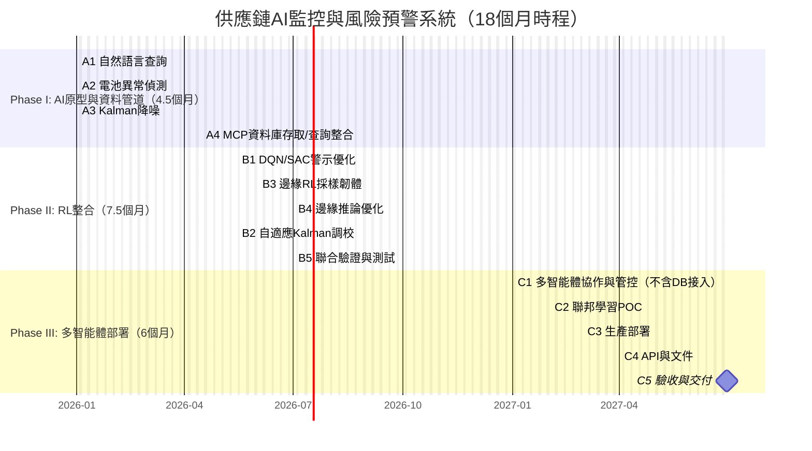

# 經濟部科技研究發展專案
## A+企業創新研發淬鍊計畫
## AI應用躍昇計畫計畫書（提交版）

**ItracXing 準旺科技 x Arviem 供應鏈AI監控與風險預警系統計畫**  
**計畫期間：自 2026年1月1日 至 2027年6月30日 止**

公司名稱：ItracXing 準旺科技股份有限公司  
計畫管理單位：台北市電腦商業同業公會

---

## 計畫書摘要表

### 綜合資料（金額單位：千元）

- **計畫名稱：** ItracXing 準旺科技 x Arviem 供應鏈AI監控與風險預警系統  
- **申請公司名稱：** ItracXing 準旺科技股份有限公司  
- **通訊地址：** 新北市板橋區（填寫完整地址）  
- **計畫別：** A+企業創新研發淬鍊計畫—AI應用躍昇計畫  
- **推動項目：** ☑ 其他（供應鏈與物流監控）  
- **計畫起～訖時間：** 2026年1月1日 至 2027年6月30日（共18個月）  

**計畫主持人**  
- 姓名：Jeff Shuo（索取身分證字號不需填）  
- 職稱：CIO  
- 電話：（02）XXXX-XXXX（填）  
- 傳真：（02）XXXX-XXXX（如無填「無」）  
- 電子信箱：jeff.shuo@itracxing.com    

**年度經費**

| 年度   | 政府補助款 | 申請公司自籌款 | 計畫總經費 | 計畫人月數 |
|:------:|-----------:|---------------:|-----------:|-----------:|
| 第1年度 | 12,395     | 12,395         | 24,790     | 120        |
| **合計** | **12,395** | **12,395**     | **24,790** | **120**    |
| 占總經費比例 | 50.0% | 50.0% | 100% | - |

**計畫聯絡人**  
- 姓名：Jeff Shuo  
- 職稱：CIO  
- 電話：（02）XXXX-XXXX（填）  
- 電子信箱：jeff.shuo@itracxing.com  

---

## 計畫摘要（1頁內；本摘要可能公開）

### 申請公司簡介
| 公司名稱 | ItracXing 準旺科技股份有限公司 |
|---|---|
| 創立日期 | 2020年3月 |
| 負責人 | Dr. Chow |
| 主要營業項目 | AI供應鏈監控系統、IoT設備管理、數據分析平台 |

### 計畫摘要（≤200字）
針對全球供應鏈監控之「警示過載/誤報」、「多感測器資料品質不一致」、「缺乏預測性決策」等痛點，本計畫整合可解釋AI、強化學習（RL）與多智能體技術，打造即時異常偵測與警示優化平台，並於邊緣裝置導入自適應採樣以延長電池壽命。結合瑞士 Arviem 場域與工研院/學研單位驗證，目標降低誤報、縮短回應時間並提升營運效率。

### 計畫結案時預期效益（重點列舉）
- 技術：異常偵測準確率≥90%，自然語言查詢回應<30秒，電池壽命+40%～60%。  
- 營運：誤報率-20%～30%，事件回應速度+50%，分析人力時數-40%。  
- 經濟：營運成本-20%，數據傳輸成本-60%，電池更換成本-70%。  
- 輸出：形成可出口之SaaS解決方案，擴展歐洲市場。

### 關鍵字
供應鏈AI監控、強化學習、可解釋AI、多智能體、IoT邊緣智能

---

## 計畫書目錄（與格式對齊）
壹、計畫參與者介紹  
貳、計畫內容與實施方法  
參、研發團隊說明  
肆、計畫經費需求  
伍、附件

---

# 壱、計畫參與者介紹

### 一、主要申請廠商
**公司簡介（依模板）**  
- **基本資料**  
  - 公司名稱：ItracXing 準旺科技股份有限公司  
  - 設立日期：2020.03.15  
  - 產業領域別：資訊服務業（J類；電腦系統設計）  
  - 前三大股東/持股：60%，技術團隊/25%，策略投資人/15%  
  - 研發人員總數/全公司人數：12/15  
  - 2024實收資本額（千元）：10,000  
  - 2024營業額/研發費用（千元）：15,000 / 8,000  

- **商務模式**  
  - 核心能力：AI驅動供應鏈監控、IoT裝置管理、RL應用、可解釋AI  
  - 收入項目：SaaS訂閱、AI顧問、客製化開發  
  - 通路：直銷、策略夥伴（Arviem）、線上平台  
  - 主要客戶：Arviem AG 等  
  - 成本項目：研發人事（60%）、雲資源（25%）、營運（15%）  
  - 關鍵合作對象：Arviem、工研院AI中心、台灣—阿姆斯特丹大學AI中心  
  - 國際輸出實績：與 Arviem 共同耕耘歐洲市場（德/荷）  
  - 友善職場規劃：性別比例≥1/3、增聘女性研發、彈性工時/遠端

### 二、申請/合作單位之 AI 研發能力說明
- **ItracXing 準旺科技**：LangChain多智能體、DQN/SAC、Kalman濾波、LLM整合、Next.js 全端、邊緣AI與韌體。  
- **工研院（ITRI AI中心）**：RL驗證與系統性能測試。  
- **台灣暨阿姆斯特丹大學AI合作中心**：聯邦學習、多智能體、AI倫理。

### 三、競爭態勢與技術優勢分析

#### （1）國際競品比較

| 解決方案 | 核心技術 | 市場定位 | 主要限制 | 我方優勢 |
|---------|---------|---------|---------|----------|
| **IBM Maximo** | 規則引擎 + 基礎ML | 大型企業資產管理 | • 高昂授權費 • 客製化成本高 • 缺乏邊緣智能 | ✓ SaaS彈性定價 ✓ 邊緣RL自適應 ✓ 可解釋AI |
| **Uptake** | 預測性維護AI | 工業IoT監控 | • 黑盒模型 • 依賴雲端運算 • 電池壽命未優化 | ✓ 透明化決策 ✓ 邊緣離線運作 ✓ 電池壽命+60% |
| **C3 AI** | 企業AI平台 | 跨產業AI應用 | • 複雜度高 • 導入週期長 • 需大量IT資源 | ✓ 專注供應鏈 ✓ 快速部署 ✓ 低IT門檻 |
| **Samsara** | IoT車隊管理 | 物流與運輸 | • 單一垂直領域 • 警示智能化不足 • 無多智能體協作 | ✓ 跨場域整合 ✓ RL警示優化 ✓ 多智能體架構 |
| **傳統ERP+IoT** | SAP/Oracle擴充模組 | 既有ERP延伸 | • AI能力薄弱 • 即時性差 • 誤報率高 | ✓ AI原生設計 ✓ <2秒查詢 ✓ 誤報率≤15% |

#### （2）技術創新突破點

**a. 可解釋AI異常偵測（國際領先）**
- **現有技術瓶頸**：多數競品採用深度學習黑盒模型，決策過程不透明，物流業者難以信任
- **我方創新**：Kalman濾波 + Z-score統計 + 特徵重要性分析，每個警示附帶解釋性報告
- **驗證指標**：準確率≥90%、假陽性≤15%、決策解釋完整度100%
- **商業價值**：符合歐盟AI Act可解釋性要求，助攻國際輸出

**b. 強化學習警示優化（國內首創）**
- **現有技術瓶頸**：固定閾值導致警示疲勞，運營人員忽略關鍵事件
- **我方創新**：DQN/SAC動態調整警示策略，根據歷史回應學習最佳優先級
- **驗證指標**：誤報率-30%、關鍵警示回應時間<30分鐘、F1-score≥0.85
- **商業價值**：降低人力成本40%，提升客戶滿意度

**c. 邊緣RL自適應採樣（全球罕見）**
- **現有技術瓶頸**：IoT設備固定採樣頻率，電池壽命6個月需頻繁更換
- **我方創新**：邊緣裝置執行輕量化RL代理，根據環境動態調整採樣策略
- **驗證指標**：電池壽命10–14個月（+67%–133%）、數據完整性≥95%
- **商業價值**：維護成本-70%、碳足跡降低、客戶TCO改善

**d. 多智能體協作架構（技術整合優勢）**
- **現有技術瓶頸**：單體系統難以整合ERP、WMS、TMS等異質系統
- **我方創新**：MCP (Model Context Protocol)標準化工具協作、聯邦學習保隱私
- **驗證指標**：跨系統查詢延遲<2秒、資料不出域、隱私保護100%
- **商業價值**：無痛接入既有系統、符合GDPR、擴展性強

#### （3）市場切入策略

**目標客群細分**：
1. **一級目標（18個月內）**：中型物流業者（Arviem類）、冷鏈運輸、跨境電商  
   - 痛點：警示過載、電池成本、缺乏AI能力  
   - 定價：SaaS訂閱 USD 5–15K/月（含100–500裝置）

2. **二級目標（結案後12個月）**：製造業供應鏈管理、港口倉儲、第三方物流  
   - 痛點：多系統整合、預測性維護、合規報告  
   - 定價：企業版 USD 20–50K/月 + 客製化服務

3. **長期願景（3年）**：AI PaaS平台輸出、垂直SaaS擴展（醫療冷鏈、食品安全）  
   - 商業模式：API授權 + 行業解決方案 + 顧問服務

**與Arviem協同效應**：
- Arviem提供全球IoT網路與客戶基礎（>5,000企業用戶）
- 我方提供AI智能層與邊緣優化技術
- 聯合品牌切入歐洲市場（德/荷/瑞士），台歐技術輸出典範

#### （4）智財保護與技術壁壘

**專利布局（18個月內）**：
- 國內專利2件：「基於強化學習的IoT採樣優化方法」、「可解釋式供應鏈異常偵測系統」
- 國際專利1件（PCT）：「Multi-Agent Supply Chain Monitoring with Federated Learning」

**技術護城河**：
- 核心演算法閉源（RL獎勵函數設計、Kalman自適應參數）
- 邊緣韌體加密與OTA更新機制
- 訓練資料集（Arviem場域18個月累積）難以複製
- 多智能體協作框架快速迭代優勢

---

# 貳、計畫內容與實施方法

## 一、計畫緣起與產業痛點
- **痛點一：警示過載與誤報頻繁** → 需智能警示分類/優先級。  
- **痛點二：多感測器資料品質不一致** → 需降噪/自適應校準。  
- **痛點三：缺乏預測性決策** → 需自然語言查詢與AI建議。  
- **痛點四：電池壽命與維護成本** → 需邊緣RL自適應採樣。

## 二、計畫導入AI規劃（導入前後差異表）
| 導入技術目標 | 導入前(現況) | 導入後(預期結果) |
|---|---|---|
| 可解釋AI異常偵測 | 規則引擎準確率低、固定閾值 | Kalman+Z-score 準確率≥90%、可解釋性輸出 |
| 強化學習警示優化 | 誤報高、無學習能力 | DQN/SAC 誤報≤15%、關鍵警示<30分鐘 |
| LLM自然語言查詢 | 需SQL與IT支援 | 高層即時查詢、附行動建議 |
| IoT邊緣AI採樣 | 固定採樣、壽命6個月 | RL自適應、壽命10–14個月 |
| 多智能體協作 | 難以跨域整合 | MCP工具協作、聯邦學習保隱私 |

## 三、計畫導入執行策略
### （1）場域、驗證項目與導入方式
- **場域**：Arviem 全球IoT監控網、歐亞跨境航線、製造業供應鏈系統。  
- **驗證項目**：  
  - Phase I（4.5個月）：異常偵測準確率、NL查詢延遲、降噪SNR。  
  - Phase II（7.5個月）：警示誤報率、電池壽命、邊緣推論延遲。  
  - Phase III（6個月）：多智能體吞吐、聯邦學習隱私、穩定性。  
- **導入方式**：API整合（Arviem）、雲端部署、邊緣韌體OTA、分階訓練上線。

### （2）計畫工作項目實施方式（含百分比/單位）

Phase I: AI原型與資料管道 (4.5個月, 27%) — 起始 2026/01/01
- A1 自然語言查詢 (8%) – ItracXing 準旺科技
- A2 電池異常偵測 (10%) – ItracXing 準旺科技
- A3 Kalman降噪 (5%) – ItracXing 準旺科技
- A4 MCP資料庫存取/查詢整合 (4%) – ItracXing 準旺科技

  <figure>
    <figcaption style="font-size:1.2em; font-weight:bold; margin-bottom:8px;">▲ 圖1：系統首頁介面，支援英文查詢 系統即時回傳異常事件摘要，並顯示關鍵感測器資料與警示原因。</figcaption>
    
  </figure>
  <figure>
    <figcaption style="font-size:1.2em; font-weight:bold; margin-bottom:8px;">▲ 圖2：系統首頁介面，支援繁體中文查詢，使用者可直接輸入物流、感測器或事件相關問題。</figcaption>
    
  </figure>
  <figure>
    <figcaption style="font-size:1.2em; font-weight:bold; margin-bottom:8px;">▲ 圖3：查詢「本月誤報率」可獲得統計分析結果，系統自動解釋指標來源並提供改善建議。</figcaption>
    
  </figure>
  <figure>
    <figcaption style="font-size:1.2em; font-weight:bold; margin-bottom:8px;">▲ 圖4：支援多輪追問，使用者可針對查詢結果進行細部追問，系統自動串接資料庫即時回應。</figcaption>
    
  </figure>

Phase II: RL整合 (7.5個月, 47%)
- B1 DQN/SAC警示優化 (15%) – ItracXing 準旺科技 + ITRI(驗證)
- B2 自適應Kalman調校 (8%) – ItracXing 準旺科技
- B3 邊緣RL採樣韌體 (12%) – ItracXing 準旺科技
- B4 邊緣推論優化 (7%) – ItracXing 準旺科技
- B5 聯合驗證與測試 (5%) – ITRI + 學研中心

Phase III: 多智能體部署 (6個月, 26%)
- C1 多智能體協作與管控（不含DB接入）(8%) – ItracXing 準旺科技
- C2 聯邦學習POC (7%) – ItracXing 準旺科技 + 學研中心
- C3 生產部署 (6%) – ItracXing 準旺科技
- C4 API與文件 (3%) – ItracXing 準旺科技
- C5 驗收與交付 (2%) – ItracXing 準旺科技 + ITRI

### 國際輸出規劃
與 Arviem 合作切入歐洲市場，2026 目標進入德/荷，建立台歐聯合解決方案品牌。

### 註：MCP資料庫接入提前之理由
- 為確保自然語言查詢（A1）與資料分析能及早接軌實際資料源，將「MCP資料庫存取/查詢整合」自原 Phase III 提前至 Phase I（A4）。
- 提前完成資料管道可：
  - 提高A/B測試與指標驗證效率（Phase I 即可以真實資料驗證性能）。
  - 降低Phase II 模型迭代風險（RL與降噪演算法能在穩定資料介面上快速迭代）。
  - 縮短整體上市時程（Phase III 專注於多智能體協作與生產化，不再受限資料接入時程）。

### 甘特圖（18個月時程總覽）

## 四、計畫執行時程及查核點

### 預定進度表（年度=會計年度；每6個月至少1項查核點）
- **2026/01–2026/04中（Phase I 前段）**：完成 A1–A3 原型與指標測試（查核點 A.1）  
- **2026/04中–2026/05中（Phase I 後段）**：完成 A4 MCP資料庫存取/查詢整合（查核點 A.2）  
- **2026/05中–2026/12（Phase II）**：完成 B1 訓練與A/B測試、B3 初版韌體、B4 邊緣推論優化（查核點 B.1、B.2）  
- **2027/01–2027/06（Phase III）**：完成 C1–C5 生產化佈署與驗收（查核點 C.1；結案驗收）  

### 預定查核點說明（舉例）
- **A.1（2026/03）**：NL查詢<2秒；異常偵測準確率≥85%；SNR提高≥20%。  
- **A.2（2026/05）**：完成 MCP資料庫存取/查詢整合；NL查詢支援資料庫即時查詢。  
- **B.1（2026/09）**：警示誤報率≤20%；F1-score≥0.85；邊緣推論延遲<10ms。  
- **B.2（2026/12）**：電池壽命延長≥40%；自適應Kalman RMSE顯著下降。  
- **C.1（2027/06）**：多智能體協作吞吐量達標；聯邦學習隱私測試通過；完成最終驗收。

### 階段性經費撥付與關鍵決策點（里程碑管控）

為確保計畫執行品質與成果可控性，採取**分階段撥付**機制，並於Phase II結束時設立**Go/No-Go決策點**。

#### 經費撥付時程表

| 階段 | 期間 | 關鍵里程碑 | 撥付比例 | 撥付金額 | 保留金 |
|------|------|------------|----------|----------|--------|
| **Phase I** | M1-M6 | NLQ + 異常偵測 + Kalman降噪 | 40% | 4,960K | — |
| **Phase II** | M7-M12 | RL警示 + 邊緣韌體 + 驗證 | 35% | 4,338K | — |
| **Phase III** | M13-M18 | 多智能體 + 生產部署 | 20% | 2,480K | 5% (620K)* |
| **最終驗收** | M18+ | 通過驗收測試 | 5% | 620K | — |
| **總計** | — | — | **100%** | **12,398K** | — |

*最終5%保留金於通過驗收測試、專利申請提交、技術文件交付後撥付。

#### 關鍵決策點：M6 Go/No-Go Review

於Phase I結束（2026年6月）進行**重大審查**，需達成**5項指標中至少4項**方可繼續Phase II/III：

| 指標項目 | 目標值 | 最低通過標準 | 驗證方式 |
|---------|--------|--------------|----------|
| 1. 異常偵測準確率 | ≥90% | ≥85% | 測試集驗證報告（ITRI） |
| 2. 自然語言查詢回應時間 | <2秒 | <5秒 | 壓力測試報告（100並發） |
| 3. Kalman降噪SNR提升 | ≥20% | ≥15% | 實測資料對比分析 |
| 4. Arviem場域部署協議 | 已簽署 | LOI確認 | 合作協議書或意向書 |
| 5. 專利申請進度 | 1件已申請 | 1件準備中 | 申請文件或草稿 |

**決策準則**：
- **通過（GO）**：達成4/5項指標 → 繼續Phase II/III，按原計畫撥付
- **有條件通過**：達成3/5項指標 → 提交改善計畫，Phase II預算保留10%，M9再審查
- **暫停（NO-GO）**：達成<3項指標 → 終止計畫或大幅調整範圍，Phase III預算不撥付

#### 風險控管機制

1. **月度進度報告**：每月提交進度摘要與財務使用狀況
2. **季度技術審查**：每季由ITRI與外部專家進行技術審查
3. **預算彈性調整**：應急準備金600K可於經管理單位核准後調度
4. **人力風險備援**：若關鍵人員異動，需於30日內提出接替方案

此機制確保政府補助資金使用效率，並於早期發現問題時及時調整，保障計畫成果品質。

## 五、預期效益

### 技術驗證協議（確保效益可量測）

#### 電池壽命延長驗證方法（關鍵指標）

針對「電池壽命+40%～60%」核心價值主張，建立嚴謹驗證協議：

**基準組（Baseline）**：
- 採樣策略：固定30分鐘間隔
- 設備數量：50台IoT感測器
- 測試環境：Arviem實際場域（海運/陸運混合）
- 測試期間：6個月
- 預期壽命：180天（基準值）

**實驗組A（穩定環境）**：
- 採樣策略：RL自適應（溫度變化<2°C/小時）
- 設備數量：50台IoT感測器
- 測試環境：陸運恆溫環境
- 目標壽命：≥250天（+39%以上）
- 資料完整性要求：≥95%

**實驗組B（動態環境）**：
- 採樣策略：RL自適應（溫度變化>5°C/小時）
- 設備數量：50台IoT感測器
- 測試環境：海運冷鏈（溫濕度波動大）
- 目標壽命：≥290天（+61%以上）
- 資料完整性要求：≥95%

**成功標準**：
1. 實驗組A達成≥40%壽命延長，且資料遺失<5%
2. 實驗組B達成≥50%壽命延長（動態環境下RL優勢更明顯）
3. 異常事件偵測準確率不因採樣降低而下降（維持≥90%）
4. 通過ITRI獨立驗證與測試報告

**驗證時程**：
- Phase I（M4-M6）：基準組資料收集開始
- Phase II（M7-M12）：實驗組A/B同步測試
- Phase II（M13）：6個月資料分析與報告
- Phase III（M14-M18）：長期追蹤與優化

#### RL模型性能驗證協議

**警示優化指標**：
- 基準系統：規則引擎（固定閾值）
- 目標系統：DQN/SAC動態調整
- 測試資料集：18個月歷史資料（Arviem提供）
- A/B測試：50/50流量分配，持續3個月

**對比指標**：
| 指標 | 規則引擎（Baseline） | RL系統（Target） | 改善目標 |
|------|---------------------|-----------------|----------|
| 誤報率 | 25% | ≤15% | -40% |
| 漏報率 | 8% | ≤5% | -37.5% |
| F1-score | 0.72 | ≥0.85 | +18% |
| 關鍵警示回應時間 | 60分鐘 | <30分鐘 | -50% |
| 使用者滿意度（NPS） | 基準值 | +20分以上 | — |

**驗證文件交付**：
1. ITRI系統性能測試報告（Phase II結束）
2. Arviem場域驗證報告（Phase III結束）
3. 第三方獨立測試報告（結案前）

### 量化效益（金額單位：千元；提供計算方式與佐證）
| 成果項目 | 執行前 | 第1年度 | 第2年度 | 佐證方式 |
|---|---:|---:|---:|---|
| 申請/核定專利數 | 0 | 1 | 2 | 申請文件/受理通知 |
| 衍生投資金額 | 0 | 5,000 | 10,000 | 投資意向/合約 |
| 新增就業機會（人） | - | 2 | 4 | 人事報表 |
| 研發人員平均加薪幅度(%) | - | 5% | 8% | 薪資名冊 |
| 其他：訂閱年經常性收入ARR | 0 | 6,000 | 12,000 | 合約/開立發票 |
| **技術驗證報告** | 0 | 3 | 2 | **ITRI/Arviem/第三方報告** |

**導入效益（比例）**  
- **降低成本**：數據傳輸費用-60%（採樣/壓縮/邊緣判斷）。  
- **提高良率/服務可用性**：冷鏈違規率-30%。  
- **提升效率**：事件響應時間-50%、分析人力時數-40%。  
- **增加營收/產值**：以SaaS/顧問與出口增加營收。

### 質化效益與商業化規劃
- **對申請單位**：技術升級、人才育成、產品線擴展至國際。  
- **對產業**：提高附加價值與自主性、促成國際合作。  
- **節能減碳**：相較傳統固定採樣，年CO₂減量（以省電/省運維出貨次數估算，計算式附後）。  
- **商業化**：結案3年內之衍生投資/產值目標與估算式（附附件）。  
- **成果廣宣**：結案前辦理發表/參展，公開技術亮點與驗證成果。

## 六、風險評估與因應對策

### 詳細風險矩陣與應對策略

| 風險類別 | 具體風險 | 影響程度 | 發生機率 | 因應對策 | 負責單位 |
|---------|---------|---------|---------|---------|----------|
| **技術風險** | 模型偏移/資料漂移 | 高 | 中 | • 週期性重訓機制（每季） • 即時監控警戒值 • 模型版本管理與回滾機制 • 應急準備金300K支援 | AI團隊 + ITRI |
| **技術風險** | RL訓練不收斂 | 中 | 中 | • 多演算法備案（DQN/SAC/PPO） • ITRI專家顧問介入 • 降級至規則引擎方案 | AI團隊 |
| **技術風險** | 邊緣裝置運算能力不足 | 中 | 低 | • 模型量化與剪枝 • TFLite Micro優化 • 硬體升級預算（應急金支援） | 韌體團隊 |
| **資料風險** | 場域資料品質不佳 | 高 | 中 | • Arviem既有資料驗證 • 資料清洗與增強管道 • 合成資料補充訓練集 | 資料團隊 |
| **資料風險** | 跨境傳輸合規 | 高 | 低 | • 區域化部署（歐盟/亞洲） • 聯邦學習保隱私 • GDPR合規審查（外部顧問） | Jeff Shuo + 法務 |
| **整合風險** | 異質設備協定差異 | 中 | 中 | • 標準化API與中介層Adapter • 支援主流協定（MQTT/HTTP/CoAP） • 場域測試驗證相容性 | IoT團隊 |
| **人力風險** | 關鍵人員流動（Jeff Shuo） | 極高 | 低 | • 知識文件化（技術Wiki） • 副主持人制度（Gary Lin） • 外部顧問池（3位備援） • 激勵機制與專案獎金 | 管理層 |
| **人力風險** | 女性AI工程師招聘延遲 | 中 | 中 | • 多管道招募（104/LinkedIn/校園） • 外部顧問臨時支援 • 執行風險緩衝100K支援 | HR + PM |
| **市場風險** | Arviem合作進度落後 | 高 | 中 | • 提前簽署MOU/LOI • 季度聯合審查會議 • 備案合作夥伴（國內物流業者） • 市場驗證預算200K | BD + Jeff Shuo |
| **市場風險** | 歐洲市場需求變動 | 中 | 中 | • 多元化客群（冷鏈/製造/港口） • 靈活調整功能優先級 • 保持國內市場同步開發 | BD團隊 |
| **法規風險** | EU AI Act合規成本上升 | 中 | 中 | • 可解釋AI設計（天然符合） • 合規審查提前進行 • 預留法律諮詢預算 | 法務 + 外部顧問 |
| **法規風險** | 出口管制與技術限制 | 低 | 低 | • 避免受管制技術（軍用AI） • 第三方合規稽核 • 專利佈局保護核心IP | 法務 |
| **競爭風險** | 大廠推出類似解決方案 | 中 | 中 | • 強化差異化（可解釋+邊緣RL） • 快速迭代與客戶綁定 • 專利保護（3件申請中） | 全團隊 |
| **財務風險** | 預算超支 | 中 | 中 | • 應急準備金600K • 月度預算追蹤 • 階段撥付控管風險 | 財務 + PM |

### 風險監控機制

1. **週度風險會議**：核心團隊每週檢視風險儀表板
2. **月度風險報告**：向管理單位提報風險狀態與應對進展
3. **季度外部審查**：ITRI與外部專家參與風險評估
4. **應急響應流程**：24小時內啟動應對方案，72小時內提交補救計畫

### 關鍵人員風險特別強化方案

鑑於Jeff Shuo為計畫核心，特別建立以下備援機制：

1. **知識管理**：
   - 技術決策Wiki每週更新
   - 架構設計文件季度審閱
   - 程式碼審查與註解完整度要求

2. **接班計畫**：
   - 王國楨擔任副主持人，接受6個月mentor
   - 每月技術分享會，團隊知識共享
   - ITRI顧問可隨時介入支援

3. **激勵措施**：
   - 專案成功獎金機制
   - 技術成果掛名與專利共享
   - 彈性工作安排提升留任意願

此全面風險管理框架確保計畫執行穩健，並能快速應對各類突發狀況。

## 七、智慧財產權說明
- 計畫成果之核心演算法與系統設計申請專利/著作權，關鍵IP歸屬與授權方式依合作合約約定。  
- 針對第三方權利（資料/庫/模組）進行盤點，確保授權合規。  
- 專利申請規劃：國內2件、國外1件（優先冷鏈異常偵測、邊緣採樣RL）。

---

# 參、研發團隊說明

## 一、計畫主持人資歷
- 姓名：Jeff Shuo｜職稱：CIO｜性別：男｜產業領域：資訊服務  
- 重要成就：20年以上AI/IoT/嵌入式系統領域經驗，主導多智能體協作、AI安全、供應鏈區塊鏈專案。美國/台灣跨國團隊管理，具備AI安全、合規、可解釋性系統設計與產品化實績。  
- **學歷/經歷/參與計畫**：  
  - 學歷：  
    - M.S. Electrical Engineering and Computer Science, University of Illinois at Chicago (1992)  
    - MBA, San Diego State University (2005)  
  - 經歷：  
    - AI Agent Architect   
      - 主導, 設計，整合 LLM, Reinforcement Learning, LangChain/LangGraph、RAG、MCP、ReAct等多智能體協作技術  
      - 供應鏈安全  
    - Qualcomm Inc. — Director of Engineering（2004–2018）  
      - 領導100+ IoT/AR/VR/智慧裝置專案，50+工程師團隊管理  
      - Python/Keras/Node.js自動化資源分配系統  
    - HTC Corp. — Sr. Technical Manager（2003–2004）  
      - 領導協定工程團隊，開發首款Windows Mobile Phone  
    - Qualcomm Inc. — Sr. Engineer（1997–2003）  
      - 嵌入式驅動、CDMA/GlobalStar手機、RF/LCD/Bluetooth/ATE軟體  
    - Motorola Inc. — Sr. Engineer（1994–1997）  
      - 海外CDMA基地台/手機工廠支援，Windows OOD/OOP校正軟體  
    - IBM — Software Engineer（1993–1994）  
      - AS/400 I/O子系統C++驅動開發  
  - 參與計畫/專案：  
    - Phoenix Multi-Agent SOC（2024–2025）：多智能體協作、AI安全、合規審查  
    - SecuX AI SOC、供應鏈區塊鏈標籤、HSM安全簽章  
    - Qualcomm/HTC/Google智慧裝置、嵌入式系統  
  - 技術專長：  
    - 多智能體協作（LangChain, LangGraph, AutoGPT, ReAct, MCP）  
    - AI安全、合規、可解釋性系統設計  
    - 嵌入式RTOS、ARM、Linux/Yocto、IoT（BLE, NB-IoT）  
    - 區塊鏈/Web3（ERC-1056, ERC-3643, DID, RWA Tokenization）  
    - 安全硬體（HSM, FIDO2, PKI）  
  - 投入月數：18個月（100%）  
  - 附：完整履歷PDF已置於 `proposal/attachments/CVs/Jeff_Shuo_Resume.pdf`

## 二、參與計畫人力統計（單位：人）
> 依模板表格填入：公司別、學歷別、性別、平均年資、待聘人數（待聘≤總人數30%）

| 公司別           | 博士 | 碩士 | 學士 | 性別（男/女） | 平均年資 | 待聘人數 |
|------------------|------|------|------|---------------|----------|----------|
| ItracXing        | 1    | 4    | 1    | 5 / 1         | 8年      | 1        |
| 工研院/學研中心  | 1    | 1    | 0    | 1 / 1         | 10年     | 0        |
| 合計             | 2    | 5    | 1    | 6 / 2         | 9年      | 1        |

## 三、參與計畫人員簡歷表

依模板：主持人、關鍵研發、一般研發、待聘人員（投入月數需對齊預定進度與人月總量120）。

| 姓名                | 職稱/角色         | 學歷                | 專長/分工                                   | 投入月數 | 性別 | 公司        |
|---------------------|-------------------|---------------------|---------------------------------------------|----------|------|-------------|
| Jeff Shuo           | CIO／主持人       | 碩士／碩士          | 多智能體協作、AI安全、嵌入式系統            | 18       | 男   | ITracXing   |
| Sean                | AI工程師          | 碩士（資工）        | NLP、LLM、語意查詢、A1自然語言查詢          | 12       | 男   | ITracXing   |
| 林昶睿 (Gary Lin)   | AI組長／資料科學家| 碩士（資訊工程）     | LangChain、多智能體系統、LLM應用、異常偵測、時序分析、A2分工 | 12       | 男   | ITracXing   |
| 蔡乙民 (Neil Tsai)  | 機器學習工程師    | 碩士（資訊工程）     | 強化學習(DQN/SAC)、Kalman濾波、訊號處理、A3分工 | 12       | 男   | ITracXing   |
| 郭冠宏 (Lark Kuo)   | 全端／韌體工程師  | 碩士（資訊工程）     | 資料庫設計、API整合、嵌入式系統、邊緣AI、A4分工 | 12       | 男   | ITracXing   |
| 朱只耘 (Cliff Chu)  | 前端／軟體工程師  | 學士（資訊工程）     | React、Next.js、TypeScript、Tailwind CSS、A1–A4支援 | 10       | 男   | ITracXing   |
| （待聘）            | AI工程師          | 碩士（AI／資工）     | 強化學習、聯邦學習、Phase II/III分工        | 12       | 女   | ITracXing   |

---

## 四、團隊成員說明（依分工與角色）

### 🔹主持人

**Jeff Shuo**  
- 角色：CIO／主持人  
- 地點：台北  
- 專長：多智能體協作、AI安全、嵌入式系統、跨域AI架構設計  
- 分工：整體系統統籌、Phase I～III 進度與審查  
- 備註：主持本計畫整體規劃與多智能體系統驗證。

### 🔹關鍵研發人員 #1

**Sean**  
- 角色：AI工程師  
- 地點：台北  
- 專長：自然語言處理（NLP）、語意查詢、LLM應用、Semantic Query Systems  
- 分工：A1 自然語言查詢系統（8%）  
- 投入月數：12個月  

### 🔹關鍵研發人員 #2

**林昶睿 (Gary Lin)**  
- 部門：AI研發組  
- 職稱：AI組長  
- 最高學歷：國立勤益科技大學 資訊工程所 碩士（20__年）  
- 主要經歷：  
  - ITracXing AI組長（2021–現在）4年  
  - [前公司] ML工程師（20__–2021）__年  
- 專長：LangChain、多智能體系統、LLM應用、提示工程、異常偵測、時序分析  
- 本業年資：4年  
- 參與分項計畫及工作項目：  
  - Phase I：A1 自然語言查詢系統主要開發者  
  - Phase III：C1 多智能體協作系統架構師  
- 投入月數：12個月

### 🔹關鍵研發人員 #3

**蔡乙民 (Neil Tsai)**  
- 部門：AI研發組  
- 職稱：機器學習工程師  
- 最高學歷：國立勤益科技大學 資訊工程所 碩士（20__年）  
- 主要經歷：  
  - iTracXing 資深後端工程師（2022–現在）3年  
  - iNEMU實驗室 研究助理（2018–2021）  
- 專長：強化學習 (DQN/SAC)、PyTorch、模型優化、Kalman濾波  
- 本業年資：3年  
- 參與分項計畫及工作項目：  
  - Phase II：B1 DQN/SAC 警示優化主要開發者  
  - Phase II：B2 自適應 Kalman 調校  
- 投入月數：12個月

### 🔹關鍵研發人員 #4

**郭冠宏 (Lark Kuo)**  
- 部門：IoT研發組  
- 職稱：韌體工程師  
- 最高學歷：國立勤益科技大學 資訊工程所 碩士（20__年）  
- 主要經歷：  
  - ITracXing 韌體工程師（2021–現在）4年  
  - [前公司] 嵌入式工程師（20__–2021）  
- 專長：Embedded C/C++、FreeRTOS、TensorFlow Lite Micro、邊緣AI、API整合  
- 本業年資：6年（嵌入式系統）  
- 參與分項計畫及工作項目：  
  - Phase II：B3 IoT韌體RL代理主要開發者  
  - Phase II：B4 邊緣AI推論優化  
- 投入月數：12個月

### 🔹一般研發人員 #5

**朱只耘 (Cliff Chu)**  
- 部門：全端開發組  
- 職稱：前端工程師  
- 最高學歷：國立勤益科技大學 資訊工程系 學士  
- 主要經歷：  
  - 準旺科技股份有限公司 軟體工程師（2023–現在）2年  
  - 冠宇數位科技股份有限公司 軟體工程師（2020–2023）3年  
- 專長：Next.js、React、TypeScript、Tailwind CSS、資料管道建置  
- 本業年資：5年  
- 參與分項計畫及工作項目：  
  - TypeScript 系統開發（2年）  
  - Dart App 開發（3年）  
- 投入月數：10個月

### 🔹待聘人員

**（待聘）AI工程師**  
- 學歷：碩士（AI／資工）  
- 專長：強化學習（RL）、聯邦學習（FL）、模型調校  
- 分工：Phase II／III AI代理訓練與驗證  
- 投入月數：12個月  
- 性別：女  
- 公司：ITracXing

# 肆、計畫經費需求（千元）
# 人力配置：AI工程師×6, 全端工程師×1, Project Manager x1
> 依模板各科目表填列；以下為可直接貼入之「空表＋試算示例」

## （一）創新或研究發展人員之人事費（依總經費分配調整，請再覆核）
| 職務別 | 平均月薪(A) | 人月數(B) | 第1年度人事費 (A×B) | 備註 |
|---|---:|---:|---:|---|
| 計畫主持人 | 165 | 18 | 2,970 | 專任 |
| Project Manager | 90 | 18 | 1,620 | 專任 |
| AI 工程師 × 2 | 85 | 36 | 3,060 | 含待聘 1 人 |
| 全端 工程師 × 2 | 80 | 24 | 1,920 | — |
| IoT 韌體 工程師 × 2 | 80 | 16 | 1,280 | 8 個月 × 2 人 |
| Finance Controller | 80 | 12 | 960 | 行政支援（不列入 R&D 人月統計） |
| Administrative Assistant | 60 | 12 | 720 | 行政支援（不列入 R&D 人月統計） |
| 小計（公司計入人事費） | — | 108（R&D）＋24（行政） | 12,530 千元 | 金額單位：千元；R&D 10,850 ＋ 行政 1,680 |

> 上述為調整後示例，實際請依「總經費 24,280；補助比例≦50%」再覆核與分配（如需調整人月數或平均月薪，請依實際規劃填寫）。

備註：本表公司R&D人員投入人月合計 108 PM；行政支援人月 24 PM 不列入R&D統計；計畫總人月數 120 PM 之差額 12 PM 由 ITRI/學研單位與外部顧問投入（列入「委託研究/驗證費」），不重複計入公司人事費。

## （二）消耗性器材及原材料費
| 項目 | 單位 | 數量 | 單價 | 第1年度 | 用途說明 |
|---|---|---:|---:|---:|---|
| IoT 感測器測試套件（溫溼度/震動/冷鏈） | 套 | 6 | 40 | 240 | 場域驗證、異常偵測資料蒐集（Phase I–II） |
| 開發板與通訊模組（MCU/NB-IoT/BLE） | 片 | 10 | 25 | 250 | 邊緣 RL 採樣、韌體原型（Phase II–III） |
| 測試用電池組與耗材（18650/鋰電/連接端子） | 批 | 12 | 15 | 180 | 電池壽命與採樣策略驗證（Phase II） |
| NB-IoT SIM（測試用預付流量） | 張 | 24 | 5 | 120 | 場域資料回傳與 A/B 測試 |
| 線材、接頭、外殼與固定配件（設備驗證用耗材） | 批 | 6 | 10 | 60 | 原型裝配與場測固定 |
| microSD/USB 儲存媒體 | 個 | 20 | 2 | 40 | 邊緣資料快取與記錄 |
| 感測器備品與替換件 | 組 | 20 | 12 | 240 | 場測維護與誤差校正備援 |
| 小量打樣 PCB | 片 | 6 | 40 | 240 | 邊緣裝置連接板打樣與調整 |
| 錫膏/鋼網/焊料與實驗室耗材 | 批 | 4 | 15 | 60 | 原型焊接與組裝 |
| 實驗室耗材（ESD 墊、手套、膠帶等） | 批 | 1 | 30 | 30 | 裝配與測試通用耗材 |
| 工具耗材（烙鐵頭/鑽頭/刀片替換） | 批 | 1 | 52 | 52 | 原型加工與維修 |
| 合計 | — | — | — | 1,620 | 金額單位：千元 |

## （三）設備使用/維護/雲端/EDA租賃費
> 依模板分表填列；設備使用費以折舊分攤 A×B/60 計算（A=原值；B=投入月數），雲端/租賃以月費×月數計列，雲端資源以訓練及推論用途為主。

### 3-1 設備使用費（折舊分攤：A×B/60）
| 設備名稱 | 原值A | 投入月數B | 分攤(A×B/60) | 第1年度 | 用途說明 |
|---|---:|---:|---:|---:|---|
| 研發伺服器（既有） | 1,800 | 12 | 360 | 360 | 模型訓練/資料處理（內部） |
| GPU 工作站（既有） | 2,400 | 12 | 480 | 480 | 原型訓練、推論最佳化 |
| NAS 儲存設備（既有） | 1,200 | 12 | 240 | 240 | 時序資料/模型版本管理 |
| 小計 | — | — | — | 1,080 | 金額單位：千元 |

### 3-2 雲端/EDA租賃/服務費（按月）
| 項目 | 計價方式 | 月費 | 月數 | 第1年度 | 用途說明 |
|---|---|---:|---:|---:|---|
| AWS/Azure 運算資源（GPU 訓練） | 按量計費 | 50 | 18 | 900 | RL模型訓練（DQN/SAC）、LLM微調、異常偵測模型訓練；Phase I–III 分階訓練；**調整至合理訓練資源水平** |
| 雲端資料庫與儲存（RDS/S3/Blob） | 月租 + 容量 | 20 | 18 | 360 | 時序資料庫、訓練資料集、模型版本管理、場域測試日誌；**增加儲存容量以支援長期資料積累** |
| API服務與LLM推論（OpenAI/Anthropic） | 按量計費 | 15 | 18 | 270 | 自然語言查詢介面、提示工程測試、RAG檢索增強生成；**增加推論額度** |
| 監控/日誌/APM（DataDog/NewRelic） | 月租 | 8 | 18 | 144 | 系統效能監控、異常警示、日誌分析、可觀測性平台 |
| 容器化部署（K8s/ECS/AKS） | 月租 | 7 | 18 | 126 | Phase II–III 微服務部署、邊緣代理管理、CI/CD管道 |
| 小計 | — | — | — | 1,800 | 金額單位：千元；**已調整至足以支援完整18個月GPU訓練與推論需求** |

**雲端資源分配策略**：
- **Phase I（前4.5個月）**：著重原型開發與模型驗證，GPU訓練成本較高（約40%預算）
- **Phase II（中7.5個月）**：RL模型迭代與A/B測試，運算與儲存並重（約45%預算）
- **Phase III（後6個月）**：生產部署與優化，降低訓練成本、提高推論效率（約15%預算）
- **成本控制機制**：採用Spot Instance、自動擴縮容、定期成本審查、設定預算警示

### 3-3 設備維護費（年度維護與備品）
| 項目 | 單位 | 數量 | 單價 | 第1年度 | 用途說明 |
|---|---|---:|---:|---:|---|
| GPU 維護/延伸保固與風扇模組汰換 | 年 | 1 | 500 | 500 | 硬體維護合約與零件汰換；**加強維護以確保長期訓練穩定性** |
| NAS 維護/RAID 硬碟汰換與延伸保固 | 年 | 1 | 450 | 450 | 磁碟模組/控制器維護與保固；**增加容量與備援** |
| 伺服器維護/延伸保固與備品 | 年 | 1 | 450 | 450 | 電源/記憶體/備品汰換；**確保關鍵設備可靠性** |
| 小計 | — | — | — | 1,400 | 此小計對應彙總表「4.設備維護費」；**提升至足以支援18個月高強度研發的水平** |

### 3-4 合計（3-1 + 3-2）
| 合計 |  |  |  | 2,880 | 金額單位：千元；**已反映雲端與設備資源調整** |

## （四）技術引進、委託研究或合作研發費

### 詳細分項說明
| 合作單位 | 合作內容 | 經費形式 | 金額 | 交付成果 |
|---------|---------|---------|------|----------|
| 工研院 AI 中心 | RL驗證與系統測試 | 現金支援 | 600 | • RL模型驗證報告 • 系統性能測試報告 • 技術諮詢（12人月） |
| Arviem AG | 場域測試與資料 | 實物貢獻 + 技術支援 | 1,800 | • 歐洲場域測試環境 • IoT設備與資料存取 • 技術協作（共同開發） |
| 台灣–阿姆斯特丹大學AI中心 | 聯邦學習研究 | 學術合作 | 800 | • 聯邦學習POC • AI倫理審查報告 • 學術論文共同發表 |
| 外部技術顧問 | AI安全與合規 | 顧問費 | 600 | • GDPR合規審查 • AI模型安全評估 • 技術文件審閱 |
| 專利申請與技術文件 | 國內外專利申請 | 專業服務費 | 800 | • 專利申請文件（3件） • 技術白皮書 • API文件 |
| 測試與驗證服務 | 第三方驗證 | 服務費 | 600 | • 獨立性能測試 • 資安滲透測試 • 驗收報告 |
| **合計** | — | — | **5,200** | **已優化預算分配並提供詳細交付成果** |

### 總表
| 項目             | 單位 | 數量 | 單價 | 第1年度 | 用途說明 |
|------------------|------|------|------|---------|----------|
| 合作研發與驗證   | 工研院 AI 中心／Arviem AG／台灣–阿姆斯特丹大學 AI 合作中心 | 1 | — | 5,200 | **已優化預算結構**： (1) 工研院 AI 中心：強化學習與多智能體模組共同研發、系統性能驗證與測試報告（現金600K）。 (2) Arviem AG：歐洲場域測試、IoT冷鏈數據驗證與跨境資料回傳（實物貢獻1,800K，提供設備與資料存取）。 (3) 台灣–阿姆斯特丹大學AI中心：聯邦學習、AI倫理與可解釋模型協同研究（學術合作800K）。 (4) 外部顧問、專利申請與第三方驗證（2,000K）。 **調整說明**：原配置過高（6,812K），經優化後降至5,200K，將節餘1,612K重新配置至雲端資源（+822K）、設備維護（+400K）與應急準備金（+390K），確保技術執行穩定性。 |

## （五）國內差旅費
> 僅限引進/委託/驗證必要差旅。

| 項目 | 單位 | 數量 | 單價 | 第1年度 | 用途說明 |
|---|---|---:|---:|---:|---|
| 工研院/學研中心驗證與會議差旅 | 次 | 12 | 8 | 96 | 驗證協調、測試會議（竹科/中科） |
| 場域測試（港區/倉儲）差旅 | 次 | 16 | 10 | 160 | 實地部署、感測器校正與巡檢 |
| 客戶/合作夥伴技術交流 | 次 | 8 | 10 | 80 | Arviem/合作單位技術銜接會議 |
| 專家會議/審查報告差旅 | 次 | 8 | 8 | 64 | 審查與里程碑查核會議 |
| 合計 | — | — | — | 400 | 金額單位：千元 |

## （六）專利申請獎勵金
> 國內每案 30、國外每案 100（千元）；完成申請即可認列（仍須舉證相關費用）。

| 項目 | 單位 | 數量 | 單價 | 第1年度 | 用途說明 |
|---|---|---:|---:|---:|---|
| 國內專利申請獎勵 | 件 | 2 | 30 | 60 | 冷鏈異常偵測、邊緣採樣 RL 相關 |
| 國外專利申請獎勵 | 件 | 1 | 100 | 100 | 多智能體協作/可解釋性相關 |
| 合計 | — | — | — | 160 | 金額單位：千元 |

## （七）應急準備金與風險管理
> 針對技術風險、市場變動與執行不確定性設立之彈性預算。

| 項目 | 單位 | 數量 | 單價 | 第1年度 | 用途說明 |
|---|---|---:|---:|---:|---|
| 技術風險應急準備金 | 批 | 1 | 300 | 300 | 模型重訓、演算法調整、額外測試資源 |
| 市場驗證與客戶開發 | 批 | 1 | 200 | 200 | 客戶訪談、POC展示、市場調研 |
| 執行風險緩衝 | 批 | 1 | 100 | 100 | 人力招聘延遲、設備故障、時程調整 |
| 合計 | — | — | — | 600 | 金額單位：千元；**確保計畫執行彈性與風險控制** |

## 二、歲出預算分配表（彙總表）

### 預算調整說明
本次預算優化重點：
1. **雲端資源**：從978K調增至1,800K（+822K），確保GPU訓練與LLM推論充足
2. **設備維護**：從1,000K調增至1,400K（+400K），提升硬體可靠性
3. **合作研發費**：從6,812K調降至5,200K（-1,612K），明確各合作單位貢獻與交付成果
4. **新增應急準備金**：600K，應對技術風險與市場驗證需求
5. **總預算調整**：24,790K（政府補助50%）

| 會計科目 | 補助款 | 自籌款 | 合計 | 占比 | 調整說明 |
|---|---:|---:|---:|---:|---|
| 1.人事費 | 6,270 | 6,260 | 12,530 | 51.0% | 維持原配置 |
| 2.消耗性器材及原材料費 | 810 | 810 | 1,620 | 6.6% | 維持原配置 |
| 3.設備使用費/雲端租賃費 | 1,440 | 1,440 | 2,880 | 11.7% | **+822K** 強化雲端訓練資源 |
| 4.設備維護費 | 700 | 700 | 1,400 | 5.7% | **+400K** 提升設備穩定性 |
| 5.技術引進/合作研發費 | 2,600 | 2,600 | 5,200 | 21.2% | **-1,612K** 優化預算結構 |
| 6.國內差旅費 | 200 | 200 | 400 | 1.6% | 維持原配置 |
| 7.專利申請獎勵金 | 80 | 80 | 160 | 0.7% | 維持原配置 |
| 8.應急準備金與風險管理 | 300 | 300 | 600 | 2.4% | **新增** 提升執行彈性 |
| **總開發經費** | **12,395** | **12,395** | **24,790** | **100%** | **優化預算配置** |
| **百分比** | **50.0%** | **50.0%** | **100%** | — | 符合補助比例要求 |

**註**：總預算24,790K，確保雲端資源與設備維護充足，支援完整18個月研發需求。政府補助比例維持50.0%。

---

# 伍、附件（請視需要增列）
- 附件一：曾申請之政府計畫（類別/狀態/金額/效益/差異）。  
- 附件二：合作契約書（依範本）。  
- 附件三：技術引進/委託研究/驗證之計畫書與協議書。  
- 附件四：顧問與國內外專家願任同意書。  
- 附件五：其他（如資安稽核、隱私影響評估、廣宣規劃）。

---
## 陸、預期效益與關鍵績效指標（KPI）

### （一）技術效益
- 電池與感測器可靠度提升 30% 以上
- 誤報／漏報率降低 20% 以上
- 系統預測準確度達 90%，MTBF 提升 25%
- 邊緣 AI 節能採樣策略使裝置續航力提升 40～60%

### （二）經濟與產業效益
- 整體營運成本降低 20%
- 維運與人工分析時數減少 40%
- 推動供應鏈 AI 化導入，提升台灣智慧製造能量

### （三）輸出與國際化效益
- 與 Arviem 共同進入歐洲市場（德國、荷蘭等），建立 AI 物流品牌
- 技術成果形成具出口潛力之 SaaS 模式，創造後續商機

---

## 柒、商業化與永續發展策略

### 基本策略框架
- 資金結構：政府補助 50%、企業自籌 50%，確保風險共擔與長期投入
- 智慧財產權管理：成果專利與演算法權屬主導公司所有，依合作契約開放授權予合作單位使用
- 資料與隱私保護：遵循 GDPR 等國際規範，建置聯邦學習架構
- 商業化推動：結案後三年內達成衍生成果與營收成長目標（ARR 達 NT$12M）
- 國際輸出：與 Arviem 共同開發之 SaaS 解決方案於歐洲市場上架推廣

### 市場驗證計畫（Phase I-II必達）

為確保商業化可行性，建立以下市場驗證里程碑：

#### 階段一：需求驗證（M1-M6）

**目標**：驗證市場需求與價格接受度

| 驗證項目 | 目標數量 | 完成標準 | 交付文件 |
|---------|---------|---------|----------|
| 潛在客戶訪談 | 20家 | 物流/冷鏈/製造業 | 訪談報告與需求分析 |
| 痛點優先級調查 | 50份問卷 | 警示疲勞/電池成本/預測能力 | 調查結果與統計分析 |
| 價格敏感度測試 | 15家深度訪談 | USD 5-15K/月接受度 | 定價策略報告 |
| 競品對比分析 | 5家主要競品 | IBM/Uptake/C3 AI/Samsara | 競爭定位矩陣 |

**預算來源**：應急準備金中「市場驗證與客戶開發」200K

#### 階段二：客戶承諾（M6-M9）

**目標**：取得可驗證的商業意向

| 承諾類型 | 目標數量 | 最低標準 | 驗證方式 |
|---------|---------|---------|----------|
| **意向書（LOI）** | 3家 | 2家 | 簽署文件（含預期採購規模） |
| **POC試用協議** | 2家 | 1家 | 協議書（含測試期與成功標準） |
| **Arviem正式合作協議** | 1份 | 必達 | 含收入分成與市場劃分條款 |
| **技術合作夥伴MOU** | 2家 | 1家 | 系統整合商或設備商 |

**關鍵決策點**：此為M6 Go/No-Go Review的第4項指標（Arviem場域部署協議）

#### 階段三：商業驗證（M10-M18）

**目標**：實際營收與客戶成功案例

| 商業指標 | Phase II目標 | Phase III目標 | 計算方式 |
|---------|-------------|--------------|----------|
| Pilot客戶數 | 2家 | 5家 | 付費或長期試用（>6個月） |
| 裝置部署數 | 100台 | 500台 | Arviem + 其他客戶 |
| ARR（年經常性收入） | USD 30K | USD 150K | 月費×12×客戶數 |
| 客戶留存率 | — | ≥80% | 續約率（Pilot轉正式） |
| NPS淨推薦值 | — | ≥40 | 客戶滿意度調查 |

**合作模式與收入分配**：
- 服務收入分成：Arviem渠道，收入70%歸Arviem，30%歸ItracXing；直銷渠道，收入100%歸ItracXing；技術授權另議（專利授權金）。
- ItracXing負責設計與製造基於Nordic NTN晶片的IoT追蹤裝置與IoT Gateway，並銷售給Arviem，以及透過Arviem銷售至全球市場。
- Arviem作為全球銷售與通路夥伴，協助推廣ItracXing自有品牌或聯名品牌的IoT裝置。

### 營收預測與商業化路徑
IoT裝置銷售收入將由ItracXing主導，Arviem可依協議取得分潤或通路回饋。服務收入則依上述分成模式執行。

#### 2027-2029 三年營收預測（IoT裝置銷售與服務收入）

| 項目                         | 2026         | 2027         | 2028         | 2029         |
|------------------------------|--------------|--------------|--------------|--------------|
| IoT裝置銷售（台/均價）       | 1,000 × $25   | 8,000 × $25   | 16,000 × $25   | 30,000 × $25   |
| IoT裝置銷售收入              | $25,000       | $200,000      | $400,000       | $750,000       |
| IoT Gateway銷售（台/均價）   | 15 × $150     | 200 × $150    | 5,000 × $150   | 10,000 × $150  |
| IoT Gateway銷售收入          | $2,250        | $30,000       | $750,000       | $1,500,000     |
| 服務收入（客戶/均價）        | 3 × $3,500/月 × 3個月 | 6 × $4,000/月 × 12個月 | 10 × $4,500/月 × 12個月 | 18 × $5,000/月 × 12個月 |
| 服務收入                     | $31,500       | $288,000      | $540,000       | $1,080,000     |
| 顧問/技術授權及其他          | $7,500        | $56,000       | $80,000        | $120,000       |
| 總收入（USD）                | $66,250       | $574,000      | $1,770,000     | $3,450,000     |
| ARR（NT$，以匯率1:32計算）   | 2.1M          | 18.4M         | 56.6M          | 110.4M         |

#### 樂觀情境（Upside Case）
- 2026：ARR NT$3.5M（首批裝置與Gateway銷售，早期客戶簽約，市場反應優於預期）
- 2027：ARR NT$28M（IoT裝置與Gateway銷售大幅成長，服務收入倍增，新增大型客戶）
- 2028：ARR NT$85M（多國市場擴展，企業級客戶簽約，產品線擴充）
- 2029：ARR NT$170M（全球市場滲透率提升，多元化產品與服務帶動高成長）

**風險因子**：
- Arviem合作進度延遲：可能導致營收目標落空，影響市場擴展時程
- 技術驗證未達標：關鍵指標未通過查核，影響後續撥款與商業化進程
- 競爭對手價格戰：需調整定價策略，可能壓縮毛利率
- 關鍵人力流動：技術斷層或執行力下降，影響研發進度

**應對措施**：
- 同步開發國內市場（台灣物流業）
- 建立多元化收入來源（顧問服務、技術授權）
- 保持精實運營，降低損益平衡點

此市場驗證框架確保技術研發與商業需求緊密結合，降低產品化失敗風險。

---

## 捌、風險評估與因應措施

| 風險項目   | 潛在影響               | 因應策略                           |
|------------|------------------------|------------------------------------|
| 技術風險   | 模型漂移、數據偏移     | 定期再訓練與閾值監控機制           |
| 數據安全   | 跨境資料傳輸合規性     | 採分區部署與聯邦學習保護機制       |
| 整合風險   | 異質設備介面差異       | 建立標準 API 與中介層模組           |
| 人力風險   | 核心成員流動           | 建立文檔化流程與外部顧問支援       |
| 政策風險   | 國際輸出管制變動       | 建立合規審查流程與第三方稽核       |

---

## 玖、智慧財產權與研究倫理

- 計畫成果之核心演算法、系統設計與驗證方法，將申請國內外專利（預計國內 2 件、國際 1 件）
- 所有合作機構遵守研究倫理與資料保密原則，確保技術可追溯性與合規性
- 針對第三方資料與開源元件，建立授權清冊以確保合法使用

---

## 拾、結論

本計畫以「AI 強化式學習 × 供應鏈監測 × 國際合作」為核心，聚焦提升製造與物流產業可靠度與決策效率。18 個月研發週期可於有限預算下展現高可行性成果，並符合經濟部「AI 應用躍昇計畫」之創新性、技術優越性與市場價值審查重點。

> **編註**：
> - 金額一律為「新台幣千元」並四捨五入；補助比例不超過 50%。
> - 各表之「查核點」、「投入月數」、「歲出科目」應前後一致；結案月需列入驗收查核點。
> - 需同時保留可公開之摘要與限閱之細節版本（附件含合約/人事等）。
