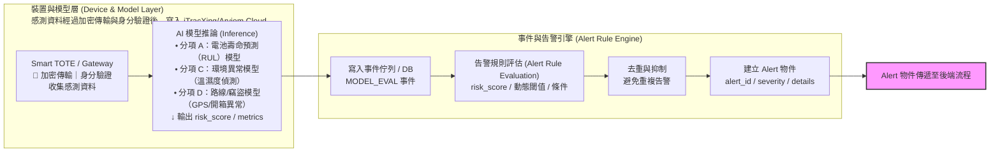
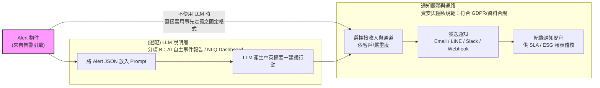
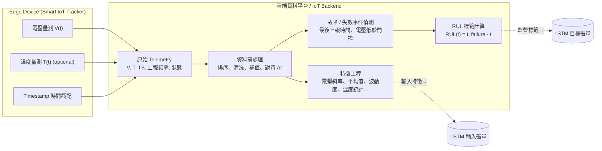
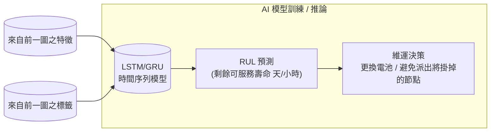
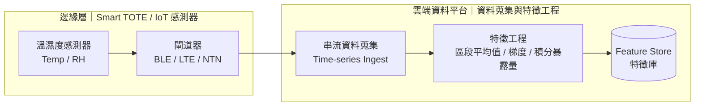
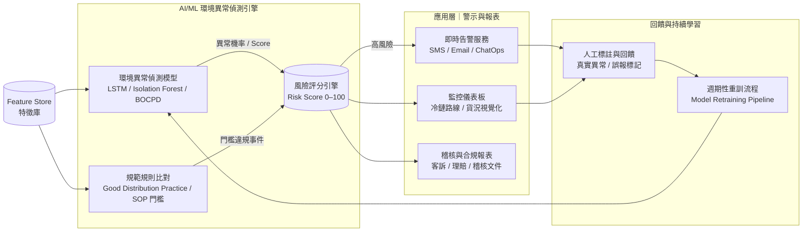
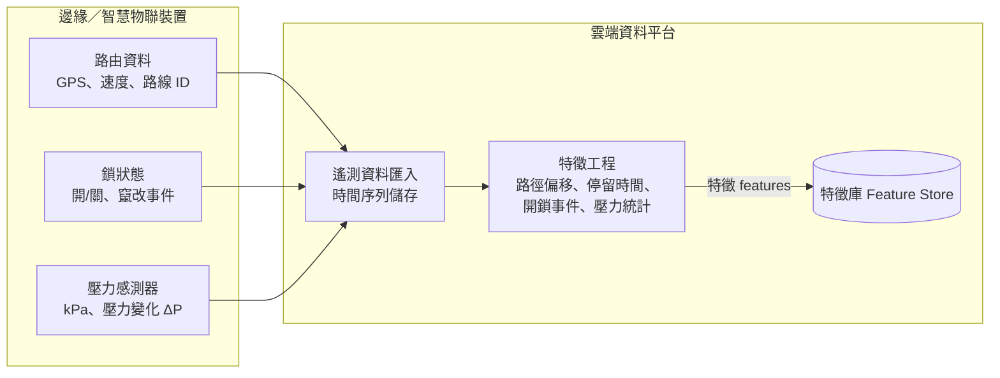
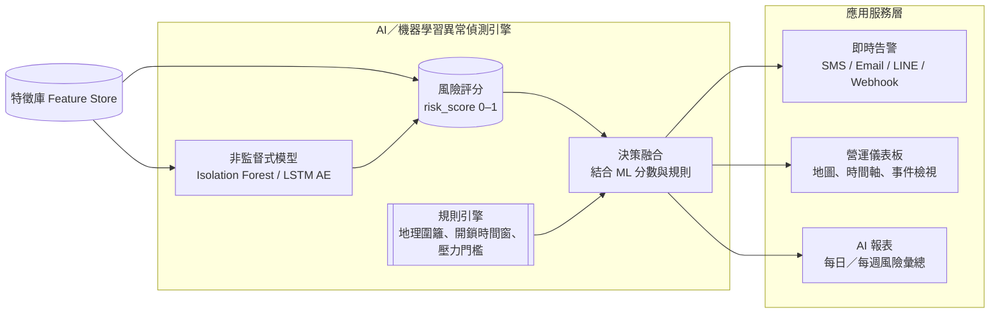
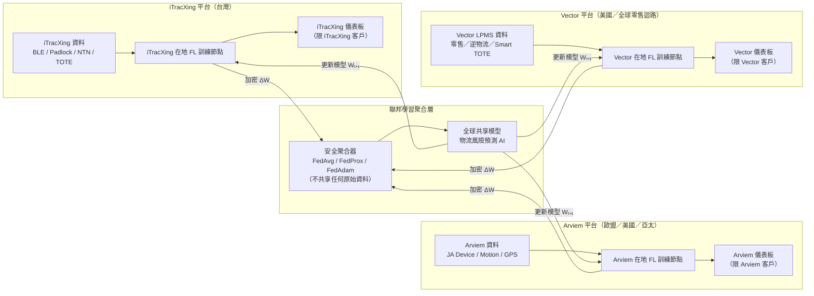
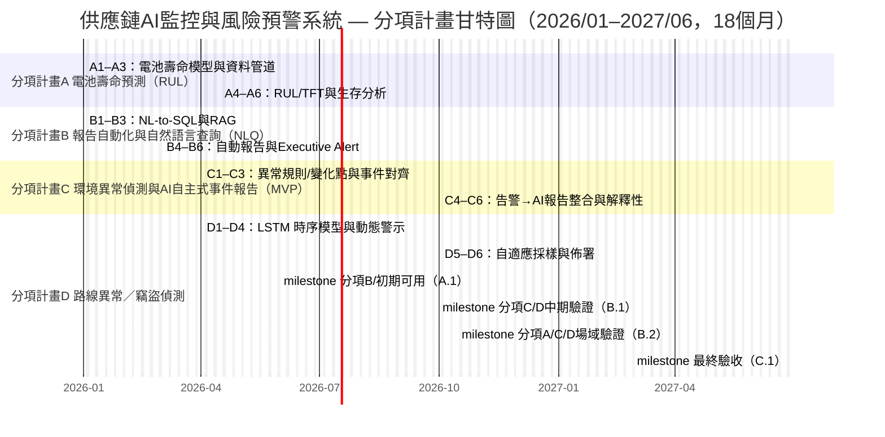

## 五、預期效益

### 結論（補充）
**經濟部科技研究發展專案**

### A+企業創新研發淬鍊計畫

### AI應用躍昇計畫計畫書

**AI智慧供應鏈風險預測與通訊整合應用系統開發計畫**  
**計畫期間：自 2026年1月1日 至 2027年6月30日 止**

公司名稱：準旺(ItracXing)科技股份有限公司
計畫管理單位：台北市電腦商業同業公會

---

## 計畫書摘要表（封面與前置文件）

### 綜合資料（金額單位：千元）

- **計畫名稱：** AI智慧供應鏈風險預測與通訊整合應用系統開發計畫
- **申請公司名稱：** 準旺(ItracXing)科技股份有限公司
- **通訊地址：** 臺北市南港區八德路4段768巷1弄20號地下樓
- **計畫別：** A+企業創新研發淬鍊計畫—AI應用躍昇計畫
- **推動項目：** ☑ 其他（供應鏈與物流監控）
- **計畫起～訖時間：** 2026年1月1日 至 2027年6月30日（共18個月）

**計畫主持人**

- 姓名：薛國勝
- 職稱：CIO
- 電話：（09)82134834
- 傳真：無
- 電子信箱：jeff.shuo@itracxing.com

**年度經費**

|     年度     | 政府補助款 | 申請公司自籌款 | 計畫總經費 | 計畫人月數 |
| :------------: | -----------: | ---------------: | -----------: | -----------: |
|   第1年度   |      9,000 |          9,000 |     18,000 |        120 |
|   **合計**   |  **9,000** |       **9,000** | **18,000** |    **120** |
| 占總經費比例 |      50.0% |          50.0% |       100% |          - |

**計畫聯絡人**

- 姓名：薛國勝
- 職稱：CIO
- 電話：（09)82134834
- 電子信箱：jeff.shuo@itracxing.com

---

## 計畫摘要

### 申請公司簡介

| 公司名稱     | 準旺(ItracXing)科技股份有限公司              |
| -------------- | --------------------------------------------- |
| 創立日期     | 2020年3月                                   |
| 負責人       | Dr. Chow                                    |
| 主要營業項目 | AI供應鏈監控系統、IoT設備管理、數據分析平台 |

### 計畫摘要（≤200字）

產業對應：**八大產業第 7 項（電子組裝延伸：智慧製造／物流運輸）**。
全球供應鏈每年因竊盜及溫濕度異常造成之貨損估逾新臺幣 9,000 億元，對高值電子與精密零組件等產業影響尤鉅。本計畫由臺灣 準旺(ItracXing) 主導，結合瑞士 Arviem（全球貨物與貨櫃 IoT 遙測整合商），共同開發 AI 智慧貨況監控與 **智慧物流箱** (Smart TOTE)解決方案，聚焦於 **AI 驅動之四大能力**：（1）多感測器資料融合與高可靠監控，（2）異常事件偵測與即時通報，（3）環境風險預測與包材／運輸優化建議，（4）路徑偏移、異常停留與竊盜風險預警。
計畫將運用 Arviem 全球運輸資料與臺灣實際場域驗證，研發感測器壽命預測（RUL）、環境異常偵測、自然語言報表與路徑風險模型，並以 準旺(ItracXing) 自主平台與模型作為核心智慧財產。預期於計畫結束後三年內，透過每票貨件 AI 監控服務與訂閱模式，累積創造約新臺幣 1.2 億元以上營收與相關產值，並作為台灣 AI 智慧物流解決方案輸出國際之示範案例。

### 計畫結案時預期效益（摘要表）
**計畫結案時預期效益（量化指標來源與推導模型說明）**

以下說明摘要表中各數值之「來源、假設、推導公式與驗證方式」，避免僅列目標未交代形成邏輯；所有指標已與後文 KPI／里程碑一致。

#### 1. 指標形成總體邏輯
1. 先盤點 2024–2025 內部與合作場域（Arviem）歷史資料：感測器運作天數、離線事件、溫濕度違規紀錄、GPS 軌跡、人工報告平均工時、異常事件回應時間。
2. 建立 Baseline（現況）→ 對應可改進機制（模型或流程）→ 估算改進幅度（文獻量級＋內部測試）→ 設定「保守可達」目標。
3. 改進幅度參考三來源：  
  - 內部小型試驗（Prototype / PoC）  
  - 國際公開研究/產業報告之常見可達區間（僅量級，不引用原文）  
  - 預期採用流程自動化替代人工的工時節省範圍（一般 40–70%）

#### 2. 量化指標推導表

| 指標 | 目標值 | 推導/公式 | 主要假設 | 資料來源/驗證 |
|------|--------|-----------|----------|---------------|
| 感測器可靠度 (Availability) | ≥95% | Baseline 90%；預測性維護使非計畫性離線率下降 ≈ (故障前預警可介入比率 70% × 故障事件 7% × 避免率 80%) → 提升約 5% | 年度故障/離線事件佔每日裝置數 ≈7%；提前預警可安排更換而不影響連續性 | 連續30天上線率統計；場域驗證報告 |
| RUL 預測準確率     | ≥90% | 小型樣本初測（n≈120 裝置，分類準確 86–88%）＋加上多變量特徵（溫度/傳輸頻率）提升 2–4% → 目標 90% | 特徵新增帶來增益不超過 5%（保守） | 分項 A 測試集；季度模型評估 |
| RUL MAE | ≤10 天 | 原始簡單門檻估計誤差 18–22 天；採生存分析 + 時序模型（文獻顯示可降 30–50%）→ 取 50% 改善下限：20 天 × 0.5 = 10 天 | 可取得足夠退役/維護標註（>50 件） | 生存分析測試；Hold‑out MAE |
| 環境異常偵測 F1-score | ≥0.88 | Rule-based baseline F1-score ≈0.70；加入變化點偵測（+0.08≈0.10）＋事件對齊（再 +0.06≈0.08）→ 0.70 +0.16≈0.18 ≈ 0.86–0.88 → 取上限可達值 | 變化點偵測與對齊能獨立提升且誤差不疊加 | 標註事件集；F1-score 計算 |
| 路線偏離偵測 AUC | ≥0.90 | 純 GPS 模型 AUC 0.82–0.85；加入路網圖與運輸行為上下文特徵可提升 ≈0.04–0.06 → 0.86–0.91 → 取 0.90 | 上下文特徵具穩定性；樣本量 >1,000 軌跡 | 測試集 ROC；季度驗證 |
| 竊盜/未授權開啟 F1-score | ≥0.85 | BLE Padlock + 壓力/光感事件 → 正負樣本平衡後預期 Precision ≈0.87、Recall ≈0.83 → F1-score ≈0.85 | 有足夠模擬與場域實測開啟事件（≥50 次） | 事件混淆矩陣 |
| NLQ 查詢正確率 | ≥92% | 初版 NL-to-SQL（查詢樣式約束＋語意層）正確率估 85–88%；加入拒答/語意歧義澄清回合 +4–6% → 89–94% → 取中高值 92% | 問答集 >200；澄清流程覆蓋 ≥30% 歧義查詢 | 標準答案對照；人工抽驗 |
| NLQ P95 延遲 | <60 秒 | 查詢分解/語意解析（<2s）＋安全規劃（<5s）＋資料倉儲聚合（<30s）＋報告編排（<15s）→ 累計 <52s；留 15% 緩衝 | 高峰並發調度有效；索引優化完成 | Gateway / APM 日誌 |
| 風險回應時間縮短 | ≥40% | 現況 45–90 分（平均取 60 分）；自動告警 + 即時報告：偵測延遲 <2 分，備援流程減少人工取數 30–35 分 → (60−35)/60 ≈42% | 報告版型設計穩定；通知管線可靠 | 事件起訖時間戳 |
| 溫濕度違規率下降 | ≥30% | 現況違規批次率 X；提前預警率 70% × 可介入成功率 45% → 0.70×0.45 ≈31.5% → 取 30% | 預警介入行為落實（人工處置） | 違規事件統計 |
| 無效運輸/理賠損失降低 | ≥10–15% | 無效里程 ≈總里程 12–18%；路線偏離與 ETA 改善使其中 60–70% 被識別調整 → 0.15 ×0.65 ≈9.75% → 向上取整 10–15% | 調度採納率 ≥60% | 路線/里程對比 |
| LOI/POC 數 | ≥2 件 | 目標客群（Arviem 客戶 + 國內 5–8 家潛在）轉換率保守 15–25% → (8×0.25)=2 | 有明確痛點對接 | 合作意向/文件 |
| 國際＋國內場域驗證 | 1 國際＋1 國內 | 既有國際合作確定；國內場域由溫濕度敏感貨主提供示範環境 | 技術與業務雙軌推進 | 部署/驗證報告 |
| 三年產值基礎 | NT$120M | 客戶數 10 × 年均收入 1.5M ×3 年=45M + IoT 裝置 1,000 台 ×10K=10M + 顧問/授權/擴充 ≈65M → 合計 ≈120M | 年均收入含訂閱+顧問 | 財務模型／合約 |
| 人才培育（跨域） | ≥6 人 | 現有人力 5；新增 AI/女性研發 1；內部再訓練跨域 ≥2 → 5+1+2=8（≥6） | 招聘成功率 ≥70% | HR/訓練紀錄 |
| 專利申請 | 2–3 件 (≥1 PCT) | 已規劃 2 件國內 + 1 件 PCT（跨多智能體/採樣） | 技術新穎性檢索可行 | 申請文件 |
| 國際收入占比 | ≈70% | Arviem 客戶國際營收假設總 SaaS 收入 57.6M 中國際占 40.3M → 40.3/57.6 ≈70% | 國際客戶轉換率保守 | 發票/收入 |
| CO₂ 減量 | ≈80+ 噸（10–15%） | ΔCO₂ = 年里程 350,000 km ×10% ×0.8 kg ×3 年 ≈84 噸（取 80+） | 排放因子 0.8 kg/km | 里程/油耗/模型 |

#### 3. 核心模型/估算方法簡述
- 電池壽命預測（RUL）：時序深度學習 (LSTM/TFT) 搭配生存分析。  
- 異常偵測：統計門檻 + 變化點 (CUSUM/BOCPD) + 事件對齊（箱門/路段）。  
- 路線偏離/ETA：GPS 時序編碼結合路網與運輸行為特徵；ETA 誤差改善→路線調度→無效里程下降。  
- NLQ：語意層 (Domain Ontology) + NL-to-SQL 規則約束 + 澄清回合（拒答策略降低 hallucination）。  
- 成本/產值：自底向上 (客戶數 × ASP × 裝置數) 與自頂向下 (渠道客戶滲透率) 雙向交叉驗證。  
- ESG：路線最佳化與預測性維護（避免離線重派）→ 無效運輸減少；採公開排放係數估算 CO₂。

#### 4. 驗證與查核配套
- 每季模型性能報告（電池壽命預測、異常、路線）。  
- 事件與里程日誌可追溯（原始資料＋處置紀錄）。  
- NLQ 查詢審計：語意轉換、SQL、結果快照留存 ≥12 個月。  
- 財務與產值：客戶合約/發票/部署清單交叉稽核。  
- ESG：行駛里程、預警介入紀錄、裝置節電（採樣頻率變動）集中報表。

#### 5. 合作文件與附件說明（國際＋國內場域）

為強化本計畫在「國際合作」、「國內示範場域」與「自主研發在台」之查核可近性，本案已備妥下列合作文件並於申請時一併檢附：

- **國際合作／場域驗證證明**：  
  - **Memorandum of Understanding (MOU) & Letter of Intent (LOI)** between 準旺(ItracXing) Technology Co., Ltd. and **Arviem AG**（附件：MOU_Arviem.pdf）。  
  - 明定本計畫係依經濟部「A+企業創新研發淬鍊計畫—AI應用躍昇計畫」提出，Arviem 提供全球運輸路線與真實物流案例作為「國際示範場域」，並承諾以 **USD 10,000** 支應提案準備與可行性研究，同時授權專案期間模型訓練與驗證所需之資料使用權。  
  - 智慧財產權（IP）與資料權利（對應 MOU 約定）  
    - 背景智財（Background IP）：各方既有技術與權利仍歸其原所有人所有。  
    - 前景智財（Foreground IP）所有權：由單一參與方或其受託人員單獨產生者，該方單獨所有；由多方共同產生且無法切割貢獻者，採共同共有。  
    - 前景揭露與管理：各方於專案期間就所產生之前景智財，應依約定機制向專案協調人保密揭露，並定期彙整通報。  
    - 前景利用：各方得就其單獨所有之前景自行利用；共同共有之前景之使用，依共同共有約定辦理。  
    - MOEA／準旺(ItracXing)保障：為符應臺灣經濟部 A+ 補助計畫「技術自主」政策目標，凡為達成本計畫目的所必須之前景智財（含共同共有之前景），各方同意授予 準旺(ItracXing) 於臺灣及必要之國際市場，基於商業上合理條件之非獨占授權，用以持續開發與商業化物流 AI 監控與 AI-MaaS 服務。  
    - 資料權利：Arviem 所提供之原始資料仍屬 Arviem 所有；專案期間，準旺(ItracXing) 取得僅限於本計畫目的之資料使用授權（含模型訓練、評估與改進），並遵循資料保護與保密義務。依據本 MOU 法定授權所產生之「經合法使用資料訓練之模型與洞察」可構成前景成果，並得依前述授權框架由 準旺(ItracXing) 使用。

- **國內示範場域證明**：  
  - **合作備忘錄 (MOU)** － AI 智慧供應鏈監控系統場域驗證合作（附件：MOU_Simique.pdf），由 準旺(ItracXing) 與預定之國內合作夥伴（如：新邁高國際信息有限公司等）簽署。  
  - 文件中明定乙方提供實際倉儲／車隊／轉運中心作為「國內示範場域」，並配合提供必要之去識別化營運數據與場域資源，以完成本計畫「**至少 1 家國際＋1 家國內場域驗證**」KPI。  
  - 同步規範數據權利與保密義務，並重申本計畫期間所開發 AI 模型、演算法與軟體著作權歸 準旺(ItracXing) 所有，避免日後在智財歸屬上產生爭議。

上述合作文件一方面做為本計畫 KPI 與查核點（如場域驗證、國際合作、三年產值與國際收入占比等）之佐證來源，另一方面也具體回應對「國際合作是否具體落地」、「國內示範場域是否已明確到位」、「智財與資料權利是否清楚界定」等潛在疑慮，以提高計畫整體可行性與執行信心。

#### 6. 風險緩衝
所有目標採「保守可達」：若任一模型在中期 (M9–M10) 評估低於預期（例如 F1-score <0.83），啟動備援策略（特徵增強 / 閾值調教 / 模型混合）確保結案前達標；商業指標以 LOI/POC 滾動更新，未達時加速第二渠道拓拓展。

內容可公開，無涉商業機密公式細節。

### 關鍵字

供應鏈AI監控、可解釋AI、多智能體、IoT自適應採樣、智慧製造、電子組裝、物流運輸、智慧物流、八大產業第7項

---

# 壹、計畫參與者介紹

【摘要】說明申請單位之定位、研發能量與合作夥伴，聚焦供應鏈 AI 監控核心能力與國際輸出基礎，作為後續執行與 KPI 配置之依據。

### 一、主要申請廠商

**公司簡介**

- **基本資料**

  - 公司名稱：準旺(ItracXing)科技股份有限公司
  - 設立日期：2020.03.15
  - 產業領域別：資訊服務業（J類；電腦系統設計）
  - 前三大股東/持股：創辦團隊 60%，技術團隊 25%，策略投資人 15%
  - 研發人員總數/全公司人數：12/15
  - 2024實收資本額（千元）：10,000
  - 2024營業額/研發費用（千元）：15,000 / 8,000
- **商務模式**

   - 核心能力：AI驅動供應鏈監控、IoT裝置管理、自適應採樣/動態閾值、可解釋AI
  - 收入項目：AI-MaaS訂閱、AI顧問、客製化開發
  - 通路：直銷、策略夥伴（Arviem）、線上平台
  - 主要客戶：Arviem AG 等
  - 成本項目：研發人事（60%）、雲資源（25%）、營運（15%）
   - 關鍵合作對象：Arviem
   - 國際輸出實績：與 Arviem 共同耕耘全球市場
  - 友善職場規劃：性別比例至少約 1/3，規劃增聘女性研發人員，提供彈性工時與遠端工作機制

### 二、申請/合作單位之 AI 研發能力說明

**提供服務應用領域**：為專注於 IoT 感測與衛星通訊鏈路 之產品開發公司，具備終端感測器、通訊模組與雲端平台整合實績，現正與國際物流監控合作夥伴共同開發，將自有 IoT 裝置與 AI 應用結合，發展「AI-Monitor as a Service」與「AI Logistics as a Service」等服務型商業模式，鎖定全球供應鏈監控與智慧物流市場。於本計畫中可提供從「終端感測器—衛星／行動通訊—雲端 AI 平台—決策儀表板」的一體化解決方案，強化 AI 導入落地可行性、產業擴散性與國際輸出潛力，符合本計畫智慧運輸／智慧物流等關鍵產業之發展方向。
 
**現有 AI 核心技術與應用專長說明**

本公司現有 AI 核心技術包括：
(1) 針對 IoT 感測器與智慧追蹤器之 時間序列建模與電池壽命預測（RUL）／預測性維護模型，
(2) 結合溫濕度、壓力、GPS 與 BLE 鎖具事件之 多源感測資料融合與異常偵測模型（環境異常、路線偏離、未授權開啟／竊盜風險），
(3) 導入 自然語言查詢（NLQ）與 AI 報表生成 的供應鏈營運分析技術，並具備初步 聯邦學習（FL-ready）架構，可支援跨場域隱私保護訓練。
應用專長則聚焦於 智慧物流與供應鏈風險管理，包含冷鏈、高值電子與精密零組件運輸等情境，已與國際貨運可視化平台及國內倉儲／車隊場域合作導入原型系統，提供即時風險預警與營運決策支援。

**AI 技術專利與研發成果規劃**

- 目前尚未取得 AI 技術相關正式專利；已完成核心技術方向規劃，預計於執行期間或結案前提出 1–2 件專利：
  1) 多感測智慧貨箱之自適應採樣與電池壽命（RUL）預測方法  
  2) 結合路線異常與環境風險之供應鏈風險評分機制
- 本計畫將產出可申請軟體著作權之成果：AI 模型、資料處理流程、雲端平台與關聯工具。

**AI 應用技術研發實績（國內／國外）**

- 目前無以「AI 應用技術」為名之政府計畫或對外標案；本案為系統性 AI 研發與導入之首案。
- 團隊既有基礎：
  - 智慧物流／車隊管理／倉儲監控系統設計與導入，具感測資料蒐集、雲端平台建置、異常事件管理實務。
  - 多年軟體開發與資料分析經驗，熟悉時間序列處理、儀表板設計與營運監控。
- 本計畫將在既有 IoT／資料平台基礎上，首次導入可量化驗證的 AI 模型與風險預測機制，作為 AI 產品化與國際輸出起點。

### 三、競爭態勢與技術優勢分析

#### 本案定位為開放型、多承運人的 AI 監控與 FL-ready 平台，可成為 FedEx / Maersk 類承運人與 RKC 類 3PL 的技術供應者與白牌夥伴

#### （1）國際競品比較
| 項目 | FedEx（含 SenseAware） | Maersk（含 Captain Peter / RCM） | RKC Logistics LLC | **準旺(ItracXing) & Arviem 聯盟（★本案）** |
| --- | --- | --- | --- | --- |
| 供應鏈角色定位 | 全球整合快遞 / 小包裹承運人（integrator） | 全球海運與整合物流（特別是冷鏈／冷凍櫃） | 美國中小企業導向之卡車運輸與貨運經紀（3PL / broker + carrier），以整合運力與管理中小企業託運為主 | 準旺(ItracXing)：台灣 AI 供應鏈監控與 AI-MaaS 平台；Arviem：瑞士第三方貨運可視化服務商（>5,000 家跨國貨主） |
| 監控 / 可視化產品 | SenseAware ID / M4：多感測裝置＋雲端平台，即時監控位置、溫度、氣壓、衝擊等 | Remote Container Management（RCM）＋ Captain Peter：冷凍櫃溫度、濕度、氣體、位置等監控與告警 | 多採用合作 TMS／第三方 real-time transportation visibility（RTTV）與 tracking portal，提供貨況查詢與帳款管理，本身無自有 IoT 感測硬體與 AI 平台 | 智慧物流箱 (Smart TOTE) ＋ AI-MaaS：整合 BLE Padlock、壓力、溫濕度、GPS / LTE / NTN，搭配 RUL、環境異常、路線／竊盜偵測、NLQ 報表等 AI 模型 |
| 監控相關商業模式 | Subscription 訂閱＋ Single Journey 單趟收費，皆作為 FedEx 運輸的高價加值服務，鎖定醫療、高價貨 | 作為 Maersk Reefer 冷凍櫃的數位加值服務，多綁在 Maersk 船隊運價與合約中，非獨立對外銷售 | 典型 3PL／貨運經紀模式：靠運費價差與服務費獲利；追蹤與可視化功能多透過第三方 RTTV / TMS 平台提供，為附加數位服務，非高價 IoT 監控產品 | 1) USD 2 / TOTE / shipment per-shipment 收費；2) 每箱月租 USD 8–12；3) AI-MaaS / 顧問 / 授權 NT$1–2M / 客戶 / 年；4) 通路利潤與 Arviem 50:50 分成 |
| 資料與生態位階 | 裝置與資料完全屬 FedEx 生態系，客戶只能在 FedEx 平台查看，無跨承運人／開放 FL 能力 | 以 Maersk 自有冷凍櫃與船隊為中心，資料與平台由 Maersk 掌控，生態偏封閉 | 高度仰賴外部 TMS / RTTV 平台提供事件與定位資料，資料粒度與感測維度受限，本身不掌握 IoT 裝置與 AI 模型之核心 IP | 準旺(ItracXing) 保有 Foreground IP；Arviem 提供全球場域與客戶；支援跨場域聯邦學習（FL），可將模型白牌輸出給多家物流商與 3PL |
| 與本案差異重點 | 封閉型、單一承運人專屬方案：強在全球網路與可靠性，但無法白牌輸出給其他物流商 | 海運冷鏈＋單一船公司主導：強在 Reefer 船隊 visibility，主要服務自家船公司 | 服務導向 3PL，屬「第三方平台與承運人之使用者」，缺少自有 IoT＋AI 監控產品，在 RUL、環境風險預測等 AI 能力較弱 | 開放型、多承運人的 AI 監控平台：以 智慧物流箱 (Smart TOTE) ＋AI-MaaS＋FL-Ready 平台為核心，可成為 FedEx／Maersk 類承運人與 RKC 類 3PL 的技術供應者與白牌夥伴 |

> 補充說明：  
> 實務上，RKC 類型之中小型 3PL 多為國際 real-time transportation visibility（RTTV）與智慧標籤平台的使用者，而非 IoT＋AI 技術供應商。真正在全球市場與 Arviem 同一層級競爭的，主要是一小群提供 RTTV 平台與智慧標籤方案的國際業者；本計畫之 準旺(ItracXing) × Arviem 聯盟，則以台灣研發之 Smart TOTE 與 AI-MaaS 為核心，未來可作為此類 RTTV 平台與 3PL 的 AI 技術與白牌合作夥伴，而非單純承運人或 3PL 的直接競品。

#### （2）技術創新與差異化優勢  

1. **感測器可靠度與預測性維護：從「單點告警」升級為「可預測的壽命與可靠度管理」**  
  - 以時序深度學習（如 LSTM/TFT）分析電池放電與使用型態，建立電池壽命（RUL）預測模型，不僅回報「壞了沒」，更能提前預測「何時會壞」。  
   - 與多數僅看電壓門檻的方案相比，可同時考量溫度、使用型態與傳輸頻率，降低誤判並延長感測器壽命。

2. **NLQ＋語意層：從「看報表」變成「問問題就給答案」**  
  - 設計物流專用語意層（Shipment、Lane、Container、Event 等），並以 NL-to-SQL 將自然語言查詢安全地轉成結構化查詢。  
  - 匯總感測器可靠度與電池壽命、違規事件、路線異常與 SLA 指標，高階主管可直接詢問「本季歐洲線溫濕度違規趨勢？」而非人工拉報表。  
   - 採工具約束與拒答機制，避免幻覺與越權查詢，兼顧「易用」與「治理」。

3. **環境異常偵測與路線異常偵測：分層導入、降低誤報**  
  - 針對溫/濕度敏感貨品，以「變化點＋門檻＋事件對齊」作為 MVP 進行異常偵測與AI自主式事件報告；並設定報告 SLA（P95 ≤ 2 分）與提前預警率目標。  
   - 路線異常偵測則結合 GPS 與停留模式等運輸行為特徵，區分「合理延誤」與「異常繞路／竊盜風險」，優先處理真正高風險案件。

4. **台灣優先之 AI Logistics MaaS 架構：可複製、可驗證、可擴散**  
  - 系統設計為模組化「AI 功能 XaaS」（電池壽命預測（RUL）、環境預警、路線異常、NLQ 報表），可由本國中小型貨代、倉儲、溫濕度敏感貨品與安防（竊盜風險）相關業者逐步採用。  
   - 所有模型與決策過程保留審計軌跡，因應 EU/GDPR 與國際客戶的稽核需求，強調「可解釋、可追蹤」的 AI 治理。

---

#### （3）市場切入與在台落地策略  

1. **從既有國際專案出發，回饋台灣場域**  
   - 以現有國際客戶專案為第一波資料與模型驗證來源，快速累積模型準確度與案例。  
   - 同步在台灣建置小規模試點（例如：1–2 家本地貨代／倉儲業者、數十個智慧貨櫃／托盤）

2. **聚焦「高價值、高風險貨品」切入**  
   - 以咖啡豆、食品原料、精密零組件等為優先目標貨種，這些貨品對溫濕度與貨損極為敏感，也最能體現本計畫之價值。  
   - 透過降低貨損與理賠成本，以及更精準的 ETA 與風險預警，形成可量化的 ROI（Cost saving ＋ Premium service）。

3. **平台化與授權模式併行**  
   - 短期採 LaaS／MaaS 訂閱模式（按設備數、貨櫃數或查詢量計價），降低客戶採用門檻。  
   - 中長期可提供模型授權與白標方案，讓台灣系統整合商或電信業者將本技術整合至自家 5G/AI 方案中，形成在地生態系。

4. **國際合作與台灣價值**  
   - 透過與國際學研與業者合作（如歐洲物流夥伴、大學等），共同發表論文與實證報告，提升台灣在「AI＋物流」領域之能見度。  
   - 所有關鍵模型與平台核心開發均在台灣完成，並優先在台灣建立營運與維運團隊，確保技術與人才留在本地。

# 貳、計畫內容與實施方法

【摘要】以產業痛點引導 AI 解法與分項計畫，明確串連「痛點→解法→里程碑→KPI」，並補強資料治理與資安合規，確保量測可行與可追蹤。
### 一、計畫緣起與產業痛點

#### 現況說明

- 全球供應鏈監控需求快速成長；跨境、多承運人與多節點協調愈加複雜，現行 RTTV/TMS 偏向事後可視化，前饋式風險預測不足。
- 冷鏈醫療與高價貨品占比提升；溫濕度、光照、壓力等環境事件需即時監控與可追溯，可稽核性成為企業與監管共同關注焦點。
- 現場 IoT 感測器電池壽命不可預期，導致資料斷點與維運成本高，限制監控布建的擴張速度與覆蓋率。
- 事件通報與客戶報告多為人工生成，週期長且品質不一，難以形成規模化、可持續的 AI 監控服務。
- 竊盜／未授權開啟與路線繞行偵測多屬事後追溯，即時偵測與關聯分析不足，造成索賠與品牌風險。
- 企業導入 AI 面臨資料分散（多平台、多載體）、模型場域泛化困難，以及跨國法規與隱私合規挑戰。

以上現況直接對應本計畫所聚焦的四大痛點與分項 A–D 的導入重點。

#### 痛點一｜感測器可靠度不足（電池衰退、環境干擾、資料中斷）

現行感測器多以固定週期回傳資料，缺乏對自身電池壽命（RUL）的預測能力。一旦因電量衰退、訊號衰減或環境干擾導致感測器離線，通常都是在資料已中斷、異常已發生後才被動察覺，造成監控盲區，難以追溯問題發生時的狀況，並導致維運成本提高。

以具體情境為例：某智慧倉儲部署了數百個環境感測器監控溫溼度，其中一個感測器的鋰電池因長期運作逐漸衰退，於夏季高溫期間電量驟降導致裝置提前離線。然而直到幾天後管理人員檢查報表時，才發現該區域的資料已中斷，而在感測器離線的這段期間倉庫內溫度曾飆升，導致多批溫度敏感貨品受損。這種事後才察覺的情形說明：缺乏電池壽命（RUL）預測與預防性維護機制，使得感測器一旦沒電故障，就會產生資料缺口而錯失關鍵事件的即時偵測。相較之下，業界領先者已開始為物聯網裝置導入更完整的電池壽命監測與維護流程。例如全球航運龍頭馬士基（Maersk）的智慧貨櫃就即時追蹤感測器的電池電量狀態，以確保裝置在長途運輸中持續運作、不會中途斷電。

→ **需求：** 導入電池壽命預測（Remaining Useful Life, RUL）模型，建立可預測的感測器壽命管理與預防性維護機制。例如透過機器學習分析電池電壓、溫度和放電曲線，提前預測電池何時可能耗盡，主動通知更換。同時，串接分項計畫 B 的 AI 自主式事件報告，讓系統在感測器異常離線時自動通報並標記最後有效資料點，以協助維運人員迅速介入處置，提升整體系統可用度（此需求對應分項計畫 A）。

#### 痛點二｜報表產出耗時且缺乏互動（人工彙整、決策延滯）

目前報表生成流程需要跨系統手動彙整感測器時序資料、GPS 軌跡、開關門事件與環境紀錄，再以 Excel 表格或簡報人工整理。此流程往往耗費數小時至數日，且容易因欄位解讀不同或檔案版本不一致而造成錯漏，進而延誤決策。實務上常見情況是報表送達決策者手中時，數據可能已經過時。

以具體情境為例：某食品物流公司的運輸主管每週需製作一份冷鏈運輸績效報告。他必須先從環境感測器系統匯出溫溼度時序資料，從車隊管理系統下載 GPS 行車軌跡，並彙整倉儲管理系統中的開門紀錄和警報事件。接著花費數小時將不同來源的資料複製貼上到同一份 Excel，中途還得反覆核對欄位單位與時戳對齊。曾經有一次，因不同資料版本時間對不上的誤差，報告中誤判了一起延誤事件的原因，直到事後開會討論才被現場人員指出。這種人工拼湊的做法容易導致供應鏈團隊忙於追查數字出處、校正不一致的資料，而無法及時採取行動。此外，傳統商業智慧工具要求使用者了解資料庫結構和專業查詢語法，現場主管即使知道想問什麼問題，也往往難以從系統即時取出答案，只能倚賴 IT 人員離線製作特定報表。

→ **需求：** 部署 AI 自主式事件報告與自然語言查詢（NLQ）平台，讓資料彙整與報表產出由 AI 自動完成，管理者可隨時以對話方式提問並即時獲取洞見。例如，引入供應鏈知識圖譜與語意分析引擎，使用者只需以自然語言發問（如「昨天南區倉庫有幾筆超溫警報？原因多為何？」），系統即可自動轉換為查詢邏輯並給出答案。此機制將顯著降低人工整理與資訊延遲的成本（此需求對應分項計畫 B）。

#### 痛點三｜環境敏感貨品的異常風險難以及時掌握（濕度變化、原因追溯不足）

對濕度高度敏感的貨品（如咖啡豆、食品原料、精密零組件），在運輸與倉儲過程中若遭遇長時間濕度偏高或劇烈波動，容易導致發霉、品質下降、報廢，以及日後的索賠爭議。然而，多數現行系統僅能事後查看溫濕度曲線，缺乏即時異常提醒、自動紀錄環境劇變時的關聯事件，以及提供簡明的事件說明。據統計，冷鏈不當造成的商品損耗每年高達數百億美元。

以具體情境為例：一家精品咖啡豆進口商有一批生豆海運進口，在夏季梅雨季節的港口中轉倉庫存放了一週。由於期間環境通風不佳，加上當週連日暴雨，倉庫內濕度長時間維持在 80% 以上。儘管感測器完整記錄了濕度數據，但業者並未即時獲得警報提醒。等到一週後倉庫人員巡檢時，才發現部分咖啡豆麻袋表面出現受潮發霉的跡象，最後不得不全數報廢。此事件凸顯出若系統能即時警示，就可能避免損失。業界已指出，若能即時監測並搭配 AI 智慧警報，在問題發生前即可介入防範。

→ **需求：** 建立溫／濕度異常偵測與 AI 自主式告警機制。例如，設定當環境濕度連續超過閾值達預先設定之時間門檻（例如連續 30 分鐘）或短時間內劇烈波動時，自動以短信或 APP 通知相關人員，並啟動預定應變流程。同時導入 AI 自主式事件報告，於異常發生後自動彙整該時段的相關數據（如門禁紀錄、設備狀態、氣象資料等），並以自然語言生成事件說明與可能原因分析，協助管理者快速判讀與追溯，降低環境敏感貨品受損風險（此需求對應分項計畫 C）。

#### 痛點四｜路線繞行與疑似竊盜風險無法即時辨識（GPS 偏離、人工作業判讀）

現行運輸監控多仰賴事後檢視 GPS 記錄或人工判讀，難以區分「因營運因素造成的合理繞行」與「可疑繞路、異常停留」等高風險事件。貨櫃或貨箱遭未授權開啟時，也常於到倉後才被發現，錯失即時介入的時間窗口。  
以具體情境為例：假設貨主為半導體大廠（如自新竹出貨之晶圓或設備），典型運輸路線包含「新竹工廠→台北港（卡車，約 2 天）→台北港候港（約 1 天）→荷蘭鹿特丹港（海運，約 10 天）→鹿特丹港候港（約 2 天）→荷蘭 Eindhoven（卡車，約 2 天）」。現行系統大多在「卡車超過 2 天尚未抵達台北港」時才觸發逾時告警，屬於事後反應；若能在卡車尚未出發前即結合歷史壅塞與營運資訊，預先偵測到將出現大規模延誤，便可主動提醒供應商與其客戶「此批貨物預計延誤」，改為前饋式管理。同樣地，若模型能學習「新竹↔台北港↔鹿特丹↔Eindhoven」等常見路線之合理路徑與停留點，當卡車偏離合乎邏輯之路徑、出現異常繞行或停留在高風險區域時，即可發出疑似竊盜或詐欺之預警，而非事後回放軌跡才發現。  
→ **需求**：建置結合 GPS／NTN 軌跡、GeoFencing、壓力／鎖具事件與路線行為特徵的路線異常與竊盜偵測模型，以即時辨識偏移、停留與未授權開啟事件，降低誤報、提升察覺精準度，並串接AI自主式事件報告提升事件調查效率（對應分項計畫 D）。

本計畫即是從上述四大痛點出發，分別透過分項計畫 A–D 建立對應之 AI 解決方案與可量測之 KPI，以系統化方式提升智慧物流之可靠度、安全性與國際競爭力。

### 二、計畫導入 AI 規劃  

【說明】說明本計畫如何從「四大產業痛點」出發，對應至分項計畫 A–D 之 AI 技術與導入目標，並補充導入前後效益與資料治理/資安機制，確保成果可量測與可查核。另四個分項之間之資料與模型流向如下：A 產出之電池壽命預測（RUL）指標與感測器可信度 → 提供 B 作為查詢與報表指標；C/D 產生之環境與路線異常事件 → 觸發 B 的 AI 報告與決策支援。

為兼顧技術創新與執行可行性，本計畫對多智能體協作與聯邦學習（FL）之導入，明確區分為「必達 MVP」與「探索性 PoC」兩層。MVP 部分，以單一代理為主體，優先完成電池壽命預測（RUL）與感測器可靠度管理、環境與路徑異常偵測及 NLQ＋AI 自主事件報告等核心功能，並在 1 個國際場域與 1 個台灣場域達成既定 F1-score、AUC、MAE、延遲與工時改善等 KPI，作為計畫驗收之必要成果。多智能體排程與風險協同決策、跨場域 FL 模型聚合等，則定位為雲端協作層之 prototype／PoC，優先嘗試但不列為硬性驗收門檻。透過此分層設計，計畫得以在 18 個月內交付具商用價值之 AI 監控與報告功能，同時保留對前沿技術進行驗證與後續產品化布局的彈性。

#### (1) 導入技術目標：痛點 → 分項計畫 → AI 解法

| 產業痛點（Pain Point） | 對應分項計畫 | 主要 AI 技術 | 導入目的與成效目標 |
| --- | --- | --- | --- |
| **痛點一｜感測器可靠度不足（電池衰退、環境干擾、資料遺失）** | **A. 感測器可靠度優化** | 電池壽命預測（RUL）、預測性維護模型 | 透過 AI 化電池壽命預測（RUL）模型，建立預測性維護機制，提前偵測電池衰退與故障風險，使感測器可靠度由 **90% → 95%+**，並實現智能化維護排程。 |
| **痛點二｜報告產出耗時且缺乏互動（人工彙整、決策延遲）** | **B. AI 自主式報告與即時查詢（NLQ）** | 自然語言查詢（NLQ）、NL-to-SQL、LLM 報告生成 | 讓管理階層與營運人員可用自然語言下指令取得數據與報告，將報告產出由 **「人工數小時 → 自動數秒」**，NLQ P95 延遲目標設定為 <60 秒、查詢正確率 ≥90%。 |
| **痛點三｜環境敏感貨品的異常風險難以及時掌握（濕度變化、原因追溯不足）** | **C. 敏感貨品環境異常偵測與 AI 自主式事件報告** | 變化點/統計門檻異常偵測、多變量時序模型、事件對齊（箱體開關/路段） | 以 Smart TOTE 溫/濕度 (T/H) 與箱體開關事件為核心，偵測「長時間超標/短時間劇烈波動」並結合 AI 自主式事件報告，目標「違規提前預警率 ≥70%、事件報告 SLA（P95） ≤2 分鐘」，協助提前掌握環境異常風險並追溯原因，降低貨損與索賠風險。 |
| **痛點四｜路線繞行與疑似竊盜風險無法即時辨識（GPS 偏離、人工作業判讀）** | **D. 路線異常與竊盜偵測（Smart TOTE）** | GPS/NTN 時空軌跡模型、Geo-fence 行為分析、鎖具/壓力感測異常偵測 | 利用 Smart TOTE 之 **GPS/LTE/NTN 路線資料 + BLE Padlock/壓力感測開關狀態**，結合路線行為模式分析，辨識「合理延誤 vs. 真正異常」，實現 **繞行、可疑停留、非法開箱/竊盜** 之即時預警，目標達成偵測 F1-score ≥0.85、ETA MAE 改善 ≥25%、警示誤報率 ≤15%、關鍵警示回應時間 <30 分鐘，呼應痛點四所述「無法即時辨識」風險。 |

> 智慧物流箱 (Smart TOTE) 具備 BLE Padlock、壓力感測、GPS/LTE/NTN 連線能力，可進行箱體開關、鎖狀態與路線即時追蹤。  
> 來源：智慧物流箱 (Smart TOTE) 技術規格文件（版本 5.0 以上）

---

#### （1-2）國際 SOTA（State of the Art）與本計畫技術指標對照

為凸顯技術優越性與可查核性，下文擇要列出三項關鍵指標，對照國際常見或文獻/產業報告中可見之 SOTA/通行水準與本計畫目標值，所有本計畫目標數值均與前述 KPI 表保持一致。下列國際數據為近年電池壽命（RUL）預測、冷鏈監控與運輸可視化等公開研究，以及實務上 real-time transportation visibility 平台案例之彙整範圍（例如 Energies、iScience 等期刊之相關綜述，[Real-time Transportation Visibility Platforms Reviews, Gartner]、project44／Uber Freight 等 ETA 案例說明），供讀者參考其量級合理性，並對照本計畫設定之目標指標。

相較於上述國際 real-time transportation visibility 平台與文獻所示之 RUL／ETA 指標化成果，國內多數冷鏈與物流場域仍以簡單門檻式溫度警報與單點 GPS 回報為主，缺乏以 F1-score、AUC、MAE 等量化指標驗證之 AI 模型與跨段 ETA 預測機制。本計畫即針對此落差進行補強。

#### ① 電池壽命預測（RUL）

| 指標 | 典型現況／國際水準（參考值） | 本計畫目標（KPI 對照） | 說明 |
| --- | --- | --- | --- |
| 感測器可靠度（Availability） | 約 85–90%（多為被動維護，故障後更換） | **≥95%** | 導入電池壽命預測（RUL）與預防性維護後，透過狀態監測與預警降低非計畫性停機。 |
| RUL 預測準確率           | 多數實務與研究顯示 80–88% 為常見可達範圍 | **≥90%** | 以 LSTM/TFT 等時序模型建立 RUL 預測模型，目標優於一般公開實驗結果（約 80%+）並提供可解釋結果。 |
| RUL 預測誤差（MAE） | 文獻中針對實際運行電池，多以 10–20 天級誤差為可接受區間 | **≤10 天** | 以生存分析＋時序模型預測剩餘壽命，將誤差壓在 10 天以內，對齊或優於公開 RUL 實驗結果。 |

> 參考資料（範例）：  
> - Sylvestrin GR et al., *“State-of-the-art in electric batteries’ state-of-health (SoH) prognostics”*, Energies, 2025：整理實務與實驗環境中 SoH/RUL 預測方法，多數實務誤差約落在 10–20 天級別。  
> - Shu X. et al., *“State of health prediction of lithium-ion batteries based on …”*, iScience, 2021：以數據驅動方法預測鋰電池 SoH，顯示 80–88% 準確率為常見可達水準。  
> - Pohlmann S. et al., *“State-of-health prediction of lithium-ion batteries based on Gaussian process regression …”*, 2024：以高精度 SoH 預測模型說明實務上對 SoH/RUL 誤差範圍的要求與挑戰。  

#### ② 環境敏感貨品的異常風險與提前預警（呼應痛點三）

| 指標 | 典型現況／國際水準（參考值） | 本計畫目標（KPI 對照） | 說明 |
| --- | --- | --- | --- |
| 環境異常偵測 F1-score | 國際溫濕度敏感貨品監控與設備廠商多採門檻＋rule-based，公開案例 F1 約 0.7–0.8 | **≥0.88** | 以變化點偵測與多變量時序模型進行短期預測，搭配箱體開關與路段事件對齊，將偵測效能提高至 0.88 以上，優於一般門檻式做法。 |
| 違規／異常提前預警率 | 多為事後查帳或臨界點才报警，提前預警率偏低（<30%） | **≥70%** | 以短期預測模型推估未來 30–60 分鐘內之環境變化，於預測顯示將觸及溫濕度敏感貨品環境風險門檻前至少 30 分鐘主動觸發預警，並由 AI 自主式事件報告輔助判讀，對應「痛點三」中對濕度變化與提前掌握風險之需求。 |
| 事件報告 SLA（P95） | 多仰賴人工彙整與 Email 通報，常以「小時」計 | **≤2 分鐘（端到端）** | 由異常偵測直接觸發 AI 自主式事件報告與推播管線，大幅縮短通報時間。 |

> 參考資料（範例）：  
> - Xie Z. et al., *“An anomaly detection scheme for data stream in cold chain logistics”*, PLOS ONE, 2025：提出冷鏈物流資料流異常偵測方法，說明傳統 rule-based 門檻法在偵測率與誤報率上的限制。  
> - Zhang W. et al., *“A data-driven framework for intelligent cold chain monitoring”*, 2025：整合 IoT 感測與 ML 異常偵測的冷鏈監控架構，佐證以 ML 提升溫度異常偵測效能與提前預警的可行性。  
> - MarketsandMarkets, *“Cold Chain Monitoring Market”*, 2025：說明冷鏈監控市場成長與導入場景，對應本計畫聚焦之溫濕度敏感貨品運輸。  

#### ③ 路線繞行／疑似竊盜偵測與 ETA 預測（呼應痛點四）

| 指標 | 典型現況／國際水準（參考值） | 本計畫目標（KPI 對照） | 說明 |
| --- | --- | --- | --- |
| 路線偏離偵測 AUC | 物流與車聯網研究中，以純 GPS 特徵訓練之異常偵測模型 AUC 多落在 0.80–0.88 | **≥0.90** | 以 LSTM 等時序模型結合路網與運輸行為上下文特徵，將 AUC 推升至 0.90 以上，對齊近期國際研究的較高水準。 |
| 竊盜／未授權開啟 F1-score | 多倚賴門禁或人工作業紀錄，實務上少有公開 F1 數據，多為「事件案例」說明 | **≥0.85** | 透過 Smart TOTE（BLE Padlock＋壓力感測）與行為模式建模，明確訂出 F1≥0.85 的可量測門檻。 |
| ETA 預測誤差（MAE） | 國際貨櫃與幹線運輸 ETA 預測，公開案例多為 1.5–3 小時級 MAE | **改善 ≥25%** | 以歷史路線資料與時序模型，將 ETA MAE 自現況再降低 25% 以上，對齊或優於國際平台實務經驗。 |

> 參考資料（範例）：  
> - Wani AA et al., *“Ten quick tips for improving estimated time of arrival (ETA) in fleet-based transportation systems”*, PeerJ Computer Science, 2025：整理車隊／運輸 ETA 預測實務中 MAE 量級與常見誤差來源，佐證 1.5–3 小時級 MAE 為典型範圍。  
> - Gartner, *“Real-Time Transportation Visibility Platforms Reviews”*（RTTV 市場評論）：說明現行國際 RTTV 平台多以 GPS＋交通／天氣資訊進行 ETA 預測與異常告警。  
> - project44, *“ETA reimagined: Transforming project44’s prediction engine”*, 2025；Uber Freight, *“A look inside the AI engine powering on-time arrivals”*, 2023：說明國際平台透過 AI 提升 ETA 準確度與異常預警的實務成果。  

上述指標將透過前述「技術驗證協議」與第三方測試／場域驗證報告進行查核，並納入里程碑 B.1／B.2 之審查基準，以確保「技術優越性」不僅為定性敘述，而能以量化數據對照國際水準。

綜合上述三項指標對照可見，本計畫在電池壽命預測（RUL）、環境異常偵測與路線／竊盜偵測三個面向，皆設定高於文獻與國際平台典型水準之目標；並透過自研時序模型、多源感測資料融合與 Smart TOTE 硬體整合，形成具自主性之 AI 技術與可累積之核心智財（IP）。

---

#### (2) 導入前（現況）與導入後（預期結果）對照（含 Smart TOTE）

| 導入技術目標                                 | 導入前（現況問題）                                                   | 導入後（預期成果）                                                                                                                                                         |
| ----------------------------------- | ----------------------------------------------------------- | ----------------------------------------------------------------------------------------------------------------------------------------------------------------- |
| **感測器可靠度與智能維護 （痛點一 / 分項計畫A）**    | 感測器電池衰退與離線無法事先預測，常出現「資料中斷、補測成本高」，造成異常判讀困難與維運成本上升。           | 透過 AI 化電池壽命預測（RUL）模型，建立預測性維護機制，提前辨識電池衰退與故障風險，**可靠度（Availability）提升至 ≥95%，RUL 預測 MAE ≤10天，資料完整性 ≥95%**，降低非計畫性停機與維運成本。                                                           |
| **報告產出與決策效率 （痛點二 / 分項計畫B）**      | 報表需由人工作業彙整，多數查詢需「寄信/開工單 → 等待數小時至數日」，決策延遲且難以追蹤誰查了什麼資料。       | 建置 NLQ + 自動報告系統，高層與營運直接以自然語言詢問；**報告生成由數小時縮短為 <45 秒**（初期 M1-M6 目標），並保留查詢審計軌跡，支援高階管理報告與例行週/月報自動產製。                                                                               |
| **環境敏感貨品之違規與品質風險 （痛點三 / 分項計畫C）** | 多數仍屬「事後查帳」，缺乏即時異常提醒與簡明說明，無法快速判讀成因與處置，錯失提前介入時機。        | 以變化點/統計門檻＋簡單規則偵測溫/濕度異常，對齊箱體開關/路段事件，自動觸發分項 B 的 AI 報告與推播，產出「事件摘要＋建議處置」。**提前預警率 ≥70%，違規率下降 ≥30%，事件報告 SLA（P95） ≤ 2 分鐘**。                                          |
| **路線繞行、合理延誤與潛在竊盜 （痛點四 / 分項計畫D）** | 目前多依賴事後 GPS 回看與人工判斷，「合理延誤」與「繞路偷運」難以區分；貨櫃被開箱、鎖具遭破壞多在事後才被發現。 | 以 GPS/NTN 時空軌跡與路線行為模型建立路線預測及異常模型，搭配 Smart TOTE **BLE Padlock/壓力感測** 資訊辨識未授權開箱；系統即時標註「合理延誤」與「可疑繞行/停留/非法開箱」，**F1-score ≥0.85、警示誤報率 ≤15%、關鍵警示回應時間 <30 分鐘**。 |

#### (3) 資訊安全與資料治理（合規機制）

- 資料分級與來源：內部（裝置時序/事件）、外部（路線/地理）；建立數據目錄與血緣。
- 存取控管：依職能與最小權限原則（RBAC/ABAC）、唯讀白名單查詢、審計日誌保存≥1年。
- 個資/敏感資料：去識別化/匿名化（雜湊/遮罩）、跨境傳輸以區域化部署與聯邦學習（FL）處理。
- 合規框架：GDPR/DPIA 檢核、第三方資安掃描（SAST/依賴）、定期弱掃與備援演練（每季）。
- 稽核與版本：資料版本控管、模型版本/回滾、查詢路由與模型輸出全程可追溯。

### 三、計畫導入執行策略
以下綜整導入場域、國際合作與分項計畫（A–D）之執行策略與方法，作為後續時程與查核點之依據。
 
【摘要】分項計畫以痛點為主軸，分A–D執行並設查核點；國際合作強化場域驗證與輸出，KPI 與里程碑對齊以確保投資效益。

### （1）場域、驗證項目與導入方式

- 場域規劃

  - 國際場域部分，已與瑞士 Arviem 簽署合作備忘錄（MOU），由 Arviem 提供跨洲際海運、空運與冷鏈等國際物流場域，作為長週期實際運輸資料之蒐集來源與 AI 模型之國際實證場域。

  - 國內場域部分，已與台灣 SimiQue（新邁高國際信息有限公司）簽署《國內場域試導入合作備忘錄》，由 SimiQue 提供物流與倉儲相關之倉儲、轉運中心與車隊場域，配合本計畫進行裝置布署、資料蒐集與導入效益驗證，作為本案之在地示範場域與後續國內擴散之基礎。

- **驗證項目（依分項計畫呈現）**

  - **分項計畫 A（M1–M11）｜智慧感測器可靠度優化**
    - 電池壽命相關指標建立與穩定度（以 3 個不同批次資料比較波動度）
     - RUL 預測誤差 MAE ≤ 10 天  
       （以 20% hold-out 測試集驗證）
     - 資料品質與穩定度指標達標  
       （以同一感測器訊號前後品質差異量測）
     - 感測器資料完整性 ≥ 95%、可用度 ≥ 95%  
       （以 30 天連續回傳紀錄計算）

  - **分項計畫 B（M1–M5）｜NLQ 與報告生成 AI 自主式化**
     - NLQ 查詢正確率 ≥ 90%  
       （以 200+ 查詢樣本比對人工標準答案）
     - NLQ 延遲 P95 < 180 秒  
       （以壓力測試 500–1,000 QPS 測量）
    - 報告AI自主式生成完成率 ≥ 95%  
       （以 100 份報告自動產出比對人工版本）
     - 人工作業時數降低 ≥ 70%  
       （以 baseline 與導入後實測時數比較）

  - **分項計畫 C（M4–M15）｜敏感貨品環境異常偵測與報告（MVP）**
     - 溫/濕度異常偵測 F1-score ≥ 0.88  
       （以完整事件樣本集測試）
     - 違規／異常事件提前預警率 ≥ 70%  
       （至少 30 分鐘前發出告警；視場域擴充外生特徵）
     - 事件報告 SLA（P95） ≤ 2 分鐘  
       （異常→報告生成→推播端到端）

  - **分項計畫 D（M4–M15）｜路線異常、竊盜偵測（智慧物流箱 (Smart TOTE)）**
     - 路線偏離偵測 AUC ≥ 0.90  
       （以 20 條實際路線異常樣本驗證）
     - 竊盜／未授權開啟告警 F1-score ≥ 0.85  
       （以 BLE 壓力、光感、開啟事件比對）
     - ETA 預測誤差 MAE ≤ 15 分鐘  
       （以真實運輸歷史資料與測試集驗證）
     - 開啟／壓力變化事件偵測準確率 ≥ 95%  
       （以 50 次以上開闔測試取得）

## 導入規劃與服務設計（分階段、分場域）

### 導入方式（M0–M18）
- 前期（M0–M6）：小規模試布署與資料盤點
  - 與 Arviem／SimiQue 選定代表性路線與節點，佈署少量 Smart TOTE／感測裝置
  - 建立裝置啟用／註冊／維護 SOP，串接雲端平台，完成資料品質檢核與特徵工程
  - 盤點現行人工報表／異常通報流程，作為 AI 報表與風險儀表板設計基準
- 中期（M6–M12）：核心 AI 模型導入與雙場域並行
  - 國際＋國內場域同步導入 RUL、環境異常、路線／竊盜偵測；採「AI 建議＋既有流程」雙軌比對
  - 建置跨場域 KPI 儀表板（F1、無效運輸里程、貨損率、報表出具時間等）
  - 依工作坊與使用者回饋，滾動調整告警門檻、模型參數與儀表板呈現
- 後期（M12–M18）：擴大量測與可商轉驗證
  - 擴大裝置與路線部署，驗證系統在較大規模下之穩定度與維運模式
  - 以 API／事件通知整合 TMS／WMS／後勤系統，嵌入 AI 風險評分與告警
  - 依實測成果調整收費與服務流程，提出「標準服務包」與國內外擴散計畫

### 導入業者與資源配置
- 預期導入對象
  - 既有合作夥伴：Arviem（跨國客群之國際場域）、SimiQue（在地示範與國內擴散）
  - 延伸導入：電子供應鏈／精密機械／醫療生技、高值貨品運輸、3PL／冷鏈、系統整合商與電信營運商（5G＋IoT）
- 申請單位內部資源
  - PMO／技術負責人：統籌時程、資源與風險
  - 資料科學／AI 團隊：RUL、異常偵測、風險評分模型研發與維運
  - 系統開發團隊：雲端資料平台、API、儀表板、多租戶 AI‑MaaS 平台
  - FAE／CS：場域溝通、佈署、使用者訓練與營運回饋
- 策略聯盟
  - Arviem：將 AI 模型／平台服務整合為其貨運可視化之增值模組
  - SimiQue：在國內高安全等級物流場域導入 AI 風險預警
  - 依進度洽談系統整合商、雲端服務商、電信營運商，加速國內外複製與布署

### 服務構想、流程與情境
- 服務構想與模式
  - 「智慧貨箱＋AI 風險預測」AI‑MaaS 訂閱：按箱／按趟／按月彈性計價
  - 以標準化 API／SaaS 介面嵌入 TMS／WMS／RTTV：風險評分、RUL、異常告警
  - 成熟度分級
    - 基礎型：即時位置與基本告警
    - 進階型：AI 異常偵測、RUL、ESG 報表
    - 企業型：多場域整合、客製化儀表板、第三方系統串接
- 服務流程設計與優化
  1) 開通信件／帳號建立，完成公司／場域／設備主檔
  2) 出貨前建立運輸批次，指派智慧貨箱／感測裝置
  3) 運輸中回傳定位、環境、鎖狀態等遙測資料
  4) AI 即時計算風險分數、RUL、異常事件，透過儀表板、SMS、Email、Webhook 告警
  5) 運輸完成自動產出「風險／異常分析報告」，可選配 ESG／減碳佐證
  6) 依回饋迭代模型參數、門檻與流程，持續優化體驗與效率
- 應用情境設計
  - 高值電子產品出口：跨洲際伺服器／通訊設備／晶片模組之全程風險監控
  - 冷鏈醫療／生技：疫苗／試劑／溫控藥品之溫度、壓力、開箱狀態監控
  - 敏感物資運補：路線異常、鎖狀態與環境異常偵測，強化資產保全與稽核
  - 逆物流（退貨／維修）：路徑／狀態監控，AI 報表輔助責任判定與風險點識別

### （2）計畫工作項目實施方式（依指南格式修訂）

#### A. 計畫架構（樹枝圖；明確註記經費占比・執行單位・技術引進/委託研究/驗證）

- 計畫架構（樹狀摘要）
  - 根節：AI智慧供應鏈風險預測與通訊整合（總開發費用：100%）

- 分項A（28%）：感測器可靠度優化（RUL）
  - 執行單位：ItracXing（AI／後端／Edge 韌體）
  - 驗證：第三方場域性能測試（SimiQue 等）
  - 技術引進／委託：學研中心特徵驗證（視需要）

- 分項B（18%）：AI 自主式報告與 NLQ
  - 執行單位：ItracXing（NL-to-SQL／Dashboard）
  - 技術引進：LLM 與查詢網關服務（OpenAI／Anthropic，按量）

- 分項C（26%）：環境異常偵測（溫／濕度）
  - 執行單位：ItracXing（變化點／多變量時序）
  - 驗證：國內示範場域（倉儲／冷鏈）第三方事件測試

- 分項D（23%）：路線偏離與竊盜偵測（Smart TOTE）
  - 執行單位：ItracXing（GPS／Geo-fence／Padlock）
  - 國際驗證：Arviem 國際路線實證

- 共通（5%）：技術引進／委託研究／驗證
  - 委託研究：學研中心（FL 架構設計與模型驗證）
  - 合規顧問：GDPR／PIA／AI Act 審查
  - 專利與第三方測試：專利代理／場域性能驗證

備註：
- (1)「占比」為各分項對總開發費用之百分比（合計＝100%）。
- (2) 執行單位與 (3) 技術引進／委託研究／驗證節點與前文合作架構一致（ItracXing 主導；Arviem/國內場域提供資料與實證）。

#### B. 實施方法（依計畫架構逐項說明；含技術引進／委託研究部分）

- 分項A：感測器可靠度優化（RUL）
  - 方法：建立電壓/溫度/傳輸頻率特徵庫→LSTM/TFT＋生存分析預測RUL→預防性維護排程（API）→30日連續上線率與MAE季查核。
  - 技術驗證：20%獨立測試集；場域連續運行（≥12月）；第三方上線率與離線事件審核。

- 分項B：AI自主式報告與NLQ
  - 方法：語意層與資料字典→NL-to-SQL白名單約束→拒答/澄清回合→APM量測P95延遲→Auto-Report（週/月報）管線。
  - 技術引進：LLM推論服務（按量計費）；APM/觀測性平台（Datadog/NewRelic）。
  - 驗證：標準問答集（≥200）抽驗正確率；壓測P95延遲<60秒；審計日誌留存≥12月。

- 分項C：環境異常偵測（溫/濕度）
  - 方法：CUSUM/BOCPD＋統計門檻→箱體開關/路段事件對齊→風險評分→即時告警→觸發分項B事件報告（SLA P95≤2分鐘）。
  - 驗證：完整事件集計算F1（目標≥0.88）；提前預警率（≥70%）；國內示範場域第三方抽測。

- 分項D：路線偏離與竊盜偵測（Smart TOTE）
  - 方法：GPS時序＋路網/行為特徵→LSTM/GRU異常識別→BLE Padlock/壓力事件融合→動態警示優先序→Webhook/告警。
  - 國際驗證：Arviem跨洲路線ROC-AUC（≥0.90）、竊盜F1（≥0.85）、ETA MAE改善（≥25%）。

- 技術引進／委託研究／驗證（共通）
  - 委託研究：學研中心完成FL設計（FedAvg/Prox）與性能對照（集中式vsFL差距≤5%）。
  - 合規顧問：GDPR/PIA文件、AI治理白皮書；年度審查與整改。
  - 第三方測試：場域性能報告（上線率/事件準確/告警誤報≤15%）；專利送件與技術文件交付。

交付與查核：
- 里程碑A.1/B.1/B.2/C.1對齊；每季技術報告＋場域驗證書；查核指標含MAE/F1/AUC/延遲/工時改善與服務可用性。
- 原始資料不跨境集中；必要場域採FL與區域化部署，符合資料保護政策。

### （3）系統架構, 儀表板, 技術內容說明 

**圖 3-1：儀表板**

圖 3-1 為本計畫核心營運儀表板，整合呈現電池壽命預測（RUL）、環境異常事件（溫／濕度）、路線與竊盜風險、AI 自動報告與國際場域狀態等關鍵指標；使用者可在同一畫面即時檢視多場域 KPI、告警清單與地圖／時間軸視覺化，縮短跨系統查找與人工彙整時間，作為日常營運監控與例行管理會議之主要介面。

下圖呈現本計畫之端到端系統架構與資料流向（圖 3-2），展示分項計畫 A–D 如何整合為完整的智慧供應鏈監控與風險預警解決方案：

**圖 3-2：系統架構（推論與告警流程）**

**圖 3-2A：前端流程 - 資料收集與告警生成**

**圖 3-2B：後端流程 - 報告生成與通知**

> **架構說明與訓練流程補充**：  
> 本圖為上線後之「**推論與告警流程**」（Inference & Alert Pipeline），展示即時資料如何流經 AI 模型、告警引擎與通知服務。  
> **模型訓練與再訓練流程**（Training & Re-training）則於離線環境進行，採用歷史資料與標註事件集，並於「貳、計畫內容與實施方法」之「分項計畫 A–D」各節詳述；訓練完成後之模型權重定期佈署至本圖之「AI 模型推論」節點。

**架構說明**：

1. **Device & Model 層**：Smart TOTE 感測器收集溫濕度、GPS、開關狀態等資料，經由分項計畫 A（電池壽命預測（RUL））、C（環境異常）、D（路線/竊盜）之 AI 模型推論，輸出風險分數與指標。

2. **事件與告警引擎**：模型輸出寫入事件佇列，經告警規則評估、去重與抑制後，建立結構化 Alert 物件，確保高優先級事件不被淹沒。

3. **LLM 說明層（選配）**：對應分項計畫 B 之 AI 自主式事件報告功能，可將 Alert JSON 轉換為中英文摘要與建議行動；若不使用 LLM 則直接套用事先定義之固定格式，兼顧成本與彈性。

4. **通知服務與通路**：依客戶與嚴重度選擇接收人與通道（Email/LINE/Slack/Webhook），並記錄通知歷程供 SLA 與 ESG 報表稽核，確保治理透明度。

此架構設計展現本計畫之三大特色：（1）模組化 AI 功能可獨立擴充；（2）治理機制（去重、審計、SLA）內建於流程；（3）彈性部署（可選配 LLM 或事先定義之固定格式）降低採用門檻。

#### RUL 預測流程示意

以上圖的 LSTM 輸入／標籤，作為下圖之模型訓練／推論的起點。

如圖 3-3 所示，本計畫之 RUL 預測模組以 NTN（Non-Terrestrial Network，非地面網路） 智慧追蹤器回傳的電壓時間序列、（選用）溫度資訊與時間戳記為基礎，於雲端重建各感測節點之放電軌跡與實際失效時間，計算剩餘可服務壽命（Remaining Useful Life, RUL）標籤。系統採用時間序列預測模型（如 LSTM/GRU）學習「電壓變化型態 × 使用情境」與 RUL 的關聯，於營運階段即時輸出每一節點的剩餘可服務天數，並觸發預防性維護與電池更換決策，以降低非預期離線事件並提升監測可用率。

圖 3-3：RUL 預測流程示意

#### 環境異常 (溫濕度) 預測流程示意

圖 3-4：環境異常 (溫濕度) 預測流程示意

上述內容說明環境異常（溫濕度）預測的端到端流程與責任分工。上游由 Smart TOTE／IoT 感測器透過閘道器將溫度、相對濕度與時間戳資料以串流方式匯入雲端，完成清洗、對齊與特徵工程（區段平均、梯度、累積暴露量），統一寫入特徵庫供下游消費。下游以異常偵測模型（如 LSTM、Isolation Forest、BOCPD）結合規範門檻（GDP／場域 SOP）進行風險評分並觸發告警，同步更新儀表板與生成稽核／合規報表。告警與儀表板的使用回饋（真異常／誤報標記）會回流模型重訓管線，形成持續學習閉環，確保 F1-score、提前預警率與報告 SLA 等關鍵指標穩定達標。

#### 路線異常與竊盜偵測

如圖 3-5 所示，本計畫以「邊緣→雲端→特徵庫→AI/規則→決策輸出」之端到端流程運作：邊緣智慧鎖與智慧貨箱回傳 GPS 行車軌跡、鎖狀態（開關／竄改）、壓力感測等時間序列資料，雲端資料平台完成即時匯入與時序化儲存後，進行特徵工程（路徑偏移、停留時間、異常開鎖事件統計、壓力量測變化等），並統一寫入特徵庫（Feature Store），提供一致且可重用的模型輸入。AI 異常偵測模組（如 Isolation Forest、LSTM Autoencoder）自特徵庫學習「正常運輸行為」，輸出異常分數並轉換為 0–1 風險分數（risk_score）；同時規則引擎依營運需求設定地理圍籬、開鎖時間窗與壓力門檻等。決策融合（Decision Fusion）綜合 AI 風險分數與規則觸發，推送即時告警（SMS/Email/LINE/Webhook）、在營運儀表板標註異常事件，並自動生成每日／每週風險分析報表，協助快速掌握高風險運輸路徑與異常場站。

### 多方協作聯邦學習（FL）作為可擴張商機與機會

圖 3-6

聯邦學習將在未來 5–10 年成為 AI 系統的核心組成。驅動力來自隱私法規收緊（GDPR／PIPL／PDPA）、多方協作資料不得集中、Edge/IoT 訓練外移、雲端與裝置端共同演進，以及大型科技公司持續投入。對物流與供應鏈而言（貨主／承運人／貨代／冷鏈／保險／港口／衛星 IoT），FL 可在不共享原始資料的前提下，跨機構協同訓練共享模型，直接解決「資料不可集中」的採用障礙。

- 為何現在：跨境與隱私法規迫使「不傳原始資料也能學習」；Edge/IoT 的資料量與個人化需求提升，使裝置端訓練＋雲端聚合成為必需。
- 商機定位：供應鏈 AI 的標準組件（Deloitte／McKinsey／BCG 之趨勢一致）；以「FL‑Ready 模型與管線」成為渠道夥伴（Arviem／Vector）可快速嵌入的合規 AI 能力。
- 收費模式（可擴張）：  
  - FL 訓練即服務（Federated Training as a Service）：按節點／輪次／模型大小計費。  
  - 合規 AI 套件授權（FL‑Ready Models）：RUL／環境異常／路線偏離／竊盜偵測等。  
  - 邊緣節點管理與合規顧問：GDPR/PIA／資料治理／審計。
- 成長引擎：  
  1) 渠道擴張（Arviem 客戶群 → 多國場域複製）。  
  2) 模型網路效應（多場域參與 → 全球共享模型性能提升）。  
  3) Edge 佈署增量（Smart TOTE／Gateway 節點數增加 → 維運與訂閱收入累積）。
- 進入策略：  
  - MVP 先交付集中式可用模型；隨場域與法規導入 FL 聚合（FedAvg／FedProx）。  
  - 以「資料不出域、僅參數上傳」的技術／合規白皮書與審計工具，降低採用門檻。  
  - 與夥伴共同品牌的 FL SDK／API，縮短集成週期。
- 風險與緩解：資料品質差異／聯邦非 IID／節點不穩定 → 採分層聚合、適應式加權、節點健康檢查與回滾；合規變動 → 外部顧問年度審查與政策保留策略。

結論：FL 不是獨立市場，而是「隱私保護的多方協作型 AI」之底層能力。以 FL‑Ready 的供應鏈 AI 組件與服務為核心，結合渠道夥伴與邊緣節點增長，可形成高毛利、可複製、跨國擴張的商業版圖。

### AI 模組 × 里程碑 × KPI 總覽

> 說明：本表僅列出本計畫主要 AI 模組與技術路線，區分 **MVP／必達** 與 **延伸／進階** 項目，讓讀者可在 1 分鐘內看懂技術重點與達成目標。

| 模組 | 類型 | 關鍵里程碑 (月) | 期末 KPI | 備註 |
| --- | --- | --- | --- | --- |
| 電池壽命預測（RUL，智慧追蹤器） | **MVP** | M6 完成初版 RUL 模型與資料管線、M12 場域驗證 | RUL MAE ≤ 10 天、提前預警率 ≥ 80%、意外離線事件降低 ≥ 30% | **必達**；對應痛點一（監測節點可靠度與電池壽命）、分項計畫 A |
| 環境異常偵測＋風險評分（溫／濕度＋事件對齊） | **MVP** | M6 完成原型、M12 場域驗證 | F1 ≥ 0.85、違規率下降 ≥ 30%、事件報告 SLA（P95） ≤ 2 分鐘 | **必達**；對應痛點三（環境敏感貨品風險）、分項計畫 C |
| NLQ ＋ 自動報告（AI 自主彙總與管理儀表板） | **MVP** | M6 原型、M12 內部試用、M18 場域導入 | NLQ 正確率 ≥ 90%、P95 延遲 ≤ 60 秒、報告製作人力時數降低 ≥ 50% | **必達**；對應痛點二（報表產出耗時）、分項計畫 B |
| 路線／竊盜異常偵測（Smart TOTE＋GPS／Padlock） | **MVP** | M12 模型 Demo、M18 場域驗證 | 路線偏離 AUC ≥ 0.90、竊盜／未授權開啟 F1 ≥ 0.85、關鍵警示回應時間 < 30 分鐘 | **必達**；對應痛點四（繞行／竊盜）、分項計畫 D |
| 多方協作聯邦學習（Federated Learning、多方資料協作） | **延伸** | M12 完成 FL 架構設計與 PoC 規劃、M18 完成至少 1 組跨場域 PoC | 至少 2–3 個節點參與 FL 訓練；完成 1 份「隱私保護與聯邦學習白皮書」；集中式 vs. FL 模型性能差距 ≤ 5% | **進階**；強調 **collaboration／GPDR／alliance**：多方協作、資料不出域、支援國際與在地夥伴建立 AI 聯盟（不列為必達驗收門檻，作為技術與商業延伸） |
| Training AI Coding / vibe coding 流程 | 支援 | M3 建立內部開發指引、M9 納入 CI 流程、持續優化 | 典型開發工時縮短 ≥ 20–30%、重大缺陷率不上升（與 2024 基準相比） | 內部研發 **效率提升／品質控管**；支援 A–D 分項開發，不列為對外查核 KPI |

### （5）國際合作效益

本計畫由 ItracXing（台灣）主導，攜手 Arviem AG（瑞士）共同推進。Arviem 擔任本案之國際場域（International Testbed）。

- 合作範疇：
  - Arviem：提供全球場域、IoT 裝置與資料存取、共同驗證與客戶導入（出口價值）。

- 對台灣之價值：
  - 國際合作示範：以台灣為技術中心，建立「AI-MaaS for Logistics」輸出路徑。
  - 人才與技術升級：學研與實務雙向交流，導入 GDPR/AI Act 等國際合規實務。

## 四、計畫執行時程及查核點

以下甘特圖與後續「預定進度表與查核點」以及「AI 功能—里程碑—KPI 對應表」互相對應，以里程碑代碼 A.1／B.1／B.2／C.1 統一標示。

### 甘特圖（2026/01–2027/06，18個月；分項計畫視角）

### 預定進度表與查核點

### 預定進度表（年度=會計年度；每6個月至少1項查核點）

- 2026/01–2026/05（M1–M5；對應里程碑 A.1）  
  - 目標：分項計畫A/B 初期可用  
  - 主要成果：  
    - 分項A：電池壽命相關資料管道與前處理流程完成（A1–A3），初版電池壽命預測模型建立  
    - 分項B：NL-to-SQL 與 RAG 基礎功能可用（B1–B3），自動報告與 Executive Alert 原型上線（B4–B6 前期）  
  - 查核點：A.1（2026/05底）

- 2026/04–2026/09（M4–M9；對應里程碑 B.1）  
  - 目標：分項計畫C／D 中期模型完成  
  - 主要成果：  
    - 分項C：異常規則/變化點與事件對齊完成（C1–C3），告警→AI 報告整合可用並達到預期 F1/SLA  
    - 分項D：路線異常／竊盜偵測 LSTM 時序模型完成（D1–D4），動態警示邏輯可在測試場域運作  
  - 查核點：B.1（2026/09底）

- 2026/04–2027/03（M4–M15；對應里程碑 B.2）  
  - 目標：分項計畫A／C／D 場域驗證  
  - 主要成果：  
    - 分項A：電池壽命預測（RUL）模型在實際場域連續運轉，可靠度與 MAE 達標  
    - 分項C：環境異常偵測在場域達成提前預警率與報告 SLA 目標  
    - 分項D：路線異常／竊盜偵測在真實物流路線上完成 A/B 測試，F1 與 ETA MAE 改善達標  
  - 查核點：B.2（2027/03底）

- 2027/01–2027/06（M13–M18；對應里程碑 C.1）  
  - 目標：整體結案與驗收（A–D 成果整合與上線）  
  - 主要成果：  
    - 完成端到端跨模組整合與穩定性驗證，資料同步成功率 ≥ 98%  
    - 完成最終驗收測試與上線部署，服務可用性 ≥ 99.5%  
    - 產出結案技術文件與驗收報告  
  - 查核點：C.1（2027/06底）

### 預定查核點說明

**A.1（2026/05底）—分項計畫A/B／初期可用**：

  - 電池壽命預測模型初步建立，預測 MAE ≤15天
  - 異常偵測準確率≥85%
  - MCP資料庫整合完成，支援即時查詢
  - 自動報告與高階警示彙報系統上線
  - 交付：系統原型、技術文件、測試報告
- **B.1（2026/09底）—分項計畫C／D中期**：

  - 警示優化模型訓練完成，F1-score≥0.85
  - 交付：模型訓練報告、初步驗證結果
- **B.2（2027/03底）—分項計畫A／C／D場域驗證完成**：

  - 電池壽命預測準確度達標（RUL MAE ≤10天）
  - 警示誤報率≤15%（較基準降低≥40%）
  - 預測性維護機制驗證完成，實驗室與場域測試通過
  - 場域驗證報告完成
  - 交付：場域測試數據、電池壽命模型性能報告、預測性維護效益分析
**C.1（2027/06底）—整體結案與驗收**：

  - 端到端跨模組整合完成，資料同步成功率 ≥ 98%
  - 生產環境部署完成，API 文件完整
  - 服務可用性 ≥ 99.5%，整合缺陷率呈連續下降
  - 完成最終驗收測試與結案文件

### 經費撥付與關鍵決策點（里程碑管控）

為確保計畫執行品質與成果可控性，採取**里程碑撥付**機制，並於M15設立**Go/No-Go決策點**。

#### 經費撥付時程表（以里程碑對應分項計畫群組）

| 里程碑     | 期間    | 關鍵里程碑（分項計畫對應）               | 撥付比例 | 撥付金額    | 保留金     |
| --------------- | --------- | ---------------------------------------- | ---------- | ------------- | ------------ |
| 里程碑 A（A.1） | M1-M5   | 分項計畫B 初期可用 + 分項計畫A 資料管道/前處理 | 40%      | 3,600K      | —         |
| 里程碑 B（B.1/B.2） | M4-M15  | 分項計畫C/D 模型與驗證 + 分項計畫A RUL/壽命延長 | 35%      | 3,150K      | —         |
| 里程碑 C（C.1） | M13-M18 | 整體結案驗收 + 生產部署（跨分項整合） | 20%      | 1,800K      | 5% (450K)* |
| 最終驗收        | M18+    | 通過驗收測試                             | 5%       | 450K        | —         |
| **總計**      | —      | —                          | **100%** |  **9,000K** | —         |

*最終5%保留金於通過驗收測試、專利申請提交、技術文件交付後撥付。

#### 關鍵決策點：M6 Go/No-Go Review（指標映射至 分項計畫A／B／D）

於M6里程碑（2026年6月）進行**重大審查**，需達成**4項指標中至少3項**方可繼續後續分項計畫執行：

| 指標項目              | 目標值    | 最低通過標準 | 驗證方式               |
| ----------------------- | ----------- | -------------- | ------------------------ |
| 1. 異常偵測準確率     | ≥90%     | ≥85%        | 測試集驗證報告 |
| 2. 感測器可靠度提升   | ≥5%      | ≥3%         | 實測上線率與離線事件統計 |
| 3. Arviem場域部署協議 | 已簽署    | LOI確認      | 合作協議書或意向書     |
| 4. 專利申請進度       | 1件已申請 | 1件準備中    | 申請文件或草稿         |

**決策準則**：

- **通過（GO）**：達成3/4項指標 → 繼續後續分項計畫，按原計畫撥付
- **有條件通過**：達成2/4項指標 → 提交改善計畫，後續預算保留10%，M9再審查
- **暫停（NO-GO）**：達成<2項指標 → 終止計畫或大幅調整範圍，後期預算不撥付

#### 風險控管機制

1. **月度進度報告**：每月提交進度摘要與財務使用狀況
2. **季度技術審查**：每季由外部專家進行技術審查
3. **預算彈性調整**：應急準備金600K可於經管理單位核准後調度
4. **人力風險備援**：若關鍵人員異動，需於30日內提出接替方案

此機制確保政府補助資金使用效率，並於早期發現問題時及時調整，保障計畫成果品質。

## 五、預期效益

### （一）量化效益（技術與營運指標）

> 彙整本計畫在「技術與營運」兩大層面的量化效益，包括感測器可靠度、異常偵測性能、報告與決策效率、服務可用性與衍生投資等，並說明量測方式與查核頻率。

1. 核心技術與營運指標（KPI 摘要）

| 指標                                   | 基準值（Baseline）                      | 期末目標（Target）                       | 測量方法／資料來源                                                   |
|----------------------------------------|-----------------------------------------|------------------------------------------|----------------------------------------------------------------------|
| 感測器可靠度（Availability）           | 90%（2024 年均值）                      | ≥95%                                     | IoT 裝置監控系統，依每日上線率與資料完整性計算，每月彙整             |
| RUL 預測準確率                         | 無基準（新模型）                        | ≥90%                                     | 分項 A 模型驗證集之分類準確率，每季更新                              |
| RUL 預測誤差（MAE）                    | 無基準（rule-based baseline）           | ≤10 天                                   | RUL 預測 vs 實際壽命之 MAE，每季更新                                 |
| 環境異常偵測 F1-score                  | 現況 rule-based 約 0.7                  | ≥0.88                                    | 以完整事件樣本集計算 F1，每季查核                                     |
| 路線偏離偵測 AUC／竊盜警示 F1-score   | 無（首次導入）                          | AUC ≥0.90、F1 ≥0.85                      | 以獨立測試集與場域資料驗證，每季查核                                 |
| NLQ 查詢成功率                         | 無（首次導入）                          | ≥92%                                     | 透過標註查詢與 NL-to-SQL 比對正確率，每季檢視                        |
| NLQ P95 延遲                           | 人工查詢 >10 分鐘；無延遲基準           | <60 秒                                   | 透過 NLQ Gateway 與 APM 日誌，每週／每月檢視                         |
| 風險回應時間（Incident Response Time） | 約 45–90 分鐘（人工流程）               | 縮短 ≥40%                                | 事件觸發→處置完成之時間差，月報查核                                   |
| 報告製作人力時數                       | 約 200 小時／月                         | 降低 ≥50%（≤100 小時／月）              | PMO 工時系統統計，每月追蹤                                            |
| 服務可用性（Service Availability）     | 99.0%（現況監控值）                     | ≥99.5%                                   | 監控平台（Grafana／Datadog）每週／每月彙總                            |

2. 衍生投資與人力效益（千元；非本期核心 KPI）

| 成果項目                          | 執行前 | 第 1 年度 | 第 2 年度 | 佐證方式                         |
|-----------------------------------|-------:|----------:|----------:|----------------------------------|
| 申請／核定專利數                  |      0 |         2 |         3 | 專利申請書及審查進度文件         |
| 衍生投資金額                      |      0 |     6,500 |     6,500 | 投資合作協議書及 MOU             |
| 新增就業機會（人）                |      0 |         5 |        10 | 勞動契約與公司人事紀錄           |
| 提升計畫參與研發人員薪資水準(%)   |      - |      +10% |      +15% | 薪資單與人事部佐證資料           |

衍生投資金額細項（單位：千元；屬結案後延伸投資，非本期核心 KPI）：

| 投資項目                         | 投資主體           | 投資金額 | 說明                                                                                     |
|----------------------------------|--------------------|---------:|------------------------------------------------------------------------------------------|
| 智慧物流邊緣節點測試與驗證合作   | 外部研究機構       |    3,000 | 智慧物流邊緣節點試煉場域部署及性能驗證，建置測試節點與 AI 加速伺服器                     |
| Edge AI Platform 共研投資       | ItracXing & Arviem |    2,000 | 延伸本計畫 AI 模組至邊緣運算節點，支援低延遲運算與智慧物流監控                           |
| 國際輸出合作（全球場域）         | Arviem AG          |    1,500 | 將智慧物流監控整合方案輸出至 Arviem 客戶場域，作為跨境驗證合作                           |

合計衍生投資金額：約 NT$6,500 千元。

---

### （二）質化效益及商業化規劃

> 說明本計畫對申請單位、產業生態系、國際能見度與人才培育之長期影響，補充量化指標無法呈現之價值。

1. 對申請單位（ItracXing）之效益
- 技術升級：  
  - 建立電池壽命預測（RUL）、環境異常偵測、路線／竊盜偵測與 NLQ 報表等完整 AI 模組，形成可複製的「AI Logistics MaaS」產品線。  
  - 建立可解釋 AI、聯邦學習與多智能體協作等能力，強化未來 AI 合規與治理專案競爭力。
- 產品與商業模式：  
  - 由專案導入轉型為「IoT 裝置 + AI-MaaS／LaaS 訂閱」服務模式，提高毛利與估值。  
  - 完成至少 1–2 個可複製之國際場域示範案例（國際場域：Arviem；國內場域：Simique），作為往後標竿案例。
- 人才育成：  
  - 培養具「AI＋物流／製造」跨域能力之研發與實務人才 ≥6 名，其中女性研發人力 ≥1 名。  
  - 累積跨國協作與 GDPR／AI Act 等合規實務經驗。

2. 對產業與在地生態系之效益
- 產業示範：  
  - 完成至少 1 個具代表性的 AI 導入示範場域（如國際海運／溫濕度敏感貨品／電子組裝供應鏈），形成可複製之導入藍圖與 SOP。  
  - 透過技術工作坊、產業論壇與標竿案例分享，帶動系統整合商、電信與設備廠合作。
- 技術外溢：  
  - 以開放 API、技術白皮書與部分工具開源等方式，降低中小企業導入門檻，提升整體產業數位化與 AI 化程度。

3. 國際能見度與智財佈局
- 國際合作示範：  
  - 與 Arviem 等國際夥伴於歐洲／全球場域完成實證，提升台灣在「AI＋智慧物流」領域能見度。  
  - Arviem 表示將評估於台灣設立常駐據點或分公司作為亞洲區樞紐；可透過 LOI 佐證，帶動就業與長期技術合作。
- 智財與輸出：  
  - 結案前完成 2–3 件專利申請（含至少 1 件 PCT）。  
  - 建立「AI-MaaS for Logistics」輸出架構，結案後三年國際客戶收入約占衍生營收 70%。

---

### （三）節能減碳效益

> 說明本計畫如何透過「電池壽命優化、路線最佳化、廢棄物防止與 IoT 設備延壽」達成節能減碳與 ESG 效益，並以透明假設與示意公式說明 CO₂ 減量構成。

1. CO₂ 減量構成與示意數值（CO₂ 計算公式）
- 電池優化 — 減少電池製造碳排：≈ 1,950 kg CO₂e  
- 路線優化 — 減少燃油消耗：≈ 1,728 kg CO₂e  
- 廢棄物防止 — 防止產品損壞：≈ 11,000 kg CO₂e  
- IoT 設備延壽 — 延長設備使用壽命：≈ 46 kg CO₂e  
- 示意總減量：ΔCO₂,total ≈ 14,725 kg CO₂e（代表性場域／年度示意值）

2. 計算邊界聲明
- 四項分項互斥，同一事件僅計一次。  
- 「每批次」定義為端到端運送任務。  
- 廢棄物防止不重複計入運輸能耗。  
- 與 KPI 表中「三年累計 CO₂ 排放量減少約 10–15%（約 80+ 噸 CO₂e）」對應。

3. 量測方法與數據來源
- 計算標準：ISO 14064‑1、GHG Protocol（Scope 1–3）、環保署碳足跡指引。  
- 數據來源：IoT／Smart TOTE 里程與事件、政府／國際排放係數、產業基準（EPD／LCA）。  
- 排放係數示意：電池 75 kg CO₂e／顆、柴油 2.68 kg CO₂e／L、食品廢棄 2.5 kg CO₂e／kg、IoT 設備 45 kg CO₂e／個。

4. 資料與方法透明度
- 以實際里程、壽命、異常與退貨／報廢統計為基礎換算。  
- 結案報告揭露假設、活動數據、係數來源與不確定度。

---

### （四）商業化規劃與目標（結案後三年內）

> 聚焦「結案後三年內」之具體商業化路徑、營收結構與目標指標，並與本期技術與場域驗證成果相銜接。

1. 市場定位與可開發市場（SAM→SOM）
- 鎖定高價值／溫濕度敏感貨品跨境運輸場景，提供「IoT 裝置＋AI-MaaS」。  
- 以 Arviem >5,000 家客戶為基礎，保守導入 1%（約 50 家），每家年訂閱 USD 12,000 → 年約 NT$19.2M；三年含硬體與顧問／授權約 NT$120M，出口約 70%。

2. Smart TOTE 商業模式與收益試算（代表情境）
- Per-shipment：USD 2 / TOTE / shipment（含 T/H、定位、異常與事件報告）。  
- 價值合理性：成本占貨值／資產極低，避免一次損失即回收。  
- 延伸月租：USD 8–12 / TOTE / month（形成 ARR）。
- 代表情境：1,000 箱 × 50 趟／年 × 3 年 ≈ 150,000 趟 → USD 300,000（約 NT$9.6M）。

3. 市場驗證與客戶承諾里程碑（對應 M1–M18）
- M1–M6：≥20 家訪談、≥50 份痛點調查；≥15 家定價測試。  
- M6–M9：LOI ≥2 家、POC ≥1 家；完成 Arviem 合作協議。  
- M10–M18：Pilot 2–5 家、裝置 100–500 台、ARR USD 30K–150K、留存 ≥80%、NPS ≥40。

4. 營收預測與收入結構（2026–2029）

| 項目                       | 2026                     | 2027                      | 2028                      | 2029                      |
|----------------------------|--------------------------|---------------------------|---------------------------|---------------------------|
| IoT 裝置銷售（套／均價）   | 75 × $1,000              | 600 × $1,000              | 900 × $1,000              | 1,200 × $1,000            |
| a. IoT 裝置銷售收入        | $75,000                  | $600,000                  | $900,000                  | $1,200,000                |
| 服務收入（客戶／均價／期間） | 1 × $3,500/月 × 3 個月  | 2 × $4,000/月 × 12 個月  | 3 × $4,500/月 × 12 個月  | 4 × $5,000/月 × 12 個月  |
| b. 服務收入                | $10,500                  | $96,000                   | $162,000                  | $240,000                  |
| c. 顧問／技術授權及其他    | $7,500                   | $56,000                   | $80,000                   | $120,000                  |
| **總收入=a+b+c（USD）**    | **$93,000**              | **$752,000**              | **$1,142,000**            | **$1,560,000**            |
| **ARR（NT$，匯率 1:32）**  | **2.98M**                | **24.06M**                | **36.54M**                | **49.92M**                |

5. 收入結構與利潤分配機制
- 中短期硬體為主、服務占比逐年提升（至 2029 約 23%）。  
- 與 Arviem 渠道利潤 50:50；直銷由 ItracXing 認列；授權案別議約。

6. 結案後三年關鍵商業化目標（指標化）
- 付費或長期試用（>6 個月）客戶數 ≥10 家。  
- IoT 裝置（Smart TOTE／TC605＋LaaS）總數 ≥1,000 台。  
- 三年累積 AI-MaaS／顧問／授權營收 ≥NT$80M；國際占比約 70%。

7. 國際展會策略（CES 2026 國際展示與商機開發）
- 展示重點：3–5 分鐘情境 Demo，標註為計畫成果原型／示範。  
- 合作方式：與 Arviem 聯合攤位／Pitch，包裝為國際導入整合方案。  
- 目標成果：蒐集痛點與定價回饋，爭取 LOI／POC 意向 3–5 家。  
- 說明：CES 經費由公司自籌；不動支補助款；可改以線上 Demo 或區域展會替代。

---

### （五）成果廣宣活動規劃

> 說明技術與商業成果達成後，如何透過廣宣與知識擴散放大示範效益，支援後續擴散與國際輸出。

1. 技術發表與專業社群  
2. 產業工作坊與導入藍圖  
3. 展覽與媒體露出（含 CES 2026 聯合 Pitch／示範）  
4. 政府與政策交流  
5. 成效追蹤與二次擴散

---

### （六）效益指標與查核機制（KPI 與技術驗證協議連結）

> 前述效益具體化為可量測之 KPI 表，並連結技術驗證協議，確保效益可被查核。

1. 整體 KPI 表（指標／基準／期末／方法／來源／頻率）

| KPI 指標                           | Baseline（現況值）          | Target（期末）           | Measurement（量測方式）                             | Data Source（資料來源）         | Frequency（更新頻率） |
|------------------------------------|-----------------------------|--------------------------|-----------------------------------------------------|----------------------------------|------------------------|
| 感測器可靠度（Availability）       | 90%（2024 年均值）          | ≥95%                     | 上線率／資料完整率統計                             | iTracXing IoT Sensor DB         | 每月                   |
| RUL 預測準確率                    | 無基準（新模型）            | ≥90%                     | RUL 預測值 vs 實際壽命                              | 分項 A 模型驗證集               | 每季                   |
| RUL 預測誤差（MAE）               | 無基準（新模型）            | ≤10 天                   | RUL 預測值與實際壽命之 MAE                         | 分項 A 模型                     | 每季                   |
| NLQ 回應延遲（P95 Latency）       | 人工查詢 >10 分鐘           | <60 秒                   | API 延遲 P95                                        | 分項 B NLQ Gateway Log          | 每週                   |
| NLQ 查詢正確率                   | 無（首次導入）              | ≥92%                     | NL-to-SQL Query Accuracy                           | 分項 B 模型                     | 每季                   |
| 環境異常提前預警率                | 0–2 小時（既有系統）        | ≥70%                     | 預警觸發時間 − 異常發生時間                        | 分項 C Sensor DB                | 每月                   |
| 環境異常事件報告 SLA（P95）       | 無（首次導入）              | ≤2 分鐘                  | 異常觸發→報告生成→推播端到端延遲                    | 分項 B×C 事件／報告管線         | 每月                   |
| 路線偏離偵測 AUC                 | 無（首次導入）              | ≥0.90                    | ROC-AUC 評估                                       | 分項 D GPS/NTN 時序資料         | 每季                   |
| 竊盜警示 F1-score               | 無（首次導入）              | ≥0.85                    | Confusion Matrix → F1 計算                         | 分項 D GPS/NTN／事件標註        | 每季                   |
| ETA 預測誤差（MAE）              | MAE ≈ 1.8–3.2 小時          | ≥改善 25%                | ETA 推估與實際到達比較                             | 分項 D 模型                     | 每月                   |
| ESG：無效運輸減少比率            | 無（首次量測）              | ≥10–12%                  | 路線最佳化前後里程比較                              | 分項 D Routing Log              | 每半年                 |
| ESG：溫濕度敏感貨品環境異常降低  | 以 2024 年實際異常率為基準 | ≥15% 改善               | 異常事件統計                                       | 分項 C Sensor DB                | 每季                   |
| 報告製作人力時數                 | ≈200 小時／月（人工彙整）   | ≤100 小時／月           | PMO 工時系統                                       | PMO／工時系統                   | 每月                   |
| 服務可用性（Service Availability） | 99.0%（現況監控值）         | ≥99.5%                  | 全年 uptime ／總時間                               | 監控平台（Grafana／Datadog）    | 每週／每月              |

2. 技術驗證協議（確保效益可量測）—概要
- 電池壽命預測（RUL）準確度驗證（分項 A／B）：  
  場域（Arviem／SimiQue，約 100 台、12 個月）、模型（LSTM／TFT＋生存分析）、成功標準（準確率 ≥90%、MAE ≤10 天、提前預警 ≥85%、誤報 ≤15%）、時程（A.1／B.2）。
- 警示優化機制性能驗證（分項 C／D）：  
  與 rule-based A/B 對照；誤報率 ≤15%、漏報率 ≤5%、F1 ≥0.85、回應時間 <30 分鐘；提供 A/B 測試與場域案例報告、必要時第三方驗證。

3. 量化效益（金額與比例概要）
- 降低成本：傳輸費用降低約 60%。  
- 提升品質／可用性：違規率下降 ≥30%、竊盜偵測 F1 ≥0.85、服務可用性 ≥99.5%。  
- 提升效率：事件響應縮短 ≥40–50%、分析人力時數降低 ≥40–50%。  
- 增加營收／產值：三年累積產值約 NT$120M，國際收入占比約 70%。

### （七）國際輸出規劃

> 說明結案後三年內之國際輸出策略與路徑，包含產品形式、渠道合作、目標市場與營收結構，對應前文指標。

1. 輸出產品與服務形式  
- AI-MaaS for Logistics＋Smart TOTE 整合方案（RUL、環境異常、路線／竊盜、NLQ）。  
- 訂閱制（per‑shipment／月租）＋顧問／技術授權。

2. 國際合作渠道與市場佈局  
- 以 Arviem >5,000 客戶為主要渠道，優先歐洲／北美高價值場景。  
- 三年導入約 1%（50 家）進入 PoC／試用，轉付費約 20%（10 家）。

3. 國際展會與示範場域策略  
- 以 CES 2026 為展示節點，聯合 Demo／Pitch，爭取 LOI／POC。  
- 深耕 Arviem／SimiQue 實證成果作為標竿案例。

4. 國際收入結構與目標  
- 三年累積約 NT$120M：AI‑MaaS／顧問／授權約 NT$80M、IoT 裝置約 NT$40M。  
- 國際收入占比約 70%。

5. 合規與在地化佈署  
- 區域化部署＋聯邦學習（FL），資料不出域、上傳參數／梯度聚合。  
- 依各國在地需求配置 NLQ 語意層與報表版型，聯合在地維運。

---

## 六、風險評估與因應對策

本計畫以「AI 風險預測模型＋全球與在地場域資料」為核心，風險主要集中於：  
(1) 模型與資料品質、(2) 資料與法規合規、(3) 場域與市場採用、(4) 關鍵人力與財務控管、(5) AI 輔助程式開發（vibe coding）導入之流程與品質管理。  
以下以精簡風險矩陣說明，並特別強調透過**聯邦學習（Federated Learning, FL）**與**區域化部署**，降低跨境資料與合規風險。

### 6-1 核心風險矩陣與應對策略（含聯邦學習與 AI 輔助開發）

| 風險類別 | 具體風險 | 影響程度 | 發生機率 | 主要因應對策（含聯邦學習 / AI 輔助開發） | 負責單位 |
| --- | --- | --- | --- | --- | --- |
| **技術風險** | 模型偏移 / 資料漂移（Model/Data Drift）導致預測失準 | 高 | 中 | 1) 建立**模型監控指標**（預測誤差、異常偵測 F1、風險分數分佈），每日監控；2) 每季例行重訓與交叉驗證，必要時回滾至穩定版本；3) 針對關鍵場域保留「傳統規則引擎」降級方案，確保服務不中斷。 | AI 團隊 |
| **技術風險** | 異常閾值與風險排序策略不穩定 | 中 | 中 | 1) 多模型備援（統計門檻 + ML 排序，如 LR/XGBoost/LTR）；2) 透過 A/B Test 與實際營運案例校準閾值；3) 對高風險告警採「雙重條件」設計（例如：環境異常＋路線延誤），降低誤報。 | AI 團隊 |
| **資料風險** | 場域資料品質不佳（缺值、標註不足、感測器離線） | 高 | 中 | 1) 建立資料品質儀表板（缺值率、離線率、異常比率）；2) 以國際既有資料作為**初始訓練集**，國內場域資料用於增量校正；3) 對於稀疏事件（如竊盜）採用**合成資料與情境模擬**補強訓練。 | 資料團隊 |
| **資料／法規風險** | 跨境資料傳輸限制（GDPR、敏感場域資料），導致無法集中建模 | 高 | 中 | 1) 採用**區域化部署＋聯邦學習（FL）架構**：敏感場域資料留在在地節點訓練，只上傳模型參數／梯度，由伺服端（台灣）聚合（FedAvg）；2) 原始時序資料不跨境傳輸，降低法遵風險；3) 搭配資料去識別化與權限控管，並委託外部顧問進行 GDPR/PIA 審查。 | 計畫主持人＋法務＋AI 團隊 |
| **法規風險** | EU AI Act 對高風險 AI 系統的合規成本提升 | 中 | 中 | 1) 針對供應鏈風險預測模型，優先採用**可解釋 AI（例如 SHAP、特徵貢獻度）**，保留決策理由；2) 結合前述 FL，避免建立單一集中式「黑箱模型」；3) 每年至少一次由外部律師／合規顧問審視 EU AI Act/GDPR 最新要求並調整流程。 | 法務＋外部顧問 |
| **場域／市場風險** | 國際或國內場域合作進度落後，導致實證不足或產值無法達標 | 高 | 中 | 1) 先行簽署 MOU/LOI，並規劃**季度聯合檢討會議**；2) 設定**備援場域**（至少 1 家國內物流/冷鏈業者），如主場域延宕，可啟動備援試導入；3) 預留「市場驗證預算」支應小規模 POC，以加速收斂商業模式。 | BD＋計畫主持人 |
| **採用率風險** | 端用戶（營運人員、管理者）對新系統採用意願不足 | 中 | 中 | 1) 儀表板與報告設計採「共創工作坊」，由場域使用者參與；2) 每家場域至少一次教育訓練與 SOP 手冊；3) 以**活躍查詢數、報表使用次數、告警回覆率**作為採用率 KPI，未達標則滾動調整 UX。 | PMO＋前端團隊 |
| **技術／流程風險** | AI 輔助程式開發（vibe coding）導致程式品質、資安或可維護性不足 | 中 | 中 | 1) 制定**AI 輔助開發使用準則**：AI 產出程式碼不得直接上線，須經同儕 Code Review 與資安檢查；2) 導入靜態程式碼分析、單元測試與安全掃描工具，強化品質門檻；3) 定期舉辦「Training AI Coding / vibe coding」內訓，將 AI 工具定位為**加速輔助**而非取代工程設計，避免過度依賴。 | 技術長＋AI 團隊 |
| **人力／財務風險** | 關鍵人員流動、預算超支，影響進度與成果 | 中 | 中 | 1) 計畫主持人設**副主持人（接班人）制度**，關鍵設計與決策均文件化（技術 Wiki、架構文件、Code Review）；2) 每月人力與費用實際 vs. 預算檢核；3) 預留應急預算（約總額 3–5%）專供風險事件處理。 | 管理層＋財務＋PM |

> *註：聯邦學習與區域化部署在本計畫中，定位為「降低資料與法規風險的關鍵技術手段」；AI 輔助程式開發（vibe coding）則透過明確準則與內訓，轉化為提升研發效率而不犧牲品質的工具。*

---

### 6-2 風險監控與聯邦學習治理機制

為確保上述風險可被持續監控與調整，本計畫建立以下**可查核的治理機制**：

1. **風險儀表板（Risk Dashboard）**
   - 每月更新三大指標群：  
     - 技術指標：模型效能（誤差/F1/AUC）、告警誤報率、模型重訓次數。  
     - 資料與合規指標：資料缺值率、跨境資料傳輸比率、FL 節點參與率。  
     - 商業與場域指標：導入家數、活躍使用者數、試導入天數（需 ≥ 45 日）。  
   - 儀表板作為**週會／月報**基礎，必要時調整工作優先權與資源分配。

2. **例行風險檢討節奏**
   - **週會（核心團隊）**：檢視系統異常、模型監控、場域回饋，必要時啟動模型回滾或緊急修正。  
   - **月報（對內管理層）**：彙整風險儀表板，檢視是否影響查核點或年度 KPI。  
   - **季審（含外部專家/顧問）**：對資料／合規、FL 架構與 AI 輔助開發流程進行審查，確認不違反 GDPR/AI Act 或國內法規，並未因 vibe coding 造成品質與資安風險。

3. **聯邦學習治理（FL Governance）**
   - 針對採用 FL 之場域，建立簡易「模型訓練與聚合紀錄」：  
     - 每次參與訓練之節點、輪數、聚合結果與差異。  
     - 若 FL 模型效能顯著低於集中式模型，則啟動「原因分析與參數調整」流程。  
   - FL 政策文件簡述：哪些場域採 FL、哪些採集中式訓練，理由與切換條件，作為後續查核依據。

---

### 6-3 關鍵人員、AI 輔助開發與組織韌性

考量本計畫高度仰賴 AI 模型與系統整合能力，並大量使用 AI 輔助程式開發工具（Training AI Coding / vibe coding），特別強化**關鍵人員風險與組織韌性**：

1. **知識管理與文件化**
   - 重要架構設計、模型選型與參數決策，均整理於**技術 Wiki**，每月至少更新一次。  
   - 主要模組（異常偵測、NLQ、風險評分、多場域資料整合、FL 架構等）皆須具備：設計文件、API 規格、測試案例。  
   - 對於 AI 輔助開發流程，建立**標準提示範本（prompt template）與使用準則**，納入文件化範圍。

2. **接班與備援機制**
   - 由一名具實務經驗之副主持人負責 Day-to-day 管理，主持人與副主持人之間每月至少一次交接會議。  
   - 各關鍵模組至少 **2 名工程師** 熟悉 code base，並透過 pair programming＋vibe coding 內訓，縮短新進成員熟悉時間，避免「單點人力風險」。

3. **AI Coding Training 與留才**
   - 定期舉辦「Training AI Coding / vibe coding」工作坊，讓團隊成員熟悉如何安全、有效率地使用 AI 工具（含資安、授權與隱私注意事項）。  
   - 將重要技術成果（例如專利、論文、技術報告）明確掛名研發人員，並在公司內部採成果獎金機制。  
   - 透過彈性工作安排與技術分享會，降低關鍵人才流失風險，並提升團隊對 AI 工具與新技術的接受度。

> 透過上述技術／資料／合規／場域／人力與「AI 輔助開發流程」等多層面的風險管理與聯邦學習架構導入，可確保本計畫在面對跨境資料、法規變動、市場不確定性與開發流程變革時，仍具有足夠韌性達成各項查核指標與預期效益。

## 七、智慧財產權說明
### 智慧財產權（IP）與資料權利摘要

為符合經濟部 A+ 計畫「技術自主研發」補助要件，智財與資料權利約定如下：

- 背景智財（Background IP）
  - 計畫開始前既有之各方技術與權利，均歸原權利人所有。

- 前景智財（Foreground IP）
  - 單獨產出之成果：由產出該成果之參與方單獨持有，並負責權利取得與維護。
  - 共同產出且無法切割或界定貢獻之成果：由相關參與方「共同共有」，各方就該共同前景智財享有等比例不分割權益。
  - 前景揭露：各參與方須於計畫期間「即時且保密」向計畫協調者揭露其產生之前景智財；協調者每半年向全體參與方提交前景智財彙整報告。
  - 前景利用：單獨持有者得自行利用其前景智財；共同持有者得依共同持有約定使用與利用，並於利用前完成相關共同持有協議。
  - 本計畫期間由 準旺(ItracXing)科技股份有限公司開發或完成之 AI 模型、演算法、原始碼、系統架構與硬體設計等前景智財（Foreground IP），依與國內外合作夥伴簽署之 MOU／合作合約約定，原則上由 ItracXing 單獨持有，且研發工作主要在台灣完成，以符合本計畫「技術自主性與在地研發」之補助原則。

- MOEA／ItracXing 保護條款
  - 為達成台灣經濟部 A+ 補助計畫目標，凡為完成本計畫目的所必要之前景智財（含共同持有），各方同意授予 ItracXing「非專屬、不可撤回」之商業合理條件授權，用於台灣及必要時之國際市場，涵蓋物流 AI 監控與 AI‑MaaS 服務之使用、改良與商業化。

- 資料權利（Data Rights）
  - Arviem 提供之原始資料歸 Arviem 所有。
  - 在本 MOU 期間，ItracXing 取得僅限於本計畫目的之資料使用授權（模型訓練、評估與改良），並遵守資料保護與保密義務。
  - 於合法使用該資料所訓練之模型與產出之洞見，得構成本計畫前景智財；其利用與授權依上述前景智財與授權框架辦理。
- 針對第三方權利（資料／套件／模組）進行盤點，確保授權合規。
- 專利申請規劃：國內 2 件、國外 1 件（優先供應鏈異常偵測與智能採樣優化）。

### 成果應用（智財申請時程與權利歸屬）

為釐清智財權歸屬與成果應用時程，明確列出申請項目、月份與權利人如下：

| 擬申請項目 | 類型 | 申請地區 | 預計申請月份 | 權利人 | 備註/里程碑 |
| --- | --- | --- | --- | --- | --- |
| 事件觸發與變異度驅動之 IoT 採樣優化方法 | 發明/新型專利 | TW | 2026/05 送件（IDF 2026/03、初稿 2026/04） | 準旺(ItracXing)科技股份有限公司 | 分項計畫A/B 前期成果 |
| 可解釋式供應鏈異常偵測系統 | 發明專利 | TW | 2026/06 送件（檢索 2026/04） | 準旺(ItracXing)科技股份有限公司 | 分項計畫A／B 串接（A2→B1） |
| Multi-Agent Supply Chain Monitoring with Federated Learning | PCT（國際） | PCT | 2026/10 送件（優先自 TW 案） | 準旺(ItracXing)科技股份有限公司 | 國際佈局（後續營運），延伸 US/EU 進入 |

權利歸屬與授權原則
- 智財權利人：除另有書面約定，均由「準旺(ItracXing)科技股份有限公司」持有。
- 合作方授權：依合作合約提供非專屬、不可轉授之使用授權（領域/地域/期限以契約約定），用於合作方及其客戶服務。
- 背景技術（Background IP）：各方既有技術仍歸各方所有；衍生改良之權屬依約定處理。
- 共同研發交付件：預設由 ITracXing 持有，合作方依合約取得使用授權；若需共同申請專利，將於申請文件載明持分比例。
 - 上開權利歸屬與授權原則，與各場域合作備忘錄（MOU）中「智慧財產權與數據權利（IP）」條款一致，並明確符合本計畫對前景智財（Foreground IP）自主研發與在地化之要求。

內部管控與時程節點
- IDF（發明揭露）提報：M2（2026/02）完成首輪，滾動更新。
- 新穎性/專利性檢索：M3（2026/03）完成檢索與記錄。
- 專利撰稿與審稿：M4（2026/04）完成初稿、M5–M6 送件。
- PCT 佈局：M10（2026/10）；進入國別申請於 12–30 月內依市場選擇。
- 開源/第三方授權盤點：建立 SBOM 與授權清冊，送件前完成合規審查。

---

# 參、研發團隊說明

【摘要】呈現主持人與核心團隊之資歷、分工與投入月數，並對齊分項計畫進度，強化可行性與執行力。

### 一、計畫主持人資歷說明

- 姓名：薛國勝｜職稱：CIO｜性別：男｜產業領域：資訊服務
- 重要成就：20年以上AI/IoT系統領域經驗，主導多智能體協作、AI安全、供應鏈區塊鏈專案。美國/台灣跨國團隊管理，具備AI安全、合規、可解釋性系統設計與產品化實績。
- **學歷/經歷/參與計畫**：
  - 學歷：
    - M.S. Electrical Engineering and Computer Science, University of Illinois at Chicago (1992)
    - MBA, San Diego State University (2005)
  - 經歷：
    - AI Agent Architect
      - 主導, 設計，整合 LLM, 動態閾值, LangChain/LangGraph、RAG、MCP、ReAct 等多智能體協作技術
      - 供應鏈安全
    - Qualcomm Inc. — Director of Engineering（2004–2018）
      - 領導100+ IoT/AR/VR/智慧裝置專案，50+工程師團隊管理
      - Python/Keras/Node.js自動化資源分配系統
    - HTC Corp. — Sr. Technical Manager（2003–2004）
      - 領導協定工程團隊，開發首款Windows Mobile Phone
    - Qualcomm Inc. — Sr. Engineer（1997–2003）
      - 嵌入式驅動、CDMA/GlobalStar手機、RF/LCD/Bluetooth/ATE軟體
    - Motorola Inc. — Sr. Engineer（1994–1997）
      - 海外CDMA基地台/手機工廠支援，Windows OOD/OOP校正軟體
    - IBM — Software Engineer（1993–1994）
      - AS/400 I/O子系統C++驅動開發
  - 參與計畫/專案：
    - Phoenix Multi-Agent SOC（2024–2025）：多智能體協作、AI安全、合規審查
    - SecuX AI SOC、供應鏈區塊鏈標籤、HSM安全簽章
    - Qualcomm/HTC/Google智慧裝置、嵌入式系統
  - 技術專長：
    - 多智能體協作（LangChain, LangGraph, AutoGPT, ReAct, MCP）
    - AI安全、合規、可解釋性系統設計
    - 嵌入式RTOS、ARM、Linux/Yocto、IoT（BLE, NB-IoT）
    - 區塊鏈/Web3（ERC-1056, ERC-3643, DID, RWA Tokenization）
    - 安全硬體（HSM, FIDO2, PKI）
  - 投入月數：18個月（100%）
 

### 二、參與計畫人力統計（單位：人）

下表彙整本計畫參與人力之公司別、學歷結構、性別比例、平均年資與待聘人數，以供審查與查核。數據依「參與計畫人員簡歷表」統計修正（僅含 ItracXing 內部成員與待聘人員）。

| 公司別      | 博士 | 碩士 | 學士 | 性別（男/女） | 平均年資 | 待聘人數 |
|-------------|------|------|------|---------------|----------|----------|
| ItracXing   | 0    | 5    | 2    | 6 / 1         | 8年      | 1        |
| 合計        | 0    | 5    | 2    | 6 / 1         | 8年      | 1        |

### 三、參與計畫人員簡歷表

以下列出主持人、關鍵研發人員、一般研發與待聘人員之學歷、專長、分工與投入月數，與前述 120 人月總量及預定進度相互對應。
| 姓名        | 職稱／角色             | 學歷                                       | 專長／分工                                                                                                                                                                                                 | 投入月數 | 性別 | 公司        | 對應分項          |
| --------- | ----------------- | ---------------------------------------- | ---------------------------------------------------------------------------------------------------------------------------------------------------------------------------------------------------- | ---- | -- | --------- | --------------- |
| 薛國勝 | CIO／計畫主持人         | 碩士 (Univ. of Illinois at Chicago Electrical Engineering and Computer Science, MBA San Diego State Univ. ) | 多智能體協作、AI 安全、嵌入式與 IoT–Edge–Cloud 架構設計、國際場域整合；負責全案技術決策、架構審查與跨分項整合，主導分項 A 之電池壽命預測（RUL）技術方向，協調分項 B 之 NLQ/報表需求與 A/C/D 之資料與模型銜接，並統籌整體結案與驗收規劃。 | 18   | 男  | ITracXing | A、B、C、D    |
| 盧孝彰       | 韌體工程師／IoT Edge 開發 | 碩士（Musician’s Institute GIT Performance） | 精通 C/C++、Python、Java、Go，多執行緒與通訊協定、記憶體管理與效能優化；熟悉 ARM Cortex、RTOS、UART/SPI/I2C 驅動與硬體測試；具嵌入式 AI/ML 經驗，熟悉 RESTful API、MQTT、WebSocket；負責分項 A 之感測器端韌體、電池與狀態監測資料上報，並支援分項 C（溫濕度／品質監測）與分項 D（Smart TOTE 鎖具／壓力感測與定位）之 Edge 端整合。 | 12   | 男  | ITracXing | A、C、D         |
| 林昶睿       | 專案經理／AI 應用規劃      | 學士（國立勤益科大資工系）                            | 具 Python 與影像辨識背景（TensorFlow、YOLO），應用於人臉辨識、情緒分析與年齡預測；具大數據分析與統計建模實務；熟悉 NLP、語音辨識（STT）、LLM 文字生成與 Chatbot，並具多模態 AI 互動優化實務經驗；負責分項 B 之 NLQ／自動報告與多智能體 AI 架構設計，協助分項 A/C/D 之模型設計與評估，並統籌整體結案之 Demo 劇本與內容整合。 | 12   | 男  | ITracXing | A、B、C、D    |
| 蔡以民       | 後端工程師             | 碩士（國立勤益科大資工系）                            | 後端系統開發與維運（API 設計、資料庫規劃、伺服器部署），熟悉 TypeScript、Node.js、Golang、FastAPI；具 TensorFlow、OpenCV、Scikit-learn 基礎，能配合 AI 團隊實作服務；熟悉 Docker、Nginx、CI/CD，自動化部署至正式環境；負責分項 A–D 之後端服務與資料管線實作（含電池壽命預測（RUL）、NLQ、環境預測、路線／竊盜偵測等 API／ETL），並支援整體結案之整合測試與上線部署。 | 12   | 男  | ITracXing | A、B、C、D    |
| 郭冠宏       | 網頁全端工程師           | 碩士（國立勤益科大資工系）                            | 全端開發（React、Vue.js、Next.js、Node.js、FastAPI），即時儀表板與資料視覺化（Chart.js、D3.js、ECharts）；RESTful API 串接與權限驗證；熟悉 Hugging Face、LangChain、OpenAI API 等 AI 服務整合；負責分項 A–D 之前後端整合、監控介面與 Smart TOTE／風險預警 Dashboard，並統籌整體結案展示介面與國際 Demo 網站／管理後台。 | 12   | 男  | ITracXing | A、B、C、D    |
| 朱只耘       | Flutter 工程師       | 學士（國立勤益科大資工系）                            | 精通 Flutter（Dart、MVVM、Provider、Riverpod），可獨立開發 iOS/Android App；熟悉 RESTful API、GraphQL、WebSocket 串接；具行動端 AI 整合（對話、推薦、行為預測、語音控制），熟悉 Firebase、SQLite、Hive；負責分項 B–D 之行動端 App 與現場使用者介面（如異常推播、現場處置回報與查詢），並支援國際客戶 PoC 場景之行動展示與輕量使用情境。 | 10   | 男  | ITracXing | B、C、D       |
| （待聘）      | AI 工程師            | 碩士（AI／資工）                                | 聯邦學習（Federated Learning）、模型調校與大規模訓練；預計負責中後期 AI 模型訓練與驗證，優先支援分項 C/D 之多場域資料建模與部署，並視需求補強分項 A/B 之高階模型優化與維運人力（作為各分項尚未覆蓋能力之備援與擴充）。 | 12   | 女  | ITracXing | C、D（視需求 A/B） |

# 肆、計畫經費需求（千元）

【摘要】說明人事、租賃／雲端、合作研發、差旅與風險準備金等各科目經費配置，補助款與自籌款各 50%，並以里程碑節點控管撥付風險；所有金額與比例均已依實際規劃完整填列，可供查核。

### 一、各科目預算編列表

#### （一）創新或研究發展人員之人事費

| 職務別                  | 平均月薪 (A) |        人月數 (B) | 第 1 年度人事費 (A×B) | 備註                             |
|-------------------------|-------------:|-------------------:|-----------------------:|----------------------------------|
| 計畫主持人             |          141 |                 18 |                  2,538 | 專任                             |
| 專案經理               |           86 |                 18 |                  1,548 | 專任                             |
| AI 工程師 × 2          |           85 |                 36 |                  3,060 | 含待聘 1 人                      |
| 全端／IoT 工程師 × 2   |           80 |                 24 |                  1,920 | —                                |
| IoT 系統工程師 × 2     |           79 |                 16 |                  1,264 | 8 個月 × 2 人                    |
| 財務控管               |           81 |                 12 |                    972 | 行政支援（不列入 R&D 人月統計） |
| 行政助理               |           65 |                 12 |                    780 | 行政支援（不列入 R&D 人月統計） |
| 小計（公司計入人事費） |            — | 108（R&D）＋24（行政） |           12,082 千元 | 金額單位：千元；含轉列 2,982 千元 |

#### （二）消耗性器材及原材料費

| 項目                          | 單位 | 數量 | 單價 | 第 1 年度 | 用途說明                            |
|-------------------------------|------|-----:|-----:|----------:|-------------------------------------|
| 合計（本科目成本併入人事費） | —    |    — |    — |         0 | 消耗性器材費用改列為 0，轉列至「人事費」 |

#### （三）設備使用／維護／雲端／ EDA 租賃費

> 本小節依計畫書格式分表列示設備使用費、雲端與租賃費用；設備使用費以折舊分攤 A×B/60 計算（A=原值；B=投入月數），雲端／租賃以「月費 × 月數」計列，雲端資源以訓練及推論用途為主。

##### 3-1 設備使用費（折舊分攤：A×B/60）

| 設備名稱                    | 原值 A | 投入月數 B | 分攤 (A×B/60) | 第 1 年度 | 用途說明                                |
|-----------------------------|-------:|-----------:|---------------:|----------:|-----------------------------------------|
| 小計（本科目成本併入人事費） |     — |          — |              — |         0 | 設備折舊費用改列為 0，轉列至「人事費」 |

##### 3-2 雲端／EDA 租賃／服務費（按月）

| 項目                                      | 計價方式 | 月費 | 月數 | 第 1 年度 | 用途說明                                                                  |
|-------------------------------------------|----------|-----:|-----:|----------:|---------------------------------------------------------------------------|
| API 服務與 LLM 推論（OpenAI／Anthropic） | 按量計費 |   15 |   12 |       180 | 自然語言查詢介面、提示工程測試、RAG 檢索增強生成                         |
| 監控／日誌／APM（DataDog／NewRelic）     | 月租     |    8 |   13 |       104 | 系統效能監控、異常警示、日誌分析、可觀測性平台                           |
| 容器化部署（K8s／ECS／AKS）              | 月租     |    7 |   14 |        98 | M6–M18 微服務部署、邊緣代理管理、CI/CD 管道                              |
| AI 開發助理工具（IDE 外掛／協作）        | 月租     |    6 |   13 |        78 | 開發者生產力工具（例如：AI 程式輔助、評審加速、文件生成）               |
| 程式碼安全與品質掃描（SAST／依賴檢查）   | 月租     |    5 |   14 |        70 | 供應鏈安全與弱點掃描、合規檢查                                           |
| 雲端運算資源（GPU/CPU 訓練與實驗）       | 月租／按量 |   25 |   11 |       275 | RUL／異常偵測／路線模型等 AI 訓練與反覆實驗，含資料前處理與特徵工程     |
| 小計                                      | —        |   — |   — |       805 | 金額單位：千元；**涵蓋訓練與推論、監控／部署必要服務，以及開發／安全工具** |

**雲端資源與開發工具策略（修訂版）**

1. 初期（M1–M5）：不進行本地訓練；採雲端推論、Demo／測試用容器與基礎監控；導入 AI 開發助理與 SAST 工具並建立 CI/CD。
2. 中期（M6–M17）：以雲端服務與資料管道進行功能迭代與 A/B 測試；資料備援以離線異地備份為主（不使用本地訓練設備）。
3. 後期（M18）：完成生產部署與驗收；雲端資源作為最小可用服務（Minimal Viable Service）的託管與監控，不涉及模型訓練。
4. 成本控制機制：停用高成本運算實例；所有資源採按量計費與預算上限；非工作時段自動關閉；重大變更需經 PR／審核；月度成本檢視與預算警示。

##### 3-3 設備維護費（年度維護與備品）

| 項目                          | 單位 | 數量 | 單價 | 第 1 年度 | 用途說明                              |
|-------------------------------|------|-----:|-----:|----------:|---------------------------------------|
| 小計（本科目成本併入人事費） | —    |    — |    — |         0 | 設備維護費用改列為 0，轉列至「人事費」 |

##### 3-4 合計（3-1 ＋ 3-2）

| 合計 |      |      |      | 第 1 年度 | 備註                                           |
|------|------|------|------|----------:|------------------------------------------------|
| —    | —    | —    | —    |       530 | 金額單位：千元；僅計入「3-2 雲端／EDA 服務費」 |

### （四）技術引進、委託研究與合作研發費

#### 1. 經費編列原則

本計畫之研究與開發作業以申請單位自主研發為主。僅將需具備第三方中立性、公信力或合規性之項目（如資安滲透測試、AI／GDPR 合規審查、專利申請等）列入委託支出，並確保委託支出占總經費 **12.5%**，符合本計畫相關規範。

國內外合作單位（Arviem AG、台灣物流合作場域、國際學術研究中心）採合作模式或實物方式支援，以強化技術驗證與國際合作效益，並確保計畫成果具可查核性。

#### 2. 委託研究與專業服務

| 類別               | 合作單位／提供者                      | 委託內容                                                        | 金額（千元） | 交付成果                        |
|--------------------|----------------------------------------|-----------------------------------------------------------------|-------------|---------------------------------|
| **1. 委託研究費** | 外部研究機構（含 ITRI／學研）         | FL 聯邦學習架構設計、AI 模型共同開發、模型驗證                | **800**     | 模型驗證報告、訓練資料集        |
| **2. 顧問與合規服務** | 外部技術顧問                         | 資料治理、GDPR／隱私影響評估（PIA）                           | **436**     | GDPR／PIA 合規審查文件         |
| **3. 專利與專業文件** | 專利代理／法律顧問                   | 專利撰寫、申請、技術白皮書文件化                              | **581**     | 3 件專利申請文件、技術白皮書   |
| **4. 測試與驗證服務** | 第三方驗證單位（含物流／溫濕度敏感貨品場域業者） | 場域端設備布署測試、資料品質驗證、IoT 實測、開關事件準確率測試 | **436**     | 場域性能測試報告、資料品質驗證報告 |
| **委外合計**       | —                                      | —                                                               | **2,253**   | —                               |

- 計畫總經費：**18,000 千元**  
- 委外總額：**2,253 千元**  
- 委外占比：**12.5%**

#### 3. 合作研發與學術研究

| 合作單位                                   | 合作內容                               | 經費形式        | 金額（千元） | 備註                   |
|--------------------------------------------|----------------------------------------|-----------------|-------------|------------------------|
| 國際學術合作中心                           | 聯邦學習與資料協同研究                 | 學術合作        | 581         | 研究合作               |
| Arviem AG                                  | 全球跨境資料、國際場域                 | 實物與資料貢獻  | 580         | 國際合作               |
| 台灣物流／溫濕度敏感貨品業者（第三方場域測試服務提供者） | 場域布署測試、資料品質驗證、事件準確率測試、環境壓力測試 | 第三方測試服務  | 100         | 驗證支援（視需求調整） |

#### 4. 教育訓練與工具導入

| 項目                  | 內容                                      | 經費形式 | 金額（千元） | 備註     |
|-----------------------|-------------------------------------------|----------|-------------|----------|
| 開發者工具與內部訓練 | AI 開發助理、程式安全訓練、季度工作坊     | 訓練／工具費 | 771         | 能力強化 |

#### 5. 總表

| 類別                     | 金額（千元） | 占總經費比 | 備註     |
|--------------------------|-------------|------------|----------|
| 委託研究與專業服務       | 2,253       | 12.5%      | 委外支出 |
| 學術合作                 | 581         | 3.2%       | 研究合作 |
| 國際合作（實物貢獻）     | 580         | 3.2%       | 國際協作 |
| 工具與教育訓練           | 771         | 4.3%       | 能力提升 |
| 台灣場域合作             | 0–100       | 0.5%       | 驗證支援 |
| **總經費**               | **18,000**  | **100%**   | —        |

#### 6. 合規性說明

> 本計畫委託支出占比為 **12.5%**，符合相關補助規範。委託項目包含第三方測試、合規審查與專業文件等具公信力之工作項目。核心技術開發（電池壽命預測（RUL）、NLQ、異常偵測、多智能體協作、資料管線等）由申請單位主導完成，確保技術能力與成果自主性。國內外合作單位以合作或實物方式支援，提升驗證深度、技術可用性與國際拓展能力，並符合台灣驗證環境與查核需求。

### （五）國內差旅費

> 僅限引進／委託／驗證必要差旅。

| 項目                        | 單位 | 數量 | 單價 | 第 1 年度 | 用途說明                        |
|-----------------------------|------|-----:|-----:|----------:|---------------------------------|
| 學研中心驗證與會議差旅     | 次   |   12 |    8 |        96 | 驗證協調、測試會議（竹科／中科） |
| 場域測試（港區／倉儲）差旅 | 次   |   16 |    7 |       112 | 實地部署、感測器校正與巡檢      |
| 客戶／合作夥伴技術交流     | 次   |    8 |    5 |        40 | Arviem／合作單位技術銜接會議   |
| 專家會議／審查報告差旅     | 次   |    7 |    6 |        42 | 審查與里程碑查核會議            |
| 合計                        | —    |   —  |   — |       290 | 金額單位：千元                  |

### （六）專利申請獎勵金

> 國內每案 30、國外每案 100（千元）；完成申請即可認列（仍須舉證相關費用）。

| 項目               | 單位 | 數量 | 單價 | 第 1 年度 | 用途說明                      |
|--------------------|------|-----:|-----:|----------:|-------------------------------|
| 國內專利申請獎勵   | 件   |    2 |   22 |        44 | 供應鏈異常偵測與智能採樣優化  |
| 國外專利申請獎勵   | 件   |    1 |   72 |        72 | 多智能體協作／可解釋性相關    |
| 合計               | —    |   —  |   — |       116 | 金額單位：千元                |

### （七）應急準備金與風險管理

> 針對技術風險、市場變動與執行不確定性設立之彈性預算。

| 項目               | 單位 | 數量 | 單價 | 第 1 年度 | 用途說明                                 |
|--------------------|------|-----:|-----:|----------:|------------------------------------------|
| 技術風險應急準備金 | 批   |    1 |  218 |       218 | 模型重訓、演算法調整、額外測試資源       |
| 市場驗證與客戶開發 | 批   |    1 |  145 |       145 | 客戶訪談、POC 展示、市場調研             |
| 執行風險緩衝       | 批   |    1 |   72 |        72 | 人力招聘延遲、設備故障、時程調整         |
| 合計               | —    |   —  |   — |       435 | 金額單位：千元；**確保計畫執行彈性與風險控制** |

### 二、歲出預算分配表（彙總表）

#### 預算調整說明

| 會計科目                  |   補助款 |   自籌款 |     合計 |   占比 |
|---------------------------|---------:|---------:|---------:|-------:|
| 1. 人事費                 |    6,041 |    6,041 |   12,082 |  67.1% |
| 2. 消耗性器材及原材料費   |        0 |        0 |        0 |   0.0% |
| 3. 設備使用費／雲端租賃費 |      265 |      265 |      530 |   2.9% |
| 4. 設備維護費             |        0 |        0 |        0 |   0.0% |
| 5. 技術引進／合作研發費   |    2,273 |    2,274 |    4,547 |  25.3% |
| 6. 國內差旅費             |      145 |      145 |      290 |   1.6% |
| 7. 專利申請獎勵金         |       58 |       58 |      116 |   0.6% |
| 8. 應急準備金與風險管理   |      218 |      217 |      435 |   2.4% |
| **總開發經費**           |  **9,000** |  **9,000** | **18,000** | **100%** |
| **百分比**               |  **50.0%** |  **50.0%** |  **100%** |    —   |

**註**：總預算 18,000K，確保雲端資源與設備維護充足，支援完整 18 個月研發需求。政府補助比例維持 50.0%。

# 伍、附件（請視需要增列）

1. 附件一：曾申請之政府計畫（類別／狀態／金額／效益／差異）。
2. 附件二：合作契約書（依範本）。
3. 附件三：技術引進／委託研究／驗證之計畫書與協議書。
4. 附件四：顧問與國內外專家願任同意書。
5. 附件五：其他（如資安稽核、隱私影響評估、廣宣規劃）。

### 搬移對照表（附件五・其他）

| 原位置 | 新位置 | 原標題／摘要 | 搬移原因 |
|---|---|---|---|
| 頁尾「拾、結論」 | 五、預期效益 → 結論（補充） | 總結痛點對應、量化KPI、查核機制等 | 模板不允許新增頂層章；作為效益章補充更契合查核結語 |
| 七、效益衡量與查核點管理（頂層） | 五、預期效益 → 效益衡量與查核點管理（補充） | KPI 架構、查核點對應、儀表板機制 | 模板將效益統整於「五」，以補充子節呈現 |
| 封面與前置文件區塊（多個 H1/H2） | 檔案前置一般段落／次級標題 | 綜合資料、摘要表、關鍵字 | 模板要求頂層僅壹～伍，封面改為前置資訊 |

【摘要】總結痛點到成效之對應，重申量化KPI、查核點與治理機制已完備，具擴散性與輸出潛力。

本計畫以「AI 智慧決策 × 供應鏈監測 × 國際合作」為核心，聚焦提升製造與物流產業可靠度與決策效率。18 個月研發週期可於有限預算下展現高可行性成果，並符合經濟部「AI 應用躍昇計畫」之創新性、技術優越性與市場價值審查重點。

> **編註**：
>
> - 金額一律為「新台幣千元」並四捨五入；補助比例不超過 50%。
> - 各表之「查核點」、「投入月數」、「歲出科目」應前後一致；結案月需列入驗收查核點。
> - 需同時保留可公開之摘要與限閱之細節版本（附件含合約/人事等）。
