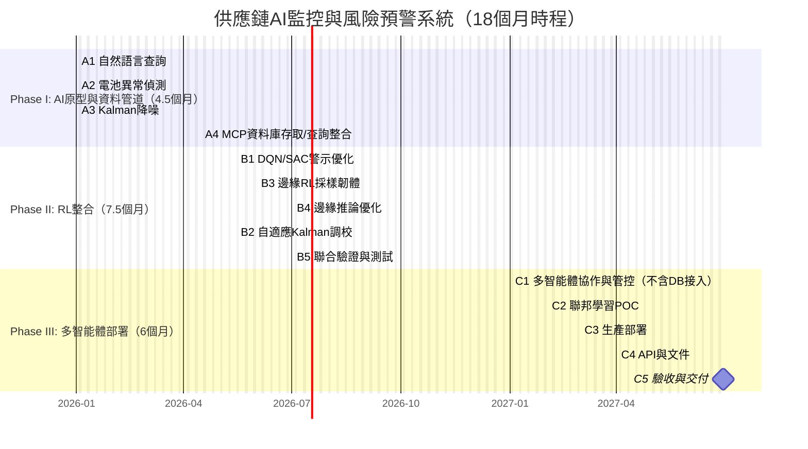

# 經濟部科技研究發展專案
## A+企業創新研發淬鍊計畫
## AI應用躍昇計畫計畫書（提交版）

**ItracXing 準旺科技 x Arviem 供應鏈AI監控與風險預警系統計畫**  
**計畫期間：自 2026年1月1日 至 2027年6月30日 止**

公司名稱：ItracXing 準旺科技股份有限公司  
計畫管理單位：台北市電腦商業同業公會

---

## 計畫書摘要表

### 綜合資料（金額單位：千元）

- **計畫名稱：** ItracXing 準旺科技 x Arviem 供應鏈AI監控與風險預警系統  
- **申請公司名稱：** ItracXing 準旺科技股份有限公司  
- **通訊地址：** 新北市板橋區（填寫完整地址）  
- **計畫別：** A+企業創新研發淬鍊計畫—AI應用躍昇計畫  
- **推動項目：** ☑ 其他（供應鏈與物流監控）  
- **計畫起～訖時間：** 2026年1月1日 至 2027年6月30日（共18個月）  

**計畫主持人**  
- 姓名：Jeff Shuo（索取身分證字號不需填）  
- 職稱：CIO  
- 電話：（02）XXXX-XXXX（填）  
- 傳真：（02）XXXX-XXXX（如無填「無」）  
- 電子信箱：jeff.shuo@itracxing.com    

**年度經費**

| 年度   | 政府補助款 | 申請公司自籌款 | 計畫總經費 | 計畫人月數 |
|:------:|-----------:|---------------:|-----------:|-----------:|
| 第1年度 | 11,840     | 11,840         | 23,680     | 120        |
| **合計** | **11,840** | **11,840**     | **23,680** | **120**    |
| 占總經費比例 | 50% | 50% | 100% | - |

**計畫聯絡人**  
- 姓名：Jeff Shuo  
- 職稱：CIO  
- 電話：（02）XXXX-XXXX（填）  
- 電子信箱：jeff.shuo@itracxing.com  

---

## 計畫摘要（1頁內；本摘要可能公開）

### 申請公司簡介
| 公司名稱 | ItracXing 準旺科技股份有限公司 |
|---|---|
| 創立日期 | 2020年3月 |
| 負責人 | Dr. Chow |
| 主要營業項目 | AI供應鏈監控系統、IoT設備管理、數據分析平台 |

### 計畫摘要（≤200字）
針對全球供應鏈監控之「警示過載/誤報」、「多感測器資料品質不一致」、「缺乏預測性決策」等痛點，本計畫整合可解釋AI、強化學習（RL）與多智能體技術，打造即時異常偵測與警示優化平台，並於邊緣裝置導入自適應採樣以延長電池壽命。結合瑞士 Arviem 場域與工研院/學研單位驗證，目標降低誤報、縮短回應時間並提升營運效率。

### 計畫結案時預期效益（重點列舉）
- 技術：異常偵測準確率≥90%，自然語言查詢回應<2秒，電池壽命+40%～60%。  
- 營運：誤報率-20%～30%，事件回應速度+50%，分析人力時數-40%。  
- 經濟：營運成本-20%，數據傳輸成本-60%，電池更換成本-70%。  
- 輸出：形成可出口之SaaS解決方案，擴展歐洲市場。

### 關鍵字
供應鏈AI監控、強化學習、可解釋AI、多智能體、IoT邊緣智能

---

## 計畫書目錄（與格式對齊）
壹、計畫參與者介紹  
貳、計畫內容與實施方法  
參、研發團隊說明  
肆、計畫經費需求  
伍、附件

---

# 壱、計畫參與者介紹

### 一、主要申請廠商
**公司簡介（依模板）**  
- **基本資料**  
  - 公司名稱：ItracXing 準旺科技股份有限公司  
  - 設立日期：2020.03.15  
  - 產業領域別：資訊服務業（J類；電腦系統設計）  
  - 前三大股東/持股：60%，技術團隊/25%，策略投資人/15%  
  - 研發人員總數/全公司人數：12/15  
  - 2024實收資本額（千元）：10,000  
  - 2024營業額/研發費用（千元）：15,000 / 8,000  

- **商務模式**  
  - 核心能力：AI驅動供應鏈監控、IoT裝置管理、RL應用、可解釋AI  
  - 收入項目：SaaS訂閱、AI顧問、客製化開發  
  - 通路：直銷、策略夥伴（Arviem）、線上平台  
  - 主要客戶：Arviem AG 等  
  - 成本項目：研發人事（60%）、雲資源（25%）、營運（15%）  
  - 關鍵合作對象：Arviem、工研院AI中心、台灣—阿姆斯特丹大學AI中心  
  - 國際輸出實績：與 Arviem 共同耕耘歐洲市場（德/荷）  
  - 友善職場規劃：性別比例≥1/3、增聘女性研發、彈性工時/遠端

### 二、申請/合作單位之 AI 研發能力說明
- **ItracXing 準旺科技**：LangChain多智能體、DQN/SAC、Kalman濾波、LLM整合、Next.js 全端、邊緣AI與韌體。  
- **工研院（ITRI AI中心）**：RL驗證與系統性能測試。  
- **台灣暨阿姆斯特丹大學AI合作中心**：聯邦學習、多智能體、AI倫理。

---

# 貳、計畫內容與實施方法

## 一、計畫緣起與產業痛點
- **痛點一：警示過載與誤報頻繁** → 需智能警示分類/優先級。  
- **痛點二：多感測器資料品質不一致** → 需降噪/自適應校準。  
- **痛點三：缺乏預測性決策** → 需自然語言查詢與AI建議。  
- **痛點四：電池壽命與維護成本** → 需邊緣RL自適應採樣。

## 二、計畫導入AI規劃（導入前後差異表）
| 導入技術目標 | 導入前(現況) | 導入後(預期結果) |
|---|---|---|
| 可解釋AI異常偵測 | 規則引擎準確率低、固定閾值 | Kalman+Z-score 準確率≥90%、可解釋性輸出 |
| 強化學習警示優化 | 誤報高、無學習能力 | DQN/SAC 誤報≤15%、關鍵警示<30分鐘 |
| LLM自然語言查詢 | 需SQL與IT支援 | 高層即時查詢、<2秒回應、附行動建議 |
| IoT邊緣AI採樣 | 固定採樣、壽命6個月 | RL自適應、壽命10–14個月 |
| 多智能體協作 | 難以跨域整合 | MCP工具協作、聯邦學習保隱私 |

## 三、計畫導入執行策略
### （1）場域、驗證項目與導入方式
- **場域**：Arviem 全球IoT監控網、歐亞跨境航線、製造業供應鏈系統。  
- **驗證項目**：  
  - Phase I（4.5個月）：異常偵測準確率、NL查詢延遲、降噪SNR。  
  - Phase II（7.5個月）：警示誤報率、電池壽命、邊緣推論延遲。  
  - Phase III（6個月）：多智能體吞吐、聯邦學習隱私、穩定性。  
- **導入方式**：API整合（Arviem）、雲端部署、邊緣韌體OTA、分階訓練上線。

### （2）計畫工作項目實施方式（含百分比/單位）
```
Phase I: AI原型與資料管道 (4.5個月, 27%) — 起始 2026/01/01
- A1 自然語言查詢 (8%) – ItracXing 準旺科技
- A2 電池異常偵測 (10%) – ItracXing 準旺科技
- A3 Kalman降噪 (5%) – ItracXing 準旺科技
- A4 MCP資料庫存取/查詢整合 (4%) – ItracXing 準旺科技 

Phase II: RL整合 (7.5個月, 47%)
- B1 DQN/SAC警示優化 (15%) – ItracXing 準旺科技 + ITRI(驗證)
- B2 自適應Kalman調校 (8%) – ItracXing 準旺科技
- B3 邊緣RL採樣韌體 (12%) – ItracXing 準旺科技
- B4 邊緣推論優化 (7%) – ItracXing 準旺科技
- B5 聯合驗證與測試 (5%) – ITRI + 學研中心

Phase III: 多智能體部署 (6個月, 26%)
- C1 多智能體協作與管控（不含DB接入）(8%) – ItracXing 準旺科技
- C2 聯邦學習POC (7%) – ItracXing 準旺科技 + 學研中心
- C3 生產部署 (6%) – ItracXing 準旺科技
- C4 API與文件 (3%) – ItracXing 準旺科技
- C5 驗收與交付 (2%) – ItracXing 準旺科技 + ITRI
```

### 國際輸出規劃
與 Arviem 合作切入歐洲市場，2026 目標進入德/荷，建立台歐聯合解決方案品牌。


### 註：MCP資料庫接入提前之理由
- 為確保自然語言查詢（A1）與資料分析能及早接軌實際資料源，將「MCP資料庫存取/查詢整合」自原 Phase III 提前至 Phase I（A4）。
- 提前完成資料管道可：
  - 提高A/B測試與指標驗證效率（Phase I 即可以真實資料驗證性能）。
  - 降低Phase II 模型迭代風險（RL與降噪演算法能在穩定資料介面上快速迭代）。
  - 縮短整體上市時程（Phase III 專注於多智能體協作與生產化，不再受限資料接入時程）。

### 甘特圖（18個月時程總覽）



## 四、計畫執行時程及查核點

### 預定進度表（年度=會計年度；每6個月至少1項查核點）
- **2026/01–2026/04中（Phase I 前段）**：完成 A1–A3 原型與指標測試（查核點 A.1）  
- **2026/04中–2026/05中（Phase I 後段）**：完成 A4 MCP資料庫存取/查詢整合（查核點 A.2）  
- **2026/05中–2026/12（Phase II）**：完成 B1 訓練與A/B測試、B3 初版韌體、B4 邊緣推論優化（查核點 B.1、B.2）  
- **2027/01–2027/06（Phase III）**：完成 C1–C5 生產化佈署與驗收（查核點 C.1；結案驗收）  

### 預定查核點說明（舉例）
- **A.1（2026/03）**：NL查詢<2秒；異常偵測準確率≥85%；SNR提高≥20%。  
- **A.2（2026/05）**：完成 MCP資料庫存取/查詢整合；NL查詢支援資料庫即時查詢。  
- **B.1（2026/09）**：警示誤報率≤20%；F1-score≥0.85；邊緣推論延遲<10ms。  
- **B.2（2026/12）**：電池壽命延長≥40%；自適應Kalman RMSE顯著下降。  
- **C.1（2027/06）**：多智能體協作吞吐量達標；聯邦學習隱私測試通過；完成最終驗收。

## 五、預期效益

### 量化效益（金額單位：千元；提供計算方式與佐證）
| 成果項目 | 執行前 | 第1年度 | 第2年度 | 佐證方式 |
|---|---:|---:|---:|---|
| 申請/核定專利數 | 0 | 1 | 2 | 申請文件/受理通知 |
| 衍生投資金額 | 0 | 5,000 | 10,000 | 投資意向/合約 |
| 新增就業機會（人） | - | 2 | 4 | 人事報表 |
| 研發人員平均加薪幅度(%) | - | 5% | 8% | 薪資名冊 |
| 其他：訂閱年經常性收入ARR | 0 | 6,000 | 12,000 | 合約/開立發票 |

**導入效益（比例）**  
- **降低成本**：數據傳輸費用-60%（採樣/壓縮/邊緣判斷）。  
- **提高良率/服務可用性**：冷鏈違規率-30%。  
- **提升效率**：事件響應時間-50%、分析人力時數-40%。  
- **增加營收/產值**：以SaaS/顧問與出口增加營收。

### 質化效益與商業化規劃
- **對申請單位**：技術升級、人才育成、產品線擴展至國際。  
- **對產業**：提高附加價值與自主性、促成國際合作。  
- **節能減碳**：相較傳統固定採樣，年CO₂減量（以省電/省運維出貨次數估算，計算式附後）。  
- **商業化**：結案3年內之衍生投資/產值目標與估算式（附附件）。  
- **成果廣宣**：結案前辦理發表/參展，公開技術亮點與驗證成果。

## 六、風險評估與因應對策
- **技術風險**：模型偏移/資料漂移 → 週期性重訓、監控警戒值。  
- **資料安全/隱私**：跨境傳輸合規 → 區域化部署、聯邦學習。  
- **場域整合**：異質設備協定差異 → 標準化API、中介層Adapter。  
- **人力風險**：關鍵人員流動 → 文件化/備援/外部顧問池。  
- **法規/地緣**：出口管制與資安法遵 → 合規審查、第三方稽核。  
- **替代技術**：競品採用端到端黑盒AI → 我方以可解釋性與邊緣化優勢因應。

## 七、智慧財產權說明
- 計畫成果之核心演算法與系統設計申請專利/著作權，關鍵IP歸屬與授權方式依合作合約約定。  
- 針對第三方權利（資料/庫/模組）進行盤點，確保授權合規。  
- 專利申請規劃：國內2件、國外1件（優先冷鏈異常偵測、邊緣採樣RL）。

---

# 參、研發團隊說明

## 一、計畫主持人資歷
- 姓名：Jeff Shuo｜職稱：CIO｜性別：男｜產業領域：資訊服務  
- 重要成就：20年以上AI/IoT/嵌入式系統領域經驗，主導多智能體協作、AI安全、供應鏈區塊鏈專案。美國/台灣跨國團隊管理，具備AI安全、合規、可解釋性系統設計與產品化實績。  
- **學歷/經歷/參與計畫**：  
  - 學歷：  
    - M.S. Electrical Engineering and Computer Science, University of Illinois at Chicago (1992)  
    - MBA, San Diego State University (2005)  
  - 經歷：  
    - AI Agent Architect   
      - 主導, 設計，整合 LLM, Reinforcement Learning, LangChain/LangGraph、RAG、MCP、ReAct等多智能體協作技術  
      - 供應鏈安全  
    - Qualcomm Inc. — Director of Engineering（2004–2018）  
      - 領導100+ IoT/AR/VR/智慧裝置專案，50+工程師團隊管理  
      - Python/Keras/Node.js自動化資源分配系統  
    - HTC Corp. — Sr. Technical Manager（2003–2004）  
      - 領導協定工程團隊，開發首款Windows Mobile Phone  
    - Qualcomm Inc. — Sr. Engineer（1997–2003）  
      - 嵌入式驅動、CDMA/GlobalStar手機、RF/LCD/Bluetooth/ATE軟體  
    - Motorola Inc. — Sr. Engineer（1994–1997）  
      - 海外CDMA基地台/手機工廠支援，Windows OOD/OOP校正軟體  
    - IBM — Software Engineer（1993–1994）  
      - AS/400 I/O子系統C++驅動開發  
  - 參與計畫/專案：  
    - Phoenix Multi-Agent SOC（2024–2025）：多智能體協作、AI安全、合規審查  
    - SecuX AI SOC、供應鏈區塊鏈標籤、HSM安全簽章  
    - Qualcomm/HTC/Google智慧裝置、嵌入式系統  
  - 技術專長：  
    - 多智能體協作（LangChain, LangGraph, AutoGPT, ReAct, MCP）  
    - AI安全、合規、可解釋性系統設計  
    - 嵌入式RTOS、ARM、Linux/Yocto、IoT（BLE, NB-IoT）  
    - 區塊鏈/Web3（ERC-1056, ERC-3643, DID, RWA Tokenization）  
    - 安全硬體（HSM, FIDO2, PKI）  
  - 投入月數：18個月（100%）  
  - 附：完整履歷PDF已置於 `proposal/attachments/CVs/Jeff_Shuo_Resume.pdf`

## 二、參與計畫人力統計（單位：人）
> 依模板表格填入：公司別、學歷別、性別、平均年資、待聘人數（待聘≤總人數30%）

## 三、參與計畫人員簡歷表
> 依模板：主持人、關鍵研發、一般研發、待聘人員（投入月數需對齊預定進度與人月總量120）。

### 團隊結構（新增成員名單）
- Sean｜角色：AI工程師｜地點：台北｜專長：自然語言處理（NLP）、LLM應用、語意查詢系統、Semantic query systems、Large Language Model (LLM) applications、Natural Language Processing (NLP)｜分工：A1 自然語言查詢（8%）｜備註：請補履歷，並置於 `proposal/attachments/CVs/`
- Gary｜角色：資料科學家｜地點：台北｜專長：異常偵測、時序資料分析、電池健康預測、Anomaly detection、Time series data analysis、Battery health prediction｜分工：A2 電池異常偵測（10%）｜備註：請補履歷，並置於 `proposal/attachments/CVs/`
- Neil（台中）｜角色：演算法工程師｜地點：台中｜專長：訊號處理、Kalman濾波、感測器資料降噪、Signal processing、Kalman filtering、Sensor data denoising｜分工：A3 Kalman降噪（5%）｜備註：請補履歷，並置於 `proposal/attachments/CVs/`
- 鄺宏（台中，Kuang-Hung）｜角色：全端工程師｜地點：台中｜專長：資料庫設計、API整合、雲端部署、Database design、API integration、Cloud deployment｜分工：A4 MCP資料庫存取/查詢整合（4%）｜備註：請補履歷，並置於 `proposal/attachments/CVs/`
- 謝子元（台中，Tze-Yuenn）｜角色：軟體工程師｜地點：台中｜專長：後端開發、資料管道建置、系統整合、Backend development、Data pipeline construction、System integration｜分工：A1–A4 支援與維運｜備註：請補履歷，並置於 `proposal/attachments/CVs/`

> 後續將於「參與計畫人員簡歷表」區塊補齊上述人員之：學歷、專長、投入月數與分工（Phase 對應 A1–C5），並於附件夾 `proposal/attachments/CVs/` 提供中文履歷PDF。

---

# 肆、計畫經費需求（千元）
> 依模板各科目表填列；以下為可直接貼入之「空表＋試算示例」

## （一）創新或研究發展人員之人事費（範例，實際請覆核）
| 職務別 | 平均月薪(A) | 人月數(B) | 第1年度人事費 | 備註 |
|---|---:|---:|---:|---|
| 經理/PM | 120 | 12 | 1,440 | 專任 |
| AI工程師×5 | 100 | 5×12=60 | 6,000 | | 
| 全端工程師×4 | 90 | 4×12=48 | 4,320 | |
| IoT韌體×2 | 95 | 2×12=24 | 2,280 | |
| 資料科學×1 | 110 | 12 | 1,320 | |
| 顧問/專家 | 150 | 6 | 900 | 願任書附 |
| **小計** |  | **120** | **16,260** | （示例） |

> 上述僅為示例，實際需調整至「總經費 23,680；補助比例≦50%」。

## （二）消耗性器材及原材料費（空表）
| 項目 | 單位 | 數量 | 單價 | 第1年度 | 用途說明 |
|---|---|---:|---:|---:|---|

## （三）設備使用/維護/雲端/EDA租賃費（空表）
> 依模板分表填列，計算基礎 A×B/60，投入月數、分攤方式與用途說明需完整。

## （四）技術引進、委託研究或驗證費（空表）
- 無形資產引進 / 委託研究（含計畫管理）/ 驗證（列單位、單價、機構）。

## （五）國內差旅費（空表）
> 僅限引進/委託/驗證必要差旅。

## （六）專利申請獎勵金（空表）
> 國內每案 30、國外每案 100（千元）；完成申請即可認列（仍須舉證相關費用）。

## 二、歲出預算分配表（彙總表空表）
| 會計科目 | 補助款 | 自籌款 | 合計 |
|---|---:|---:|---:|
| 1.人事費 |  |  |  |
| 2.消耗性器材及原材料費 |  |  |  |
| 3.設備使用費 |  |  |  |
| 4.設備維護費 |  |  |  |
| 5.無形資產引進/委託研究/驗證 |  |  |  |
| 6.國內差旅費 |  |  |  |
| 7.專利申請獎勵金 |  |  |  |
| **總開發經費** | **11,840** | **11,840** | **23,680** |
| **百分比** | **50%** | **50%** | **100%** |

---

# 伍、附件（請視需要增列）
- 附件一：曾申請之政府計畫（類別/狀態/金額/效益/差異）。  
- 附件二：合作契約書（依範本）。  
- 附件三：技術引進/委託研究/驗證之計畫書與協議書。  
- 附件四：顧問與國內外專家願任同意書。  
- 附件五：其他（如資安稽核、隱私影響評估、廣宣規劃）。

---

> **編註**：
> - 金額一律為「新台幣千元」並四捨五入；補助比例不超過 50%。
> - 各表之「查核點」、「投入月數」、「歲出科目」應前後一致；結案月需列入驗收查核點。
> - 需同時保留可公開之摘要與限閱之細節版本（附件含合約/人事等）。
