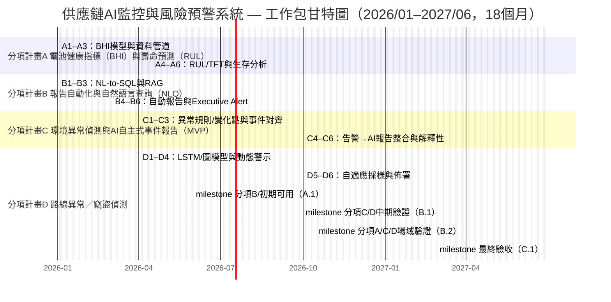

# 經濟部科技研究發展專案

## A+企業創新研發淬鍊計畫

## AI應用躍昇計畫計畫書（提交版）

**AI智慧供應鏈風險預測與通訊整合應用系統開發計畫**  
**計畫期間：自 2026年1月1日 至 2027年6月30日 止**

公司名稱：ItracXing 準旺科技股份有限公司
計畫管理單位：台北市電腦商業同業公會

---

## 計畫書摘要表（封面與前置文件）

### 綜合資料（金額單位：千元）

- **計畫名稱：** AI智慧供應鏈風險預測與通訊整合應用系統開發計畫
- **申請公司名稱：** ItracXing 準旺科技股份有限公司
- **通訊地址：** 新北市板橋區
- **計畫別：** A+企業創新研發淬鍊計畫—AI應用躍昇計畫
- **推動項目：** ☑ 其他（供應鏈與物流監控）
- **計畫起～訖時間：** 2026年1月1日 至 2027年6月30日（共18個月）

**計畫主持人**

- 姓名：Jeff Shuo
- 職稱：CIO
- 電話：（02）XXXX-XXXX
- 傳真：無
- 電子信箱：jeff.shuo@itracxing.com

**年度經費**

|     年度     | 政府補助款 | 申請公司自籌款 | 計畫總經費 | 計畫人月數 |
| :------------: | -----------: | ---------------: | -----------: | -----------: |
|   第1年度   |      9,000 |          9,000 |     18,000 |        120 |
|   **合計**   |  **9,000** |       **9,000** | **18,000** |    **120** |
| 占總經費比例 |      50.0% |          50.0% |       100% |          - |

**計畫聯絡人**

- 姓名：Jeff Shuo
- 職稱：CIO
- 電話：（02）XXXX-XXXX
- 電子信箱：jeff.shuo@itracxing.com

---

## 計畫摘要（1頁內；本摘要可能公開）

### 申請公司簡介

| 公司名稱     | ItracXing 準旺科技股份有限公司              |
| -------------- | --------------------------------------------- |
| 創立日期     | 2020年3月                                   |
| 負責人       | Dr. Chow                                    |
| 主要營業項目 | AI供應鏈監控系統、IoT設備管理、數據分析平台 |

### 計畫摘要（≤200字）

產業對應：八大產業第 7 項（電子組裝延伸：智慧製造／物流運輸）。

全球智慧物流監控與可追溯需求快速成長，2030 年運輸與物流市場規模預估達 NT$250.2 兆。本計畫由 ItracXing 與瑞士 Arviem 共同推動，聚焦「感測器可靠度不足、報表產出耗時、環境敏感貨品風險難以及時掌握、路線繞行與疑似竊盜無法即時辨識」四大痛點，分別建置 BHI/RUL 電池健康預測、NLQ＋AI 自主式報告、環境異常偵測與路線／竊盜偵測四項 AI 模組。18 個月內完成國際場域驗證與 2 個以上示範場域，達成感測器可靠度 ≥95%、風險回應時間縮短 ≥40%、冷鏈違規率下降 ≥30%，並建立可輸出的 AI-MaaS 服務模式，預估結案後三年累積產值約 NT$1.2 億元，提升台灣在 AI 智慧物流領域之國際能見度。

### 計畫結案時預期效益（摘要表）

以下彙整本計畫結案時於「技術、商業、產業、智財與輸出、社會／ESG」五大面向之關鍵指標與具體目標；所有指標均已於後文 KPI 表、技術驗證協議與里程碑說明中定義量測方式、資料來源與追蹤頻率，確保成果可量測、可查核、可追蹤。

| 類別 | 核心指標（摘要） | 結案目標（具體且可查核） |
|------|------------------|--------------------------|
| 技術 | 感測器可靠度與預測能力、異常偵測與查詢效率 | 感測器可靠度（Availability）由 90% 提升至 **≥95%**；BHI 預測準確率 **≥90%**，RUL 預測誤差 MAE **≤10 天**；環境異常偵測 F1 **≥0.88**，路線偏離偵測 AUC **≥0.90**、竊盜偵測 F1 **≥0.85**；NLQ 查詢正確率 **≥92%**，P95 延遲 **<60 秒**，整體風險回應時間相較現況縮短 **≥40%**。 |
| 商業 | 營運效率與成本優化、可實收之訂閱與專案收入基礎 | 週/月報與事件分析等人工報告工時每月減少 **≥200 小時**；冷鏈／環境違規率下降 **≥30%**，無效運輸與理賠相關損失降低 **≥10–15%**；結案時取得 **≥2 件** 國內外 LOI/POC，並完成 **至少 1 家國際＋1 家國內場域** 之付費或準商用驗證，作為結案後三年累積 **≥NT$120M** 產值之可查核基礎。 |
| 產業 | 場域示範、在地生態系與跨域人才培育 | 完成 **至少 1 個** 具代表性的 AI 導入示範場域（如國際海運／冷鏈／電子組裝供應鏈），形成可複製之導入藍圖與 SOP；培育或提升具「AI＋物流／製造」跨域能力之研發與實務人才 **≥6 名**，其中女性研發人力 **≥1 名**；透過技術工作坊、產業論壇與標竿案例分享，帶動國內系統整合商、電信與設備廠之合作機會。 |
| 智財／輸出 | 智慧財產佈局、AI 模型商轉化與國際輸出比重 | 結案前完成 **2–3 件** 專利申請（含 **至少 1 件 PCT** 國際案），並完成 **1–2 項** 核心模組（如 BHI/RUL、異常偵測、NLQ 編排）之電腦程式著作權登記；建立以 AI-MaaS / LaaS 為核心之國際輸出架構，結案後三年內國際客戶收入占本計畫衍生營收 **約 70%**，並完成 **至少 1 份** 對外技術白皮書或開放工具，支援海外推廣與二次開發。 |
| 社會／ESG | 供應鏈韌性強化、節能減碳與中小企業示範 | 透過提前預警與路線優化，關鍵異常事件之風險回應時間縮短 **≥40%**，提升跨境供應鏈韌性；結合自適應採樣與路線最佳化，推估三年累計 CO₂ 排放量減少 **約 10–15%**（以里程／電池使用效率計算），折算約 **80+ 噸 CO₂e**；完成 **1–2 個** 台灣中小企業導入示範（可含物流／製造／冷鏈業者），形成兼顧資料治理、AI 導入與商業模式的整合示範案例，可供後續政策與產業推廣參考。 |

### 關鍵字

供應鏈AI監控、可解釋AI、多智能體、IoT自適應採樣、智慧製造、電子組裝、物流運輸、智慧物流、八大產業第7項

---

## 壹、計畫參與者介紹

【摘要】本節說明申請單位之定位、研發能量與合作夥伴，聚焦供應鏈 AI 監控核心能力與國際輸出基礎，作為後續執行與KPI配置之依據。

### 一、主要申請廠商

**公司簡介（依模板）**

- **基本資料**

  - 公司名稱：ItracXing 準旺科技股份有限公司
  - 設立日期：2020.03.15
  - 產業領域別：資訊服務業（J類；電腦系統設計）
  - 前三大股東/持股：60%，技術團隊/25%，策略投資人/15%
  - 研發人員總數/全公司人數：12/15
  - 2024實收資本額（千元）：10,000
  - 2024營業額/研發費用（千元）：15,000 / 8,000
- **商務模式**

   - 核心能力：AI驅動供應鏈監控、IoT裝置管理、自適應採樣/動態閾值、可解釋AI
  - 收入項目：AI-MaaS訂閱、AI顧問、客製化開發
  - 通路：直銷、策略夥伴（Arviem）、線上平台
  - 主要客戶：Arviem AG 等
  - 成本項目：研發人事（60%）、雲資源（25%）、營運（15%）
   - 關鍵合作對象：Arviem
   - 國際輸出實績：與 Arviem 共同耕耘全球市場
  - 友善職場規劃：性別比例≥1/3、增聘女性研發、彈性工時/遠端

### 二、申請/合作單位之 AI 研發能力說明

**ItracXing 準旺科技**：為專注於 IoT 感測與衛星通訊鏈路 之產品開發公司，具備終端感測器、通訊模組與雲端平台整合實績，現正與國際物流監控合作夥伴共同開發，將自有 IoT 裝置與 AI 應用結合，發展「AI-Monitor as a Service」與「Logistics as a Service」等服務型商業模式，鎖定全球供應鏈監控與智慧物流市場。於本計畫中可提供從「終端感測器—衛星／行動通訊—雲端 AI 平台—決策儀表板」的一體化解決方案，強化 AI 導入落地可行性、產業擴散性與國際輸出潛力，符合本計畫智慧運輸／智慧物流等關鍵產業之發展方向。
 

### 三、競爭態勢與技術優勢分析

#### （1）國際競品比較

| 類別           | 典型業者定位            | 主要強項       | 目前缺口                                  | 本計畫對應優勢                                              |
| ------------ | ----------------- | ---------- | ------------------------------------- | ---------------------------------------------------- |
| 國際數位貨代／可視化平台 | 整合訂艙、報關、追蹤        | 平台成熟、客戶基礎廣 | 對 IoT 感測器資料與 AI 預測整合有限，NLQ 多為靜態查詢     | 專注「智慧貨櫃＋感測器」之 BHI/RUL、環境預警與路線異常偵測，NLQ 直接查詢異常事件與供應鏈風險 |
| 感測器／裝置廠商     | 提供溫度／震動／位置等感測器與平台 | 硬體多樣、佈建經驗足 | 軟體多為 rule-based 告警，缺乏可解釋 AI 與跨艙、跨航線學習 | 以 Kalman＋深度學習／時序模型建構可解釋 BHI/RUL 與違規風險預測，強調模型透明度與可稽核  |
| 雲端資料與 BI 平台  | 數據倉儲、儀表板          | 通用性強、可擴展性佳 | 需大量客製才能支援物流 IoT 詳細 schema 與 SOP       | 以「物流 IoT 語意層＋ NL-to-SQL」為核心，內建貨櫃、艙位、航線等語彙，降低客製門檻     |

#### （2）技術創新與差異化優勢  

1. **感測器可靠度與 BHI/RUL：從「單點告警」升級為「可預測的健康管理」**  
   - 以 Kalman 濾波＋時序深度學習（如 LSTM/TFT）建立 BHI（Battery Health Index）與 RUL（Remaining Useful Life），不僅回報「壞了沒」，更能提前預測「何時會壞」。  
   - 與多數僅看電壓門檻的方案相比，可同時考量溫度、使用型態與傳輸頻率，降低誤判並延長感測器壽命。

2. **NLQ＋語意層：從「看報表」變成「問問題就給答案」**  
   - 設計物流專用語意層（Shipment、Lane、Container、Event 等），並以 NL-to-SQL 將自然語言查詢安全地轉成結構化查詢。  
   - 匯總 BHI、違規事件、路線異常與 SLA 指標，高階主管可直接詢問「本季歐洲線溫濕度違規趨勢？」而非人工拉報表。  
   - 採工具約束與拒答機制，避免幻覺與越權查詢，兼顧「易用」與「治理」。

3. **環境異常偵測與路線異常偵測：分層導入、降低誤報**  
  - 針對溫/濕度敏感貨品，以「變化點＋門檻＋事件對齊」作為 MVP 進行異常偵測與AI自主式事件報告；並設定報告 SLA（P95 ≤ 2 分）與提前預警率目標。  
   - 路線異常偵測則結合 GPS、停留模式與天候／交通資訊，區分「合理延誤」與「異常繞路／竊盜風險」，優先處理真正高風險案件。

4. **台灣優先之 AI Logistics MaaS 架構：可複製、可驗證、可擴散**  
   - 系統設計為模組化「AI 功能 XaaS」（BHI/RUL、環境預警、路線異常、NLQ 報表），可由本國中小型貨代、倉儲、冷鏈業者逐步採用。  
   - 所有模型與決策過程保留審計軌跡，因應 EU/GDPR 與國際客戶的稽核需求，強調「可解釋、可追蹤」的 AI 治理。

---

#### （3）市場切入與在台落地策略  

1. **從既有國際專案出發，回饋台灣場域**  
   - 以現有國際客戶專案為第一波資料與模型驗證來源，快速累積模型準確度與案例。  
   - 同步在台灣建置小規模試點（例如：1–2 家本地貨代／倉儲業者、數十個智慧貨櫃／托盤）

2. **聚焦「高價值、高風險貨品」切入**  
   - 以咖啡豆、食品原料、精密零組件等為優先目標貨種，這些貨品對溫濕度與貨損極為敏感，也最能體現本計畫之價值。  
   - 透過降低貨損與理賠成本，以及更精準的 ETA 與風險預警，形成可量化的 ROI（Cost saving ＋ Premium service）。

3. **平台化與授權模式併行**  
   - 短期採 LaaS／MaaS 訂閱模式（按設備數、貨櫃數或查詢量計價），降低客戶採用門檻。  
   - 中長期可提供模型授權與白標方案，讓台灣系統整合商或電信業者將本技術整合至自家 5G/AI 方案中，形成在地生態系。

4. **國際合作與台灣價值**  
   - 透過與國際學研與業者合作（如歐洲物流夥伴、大學等），共同發表論文與實證報告，提升台灣在「AI＋物流」領域之能見度。  
   - 所有關鍵模型與平台核心開發均在台灣完成，並優先在台灣建立營運與維運團隊，確保技術與人才留在本地。

## 貳、計畫內容與實施方法

【摘要】本節由產業痛點引導 AI 解法與工作包，明確串連「痛點→解法→里程碑→KPI」，並補強資料治理與資安合規，確保量測可行與可追蹤。
### 一、計畫緣起與產業痛點

本計畫聚焦智慧物流場域中，最直接影響「營運可靠度、決策效率與客戶體驗」的四大核心痛點，並以分項計畫 A–D 具體承接與解決：

### **痛點一｜感測器可靠度不足（電池衰退、環境干擾、資料中斷）**

現行感測器多以固定週期回傳資料，缺乏對電池健康狀態與剩餘壽命的預測能力。一旦因電量衰退、訊號衰減或環境干擾導致感測器離線，通常都是在資料已中斷、異常已發生後才被動察覺，造成監控盲區、難以追溯與維運成本提高。  
→ **需求**：導入電池健康（BHI）與剩餘壽命（RUL）預測模型，建立可預測性的感測器健康管理與預防性維護機制，並串接分項計畫 B 的AI自主式事件報告，以提升系統可用度（對應分項計畫 A）。

### **痛點二｜報表產出耗時且缺乏互動（人工彙整、決策延滯）**

目前報表生成流程需跨系統手動彙整感測器時序資料、GPS 軌跡、開關門事件與環境紀錄，並以 Excel 或簡報人工整理，常耗費數小時至數日，且易因欄位解讀不同或版本不一致而造成決策延遲。管理者亦無法即時以自然語言查詢關鍵資訊，形成資訊落差與效率瓶頸。  
→ **需求**：部署AI自主式事件報告與自然語言查詢（NLQ）平台，實現資料彙整AI自主式處理、洞察快速呈現與即時互動式查詢（對應分項計畫 B）。

### **痛點三｜環境敏感貨品的異常風險難以及時掌握（濕度變化、原因追溯不足）**

對濕度高度敏感的貨品（如咖啡豆、食品原料、精密零組件）在運輸與倉儲過程中，若遭遇長時間濕度偏高或劇烈波動，容易造成發霉、品質下降、報廢與索賠爭議。然而多數現行系統僅能事後查看濕度曲線，缺乏即時異常提醒、根因線索與簡明可操作的事件說明，導致無法提前採取行動。  
→ **需求**：建立溫／濕度異常偵測與AI自主式告警機制，並結合AI自主式事件報告縮短異常事件的通報、判讀與追溯時間（對應分項計畫 C）。

### **痛點四｜路線繞行與疑似竊盜風險無法即時辨識（GPS 偏離、人工作業判讀）**

現行運輸監控多仰賴事後檢視 GPS 記錄或人工判讀，難以區分「因天候或交通造成的合理繞行」與「可疑繞路、異常停留」等高風險事件。貨櫃或貨箱遭未授權開啟時，也常於到倉後才被發現，錯失即時介入的時間窗口。  
→ **需求**：建置結合 GPS／NTN 軌跡、GeoFencing、壓力／鎖具事件與外部天候交通資料的路線異常與竊盜偵測模型，以即時辨識偏移、停留與未授權開啟事件，降低誤報、提升察覺精準度，並串接AI自主式事件報告提升事件調查效率（對應分項計畫 D）。

本計畫即是從上述四大痛點出發，分別透過分項計畫 A–D 建立對應之 AI 解決方案與可量測之 KPI，以系統化方式提升智慧物流之可靠度、安全性與國際競爭力。

### 二、計畫導入 AI 規劃  

【說明】本節說明本計畫如何從「四大產業痛點」出發，對應至分項計畫 A–D 之 AI 技術與導入目標，並補充導入前後效益與資料治理/資安機制，確保成果可量測與可查核。另四個分項之間之資料與模型流向如下：A 產出之 BHI/RUL 與感測器可信度 → 提供 B 作為查詢與報表指標；C/D 產生之環境與路線異常事件 → 觸發 B 的 AI 報告與決策支援。

#### (1) 導入技術目標：痛點 → 分項計畫 → AI 解法

| 產業痛點（Pain Point） | 對應分項計畫 | 主要 AI 技術 | 導入目的與成效目標 |
| --- | --- | --- | --- |
| **痛點一｜感測器可靠度不足（電池衰退、環境干擾、資料遺失）** | **A. 感測器可靠度優化** | 電池健康預測（SOH/BHI）、剩餘壽命預測（RUL）、預測性維護模型 | 透過 AI 化 BHI/RUL 預測模型，建立預測性維護機制，提前偵測電池衰退與故障風險，使感測器可靠度由 **90% → 95%+**，並實現智能化維護排程。 |
| **痛點二｜報告產出耗時且缺乏互動（人工彙整、決策延遲）** | **B. 按需報告與即時查詢（NLQ）** | 自然語言查詢（NLQ）、NL-to-SQL、LLM 報告生成 | 讓管理階層與營運人員可用自然語言下指令取得數據與報告，將報告產出由 **「人工數小時 → 自動數秒」**，NLQ P95 延遲目標設定為 <60 秒、查詢正確率 ≥90%。 |
| **痛點三｜環境敏感貨品的異常風險難以及時掌握（濕度變化、原因追溯不足）** | **C. 敏感貨品環境異常偵測與 AI 自主式事件報告** | 變化點/統計門檻異常偵測、多變量時序模型、事件對齊（箱體開關/路段） | 以 Smart TOTE 溫/濕度 (T/H) 與箱體開關事件為核心，偵測「長時間超標/短時間劇烈波動」並結合 AI 自主式事件報告，目標「違規提前預警率 ≥70%、事件報告 SLA（P95） ≤2 分鐘」，協助提前掌握環境異常風險並追溯原因，降低貨損與索賠風險。 |
| **痛點四｜路線繞行與疑似竊盜風險無法即時辨識（GPS 偏離、人工作業判讀）** | **D. 路線異常與竊盜偵測（Smart TOTE）** | GPS/NTN 時空軌跡模型、Geo-fence 行為分析、鎖具/壓力感測異常偵測、天候/交通上下文建模 | 利用 Smart TOTE 之 **GPS/LTE/NTN 路線資料 + BLE Padlock/壓力感測開關狀態**，結合天候與交通資訊，辨識「合理延誤 vs. 真正異常」，實現 **繞行、可疑停留、非法開箱/竊盜** 之即時預警，目標達成偵測 F1 ≥0.85、ETA MAE 改善 ≥25%、警示誤報率 ≤15%、關鍵警示回應時間 <30 分鐘，呼應痛點四所述「無法即時辨識」風險。 |

> Smart TOTE 具備 BLE Padlock、壓力感測、GPS/LTE/NTN 連線能力，可進行箱體開關、鎖狀態與路線即時追蹤。  
> 來源：(V5.0.X) iTX Smart TOTE Specification

---

#### （1-2）國際 SOTA（State of the Art）與本計畫技術指標對照

為凸顯技術優越性與可查核性，本節擇要列出三項關鍵指標，對照國際常見或文獻/產業報告中可見之 SOTA/通行水準與本計畫目標值，所有本計畫目標數值均與前述 KPI 表保持一致。下列國際數據為公開研究與大型供應鏈平台實務經驗之彙整範圍，供審查委員參考其量級合理性。

#### ① BHI／RUL 電池健康與壽命預測

| 指標 | 典型現況／國際水準（參考值） | 本計畫目標（KPI 對照） | 說明 |
| --- | --- | --- | --- |
| 感測器可靠度（Availability） | 約 85–90%（多為被動維護，故障後更換） | **≥95%** | 導入 BHI/RUL 預測與預防性維護後，透過狀態監測與預警降低非計畫性停機。 |
| BHI 健康狀態預測準確率 | 國際電池健康研究中，多數以 80–88% 為實務可達範圍 | **≥90%** | 以 LSTM/TFT＋Kalman 建立 BHI 指標，目標優於一般公開實驗結果（約 80%+）並提供可解釋結果。 |
| RUL 預測誤差（MAE） | 文獻中針對實際運行電池，多以 10–20 天級誤差為可接受區間 | **≤10 天** | 以生存分析＋時序模型預測剩餘壽命，將誤差壓在 10 天以內，對齊或優於公開 RUL 實驗結果。 |

#### ② 環境敏感貨品的異常風險與提前預警（呼應痛點三）

| 指標 | 典型現況／國際水準（參考值） | 本計畫目標（KPI 對照） | 說明 |
| --- | --- | --- | --- |
| 環境異常偵測 F1-score | 國際冷鏈監控與設備廠商多採門檻＋rule-based，公開案例 F1 約 0.7–0.8 | **≥0.88** | 以變化點偵測＋Kalman 濾波／LSTM 等多變量時序模型進行去噪與短期預測，搭配箱體開關與路段事件對齊，將偵測效能提高至 0.88 以上，優於一般門檻式做法。 |
| 違規／異常提前預警率 | 多為事後查帳或臨界點才报警，提前預警率偏低（<30%） | **≥70%** | 以 Kalman／LSTM 等短期預測模型推估未來 30–60 分鐘內之環境變化，於預測顯示將觸及冷鏈作業違規門檻前至少 30 分鐘主動觸發預警，並由 AI 自主式事件報告輔助判讀，對應「痛點三」中對濕度變化與提前掌握風險之需求。 |
| 事件報告 SLA（P95） | 多仰賴人工彙整與 Email 通報，常以「小時」計 | **≤2 分鐘（端到端）** | 由異常偵測直接觸發 AI 自主式事件報告與推播管線，大幅縮短通報時間。 |

#### ③ 路線繞行／疑似竊盜偵測與 ETA 預測（呼應痛點四）

| 指標 | 典型現況／國際水準（參考值） | 本計畫目標（KPI 對照） | 說明 |
| --- | --- | --- | --- |
| 路線偏離偵測 AUC | 物流與車聯網研究中，以純 GPS 特徵訓練之異常偵測模型 AUC 多落在 0.80–0.88 | **≥0.90** | 以 LSTM＋圖模型結合天候／交通上下文，將 AUC 推升至 0.90 以上，對齊近期國際研究的較高水準。 |
| 竊盜／未授權開啟 F1-score | 多倚賴門禁或人工作業紀錄，實務上少有公開 F1 數據，多為「事件案例」說明 | **≥0.85** | 透過 Smart TOTE（BLE Padlock＋壓力感測）與行為模式建模，明確訂出 F1≥0.85 的可量測門檻。 |
| ETA 預測誤差（MAE） | 國際貨櫃與幹線運輸 ETA 預測，公開案例多為 1.5–3 小時級 MAE | **改善 ≥25%** | 以歷史路線＋即時路況/天候模型，將 ETA MAE 自現況再降低 25% 以上，對齊或優於國際平台實務經驗。 |

上述指標將透過前述「技術驗證協議」與第三方測試／場域驗證報告進行查核，並納入里程碑 B.1／B.2 之審查基準，以確保「技術優越性」不僅為定性敘述，而能以量化數據對照國際水準。

---

#### (2) 導入前（現況）與導入後（預期結果）對照（含 Smart TOTE）

| 項目                                  | 導入前（現況問題）                                                   | 導入後（預期成果）                                                                                                                                                         |
| ----------------------------------- | ----------------------------------------------------------- | ----------------------------------------------------------------------------------------------------------------------------------------------------------------- |
| **感測器可靠度與智能維護 （痛點一 / 分項計畫A）**    | 感測器電池衰退與離線無法事先預測，常出現「資料中斷、補測成本高」，造成異常判讀困難與維運成本上升。           | 透過 AI 化 BHI/RUL 預測模型，建立預測性維護機制，提前辨識電池衰退與故障風險，**可靠度（Availability）提升至 ≥95%，RUL 預測 MAE ≤10天，資料完整性 ≥95%**，降低非計畫性停機與維運成本。                                                           |
| **報告產出與決策效率 （痛點二 / 分項計畫B）**      | 報表需由人工作業彙整，多數查詢需「寄信/開工單 → 等待數小時至數日」，決策延遲且難以追蹤誰查了什麼資料。       | 建置 NLQ + 自動報告系統，高層與營運直接以自然語言詢問；**報告生成由數小時縮短為 <45 秒**（初期 M1-M6 目標），並保留查詢審計軌跡，支援高階管理報告與例行週/月報自動產製。                                                                               |
| **環境敏感貨品之違規與品質風險 （痛點三 / 分項計畫C）** | 多數仍屬「事後查帳」，缺乏即時異常提醒與簡明說明，無法快速判讀成因與處置，錯失提前介入時機。        | 以變化點/統計門檻＋簡單規則偵測溫/濕度異常，對齊箱體開關/路段事件，自動觸發分項 B 的 AI 報告與推播，產出「事件摘要＋建議處置」。**提前預警率 ≥70%，違規率下降 ≥30%，事件報告 SLA（P95） ≤ 2 分鐘**。                                          |
| **路線繞行、合理延誤與潛在竊盜 （痛點四 / 分項計畫D）** | 目前多依賴事後 GPS 回看與人工判斷，天候/交通影響與「繞路偷運」難以區分；貨櫃被開箱、鎖具遭破壞多在事後才被發現。 | 以 GPS/NTN 時空軌跡與 **天候/交通資訊** 建立路線預測及異常模型，搭配 Smart TOTE **BLE Padlock/壓力感測** 資訊辨識未授權開箱；系統即時標註「合理延誤（因天候/塞車）」與「可疑繞行/停留/非法開箱」，**F1 ≥0.85、警示誤報率 ≤15%、關鍵警示回應時間 <30 分鐘**。 |

#### (3) 資訊安全與資料治理（合規機制）

- 資料分級與來源：內部（裝置時序/事件）、外部（天候/路況/地理）；建立數據目錄與血緣。
- 存取控管：依職能與最小權限原則（RBAC/ABAC）、唯讀白名單查詢、審計日誌保存≥1年。
- 個資/敏感資料：去識別化/匿名化（雜湊/遮罩）、跨境傳輸以區域化部署與聯邦學習（FL）處理。
- 合規框架：GDPR/DPIA 檢核、第三方資安掃描（SAST/依賴）、定期弱掃與備援演練（每季）。
- 稽核與版本：資料版本控管、模型版本/回滾、查詢路由與模型輸出全程可追溯。

### 三、計畫導入執行策略
本節綜整導入場域、國際合作與工作包（A–D）之執行策略與方法，作為後續時程與查核點之依據。
 
【摘要】工作包以痛點為主軸，分A–D執行並設查核點；國際合作強化場域驗證與輸出，KPI 與里程碑對齊以確保投資效益。

### （1）場域、驗證項目與導入方式

- **驗證項目（依分項計畫呈現）**

  - **分項計畫 A（M1–M11）｜智慧感測器可靠度優化**
     - BHI 建立與穩定度（以 3 個不同批次資料比較波動度）
     - RUL 預測誤差 MAE ≤ 10 天  
       （以 20% hold-out 測試集驗證）
     - 降噪後 SNR 提升幅度 ≥ 20%  
       （以同一感測器訊號前後差異量測）
     - 感測器資料完整性 ≥ 95%、可用度 ≥ 95%  
       （以 30 天連續回傳紀錄計算）

  - **分項計畫 B（M1–M5）｜NLQ 與報告生成 AI 自主式化**
     - NLQ 查詢正確率 ≥ 90%  
       （以 200+ 查詢樣本比對人工標準答案）
     - NLQ 延遲 P95 < 180 秒  
       （以壓力測試 500–1,000 QPS 測量）
    - 報告AI自主式生成完成率 ≥ 95%  
       （以 100 份報告自動產出比對人工版本）
     - 人工作業時數降低 ≥ 70%  
       （以 baseline 與導入後實測時數比較）

  - **分項計畫 C（M4–M15）｜敏感貨品環境異常偵測與報告（MVP）**
     - 溫/濕度異常偵測 F1 ≥ 0.88  
       （以完整事件樣本集測試）
     - 違規／異常事件提前預警率 ≥ 70%  
       （至少 30 分鐘前發出告警；視場域擴充外生特徵）
     - 事件報告 SLA（P95） ≤ 2 分鐘  
       （異常→報告生成→推播端到端）

  - **分項計畫 D（M4–M15）｜路線異常、竊盜偵測（Smart TOTE）**
     - 路線偏離偵測 AUC ≥ 0.90  
       （以 20 條實際路線異常樣本驗證）
     - 竊盜／未授權開啟告警 F1 ≥ 0.85  
       （以 BLE 壓力、光感、開啟事件比對）
     - ETA 預測誤差 MAE ≤ 15 分鐘  
       （以真實運輸歷史資料與測試集驗證）
     - 開啟／壓力變化事件偵測準確率 ≥ 95%  
       （以 50 次以上開闔測試取得）

### （2）分項計畫

#### 分項計畫A｜智慧感測器可靠度優化

目標在於將感測器可靠度由約 90% 提升並降低非計畫性停擺，聚焦建置 AI 化電池健康指標（BHI）與剩餘壽命（RUL）預測模型，實現預測性維護。

**A1. 目標與成功標準（Objectives & Success Criteria）**
- 可靠度（Availability）≥95%、RUL MAE ≤ 10 天、BHI 預測準確率 ≥90%（資料完整性 ≥ 95%）。

**A2. 取得與準備資料（Data Acquisition & Preparation）**
- 使用裝置電壓、溫度、傳輸頻率與維護紀錄等資料，補齊缺漏並建立健康趨勢。

**A3. 建立數據集（Dataset for Modeling）**
- 整合歷史資料與事件標註（故障/維護），形成可回溯的訓練與驗證集。

**A4. 建模與訓練（Modeling & Training）**
- 採用 **RNN/LSTM/TFT（Temporal Fusion Transformer）**等時序深度學習模型，分析電池放電曲線與電壓衰退趨勢，建立 BHI 健康指標。
- 結合 **Kalman 濾波**進行訊號降噪與狀態估計，濾除環境干擾與感測器讀取雜訊。
- 使用 **生存分析（Survival Analysis）**技術（如 Cox 比例風險模型、Kaplan-Meier 估計）預測 RUL，考量右截斷資料與不確定性。
- 輔以簡單規則與門檻檢查，確保模型輸出穩定與可落地。

**A5. 評估與優化（Evaluation & Optimization）**
- 以準確度與預測誤差為主進行評估，提供簡明可解釋的結果說明。

**A6. 佈署與展示（Deployment & Showcase）**
- 提供 BHI/RUL API 與儀表板，支援預測性維護排程，及時預警電池健康狀態變化，優化維保決策。

#### 分項計畫B｜按需報告與自然語言查詢（NLQ）

讓高層與營運人員以自然語言即時取得洞見，並自動生成週/月報與優先警示彙報。

**B1. 目標與成功標準**
- 報告製作時間下降 ≥ 50%；NLQ P95 延遲 < 60 秒；正確率 ≥ 90%。

**B2. 取得與準備資料**
- 建立指標語義層與資料字典，串接時序/事件資料與外部摘要。

**B3. 建立數據集**
- 彙整常見查詢樣式與報表模板，建立可維護的資料目錄。

**B4. 建模與訓練**
- 以白名單與唯讀權限連接資料庫，限制查詢範圍並避免對數值事實做臆測。
- 建立 Executive Report Agent（彙報智能體）：編排指標擷取→語意摘要→異常說明→建議行動，支援多輪追問（Follow-up Query）與上下文維持。

**B5. 評估與優化**
- 以正確率與延遲為主監測，建立拒答與審計機制，持續調整模板。

**B6. 佈署與展示**
- 上線 NLQ API、Interactive Dashboard、Executive Auto-Report Agent 與定期報表；提供高階彙報＋互動問答（Follow-up / Drill-down）；支援由分項 C／D 之異常事件直接觸發報告生成與推播（Alert→Report Pipeline）。

#### 分項計畫C｜環境異常偵測與 AI 自主式事件報告（MVP）

針對溫/濕度敏感貨品（如咖啡豆），先以「異常偵測＋告警→AI 報告」為 MVP，快速落地可操作的事件摘要與處置建議；視需要再擴充外生特徵與預測模型以提升提前預警能力。

**C1. 目標與成功標準**
- 溫/濕度異常偵測 F1 ≥ 0.88；違規提前預警率 ≥ 70%；事件報告 SLA（P95） ≤ 2 分鐘；違規率下降 ≥ 30%。

**C2. 取得與準備資料**
- 使用溫/濕度（T/H）、箱體開關事件、位置/路段資訊（必要資料）。

**C3. 建立數據集**
- 建立異常標註資料集（長時間超標、短時間劇烈波動），並對齊裝櫃/開箱等事件時間軸；保留審計軌跡。

**C4. 建模與訓練（MVP→擴充）**
- MVP：變化點偵測（如 CUSUM/BOCPD/滾動 IQR）＋統計門檻與簡單規則；事件對齊與標籤生成（疑似裝櫃前/途中環境/頻繁開箱）。
- 擴充：視場域需求加入多變量時序模型（如 LSTM/GRU/TFT）與其他外生特徵以強化提前預警與可解釋性。

**C5. 評估與優化**
- 監測異常偵測 F1、提前預警率、警示誤報率與報告 SLA；建立資料/模型漂移監控與週期性再訓練策略。

**C6. 佈署與展示**
- 異常即時觸發分項計畫 B 的 AI 自主式事件報告（沿用模板），以 Email 推播事件摘要（時間窗、影響批次、對齊證據、建議處置），Dashboard 提供一鍵 drill‑down 與 NLQ 跳轉（C×B 整合）。

#### 分項計畫D｜竊盜偵測與路線監控

透過路線偏離、可疑停留與外部路況/天候建模，辨識潛在繞路與竊盜，並優化警示優先序。

**D1. 目標與成功標準**
- 偵測 AUC ≥ 0.90、F1 ≥ 0.85；ETA MAE 改善 ≥ 25%；警示誤報率 ≤ 15%（含因天候/交通之合理延誤過濾）；關鍵警示回應時間 < 30 分鐘。

**D2. 取得與準備資料**
- 使用 GPS 位置、速度、停靠點與外部路況/天候摘要。

**D3. 建立數據集**
- 以行程切片與異常標註建立資料集，補充路網特徵。

**D4. 建模與訓練**
- 使用 **時序模型（LSTM/GRU）** 分析 GPS 軌跡與移動模式，辨識偏離、異常停留與速度變化。
- 採用 **圖模型（Graph Neural Networks）** 建構路網關係與交通流量，結合 **天候與交通上下文** 區分合理延誤與異常繞路。
- 建立 **動態警示優先序機制**：使用 **Learning-to-Rank（LTR）** 技術與成本敏感學習，根據風險程度、歷史模式與即時情境評分警示。
- 整合 **Smart TOTE 之 BLE Padlock 與壓力感測器**資訊，偵測未授權開箱事件。
- 實現 **自適應閾值調整**：根據場域特性、時段與貨物類型動態調整異常偵測的敏感度，降低誤報率。

**D5. 評估與優化**
- 以 AUC/F1 與延遲監測成效，進行 A/B 測試。

**D6. 佈署與展示**
- 異常/竊盜警示服務；路線回放、根因分析；MCP Agent 編排整合（跨分項）。

### （3）國際合作效益

本計畫由 ItracXing（台灣）主導，攜手 Arviem AG（瑞士）共同推進。

- 合作範疇：
  - Arviem：提供全球場域、IoT 裝置與資料存取、共同驗證與客戶導入（出口價值）。

- 對台灣之價值：
  - 國際合作示範：以台灣為技術中心，建立「AI-MaaS for Logistics」輸出路徑。
  - 人才與技術升級：學研與實務雙向交流，導入 GDPR/AI Act 等國際合規實務。

### 四、計畫執行時程及查核點

本節之甘特圖與後續「預定進度表與查核點」以及「AI 功能—里程碑—KPI 對應表」互相對應，以里程碑代碼 A.1／B.1／B.2／C.1 統一標示。

### 甘特圖（2026/01–2027/06，18個月；分項計畫視角）

### 預定進度表與查核點

### 預定進度表（年度=會計年度；每6個月至少1項查核點）

- 2026/01–2026/05（M1–M5；對應里程碑 A.1）  
  - 目標：分項計畫A/B 初期可用  
  - 主要成果：  
    - 分項A：電池健康指標（BHI）資料管道與降噪流程完成（A1–A3），初版 BHI/RUL 模型建立  
    - 分項B：NL-to-SQL 與 RAG 基礎功能可用（B1–B3），自動報告與 Executive Alert 原型上線（B4–B6 前期）  
  - 查核點：A.1（2026/05底）

- 2026/04–2026/09（M4–M9；對應里程碑 B.1）  
  - 目標：分項計畫C／D 中期模型完成  
  - 主要成果：  
    - 分項C：異常規則/變化點與事件對齊完成（C1–C3），告警→AI 報告整合可用並達到預期 F1/SLA  
    - 分項D：路線異常／竊盜偵測 LSTM／圖模型完成（D1–D4），動態警示邏輯可在測試場域運作  
  - 查核點：B.1（2026/09底）

- 2026/04–2027/03（M4–M15；對應里程碑 B.2）  
  - 目標：分項計畫A／C／D 場域驗證  
  - 主要成果：  
    - 分項A：BHI/RUL 模型在實際場域連續運轉，可靠度與 MAE 達標  
    - 分項C：環境異常偵測在場域達成提前預警率與報告 SLA 目標  
    - 分項D：路線異常／竊盜偵測在真實物流路線上完成 A/B 測試，F1 與 ETA MAE 改善達標  
  - 查核點：B.2（2027/03底）

- 2027/01–2027/06（M13–M18；對應里程碑 C.1）  
  - 目標：整體結案與驗收（A–D 成果整合與上線）  
  - 主要成果：  
    - 完成端到端跨模組整合與穩定性驗證，資料同步成功率 ≥ 98%  
    - 完成最終驗收測試與上線部署，服務可用性 ≥ 99.5%  
    - 產出結案技術文件與驗收報告  
  - 查核點：C.1（2027/06底）

### 預定查核點說明

- **A.1（2026/05底）—分項計畫A/B／初期可用**：

  - BHI/RUL 模型初步建立，預測 MAE ≤15天
  - 異常偵測準確率≥85%；Kalman降噪SNR提高≥20%
  - MCP資料庫整合完成，支援即時查詢
  - 自動報告與高階警示彙報系統上線
  - 交付：系統原型、技術文件、測試報告
- **B.1（2026/09底）—分項計畫C／D中期**：

  - 警示優化模型訓練完成，F1-score≥0.85
  - 交付：模型訓練報告、初步驗證結果
- **B.2（2027/03底）—分項計畫A／C／D場域驗證完成**：

   - BHI/RUL 預測準確度達標（RUL MAE ≤10天，BHI 準確率 ≥90%）
   - 警示誤報率≤15%（含因天候/交通之合理延誤過濾；較基準降低≥40%）
   - 預測性維護機制驗證完成，實驗室與場域測試通過
   - 場域驗證報告完成
   - 交付：場域測試數據、BHI/RUL 模型性能報告、預測性維護效益分析
**C.1（2027/06底）—整體結案與驗收**：

  - 端到端跨模組整合完成，資料同步成功率 ≥ 98%
  - 生產環境部署完成，API 文件完整
  - 服務可用性 ≥ 99.5%，整合缺陷率呈連續下降
  - 完成最終驗收測試與結案文件

### 經費撥付與關鍵決策點（里程碑管控）

為確保計畫執行品質與成果可控性，採取**里程碑撥付**機制，並於M15設立**Go/No-Go決策點**。

#### 經費撥付時程表（以里程碑對應分項計畫群組）

| 里程碑     | 期間    | 關鍵里程碑（分項計畫對應）               | 撥付比例 | 撥付金額    | 保留金     |
| --------------- | --------- | ---------------------------------------- | ---------- | ------------- | ------------ |
| 里程碑 A（A.1） | M1-M5   | 分項計畫B 初期可用 + 分項計畫A 資料管道/降噪 | 40%      | 3,600K      | —         |
| 里程碑 B（B.1/B.2） | M4-M15  | 分項計畫C/D 模型與驗證 + 分項計畫A RUL/壽命延長 | 35%      | 3,150K      | —         |
| 里程碑 C（C.1） | M13-M18 | 整體結案驗收 + 生產部署（跨分項整合） | 20%      | 1,800K      | 5% (450K)* |
| 最終驗收        | M18+    | 通過驗收測試                             | 5%       | 450K        | —         |
| **總計**      | —      | —                          | **100%** |  **9,000K** | —         |

*最終5%保留金於通過驗收測試、專利申請提交、技術文件交付後撥付。

#### 關鍵決策點：M6 Go/No-Go Review（指標映射至 分項計畫A／B／D）

於M6里程碑（2026年6月）進行**重大審查**，需達成**4項指標中至少3項**方可繼續後續工作包執行：

| 指標項目              | 目標值    | 最低通過標準 | 驗證方式               |
| ----------------------- | ----------- | -------------- | ------------------------ |
| 1. 異常偵測準確率     | ≥90%     | ≥85%        | 測試集驗證報告 |
| 2. Kalman降噪SNR提升  | ≥20%     | ≥15%        | 實測資料對比分析       |
| 3. Arviem場域部署協議 | 已簽署    | LOI確認      | 合作協議書或意向書     |
| 4. 專利申請進度       | 1件已申請 | 1件準備中    | 申請文件或草稿         |

**決策準則**：

- **通過（GO）**：達成3/4項指標 → 繼續後續工作包，按原計畫撥付
- **有條件通過**：達成2/4項指標 → 提交改善計畫，後續預算保留10%，M9再審查
- **暫停（NO-GO）**：達成<2項指標 → 終止計畫或大幅調整範圍，後期預算不撥付

#### 風險控管機制

1. **月度進度報告**：每月提交進度摘要與財務使用狀況
2. **季度技術審查**：每季由外部專家進行技術審查
3. **預算彈性調整**：應急準備金600K可於經管理單位核准後調度
4. **人力風險備援**：若關鍵人員異動，需於30日內提出接替方案

此機制確保政府補助資金使用效率，並於早期發現問題時及時調整，保障計畫成果品質。

### 五、預期效益

【摘要】依 MOEA 模板，以「量化效益／質化效益／節能減碳效益／商業化規劃與目標（結案後三年）／成果廣宣活動規劃／效益指標與查核機制」六大面向說明本計畫之預期效益。所有量化指標均對應前述 KPI 表與技術驗證協議，確保可量測、可查核與可追蹤。

---

#### （一）量化效益（技術與營運指標）

> 彙整本計畫在「技術與營運」兩大層面的量化效益，包括感測器可靠度、異常偵測性能、報告與決策效率、服務可用性與衍生投資等，並說明量測方式與查核頻率。

1. **核心技術與營運指標（KPI 摘要）**

| 指標                                   | 基準值（Baseline）                      | 期末目標（Target）                       | 測量方法／資料來源                                                   |
|----------------------------------------|-----------------------------------------|------------------------------------------|----------------------------------------------------------------------|
| 感測器可靠度（Availability）           | 90%（2024 年均值）                      | ≥95%                                     | IoT 裝置監控系統，依每日上線率與資料完整性計算，每月彙整             |
| BHI 預測準確率                         | 無基準（新模型）                        | ≥90%                                     | 分項 A 模型驗證集之分類準確率，每季更新                              |
| RUL 預測誤差（MAE）                    | 無基準（rule-based baseline）          | ≤10 天                                   | RUL 預測 vs 實際壽命之 MAE，每季更新                                 |
| 環境異常偵測 F1-score                  | 現況 rule-based 約 0.7                  | ≥0.88                                    | 以完整事件樣本集計算 F1，每季查核                                     |
| 路線偏離偵測 AUC／竊盜警示 F1-score   | 無（首次導入）                          | AUC ≥0.90、F1 ≥0.85                      | 以獨立測試集與場域資料驗證，每季查核                                 |
| NLQ 查詢成功率                         | 無（首次導入）                          | ≥92%                                     | 透過標註查詢與 NL-to-SQL 比對正確率，每季檢視                        |
| NLQ P95 延遲                           | 人工查詢 >10 分鐘；無延遲基準          | <60 秒                                   | 透過 NLQ Gateway 與 APM 日誌，每週／每月檢視                         |
| 風險回應時間（Incident Response Time） | 約 45–90 分鐘（人工流程）               | 縮短 ≥40%                                | 事件觸發→處置完成之時間差，月報查核                                   |
| 報告製作人力時數                       | 約 200 小時／月                         | 降低 ≥50%（≤100 小時／月）              | PMO 工時系統統計，每月追蹤                                            |
| 服務可用性（Service Availability）     | 99.0%（現況監控值）                     | ≥99.5%                                   | 監控平台（Grafana／Datadog）每週／每月彙總                            |

2. **衍生投資與人力效益（千元；非本期核心 KPI）**

| 成果項目                          | 執行前 | 第 1 年度 | 第 2 年度 | 佐證方式                         |
|-----------------------------------|-------:|----------:|----------:|----------------------------------|
| 申請／核定專利數                 |      0 |         2 |         3 | 專利申請書及審查進度文件         |
| 衍生投資金額                    |      0 |     6,500 |     6,500 | 投資合作協議書及 MOU            |
| 新增就業機會（人）              |      0 |         5 |        10 | 勞動契約與公司人事紀錄           |
| 提升計畫參與研發人員薪資水準(%) |      - |      +10% |      +15% | 薪資單與人事部佐證資料           |

衍生投資金額細項（單位：千元；屬結案後延伸投資，非本期核心 KPI）：

| 投資項目                         | 投資主體           | 投資金額 | 說明                                                                                     |
|----------------------------------|--------------------|---------:|------------------------------------------------------------------------------------------|
| 智慧物流邊緣節點測試與驗證合作   | 外部研究機構       |    3,000 | 智慧物流邊緣節點試煉場域部署及性能驗證，建置測試節點與 AI 加速伺服器                     |
| Edge AI Platform 共研投資       | ItracXing & Arviem |    2,000 | 延伸本計畫 AI 模組至邊緣運算節點，支援低延遲運算與智慧物流監控                           |
| 國際輸出合作（全球場域）        | Arviem AG          |    1,500 | 將智慧物流監控整合方案輸出至 Arviem 客戶場域，作為跨境驗證合作                           |

合計衍生投資金額：約 NT$6,500 千元。

---

#### （二）質化效益

> 說明本計畫對申請單位、產業生態系、國際能見度與人才培育之長期影響，補充量化指標無法呈現之價值。

1. **對申請單位（ItracXing）之效益**

- 技術升級：  
  - 建立 BHI／RUL、環境異常偵測、路線／竊盜偵測與 NLQ 報表等完整 AI 模組，形成可複製的「AI Logistics MaaS」產品線。  
  - 建立可解釋 AI、Learning-to-Rank、聯邦學習與多智能體協作等能力，強化未來 AI 合規與治理專案競爭力。

- 產品與商業模式：  
  - 由專案導入轉型為「IoT 裝置 + AI-MaaS／LaaS 訂閱」服務模式，提高毛利與估值。  
  - 完成至少 1–2 個可複製之國際場域示範案例，作為往後標竿案例。

- 人才育成：  
  - 培養具「AI＋物流／製造」跨域能力之研發與實務人才 ≥6 名，其中女性研發人力 ≥1 名。  
  - 累積跨國協作與 GDPR／AI Act 等合規實務經驗。

2. **對產業與在地生態系之效益**

- 產業示範：  
  - 完成至少 1 個具代表性的 AI 導入示範場域（如國際海運／冷鏈／電子組裝供應鏈），形成可複製之導入藍圖與 SOP。  
  - 透過技術工作坊、產業論壇與標竿案例分享，帶動系統整合商、電信與設備廠合作。

- 技術外溢：  
  - 以開放 API、技術白皮書與部分工具開源等方式，降低中小企業導入門檻，提升整體產業數位化與 AI 化程度。

3. **國際能見度與智財佈局**

- 國際合作示範：  
  - 與 Arviem 等國際夥伴於歐洲／全球場域完成實證，提升台灣在「AI＋智慧物流」領域能見度。

- 智財與輸出：  
  - 結案前完成 2–3 件專利申請（含至少 1 件 PCT）與 1–2 項電腦程式著作權登記。  
  - 建立「AI-MaaS for Logistics」輸出架構，預期結案後三年內國際客戶收入約占衍生營收 70%。

---

#### （三）節能減碳效益

> 說明本計畫如何透過「自適應採樣、路線最佳化與異常提前預警」達成節能減碳與 ESG 效益，並以透明假設與公式估算 CO₂ 減量。

1. **減少無效運輸與冷鏈違規浪費**

- 透過環境異常提前預警與 AI 自主式事件報告，預期冷鏈／環境違規率降低 ≥30%，減少報廢、退貨與重送運輸。  
- 假設每年監控 1,000 批次高價值貨品、其中 5% 因環境異常需重送，若違規率降低 30%，每年可減少約 15–20 次長距離重送運輸。

2. **路線最佳化與無效里程減少**

- 透過路線異常偵測與 ETA 預測優化，協助營運單位排除不合理繞行與可疑停留，以更佳路線與調度取代原有低效率路線。  
- KPI 中之「ESG：無效運輸減少比率 ≥10–12%」即以路線最佳化前後之行駛里程與油耗對比計算。

3. **CO₂ 減量估算（示意公式）**

設：

- \(D_{base}\)：導入前每年平均里程（km）  
- \(r\)：無效運輸減少比率（取 10% 保守估計）  
- \(EF_{CO₂}\)：每公里 CO₂ 排放因子（kg CO₂/km）

則三年累計 CO₂ 減量約為：

\[
\Delta CO₂ \approx D_{base} \times r \times EF_{CO₂} \times 3
\]

以典型冷鏈車隊與一般貨車每公里約 0.8–1.0 kg CO₂ 排放、每年里程 300,000–400,000 km 為基準，若以 10% 無效運輸減少與三年期計算，可推估三年累計 CO₂ 減量約 80 噸 CO₂e 以上，對應摘要表中「三年累計 CO₂ 排放量減少約 10–15%（約 80+ 噸 CO₂e）」之估算。

4. **資料與方法透明度**

- 節能減碳指標將以實際里程、油耗與異常事件統計為基礎，並於結案報告中揭露計算假設與資料來源。

---

#### （四）商業化規劃與目標（結案後三年內）

> 聚焦「結案後三年內」之具體商業化路徑、營收結構與目標指標，並與本期技術與場域驗證成果相銜接。

1. **市場定位與可開發市場（SAM→SOM）**

- 以全球智慧物流與物流 IoT 市場為背景，鎖定高價值貨品（電子零組件、精密設備、咖啡豆等）之跨境與冷鏈運輸場景，提供「IoT 裝置＋AI-MaaS 訂閱服務」整合方案。  
- 以 Arviem 既有 >5,000 家跨國企業客戶為潛在基礎，保守假設三年內導入 1% 客戶（約 50 家），每家平均年訂閱金額約 USD 12,000，可形成每年約 NT$19.2M 服務收入（三年約 NT$57.6M），再加計 IoT 裝置銷售與顧問／授權收入，三年累積產值約 NT$120M，出口比重約 70%。

2. **市場驗證與客戶承諾里程碑（對應 M1–M18）**

- 需求驗證期（M1–M6）：  
  - 完成 ≥20 家潛在客戶訪談與 ≥50 份痛點優先級調查。  
  - 對 ≥15 家客戶進行定價敏感度測試，收斂 USD 5–15K／月 的可接受區間。

- 客戶承諾期（M6–M9）：  
  - 取得 LOI ≥2 家、POC 試用協議 ≥1 家。  
  - 完成 Arviem 正式合作協議 1 份（為 M6 Go/No-Go 之關鍵指標之一）。

- 商業驗證期（M10–M18）：  
  - Pilot 客戶數於結案前達 2–5 家，裝置部署數達 100–500 台。  
  - 年經常性收入（ARR）達 USD 30K–150K，客戶留存率 ≥80%、NPS ≥40。

3. **營收預測與收入結構（2026–2029）**

| 項目                       | 2026                     | 2027                      | 2028                      | 2029                      |
|----------------------------|--------------------------|---------------------------|---------------------------|---------------------------|
| IoT 裝置銷售（套／均價）   | 75 × $1,000              | 600 × $1,000              | 900 × $1,000              | 1,200 × $1,000            |
| a. IoT 裝置銷售收入        | $75,000                  | $600,000                  | $900,000                  | $1,200,000                |
| 服務收入（客戶／均價／期間） | 1 × $3,500/月 × 3 個月  | 2 × $4,000/月 × 12 個月  | 3 × $4,500/月 × 12 個月  | 4 × $5,000/月 × 12 個月  |
| b. 服務收入                | $10,500                  | $96,000                   | $162,000                  | $240,000                  |
| c. 顧問／技術授權及其他    | $7,500                   | $56,000                   | $80,000                   | $120,000                  |
| **總收入=a+b+c（USD）**    | **$93,000**              | **$752,000**              | **$1,142,000**            | **$1,560,000**            |
| **ARR（NT$，匯率 1:32）**  | **2.98M**                | **24.06M**                | **36.54M**                | **49.92M**                |

4. **收入結構與利潤分配機制**

- 中短期由硬體（IoT 裝置）為主要營收來源，服務（AI-MaaS／顧問／授權）佔比逐年提升，預期 2029 年服務佔比可達約 23%。  
- 與 Arviem 之渠道銷售利潤以 50%：50% 分成；ItracXing 直銷由 ItracXing 全數認列；技術授權採案別議約。

5. **結案後三年關鍵商業化目標（指標化）**

- 累積導入之付費或長期試用（>6 個月）客戶數 ≥10 家。  
- 部署 IoT 裝置（Smart TOTE／TC605＋LaaS）總數 ≥1,000 台。  
- 三年累積 AI-MaaS／顧問／授權相關營收 ≥NT$80M，其中國際客戶收入占比約 70%。

---

#### （五）成果廣宣活動規劃

> 說明技術與商業成果達成後，如何透過廣宣與知識擴散放大示範效益，支援後續擴散與國際輸出。

1. **技術發表與專業社群**

- 於國內外研討會（智慧物流、AI in Supply Chain、冷鏈技術論壇等）發表 1–2 篇技術論文或實證報告。  
- 面向國內 AI／資料科學社群辦理技術分享會，介紹可解釋 AI、Learning-to-Rank 與多智能體協作實務。

2. **產業工作坊與導入藍圖**

- 結案前與公協會或產業聯盟合作辦理 ≥1 場「AI 智慧物流導入工作坊」。  
- 提供導入藍圖與自評工具（成熟度模型、問卷），協助企業評估導入準備度與優先順序。

3. **展覽與媒體露出**

- 參與國內重要展會（智慧城市展、智慧製造展）與相關國際展會，展示 Smart TOTE、TC605＋LaaS 與 AI 控制台 Demo。  
- 透過新聞稿、專訪與技術白皮書，說明本計畫對供應鏈韌性、節能減碳與國際輸出之貢獻。

4. **政府與政策交流**

- 依主管機關需求提供結案成果簡報與政策建議摘要，協助政策單位了解實務場域限制與成功關鍵。

5. **成效追蹤與二次擴散**

- 結案後至少一年內，持續追蹤示範場域實際使用狀況與產業擴散成果。  
- 視需要辦理追蹤分享會或補充報告，將成功案例轉化為教材與工具。

---

#### （六）效益指標與查核機制（KPI 與技術驗證協議連結）

> 本節將前述效益具體化為可量測之 KPI 表，並連結技術驗證協議，確保效益可被查核。

1. **整體 KPI 表（指標／基準／期末／方法／來源／頻率）**

| KPI 指標                           | Baseline（現況值）          | Target（期末）           | Measurement（量測方式）                             | Data Source（資料來源）         | Frequency（更新頻率） |
|------------------------------------|-----------------------------|--------------------------|-----------------------------------------------------|----------------------------------|------------------------|
| 感測器可靠度（Availability）       | 90%（2024 年均值）          | ≥95%                     | 上線率／資料完整率統計                             | iTracXing IoT Sensor DB         | 每月                   |
| BHI 預測準確率                    | 無基準（新模型）            | ≥90%                     | BHI 預測值 vs 實際健康狀態                          | 分項 A 模型驗證集               | 每季                   |
| RUL 預測誤差（MAE）               | 無基準（新模型）            | ≤10 天                   | RUL 預測值與實際壽命之 MAE                         | 分項 A 模型                     | 每季                   |
| NLQ 回應延遲（P95 Latency）       | 人工查詢 >10 分鐘           | <60 秒                   | API 延遲 P95                                        | 分項 B NLQ Gateway Log          | 每週                   |
| NLQ 查詢正確率                   | 無（首次導入）              | ≥92%                     | NL-to-SQL Query Accuracy                          | 分項 B 模型                     | 每季                   |
| 環境異常提前預警率                | 0–2 小時（既有系統）        | ≥70%                     | 預警觸發時間 − 異常發生時間                        | 分項 C Sensor DB                | 每月                   |
| 環境異常事件報告 SLA（P95）       | 無（首次導入）              | ≤2 分鐘                  | 異常觸發→報告生成→推播端到端延遲                    | 分項 B×C 事件／報告管線         | 每月                   |
| 路線偏離偵測 AUC                 | 無（首次導入）              | ≥0.90                    | ROC-AUC 評估                                       | 分項 D GPS/NTN 時序資料         | 每季                   |
| 竊盜警示 F1-score               | 無（首次導入）              | ≥0.85                    | Confusion Matrix → F1 計算                        | 分項 D GPS/NTN／事件標註        | 每季                   |
| ETA 預測誤差（MAE）              | MAE ≈ 1.8–3.2 小時          | ≥改善 25%                | ETA 推估與實際到達比較                             | 分項 D 模型                     | 每月                   |
| ESG：無效運輸減少比率            | 無（首次量測）              | ≥10–12%                  | 路線最佳化前後里程比較                              | 分項 D Routing Log              | 每半年                 |
| ESG：冷鏈／溫控異常降低          | 異常率 X%（2024）           | ≥15% 改善               | 異常事件統計                                       | 分項 C Sensor DB                | 每季                   |
| 報告製作人力時數                 | ≈200 小時／月（人工彙整）   | ≤100 小時／月           | PMO 工時系統                                       | PMO／工時系統                   | 每月                   |
| 服務可用性（Service Availability） | 99.0%（現況監控值）         | ≥99.5%                  | 全年 uptime ／總時間                               | 監控平台（Grafana／Datadog）    | 每週／每月              |

2. **技術驗證協議（確保效益可量測）—概要**

- BHI／RUL 預測準確度驗證（分項 A／B）：  
  - 場域：Arviem 實際場域 100 台裝置，12 個月資料。  
  - 模型：LSTM／TFT + Kalman + 生存分析。  
  - 成功標準：BHI ≥90%、RUL MAE ≤10 天、提前預警率 ≥85%、誤報率 ≤15%。  
  - 時程：M1–M5 建模，M6–M15 驗證，M16–M18 上線追蹤（對應 A.1、B.2）。

- 警示優化機制性能驗證（分項 C／D）：  
  - 與既有 rule-based 引擎 A/B 對照。  
  - 指標：警示誤報率由約 25% 降至 ≤15%，漏報率 ≤5%，F1 ≥0.85，關鍵警示回應時間由約 60 分鐘降至 <30 分鐘。  
  - 文件：A/B 測試報告、實際場域案例報告、必要時第三方驗證。

3. **量化效益（金額與比例概要）**

- 降低成本：  
  - 數據傳輸費用（透過採樣／壓縮／邊緣判斷）預期可降低約 60%（依實際帳單比對）。  

- 提升品質與服務可用性：  
  - 冷鏈違規率下降 ≥30%，服務可用性提升至 ≥99.5%。  

- 提升效率：  
  - 事件響應時間縮短 ≥40–50%，分析人力時數降低 ≥40–50%。  

- 增加營收／產值：  
  - 以 AI-MaaS／顧問與國際輸出增加營收，結案後三年累積產值約 NT$120M，國際收入占比約 70%。  

上述所有指標皆對應「技術驗證協議」、「預定進度表與查核點」及里程碑（A.1／B.1／B.2／C.1），並以明確量測方式與資料來源確保可查核性。

### 六、風險評估與因應對策

#### 6-1 風險矩陣與應對策略

| 風險類別     | 具體風險                  | 影響程度 | 發生機率 | 因應對策                                                                                                      | 負責單位         |
| -------------- | --------------------------- | ---------- | ---------- | --------------------------------------------------------------------------------------------------------------- | ------------------ |
| **技術風險** | 模型偏移/資料漂移         | 高       | 中       | • 週期性重訓機制（每季） • 即時監控警戒值 • 模型版本管理與回滾機制 • 應急準備金300K支援          | AI團隊 |
| **技術風險** | 動態閾值/排序策略不穩定   | 中       | 中       | • 多模型備援（LR/XGBoost/LTR） • 交叉驗證與超參數優化（Bayesian/網格） • 降級至規則引擎方案 | AI團隊           |
| **資料風險** | 場域資料品質不佳          | 高       | 中       | • Arviem既有資料驗證 • 資料清洗與增強管道 • 合成資料補充訓練集                                       | 資料團隊         |
| **資料風險** | 跨境傳輸合規              | 高       | 低       | • 區域化部署（歐盟/亞洲） • 聯邦學習保隱私 • GDPR合規審查（外部顧問）                                | Jeff Shuo + 法務 |
| **整合風險** | 異質設備協定差異          | 中       | 中       | • 標準化API與中介層Adapter • 支援主流協定（MQTT/HTTP/CoAP） • 場域測試驗證相容性                     | IoT團隊          |
| **人力風險** | 關鍵人員流動（Jeff Shuo） | 極高     | 低       | • 知識文件化（技術Wiki） • 副主持人制度（Gary Lin） • 外部顧問池（3位備援） • 激勵機制與專案獎金 | 管理層           |
| **人力風險** | 女性AI工程師招聘延遲      | 中       | 中       | • 多管道招募（104/LinkedIn/校園） • 外部顧問臨時支援 • 執行風險緩衝100K支援                          | HR + PM          |
| **市場風險** | Arviem合作進度落後        | 高       | 中       | • 提前簽署MOU/LOI • 季度聯合審查會議 • 備案合作夥伴（國內物流業者） • 市場驗證預算200K           | BD + Jeff Shuo   |
| **市場風險** | 全球市場需求變動          | 中       | 中       | • 多元化客群（冷鏈/製造/港口） • 靈活調整功能優先級 • 保持國內市場同步開發                           | BD團隊           |
| **採用率風險** | 使用者採用不足/內部導入阻力 | 中 | 中 | • 儀表板/報告易用性測試 • 教育訓練與手冊 • 採用率（活躍查詢數/DAU）監測與改善迭代 | PMO + 前端團隊 |
| **法規風險** | EU AI Act合規成本上升     | 中       | 中       | • 可解釋AI設計（天然符合） • 合規審查提前進行 • 預留法律諮詢預算                                     | 法務 + 外部顧問  |
| **法規風險** | 出口管制與技術限制        | 低       | 低       | • 避免受管制技術（軍用AI） • 第三方合規稽核 • 專利佈局保護核心IP                                     | 法務             |
| **競爭風險** | 大廠推出類似解決方案      | 中       | 中       | • 強化差異化（可解釋AI） • 快速迭代與客戶綁定 • 專利保護（3件申請中）                                | 全團隊           |
| **財務風險** | 預算超支                  | 中       | 中       | • 應急準備金600K • 月度預算追蹤 • 里程碑撥付控管風險                                                   | 財務 + PM        |

#### 6-2 風險監控機制

1. **週度風險會議**：核心團隊每週檢視風險儀表板
2. **月度風險報告**：向管理單位提報風險狀態與應對進展
3. **季度外部審查**：外部專家參與風險評估
4. **應急響應流程**：24小時內啟動應對方案，72小時內提交補救計畫

#### 6-3 關鍵人員風險特別強化方案

鑑於Jeff Shuo為計畫核心，特別建立以下備援機制：

1. **知識管理**：

   - 技術決策Wiki每週更新
   - 架構設計文件季度審閱
   - 程式碼審查與註解完整度要求
2. **接班計畫**：

   - 王國楨擔任副主持人，接受6個月mentor
   - 每月技術分享會，團隊知識共享
3. **激勵措施**：

   - 專案成功獎金機制
   - 技術成果掛名與專利共享
   - 彈性工作安排提升留任意願

此全面風險管理框架確保計畫執行穩健，並能快速應對各類突發狀況。

### 效益衡量與追蹤機制（儀表板與報表）

- 指標層儀表板：KPI 即時板（可靠度、NLQ延遲/成功率、F1、提前預警率）。
- 週報/月報：依「計畫整體 KPI 表」彙整，附趨勢與差異分析。
- 迭代優化：針對未達標指標，提出下期優化計畫與所需資源。
- 審計與留痕：儀表板版本/查詢路由/模型版本與輸出留痕，受查核可重現。

### 七、智慧財產權說明

- 計畫成果之核心演算法與系統設計申請專利／著作權，關鍵 IP 歸屬與授權方式依合作合約約定。
- 針對第三方權利（資料／套件／模組）進行盤點，確保授權合規。
- 專利申請規劃：國內 2 件、國外 1 件（優先供應鏈異常偵測與智能採樣優化）。

### 成果應用（智財申請時程與權利歸屬）

為釐清智財權歸屬與成果應用時程，明確列出申請項目、月份與權利人如下：

| 擬申請項目 | 類型 | 申請地區 | 預計申請月份 | 權利人 | 備註/里程碑 |
| --- | --- | --- | --- | --- | --- |
| 事件觸發與變異度驅動之 IoT 採樣優化方法 | 發明/新型專利 | TW | 2026/05 送件（IDF 2026/03、初稿 2026/04） | ItracXing 準旺科技股份有限公司 | 分項計畫A/B 前期成果 |
| 可解釋式供應鏈異常偵測系統 | 發明專利 | TW | 2026/06 送件（檢索 2026/04） | ItracXing 準旺科技股份有限公司 | 分項計畫A／B 串接（A2→B1） |
| Multi-Agent Supply Chain Monitoring with Federated Learning | PCT（國際） | PCT | 2026/10 送件（優先自 TW 案） | ItracXing 準旺科技股份有限公司 | 國際佈局（後續營運），延伸 US/EU 進入 |
| 電池健康指標（BHI）計算模組 | 電腦程式著作權 | TW | 2026/02 登記 | ItracXing 準旺科技股份有限公司 | 分項計畫A 產出（A2/A3） |
| 多智能體任務排程器（MCP/Agent Orchestrator） | 電腦程式著作權 | TW | 2026/08 登記 | ItracXing 準旺科技股份有限公司 | 分項計畫C／D 產出（B1/B2） |

權利歸屬與授權原則
- 智財權利人：除另有書面約定，均由「ItracXing 準旺科技股份有限公司」持有。
- 合作方授權：依合作合約提供非專屬、不可轉授之使用授權（領域/地域/期限以契約約定），用於合作方及其客戶服務。
- 背景技術（Background IP）：各方既有技術仍歸各方所有；衍生改良之權屬依約定處理。
- 共同研發交付件：預設由 ITracXing 持有，合作方依合約取得使用授權；若需共同申請專利，將於申請文件載明持分比例。

內部管控與時程節點
- IDF（發明揭露）提報：M2（2026/02）完成首輪，滾動更新。
- 新穎性/專利性檢索：M3（2026/03）完成檢索與記錄。
- 專利撰稿與審稿：M4（2026/04）完成初稿、M5–M6 送件。
- PCT 佈局：M10（2026/10）；進入國別申請於 12–30 月內依市場選擇。
- 開源/第三方授權盤點：建立 SBOM 與授權清冊，送件前完成合規審查。

---

## 參、研發團隊說明

【摘要】本節呈現主持人與核心團隊之資歷、分工與投入月數，並對齊工作包進度，強化可行性與執行力。

### 一、計畫主持人資歷說明

- 姓名：Jeff Shuo｜職稱：CIO｜性別：男｜產業領域：資訊服務
- 重要成就：20年以上AI/IoT系統領域經驗，主導多智能體協作、AI安全、供應鏈區塊鏈專案。美國/台灣跨國團隊管理，具備AI安全、合規、可解釋性系統設計與產品化實績。
- **學歷/經歷/參與計畫**：
  - 學歷：
    - M.S. Electrical Engineering and Computer Science, University of Illinois at Chicago (1992)
    - MBA, San Diego State University (2005)
  - 經歷：
    - AI Agent Architect
      - 主導, 設計，整合 LLM, Learning-to-Rank/動態閾值, LangChain/LangGraph、RAG、MCP、ReAct 等多智能體協作技術
      - 供應鏈安全
    - Qualcomm Inc. — Director of Engineering（2004–2018）
      - 領導100+ IoT/AR/VR/智慧裝置專案，50+工程師團隊管理
      - Python/Keras/Node.js自動化資源分配系統
    - HTC Corp. — Sr. Technical Manager（2003–2004）
      - 領導協定工程團隊，開發首款Windows Mobile Phone
    - Qualcomm Inc. — Sr. Engineer（1997–2003）
      - 嵌入式驅動、CDMA/GlobalStar手機、RF/LCD/Bluetooth/ATE軟體
    - Motorola Inc. — Sr. Engineer（1994–1997）
      - 海外CDMA基地台/手機工廠支援，Windows OOD/OOP校正軟體
    - IBM — Software Engineer（1993–1994）
      - AS/400 I/O子系統C++驅動開發
  - 參與計畫/專案：
    - Phoenix Multi-Agent SOC（2024–2025）：多智能體協作、AI安全、合規審查
    - SecuX AI SOC、供應鏈區塊鏈標籤、HSM安全簽章
    - Qualcomm/HTC/Google智慧裝置、嵌入式系統
  - 技術專長：
    - 多智能體協作（LangChain, LangGraph, AutoGPT, ReAct, MCP）
    - AI安全、合規、可解釋性系統設計
    - 嵌入式RTOS、ARM、Linux/Yocto、IoT（BLE, NB-IoT）
    - 區塊鏈/Web3（ERC-1056, ERC-3643, DID, RWA Tokenization）
    - 安全硬體（HSM, FIDO2, PKI）
  - 投入月數：18個月（100%）
 

### 二、參與計畫人力統計（單位：人）

> 依模板表格填入：公司別、學歷別、性別、平均年資、待聘人數（待聘≤總人數30%）

| 公司別          | 博士 | 碩士 | 學士 | 性別（男/女） | 平均年資 | 待聘人數 |
| ----------------- | ------ | ------ | ------ | --------------- | ---------- | ---------- |
| ItracXing       | 1    | 4    | 1    | 5 / 1         | 8年      | 1        |
| 學研中心 | 1    | 1    | 0    | 1 / 1         | 10年     | 0        |
| 合計            | 2    | 5    | 1    | 6 / 2         | 9年      | 1        |

### 三、參與計畫人員簡歷表

依模板：主持人、關鍵研發、一般研發、待聘人員（投入月數需對齊預定進度與人月總量120）。
| 姓名        | 職稱／角色             | 學歷                                       | 專長／分工                                                                                                                                                                                                 | 投入月數 | 性別 | 公司        | 對應分項          |
| --------- | ----------------- | ---------------------------------------- | ---------------------------------------------------------------------------------------------------------------------------------------------------------------------------------------------------- | ---- | -- | --------- | --------------- |
| Jeff Shuo | CIO／計畫主持人         | 碩士 (Univ. of Illinois at Chicago Electrical Engineering and Computer Science, MBA San Diego State Univ. ) | 多智能體協作、AI 安全、嵌入式與 IoT–Edge–Cloud 架構設計、國際場域整合；負責全案技術決策、架構審查與跨分項整合，主導分項 A 之 BHI/RUL 技術方向，協調分項 B 之 NLQ/報表需求與 A/C/D 之資料與模型銜接，並統籌整體結案與驗收規劃。 | 18   | 男  | ITracXing | A、B、C、D    |
| 盧孝彰       | 韌體工程師／IoT Edge 開發 | 碩士（Musician’s Institute GIT Performance） | 精通 C/C++、Python、Java、Go，多執行緒與通訊協定、記憶體管理與效能優化；熟悉 ARM Cortex、RTOS、UART/SPI/I2C 驅動與硬體測試；具嵌入式 AI/ML 經驗，熟悉 RESTful API、MQTT、WebSocket；負責分項 A 之感測器端韌體、電池與狀態監測資料上報，並支援分項 C（溫濕度／品質監測）與分項 D（Smart TOTE 鎖具／壓力感測與定位）之 Edge 端整合。 | 12   | 男  | ITracXing | A、C、D         |
| 林昶睿       | 專案經理／AI 應用規劃      | 學士（國立勤益科大資工系）                            | 具 Python 與影像辨識背景（TensorFlow、YOLO），應用於人臉辨識、情緒分析與年齡預測；具大數據分析與統計建模實務；熟悉 NLP、語音辨識（STT）、LLM 文字生成與 Chatbot，並結合 RL 優化互動；負責分項 B 之 NLQ／自動報告與多智能體 AI 架構設計，協助分項 A/C/D 之模型設計與評估，並統籌整體結案之 Demo 劇本與內容整合。 | 12   | 男  | ITracXing | A、B、C、D    |
| 蔡以民       | 後端工程師             | 碩士（國立勤益科大資工系）                            | 後端系統開發與維運（API 設計、資料庫規劃、伺服器部署），熟悉 TypeScript、Node.js、Golang、FastAPI；具 TensorFlow、OpenCV、Scikit-learn 基礎，能配合 AI 團隊實作服務；熟悉 Docker、Nginx、CI/CD，自動化部署至正式環境；負責分項 A–D 之後端服務與資料管線實作（含 BHI/RUL、NLQ、環境預測、路線／竊盜偵測等 API／ETL），並支援整體結案之整合測試與上線部署。 | 12   | 男  | ITracXing | A、B、C、D    |
| 郭冠宏       | 網頁全端工程師           | 碩士（國立勤益科大資工系）                            | 全端開發（React、Vue.js、Next.js、Node.js、FastAPI），即時儀表板與資料視覺化（Chart.js、D3.js、ECharts）；RESTful API 串接與權限驗證；熟悉 Hugging Face、LangChain、OpenAI API 等 AI 服務整合；負責分項 A–D 之前後端整合、監控介面與 Smart TOTE／風險預警 Dashboard，並統籌整體結案展示介面與國際 Demo 網站／管理後台。 | 12   | 男  | ITracXing | A、B、C、D    |
| 朱只耘       | Flutter 工程師       | 學士（國立勤益科大資工系）                            | 精通 Flutter（Dart、MVVM、Provider、Riverpod），可獨立開發 iOS/Android App；熟悉 RESTful API、GraphQL、WebSocket 串接；具行動端 AI 整合（對話、推薦、行為預測、語音控制），熟悉 Firebase、SQLite、Hive；負責分項 B–D 之行動端 App 與現場使用者介面（如異常推播、現場處置回報與查詢），並支援國際客戶 PoC 場景之行動展示與輕量使用情境。 | 10   | 男  | ITracXing | B、C、D       |
| （待聘）      | AI 工程師            | 碩士（AI／資工）                                | 學習排序（Learning-to-Rank）、聯邦學習（Federated Learning）、模型調校與大規模訓練；預計負責中後期 AI 模型訓練與驗證，優先支援分項 C/D 之多場域資料建模與部署，並視需求補強分項 A/B 之高階模型優化與維運人力（作為各分項尚未覆蓋能力之備援與擴充）。 | 12   | 女  | ITracXing | C、D（視需求 A/B） |

## 肆、計畫經費需求（千元）

【摘要】本節提供人事、租賃／雲端、合作研發、差旅與風險準備金等配置，補助款與自籌款各 50%，並以里程碑節點控管撥付風險。

> 依模板各科目表填列；以下為可直接貼入之「空表＋試算示例」。

### 一、各科目預算編列表

#### （一）創新或研究發展人員之人事費（依總經費分配調整，請再覆核）

| 職務別                  | 平均月薪 (A) |        人月數 (B) | 第 1 年度人事費 (A×B) | 備註                             |
|-------------------------|-------------:|-------------------:|-----------------------:|----------------------------------|
| 計畫主持人             |          141 |                 18 |                  2,538 | 專任                             |
| 專案經理               |           86 |                 18 |                  1,548 | 專任                             |
| AI 工程師 × 2          |           85 |                 36 |                  3,060 | 含待聘 1 人                      |
| 全端／IoT 工程師 × 2   |           80 |                 24 |                  1,920 | —                                |
| IoT 系統工程師 × 2     |           79 |                 16 |                  1,264 | 8 個月 × 2 人                    |
| 財務控管               |           81 |                 12 |                    972 | 行政支援（不列入 R&D 人月統計） |
| 行政助理               |           65 |                 12 |                    780 | 行政支援（不列入 R&D 人月統計） |
| 小計（公司計入人事費） |            — | 108（R&D）＋24（行政） |           12,082 千元 | 金額單位：千元；含轉列 2,982 千元 |

#### （二）消耗性器材及原材料費

| 項目                          | 單位 | 數量 | 單價 | 第 1 年度 | 用途說明                            |
|-------------------------------|------|-----:|-----:|----------:|-------------------------------------|
| 合計（本科目成本併入人事費） | —    |    — |    — |         0 | 消耗性器材費用改列為 0，轉列至「人事費」 |

#### （三）設備使用／維護／雲端／ EDA 租賃費

> 依模板分表填列；設備使用費以折舊分攤 A×B/60 計算（A=原值；B=投入月數），雲端／租賃以「月費 × 月數」計列，雲端資源以訓練及推論用途為主。

##### 3-1 設備使用費（折舊分攤：A×B/60）

| 設備名稱                    | 原值 A | 投入月數 B | 分攤 (A×B/60) | 第 1 年度 | 用途說明                                |
|-----------------------------|-------:|-----------:|---------------:|----------:|-----------------------------------------|
| 小計（本科目成本併入人事費） |     — |          — |              — |         0 | 設備折舊費用改列為 0，轉列至「人事費」 |

##### 3-2 雲端／EDA 租賃／服務費（按月）

| 項目                                      | 計價方式 | 月費 | 月數 | 第 1 年度 | 用途說明                                                                  |
|-------------------------------------------|----------|-----:|-----:|----------:|---------------------------------------------------------------------------|
| API 服務與 LLM 推論（OpenAI／Anthropic） | 按量計費 |   15 |   12 |       180 | 自然語言查詢介面、提示工程測試、RAG 檢索增強生成；**增加推論額度**        |
| 監控／日誌／APM（DataDog／NewRelic）     | 月租     |    8 |   13 |       104 | 系統效能監控、異常警示、日誌分析、可觀測性平台                           |
| 容器化部署（K8s／ECS／AKS）              | 月租     |    7 |   14 |        98 | M6–M18 微服務部署、邊緣代理管理、CI/CD 管道                              |
| AI 開發助理工具（IDE 外掛／協作）        | 月租     |    6 |   13 |        78 | 開發者生產力工具（例如：AI 程式輔助、評審加速、文件生成）               |
| 程式碼安全與品質掃描（SAST／依賴檢查）   | 月租     |    5 |   14 |        70 | 供應鏈安全與弱點掃描、合規檢查                                           |
| 小計                                      | —        |   — |   — |       530 | 金額單位：千元；**僅保留推論與監控／部署必要服務，並增列開發工具**      |

**雲端資源與開發工具策略（修訂版）**

1. 初期（M1–M5）：不進行本地訓練；採雲端推論、Demo／測試用容器與基礎監控；導入 AI 開發助理與 SAST 工具並建立 CI/CD。
2. 中期（M6–M17）：以雲端服務與資料管道進行功能迭代與 A/B 測試；資料備援以離線異地備份為主（不使用本地訓練設備）。
3. 後期（M18）：完成生產部署與驗收；雲端資源作為最小可用服務（Minimal Viable Service）的託管與監控，不涉及模型訓練。
4. 成本控制機制：停用高成本運算實例；所有資源採按量計費與預算上限；非工作時段自動關閉；重大變更需經 PR／審核；月度成本檢視與預算警示。

##### 3-3 設備維護費（年度維護與備品）

| 項目                          | 單位 | 數量 | 單價 | 第 1 年度 | 用途說明                              |
|-------------------------------|------|-----:|-----:|----------:|---------------------------------------|
| 小計（本科目成本併入人事費） | —    |    — |    — |         0 | 設備維護費用改列為 0，轉列至「人事費」 |

##### 3-4 合計（3-1 ＋ 3-2）

| 合計 |      |      |      | 第 1 年度 | 備註                                           |
|------|------|------|------|----------:|------------------------------------------------|
| —    | —    | —    | —    |       530 | 金額單位：千元；僅計入「3-2 雲端／EDA 服務費」 |

### （四）技術引進、委託研究與合作研發費（修正版）

#### 1. 經費編列原則

本計畫之研究與開發作業以申請單位自主研發為主。僅將需具備第三方中立性、公信力或合規性之項目（如資安滲透測試、AI／GDPR 合規審查、專利申請等）列入委託支出，並確保委託支出占總經費 **12.5%**，符合本計畫相關規範。

國內外合作單位（Arviem AG、台灣物流合作場域、國際學術研究中心）採合作模式或實物方式支援，以強化技術驗證與國際合作效益，並確保計畫成果具可查核性。

#### 2. 委託研究與專業服務

| 類別               | 合作單位／提供者                      | 委託內容                                                        | 金額（千元） | 交付成果                        |
|--------------------|----------------------------------------|-----------------------------------------------------------------|-------------|---------------------------------|
| **1. 委託研究費** | 外部研究機構（含 ITRI／學研）         | FL 聯邦學習架構設計、AI 模型共同開發、模型驗證                | **800**     | 模型驗證報告、訓練資料集        |
| **2. 顧問與合規服務** | 外部技術顧問                         | 資料治理、GDPR／隱私影響評估（PIA）                           | **436**     | GDPR／PIA 合規審查文件         |
| **3. 專利與專業文件** | 專利代理／法律顧問                   | 專利撰寫、申請、技術白皮書文件化                              | **581**     | 3 件專利申請文件、技術白皮書   |
| **4. 測試與驗證服務** | 第三方驗證單位（含物流／冷鏈場域業者） | 場域端設備布署測試、資料品質驗證、IoT 實測、開關事件準確率測試 | **436**     | 場域性能測試報告、資料品質驗證報告 |
| **委外合計**       | —                                      | —                                                               | **2,253**   | —                               |

- 計畫總經費：**18,000 千元**  
- 委外總額：**2,253 千元**  
- 委外占比：**12.5%**

#### 3. 合作研發與學術研究

| 合作單位                                   | 合作內容                               | 經費形式        | 金額（千元） | 備註                   |
|--------------------------------------------|----------------------------------------|-----------------|-------------|------------------------|
| 國際學術合作中心                           | 聯邦學習與資料協同研究                 | 學術合作        | 581         | 研究合作               |
| Arviem AG                                  | 全球跨境資料、國際場域                 | 實物與資料貢獻  | 580         | 國際合作               |
| 台灣物流／冷鏈業者（第三方場域測試服務提供者） | 場域布署測試、資料品質驗證、事件準確率測試、環境壓力測試 | 第三方測試服務  | 100         | 驗證支援（視需求調整） |

#### 4. 教育訓練與工具導入

| 項目                  | 內容                                      | 經費形式 | 金額（千元） | 備註     |
|-----------------------|-------------------------------------------|----------|-------------|----------|
| 開發者工具與內部訓練 | AI 開發助理、程式安全訓練、季度工作坊     | 訓練／工具費 | 771         | 能力強化 |

#### 5. 總表

| 類別                     | 金額（千元） | 占總經費比 | 備註     |
|--------------------------|-------------|------------|----------|
| 委託研究與專業服務       | 2,253       | 12.5%      | 委外支出 |
| 學術合作                 | 581         | 3.2%       | 研究合作 |
| 國際合作（實物貢獻）     | 580         | 3.2%       | 國際協作 |
| 工具與教育訓練           | 771         | 4.3%       | 能力提升 |
| 台灣場域合作             | 0–100       | 0.5%       | 驗證支援 |
| **總經費**               | **18,000**  | **100%**   | —        |

#### 6. 合規性說明

> 本計畫委託支出占比為 **12.5%**，符合相關補助規範。委託項目包含第三方測試、合規審查與專業文件等具公信力之工作項目。核心技術開發（BHI／RUL、NLQ、異常偵測、多智能體協作、資料管線等）由申請單位主導完成，確保技術能力與成果自主性。國內外合作單位以合作或實物方式支援，提升驗證深度、技術可用性與國際拓展能力，並符合台灣驗證環境與查核需求。

### （五）國內差旅費

> 僅限引進／委託／驗證必要差旅。

| 項目                        | 單位 | 數量 | 單價 | 第 1 年度 | 用途說明                        |
|-----------------------------|------|-----:|-----:|----------:|---------------------------------|
| 學研中心驗證與會議差旅     | 次   |   12 |    8 |        96 | 驗證協調、測試會議（竹科／中科） |
| 場域測試（港區／倉儲）差旅 | 次   |   16 |    7 |       112 | 實地部署、感測器校正與巡檢      |
| 客戶／合作夥伴技術交流     | 次   |    8 |    5 |        40 | Arviem／合作單位技術銜接會議   |
| 專家會議／審查報告差旅     | 次   |    7 |    6 |        42 | 審查與里程碑查核會議            |
| 合計                        | —    |   —  |   — |       290 | 金額單位：千元                  |

### （六）專利申請獎勵金

> 國內每案 30、國外每案 100（千元）；完成申請即可認列（仍須舉證相關費用）。

| 項目               | 單位 | 數量 | 單價 | 第 1 年度 | 用途說明                      |
|--------------------|------|-----:|-----:|----------:|-------------------------------|
| 國內專利申請獎勵   | 件   |    2 |   22 |        44 | 供應鏈異常偵測與智能採樣優化  |
| 國外專利申請獎勵   | 件   |    1 |   72 |        72 | 多智能體協作／可解釋性相關    |
| 合計               | —    |   —  |   — |       116 | 金額單位：千元                |

### （七）應急準備金與風險管理

> 針對技術風險、市場變動與執行不確定性設立之彈性預算。

| 項目               | 單位 | 數量 | 單價 | 第 1 年度 | 用途說明                                 |
|--------------------|------|-----:|-----:|----------:|------------------------------------------|
| 技術風險應急準備金 | 批   |    1 |  218 |       218 | 模型重訓、演算法調整、額外測試資源       |
| 市場驗證與客戶開發 | 批   |    1 |  145 |       145 | 客戶訪談、POC 展示、市場調研             |
| 執行風險緩衝       | 批   |    1 |   72 |        72 | 人力招聘延遲、設備故障、時程調整         |
| 合計               | —    |   —  |   — |       435 | 金額單位：千元；**確保計畫執行彈性與風險控制** |

### 二、歲出預算分配表（彙總表）

#### 預算調整說明

| 會計科目                  |   補助款 |   自籌款 |     合計 |   占比 |
|---------------------------|---------:|---------:|---------:|-------:|
| 1. 人事費                 |    6,041 |    6,041 |   12,082 |  67.1% |
| 2. 消耗性器材及原材料費   |        0 |        0 |        0 |   0.0% |
| 3. 設備使用費／雲端租賃費 |      265 |      265 |      530 |   2.9% |
| 4. 設備維護費             |        0 |        0 |        0 |   0.0% |
| 5. 技術引進／合作研發費   |    2,273 |    2,274 |    4,547 |  25.3% |
| 6. 國內差旅費             |      145 |      145 |      290 |   1.6% |
| 7. 專利申請獎勵金         |       58 |       58 |      116 |   0.6% |
| 8. 應急準備金與風險管理   |      218 |      217 |      435 |   2.4% |
| **總開發經費**           |  **9,000** |  **9,000** | **18,000** | **100%** |
| **百分比**               |  **50.0%** |  **50.0%** |  **100%** |    —   |

**註**：總預算 18,000K，確保雲端資源與設備維護充足，支援完整 18 個月研發需求。政府補助比例維持 50.0%。

## 伍、附件（請視需要增列）

1. 附件一：曾申請之政府計畫（類別／狀態／金額／效益／差異）。
2. 附件二：合作契約書（依範本）。
3. 附件三：技術引進／委託研究／驗證之計畫書與協議書。
4. 附件四：顧問與國內外專家願任同意書。
5. 附件五：其他（如資安稽核、隱私影響評估、廣宣規劃）。

## 拾、結論

【摘要】本節總結痛點到成效之對應，重申量化KPI、查核點與治理機制已完備，具擴散性與輸出潛力。

本計畫以「AI 強化式學習 × 供應鏈監測 × 國際合作」為核心，聚焦提升製造與物流產業可靠度與決策效率。18 個月研發週期可於有限預算下展現高可行性成果，並符合經濟部「AI 應用躍昇計畫」之創新性、技術優越性與市場價值審查重點。

> **編註**：
>
> - 金額一律為「新台幣千元」並四捨五入；補助比例不超過 50%。
> - 各表之「查核點」、「投入月數」、「歲出科目」應前後一致；結案月需列入驗收查核點。
> - 需同時保留可公開之摘要與限閱之細節版本（附件含合約/人事等）。
