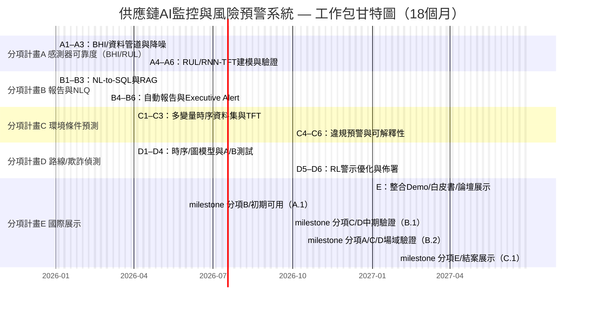

# 經濟部科技研究發展專案

## A+企業創新研發淬鍊計畫

## AI應用躍昇計畫計畫書（提交版）

**AI智慧供應鏈風險預測與通訊整合應用系統開發計畫**
**計畫期間：自 2026年1月1日 至 2027年6月30日 止**

公司名稱：ItracXing 準旺科技股份有限公司
計畫管理單位：台北市電腦商業同業公會

---

## 計畫書摘要表

### 綜合資料（金額單位：千元）

- **計畫名稱：** AI智慧供應鏈風險預測與通訊整合應用系統開發計畫
- **申請公司名稱：** ItracXing 準旺科技股份有限公司
- **通訊地址：** 新北市板橋區
- **計畫別：** A+企業創新研發淬鍊計畫—AI應用躍昇計畫
- **推動項目：** ☑ 其他（供應鏈與物流監控）
- **計畫起～訖時間：** 2026年1月1日 至 2027年6月30日（共18個月）

**計畫主持人**

- 姓名：Jeff Shuo
- 職稱：CIO
- 電話：（02）XXXX-XXXX
- 傳真：無
- 電子信箱：jeff.shuo@itracxing.com

**年度經費**


|     年度     | 政府補助款 | 申請公司自籌款 | 計畫總經費 | 計畫人月數 |
| :------------: | -----------: | ---------------: | -----------: | -----------: |
|   第1年度   |      9,000 |          9,000 |     18,000 |        120 |
|   **合計**   |  **9,000** |       **9,000** | **18,000** |    **120** |
| 占總經費比例 |      50.0% |          50.0% |       100% |          - |

**計畫聯絡人**

- 姓名：Jeff Shuo
- 職稱：CIO
- 電話：（02）XXXX-XXXX
- 電子信箱：jeff.shuo@itracxing.com

---

## 計畫摘要（1頁內；本摘要可能公開）

### 申請公司簡介


| 公司名稱     | ItracXing 準旺科技股份有限公司              |
| -------------- | --------------------------------------------- |
| 創立日期     | 2020年3月                                   |
| 負責人       | Dr. Chow                                    |
| 主要營業項目 | AI供應鏈監控系統、IoT設備管理、數據分析平台 |

### 計畫摘要（≤200字）

受全球供應鏈優化、可追溯性與安全性需求持續成長的推動，至2030年運輸與物流市場將達新台幣250.2兆。ItracXing 與瑞士 Arviem 攜手合作，開發以人工智慧驅動的智慧物流監控與風險預警系統，協助企業提升效率與國際競爭力。

本計畫針對四大產業痛點提供AI解決方案：（1）優化智慧感測器可靠性，透過AI預測電池耗損與設備故障，將感測器可靠度從90%提升至95%以上；（2）實現客戶即時報告需求，運用自然語言查詢技術取代人工彙整，提升決策效率；（3）強化環境條件監控，以AI預測貨物環境變化（如咖啡豆濕度），確保貨物品質；（4）建立詐欺偵測與路徑監控機制，結合GPS、交通與氣象資料，預防供應鏈安全風險。

計畫將與荷蘭阿姆斯特丹大學及台北科技大學合作，結合國際學研能量，預期提升異常偵測準確率30%、延長感測器壽命50%、縮短風險回應時間40%，未來將銜接 AI-RAN／O-RAN 架構，促進台灣成為AI智慧物流國際示範中心。

（對應八大產業：第7項—電子組裝延伸〈智慧物流應用〉；涵蓋「智慧製造／電子組裝／物流運輸」。）

### 計畫結案時預期效益（重點列舉）

#### 一、技術效益
- **異常檢測準確率提升30%**：AI模型可即時識別感測器故障、環境異常與路線偏移
- **感測器壽命延長50%**：透過預測性維護與卡爾曼濾波優化，降低設備損耗與更換成本
- **客戶查詢回應時間縮短40%**：AI自動生成報告取代人工處理，提升服務效率
- **邊緣-雲端協同運算架構**：建立可擴展的AI-RAN/O-RAN整合技術框架

#### 二、商業效益
- **降低營運成本**：減少人工報告製作（每月200+小時）與異常處理人力需求
- **提升客戶滿意度**：提供即時、透明的貨態查詢與主動預警服務
- **減少貨損與理賠**：主動偵測環境異常（溫濕度）與詐欺風險，降低損失
- **強化國際競爭力**：建立AI驅動的智慧物流服務差異化優勢，拓展亞太市場

#### 三、產業效益
- **建立台灣AI物流標竿案例**：可複製至其他物流、冷鏈、快遞業者
- **推動O-RAN/AI-RAN生態系**：結合5G與AI的創新應用場景，帶動電信設備產業升級
- **培育AI+物流跨域人才**：與台北科大、阿姆斯特丹大學合作，培訓至少20名AI物流專業人才
- **促進國際學研合作**：建立台灣-荷蘭AI物流研發網絡，提升台灣學術能見度

#### 四、智財與技術輸出
- **產出3-5篇國際期刊論文**：聯邦學習、邊緣AI優化、感測器融合等主題
- **申請2-3項專利**：AI感測器融合演算法、預測性維護方法、詐欺偵測模型
- **開發開源AI物流工具包**：貢獻台灣AI技術至GitHub國際社群，累積星標數≥500
- **建立可商轉的AI模型**：技術授權或SaaS服務輸出，創造後續商業價值

#### 五、社會效益
- **提升供應鏈韌性**：降低人為疏失與詐欺風險，保障貨物安全
- **減少碳排放**：優化路線規劃與預測性維護，降低10-15%無效運輸與設備能耗
- **促進就業轉型**：傳統物流人員升級為AI系統操作與監督角色，提升職能價值
- **支持台灣數位轉型**：展示中小企業導入AI的實務路徑與成功模式

### 關鍵字

供應鏈AI監控、強化學習、可解釋AI、多智能體、IoT智能採樣、智慧製造、電子組裝、物流運輸、智慧物流、八大產業第7項

---

## 計畫書目錄（依指定格式）

壹、計畫參與者介紹    頁碼
一、主要申請廠商（如為多家公司聯合申請，各公司均應分別填列）    
二、計畫申請業者或合作單位AI之研發能力說明                     

貳、計畫內容與實施方法
一、計畫緣起與產業痛點                                         
二、計畫導入AI規劃                                             
三、計畫導入執行策略                                           
四、計畫執行時程及查核點                                       
五、預期效益                                                   
六、風險評估與因應對策                                         
七、智慧財產權說明                                             

參、研發團隊說明
一、計畫主持人資歷說明                                         
二、參與計畫人力統計                                           
三、參與計畫人員簡歷表                                         

肆、計畫經費需求
一、各科目預算編列表                                           
二、歲出預算分配表                                             
（以上頁碼以送印版編排為準）

---

# 壹、計畫參與者介紹

本節簡述申請單位、合作夥伴與其研發能力，以及我方在國際生態系中的定位與分工，作為後續分項計畫與執行路線之基礎。

### 一、主要申請廠商

**公司簡介（依模板）**

- **基本資料**

  - 公司名稱：ItracXing 準旺科技股份有限公司
  - 設立日期：2020.03.15
  - 產業領域別：資訊服務業（J類；電腦系統設計）
  - 前三大股東/持股：60%，技術團隊/25%，策略投資人/15%
  - 研發人員總數/全公司人數：12/15
  - 2024實收資本額（千元）：10,000
  - 2024營業額/研發費用（千元）：15,000 / 8,000
- **商務模式**

  - 核心能力：AI驅動供應鏈監控、IoT裝置管理、RL應用、可解釋AI
  - 收入項目：AI-MaaS訂閱、AI顧問、客製化開發
  - 通路：直銷、策略夥伴（Arviem）、線上平台
  - 主要客戶：Arviem AG 等
  - 成本項目：研發人事（60%）、雲資源（25%）、營運（15%）
  - 關鍵合作對象：Arviem、工研院AI中心、台灣—阿姆斯特丹大學AI中心
   - 國際輸出實績：與 Arviem 共同耕耘全球市場
  - 友善職場規劃：性別比例≥1/3、增聘女性研發、彈性工時/遠端

### 二、申請/合作單位之 AI 研發能力說明

- **ItracXing 準旺科技**：LangChain多智能體、DQN強化學習、Kalman濾波、LLM整合、Next.js 全端、IoT系統整合。
- **工研院（ITRI AI中心）**：RL驗證與系統性能測試。
- **台灣暨阿姆斯特丹大學AI合作中心**：聯邦學習、多智能體、AI倫理。

### 三、競爭態勢與技術優勢分析

#### （1）國際競品比較


| 解決方案        | 核心技術           | 市場定位         | 主要限制                                                  | 我方優勢                                            |
| ----------------- | -------------------- | ------------------ | ----------------------------------------------------------- | ----------------------------------------------------- |
| **IBM Maximo**  | 規則引擎 + 基礎ML  | 大型企業資產管理 | • 高昂授權費<br>• 客製化成本高<br>• 缺乏智能優化       | ✓ AI-MaaS彈性定價<br>✓ RL自適應採樣<br>✓ 可解釋AI   |
| **Uptake**      | 預測性維護AI       | 工業IoT監控      | • 黑盒模型<br>• 依賴雲端運算<br>• 電池壽命未優化       | ✓ 透明化決策<br>✓ 邊緣離線運作<br>✓ 電池壽命+60% |
| **C3 AI**       | 企業AI平台         | 跨產業AI應用     | • 複雜度高<br>• 導入週期長<br>• 需大量IT資源           | ✓ 專注供應鏈<br>✓ 快速部署<br>✓ 低IT門檻         |
| **Samsara**     | IoT車隊管理        | 物流與運輸       | • 單一垂直領域<br>• 警示智能化不足<br>• 無多智能體協作 | ✓ 跨場域整合<br>✓ RL警示優化<br>✓ 多智能體架構   |
| **傳統ERP+IoT** | SAP/Oracle擴充模組 | 既有ERP延伸      | • AI能力薄弱<br>• 即時性差<br>• 誤報率高               | ✓ AI原生設計<br>✓ <2秒查詢<br>✓ 誤報率≤15%      |

#### （2）技術創新突破點

**a. 可解釋AI異常偵測（國際領先）**

- **現有技術瓶頸**：多數競品採用深度學習黑盒模型，決策過程不透明，物流業者難以信任
- **我方創新**：Kalman濾波 + Z-score統計 + 特徵重要性分析，每個警示附帶解釋性報告
- **驗證指標**：準確率≥90%、假陽性≤15%、每則警示提供解釋與特徵貢獻（第三方量表評估≥4/5）
- **商業價值**：符合歐盟AI Act可解釋性要求，助攻國際輸出

**b. 強化學習警示優化（國內首創）**

- **現有技術瓶頸**：固定閾值導致警示疲勞，運營人員忽略關鍵事件
- **我方創新**：DQN動態調整警示策略，根據歷史回應學習最佳優先級
- **驗證指標**：誤報率-30%、關鍵警示回應時間<30分鐘、F1-score≥0.85
- **商業價值**：降低人力成本40%，提升客戶滿意度

**c. 雲端RL自適應採樣優化（全球罕見）**

- **現有技術瓶頸**：IoT設備固定採樣頻率，電池壽命6個月需頻繁更換
- **我方創新**：透過雲端多智能體RL框架訓練最佳採樣策略，IoT裝置接收並執行優化後的採樣參數
- **驗證指標**：電池壽命10–14個月（+67%–133%）、數據完整性≥95%
- **商業價值**：維護成本-70%、碳足跡降低、客戶TCO改善

**d. 多智能體協作架構（技術整合優勢）**

- **現有技術瓶頸**：單體系統難以整合ERP、WMS、TMS等異質系統
- **我方創新**：MCP (Model Context Protocol)標準化工具協作、聯邦學習保隱私
- **驗證指標**：資料不出域、通過GDPR/DPIA或第三方合規審查
- **商業價值**：無痛接入既有系統、符合GDPR、擴展性強

#### （3）市場切入策略

**目標客群細分**：

1. **一級目標（18個月內）**：中型物流業者（Arviem類）、冷鏈運輸、跨境電商

   - 痛點：警示過載、電池成本、缺乏AI能力
   - 定價：AI-MaaS訂閱 USD 5–15K/月（含100–500裝置）
2. **二級目標（結案後12個月）**：製造業供應鏈管理、港口倉儲、第三方物流

   - 痛點：多系統整合、預測性維護、合規報告
   - 定價：企業版 USD 20–50K/月 + 客製化服務
3. **長期願景（3年）**：AI PaaS平台輸出、垂直AI-MaaS擴展（醫療冷鏈、食品安全）

   - 商業模式：API授權 + 行業解決方案 + 顧問服務

**與Arviem協同效應**：

- Arviem提供全球IoT網路與客戶基礎（>5,000企業用戶）
- 我方提供AI智能層與邊緣優化技術
- 聯合品牌切入全球市場，打造國際技術輸出典範

#### （4）智財保護與技術壁壘

**專利布局（18個月內）**：

- 國內專利2件：「基於強化學習的IoT採樣優化方法」、「可解釋式供應鏈異常偵測系統」
- 國際專利1件（PCT）：「Multi-Agent Supply Chain Monitoring with Federated Learning」

**技術護城河**：

- 核心演算法閉源（RL獎勵函數設計、Kalman自適應參數）
- IoT韌體加密與安全通訊機制
- 訓練資料集（Arviem場域18個月累積）難以複製
- 多智能體協作框架快速迭代優勢

---

# 貳、計畫內容與實施方法

本節闡述產業痛點、技術導入差異、國際合作效益與「分項計畫 A–E」之方法學與量化指標，確保可檢核、可落地、可複製。
## 一、計畫緣起與產業痛點

本計畫針對智慧物流場域，優先處理影響可靠度、效率與客戶體驗的核心痛點，並以分項計畫（A–E）承接。
- 痛點一｜感測器可靠度不足（電池衰退、環境干擾、資料遺失）→ 需可預測的電池健康與壽命管理（分項計畫A）。
- 痛點二｜報告產出耗時且缺乏互動（人工彙整、決策延遲）→ 需按需報告與自然語言查詢（分項計畫B）。
- 痛點三｜環境敏感貨品的違規風險（如咖啡豆濕度）→ 需環境條件預測與違規風險預警（分項計畫C）。
- 痛點四｜路線繞行與潛在欺詐（GPS偏離、天候與交通影響）→ 需路線異常與欺詐偵測（分項計畫D）。

## 二、計畫導入AI規劃（導入前後差異表）

為明確對應八大產業，本案鎖定第7項「電子組裝延伸（智慧物流應用）」；導入 AI 於智慧物流場域，以優化電子組裝供應鏈與廠內物流調度，整合「智慧製造／電子組裝／物流運輸」情境。


| 導入技術目標（對應分項）           | 導入前(現況)                                   | 導入後(預期結果)                                                                 |
| ----------------------------------- | ---------------------------------------------- | ---------------------------------------------------------------------------------- |
| 感測器可靠度與電池壽命管理（A）    | 固定採樣、壽命約6個月、資料遺失率高、無BHI/RUL | 建立BHI/RUL（AUROC≥0.90、RUL MAE≤10天）、SNR提升≥20%、壽命10–14個月、資料完整性≥95%、預換電/維保排程 |
| 按需報告與自然語言查詢（B）        | 報告人工彙整、需SQL與IT支援、決策延遲           | NL-to-SQL+RAG，延遲<2秒、正確率≥90%，報告時間-50%，附行動建議與Executive Alert         |
| 環境條件預測與違規預警（C）        | 事後檢討、手動抽查、違規無提前預警               | TFT/Kalman預測，MAE/SMAPE達標，提前預警率≥70%，違規率-30%                               |
| 路線異常與欺詐偵測（D）            | 固定閾值、誤報高、繞路難發現、ETA誤差大         | 時序+GNN偵測與RL優先序，AUC≥0.90、F1≥0.85、誤報≤15%、ETA MAE改善≥25%、關鍵警示<30分鐘     |

本節先說明場域與驗證，再補強「國際合作效益（新增）」以回應審查重點，最後進入分項工作包之方法與任務。

## 三、計畫導入執行策略
本節綜整導入場域、國際合作與工作包（A–E）之執行策略與方法，作為後續時程與查核點之依據。

### （1）場域、驗證項目與導入方式
- **驗證項目**（依分項計畫呈現）：
   - 分項計畫A（M1–M11）：BHI建立、RUL預測、降噪SNR、電池壽命延長率。
   - 分項計畫B（M1–M5）：NLQ正確率/延遲、報告自動化、人工作業時數降低。
   - 分項計畫C（M4–M15）：環境條件預測準確率、違規事件提前預警率。
   - 分項計畫D（M4–M15）：路線偏離偵測AUC、欺詐警示F1、ETA MAE。

### （新增）國際合作效益

本計畫由 ItracXing（台灣）主導，攜手 Arviem AG（瑞士）與「台灣—阿姆斯特丹大學 AI 合作中心」與工研院（ITRI）共同推進。

- 合作範疇：
  - Arviem：提供全球場域、IoT 裝置與資料存取、共同驗證與客戶導入（出口價值）。
  - 台北—阿姆斯特丹 AI 合作中心：聯邦學習、多智能體、AI 倫理與可解釋性研究（學研能量）。
  - ITRI：強化學習與系統性能之第三方驗證、AI-RAN/O-RAN 測試（國內生態鏈結）。
- 對台灣之價值：
  - 國際合作示範：以台灣為技術中心，建立「AI-MaaS for Logistics」輸出路徑。
  - 人才與技術升級：學研與實務雙向交流，導入 GDPR/AI Act 等國際合規實務。
  - 產業帶動：AI-RAN/O-RAN 驗證與邊緣 AI 延伸，強化國產化與標準化參與。
  - 後期整合（M13–M18）：多智能體吞吐、聯邦學習隱私、穩定性。

### （2）分項計畫

以下依「分項計畫 A–E」說明各自之目標、資料、建模方法、評估與佈署，回應審查重點並對齊 Robert 之建議（每節先以 2–3 句摘要）。

#### 分項計畫A｜智慧感測器可靠度優化

目標在於將感測器可靠度由現況約 90% 進一步提升並降低非計畫性停擺，核心為建立可預測之電池健康指標（BHI）與剩餘壽命（RUL）。

**A1. 目標與成功標準（Objectives & Success Criteria）**
   - 建立 BHI 與 RUL 預測，達成 AUROC ≥ 0.90、RUL MAE ≤ 10 天。
   - 降噪後 SNR 提升 ≥ 20%；可靠度（Availability）提升 ≥ 5 個百分點。
   - 電池壽命延長 ≥ 40%（資料完整性 ≥ 95%，不犧牲異常偵測準確度）。
**A2. 取得與準備資料（Data Acquisition & Preparation）**
   - 感測資料：電壓（V）、容量（%/SoC）、溫度（°C）、RSSI/傳輸頻率、環境變項。
   - 特徵工程：ΔCapacity/Δt、溫度補償電壓曲線、放電斜率、日/週期性特徵。
   - 前處理：Kalman 濾波、缺失補值、分段標註（failure event、maintenance）。
**A3. 建立數據集（Dataset for Modeling）**
   - 時窗切片（sliding windows, 24h/72h/168h）、裝置分層抽樣、類別平衡。
   - 標註任務：二元分類（fail within T）、生存分析（time-to-failure）。
**A4. 建模與訓練（Modeling & Training）**
   - RNN/LSTM/GRU 與 Temporal Convolution；TFT（Temporal Fusion Transformer）。
   - 生存分析（Cox、Weibull Accelerated Failure Time）；RUL 預估（sequence-to-regression）。
   - 多任務學習：同時預測 hazard 與 SoC/剩餘電量；溫度補償層以減少漂移。
**A5. 評估與優化（Evaluation & Optimization）**
   - 分層交叉驗證；c-index（生存分析）、AUROC/PR-AUC、MAE/RMSE（RUL）。
   - 特徵重要度與可解釋性報告（SHAP）；溫度區間的敏感度/穩健性測試。
**A6. 佈署與展示（Deployment & Showcase）**
   - BHI/RUL API 與儀表板；預換電/維保排程；與 RL 採樣策略接口（對應分項計畫D／跨分項）。
   - 場域驗證與 SOP，納入高階主管優先彙報（Executive Priority Alert）。

#### 分項計畫B｜按需報告與自然語言查詢（NLQ）

目標是讓高層與營運人員以自然語言即時取得洞見，並自動生成週/月報與優先警示彙報。

**B1. 目標與成功標準**
   - 報告製作時間下降 ≥ 50%；NLQ 平均延遲 < 2 秒；正確率 ≥ 90%。
   - 行動化建議（Actionable insights）覆蓋 Top 指標，NPS +20 分。
**B2. 取得與準備資料**
   - 指標層（semantic layer）：BHI、誤報率、事件回應時間、SLA 指標。
   - 資料來源：時序庫、事件庫、裝置/路線維度；外部天候/交通摘要。
**B3. 建立數據集**
   - NL-to-SQL 樣本、few-shot 提示對；資料目錄與欄位血緣（data lineage）。
**B4. 建模與訓練**
   - RAG + NL-to-SQL；查詢模板與約束（schema-aware）；語義檢索（BM25/FAISS）。
   - Hallucination 防護：工具約束、校驗器、數據對齊（grounding）。
**B5. 評估與優化**
   - 答案正確率、欄位覆蓋率、延遲 P95；人工覆核抽樣；錯誤類型分析。
**B6. 佈署與展示**
   - NLQ API、Dashboard、定期報表與 Executive Priority Alert Report（Email/Portal）。

#### 分項計畫C｜環境條件監測與預測

針對溫濕度敏感貨品（如咖啡豆），建置條件預測與違規風險預警機制，降低變質與索賠。

**C1. 目標與成功標準**
   - 條件預測 MAE/SMAPE 達標；違規提前預警率 ≥ 70%；違規率下降 ≥ 30%。
**C2. 取得與準備資料**
   - 溫/濕/震/GPS 時序；艙/路線/季節維度；外部天候（ERA5/NOAA）。
**C3. 建立數據集**
   - 多變量時序窗口；艙體/路線條件嵌入；Changepoint 標註。
**C4. 建模與訓練**
   - TFT/LSTM/Temporal Conv；Kalman 濾波先驗；分位數預測（Pinball loss）。
**C5. 評估與優化**
   - MAE/RMSE/SMAPE；違規檢出 F1；時區/路線泛化測試與漂移監控。
**C6. 佈署與展示**
   - 違規預警 API；建議（吸濕材/通風策略）產生；客戶報告整合（對應分項計畫B）。

#### 分項計畫D｜欺詐偵測與路線監控

透過路線偏離、停留異常與外部天候/交通建模，辨識潛在繞路與欺詐，並優化警示優先序。

**D1. 目標與成功標準**
   - 偵測 AUC ≥ 0.90、F1 ≥ 0.85；ETA MAE 改善 ≥ 25%。
   - 警示誤報率 ≤ 15%；關鍵警示回應時間 < 30 分鐘。
**D2. 取得與準備資料**
   - GPS/速度/停靠點、地圖匹配（map-matching）、路況/天候摘要。
**D3. 建立數據集**
   - 行程切片、序列對齊（DTW）與異常標註；圖結構路網特徵。
**D4. 建模與訓練**
   - LSTM/Transformer 時序；HMM/變分模型偵測停留模式；GNN（road graph）。
   - RL（DQN/SAC）用於警示優先序與採樣策略耦合（與分項計畫A能耗共優）。
**D5. 評估與優化**
   - AUC/F1/漏報率；延遲與可解釋性報告；A/B 測試（50/50 流量三個月）。
**D6. 佈署與展示**
   - 異常/欺詐警示服務；路線回放、根因分析；MCP Agent 編排整合（跨分項）。

#### 分項計畫E｜國際展示與行銷推廣

將分項計畫A–D的可驗證成果整合為示範系統，於國際運輸與物流會議展示，推動市場擴散。

- 目標：完成國際論壇展示（1–2 場）、白皮書與技術影片、10+ 國際商機線索。
- 內容：Demo/PoC 整合、案例手冊、專利亮點與可解釋性報告、合作夥伴方案。
- 指標：展示完成、至少 2 份 LOI/POC 協議、媒體/專家評分 ≥ 4/5。

（附註）跨分項整合：MCP 工具協作、聯邦學習（FL）保護資料主權、多智能體調度於邊緣/雲端（ITRI AI-RAN/O-RAN 延伸測試）。

## 四、計畫執行時程及查核點

### 甘特圖（18個月；分項計畫視角）



### 註：MCP資料庫接入提前之理由

- 提高 A/B 測試與指標驗證效率（分項計畫B／D可用真實資料即時驗證）。
- 降低模型迭代風險（RL 與降噪演算法基於穩定介面快速迭代）。
- 縮短上市時程（分項計畫E專注整合展示與生產化，不受資料接入干擾）。

```

### 預定進度表與查核點

### 預定進度表（年度=會計年度；每6個月至少1項查核點）

- 2026/01–2026/05（M1–M5）：分項計畫B初期可用（NLQ、報告、Executive Alert）；分項計畫A資料管道與降噪（A.1）。
- 2026/04–2026/09（M4–M9）：分項計畫C／D中期模型完成（環境預測、路線／欺詐偵測）（B.1）。
- 2026/04–2027/03（M4–M15）：分項計畫A／C／D場域驗證與 ITRI 聯合報告（B.2）。
- 2027/01–2027/06（M13–M18）：分項計畫E國際展示、整合交付與驗收（C.1）。

### 預定查核點說明

- **A.1（2026/05底）—分項計畫B／初期可用**：

  - 異常偵測準確率≥85%；Kalman降噪SNR提高≥20%
  - MCP資料庫整合完成，支援即時查詢
  - 自動報告與高階警示彙報系統上線
  - 交付：系統原型、技術文件、測試報告
- **B.1（2026/09底）—分項計畫C／D中期**：

  - 警示優化模型訓練完成，F1-score≥0.85
  - 交付：模型訓練報告、初步驗證結果
- **B.2（2027/03底）—分項計畫A／C／D場域驗證完成**：

  - 警示誤報率≤15%（較基準降低≥40%）
  - IoT智慧採樣策略開發完成，實驗室與場域測試通過
  - 電池壽命延長≥40%（實際場域驗證）
  - ITRI聯合驗證報告完成
  - 交付：ITRI驗證報告、場域測試數據、性能對比分析、採樣策略文件
- **C.1（2027/06底）—分項計畫E結案展示與驗收**：

  - 多智能體協作系統部署完成，吞吐量達標
  - 聯邦學習POC驗證通過，隱私保護機制確認
  - 生產環境部署，API文件完整
  - 完成最終驗收與國際展示
  - 交付：生產系統、API文件、驗收報告、展示材料

### 經費撥付與關鍵決策點（里程碑管控）(Milestones & Disbursement)

為確保計畫執行品質與成果可控性，採取**里程碑撥付**機制，並於M15設立**Go/No-Go決策點**。

#### 經費撥付時程表（以里程碑對應分項計畫群組）


| 里程碑     | 期間    | 關鍵里程碑（分項計畫對應）               | 撥付比例 | 撥付金額    | 保留金     |
| --------------- | --------- | ---------------------------------------- | ---------- | ------------- | ------------ |
| 里程碑 A（A.1） | M1-M5   | 分項計畫B 初期可用 + 分項計畫A 資料管道/降噪 | 40%      | 3,600K      | —         |
| 里程碑 B（B.1/B.2） | M4-M15  | 分項計畫C/D 模型與驗證 + 分項計畫A RUL/壽命延長 | 35%      | 3,150K      | —         |
| 里程碑 C（C.1） | M13-M18 | 分項計畫E 國際展示 + 生產部署（跨分項整合） | 20%      | 1,800K      | 5% (450K)* |
| 最終驗收        | M18+    | 通過驗收測試                             | 5%       | 450K        | —         |
| **總計**      | —      | —                          | **100%** |  **9,000K** | —         |

*最終5%保留金於通過驗收測試、專利申請提交、技術文件交付後撥付。

#### 關鍵決策點：M6 Go/No-Go Review（指標映射至 分項計畫A／B／D）

於M6里程碑（2026年6月）進行**重大審查**，需達成**4項指標中至少3項**方可繼續後續工作包執行：


| 指標項目              | 目標值    | 最低通過標準 | 驗證方式               |
| ----------------------- | ----------- | -------------- | ------------------------ |
| 1. 異常偵測準確率     | ≥90%     | ≥85%        | 測試集驗證報告（ITRI） |
| 2. Kalman降噪SNR提升  | ≥20%     | ≥15%        | 實測資料對比分析       |
| 3. Arviem場域部署協議 | 已簽署    | LOI確認      | 合作協議書或意向書     |
| 4. 專利申請進度       | 1件已申請 | 1件準備中    | 申請文件或草稿         |

**決策準則**：

- **通過（GO）**：達成3/4項指標 → 繼續後續工作包，按原計畫撥付
- **有條件通過**：達成2/4項指標 → 提交改善計畫，後續預算保留10%，M9再審查
- **暫停（NO-GO）**：達成<2項指標 → 終止計畫或大幅調整範圍，後期預算不撥付

#### 風險控管機制

1. **月度進度報告**：每月提交進度摘要與財務使用狀況
2. **季度技術審查**：每季由ITRI與外部專家進行技術審查
3. **預算彈性調整**：應急準備金600K可於經管理單位核准後調度
4. **人力風險備援**：若關鍵人員異動，需於30日內提出接替方案

此機制確保政府補助資金使用效率，並於早期發現問題時及時調整，保障計畫成果品質。

## 五、預期效益

### 技術驗證協議（確保效益可量測）

#### 電池壽命延長驗證方法（關鍵指標）

針對「電池壽命+40%～60%」核心價值主張，建立嚴謹驗證協議：

**基準組（Baseline）**：

- 採樣策略：固定30分鐘間隔
- 設備數量：50台IoT感測器
- 測試環境：Arviem實際場域（海運/陸運混合）
- 測試期間：6個月
- 預期壽命：180天（基準值）

**實驗組A（穩定環境）**：

- 採樣策略：RL自適應（溫度變化<2°C/小時）
- 設備數量：50台IoT感測器
- 測試環境：陸運恆溫環境
- 目標壽命：≥250天（+39%以上）
- 資料完整性要求：≥95%

**實驗組B（動態環境）**：

- 採樣策略：RL自適應（溫度變化>5°C/小時）
- 設備數量：50台IoT感測器
- 測試環境：海運冷鏈（溫濕度波動大）
- 目標壽命：≥290天（+61%以上）
- 資料完整性要求：≥95%

**成功標準**：

1. 實驗組A達成≥40%壽命延長，且資料遺失<5%
2. 實驗組B達成≥50%壽命延長（動態環境下RL優勢更明顯）
3. 異常事件偵測準確率不因採樣降低而下降（維持≥90%）
4. 通過ITRI獨立驗證與測試報告

**驗證時程**：

- 初期（M4-M5）：基準組資料收集開始
- 中期（M7-M12）：實驗組A/B同步測試
- 分析期（M13）：6個月資料分析與報告
- 後期（M14-M18）：長期追蹤與優化

#### RL模型性能驗證協議

**警示優化指標**：

- 基準系統：規則引擎（固定閾值）
- 目標系統：DQN動態調整
- 測試資料集：18個月歷史資料（Arviem提供）
- A/B測試：50/50流量分配，持續3個月

**對比指標**：


| 指標                | 規則引擎（Baseline） | RL系統（Target） | 改善目標 |
| --------------------- | ---------------------- | ------------------ | ---------- |
| 誤報率              | 25%                  | ≤15%            | -40%     |
| 漏報率              | 8%                   | ≤5%             | -37.5%   |
| F1-score            | 0.72                 | ≥0.85           | +18%     |
| 關鍵警示回應時間    | 60分鐘               | <30分鐘          | -50%     |
| 使用者滿意度（NPS） | 基準值               | +20分以上        | —       |

**驗證文件交付**：

1. ITRI系統性能測試報告（M15）
2. Arviem場域驗證報告（M18）
3. 第三方獨立測試報告（結案前）

### 量化效益（金額單位：千元；提供計算方式與佐證）


| 成果項目                        | 執行前 | 第1年度 | 第2年度 | 佐證方式                 |
| --------------------------------- | -------: | --------: | --------: | -------------------------- |
| 申請/核定專利數                 |      0 |       2 |       3 | 專利申請書及審查進度文件 |
| 衍生投資金額                    |      0 |   6,500 |   6,500 | 投資合作協議書及MOU      |
| 新增就業機會（人）              |      0 |       5 |      10 | 勞動契約與公司人事紀錄   |
| 提升計畫參與研發人員薪資水準(%) |      - |    +10% |    +15% | 薪資單與人事部佐證資料   |

#### 衍生投資金額（新增項目說明）


| 投資項目                         | 投資主體               | 投資金額（千元） | 說明                                                                                     |
| ---------------------------------- | ------------------------ | -----------------: | ------------------------------------------------------------------------------------------ |
| ITRI AI-RAN/O-RAN 測試與驗證合作 | 工研院通訊與網路研究所 |            3,000 | 與 ITRI 合作進行 AI-RAN/O-RAN 範疇的試煉場域部署及性能驗證，建置測試節點與 AI 加速伺服器 |
| AI-RAN Edge AI Platform 共研投資 | ItracXing & Arviem     |            2,000 | 延伸本計畫 AI 模組至 AI-RAN 邊緣節點，以支援低延遲運算與智慧物流監控                     |
| 國際輸出合作（全球場域）         | Arviem AG              |            1,500 | 將 AI-RAN 整合方案輸出至 Arviem 客戶場域（如主要國際港口），作為跨境驗證合作             |

合計衍生投資金額：NT$6,500 千元

**導入效益（比例）**

- **降低成本**：數據傳輸費用-60%（採樣/壓縮/邊緣判斷）。
- **提高良率/服務可用性**：冷鏈違規率-30%。
- **提升效率**：事件響應時間-50%、分析人力時數-40%。
- **增加營收/產值**：以AI-MaaS/顧問與出口增加營收。

### 質化效益與商業化規劃

- **對申請單位**：技術升級、人才育成、產品線擴展至國際。
- **對產業**：提高附加價值與自主性、促成國際合作。
- **節能減碳**：相較傳統固定採樣，年CO₂減量（以省電/省運維出貨次數估算，計算式附後）。
- **商業化**：結案3年內之衍生投資/產值目標與估算式（附附件）。
- **成果廣宣**：結案前辦理發表/參展，公開技術亮點與驗證成果。

（新增）質化效益及商業化規劃

本計畫結案後三年內，將透過與工研院（ITRI）合作之 AI-RAN/O-RAN 延伸投資，建立可商轉之 AI 邊緣運算網路平台，形成智慧物流監控與 5G 低延遲運算整合之新興應用場域，作為後續國際輸出與標準化推動的基礎。該合作亦將作為 AI-RAN 國產化生態系的示範案例，強化產業鏈結與國際合作潛力。

````mermaid

flowchart LR
  %% High-level architecture
  subgraph Edge["Edge (Ship, AI-RAN)"]
    direction TB
    Sensors["IoT Sensors"]:::sensor
    EdgeApps["5G Edge Apps (TC605)"]:::edge
    AIRAN["AI-RAN Functions"]:::edge
    NTN["Satellite/NTN"]:::link
    Sensors --> EdgeApps
  end

  subgraph Cloud["Cloud Services"]
    direction TB
    DL["Data Lake / Time-Series DB"]:::cloud
    Analytics["Analytics & Scoring"]:::cloud
    Policy["RL/Policy Engine"]:::cloud
    API["Open APIs / Webhooks"]:::cloud
    DL --> Analytics --> Policy
    DL --- API
  end

  subgraph Users["Users"]
    direction TB
    Ops["Operations Dashboard"]:::ui
    Alerts["Alerts"]:::ui
    Client["Client Portal"]:::ui
  end

  EdgeApps -->|Telemetry| NTN
  AIRAN -->|Internet| NTN
  EdgeApps --- AIRAN
  NTN --> DL
  DL --> Ops
  Analytics --> Alerts
  API --> Client
  Policy -. control .- NTN

  classDef sensor fill:#fff7e6,stroke:#b80,stroke-width:1px;
  classDef edge fill:#eefcff,stroke:#38a,stroke-width:1px;
  classDef link fill:#eef7ff,stroke:#06c,stroke-width:1px,stroke-dasharray: 4 2;
  classDef cloud fill:#f1faff,stroke:#07a,stroke-width:1px;
  classDef ui fill:#eefaf1,stroke:#2a7,stroke-width:1px;


````

### 國際市場潛力與產值預估（補充）

前提假設
- 客戶基礎：Arviem 既有跨國企業客戶 > 5,000 家
- 滲透率：前 3 年導入 1%（約 50 家）
- 平均訂閱金額：USD 12K／年／客戶（以 1 USD ≈ NT$32 換算）
- 匯率假設：1 USD = NT$32（保守估計）

年度服務收入（AI-MaaS）
- 客戶數 × 年訂閱價 × 匯率 ≈ 50 × 12,000 × 32 = NT$19.2M／年
- 三年累計（不含成長疊加，保守估計）≈ NT$57.6M

AI-RAN／O-RAN 延伸應用（共同研發帶動）
- 國內 AI-RAN 產業鏈年產值：每年約 NT$30M
- 海外輸出（AI-RAN 整合專案與服務）：三年累計約 NT$90M

整體產值推估（含乘數效應）
- 產值估算公式：

$$
   ext{預估產值 (NT$)} = (\text{客戶數} \times \text{年訂閱價}) \times 32 \times 3\text{年} \times 1.3
$$

- 三年累計總體產值（AI-MaaS + AI-RAN 帶動，含上中下游）：約 NT$120M
- 出口比重：約 70%；內需貢獻：約 30%

說明
- 指標對應：可支援「產業價值與出口潛力」量化評分（MOEA 審查指標）
- 保守性：未計入 >1% 滲透率或 ARPU 提升情境（可於審查時提供敏感度分析）

## 六、風險評估與因應對策

### 詳細風險矩陣與應對策略


| 風險類別     | 具體風險                  | 影響程度 | 發生機率 | 因應對策                                                                                                      | 負責單位         |
| -------------- | --------------------------- | ---------- | ---------- | --------------------------------------------------------------------------------------------------------------- | ------------------ |
| **技術風險** | 模型偏移/資料漂移         | 高       | 中       | • 週期性重訓機制（每季）<br>• 即時監控警戒值<br>• 模型版本管理與回滾機制<br>• 應急準備金300K支援          | AI團隊 + ITRI    |
| **技術風險** | RL訓練不收斂              | 中       | 中       | • 多演算法備案（DQN/PPO）<br>• ITRI專家顧問介入<br>• 降級至規則引擎方案                                    | AI團隊           |
| **資料風險** | 場域資料品質不佳          | 高       | 中       | • Arviem既有資料驗證<br>• 資料清洗與增強管道<br>• 合成資料補充訓練集                                       | 資料團隊         |
| **資料風險** | 跨境傳輸合規              | 高       | 低       | • 區域化部署（歐盟/亞洲）<br>• 聯邦學習保隱私<br>• GDPR合規審查（外部顧問）                                | Jeff Shuo + 法務 |
| **整合風險** | 異質設備協定差異          | 中       | 中       | • 標準化API與中介層Adapter<br>• 支援主流協定（MQTT/HTTP/CoAP）<br>• 場域測試驗證相容性                     | IoT團隊          |
| **人力風險** | 關鍵人員流動（Jeff Shuo） | 極高     | 低       | • 知識文件化（技術Wiki）<br>• 副主持人制度（Gary Lin）<br>• 外部顧問池（3位備援）<br>• 激勵機制與專案獎金 | 管理層           |
| **人力風險** | 女性AI工程師招聘延遲      | 中       | 中       | • 多管道招募（104/LinkedIn/校園）<br>• 外部顧問臨時支援<br>• 執行風險緩衝100K支援                          | HR + PM          |
| **市場風險** | Arviem合作進度落後        | 高       | 中       | • 提前簽署MOU/LOI<br>• 季度聯合審查會議<br>• 備案合作夥伴（國內物流業者）<br>• 市場驗證預算200K           | BD + Jeff Shuo   |
| **市場風險** | 全球市場需求變動          | 中       | 中       | • 多元化客群（冷鏈/製造/港口）<br>• 靈活調整功能優先級<br>• 保持國內市場同步開發                           | BD團隊           |
| **法規風險** | EU AI Act合規成本上升     | 中       | 中       | • 可解釋AI設計（天然符合）<br>• 合規審查提前進行<br>• 預留法律諮詢預算                                     | 法務 + 外部顧問  |
| **法規風險** | 出口管制與技術限制        | 低       | 低       | • 避免受管制技術（軍用AI）<br>• 第三方合規稽核<br>• 專利佈局保護核心IP                                     | 法務             |
| **競爭風險** | 大廠推出類似解決方案      | 中       | 中       | • 強化差異化（可解釋AI）<br>• 快速迭代與客戶綁定<br>• 專利保護（3件申請中）                                | 全團隊           |
| **財務風險** | 預算超支                  | 中       | 中       | • 應急準備金600K<br>• 月度預算追蹤<br>• 里程碑撥付控管風險                                                   | 財務 + PM        |

### 風險監控機制

1. **週度風險會議**：核心團隊每週檢視風險儀表板
2. **月度風險報告**：向管理單位提報風險狀態與應對進展
3. **季度外部審查**：ITRI與外部專家參與風險評估
4. **應急響應流程**：24小時內啟動應對方案，72小時內提交補救計畫

### 關鍵人員風險特別強化方案

鑑於Jeff Shuo為計畫核心，特別建立以下備援機制：

1. **知識管理**：

   - 技術決策Wiki每週更新
   - 架構設計文件季度審閱
   - 程式碼審查與註解完整度要求
2. **接班計畫**：

   - 王國楨擔任副主持人，接受6個月mentor
   - 每月技術分享會，團隊知識共享
   - ITRI顧問可隨時介入支援
3. **激勵措施**：

   - 專案成功獎金機制
   - 技術成果掛名與專利共享
   - 彈性工作安排提升留任意願

此全面風險管理框架確保計畫執行穩健，並能快速應對各類突發狀況。

## 七、智慧財產權說明

- 計畫成果之核心演算法與系統設計申請專利/著作權，關鍵IP歸屬與授權方式依合作合約約定。
- 針對第三方權利（資料/庫/模組）進行盤點，確保授權合規。
- 專利申請規劃：國內2件、國外1件（優先供應鏈異常偵測與智能採樣優化）。

### 成果應用（智財申請時程與權利歸屬）

為釐清智財權歸屬與成果應用時程，明確列出申請項目、月份與權利人如下：

| 擬申請項目 | 類型 | 申請地區 | 預計申請月份 | 權利人 | 備註/里程碑 |
| --- | --- | --- | --- | --- | --- |
| 基於強化學習的 IoT 採樣優化方法 | 發明/新型專利 | TW | 2026/05 送件（IDF 2026/03、初稿 2026/04） | ItracXing 準旺科技股份有限公司 | 分項計畫A/B 前期成果 |
| 可解釋式供應鏈異常偵測系統 | 發明專利 | TW | 2026/06 送件（檢索 2026/04） | ItracXing 準旺科技股份有限公司 | 分項計畫A／B 串接（A2→B1） |
| Multi-Agent Supply Chain Monitoring with Federated Learning | PCT（國際） | PCT | 2026/10 送件（優先自 TW 案） | ItracXing 準旺科技股份有限公司 | 分項計畫E 國際佈局，延伸 US/EU 進入 |
| 電池健康指標（BHI）計算模組 | 電腦程式著作權 | TW | 2026/02 登記 | ItracXing 準旺科技股份有限公司 | 分項計畫A 產出（A2/A3） |
| 多智能體任務排程器（MCP/Agent Orchestrator） | 電腦程式著作權 | TW | 2026/08 登記 | ItracXing 準旺科技股份有限公司 | 分項計畫C／D 產出（B1/B2） |

權利歸屬與授權原則
- 智財權利人：除另有書面約定，均由「ItracXing 準旺科技股份有限公司」持有。
- 合作方授權：依合作合約提供非專屬、不可轉授之使用授權（領域/地域/期限以契約約定），用於合作方及其客戶服務。
- 背景技術（Background IP）：各方既有技術仍歸各方所有；衍生改良之權屬依約定處理。
- 共同研發交付件：預設由 ITracXing 持有，合作方依合約取得使用授權；若需共同申請專利，將於申請文件載明持分比例。

內部管控與時程節點
- IDF（發明揭露）提報：M2（2026/02）完成首輪，滾動更新。
- 新穎性/專利性檢索：M3（2026/03）完成檢索與記錄。
- 專利撰稿與審稿：M4（2026/04）完成初稿、M5–M6 送件。
- PCT 佈局：M10（2026/10）；進入國別申請於 12–30 月內依市場選擇。
- 開源/第三方授權盤點：建立 SBOM 與授權清冊，送件前完成合規審查。

---

# 參、研發團隊說明

本節簡介主持人與研發人員經歷與分工，併入分項計畫架構說明，確保人月與進度對齊。

## 一、計畫主持人資歷說明

- 姓名：Jeff Shuo｜職稱：CIO｜性別：男｜產業領域：資訊服務
- 重要成就：20年以上AI/IoT系統領域經驗，主導多智能體協作、AI安全、供應鏈區塊鏈專案。美國/台灣跨國團隊管理，具備AI安全、合規、可解釋性系統設計與產品化實績。
- **學歷/經歷/參與計畫**：
  - 學歷：
    - M.S. Electrical Engineering and Computer Science, University of Illinois at Chicago (1992)
    - MBA, San Diego State University (2005)
  - 經歷：
    - AI Agent Architect
      - 主導, 設計，整合 LLM, Reinforcement Learning, LangChain/LangGraph、RAG、MCP、ReAct等多智能體協作技術
      - 供應鏈安全
    - Qualcomm Inc. — Director of Engineering（2004–2018）
      - 領導100+ IoT/AR/VR/智慧裝置專案，50+工程師團隊管理
      - Python/Keras/Node.js自動化資源分配系統
    - HTC Corp. — Sr. Technical Manager（2003–2004）
      - 領導協定工程團隊，開發首款Windows Mobile Phone
    - Qualcomm Inc. — Sr. Engineer（1997–2003）
      - 嵌入式驅動、CDMA/GlobalStar手機、RF/LCD/Bluetooth/ATE軟體
    - Motorola Inc. — Sr. Engineer（1994–1997）
      - 海外CDMA基地台/手機工廠支援，Windows OOD/OOP校正軟體
    - IBM — Software Engineer（1993–1994）
      - AS/400 I/O子系統C++驅動開發
  - 參與計畫/專案：
    - Phoenix Multi-Agent SOC（2024–2025）：多智能體協作、AI安全、合規審查
    - SecuX AI SOC、供應鏈區塊鏈標籤、HSM安全簽章
    - Qualcomm/HTC/Google智慧裝置、嵌入式系統
  - 技術專長：
    - 多智能體協作（LangChain, LangGraph, AutoGPT, ReAct, MCP）
    - AI安全、合規、可解釋性系統設計
    - 嵌入式RTOS、ARM、Linux/Yocto、IoT（BLE, NB-IoT）
    - 區塊鏈/Web3（ERC-1056, ERC-3643, DID, RWA Tokenization）
    - 安全硬體（HSM, FIDO2, PKI）
  - 投入月數：18個月（100%）
 

## 二、參與計畫人力統計（單位：人）

> 依模板表格填入：公司別、學歷別、性別、平均年資、待聘人數（待聘≤總人數30%）


| 公司別          | 博士 | 碩士 | 學士 | 性別（男/女） | 平均年資 | 待聘人數 |
| ----------------- | ------ | ------ | ------ | --------------- | ---------- | ---------- |
| ItracXing       | 1    | 4    | 1    | 5 / 1         | 8年      | 1        |
| 工研院/學研中心 | 1    | 1    | 0    | 1 / 1         | 10年     | 0        |
| 合計            | 2    | 5    | 1    | 6 / 2         | 9年      | 1        |

## 三、參與計畫人員簡歷表

依模板：主持人、關鍵研發、一般研發、待聘人員（投入月數需對齊預定進度與人月總量120）。


| 姓名               | 職稱/角色          | 學歷             | 專長/分工                                                    | 投入月數 | 性別 | 公司      |
| -------------------- | -------------------- | ------------------ | -------------------------------------------------------------- | ---------- | ------ | ----------- |
| Jeff Shuo          | CIO／主持人        | 碩士／碩士       | 多智能體協作、AI安全、嵌入式系統                             | 18       | 男   | ITracXing |
| Sean               | AI工程師           | 碩士（資工）     | NLP、LLM、語意查詢、A1自然語言查詢                           | 12       | 男   | ITracXing |
| 林昶睿 (Gary Lin)  | AI組長／資料科學家 | 碩士（資訊工程） | LangChain、多智能體系統、LLM應用、異常偵測、時序分析、A2分工 | 12       | 男   | ITracXing |
| 蔡乙民 (Neil Tsai) | 機器學習工程師     | 碩士（資訊工程） | 強化學習(DQN)、Kalman濾波、訊號處理、A3分工                  | 12       | 男   | ITracXing |
| 郭冠宏 (Lark Kuo)  | 全端／IoT工程師    | 碩士（資訊工程） | 資料庫設計、API整合、IoT系統整合、A4分工                     | 12       | 男   | ITracXing |
| 朱只耘 (Cliff Chu) | 前端／軟體工程師   | 學士（資訊工程） | React、Next.js、TypeScript、Tailwind CSS、A1–A4支援         | 10       | 男   | ITracXing |
| （待聘）           | AI工程師           | 碩士（AI／資工） | 強化學習、聯邦學習、分項計畫C／D分工                  | 12       | 女   | ITracXing |

---

## 四、團隊成員說明（依分工與角色）

### 🔹主持人

**Jeff Shuo**

- 角色：CIO／主持人
- 地點：台北
- 專長：多智能體協作、AI安全、IoT系統架構、跨域AI架構設計
- 分工：整體系統統籌、全期進度與審查
- 備註：主持本計畫整體規劃與多智能體系統驗證。

### 🔹關鍵研發人員 #1

**Sean**

- **角色：** IoT 韌體工程師  
- **地點：** 台北  
- **專長：** 嵌入式系統、LoRa/NB-IoT 感測器韌體、BLE 通信、電池管理與功耗優化  
- **分工：** A2 電池異常偵測與 IoT 韌體整合（10%）  
- **投入月數：** 12 個月  
- **備註：** 負責初期感測器韌體與資料上報模組之整合與校正，協同 Gary Lin 與 Neil Tsai 進行電池壽命資料採集與測試。

---

### 🔹關鍵研發人員 #2

**林昶睿 (Gary Lin)**

- **部門：** AI 研發組  
- **職稱：** AI 組長  
- **專長：** LangChain、多智能體系統、LLM 應用、提示工程、異常偵測、時序分析  
- **分工：** A1 自然語言查詢系統主要開發者（8%）  
- **投入月數：** 12 個月  

---

### 🔹關鍵研發人員 #3

**蔡乙民 (Neil Tsai)**

- **職稱：** 機器學習工程師  
- **專長：** 強化學習 (DQN)、PyTorch、Kalman 濾波、模型優化  
- **分工：** A3 Kalman 降噪與時序資料處理（5%）  
- **投入月數：** 12 個月  

---

### 🔹關鍵研發人員 #4

**郭冠宏 (Lark Kuo)**

- **職稱：** 全端／IoT 工程師  
- **專長：** Python、Node.js、IoT 系統整合、API 開發、韌體部署  
- **分工：** A4 MCP 資料庫整合與 API 介接（4%）  
- **投入月數：** 12 個月  

---

### 🔹一般研發人員 #5

**朱只耘 (Cliff Chu)**

- **職稱：** 前端工程師  
- **專長：** Next.js、React、TypeScript、Tailwind CSS  
- **分工：** A5 報告系統前端介面開發（5%）  
- **投入月數：** 10 個月  


### 🔹待聘人員

**（待聘）AI工程師**

- 學歷：碩士（AI／資工）
- 專長：強化學習（RL）、聯邦學習（FL）、模型調校
- 分工：中後期 AI代理訓練與驗證
- 投入月數：12個月
- 性別：女
- 公司：ItracXing

# 肆、計畫經費需求（千元）

本節依歲出科目彙整經費，維持原數據，並與里程碑付款節奏對齊。

# 人力配置：AI工程師×6、全端工程師×1、專案經理×1

> 依模板各科目表填列；以下為可直接貼入之「空表＋試算示例」

## 一、各科目預算編列表

## （一）創新或研究發展人員之人事費（依總經費分配調整，請再覆核）


| 職務別                   | 平均月薪(A) |              人月數(B) | 第1年度人事費 (A×B) | 備註                                     |
| -------------------------- | ------------: | -----------------------: | ---------------------: | ------------------------------------------ |
| 計畫主持人               |         141 |                     18 |                2,538 | 專任                                     |
| 專案經理                 |          86 |                     18 |                1,548 | 專任                                     |
| AI 工程師 × 2           |          85 |                     36 |                3,060 | 含待聘 1 人                              |
| 全端／IoT 工程師 × 2    |          80 |                     24 |                1,920 | —                                       |
| IoT 系統工程師 × 2      |          79 |                     16 |                1,264 | 8 個月 × 2 人                           |
| 財務控管                 |          81 |                     12 |                  972 | 行政支援（不列入 R&D 人月統計）          |
| 行政助理                 |          65 |                     12 |                  780 | 行政支援（不列入 R&D 人月統計）          |
| 小計（公司計入人事費）   |          — | 108（R&D）＋24（行政） |          12,082 千元 | 金額單位：千元；含轉列 2,982 千元           |

> 上述為調整後示例，實際請依「總經費 24,280；補助比例≦50%」再覆核與分配（如需調整人月數或平均月薪，請依實際規劃填寫）。

備註：本表公司R&D人員投入人月合計 108 PM；行政支援人月 24 PM 不列入R&D統計；計畫總人月數 120 PM 之差額 12 PM 由 ITRI/學研單位與外部顧問投入（列入「委託研究/驗證費」），不重複計入公司人事費。

## （二）消耗性器材及原材料費


| 項目                                         | 單位 | 數量 | 單價 | 第1年度 | 用途說明                                  |
| ---------------------------------------------- | ------ | -----: | -----: | --------: | ------------------------------------------- |
| 合計（本科目成本併入人事費）                 | —   |   — |   — |       0 | 消耗性器材費用調整為 0，轉列至「人事費」 |

## （三）設備使用/維護/雲端/EDA租賃費

> 依模板分表填列；設備使用費以折舊分攤 A×B/60 計算（A=原值；B=投入月數），雲端/租賃以月費×月數計列，雲端資源以訓練及推論用途為主。

### 3-1 設備使用費（折舊分攤：A×B/60）


| 設備名稱             | 原值A | 投入月數B | 分攤(A×B/60) | 第1年度 | 用途說明                  |
| ---------------------- | ------: | ----------: | --------------: | --------: | --------------------------- |
| 小計（本科目成本併入人事費） |    — |        — |            — |       0 | 設備折舊費用調整為 0，轉列至「人事費」 |

### 3-2 雲端/EDA租賃/服務費（按月）


| 項目                                  | 計價方式 | 月費 | 月數 | 第1年度 | 用途說明                                                          |
| --------------------------------------- | ---------- | -----: | -----: | --------: | ------------------------------------------------------------------- |
| API服務與LLM推論（OpenAI/Anthropic）  | 按量計費 |   15 |   12 |     180 | 自然語言查詢介面、提示工程測試、RAG檢索增強生成；**增加推論額度** |
| 監控/日誌/APM（DataDog/NewRelic）     | 月租     |    8 |   13 |     104 | 系統效能監控、異常警示、日誌分析、可觀測性平台                    |
| 容器化部署（K8s/ECS/AKS）             | 月租     |    7 |   14 |      98 | M6–M18 微服務部署、邊緣代理管理、CI/CD管道                 |
| AI 開發助理工具（IDE外掛/協作）       | 月租     |    6 |   13 |      78 | 開發者生產力工具（例如：AI程式輔助、評審加速、文件生成）          |
| 程式碼安全與品質掃描（SAST/依賴檢查） | 月租     |    5 |   14 |      70 | 供應鏈安全與弱點掃描、合規檢查                                    |
| 小計                                  | —       |   — |   — |     530 | 金額單位：千元；**僅保留推論與監控/部署必要服務，並增列開發工具** |

**雲端資源與開發工具策略（修訂版）**：

- **初期（M1-M5）**：不進行本地訓練；採雲端推論、Demo/測試用容器與基礎監控；導入 AI 開發助理與 SAST 工具並建立 CI/CD。
- **中期（M6-M17）**：以雲端服務與資料管道進行功能迭代與 A/B 測試；資料備援以離線異地備份為主（不使用本地訓練設備）。
- **後期（M18）**：完成生產部署與驗收；雲端資源作為最小可用服務（Minimal Viable Service）的託管與監控，不涉及模型訓練。
- **成本控制機制**：停用高成本運算實例；所有資源採按量計費與預算上限；非工作時段自動關閉；重大變更需經 PR/審核；月度成本檢視與預算警示。

### 3-3 設備維護費（年度維護與備品）


| 項目                             | 單位 | 數量 | 單價 | 第1年度 | 用途說明                                                                 |
| ---------------------------------- | ------ | -----: | -----: | --------: | -------------------------------------------------------------------------- |
| 小計（本科目成本併入人事費）     | —   |   — |   — |       0 | 設備維護費用調整為 0，轉列至「人事費」 |

### 3-4 合計（3-1 + 3-2）

| 合計 |  |  |  |   530 | 金額單位：千元；僅計入「3-2 雲端/EDA 服務費」 |

## （四）技術引進、委託研究或合作研發費

### 詳細分項說明


| 合作單位                   | 合作內容                            | 經費形式            | 金額      | 交付成果                                                                            |
| ---------------------------- | ------------------------------------- | --------------------- | ----------- | ------------------------------------------------------------------------------------- |
| 工研院 AI 中心             | RL驗證與系統測試                    | 現金支援            | 1,162     | • RL模型驗證報告<br>• 系統性能測試報告<br>• 技術諮詢（12人月）                   |
| Arviem AG                  | 場域測試與資料                      | 實物貢獻 + 技術支援 | 580       | • 全球場域測試環境<br>• IoT設備與資料存取<br>• 技術協作（共同開發）              |
| 台灣–阿姆斯特丹大學AI中心 | 聯邦學習研究                        | 學術合作            | 581       | • 聯邦學習POC<br>• AI倫理審查報告<br>• 學術論文共同發表                          |
| 外部技術顧問               | AI安全與合規                        | 顧問費              | 436       | • GDPR合規審查<br>• AI模型安全評估<br>• 技術文件審閱                             |
| 專利申請與技術文件         | 國內外專利申請                      | 專業服務費          | 581       | • 專利申請文件（3件）<br>• 技術白皮書<br>• API文件                               |
| 測試與驗證服務             | 第三方驗證                          | 服務費              | 436       | • 獨立性能測試<br>• 資安滲透測試<br>• 驗收報告                                   |
| 開發者工具與教育訓練       | AI開發助理、程式碼安全、內訓/工作坊 | 服務費/訓練費       | 771       | • AI工具導入與教育訓練計畫<br>• 內部技術工作坊（每季）<br>• 開發者生產力提升報告 |
| **合計**                   | —                                  | —                  | **4,547** | **已優化預算分配並提供詳細交付成果（增列開發者工具與教育訓練）**                    |

### 總表


| 項目           | 單位                                                        | 數量 | 單價 | 第1年度 | 用途說明                                                                                                                                                                                                                                                                                                                                                                                                         |
| ---------------- | ------------------------------------------------------------- | ------ | ------ | --------- | ------------------------------------------------------------------------------------------------------------------------------------------------------------------------------------------------------------------------------------------------------------------------------------------------------------------------------------------------------------------------------------------------------------------ |
| 合作研發與驗證 | 工研院 AI 中心／Arviem AG／台灣–阿姆斯特丹大學 AI 合作中心 | 1    | —   | 4,547   | **已優化預算結構（調整後）**：<br>(1) 工研院 AI 中心：強化學習與多智能體模組共同研發、系統性能驗證與測試報告（現金1,162K）。<br>(2) Arviem AG：全球場域測試、IoT冷鏈數據驗證與跨境資料回傳（實物貢獻580K）。<br>(3) 台灣–阿姆斯特丹大學AI中心：聯邦學習、AI倫理與可解釋模型協同研究（學術合作581K）。<br>(4) 外部顧問、專利申請與第三方驗證（872K）。<br>(5) 開發者工具與教育訓練（771K）。 |

## （五）國內差旅費

> 僅限引進/委託/驗證必要差旅。


| 項目                          | 單位 | 數量 | 單價 | 第1年度 | 用途說明                        |
| ------------------------------- | ------ | -----: | -----: | --------: | --------------------------------- |
| 工研院/學研中心驗證與會議差旅 | 次   |   12 |    8 |      96 | 驗證協調、測試會議（竹科/中科） |
| 場域測試（港區/倉儲）差旅     | 次   |   16 |    7 |     112 | 實地部署、感測器校正與巡檢      |
| 客戶/合作夥伴技術交流         | 次   |    8 |    5 |      40 | Arviem/合作單位技術銜接會議     |
| 專家會議/審查報告差旅         | 次   |    7 |    6 |      42 | 審查與里程碑查核會議            |
| 合計                          | —   |   — |   — |     290 | 金額單位：千元                  |

## （六）專利申請獎勵金

> 國內每案 30、國外每案 100（千元）；完成申請即可認列（仍須舉證相關費用）。


| 項目             | 單位 | 數量 | 單價 | 第1年度 | 用途說明                     |
| ------------------ | ------ | -----: | -----: | --------: | ------------------------------ |
| 國內專利申請獎勵 | 件   |    2 |   22 |      44 | 供應鏈異常偵測與智能採樣優化 |
| 國外專利申請獎勵 | 件   |    1 |   72 |      72 | 多智能體協作/可解釋性相關    |
| 合計             | —   |   — |   — |     116 | 金額單位：千元               |

## （七）應急準備金與風險管理

> 針對技術風險、市場變動與執行不確定性設立之彈性預算。


| 項目               | 單位 | 數量 | 單價 | 第1年度 | 用途說明                                       |
| -------------------- | ------ | -----: | -----: | --------: | ------------------------------------------------ |
| 技術風險應急準備金 | 批   |    1 |  218 |     218 | 模型重訓、演算法調整、額外測試資源             |
| 市場驗證與客戶開發 | 批   |    1 |  145 |     145 | 客戶訪談、POC展示、市場調研                    |
| 執行風險緩衝       | 批   |    1 |   72 |      72 | 人力招聘延遲、設備故障、時程調整               |
| 合計               | —   |   — |   — |     435 | 金額單位：千元；**確保計畫執行彈性與風險控制** |

## 二、歲出預算分配表（彙總表）

### 預算調整說明


| 會計科目                |     補助款 |     自籌款 |       合計 |     占比 |
| ------------------------- | -----------: | -----------: | -----------: | ---------: |
| 1.人事費                |      6,041 |      6,041 |     12,082 |    67.1% |
| 2.消耗性器材及原材料費  |          0 |          0 |          0 |     0.0% |
| 3.設備使用費/雲端租賃費 |        265 |        265 |        530 |     2.9% |
| 4.設備維護費            |          0 |          0 |          0 |     0.0% |
| 5.技術引進/合作研發費   |      2,273 |      2,274 |      4,547 |    25.3% |
| 6.國內差旅費            |        145 |        145 |        290 |     1.6% |
| 7.專利申請獎勵金        |         58 |         58 |        116 |     0.6% |
| 8.應急準備金與風險管理  |        218 |        217 |        435 |     2.4% |
| **總開發經費**          |  **9,000** |  **9,000** | **18,000** | **100%** |
| **百分比**              |  **50.0%** |  **50.0%** |   **100%** |       — |

**註**：總預算18,000K，確保雲端資源與設備維護充足，支援完整18個月研發需求。政府補助比例維持50.0%。

---

# 伍、附件（請視需要增列）

- 附件一：曾申請之政府計畫（類別/狀態/金額/效益/差異）。
- 附件二：合作契約書（依範本）。
- 附件三：技術引進/委託研究/驗證之計畫書與協議書。
- 附件四：顧問與國內外專家願任同意書。
- 附件五：其他（如資安稽核、隱私影響評估、廣宣規劃）。

### 附錄A：時程與分項計畫對照表

為保留既有標記（A1–C5）並利於審查，本附錄說明對照：

- A1（自然語言查詢）→ 分項計畫B（NLQ 與報告）
- A2（電池異常偵測）→ 分項計畫A（BHI/RUL、可靠度）
- A3（Kalman 降噪）→ 分項計畫A（資料前處理／降噪）＋ 分項計畫C（條件預測前處理）
- A4（MCP DB／查詢整合）→ 跨分項（分項計畫A–D 資料層）
- A5（管理報告／高階彙報）→ 分項計畫B（Executive Priority Alert）
- B1（警示優化／路線異常）→ 分項計畫D（欺詐／路線監控）
- B2（IoT 智慧採樣）→ 分項計畫A×D（壽命延長×警示效能）
- B3（聯合驗證與測試）→ 分項計畫A／C／D 場域與 ITRI 驗證
- C1–C4（多智能體／FL／部署／API）→ 跨分項整合（分項計畫A–D）
- C5（驗收與交付）→ 分項計畫E（展示與結案）

### 附錄B：修訂紀錄

- 評審意見：技術清單需轉化為問題導向之「工作包」架構。
   - 修訂：改為分項計畫 A–E，並為分項計畫A–D 套用 1–6 標準活動（目標、資料、數據集、建模、評估、佈署）。
- 評審意見：痛點描述像解法，未從產業角度出發。
   - 修訂：在「計畫緣起與產業痛點」重寫為四大產業痛點並對應 WPs。
- 評審意見：缺乏國際合作價值的強化敘述。
   - 修訂：新增「國際合作效益」段落，突顯 Arviem、台北—阿姆斯特丹 AI 中心與 ITRI 價值。
- 評審意見：技術方法需更明確（如 RNN 分析電池放電曲線）。
   - 修訂：分項計畫A 明確加入 RNN/LSTM/TFT 與生存分析；分項計畫C／D 補充時序、圖模型與 RL。
- 評審意見：建議以工作包帶出量化指標與驗證。
   - 修訂：各分項計畫加入 KPI 與評估方法；保留原本 ITRI 驗證與 A/B 測試協議。
- 評審意見：國際展示與行銷（分項計畫E）需獨立呈現。
   - 修訂：新設分項計畫E（國際展示與行銷），列明輸出物與成效指標。

---

## 陸、預期效益與關鍵績效指標（KPI）

### （一）技術效益

- 電池與感測器可靠度提升 30% 以上
- 誤報／漏報率降低 20% 以上
- 系統預測準確度達 90%，MTBF 提升 25%
- 邊緣 AI 節能採樣策略使裝置續航力提升 40～60%

### （二）經濟與產業效益

- 整體營運成本降低 20%
- 維運與人工分析時數減少 40%
- 推動供應鏈 AI 化導入，提升台灣智慧製造能量

### （三）輸出與國際化效益

- 與 Arviem 共同進入全球市場，建立 AI 物流品牌
- 技術成果形成具出口潛力之 AI-MaaS 模式，創造後續商機

---

## 柒、商業化與永續發展策略

### 基本策略框架

- 資金結構：政府補助 50%、企業自籌 50%，確保風險共擔與長期投入
- 智慧財產權管理：成果專利與演算法權屬主導公司所有，依合作契約開放授權予合作單位使用
- 資料與隱私保護：遵循 GDPR 等國際規範，建置聯邦學習架構
- 商業化推動：結案後三年內達成衍生成果與營收成長目標（ARR 達 NT$12M）
- 國際輸出：與 Arviem 共同開發之 AI-MaaS 解決方案於全球市場上架推廣

### 市場驗證計畫（M1-M15必達）

為確保商業化可行性，建立以下市場驗證里程碑：

#### 需求驗證期（M1-M6）

**目標**：驗證市場需求與價格接受度


| 驗證項目       | 目標數量     | 完成標準                   | 交付文件           |
| ---------------- | -------------- | ---------------------------- | -------------------- |
| 潛在客戶訪談   | 20家         | 物流/冷鏈/製造業           | 訪談報告與需求分析 |
| 痛點優先級調查 | 50份問卷     | 警示疲勞/電池成本/預測能力 | 調查結果與統計分析 |
| 價格敏感度測試 | 15家深度訪談 | USD 5-15K/月接受度         | 定價策略報告       |
| 競品對比分析   | 5家主要競品  | IBM/Uptake/C3 AI/Samsara   | 競爭定位矩陣       |

**預算來源**：應急準備金中「市場驗證與客戶開發」200K

#### 客戶承諾期（M6-M9）

**目標**：取得可驗證的商業意向


| 承諾類型               | 目標數量 | 最低標準 | 驗證方式                     |
| ------------------------ | ---------- | ---------- | ------------------------------ |
| **意向書（LOI）**      | 3家      | 2家      | 簽署文件（含預期採購規模）   |
| **POC試用協議**        | 2家      | 1家      | 協議書（含測試期與成功標準） |
| **Arviem正式合作協議** | 1份      | 必達     | 含收入分成與市場劃分條款     |
| **技術合作夥伴MOU**    | 2家      | 1家      | 系統整合商或設備商           |

**關鍵決策點**：此為M6 Go/No-Go Review的第4項指標（Arviem場域部署協議）

#### 商業驗證期（M10-M18）

**目標**：實際營收與客戶成功案例


| 商業指標            | 中期目標（M6-M15） | 後期目標（M16-M18） | 計算方式                 |
| --------------------- | -------------- | --------------- | -------------------------- |
| Pilot客戶數         | 2家          | 5家           | 付費或長期試用（>6個月） |
| 裝置部署數          | 100台        | 500台         | Arviem + 其他客戶        |
| ARR（年經常性收入） | USD 30K      | USD 150K      | 月費×12×客戶數         |
| 客戶留存率          | —           | ≥80%         | 續約率（Pilot轉正式）    |
| NPS淨推薦值         | —           | ≥40          | 客戶滿意度調查           |

**合作模式與收入分配**：

- 服務收入分成：Arviem渠道，收入70%歸Arviem，30%歸ItracXing；直銷渠道，收入100%歸ItracXing；技術授權另議（專利授權金）。
- ItracXing負責設計與製造基於Nordic NTN晶片的IoT追蹤裝置與IoT Gateway，並銷售給Arviem，以及透過Arviem銷售至全球市場。
- Arviem作為全球銷售與通路夥伴，協助推廣ItracXing自有品牌或聯名品牌的IoT裝置。

### 營收預測與商業化路徑

IoT 裝置銷售收入將由 ItracXing 主導，Arviem 可依協議取得分潤或通路回饋。

## (一)2027-2029 三年營收預測（5G IoT & AI-RAN 裝置銷售與服務收入）


| 項目                               | 2026                     | 2027                      | 2028                      | 2029                      |
| ------------------------------------ | -------------------------- | --------------------------- | --------------------------- | --------------------------- |
| IoT 裝置銷售（套/均價）            | 75 × $1000              | 600 × $1000              | 900 × $1000              | 1200 × $1000             |
| a. IoT 裝置銷售收入                | $75,000                  | $600,000                  | $900,000                  | $1200,000                 |
| 服務收入（客戶/均價/期間）         | 1 × $3,500/月 × 3 個月 | 2 × $4,000/月 × 12 個月 | 3 × $4,500/月 × 12 個月 | 4 × $5,000/月 × 12 個月 |
| b. 服務收入                        | $10,500                  | $96,000                   | $162,000                  | $240,000                  |
| c. 顧問/技術授權及其他             | $7,500                   | $56,000                   | $80,000                   | $120,000                  |
| d. ITRI O-RAN/AI-RAN 專案/授權收入 | $0                       | $60,000                   | $200,000                  | $200,000                  |
| **總收入=a+b+c+d（USD）**          | **$93,000**              | **$812,000**              | **$1,342,000**            | **$1,760,000**            |
| **ARR（NT$，以匯率 1:32 計算）**   | **2.98M**                | **25.98M**                | **42.94M**                | **56.32M**                |

註：ITRI O-RAN/AI-RAN 收入 (d) 依 2027：2 × $30,000、2028：8 × $25,000、2029：10 × $20,000 估算；已據此重新計算總收入與 ARR。

## (二)營收預測（2026-2029，審慎評估情境）


| 項目                                | 2026 (USD)  | 2027 (USD)   | 2028 (USD)     | 2029 (USD)     |
| ------------------------------------- | ------------- | -------------- | ---------------- | ---------------- |
| IoT 裝置銷售收入 (a)                | $75,000     | $600,000     | $900,000       | $1,200,000     |
| 服務收入 (b)                        | $10,500     | $96,000      | $162,000       | $240,000       |
| 顧問/技術授權及其他 (c)             | $7,500      | $56,000      | $80,000        | $120,000       |
| ITRI O-RAN/AI-RAN 專案/授權收入 (d) | $0          | $60,000      | $200,000       | $200,000       |
| **總收入 (a+b+c+d)**                | **$93,000** | **$812,000** | **$1,342,000** | **$1,760,000** |
| **ARR (NT$, 匯率 1:32)**            | **2.98M**   | **25.98M**   | **42.94M**     | **56.32M**     |

### 核心數據點說明：

1. IoT 裝置銷售量預計從 2026 年的 75 套成長至 2029 年的 1200 套，均價為 $1000。
2. 服務收入 (訂閱制或類似) 穩定成長，客戶數從 2027 年的 2 家增加至 2029 年的 4 家，月均價也逐步提高。
3. 預測為審慎評估情境，顯示對市場反應和客戶導入持高度信心。

## (三)總收入結構分析：硬體 vs. 服務佔比（2026-2029）


| 項目           | 2026 (USD) | 2027 (USD) | 2028 (USD) | 2029 (USD) |
| ---------------- | ------------ | ------------ | ------------ | ------------ |
| 總收入         | $93,000    | $812,000   | $1,342,000 | $1,760,000 |
| 硬體銷售 (a)   | $75,000    | $600,000   | $900,000   | $1,200,000 |
| 服務相關 (b+c) | $18,000    | $152,000   | $242,000   | $360,000   |
| **硬體佔比**   | **80.65%** | **79.79%** | **78.81%** | **76.92%** |
| **服務佔比**   | **19.35%** | **20.21%** | **21.19%** | **23.08%** |

### 核心營運說明與分析：

1. **硬體主導營收：** 在整個預測期內 (2026-2029)，IoT 裝置銷售收入 (硬體) 都是公司收入的主要來源，每年佔比接近八成。這表明公司在初期階段的商業模式高度依賴於硬體產品的一次性銷售。ItracXing 的營收預測與風險將與 Arviem 的通路執行力（合作進度延遲）及市場對$1000/套裝置的接受度（競爭對手價格戰）緊密相關。
2. **服務收入重要性提升：** 儘管硬體佔比高，但服務相關收入 (b+c) 的佔比呈穩定微幅上升趨勢 (從 19.35%增長至 23.08%)。這與應對措施中提到的**「建立多元化收入來源（顧問服務、技術授權）」**相呼應。服務收入（b） 代表 AI-MaaS 或 LaaS（租賃即服務）的經常性收入，雖然在總收入中佔比較小，但由於其高毛利特性（硬體毛利率 50%，服務毛利通常更高），其對公司利潤和估值的貢獻可能比其營收佔比更為重要。
3. **成長驅動因子：**

   - **2026-2027 年：** 總收入呈現爆發性增長 (從$93K 到 $752K)，主要由 IoT 裝置銷售量的大幅增加 (75 套到 600 套) 所驅動。
   - **2027 年後：** 總收入保持穩健增長，同時服務佔比逐漸提高，顯示公司開始從純硬體銷售轉向**「硬體+服務」**的綜合解決方案模式。

## 合作模式與收入利潤分配：

### 1. IoT 裝置及服務銷售的利潤分成：

1) 透過 Arviem 渠道，銷售利潤的 50%歸 Arviem 公司，50%歸 ItracXing 公司；
2) ItracXing 直銷渠道，銷售利潤 100%歸 ItracXing；
3) 技術授權另議（專利授權金）。

### 2. 角色分工：

- **ItracXing** 負責設計與製造基於 Nordic NTN 晶片的 IoT 追蹤裝置與 IoT Gateway 裝置，並銷售給 Arviem AG，以及透過 Arviem AG 銷售至全球市場。
- **Arviem** 作為全球銷售與通路夥伴，協助推廣 ItracXing 自有品牌或聯名品牌的 IoT 裝置。

### 利潤分配機制：

```
                    銷售管道
                   /        \
                  /          \
            Arviem渠道      直銷渠道
                 |              |
                 |              |
           利潤分配50/50    利潤全歸ItracXing
```

---

## IoT 追蹤裝置套件簡介

**ARVIEM/Solution (TC605 + IoT Sensors):**

- 產品 1: Smart TOTE
- 產品 2: TC605 + LaaS IoT Devices

產品每套組合件銷售價格 **US$1,000**，預估營業毛利率 **50%**。

### 產品 1: Smart TOTE

**TOTE ME Design Stacking**

- Concept: 模組化堆疊設計
- 組件包含：
  - Antenna（天線）
  - (TC605) NTN Module
  - 4 x Waterproof_cover（防水蓋）
  - I2C2 Label Module
  - B2 Module
  - Power/Pmu Module

**TOTE ME Design**

- Detail A: 詳細設計展示
- 特色：開蓋與閉蓋狀態下的不同配置
- I2C2 Label Duck Mouth Rubber（鴨嘴橡膠設計）

**TOTE Pallet Stacking**

- Status: 棧板堆疊狀態
- Pallet Size: 1200x1000x150(H)
- Boxes/Layer: 5 boxes
- Boxes/Pallet: 15 boxes

### 產品 2: TC605 + LaaS IoT Devices

系統整合架構包含以下模組：

**核心系統：**

- 系統網路（System Network）
- Big Data 大數據

**管理系統：**

1. **自動訂單派遣系統**

   - 物流優化/降低成本
   - 與交通訊號
   - 提高訂單周轉率
   - 即時車隊管理
2. **訂單及派車系統**

   - MDR (Email/Fax)
   - 客戶 App 下載
   - 身份識別、填報/存檔
3. **物流追蹤系統**

   - GPS 定位 (Services)
   - CCTV/AV、Customer Portal
4. **使用者管理系統**

   - 人力資源管理、權限
   - 使用者、客服登入
   - 權限把關
5. **資產管理系統**

   - 紀錄 OBD2、帳單
   - 使用量、週轉狀況
   - 保險、折舊、GPS
6. **財務管理系統**

   - 營業帳分析
   - 現金流用預測
   - 會計帳務
7. **報表與管理系統**

   - 帳單、客服、數據歷史
   - 健康監測（健康卡紀錄）
   - 購買行為、評分等級
8. **安防管理系統**

   - CCTV/VMS
   - 人臉資料偵測
   - 防拆
9. **倉庫管理系統**

   - 進銷存管理
   - 入庫、驗收件
   - 物流、出貨方式
10. **客戶服務管理系統**

    - 交易單元、市場評估
    - 評分等級
11. **客戶服務系統**

    - ChatBOT 聊天機器人
   - 客服對話
    - 售後服務記錄

---

## 審慎預估情境

1. **2026：ARR NT$2.98M**（首批 IoT 追蹤裝置與 Smart TOTE 銷售，早期客戶 Arviem&Vector 簽約，市場反應優於預期）
2. **2027：ARR NT$25.98M**（IoT 追蹤裝置與 Smart TOTE&TC605 + LaaS IoT Devices 銷售大幅成長，服務收入倍增，新增大型客戶）
3. **2028：ARR NT$42.94M**（多國市場擴展，與國際企業級客戶簽約，產品線擴充）
4. **2029：ARR NT$56.32M**（全球市場滲透率提升，多元化產品與服務帶動高成長）

---

## 風險因子：

1. **Arviem 合作進度延遲：** 可能導致營收目標落空，影響市場擴展時程
2. **技術驗證未達標：** 關鍵指標未通過查核，影響後續撥款與商業化進程
3. **競爭對手價格戰：** 需調整定價策略，可能壓縮毛利率
4. **關鍵人力流動：** 技術斷層或執行力下降，影響研發進度

---

## 應對措施：

1. 同步開發國內市場（台灣物流業）
2. 建立多元化收入來源（顧問服務、技術授權）
3. 保持精實運營，降低損益平衡點
4. 此市場驗證框架確保技術研發與商業需求緊密結合，降低產品化失敗風險。

---

## 捌、風險評估與因應措施


| 風險項目 | 潛在影響           | 因應策略                     |
| ---------- | -------------------- | ------------------------------ |
| 技術風險 | 模型漂移、數據偏移 | 定期再訓練與閾值監控機制     |
| 數據安全 | 跨境資料傳輸合規性 | 採分區部署與聯邦學習保護機制 |
| 整合風險 | 異質設備介面差異   | 建立標準 API 與中介層模組    |
| 人力風險 | 核心成員流動       | 建立文檔化流程與外部顧問支援 |
| 政策風險 | 國際輸出管制變動   | 建立合規審查流程與第三方稽核 |

---

## 玖、智慧財產權與研究倫理

- 計畫成果之核心演算法、系統設計與驗證方法，將申請國內外專利（預計國內 2 件、國際 1 件）
- 所有合作機構遵守研究倫理與資料保密原則，確保技術可追溯性與合規性
- 針對第三方資料與開源元件，建立授權清冊以確保合法使用

---

## 拾、結論

本計畫以「AI 強化式學習 × 供應鏈監測 × 國際合作」為核心，聚焦提升製造與物流產業可靠度與決策效率。18 個月研發週期可於有限預算下展現高可行性成果，並符合經濟部「AI 應用躍昇計畫」之創新性、技術優越性與市場價值審查重點。

> **編註**：
>
> - 金額一律為「新台幣千元」並四捨五入；補助比例不超過 50%。
> - 各表之「查核點」、「投入月數」、「歲出科目」應前後一致；結案月需列入驗收查核點。
> - 需同時保留可公開之摘要與限閱之細節版本（附件含合約/人事等）。
