**Ministry of Economic Affairs Technology Research and Development Project**

### A+ Enterprise Innovation R&D Cultivation Program

### AI Application Acceleration Program – Project Proposal

**AI-Based Supply Chain Risk Prediction and Communications Integration System Development Project**  
**Project Period: from 2026-01-01 to 2027-06-30**

Company Name: 準旺科技股份有限公司  
Project Management Organization: Taipei Computer Association

---

## Project Summary Table (Cover and Front Matter)

### General Information (Amount Unit: NT$1,000)

- **Project Title:** AI-Based Supply Chain Risk Prediction and Communications Integration System Development Project  
- **Applicant Company Name:** 準旺科技股份有限公司  
- **Postal Address:** B1, No. 20, Alley 1, Lane 768, Section 4, Bade Road, Nangang District, Taipei City  
- **Program:** A+ Enterprise Innovation R&D Cultivation Program – AI Application Acceleration Program  
- **Promotion Item:** ☑ Other (supply chain and logistics monitoring)  
- **Project Start–End Time:** 2026-01-01 to 2027-06-30 (18 months in total)

**Project Principal Investigator**

- Name: Jeff Shuo  
- Title: CIO  
- Phone: (09)82134834  
- Fax: N/A  
- E-mail: jeff.shuo@itracxing.com  

**Annual Budget**

|       Year       | Government Subsidy | Company Self-Funding | Total Project Budget | Total Person-Months |
| :--------------: | -----------------: | -------------------: | -------------------: | -------------------: |
|      Year 1      |            9,000   |               9,000  |              18,000  |                 120  |
|     **Total**    |        **9,000**   |          **9,000**   |          **18,000**  |            **120**   |
| % of Total Budget |            50.0%  |               50.0%  |              100%    |          -           |

**Project Contact Person**

- Name: Jeff Shuo  
- Title: CIO  
- Phone: (09)82134834  
- E-mail: jeff.shuo@itracxing.com  

---

### Applicant Company Profile

| Company Name | 準旺科技股份有限公司 |
| ------------ | -------------------- |
| Date of Incorporation | 2020-03 |
| Representative | Dr. Chow |
| Main Business | AI supply chain monitoring systems, IoT device management, data analytics platforms |

## Project Abstract (≤200 words)

Industry mapping: **Item 7 of the Eight Key Industries (electronics assembly extension: smart manufacturing / logistics and transportation)**.  
Global supply chains lose more than NT$900 billion annually due to theft and temperature/humidity excursions, with particularly severe impact on high-value electronics and precision components. This project is led by Taiwan-based 準旺(ItracXing), in collaboration with Swiss partner Arviem (a global cargo and container IoT telemetry integrator), to jointly develop an AI-powered shipment condition monitoring and **Smart TOTE** solution. The project focuses on **four AI-driven capabilities**: (1) multi-sensor data fusion and high-reliability monitoring; (2) anomaly detection and real-time alerting; (3) environmental risk prediction with packaging/transport optimization recommendations; and (4) route deviation, abnormal dwell, and theft risk early warning.  
Using Arviem’s global transport data and Taiwan deployment sites, the project will develop Remaining Useful Life (RUL) prediction for sensors, environmental anomaly detection, natural-language reports, and route risk models, with 準旺(ItracXing)’s proprietary platform and models as core intellectual property. Within three years after completion, the project is expected to generate over NT$120 million in revenue and related output through per‑shipment AI monitoring services and subscription models, serving as a flagship case of Taiwan’s AI smart logistics solutions exported to global markets.

### Expected Outcomes at Project Completion (Summary Table)

**Expected Outcomes at Project Completion (Sources of Quantitative KPIs and Estimation Models)**

The following explains for each KPI in the summary table its **source, assumptions, formulas, and verification approach**, to avoid listing only targets without derivation logic. All KPIs are aligned with subsequent KPI / milestone sections.

#### 1. Overall Logic for KPI Formation

1. Inventory 2024–2025 historical data from internal systems and partner deployment sites (Arviem): sensor uptime days, offline events, temperature/humidity violations, GPS traces, average manual reporting hours, and anomaly incident response times.  
2. Build baselines (current state) → map to improvable mechanisms (models or processes) → estimate improvement ranges (from literature-level ranges and internal prototypes) → set “conservatively achievable” targets.  
3. Improvement ranges are referenced from three sources:  
  - Internal small-scale tests (prototype / PoC).  
  - Typical achievable ranges cited in international research and industry reports (only order-of-magnitude; no verbatim citations).  
  - Expected time savings from process automation replacing manual work (typically 40–70%).

#### 2. Quantitative KPI Derivation Table

| KPI | Target Value | Derivation / Formula | Key Assumptions | Data Source / Verification |
| --- | ------------ | -------------------- | --------------- | --------------------------- |
| Sensor reliability (Availability) | ≥95% | Baseline 90%; predictive maintenance reduces unplanned offline rate by ≈ (share of failure-related offline events 7% × share of events that can be predicted 70% × avoidance rate 80%) → ~5% improvement | Annual failure/offline events ≈7% of device-days; proactive replacement can be scheduled without impacting continuity | 30-day continuous uptime statistics; deployment site validation reports |
| RUL prediction accuracy | ≥90% | Small sample pilot (n≈120 devices, classification accuracy 86–88%) + adding multivariate features (temperature / transmission frequency) yields 2–4% gain → target 90% | Feature augmentation contributes no more than 5% gain (conservative) | Work package A test set; quarterly model evaluation |
| RUL MAE | ≤10 days | Simple threshold-based baseline error ~18–22 days; survival analysis + time-series models (literature suggests 30–50% reduction) → taking lower bound 50%: 20 days × 0.5 = 10 days | Sufficient retirement/maintenance labels (>50 cases) can be collected | Survival analysis evaluation; hold‑out MAE |
| Environmental anomaly detection F1-score | ≥0.88 | Rule-based baseline F1 ≈0.70; adding change-point detection (+0.08–0.10) + event alignment (+0.06–0.08) → 0.70 + (0.16–0.18) ≈ 0.86–0.88 → choose 0.88 as aggressively achievable | Change-point detection and event alignment gains are complementary and non-overlapping | Labeled event dataset; F1-score computation |
| Route deviation detection AUC | ≥0.90 | Pure GPS models reach AUC 0.82–0.85; adding road network and behavioral context features yields +0.04–0.06 → 0.86–0.91 → choose 0.90 | Context features are stable; sample size >1,000 trajectories | ROC on test set; quarterly verification |
| Theft / unauthorized open F1-score | ≥0.85 | BLE padlock + pressure/light events; with balanced positive/negative samples expected Precision ≈0.87, Recall ≈0.83 → F1 ≈0.85 | Sufficient simulated + real open events (≥50) | Event confusion matrix |
| NLQ query accuracy | ≥92% | Initial NL-to-SQL with query pattern constraints + semantic layer: 85–88%; adding refusal / semantic clarification rounds +4–6% → 89–94% → choose 92% | Q&A set >200; clarification flow covers ≥30% of ambiguous queries | Comparison with golden answers; manual sampling |
| NLQ P95 latency | <60 seconds | Query decomposition / semantic parsing (<2s) + security planning (<5s) + data warehouse aggregation (<30s) + report formatting (<15s) → aggregate <52s; add 15% buffer | Peak-concurrency scheduling effective; indices optimized | Gateway / APM logs |
| Risk incident response time reduction | ≥40% | Current 45–90 minutes (use 60 minutes average); automated alerts + instant reporting: detection delay <2 minutes, remove 30–35 minutes of manual data gathering → (60−35)/60 ≈42% | Report templates stable; notification pipeline reliable | Event start–end timestamps |
| Temperature/humidity violation rate reduction | ≥30% | Current violation batch rate X; early warning rate 70% × successful intervention 45% → 0.70×0.45 ≈31.5% → choose 30% | Intervention actions are actually executed | Violation event statistics |
| Reduction of non-productive transport / claims losses | ≥10–15% | Non-productive mileage ≈12–18% of total mileage; route deviation and ETA improvement allow 60–70% of it to be identified and adjusted → 0.15×0.65 ≈9.75% → round up to 10–15% | Dispatch adopts model recommendations ≥60% | Route / mileage comparison |
| LOI / PoC count | ≥2 | Target segment (Arviem customers + 5–8 domestic prospects) with conservative conversion 15–25% → (8×0.25)=2 | Clear pain points matched | LOI / PoC documents |
| International + domestic deployment sites | 1 international + 1 domestic | Existing international partnership confirmed; domestic site provided by temperature/humidity‑sensitive cargo owner | Technical and business progress in parallel | Deployment / validation reports |
| 3‑year output baseline | NT$120M | 10 customers × average annual revenue 1.5M × 3 years = 45M + 1,000 IoT units × 10K = 10M + consulting / licensing / expansion ≈65M → total ≈120M | Avg. annual revenue includes subscription + consulting | Financial model / contracts |
| Cross-domain talent development | ≥6 people | Current staff 5; hire 1 AI / female R&D; internal reskilling ≥2 → 5+1+2=8 (≥6) | Hiring success ≥70% | HR / training records |
| Patent filings | 2–3 (≥1 PCT) | 2 domestic + 1 PCT already planned (multi‑agent / sampling) | Novelty search supports filing | Filing documents |
| Share of international revenue | ≈70% | For total SaaS revenue 57.6M, assume 40.3M from international (Arviem clients) → 40.3/57.6 ≈70% | Conservative international conversion | Invoices / revenue records |
| CO₂ reduction | ≈80+ tons (10–15%) | ΔCO₂ = annual mileage 350,000 km × 10% × 0.8 kg × 3 years ≈84 tons → report as “80+” | Emission factor 0.8 kg/km | Mileage / fuel / model data |

#### 3. Brief Description of Core Models and Estimation Methods

- Battery Remaining Useful Life (RUL): time-series deep learning (e.g., LSTM, Temporal Fusion Transformer (TFT)) combined with survival analysis.  
- Anomaly detection: statistical thresholds + change-point detection (CUSUM / Bayesian Online Change Point Detection (BOCPD)) + event alignment (door open/close, route segments).  
- Route deviation / ETA: GPS time series with road network and operational behavior features; ETA error reduction → route re‑planning → reduction in non-productive mileage.  
- NLQ: domain ontology (e.g., shipment, lane, container, event) + constrained NL-to-SQL + clarification / refusal strategies to reduce hallucination.  
- Cost / output: bottom‑up (customer count × ASP × device count) cross‑checked with top‑down (channel penetration rates).  
- ESG: route optimization and predictive maintenance (avoiding offline-induced re‑dispatch) → reduction of non-productive transport; CO₂ estimated with public emission factors.

#### 4. Verification and Audit Measures

- Quarterly model performance reports (RUL, anomaly, route models).  
- Incident and mileage logs are traceable (raw data + intervention records).  
- NLQ audit: store semantic transforms, SQL, and result snapshots ≥12 months.  
- Financial and output KPIs cross‑checked via contracts, invoices, and deployment lists.  
- ESG: consolidated reports on mileage, pre‑warning interventions, and device energy savings (adaptive sampling).

#### 5. Cooperation Documents and Attachments (International + Domestic Deployment Sites)

To strengthen auditability for “international cooperation,” “domestic demonstration sites,” and “in‑Taiwan proprietary R&D,” the following cooperation documents have been prepared and attached:

- **International Cooperation / Deployment Site Proof:**  
  - **Memorandum of Understanding (MOU) & Letter of Intent (LOI)** between 準旺(ItracXing) Technology Co., Ltd. and **Arviem AG** (attachment: MOU_Arviem.pdf).  
  - Specifies that this project is submitted under the Ministry of Economic Affairs “A+ Enterprise Innovation R&D Cultivation Program – AI Application Acceleration Program.” Arviem provides global transport routes and real logistics cases as the “international deployment site,” and commits **USD 10,000** to support proposal preparation and feasibility studies, as well as data usage rights for model training and validation during the project period.  
  - Intellectual Property (IP) and data rights (aligned with the MOU):  
   - Background IP: pre‑existing technologies and rights remain the property of the original owners.  
   - Foreground IP ownership: IP created solely by an individual party or its personnel is solely owned by that party; IP jointly created by multiple parties and not reasonably separable is co‑owned.  
   - Foreground disclosure and management: each party must confidentially disclose newly created foreground IP to the project coordinator according to agreed procedures, with regular consolidated reports to all participants.  
   - Foreground utilization: each party may use its solely owned foreground IP; jointly owned foreground IP is used in accordance with joint ownership agreements.  
   - MOEA / 準旺(ItracXing) protection clause: to comply with the Ministry of Economic Affairs “technology autonomy” requirement, for foreground IP (including jointly owned IP) necessary to achieve project objectives, all parties grant 準旺(ItracXing) a non‑exclusive license on commercially reasonable terms in Taiwan and relevant international markets to further develop and commercialize logistics AI monitoring and AI‑MaaS services.  
   - Data rights: raw data provided by Arviem remain owned by Arviem; during the project period, 準旺(ItracXing) receives a data use license limited to project purposes (training, evaluation, and improvement of models), and must comply with data protection and confidentiality requirements. Models and insights obtained through lawful use of such data constitute foreground results and may be used by 準旺(ItracXing) under the above licensing framework.

- **Domestic Demonstration Site Proof:**  
  - **Memorandum of Understanding (MOU)** – AI Supply Chain Monitoring System Deployment Site Cooperation (attachment: MOU_Simique.pdf), signed between 準旺(ItracXing) and the planned domestic partner (e.g., SimiQue).  
  - Specifies that the partner provides actual warehouses / fleets / cross‑docking centers as “domestic deployment sites” and supplies necessary de‑identified operational data and site resources, enabling the project to achieve the KPI of “**at least 1 international + 1 domestic deployment site**.”  
  - Also defines data rights and confidentiality, and reiterates that AI models, algorithms, and software copyrights developed during the project are owned by 準旺(ItracXing), preventing future disputes over IP ownership.

These cooperation documents serve both as evidence for KPIs and milestones (deployment site validation, international cooperation, 3‑year revenue and international share) and as concrete responses to concerns on “actuality of international cooperation,” “readiness of domestic deployment sites,” and “clarity of IP and data rights,” thereby enhancing overall project feasibility and execution confidence.

#### 6. Risk Buffer

All targets are set as “conservatively achievable.” If any model underperforms at mid‑term (M9–M10) (e.g., F1-score <0.83), backup strategies (feature enhancement / threshold tuning / model ensembling) will be activated to ensure targets are met by project end. Business KPIs such as LOI/PoC will be updated on a rolling basis; if under target, we will accelerate expansion of secondary channels.

The above content is public and does not disclose confidential formulas.

### Keywords

supply chain AI monitoring, explainable AI (XAI), multi-agent, IoT adaptive sampling, smart manufacturing, electronics assembly, logistics and transportation, smart logistics, Eight Key Industries – Item 7

---

# I. Project Participants

[Summary] Introduce the applicant’s positioning, R&D capabilities, and partners, with emphasis on core competence in supply chain AI monitoring and foundations for international expansion, as the basis for subsequent implementation and KPI planning.

### 1. Main Applicant

**Company Overview**

- **Basic Information**

  - Company Name: 準旺科技股份有限公司  
  - Date of Incorporation: 2020-03-15  
  - Industry Classification: Information Services (J category; computer systems design)  
  - Top Three Shareholders / Ownership: Founding team 60%, technical team 25%, strategic investors 15%  
  - Total R&D Headcount / Total Headcount: 12 / 15  
  - 2024 Paid-in Capital (NT$1,000): 10,000  
  - 2024 Revenue / R&D Expense (NT$1,000): 15,000 / 8,000  

- **Business Model**

  - Core capabilities: AI‑driven supply chain monitoring, IoT device management, adaptive sampling / dynamic thresholds, explainable AI (XAI)  
  - Revenue streams: AI‑MaaS subscriptions, AI consulting, customized development  
  - Channels: direct sales, strategic partner (Arviem), online platform  
  - Key customers: Arviem AG, etc.  
  - Cost structure: R&D personnel (60%), cloud resources (25%), operations (15%)  
  - Key partners: Arviem  
  - International track record: joint development of global markets with Arviem  
  - Friendly workplace: target gender ratio at least ~1/3 female; plan to hire female R&D staff; flexible working hours and remote work options

### 2. AI R&D Capabilities of Applicant / Partners

**Service Application Domain**: The company focuses on products around IoT sensing and satellite communication links, with proven integration experience across endpoint sensors, communication modules, and cloud platforms. It is currently co‑developing solutions with international logistics monitoring partners, combining proprietary IoT devices with AI applications to develop “AI‑Monitor as a Service” and “AI Logistics as a Service” business models, targeting global supply chain monitoring and smart logistics markets. Under this project, the company can deliver an end‑to‑end solution from “endpoint sensors – satellite / mobile communications – cloud AI platform – decision dashboards,” enhancing feasibility, scalability, and international export potential of AI adoption in line with smart transportation / smart logistics focus areas of this program.

**Existing Core AI Technologies and Application Expertise**

The company’s current core AI technologies include:  
(1) Time-series modeling and Remaining Useful Life (RUL) / predictive maintenance for IoT sensors and smart trackers.  
(2) Multi-source sensor data fusion and anomaly detection for environmental anomalies, route deviation, and unauthorized opening / theft risk, based on temperature/humidity, pressure, GPS, and BLE lock events.  
(3) Supply chain operations analytics with natural language query (NLQ) and AI-based report generation, plus an initial federated learning (FL‑ready) architecture to support cross-site privacy-preserving training.  

Application expertise focuses on smart logistics and supply chain risk management, including cold chain, high-value electronics, and precision component transportation. The company has already deployed prototype systems with international freight visibility platforms and domestic warehouse / fleet sites, providing real-time risk alerts and operational decision support.

**Planned AI Technology Patents and R&D Outcomes**

- No AI patents have yet been granted; core technical directions are defined, and 1–2 patent filings are planned during execution or by project closure:  
  1) Adaptive sampling and battery RUL prediction methods for multi-sensor Smart TOTE.  
  2) Supply chain risk scoring mechanism combining route anomalies and environmental risks.  
- The project will deliver outcomes eligible for software copyright registration: AI models, data processing pipelines, cloud platform software, and related tools.

**AI Application R&D Track Record (Domestic / International)**

- The company has not yet undertaken government projects or external contracts explicitly labeled as “AI application technology”; this project is its first systematic AI R&D and deployment initiative.  
- Existing team foundation:  
  - Design and deployment of smart logistics / fleet management / warehouse monitoring systems, with hands‑on experience in sensor data collection, cloud platform implementation, and anomaly incident management.  
  - Years of software development and data analytics expertise, including time-series processing, dashboard design, and operations monitoring.  

This project will build on its existing IoT / data platform to introduce verifiable AI models and risk prediction mechanisms for the first time, forming the starting point for AI productization and international expansion.

### 3. Competitive Landscape and Technological Advantages

#### Project Positioning: Open, Multi‑Carrier AI Monitoring and FL‑Ready Platform as Technology Provider and White‑Label Partner to Carriers (FedEx / Maersk) and 3PLs (RKC)

#### (1) International Competitor Comparison

| Item | FedEx (incl. SenseAware) | Maersk (incl. Captain Peter / RCM) | RKC Logistics LLC | **準旺(ItracXing) & Arviem Alliance (★This Project)** |
| --- | --- | --- | --- | --- |
| Role in the Supply Chain | Global integrated express / parcel carrier (integrator) | Global ocean carrier and integrated logistics (especially reefer / cold chain containers) | U.S.-based SME‑oriented trucking and freight brokerage (3PL / broker + carrier), focused on capacity aggregation and SME shipper management | 準旺(ItracXing): Taiwan AI supply chain monitoring and AI‑MaaS platform; Arviem: Swiss third‑party freight visibility provider (>5,000 multinational shippers) |
| Monitoring / Visibility Products | SenseAware ID / M4: multi-sensor devices + cloud platform for real-time monitoring of location, temperature, pressure, shock, etc. | Remote Container Management (RCM) + Captain Peter: temperature, humidity, gas, and location monitoring and alerts for reefer containers | Heavily reliant on partner TMS / third-party Real‑Time Transportation Visibility (RTTV) and tracking portals, providing shipment visibility and billing management, without proprietary IoT hardware or AI platform | Smart TOTE + AI‑MaaS: integrates BLE padlock, pressure, temperature/humidity, GPS / LTE / NTN with AI models for RUL, environmental anomalies, route / theft detection, and NLQ reports |
| Monitoring Business Model | Subscription + single‑journey fees, both as premium value‑added services for FedEx shipments, targeting healthcare and high-value cargo | Digital value‑added service tied to Maersk reefer fleet; usually bundled with Maersk freight rates and contracts, not sold independently | Typical 3PL / brokerage: profits from freight spreads and service fees; tracking and visibility functions mainly via third‑party RTTV / TMS platforms as ancillary digital services, not high‑value IoT products | 1) USD 2 / TOTE / shipment per‑shipment fee; 2) Monthly rental per TOTE USD 8–12; 3) AI‑MaaS / consulting / licensing NT$1–2M per customer per year; 4) Channel margin split 50:50 with Arviem |
| Data and Ecosystem Position | Devices and data fully owned by FedEx ecosystem; customers can only view via FedEx platform; no cross‑carrier / open FL capabilities | Centered on Maersk’s reefer containers and fleet; data and platform controlled by Maersk; ecosystem largely closed | Heavily dependent on external TMS / RTTV platforms for events and location data; data granularity and sensor dimensions limited; lacks core IP in IoT devices and AI models | 準旺(ItracXing) retains foreground IP; Arviem provides global sites and customers; supports cross‑site federated learning (FL), enabling white‑label model exports to multiple carriers and 3PLs |
| Key Differences vs. This Project | Closed, single‑carrier proprietary solution: strong in global network and reliability but cannot be white‑labeled for other carriers | Ocean reefer, single carrier‑centric: strong in reefer fleet visibility, mainly serving Maersk’s own vessels | Service‑oriented 3PL, user of third‑party platforms; lacks proprietary IoT + AI monitoring product; relatively weak in AI capabilities like RUL and environmental risk prediction | Open, multi‑carrier AI monitoring platform: based on Smart TOTE + AI‑MaaS + FL‑ready platform, positioned as technology provider and white‑label partner for FedEx/Maersk‑type carriers and RKC‑type 3PLs |

> Additional note:  
> In practice, RKC‑type SME‑oriented 3PLs are mostly users of international RTTV and smart label platforms, rather than IoT + AI technology providers. True peers of Arviem in the global market are a small number of RTTV and smart label platform providers. The 準旺(ItracXing) × Arviem alliance in this project, built around Taiwan‑developed Smart TOTE and AI‑MaaS, can serve as the AI technology and white‑label partner for such RTTV platforms and 3PLs, rather than being a direct competitor to carriers or 3PLs.

#### (2) Technological Innovation and Differentiation Advantages  

1. **Sensor Reliability and Predictive Maintenance: from “Single-Point Alarms” to “Predictable Lifetime and Reliability Management”**  
  - Use time-series deep learning (e.g., LSTM/TFT) to analyze battery discharge and usage patterns and build RUL prediction models. This not only indicates “whether it has failed,” but also “when it is likely to fail.”  
  - Compared with threshold‑based solutions relying only on voltage, the model also incorporates temperature, usage patterns, and transmission frequency, reducing misclassification and extending sensor life.

2. **NLQ + Semantic Layer: from “Viewing Static Reports” to “Asking Questions and Getting Answers”**  
  - Design a logistics‑specific semantic layer (Shipment, Lane, Container, Event, etc.) and use NL-to-SQL to safely convert natural language queries into structured queries.  
  - Integrate sensor reliability and RUL, violation incidents, route anomalies, and SLA KPIs. Senior managers can ask questions such as “What is the trend of temperature/humidity violations on European lanes this quarter?” instead of manually assembling reports.  
  - Use constrained tools and refusal policies to avoid hallucinations and unauthorized queries, balancing usability and governance.

3. **Environmental and Route Anomaly Detection: Layered Deployment with Reduced False Alarms**  
  - For temperature/humidity‑sensitive cargo, adopt “change‑point + thresholds + event alignment” as the MVP for anomaly detection and AI‑generated event reports, with defined KPIs for report SLA (P95 ≤ 2 minutes) and early warning rate.  
  - Route anomaly detection combines GPS with behavioral features such as dwell patterns to distinguish “legitimate delays” from “suspicious detours / theft risk” and prioritize truly high‑risk incidents.

4. **Taiwan‑First AI Logistics MaaS Architecture: Replicable, Verifiable, and Scalable**  
  - The system is designed as modular “AI function XaaS” (RUL, environmental alerts, route anomalies, NLQ reports) so that local small and medium freight forwarders, warehouses, temperature‑sensitive cargo owners, and security‑related businesses (theft risk) can adopt incrementally.  
  - All models and decision processes store audit trails to satisfy EU / GDPR and international customer audit requirements, emphasizing “explainable and traceable” AI governance.

#### (3) Market Entry and Localization Strategy in Taiwan  

1. **Start from Existing International Projects, Feed Back to Taiwan Sites**  
  - Use existing international customer projects as the first source of data and model validation to rapidly accumulate model accuracy and case studies.  
  - In parallel, establish small‑scale pilots in Taiwan (e.g., 1–2 local freight forwarders / warehouses, dozens of Smart TOTEs / containers).

2. **Focus on “High-Value, High-Risk Cargo” First**  
  - Target coffee beans, food ingredients, and precision components as priority segments. These products are extremely sensitive to temperature/humidity and damage, and best reflect the value of this project.  
  - By reducing cargo damage and claim costs and improving ETA and risk alerts, the solution delivers measurable ROI (cost savings plus premium service).

3. **Platform and Licensing Models in Parallel**  
  - In the short term, adopt Logistics‑as‑a‑Service (LaaS) / MaaS subscription models (priced per device, container, or query volume) to lower adoption barriers.  
  - In the medium to long term, provide model licensing and white‑label solutions enabling Taiwanese system integrators or telecom operators to integrate the technology into their 5G/AI offerings, forming a local ecosystem.

4. **International Cooperation and Taiwan’s Value Proposition**  
  - Cooperate with international academia and industry (e.g., European logistics partners, universities) on joint publications and case studies to enhance Taiwan’s visibility in “AI + logistics.”  
  - All critical models and platform cores are developed in Taiwan; operations and support teams are also based locally to ensure technology and talent remain in-country.

# II. Project Content and Implementation Methods

[Summary] Use industry pain points to drive AI solutions and work packages, explicitly connecting “Pain Point → Solution → Milestone → KPI,” and strengthen data governance and information security compliance to ensure measurable, traceable outcomes.

### 1. Project Background and Industry Pain Points

#### Current Situation

- Demand for global supply chain monitoring is rapidly rising; cross‑border, multi‑carrier, multi‑node coordination is increasingly complex. Existing RTTV / TMS solutions are mostly after‑the‑fact visibility with insufficient forward‑looking risk prediction.  
- Cold chain healthcare and high‑value goods now account for a higher share of shipments; environmental events such as temperature, humidity, light, and pressure must be monitored in real time with full traceability, making auditability a joint priority for enterprises and regulators.  
- Field IoT sensor battery life is difficult to predict, creating data gaps and high maintenance costs that limit monitoring scale‑up and coverage.  
- Incident notifications and customer reports are mostly generated manually, with long lead times and inconsistent quality, making it hard to build a scalable, sustainable AI monitoring service.  
- Route deviation / unauthorized opening / theft detection is mostly retrospective, based on GPS playback and manual investigation, with insufficient real‑time detection and correlation analysis, leading to disputes over claims and brand risk.  
- Enterprises adopting AI face fragmented data (multiple platforms and carriers), challenges in model generalization across deployment sites, and compliance issues with cross‑border regulations and privacy.

These realities map directly to the four key pain points and work packages A–D addressed by this project.

#### Pain Point 1｜Insufficient Sensor Reliability (Battery Degradation, Environmental Interference, Data Interruptions)

Most sensors report data at fixed intervals and lack the ability to predict their own battery Remaining Useful Life (RUL). When a sensor goes offline due to battery depletion, signal degradation, or environmental interference, issues are usually discovered only after data has already been interrupted and anomalies have occurred, resulting in blind spots in monitoring, difficulty reconstructing conditions at the time of failure, and increased maintenance costs.

Example: A smart warehouse deploys hundreds of environmental sensors to monitor temperature and humidity. One sensor’s lithium battery gradually degrades through prolonged operation and drops rapidly during a high‑temperature summer period, causing the device to shut down early. Warehouse managers only notice days later while reviewing reports that data from that zone has been missing; during the offline period, the warehouse temperature spikes and damages multiple batches of temperature‑sensitive goods. This case highlights that without battery RUL prediction and preventive maintenance, a single battery failure can create data gaps and cause missed anomaly detections. In contrast, industry leaders are already implementing comprehensive battery life monitoring and maintenance for IoT devices. For example, Maersk’s smart containers track sensor battery status in real time to ensure continuous operation during long‑haul voyages.

→ **Need:** Introduce battery Remaining Useful Life (RUL) models to enable predictive maintenance. For example, use machine learning to analyze voltage, temperature, and discharge curves to predict when a battery is likely to be exhausted and proactively trigger replacement. At the same time, integrate with work package B’s AI‑driven incident reports so that when a sensor goes offline, the system automatically notifies stakeholders and tags the last valid data point for maintenance teams. This improves overall system availability and reduces unplanned downtime (corresponds to work package A).

#### Pain Point 2｜Report Generation is Time-Consuming and Non-Interactive (Manual Aggregation, Delayed Decisions)

Today’s reporting processes require manual consolidation across multiple systems—sensor time series, GPS traces, door‑open events, and environmental logs—followed by manual compilation in Excel or presentation tools. This often takes hours to days and is prone to errors due to inconsistent field interpretation or file versions, delaying decision‑making. In practice, data may already be stale by the time reports reach decision‑makers.

Example: A logistics manager at a food company must produce a weekly cold chain performance report. They first export temperature/humidity time-series data from the sensor system, download GPS trajectories from the fleet management system, and gather door events and alarms from the warehouse management system. They then spend hours copying and pasting data from different sources into one Excel workbook, repeatedly verifying field units and timestamp alignment. On one occasion, misaligned timestamps across different data exports cause a misinterpretation of a delay incident, which is only corrected after an operations meeting. Such manual patchwork forces the supply chain team to spend time reconciling data rather than taking timely action. Traditional BI tools also require users to understand database schemas and query syntax, so frontline managers who know what to ask often cannot obtain answers without IT assistance and offline custom reports.

→ **Need:** Deploy an AI‑based incident reporting and natural language query (NLQ) platform to automate data consolidation and report generation, allowing managers to obtain insights through conversational queries. For example, a supply chain knowledge graph and semantic engine allow users to ask “How many over‑temperature alarms occurred in the southern warehouse yesterday, and what were the main causes?” in natural language. The system then automatically translates the question into query logic and returns the answer. This approach significantly reduces manual effort and information latency (corresponds to work package B).

#### Pain Point 3｜Environmental Risk for Sensitive Goods is Hard to Control in Real Time (Humidity Changes, Root Cause Traceability)

For humidity‑sensitive products (e.g., coffee beans, food ingredients, precision components), prolonged high humidity or large short‑term fluctuations during storage and transport can lead to mold, quality degradation, and scrapping, as well as subsequent disputes and claims. However, many current systems only support retrospective viewing of temperature/humidity curves, lacking real‑time anomaly alerts, automatic correlation of environmental excursions with relevant events, and concise incident explanations. The global cost of cold chain failures is in the tens of billions of U.S. dollars annually.

Example: A specialty coffee importer stores a shipment of green beans for a week in a port warehouse during the monsoon rainy season. Poor ventilation and continuous rainfall keep humidity above 80% throughout the week. Although sensors fully capture humidity readings, no real‑time alert reaches the operator. After a week, staff discover visible mold on some burlap sacks, forcing scrapping of the entire batch. This illustrates how timely alerts could have prevented losses. Industry studies indicate that real-time monitoring with AI‑driven alerts can enable preventive interventions before damage occurs.

→ **Need:** Establish temperature/humidity anomaly detection and AI‑driven alert mechanisms. For example, when humidity exceeds thresholds for a configured duration (e.g., 30 minutes) or fluctuates sharply within a short window, the system automatically notifies responsible personnel via SMS or app and triggers predefined response procedures. Coupled with AI‑generated incident reports, the system automatically aggregates related data (door access logs, equipment status, weather data, etc.) after an anomaly and generates a natural-language summary of the incident and possible root causes. This helps managers quickly interpret and trace issues, reducing loss risk for environmental‑sensitive goods (corresponds to work package C).

#### Pain Point 4｜Route Deviation and Suspected Theft are Not Detected in Real Time (GPS Offset, Manual Interpretation)

Current transport monitoring relies heavily on retrospective GPS review and manual interpretation, making it difficult to distinguish “operationally justified detours” from “suspicious route deviations or abnormal dwell at high‑risk locations.” Unauthorized opening of containers or totes is often only discovered at the destination, missing the window for timely intervention.

Example: A semiconductor OEM in Hsinchu ships wafers or equipment along a typical route: “Hsinchu plant → Port of Taipei (2 days by truck) → port dwell (1 day) → Rotterdam (10 days by ocean) → port dwell (2 days) → Eindhoven (2 days by truck).” Today, systems often trigger overdue alerts only when “the truck has not reached the port after 2 days,” which is reactive. If the system could combine historical congestion and operational data before departure, it could anticipate large-scale delays and proactively inform suppliers and customers that “the shipment will likely be delayed,” enabling forward‑looking management. Similarly, if the model learns typical logical routes and dwell points for “Hsinchu ↔ Port of Taipei ↔ Rotterdam ↔ Eindhoven,” then when a truck significantly deviates from logical paths, shows abnormal dwell, or enters high‑risk areas, it can trigger early warnings for potential theft or fraud, instead of discovering issues only after replaying GPS traces.

→ **Need:** Build route anomaly and theft detection models combining GPS / NTN traces, geo‑fencing, pressure / lock events, and route behavioral features to detect deviations, abnormal dwell, and unauthorized openings in real time, reduce false alarms, improve detection precision, and integrate AI‑generated incident reports to speed up investigation (corresponds to work package D).

This project addresses these four pain points with corresponding AI solutions and measurable KPIs in work packages A–D, systematically improving reliability, safety, and international competitiveness of smart logistics.

### 2. AI Adoption Plan  

[Description] This section explains how the project uses the four major industry pain points to define AI technologies and objectives for work packages A–D, and how it augments pre‑/post‑adoption benefits and data governance / security mechanisms to ensure measurable, auditable outcomes. Data and model flows across the four work packages are: RUL and sensor reliability metrics from A feed into B as query and reporting KPIs; environmental and route anomalies from C/D trigger AI reports and decision support in B.

To balance innovation and feasibility, the project clearly distinguishes between “must‑deliver MVP” and “exploratory PoC” for multi‑agent collaboration and federated learning (FL). The MVP phase focuses on single‑agent workflows to deliver core functions: sensor RUL and reliability management, environmental and route anomaly detection, and NLQ + AI‑generated incident reports. The MVP must meet the F1, AUC, MAE, latency, and labor‑reduction KPIs in 1 international and 1 domestic deployment site and constitutes the basis for acceptance. Multi‑agent scheduling and risk co‑decision, and cross‑site FL model aggregation are treated as cloud‑level prototypes / PoC: prioritized for exploration but not hard acceptance criteria. With this tiered design, the project can deliver commercially valuable AI monitoring and reporting within 18 months while retaining flexibility for validating and productizing frontier technologies.

#### (1) Target AI Technologies: Pain Points → Work Packages → AI Solutions

| Industry Pain Point | Corresponding Work Package | Main AI Technologies | Purpose and Target Effects |
| --- | --- | --- | --- |
| **Pain Point 1｜Sensor reliability issues (battery degradation, environmental interference, data loss)** | **A. Sensor Reliability Optimization** | Battery Remaining Useful Life (RUL) prediction, predictive maintenance models | Use AI‑based RUL models to implement predictive maintenance. Target: improve sensor reliability from **90% → 95%+**, with intelligent maintenance scheduling that anticipates battery degradation and failures. |
| **Pain Point 2｜Time-consuming and non-interactive reports (manual aggregation, delayed decisions)** | **B. AI-Generated Reports and Real-Time Query (NLQ)** | Natural language query (NLQ), NL-to-SQL, LLM‑based report generation | Allow managers and operators to use natural language to retrieve data and reports. Target: reduce report generation from **“hours of manual work → seconds of automation”**, with NLQ P95 latency <60 seconds and query accuracy ≥90%. |
| **Pain Point 3｜Environmental risk for sensitive goods is hard to capture in time (humidity changes, incomplete root cause traceability)** | **C. Environmental Anomaly Detection and AI Incident Reporting for Sensitive Goods** | Change-point / statistical threshold anomaly detection, multivariate time-series models, event alignment (box open/close and route segments) | Use Smart TOTE temperature/humidity (T/H) and box open/close events to detect “prolonged threshold violations / sharp short-term fluctuations” and trigger AI‑generated incident reports. Targets: early warning rate ≥70%, violation rate reduction ≥30%, incident report SLA (P95) ≤2 minutes, enabling earlier risk awareness and root cause analysis to reduce cargo loss and claims. |
| **Pain Point 4｜Route deviation and suspected theft not identified in real time (GPS offset, manual interpretation)** | **D. Route Anomaly and Theft Detection (Smart TOTE)** | GPS / NTN spatio‑temporal trajectory models, geo‑fence behavioral analysis, lock / pressure anomaly detection | Use Smart TOTE **GPS/LTE/NTN routes + BLE padlock / pressure status** to model route behavior and distinguish “legitimate delay” from “suspicious detour / dwell / unauthorized opening,” with **F1-score ≥0.85, ETA MAE improvement ≥25%, false alarm rate ≤15%, and critical alert response time <30 minutes**, directly addressing Pain Point 4. |

> Smart TOTE is equipped with BLE padlock, pressure, temperature/humidity sensors, and GPS/LTE/NTN connectivity for real-time tracking of box open/close, lock status, and routes.  
> Source: Smart TOTE technical specifications (version 5.0+)

---

#### (1-2) International SOTA vs. Project Technical KPIs

To highlight technical superiority and auditability, we summarize three key KPI groups against international state‑of‑the‑art (SOTA) ranges from published RUL / ETA / cold‑chain monitoring research and RTTV platform case studies (e.g., *Energies*, *iScience* surveys, [Real‑Time Transportation Visibility Platforms Reviews, Gartner], project44 / Uber Freight ETA examples). Values are order‑of‑magnitude references; this project’s KPI targets match the previously defined KPI table.

Compared with these international RUL / ETA benchmarks, most domestic cold chain and logistics sites still rely on simple temperature thresholds and single‑point GPS, lacking AI models validated with KPIs such as F1, AUC, or MAE across route stages. This project aims to close that gap.

##### ① Battery Remaining Useful Life (RUL)

| KPI | Typical Current / International Range (Reference) | Project Target (KPI) | Notes |
| --- | --- | --- | --- |
| Sensor reliability (Availability) | Approx. 85–90% with reactive maintenance and replacement after failure | **≥95%** | RUL‑based predictive maintenance reduces unplanned outages via state monitoring and pre‑emptive replacement. |
| RUL prediction accuracy | Many practical and research settings report 80–88% as a common achievable range | **≥90%** | Use LSTM/TFT‑based time-series models for RUL prediction, targeting performance above common 80%+ baselines with explainable results. |
| RUL prediction error (MAE) | For real‑world batteries, many studies report 10–20 day MAE as an acceptable range | **≤10 days** | Combine survival analysis and time-series models to keep RUL error within 10 days, aligning with or exceeding published RUL experiments. |

> Reference examples:  
> - Sylvestrin GR et al., “State-of-the-art in electric batteries’ state-of-health (SoH) prognostics,” *Energies*, 2025: summarizes SoH/RUL methods, noting practical errors often 10–20 days.  
> - Shu X. et al., “State of health prediction of lithium-ion batteries based on …,” *iScience*, 2021: shows data-driven SoH predictions with typical accuracy 80–88%.  
> - Pohlmann S. et al., “State-of-health prediction of lithium-ion batteries based on Gaussian process regression …,” 2024: discusses SoH/RUL accuracy requirements and challenges in practice.

##### ② Environmental Risk and Early Warning for Sensitive Goods (Pain Point 3)

| KPI | Typical Current / International Range (Reference) | Project Target (KPI) | Notes |
| --- | --- | --- | --- |
| Environmental anomaly detection F1-score | Many commercial cold-chain solutions rely on threshold + rule-based logic, with reported F1 around 0.7–0.8 | **≥0.88** | Use change-point detection + multivariate time-series models for short-term predictions, aligned with box open/close and route segments, to raise F1 to ≥0.88, significantly above simple thresholds. |
| Early warning rate (violations / anomalies) | Many systems are retrospective; early warning rate often <30% | **≥70%** | Short-term predictive models forecast environmental conditions 30–60 minutes ahead; warnings must be triggered at least 30 minutes before predicted violations for temperature/humidity‑sensitive cargo, with AI‑generated incident reports providing context, addressing Pain Point 3. |
| Incident report SLA (P95) | Heavily manual workflows; notification cycles often measured in hours | **≤2 minutes (end-to-end)** | Environmental anomalies directly trigger AI‑generated incident reports and push notifications, drastically shortening time‑to‑notify. |

> Reference examples:  
> - Xie Z. et al., “An anomaly detection scheme for data stream in cold chain logistics,” *PLOS ONE*, 2025: analyzes limitations of pure rule-based approaches.  
> - Zhang W. et al., “A data-driven framework for intelligent cold chain monitoring,” 2025: integrates IoT sensing and ML anomaly detection to improve early warning capabilities.  
> - MarketsandMarkets, “Cold Chain Monitoring Market,” 2025: outlines cold chain monitoring growth and application scenarios.

##### ③ Route Deviation / Suspected Theft Detection and ETA Prediction (Pain Point 4)

| KPI | Typical Current / International Range (Reference) | Project Target (KPI) | Notes |
| --- | --- | --- | --- |
| Route deviation detection AUC | Telematics / logistics anomaly detection studies using pure GPS features typically achieve AUC 0.80–0.88 | **≥0.90** | Use LSTM‑based spatio‑temporal models with road network and operational context features to achieve AUC ≥0.90, aligning with higher‑end studies. |
| Theft / unauthorized opening F1-score | Often based on gate events or manual logs; few published F1 figures, mainly case‑based | **≥0.85** | Combine Smart TOTE BLE padlock and pressure sensors with behavior models, and explicitly target F1 ≥0.85 as an auditable metric. |
| ETA prediction error (MAE) | International container and trunk ETA predictions often have MAE around 1.5–3 hours | **≥25% improvement** | Use historical routes and time-series models to reduce current ETA MAE by ≥25%, on par with or better than international RTTV platforms. |

> Reference examples:  
> - Wani AA et al., “Ten quick tips for improving estimated time of arrival (ETA) in fleet-based transportation systems,” *PeerJ Computer Science*, 2025: discusses typical ETA MAE ranges and error sources.  
> - Gartner, “Real-Time Transportation Visibility Platforms Reviews”: reviews RTTV platform practices using GPS + traffic / weather.  
> - project44, “ETA reimagined: Transforming project44’s prediction engine,” 2025; Uber Freight, “A look inside the AI engine powering on-time arrivals,” 2023: provide practical achievements in improving ETA accuracy and anomaly alerts.

These KPIs will be verified via the “technical validation agreements” and third‑party testing / deployment reports and incorporated into milestones B.1 / B.2 to ensure that “technical superiority” is demonstrated with quantitative results against international benchmarks.

Overall, the project sets targets above typical literature and commercial ranges for RUL, environmental anomalies, and route / theft detection, and uses proprietary time-series models, multi-sensor fusion, and Smart TOTE hardware integration to create defensible AI capabilities and cumulative IP.

---

#### (2) Before vs. After AI Adoption (Including Smart TOTE)

| Target AI Adoption Objective | Before (Current Issues) | After (Expected Outcomes) |
| --- | --- | --- |
| **Sensor Reliability and Intelligent Maintenance (Pain Point 1 / Work Package A)** | Sensor battery degradation and offline events are unpredictable, causing data gaps, difficulty interpreting anomalies, and rising maintenance costs. | AI-based RUL models enable predictive maintenance, anticipating battery degradation and failure risks. **Reliability (Availability) increases to ≥95%, RUL MAE ≤10 days, and data completeness ≥95%**, reducing unplanned downtime and maintenance costs. |
| **Report Generation and Decision Efficiency (Pain Point 2 / Work Package B)** | Reports are manually consolidated; many queries require “ticket / email → hours or days of waiting,” leading to delayed decisions and poor traceability of who accessed which data. | NLQ + automated reporting enables senior management and operations to query via natural language. **Report generation time decreases from hours to <45 seconds** (initial M1–M6 target), with full query audit logs to support executive reports and automatic weekly / monthly reports. |
| **Environmental Violations and Quality Risk for Sensitive Goods (Pain Point 3 / Work Package C)** | Mostly retrospective review without real-time alerts or concise explanations, limiting quick root cause analysis and preemptive action. | Change‑point / statistical thresholds with simple rules detect temperature/humidity anomalies, aligned with box open/close / route segments, and automatically trigger AI reports and notifications with “event summary + recommended actions.” **Early warning rate ≥70%, violation rate reduction ≥30%, and incident report SLA (P95) ≤2 minutes**. |
| **Route Deviation, Legitimate Delay, and Theft Risk (Pain Point 4 / Work Package D)** | Reliance on GPS playback and manual judgment prevents clear distinction between “legitimate delay” and “theft / fraud”; unauthorized openings are often discovered only at destination. | GPS/NTN spatio‑temporal and behavior models identify route anomalies, combined with Smart TOTE **BLE padlock / pressure** data to detect unauthorized openings. The system labels “legitimate delay” vs. “suspicious detour / dwell / unauthorized opening” in real time, with **F1 ≥0.85, false alarm rate ≤15%, and critical alert response time <30 minutes**. |

#### (3) Information Security and Data Governance (Compliance Mechanisms)

- Data classification and sources: internal (device time series / events), external (routes / geospatial); maintain data catalog and lineage.  
- Access control: role‑based and attribute‑based (RBAC/ABAC) with least privilege, read‑only whitelisted queries, and audit logs retained ≥1 year.  
- Personal / sensitive data: de‑identification / anonymization (hashing / masking); cross‑border transfer avoided by regional deployment and federated learning (FL).  
- Compliance framework: GDPR / DPIA checks; third‑party security scanning (SAST / dependency checks); periodic vulnerability scans and DR drills (quarterly).  
- Audit and versioning: data version control, model versioning / rollback, full traceability of query routing and model outputs.

### 3. Project Deployment and Execution Strategy

This section consolidates the deployment sites, international cooperation, and execution methods for work packages A–D, as the basis for subsequent schedule planning and milestone checks.

[Summary] Each work package is organized around clearly defined pain points, executed as A–D with explicit milestones. International cooperation strengthens deployment site validation and export potential. KPIs and milestones are aligned to ensure return on investment.

### (1) Deployment Sites, Validation Items, and Rollout Approach

- Deployment site planning

  - International deployment site: A Memorandum of Understanding (MOU) has been signed with Arviem AG (Switzerland). Arviem will provide international logistics deployment sites across intercontinental ocean, air, and cold-chain transportation, as the source of long-haul operational data and the international deployment site for AI model validation.

  - Domestic deployment site: A “Domestic Deployment Site Pilot Cooperation MOU” has been signed with Taiwan-based SimiQue (新邁高國際信息有限公司). SimiQue will provide warehouse, cross-docking center, and fleet deployment sites related to logistics and warehousing, and will cooperate in device deployment, data collection, and benefit validation. These serve as the in‑Taiwan demonstration sites and a foundation for subsequent domestic scaling.

- **Validation items (by work package)**

  - **Work Package A (M1–M11)｜Smart Sensor Reliability Optimization**

    - Establish and stabilize battery life indicators (compare variance across 3 different data batches).  
    - RUL prediction error MAE ≤ 10 days  
      (validated on a 20% hold‑out test set).  
    - Data quality and stability indicators meet targets  
      (measured by improvement in signal quality on the same sensor before vs. after optimization).  
    - Sensor data completeness ≥ 95%, availability ≥ 95%  
      (computed from 30 consecutive days of return records).

  - **Work Package B (M1–M5)｜NLQ and AI‑Automated Report Generation**

    - NLQ query accuracy ≥ 90%  
      (based on >200 query samples compared with human golden answers).  
    - NLQ latency P95 < 180 seconds  
      (measured under 500–1,000 QPS stress tests).  
    - AI autonomous report generation completion rate ≥ 95%  
      (100 automatically generated reports compared to human versions).  
    - Manual effort hours reduced ≥ 70%  
      (baseline vs. post‑deployment actual working hours).

  - **Work Package C (M4–M15)｜Environmental Anomaly Detection and Reporting for Sensitive Goods (MVP)**

    - Temperature/humidity anomaly detection F1-score ≥ 0.88  
      (validated on a complete event sample set).  
    - Advanced warning rate for violation/anomaly events ≥ 70%  
      (alerts issued at least 30 minutes in advance; external features extended by deployment site as needed).  
    - Incident report SLA (P95) ≤ 2 minutes  
      (end‑to‑end from anomaly → report generation → push notification).

  - **Work Package D (M4–M15)｜Route Anomaly and Theft Detection (Smart Logistics Box – Smart TOTE)**

    - Route deviation detection AUC ≥ 0.90  
      (validated on 20 real route anomaly samples).  
    - Theft / unauthorized opening alert F1-score ≥ 0.85  
      (based on BLE lock, pressure, light, and open/close events).  
    - ETA prediction error MAE ≤ 15 minutes  
      (validated with historical transport data and test sets).  
    - Open / pressure change event detection accuracy ≥ 95%  
      (based on ≥50 open/close test cases).

## Deployment Plan and Service Design (By Phase and Deployment Site)

### Deployment Phasing (M0–M18)

- Early phase (M0–M6): Small-scale pilot deployment and data inventory

  - Jointly select representative routes and nodes with Arviem / SimiQue and deploy a small number of Smart TOTEs / sensors.  
  - Establish device activation / registration / maintenance SOPs, connect to the cloud platform, and complete data quality checks and feature engineering.  
  - Inventory current manual reporting / anomaly notification processes as the baseline for designing AI reporting and risk dashboard functions.

- Mid phase (M6–M12): Core AI model rollout with dual-site parallel validation

  - Simultaneously deploy RUL, environmental anomaly, and route/theft detection at international + domestic deployment sites; adopt a “AI recommendation + existing process” dual‑track comparison.  
  - Build a cross‑deployment‑site KPI dashboard (F1-score, non‑productive mileage, cargo damage rate, report issuance time, etc.).  
  - Use workshops and user feedback to iteratively adjust alert thresholds, model parameters, and dashboard presentations.

- Late phase (M12–M18): Scale-up validation and commercialization readiness

  - Expand device and route deployment to validate system stability and operations at larger scale.  
  - Integrate with TMS/WMS/back‑office systems via API / event notifications, embedding AI risk scores and alerts.  
  - Adjust pricing and service workflows based on actual results, and define “standard service bundles” and domestic/international rollout plans.

### Target Customers and Resource Allocation

- Expected adopters

  - Existing partners: Arviem (international deployment sites for cross‑border customers), SimiQue (in‑Taiwan demonstration and domestic scaling).  
  - Extended adopters: electronics supply chains, precision machinery, medical/biotech, high-value cargo transportation, 3PLs/cold-chain operators, system integrators, and telecom operators (5G + IoT).

- Applicant’s internal resources

  - PMO / technical leads: coordinate schedule, resources, and risk management.  
  - Data science / AI team: RUL, anomaly detection, and risk scoring model development and operations.  
  - System development team: cloud data platform, APIs, dashboards, and multi-tenant AI‑MaaS platform.  
  - FAE / customer success: deployment site communication, rollout, user training, and operations feedback.

- Strategic alliances

  - Arviem: integrate AI models and platform services as value‑added modules within its freight visibility offering.  
  - SimiQue: deploy AI risk early warning in high‑security domestic logistics sites.  
  - In line with progress, engage system integrators, cloud providers, and telecom operators to accelerate replication and deployment in domestic and overseas markets.

### Service Concept, Process, and Scenarios

- Service concept and business model

  - “Smart box + AI risk prediction” AI‑MaaS subscription: flexible pricing per box, per shipment, or per month.  
  - Expose standardized APIs / SaaS interfaces to embed into TMS/WMS/RTTV for risk scores, RUL, and anomaly alerts.  
  - Maturity tiers:

    - Basic: real‑time location and basic alerts.  
    - Advanced: AI anomaly detection, RUL, and ESG reporting.  
    - Enterprise: multi‑site integration, customized dashboards, and third‑party system integration.

- Service process design and optimization

  1) Account onboarding and activation email; create company / deployment site / device master data.  
  2) Before shipment, create a transport batch and assign smart boxes / sensors.  
  3) During transport, return telemetry data such as location, environment, and lock status.  
  4) AI computes risk scores, RUL, and anomalous events in real time, and pushes alerts via dashboards, SMS, email, and webhooks.  
  5) Upon completion, automatically generate a “risk/anomaly analysis report,” with optional ESG / emission reduction evidence.  
  6) Use feedback to iteratively refine model parameters, thresholds, and workflows, improving user experience and efficiency.

- Application scenarios

  - High-value electronics export: end‑to‑end risk monitoring of intercontinental shipments of servers, communications equipment, and chip modules.  
  - Cold-chain medical/biotech: monitoring temperature, pressure, and opening status for vaccines, reagents, and temperature‑controlled pharmaceuticals.  
  - Sensitive material resupply: detection of route anomalies, lock status changes, and environmental anomalies to enhance asset protection and auditability.  
  - Reverse logistics (returns/repairs): route and status monitoring, with AI reports supporting responsibility attribution and risk point identification.

### (2) Project Work Items and Implementation Methods (Aligned with the Guideline Format)

#### A. Project Structure (Tree Diagram; Explicit Budget Share, Implementing Party, Technology Introduction / Commissioned Research / Validation)

- Project structure (tree summary)

  - Root node: AI‑based supply chain risk prediction and communications integration (total development cost: 100%)

- Work Package A (28%): Sensor Reliability Optimization (RUL)

  - Implementing party: 準旺科技股份有限公司 (ItracXing) (AI / backend / edge firmware).  
  - Validation: third‑party deployment site performance testing (SimiQue, etc.).  
  - Technology introduction / commissioned work: feature validation by academic/research centers (as needed).

- Work Package B (18%): AI‑Automated Reporting and NLQ

  - Implementing party: 準旺科技股份有限公司 (ItracXing) (NL‑to‑SQL / dashboards).  
  - Technology introduction: LLM and query gateway services (OpenAI / Anthropic, usage‑based).

- Work Package C (26%): Environmental Anomaly Detection (Temperature / Humidity)

  - Implementing party: 準旺科技股份有限公司 (ItracXing) (change‑point detection / multivariate time series).  
  - Validation: domestic demonstration deployment sites (warehousing/cold-chain) with third‑party event testing.

- Work Package D (23%): Route Deviation and Theft Detection (Smart TOTE)

  - Implementing party: 準旺科技股份有限公司 (ItracXing) (GPS / geo‑fencing / padlock).  
  - International validation: Arviem international routes.

- Common (5%): Technology Introduction / Commissioned Research / Validation

  - Commissioned research: academic/research centers (federated learning (FL) architecture design and model validation).  
  - Compliance consulting: GDPR / privacy impact assessment (PIA) / AI Act review.  
  - Patents and third‑party testing: patent agents / deployment site performance validation.

Notes:

- (1) The “share” is the percentage of total development costs allocated to each work package (sum = 100%).  
- (2) Implementing parties and (3) technology introduction / commissioned research / validation points are consistent with the cooperation framework described earlier (ItracXing leads; Arviem and domestic partners provide data and deployment sites).

#### B. Implementation Methods (By Project Structure; Including Technology Introduction / Commissioned Research)

- Work Package A: Sensor Reliability Optimization (RUL)

  - Method: build a feature store with voltage/temperature/transmission frequency; apply LSTM/TFT plus survival analysis to predict RUL; expose preventive maintenance scheduling via API; audit 30‑day continuous uptime and MAE on a quarterly basis.  
  - Technical validation: 20% independent test set; continuous operation at deployment sites for ≥12 months; third‑party review of uptime and offline events.

- Work Package B: AI‑Automated Reporting and NLQ

  - Method: design a semantic layer and data dictionary; constrain NL‑to‑SQL via allow‑lists; implement refusal/clarification loops; measure P95 latency via APM; build an auto‑report pipeline for weekly/monthly reports.  
  - Technology introduction: LLM inference services (usage‑based); APM/observability platforms (Datadog / New Relic).  
  - Validation: evaluate accuracy against a standard Q&A set (≥200 queries); ensure P95 latency <60 seconds under load; retain audit logs for ≥12 months.

- Work Package C: Environmental Anomaly Detection (Temperature / Humidity)

  - Method: apply CUSUM / Bayesian Online Change Point Detection (BOCPD) plus statistical thresholds; align with box open/close and route segments; compute risk scores; trigger real‑time alerts; initiate AI‑generated incident reporting (SLA P95 ≤ 2 minutes).  
  - Validation: compute F1-score on a complete event dataset (target ≥0.88); measure early warning rate (≥70%); conduct third‑party sampling at domestic demonstration deployment sites.

- Work Package D: Route Deviation and Theft Detection (Smart TOTE)

  - Method: use GPS time series plus road network / behavioral features; apply LSTM/GRU‑based anomaly recognition; fuse BLE padlock and pressure events; implement dynamic alert prioritization; integrate with webhooks/alert systems.  
  - International validation: use Arviem cross‑continental routes to verify ROC‑AUC (≥0.90), theft F1-score (≥0.85), and ETA MAE improvement (≥25%).

- Technology Introduction / Commissioned Research / Validation (Common)

  - Commissioned research: academic/research partners to design FL (FedAvg / FedProx) and evaluate performance gaps (centralized vs. FL model performance difference ≤5%).  
  - Compliance consulting: prepare GDPR/PIA documentation and an AI governance white paper; perform annual review and remediation.  
  - Third‑party testing: deployment site performance reports (uptime, event accuracy, alert false positive rate ≤15%); patent filing and technical documentation.

Deliverables and checks:

- Milestones A.1 / B.1 / B.2 / C.1 are aligned; quarterly technical reports plus deployment site validation documents; audit indicators include MAE, F1-score, AUC, latency, labor savings, and service availability.  
- Raw data is not centralized across borders; where required, FL and regional deployment are applied to comply with data protection policies.

### (3) System Architecture, Dashboards, and Technical Content

**Figure 3‑1: Dashboard**

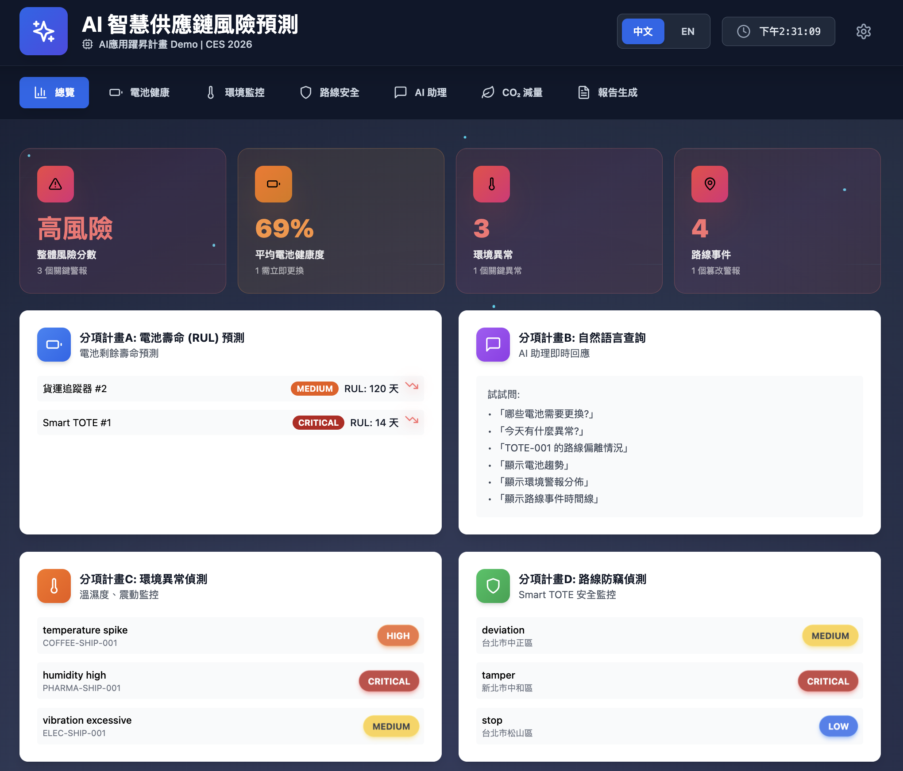

Figure 3‑1 shows the core operations dashboard of this project. It consolidates battery Remaining Useful Life (RUL) predictions, environmental anomaly events (temperature/humidity), route and theft risks, AI‑generated reports, and key international deployment site indicators. Users can view cross‑deployment‑site KPIs, alert lists, and map/timeline visualizations on a single screen, reducing cross‑system lookup and manual aggregation time. It serves as the primary interface for day‑to‑day operations monitoring and recurring management meetings.

The following diagrams present the end‑to‑end system architecture and data flows (Figure 3‑2), illustrating how work packages A–D are integrated into a complete smart supply chain monitoring and risk warning solution:

**Figure 3‑2: System Architecture (Inference and Alert Pipeline)**

**Figure 3‑2A: Front-End Flow – Data Collection and Alert Creation**
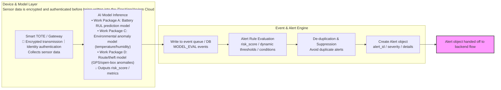

**Figure 3‑2B: Back-End Flow – Report Generation and Notification**
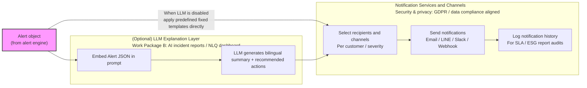

> **Architecture description and training flow supplement:**  
> The diagrams show the **production inference and alert pipeline**, illustrating how real‑time data flows through AI models, the alert engine, and notification services.  
> The **model training and retraining pipeline** runs offline on historical data and labeled event sets and is described in detail under “II. Project Content and Implementation Methods” for work packages A–D. Trained model weights are periodically deployed to the “AI Model Inference” nodes shown here.

**Architecture description:**

1. **Device & Model Layer:** Smart TOTE sensors collect temperature, humidity, GPS, and open/close status data. Work Package A (RUL prediction), Work Package C (environmental anomalies), and Work Package D (route/theft) models perform inference and output risk scores and metrics.

2. **Event and Alert Engine:** Model outputs are written to an event queue, then processed by alert rule evaluation, de‑duplication, and suppression logic to create structured alert objects, ensuring that high‑priority events are surfaced instead of buried.

3. **LLM Explanation Layer (Optional):** Corresponding to Work Package B’s AI‑generated incident reporting, alert JSON can be converted into bilingual summaries and recommended actions. When LLMs are not used, predefined fixed templates are applied to control cost while preserving basic functionality.

4. **Notification Services and Channels:** Based on customer and severity, the system selects recipients and channels (email/LINE/Slack/webhook), and records notification history to support SLA and ESG reporting and ensure governance transparency.

This architecture highlights three design features: (1) modular AI functions that can be extended independently; (2) governance built into each stage (de‑duplication, audit, SLA); and (3) flexible deployment (LLM‑optional vs. fixed templates) to reduce adoption barriers.

#### RUL Prediction Flow

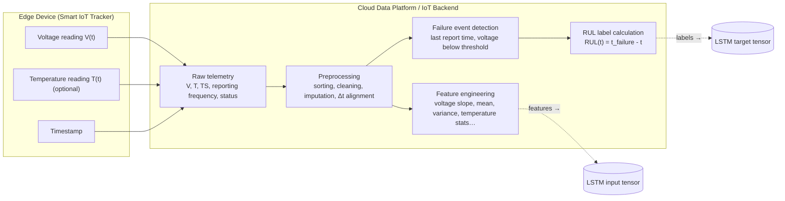

The LSTM inputs and labels above feed into model training and inference:

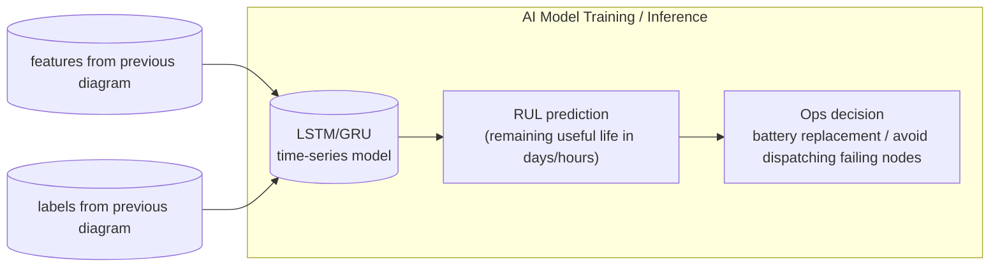

As shown in Figure 3‑3, the RUL prediction module is based on voltage time series from NTN smart trackers, optional temperature data, and timestamps. The cloud reconstructs discharge curves and actual failure times for each device to compute Remaining Useful Life (RUL) labels. Time‑series models (e.g., LSTM/GRU) learn the relationship between “voltage patterns × usage context” and RUL. In operation, each node’s remaining service life (in days) is predicted in real time to trigger preventive maintenance and battery replacement, reducing unplanned offline events and improving monitoring availability.

Figure 3‑3: RUL Prediction Flow

#### Environmental Anomaly (Temperature/Humidity) Prediction Flow

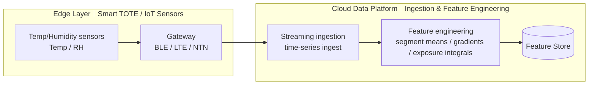

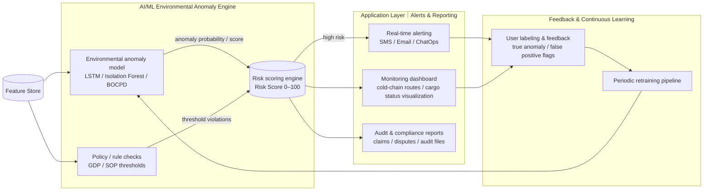

Figure 3‑4: Environmental Anomaly (Temperature/Humidity) Prediction Flow

The diagrams above describe the end‑to‑end flow and division of responsibilities for environmental anomaly prediction. Upstream, Smart TOTE / IoT sensors send temperature, relative humidity, and timestamps via gateways as streaming data into the cloud. The platform performs cleaning, alignment, and feature engineering (segment averages, gradients, cumulative exposure) and writes unified features into a feature store for downstream use. Downstream, anomaly detection models (e.g., LSTM, Isolation Forest, BOCPD) are combined with regulatory thresholds (GDP / local SOP) to compute risk scores and trigger alerts, update dashboards, and generate audit/compliance reports. User feedback on alerts and dashboards (true anomaly / false positive labels) feeds into the retraining pipeline, forming a continuous learning loop that keeps F1-score, early warning rate, and report SLA within target.

#### Route Anomaly and Theft Detection

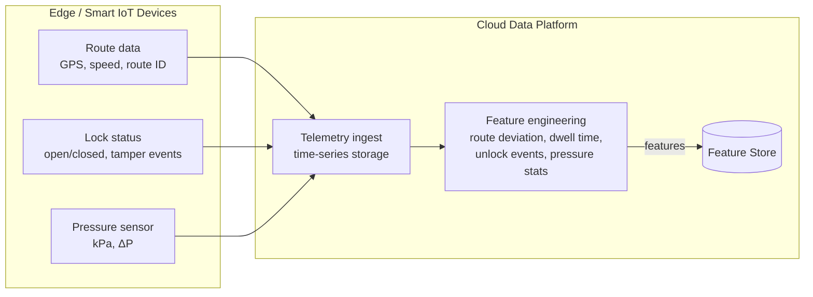

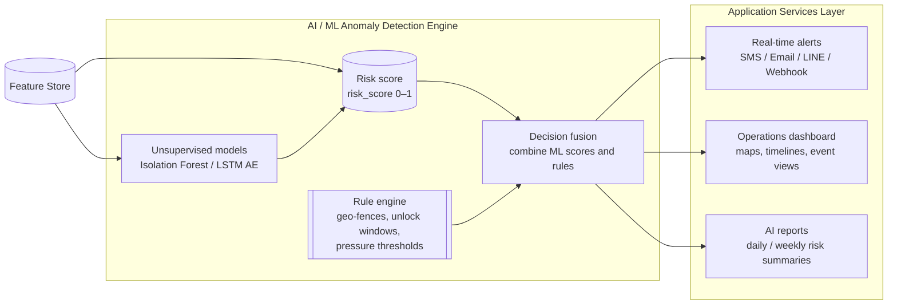

As shown in Figure 3‑5, the project follows an end‑to‑end “edge → cloud → feature store → AI/rules → decisions” flow. Edge smart locks and smart boxes send GPS trajectories, lock status (open/closed/tampering), and pressure readings as time series. The cloud ingests and stores the data, performs feature engineering (route deviation, dwell time, abnormal unlock statistics, pressure variations), and writes features into a unified feature store. AI anomaly detection models (e.g., Isolation Forest, LSTM Autoencoder) learn “normal transport behavior” and output anomaly scores, which are normalized to risk scores (0–1). In parallel, the rule engine applies business geo‑fences, unlock time windows, and pressure thresholds. Decision fusion combines AI risk scores and rules to send real‑time alerts (SMS/email/LINE/webhooks), highlight anomalies on the operations dashboard, and automatically generate daily/weekly risk reports, helping users quickly identify high‑risk routes and problematic assets.

### Federated Learning (FL) for Multi-Party Collaboration as a Scalable Business Opportunity

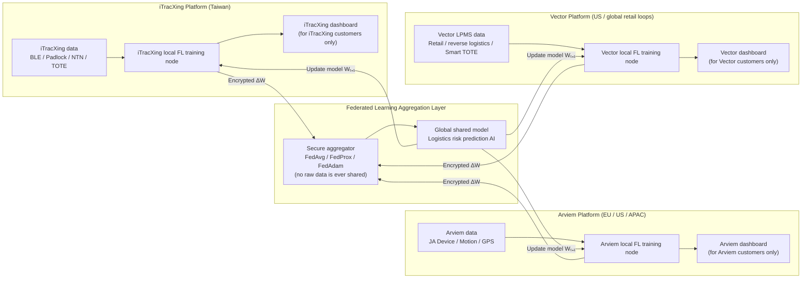

Figure 3‑6

Federated learning (FL) is expected to become a core component of AI systems over the next 5–10 years. It is driven by tightening privacy regulations (GDPR / PIPL / PDPA), multi‑party collaboration where data cannot be centralized, the shift of training workloads to edge/IoT devices, the co‑evolution of cloud and device‑side capabilities, and sustained investment from major technology companies. For logistics and supply chains (shippers, carriers, freight forwarders, cold‑chain operators, insurers, ports, satellite IoT providers), FL enables cross‑organization collaborative training of shared models **without** sharing raw data, directly addressing the adoption barrier that “data cannot be centralized.”

- Why now: Cross‑border and privacy regulations require “learning without sending raw data.” Growing data volumes and personalization needs on edge/IoT devices make device‑side training plus cloud aggregation a necessity.

- Business positioning: A standard component of supply chain AI (consistent with outlooks from Deloitte, McKinsey, BCG). “FL‑ready models and pipelines” become compliant AI capabilities that channel partners (Arviem, Vector, etc.) can embed quickly.

- Scalable monetization models:  
  - Federated Training as a Service: fees based on node count, training rounds, and model size.  
  - Licensed compliant AI bundles (FL‑ready models): RUL, environmental anomaly, route deviation, theft detection, etc.  
  - Edge node management and compliance consulting: GDPR/PIA, data governance, and audits.

- Growth engines:  
  1) Channel expansion (Arviem customers → replication across countries and deployment sites).  
  2) Model network effects (more sites participating → better global shared models).  
  3) Edge rollout growth (more Smart TOTE / gateway nodes → cumulative operations and subscription revenue).

- Go‑to‑market strategy:  
  - First deliver usable centralized models as MVP; then, as deployment sites and regulatory needs grow, introduce FL aggregation (FedAvg / FedProx).  
  - Provide technical and compliance white papers and audit tools explaining “no raw data leaves the domain; only parameters are uploaded” to lower adoption barriers.  
  - Co‑develop FL SDKs/APIs with partners to shorten integration cycles.

- Risks and mitigation: Data quality heterogeneity, non‑IID distributions, unstable nodes → adopt hierarchical aggregation, adaptive weighting, node health checks, and rollback strategies. Regulatory changes → annual review by external consultants and policy fallback strategies.

Conclusion: FL is not an independent market but the underlying capability for “privacy‑preserving multi‑party collaborative AI.” By centering on FL‑ready supply chain AI components and services, and combining channel partners with edge node growth, the project can build a high‑margin, replicable, and cross‑border scalable business footprint.

### AI Modules × Milestones × KPI Overview

> Note: This table lists the project’s main AI modules and technical roadmap, distinguishing **MVP / must-achieve** items from **extended / advanced** items, so readers can understand the technical focus and targets within 1 minute.

| Module | Type | Key Milestones (Month) | Final KPI | Notes |
| --- | --- | --- | --- | --- |
| Battery life prediction (RUL, smart tracker) | **MVP** | M6 complete initial RUL model and data pipeline; M12 deployment site validation | RUL MAE ≤ 10 days; early warning rate ≥ 80%; unplanned offline events reduced by ≥ 30% | **Must-achieve**; corresponds to Pain Point 1 (sensor node reliability and battery life), Work Package A |
| Environmental anomaly detection + risk scoring (temperature / humidity + event alignment) | **MVP** | M6 complete prototype; M12 deployment site validation | F1 ≥ 0.85; violation rate reduced by ≥ 30%; incident report SLA (P95) ≤ 2 minutes | **Must-achieve**; corresponds to Pain Point 3 (risk for environment-sensitive cargo), Work Package C |
| NLQ + automated reporting (AI autonomous summarization and management dashboard) | **MVP** | M6 prototype; M12 internal pilot; M18 deployment site rollout | NLQ accuracy ≥ 90%; P95 latency ≤ 60 seconds; report preparation labor hours reduced by ≥ 50% | **Must-achieve**; corresponds to Pain Point 2 (time-consuming report generation), Work Package B |
| Route / theft anomaly detection (Smart TOTE + GPS / Padlock) | **MVP** | M12 model demo; M18 deployment site validation | Route deviation AUC ≥ 0.90; theft / unauthorized opening F1 ≥ 0.85; critical alert response time < 30 minutes | **Must-achieve**; corresponds to Pain Point 4 (detours / theft), Work Package D |
| Multi-party collaboration via federated learning (FL, multi-party data collaboration) | **Extended** | M12 complete FL architecture design and PoC plan; M18 complete at least 1 cross-site PoC | At least 2–3 nodes participating in FL training; complete 1 “Privacy Protection and Federated Learning White Paper”; performance gap between centralized and FL models ≤ 5% | **Advanced**; emphasizes **collaboration / GDPR / alliance**: multi-party collaboration, data remains in-domain, supports building AI alliances with international and local partners (not a mandatory acceptance criterion; positioned as technical and business extension) |
| Training AI Coding / vibe coding process | Supporting | M3 establish internal development guidelines; M9 integrate into CI pipeline; ongoing optimization | Typical development effort reduced by ≥ 20–30%; major defect rate does not increase (vs. 2024 baseline) | Internal R&D **efficiency improvement / quality control**; supports development of Work Packages A–D; not an external audit KPI |

### (5) Benefits of International Cooperation

This project is led by ItracXing (Taiwan) in cooperation with Arviem AG (Switzerland). Arviem serves as the international deployment site (International Testbed) for this project.

- Scope of cooperation:  
  - Arviem: provides global deployment sites, IoT devices, and data access; co-validates technology and supports customer onboarding (export value).

- Value for Taiwan:  
  - International cooperation showcase: positions Taiwan as the technology hub and establishes an “AI-MaaS for Logistics” export path.  
  - Talent and technology upgrading: two-way exchange between academia and industry, with practical implementation of GDPR / AI Act and other international compliance requirements.

## IV. Project Implementation Schedule and Checkpoints

The following Gantt chart and subsequent “Planned Schedule and Checkpoints” together with the “AI Function – Milestone – KPI Mapping Table” are mutually aligned and use the unified milestone codes A.1 / B.1 / B.2 / C.1.

### Gantt Chart (2026/01–2027/06, 18 months; Work Package View)

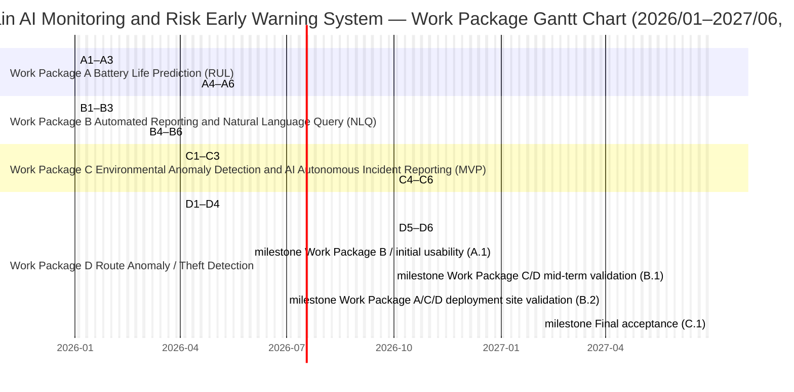

### Planned Schedule and Checkpoints

### Planned Schedule (Fiscal Year Basis; At Least One Checkpoint Every 6 Months)

- 2026/01–2026/05 (M1–M5; Milestone A.1)  
  - Objective: Initial usability for Work Packages A/B  
  - Main deliverables:  
    - Work Package A: Complete data pipeline and preprocessing flow for battery life–related data (A1–A3); establish initial battery life prediction model  
    - Work Package B: NL-to-SQL and RAG basic functions available (B1–B3); automated reporting and Executive Alert prototype launched (early phase of B4–B6)  
  - Checkpoint: A.1 (end of 2026/05)

- 2026/04–2026/09 (M4–M9; Milestone B.1)  
  - Objective: Mid-term completion of Work Packages C/D models  
  - Main deliverables:  
    - Work Package C: Complete anomaly rules / change point detection and event alignment (C1–C3); alert → AI report integration available and meeting expected F1 / SLA targets  
    - Work Package D: Complete route anomaly / theft detection LSTM time-series model (D1–D4); dynamic alert logic operational in test deployment sites  
  - Checkpoint: B.1 (end of 2026/09)

- 2026/04–2027/03 (M4–M15; Milestone B.2)  
  - Objective: Deployment site validation for Work Packages A/C/D  
  - Main deliverables:  
    - Work Package A: RUL prediction model operates continuously in actual deployment sites; reliability and MAE meet targets  
    - Work Package C: Environmental anomaly detection in deployment sites achieves early warning rate and report SLA targets  
    - Work Package D: Route anomaly / theft detection completes A/B testing on real logistics routes; F1 and ETA MAE improvement meet targets  
  - Checkpoint: B.2 (end of 2027/03)

- 2027/01–2027/06 (M13–M18; Milestone C.1)  
  - Objective: Overall project closure and acceptance (integration and go-live of results from Work Packages A–D)  
  - Main deliverables:  
    - Complete end-to-end cross-module integration and stability validation; data synchronization success rate ≥ 98%  
    - Complete final acceptance testing and production deployment; service availability ≥ 99.5%  
    - Deliver final technical documentation and acceptance reports  
  - Checkpoint: C.1 (end of 2027/06)

### Checkpoint Descriptions

**A.1 (end of 2026/05) — Work Packages A/B / initial usability**:

  - Initial battery life prediction model established; prediction MAE ≤ 15 days  
  - Anomaly detection accuracy ≥ 85%  
  - MCP database integration completed, supporting real-time queries  
  - Automated reporting and executive alert summarization system launched  
  - Deliverables: system prototype, technical documentation, test report  

- **B.1 (end of 2026/09) — Work Packages C/D mid-term**:

  - Alert optimization model training completed; F1-score ≥ 0.85  
  - Deliverables: model training report, preliminary validation results  

- **B.2 (end of 2027/03) — Work Packages A/C/D deployment site validation completed**:

  - Battery life prediction accuracy meets targets (RUL MAE ≤ 10 days)  
  - Alert false positive rate ≤ 15% (≥40% reduction vs. baseline)  
  - Predictive maintenance mechanism validated; lab and deployment site tests passed  
  - Deployment site validation report completed  
  - Deliverables: deployment site test data, battery life model performance report, predictive maintenance benefit analysis  

**C.1 (end of 2027/06) — Overall project closure and acceptance**:

  - End-to-end cross-module integration completed; data synchronization success rate ≥ 98%  
  - Production environment deployment completed; API documentation complete  
  - Service availability ≥ 99.5%, with a continuously declining integrated defect rate  
  - Final acceptance tests and closure deliverables completed

### Funding Disbursement and Key Decision Points (Milestone Management)

To ensure quality and control of project execution and outcomes, a **milestone-based disbursement** mechanism is adopted, with a **Go/No-Go decision point at M15**.

#### Funding Disbursement Schedule (Milestone–Work Package Grouping)

| Milestone | Period | Key Milestones (Work Package Mapping) | Disbursement Ratio | Disbursement Amount | Retention |
| --------------- | --------- | ---------------------------------------- | ---------- | ------------- | ------------ |
| Milestone A (A.1) | M1–M5 | Work Package B initial usability + Work Package A data pipeline / preprocessing | 40% | 3,600K | — |
| Milestone B (B.1/B.2) | M4–M15 | Work Packages C/D models and validation + Work Package A RUL / lifetime extension | 35% | 3,150K | — |
| Milestone C (C.1) | M13–M18 | Overall project closure and production deployment (cross–work package integration) | 20% | 1,800K | 5% (450K)* |
| Final acceptance | M18+ | Pass acceptance tests | 5% | 450K | — |
| **Total** | — | — | **100%** | **9,000K** | — |

*The final 5% retention is disbursed after passing acceptance tests, submitting patent applications, and delivering technical documentation.*

#### Key Decision Point: M6 Go/No-Go Review (Indicators Mapped to Work Packages A / B / D)

At the M6 milestone (June 2026), a **major review** will be conducted. At least **3 out of 4 indicators** must be met to proceed with subsequent work packages:

| Indicator | Target Value | Minimum Passing Threshold | Validation Method |
| ----------------------- | ----------- | -------------- | ------------------------ |
| 1. Anomaly detection accuracy | ≥ 90% | ≥ 85% | Test set validation report |
| 2. Sensor reliability improvement | ≥ 5% | ≥ 3% | Measured online rate and offline event statistics |
| 3. Arviem deployment site agreement | Signed | LOI confirmed | Cooperation agreement or letter of intent |
| 4. Patent application progress | 1 filed | 1 in preparation | Application documents or draft |

**Decision criteria**:

- **Go**: 3/4 indicators met → continue subsequent work packages; disbursement per original plan  
- **Conditional Go**: 2/4 indicators met → submit remediation plan; retain 10% of subsequent budget; re-review at M9  
- **No-Go**: fewer than 2 indicators met → terminate the project or significantly adjust scope; no disbursement of later-stage budget

#### Risk Management Mechanism

1. **Monthly progress reports**: submit monthly summaries of progress and financial status  
2. **Quarterly technical reviews**: external experts conduct quarterly technical reviews  
3. **Flexible budget adjustment**: a contingency reserve of 600K may be reallocated upon approval by the managing authority  
4. **Human resource backup**: if key personnel change, a replacement plan must be submitted within 30 days  

This mechanism ensures efficient use of government funding and enables early detection and correction of issues, safeguarding project quality.

## V. Expected Benefits

### (1) Quantitative Benefits (Technical and Operational KPIs)

> This section summarizes quantitative benefits in two dimensions—“technical” and “operational”—including sensor reliability, anomaly detection performance, reporting and decision efficiency, service availability, and induced investment, and explains measurement methods and verification frequency.

1. Core technical and operational KPIs (summary)

| KPI | Baseline | Final Target | Measurement Method / Data Source |
|----------------------------------------|-----------------------------------------|------------------------------------------|----------------------------------------------------------------------|
| Sensor reliability (Availability) | 90% (2024 annual average) | ≥95% | IoT device monitoring system; calculated from daily online rate and data completeness; monthly aggregation |
| RUL prediction accuracy | No baseline (new model) | ≥90% | Accuracy on Work Package A model validation set; updated quarterly |
| RUL prediction error (MAE) | No baseline (rule-based baseline) | ≤10 days | MAE between RUL prediction and actual lifetime; updated quarterly |
| Environmental anomaly detection F1-score | Current rule-based ≈ 0.7 | ≥0.88 | F1-score on a complete event sample set; verified quarterly |
| Route deviation detection AUC / theft alert F1-score | None (first-time deployment) | AUC ≥ 0.90; F1 ≥ 0.85 | Validated with independent test set and deployment site data; verified quarterly |
| NLQ query success rate | None (first-time deployment) | ≥92% | Accuracy of NL-to-SQL queries against labeled questions; reviewed quarterly |
| NLQ P95 latency | Manual queries >10 minutes; no baseline | <60 seconds | NLQ gateway and APM logs; weekly / monthly review |
| Incident response time | Approx. 45–90 minutes (manual process) | Reduction ≥40% | Time difference from event trigger to completion of handling; monthly verification |
| Report preparation labor hours | Approx. 200 hours / month | Reduction ≥50% (≤100 hours / month) | PMO timesheet system; tracked monthly |
| Service availability | 99.0% (current monitoring value) | ≥99.5% | Monitoring platform (Grafana / Datadog) weekly / monthly aggregation |

2. Induced investment and human resource benefits (NT$1,000; not core KPIs for this period)

| Outcome Item | Before | Year 1 | Year 2 | Evidence |
|-----------------------------------|-------:|----------:|----------:|----------------------------------|
| Number of patents filed / granted | 0 | 2 | 3 | Patent applications and review status |
| Induced investment amount | 0 | 6,500 | 6,500 | Investment cooperation agreements and MOUs |
| New jobs (people) | 0 | 5 | 10 | Employment contracts and HR records |
| Increase in participating R&D staff salary level (%) | - | +10% | +15% | Payroll and HR supporting documents |

Breakdown of induced investment (unit: NT$1,000; post-project investments, not core KPIs for this period):

| Investment Item | Investor | Amount | Description |
|----------------------------------|--------------------|---------:|------------------------------------------------------------------------------------------|
| Smart logistics edge node testing and validation | External research institution | 3,000 | Deployment and performance validation for smart logistics edge nodes; build test nodes and AI accelerator servers |
| Edge AI Platform joint investment | ItracXing & Arviem | 2,000 | Extend this project’s AI modules to edge computing nodes for low-latency smart logistics monitoring |
| International export cooperation (global deployment sites) | Arviem AG | 1,500 | Export the smart logistics monitoring integrated solution to Arviem customer sites as cross-border validation |

Total induced investment: approx. NT$6,500 thousand.

---

### (2) Qualitative Benefits and Commercialization Plan

> This section explains the project’s long-term impact on the applicant, the industry ecosystem, international visibility, and talent development, complementing the value not captured in quantitative indicators.

1. Benefits for the applicant (ItracXing)  
- Technology upgrading:  
  - Establish a complete set of AI modules—RUL battery life prediction, environmental anomaly detection, route / theft detection, and NLQ reporting—forming a replicable “AI Logistics MaaS” product line.  
  - Build capabilities in explainable AI (XAI), federated learning (FL), and multi-agent collaboration, strengthening competitiveness in future AI governance and compliance projects.  
- Products and business model:  
  - Transform from project-based deployment to an “IoT devices + AI-MaaS / Logistics-as-a-Service (LaaS) subscription” model, increasing gross margin and enterprise value.  
  - Deliver at least 1–2 replicable international deployment site reference cases (international: Arviem; domestic: Simique) as flagship references.  
- Talent development:  
  - Develop ≥6 R&D and operations talents with cross-domain “AI + logistics / manufacturing” capabilities, including ≥1 female R&D professional.  
  - Accumulate practical experience in cross-border collaboration and compliance with GDPR / AI Act.

2. Benefits for the industry and local ecosystem  
- Industry demonstration:  
  - Complete at least 1 representative AI deployment demonstration site (e.g., international ocean freight / temperature-sensitive cargo / electronics assembly supply chain), forming a replicable implementation blueprint and SOP.  
  - Through technical workshops, industry forums, and reference case sharing, drive collaboration among system integrators, telecom operators, and equipment manufacturers.  
- Technology spillover:  
  - Use open APIs, technical white papers, and selective open-sourcing of tools to lower adoption barriers for SMEs, raising the overall level of digitalization and AI adoption in the industry.

3. International visibility and IP deployment  
- International cooperation showcase:  
  - Complete field validation with Arviem and other international partners in Europe / global deployment sites, enhancing Taiwan’s visibility in “AI + smart logistics.”  
  - Arviem will consider establishing a permanent office or subsidiary in Taiwan as an Asia hub; this can be evidenced by LOIs, driving local employment and long-term technical cooperation.  
- Intellectual property and export:  
  - File 2–3 patents (including at least 1 PCT) before project closure.  
  - Establish an “AI-MaaS for Logistics” export framework, with international customer revenues contributing approximately 70% of induced revenue over three years.

---

### (3) Energy Saving and Carbon Reduction Benefits

> This section explains how the project achieves energy saving, carbon reduction, and Environmental, Social, and Governance (ESG) benefits through “battery life optimization, route optimization, waste prevention, and IoT device life extension,” with transparent assumptions and illustrative formulas for CO₂ reduction.

1. CO₂ reduction components and illustrative values (CO₂ calculation formula)  
- Battery optimization — reduced emissions from battery manufacturing: ≈ 1,950 kg CO₂e  
- Route optimization — reduced fuel consumption: ≈ 1,728 kg CO₂e  
- Waste prevention — prevent product spoilage: ≈ 11,000 kg CO₂e  
- IoT device life extension — longer equipment life: ≈ 46 kg CO₂e  
- Illustrative total reduction: ΔCO₂,total ≈ 14,725 kg CO₂e (representative deployment site / annual illustrative value)

2. Boundary conditions  
- The four components are mutually exclusive; each event is counted only once.  
- “Per batch” is defined as one end-to-end transport mission.  
- Waste prevention does not double-count transport energy consumption.  
- Aligned with the KPI table statement of “approx. 10–15% CO₂ emission reduction over three years (approx. 80+ tons CO₂e).”

3. Measurement methods and data sources  
- Calculation standards: ISO 14064-1, GHG Protocol (Scope 1–3), Environmental Protection Administration (EPA) carbon footprint guidelines.  
- Data sources: IoT / Smart TOTE mileage and events, government and international emission factors, industry baselines (EPD / LCA).  
- Example emission factors: 75 kg CO₂e / battery, 2.68 kg CO₂e / liter of diesel, 2.5 kg CO₂e / kg of food waste, 45 kg CO₂e / IoT device.

4. Data and method transparency  
- Use actual mileage, battery life, anomalies, and return / scrapping statistics as the basis for conversion.  
- Disclose assumptions, activity data, emission factors, and uncertainty in the final report.

---

### (4) Commercialization Plan and Targets (Within Three Years After Project Completion)

> This section focuses on specific commercialization pathways, revenue structure, and target indicators for “within three years after project completion,” aligned with the technical and deployment site validation results of this period.

1. Market positioning and serviceable market (SAM → SOM)  
- Target cross-border transport scenarios involving high-value / temperature- and humidity-sensitive cargo, offering “IoT devices + AI-MaaS.”  
- Based on Arviem’s >5,000 customers, conservatively convert 1% (≈50 customers); with an annual subscription of USD 12,000 per customer → approx. NT$19.2M per year; including hardware and consulting / licensing over three years totals approx. NT$120M, with export share around 70%.

2. Smart TOTE business model and revenue estimation (representative scenario)  
- Per-shipment: USD 2 / TOTE / shipment (includes T/H, location, anomalies, and incident reporting).  
- Value rationale: cost is negligible compared to cargo / asset value; one prevented loss can justify the service.  
- Extended monthly rental: USD 8–12 / TOTE / month (creates Annual Recurring Revenue, ARR).  
- Representative scenario: 1,000 boxes × 50 trips / year × 3 years ≈ 150,000 trips → USD 300,000 (approx. NT$9.6M).

3. Market validation and customer commitment milestones (mapped to M1–M18)  
- M1–M6: ≥20 customer interviews, ≥50 pain point surveys; ≥15 pricing tests.  
- M6–M9: LOIs from ≥2 customers; ≥1 PoC; finalize cooperation agreement with Arviem.  
- M10–M18: 2–5 pilot customers; 100–500 devices; ARR USD 30K–150K; retention ≥80%; Net Promoter Score (NPS) ≥40.

4. Revenue forecast and income structure (2026–2029)

| Item | 2026 | 2027 | 2028 | 2029 |
|----------------------------|--------------------------|---------------------------|---------------------------|---------------------------|
| IoT device sales (units / average price) | 75 × $1,000 | 600 × $1,000 | 900 × $1,000 | 1,200 × $1,000 |
| a. IoT device sales revenue | $75,000 | $600,000 | $900,000 | $1,200,000 |
| Service revenue (customers / average price / duration) | 1 × $3,500 / month × 3 months | 2 × $4,000 / month × 12 months | 3 × $4,500 / month × 12 months | 4 × $5,000 / month × 12 months |
| b. Service revenue | $10,500 | $96,000 | $162,000 | $240,000 |
| c. Consulting / licensing and others | $7,500 | $56,000 | $80,000 | $120,000 |
| **Total revenue = a + b + c (USD)** | **$93,000** | **$752,000** | **$1,142,000** | **$1,560,000** |
| **ARR (NT$, FX 1:32)** | **2.98M** | **24.06M** | **36.54M** | **49.92M** |

5. Revenue mix and profit-sharing mechanism  
- In the short to medium term, hardware dominates, with the share of services increasing year by year (reaching approx. 23% by 2029).  
- Channel margin split with Arviem: 50:50; direct sales revenues recognized by ItracXing; licensing deals negotiated case-by-case.

6. Key commercialization targets within three years after project completion (KPIs)  
- ≥10 paying or long-term (>6 months) pilot customers.  
- ≥1,000 IoT devices (Smart TOTE / TC605 + LaaS) deployed in total.  
- Three-year cumulative AI-MaaS / consulting / licensing revenue ≥NT$80M; international share approx. 70%.

7. International trade show strategy (CES 2026 showcase and business development)  
- Focus of demonstration: 3–5 minute scenario demo labeled as a project prototype / demonstration.  
- Cooperation: joint booth / pitch with Arviem, packaged as an integrated international deployment solution.  
- Target outcomes: collect pain point and pricing feedback; secure LOI / PoC intentions from 3–5 potential customers.  
- Note: CES expenses will be self-funded by the company; no subsidy funds will be used; online demos or regional trade shows may be used as alternatives.

---

### (5) Dissemination and Promotion Plan

> This section explains how to amplify demonstration effects and support future scaling and international export through dissemination and knowledge sharing once technical and commercial goals are met.

1. Technical publications and professional communities  
2. Industry workshops and deployment blueprints  
3. Exhibitions and media exposure (including CES 2026 joint pitch / demonstration)  
4. Government and policy dialogue  
5. Outcome tracking and secondary dissemination

---

### (6) Benefit Indicators and Audit Mechanism (Linking KPIs and Technical Validation Agreements)

> The above benefits are translated into measurable KPIs, which are tied to technical validation agreements to ensure that benefits can be audited.

1. Overall KPI table (indicator / baseline / final target / method / source / frequency)

| KPI | Baseline (Current Value) | Target (Final) | Measurement | Data Source | Frequency |
|------------------------------------|-----------------------------|--------------------------|-----------------------------------------------------|----------------------------------|------------------------|
| Sensor reliability (Availability) | 90% (2024 annual average) | ≥95% | Statistics of online rate / data completeness | iTracXing IoT Sensor DB | Monthly |
| RUL prediction accuracy | No baseline (new model) | ≥90% | RUL prediction vs. actual lifetime | Work Package A model validation set | Quarterly |
| RUL prediction error (MAE) | No baseline (new model) | ≤10 days | MAE between RUL prediction and actual lifetime | Work Package A model | Quarterly |
| NLQ response latency (P95) | Manual queries >10 minutes | <60 seconds | API P95 latency | Work Package B NLQ Gateway Log | Weekly |
| NLQ query accuracy | None (first-time deployment) | ≥92% | NL-to-SQL query accuracy | Work Package B model | Quarterly |
| Environmental anomaly early warning rate | 0–2 hours (existing system) | ≥70% | Early warning time − anomaly occurrence time | Work Package C Sensor DB | Monthly |
| Environmental anomaly report SLA (P95) | None (first-time deployment) | ≤2 minutes | End-to-end delay from anomaly trigger → report generation → push notification | Work Package B×C event / report pipeline | Monthly |
| Route deviation detection AUC | None (first-time deployment) | ≥0.90 | ROC-AUC evaluation | Work Package D GPS / NTN time-series data | Quarterly |
| Theft alert F1-score | None (first-time deployment) | ≥0.85 | F1-score from confusion matrix | Work Package D GPS / NTN / labeled events | Quarterly |
| ETA prediction error (MAE) | MAE ≈ 1.8–3.2 hours | ≥25% improvement | Comparison of estimated vs. actual arrival time | Work Package D model | Monthly |
| ESG: reduction of non-productive transport | None (first-time measurement) | ≥10–12% | Comparison of mileage before / after route optimization | Work Package D routing log | Semi-annual |
| ESG: reduction in environmental anomalies for temperature-sensitive cargo | 2024 actual anomaly rate as baseline | ≥15% improvement | Anomaly event statistics | Work Package C Sensor DB | Quarterly |
| Report preparation labor hours | ≈200 hours / month (manual aggregation) | ≤100 hours / month | PMO timesheet system | PMO / timesheet system | Monthly |
| Service availability | 99.0% (current monitoring value) | ≥99.5% | Annual uptime / total time | Monitoring platform (Grafana / Datadog) | Weekly / monthly |

2. Technical validation agreements (ensuring measurable benefits) — overview  
- RUL prediction accuracy validation (Work Packages A / B):  
  Deployment sites (Arviem / SimiQue, approx. 100 devices, 12 months); models (LSTM / TFT + survival analysis); success criteria (accuracy ≥90%, MAE ≤10 days, early warning rate ≥85%, false positive rate ≤15%); timeline (A.1 / B.2).  
- Alert optimization performance validation (Work Packages C / D):  
  A/B comparison with rule-based baseline; false positive rate ≤15%; miss rate ≤5%; F1 ≥0.85; response time <30 minutes; provide A/B test and deployment site case reports, with third-party validation as needed.

3. Quantitative benefits (summary of amounts and ratios)  
- Cost reduction: communication / transmission costs reduced by approx. 60%.  
- Quality / availability improvement: violation rate reduced by ≥30%; theft detection F1 ≥0.85; service availability ≥99.5%.  
- Efficiency improvement: incident response time reduced by ≥40–50%; analysis labor hours reduced by ≥40–50%.  
- Increased revenue / output: three-year cumulative output approx. NT$120M, with international revenues accounting for about 70%.

### (7) International Export Plan

> This section outlines the international export strategy and roadmap for the three years following project completion, including product forms, channel partnerships, target markets, and revenue structure, aligned with the indicators described above.

1. Export products and services  
- AI-MaaS for Logistics + Smart TOTE integrated solution (RUL, environmental anomalies, route / theft, NLQ).  
- Subscription model (per-shipment / monthly rental) plus consulting / licensing.

2. International channels and market layout  
- Use Arviem’s >5,000 customers as the main channel, prioritizing high-value scenarios in Europe / North America.  
- Over three years, engage approx. 1% (50 customers) in PoC / trials, with a 20% conversion rate (10 paying customers).

3. International trade show and deployment site strategy  
- Use CES 2026 as a key showcase point, with joint demos / pitches to secure LOI / PoC.  
- Leverage Arviem / SimiQue deployments as flagship reference cases.

4. International revenue structure and targets  
- Three-year cumulative revenue approx. NT$120M: AI-MaaS / consulting / licensing approx. NT$80M; IoT devices approx. NT$40M.  
- International revenue share approx. 70%.

5. Compliance and localized deployment  
- Regionalized deployment + federated learning: data remains in-domain; only parameters / gradients are uploaded for aggregation.  
- Localize NLQ semantic layers and report formats per country, in cooperation with local operations teams.

---

## VI. Risk Assessment and Mitigation Measures

This project centers on “AI risk prediction models + global and local deployment site data.” Risks are mainly concentrated in:  
(1) model and data quality, (2) data and regulatory compliance, (3) deployment sites and market adoption, (4) key personnel and financial control, and (5) process and quality management when introducing AI-assisted programming (vibe coding).  
The following summarizes a concise risk matrix, with emphasis on using **Federated Learning (FL)** and **regionalized deployment** to reduce cross-border data and compliance risks.

### 6-1 Core Risk Matrix and Mitigation Strategies (Including Federated Learning and AI-Assisted Development)

| Risk Category | Specific Risk | Impact | Likelihood | Main Mitigation Measures (Including FL / AI-Assisted Development) | Responsible Unit |
| --- | --- | --- | --- | --- | --- |
| **Technical Risk** | Model shift / data drift leading to inaccurate predictions | High | Medium | 1) Establish **model monitoring KPIs** (prediction error, anomaly detection F1, risk score distributions) with daily monitoring; 2) Conduct quarterly retraining and cross-validation, with rollback to a stable version when needed; 3) For critical deployment sites, retain a “traditional rules engine” downgrade path to ensure service continuity. | AI Team |
| **Technical Risk** | Unstable anomaly thresholds and risk ranking strategies | Medium | Medium | 1) Multi-model redundancy (statistical thresholds + ML ranking such as Logistic Regression/XGBoost/LTR); 2) Calibrate thresholds through A/B tests and real operational cases; 3) Apply “dual-condition” design for high-risk alerts (e.g., environmental anomaly + route delay) to reduce false positives. | AI Team |
| **Data Risk** | Poor deployment site data quality (missing values, insufficient labels, sensor offline) | High | Medium | 1) Build a data quality dashboard (missing rate, offline rate, anomaly ratio); 2) Use existing international data as the **initial training set**, with domestic deployment site data used for incremental calibration; 3) For sparse events (e.g., theft), use **synthetic data and scenario simulation** to strengthen training. | Data Team |
| **Data / Regulatory Risk** | Cross-border data transfer constraints (GDPR, sensitive deployment site data) preventing centralized modeling | High | Medium | 1) Adopt a **regionalized deployment + federated learning (FL) architecture**: sensitive deployment site data stays on local nodes for training; only model parameters/gradients are uploaded to a Taiwan-based aggregation server (FedAvg); 2) Do not transfer raw time-series data across borders to reduce compliance risk; 3) Combine data de-identification and access control with external GDPR/Data Protection Impact Assessment (DPIA) reviews. | Project PI + Legal + AI Team |
| **Regulatory Risk** | Increased compliance costs under the EU AI Act for high-risk AI systems | Medium | Medium | 1) For supply chain risk prediction models, prioritize **explainable AI (XAI)** (e.g., SHAP, feature contribution) and retain decision rationales; 2) Together with FL, avoid building a single centralized “black box model”; 3) Arrange at least annual reviews by external legal/compliance advisors on the latest EU AI Act / GDPR requirements and adjust processes accordingly. | Legal + External Advisors |
| **Deployment Site / Market Risk** | Delays in international or domestic deployment site cooperation leading to insufficient validation or shortfall in output targets | High | Medium | 1) Sign MOUs/LOIs in advance and schedule **quarterly joint review meetings**; 2) Define **backup deployment sites** (at least 1 domestic logistics/cold-chain operator). If the primary site is delayed, activate backup pilots; 3) Reserve a “market validation budget” to fund small PoCs and accelerate business model convergence. | BD + Project PI |
| **Adoption Risk** | Low adoption willingness among end users (operations staff, managers) | Medium | Medium | 1) Use “co-creation workshops” on dashboards and reports, involving deployment site users in the design; 2) Conduct at least one training session and provide SOP manuals for each deployment site; 3) Use **active query counts, report usage frequency, and alert response rates** as adoption KPIs, and iteratively adjust UX if targets are not met. | PMO + Frontend Team |
| **Technical / Process Risk** | AI-assisted programming (vibe coding) leads to inadequate code quality, security, or maintainability | Medium | Medium | 1) Define **AI-assisted development usage guidelines**: AI-generated code must not go directly to production and must pass peer code review and security checks; 2) Introduce static code analysis, unit tests, and security scanning tools to strengthen quality gates; 3) Hold regular “Training AI Coding / vibe coding” internal workshops, positioning AI tools as **acceleration aids** rather than substitutes for engineering design to avoid over-reliance. | CTO + AI Team |
| **HR / Financial Risk** | Turnover of key personnel or budget overruns affecting progress and outcomes | Medium | Medium | 1) Project PI sets up a **deputy PI (succession) mechanism**, with all key designs and decisions documented (technical wiki, architecture docs, code review records); 2) Monthly variance checks of actual vs. budgeted personnel and expenses; 3) Reserve a contingency budget (approx. 3–5% of the total) specifically for handling risk events. | Management + Finance + PM |

> *Note: In this project, federated learning and regionalized deployment are positioned as “key technical means to reduce data and regulatory risks.” AI-assisted programming (vibe coding) is managed via clear guidelines and internal training, turning it into a tool to improve R&D efficiency without sacrificing quality.*

---

### 6-2 Risk Monitoring and Federated Learning Governance Mechanism

To ensure continuous monitoring and adjustment of the above risks, this project establishes the following **auditable governance mechanisms**:

1. **Risk Dashboard**

  - Update three indicator groups monthly:  
    - Technical indicators: model performance (error/F1/AUC), alert false positive rate, number of model retrainings.  
    - Data and compliance indicators: data missing rate, ratio of cross-border data transfers, FL node participation rate.  
    - Business and deployment site indicators: number of adopters, number of active users, pilot duration (must be ≥ 45 days).  
  - The dashboard serves as the basis for **weekly/monthly reviews** and for adjusting work priorities and resource allocation when needed.

2. **Regular Risk Review Cadence**

  - **Weekly meeting (core team):** review system incidents, model monitoring results, and deployment site feedback; trigger model rollback or emergency fixes when necessary.  
  - **Monthly report (internal management):** consolidate risk dashboard information and review any impact on checkpoints or annual KPIs.  
  - **Quarterly review (including external experts/advisors):** review data/compliance issues, the FL architecture, and AI-assisted development processes to ensure there are no violations of GDPR/AI Act or domestic regulations, and that vibe coding has not introduced quality or security risks.

3. **Federated Learning Governance (FL Governance)**

  - For deployment sites using FL, maintain a simple “training and aggregation log” including:  
    - Participating nodes per training round, number of rounds, aggregated results, and differences vs. previous versions.  
    - If FL model performance is significantly lower than centralized models, initiate a “root cause analysis and parameter tuning” process.  
  - Maintain an FL policy document summarizing which deployment sites use FL and which use centralized training, along with rationales and switchover conditions, as a basis for future audits.

---

### 6-3 Key Personnel, AI-Assisted Development, and Organizational Resilience

Given the project’s heavy reliance on AI models, system integration, and extensive use of AI-assisted development tools (Training AI Coding / vibe coding), we place special emphasis on **key personnel risk and organizational resilience**:

1. **Knowledge Management and Documentation**

  - Consolidate key architecture designs, model selection, and parameter decisions in a **technical wiki**, updated at least monthly.  
  - Each core module (anomaly detection, NLQ, risk scoring, multi-deployment site data integration, FL architecture, etc.) must have: design documents, API specifications, and test cases.  
  - For AI-assisted development workflows, establish **standard prompt templates and usage guidelines**, and include them in the documentation scope.

2. **Succession and Backup Mechanism**

  - A deputy PI with practical experience is responsible for day-to-day management, with at least one handover meeting per month between the PI and deputy PI.  
  - Each key module must have at least **two engineers** familiar with the code base. Through pair programming and vibe coding training, onboarding time for new members is reduced and “single-person dependency risk” is avoided.

3. **AI Coding Training and Talent Retention**

  - Regularly hold “Training AI Coding / vibe coding” workshops so team members learn how to use AI tools safely and efficiently (including security, licensing, and privacy considerations).  
  - Explicitly name R&D staff in major technical outputs (e.g., patents, papers, technical reports) and implement an internal bonus mechanism tied to results.  
  - Use flexible work arrangements and technical sharing sessions to reduce turnover risk among key talent and improve the team’s acceptance of AI tools and new technologies.

> Through multi-layered risk management and FL introduction—covering technology, data, compliance, deployment sites, human resources, and “AI-assisted development workflows”—the project can maintain sufficient resilience to achieve all checkpoints and expected benefits in the face of cross-border data constraints, regulatory changes, market uncertainty, and development process transformation.

## VII. Intellectual Property Rights Description

### Summary of Intellectual Property (IP) and Data Rights

To comply with the Ministry of Economic Affairs (MOEA) A+ Program requirement for “autonomous technology R&D,” intellectual property and data rights are defined as follows:

- Background Intellectual Property (Background IP)  
  - All pre-existing technologies and rights of each party before project initiation remain the exclusive property of the original rights holders.

- Foreground Intellectual Property (Foreground IP)  
  - Solely generated results: owned solely by the party that created the results, which is responsible for acquisition and maintenance of the rights.  
  - Jointly generated results that cannot be practically divided or have contributions clearly defined: owned jointly by the relevant parties, each holding an undivided, equal-share interest in such foreground IP.  
  - Foreground disclosure: during the project period, each participating party must “promptly and confidentially” disclose any newly created foreground IP to the project coordinator; the coordinator compiles and submits a consolidated report of foreground IP to all participants every six months.  
  - Foreground utilization: parties owning foreground IP solely may use it independently; jointly owned IP is used in accordance with the joint ownership agreement, and relevant agreements must be in place before any utilization.  
  - During the project, AI models, algorithms, source code, system architectures, and hardware designs developed or completed by **準旺科技股份有限公司** as foreground IP are, in principle, solely owned by ItracXing in accordance with the MOUs/cooperation agreements signed with domestic and international partners. R&D work is primarily conducted in Taiwan to meet this program’s requirement for “technology autonomy and local R&D.”

- MOEA / ItracXing Protection Clause  
  - To achieve the objectives of the MOEA A+ subsidy program, for any foreground IP (including jointly owned IP) necessary to fulfill the project objectives, all parties agree to grant ItracXing a **non-exclusive, irrevocable license** on commercially reasonable terms, for use in Taiwan and, where necessary, in international markets. This covers use, improvement, and commercialization of logistics AI monitoring and AI-MaaS services.

- Data Rights  
  - Raw data provided by Arviem remains the property of Arviem.  
  - During the MOU period, ItracXing receives a data use license strictly limited to project purposes (model training, evaluation, and improvement), and must comply with data protection and confidentiality obligations.  
  - Models trained and insights generated through lawful use of such data may constitute project foreground IP. Their utilization and licensing follow the foreground IP and licensing framework described above.
- Third-party rights (data / libraries / modules) will be inventoried to ensure licensing compliance.
- Patent application plan: 2 domestic patents and 1 international (priority on supply chain anomaly detection and intelligent sampling optimization).

### Application of Results (IP Filing Timeline and Ownership)

To clarify IP ownership and application timelines, planned applications, months, and rights holders are listed below:

| Planned Application Item | Type | Filing Region | Expected Filing Month | Rights Holder | Notes / Milestones |
| --- | --- | --- | --- | --- | --- |
| Event-triggered and variance-driven IoT sampling optimization method | Invention / Utility Model Patent | TW | 2026/05 filing (IDF 2026/03, first draft 2026/04) | 準旺(ItracXing)科技股份有限公司 | Early results of Work Packages A/B |
| Explainable supply chain anomaly detection system | Invention Patent | TW | 2026/06 filing (search 2026/04) | 準旺(ItracXing)科技股份有限公司 | Integration of Work Packages A/B (A2→B1) |
| Multi-Agent Supply Chain Monitoring with Federated Learning | PCT (International) | PCT | 2026/10 filing (priority from TW case) | 準旺(ItracXing)科技股份有限公司 | International deployment (subsequent operations), extended to US/EU |

Ownership and Licensing Principles  
- IP rights holder: unless otherwise agreed in writing, all rights are held by **準旺(ItracXing)科技股份有限公司**.  
- Partner licensing: non-exclusive, non-transferable licenses are granted under cooperation agreements (scope/territory/term as stipulated in contracts) for use by partners and their customers.  
- Background technology (Background IP): existing technologies of each party remain with each party; rights to derivative improvements follow the contractual arrangements.  
- Jointly developed deliverables: by default are owned by ItracXing, with partners obtaining usage rights according to the agreement. If joint patent filing is required, share ratios will be specified in the application documents.  
 - The above ownership and licensing principles are consistent with the “Intellectual Property and Data Rights (IP)” clauses in deployment site MOUs and clearly meet this program’s requirements that foreground IP be autonomously developed and localized.

Internal Control and Timeline Milestones  
- IDF (Invention Disclosure Form) submission: first round completed at M2 (2026/02), with rolling updates.  
- Novelty/patentability search: completed at M3 (2026/03), with records.  
- Patent drafting and review: first draft completed at M4 (2026/04); filings at M5–M6.  
- PCT deployment: M10 (2026/10); national phase entries within 12–30 months based on target markets.  
- Open-source/third-party license audit: build an SBOM and license inventory; complete compliance review before filing.

---

# III. R&D Team Description

[Summary] Present the PI’s and core team’s experience, division of labor, and person-month commitments, aligned with work package schedules, to demonstrate feasibility and execution capability.

### 1. Project PI Profile

- Name: Jeff Shuo｜Title: CIO｜Gender: Male｜Industry: Information Services  
- Major Achievements: Over 20 years of experience in AI/IoT systems; led multi-agent collaboration, AI security, and supply chain blockchain projects. Has experience managing cross-border teams in the United States and Taiwan, with a proven track record in AI security, compliance, explainable systems design, and productization.  
- **Education / Experience / Project Participation**:
  - Education:  
   - M.S. in Electrical Engineering and Computer Science, University of Illinois at Chicago (1992)  
   - MBA, San Diego State University (2005)
  - Experience:  
   - AI Agent Architect  
    - Led design and integration of LLM, dynamic thresholds, LangChain/LangGraph, Retrieval-Augmented Generation (RAG), Model Context Protocol (MCP), ReAct, and other multi-agent collaboration technologies  
    - Supply chain security  
   - Qualcomm Inc. — Director of Engineering (2004–2018)  
    - Led 100+ IoT/AR/VR/smart device projects and managed a 50+ engineer team  
    - Python/Keras/Node.js–based automated resource allocation system  
   - HTC Corp. — Sr. Technical Manager (2003–2004)  
    - Led protocol engineering team and developed the first Windows Mobile Phone  
   - Qualcomm Inc. — Sr. Engineer (1997–2003)  
    - Embedded drivers, CDMA/GlobalStar phones, RF/LCD/Bluetooth/ATE software  
   - Motorola Inc. — Sr. Engineer (1994–1997)  
    - Overseas CDMA base station/phone factory support, Windows OOD/OOP calibration software  
   - IBM — Software Engineer (1993–1994)  
    - AS/400 I/O subsystem C++ driver development  
  - Projects / Programs:  
   - Phoenix Multi-Agent SOC (2024–2025): multi-agent collaboration, AI security, compliance review  
   - SecuX AI SOC, supply chain blockchain tags, HSM secure signing  
   - Qualcomm/HTC/Google smart devices and embedded systems  
  - Technical Expertise:  
   - Multi-agent collaboration (LangChain, LangGraph, AutoGPT, ReAct, MCP)  
   - AI security, compliance, and explainable systems design  
   - Embedded RTOS, ARM, Linux/Yocto, IoT (BLE, NB-IoT)  
   - Blockchain/Web3 (ERC-1056, ERC-3643, DID, Real World Asset (RWA) tokenization)  
   - Secure hardware (HSM, FIDO2, PKI)  
  - Person-Months Committed: 18 months (100%)

### 2. Project Personnel Statistics (Unit: Person)

The following table summarizes participating personnel by company, education level, gender ratio, average seniority, and open positions, based on the “Project Personnel CV Forms” (including only internal ItracXing members and planned hires).

| Company | PhD | Master | Bachelor | Gender (M/F) | Average Seniority | Planned Hires |
|-------------|------|------|------|---------------|----------|----------|
| ItracXing   | 0    | 5    | 2    | 6 / 1         | 8 years  | 1        |
| Total       | 0    | 5    | 2    | 6 / 1         | 8 years  | 1        |

### 3. Project Personnel CVs

Below are the education, expertise, division of labor, person-month commitments, and mapping to the 120 total person-months and project schedule for the PI, key R&D personnel, general R&D staff, and planned hires.

| Name | Title / Role | Education | Expertise / Responsibilities | Person-Months | Gender | Company | Corresponding Work Package |
| --------- | ----------------- | ---------------------------------------- | ---------------------------------------------------------------------------------------------------------------------------------------------------------------------------------------------------- | ---- | -- | --------- | --------------- |
| Jeff Shuo | CIO / Project PI | Master (Univ. of Illinois at Chicago, Electrical Engineering and Computer Science; MBA, San Diego State Univ.) | Multi-agent collaboration, AI security, embedded and IoT–Edge–Cloud architecture design, international deployment site integration; responsible for overall technical decisions, architecture review, and cross–work package integration; leads the technical direction of Work Package A (battery Remaining Useful Life (RUL) prediction), coordinates Work Package B NLQ/reporting requirements with data and model flows from A/C/D, and oversees overall project closure and acceptance planning. | 18 | Male | ITracXing | A, B, C, D |
| Hsiao-Chang Lu | Firmware Engineer / IoT Edge Development | Master (Musician’s Institute GIT Performance) | Proficient in C/C++, Python, Java, Go; multithreading and communication protocols; memory management and performance optimization; experienced in ARM Cortex, RTOS, UART/SPI/I2C drivers and hardware testing; has embedded AI/ML experience, and is familiar with RESTful APIs, MQTT, WebSocket; responsible for Work Package A sensor-end firmware, battery and status monitoring data reporting, and Edge integration for Work Package C (temperature/humidity/quality monitoring) and Work Package D (Smart TOTE lock/pressure sensing and location). | 12 | Male | ITracXing | A, C, D |
| Chang-Jui Lin | Project Manager / AI Application Planning | Bachelor (National Chin-Yi University of Technology, Department of Computer Science and Information Engineering) | Background in Python and image recognition (TensorFlow, YOLO) for facial recognition, emotion analysis, and age prediction; hands-on experience in big data analysis and statistical modeling; familiar with Natural Language Processing (NLP), Speech-to-Text (STT), LLM text generation, and chatbots, as well as multimodal AI interaction optimization; responsible for design of Work Package B NLQ/automated reporting and multi-agent AI architecture, supporting model design and evaluation for Work Packages A/C/D, and coordinating final project demo scripts and content integration. | 12 | Male | ITracXing | A, B, C, D |
| Yi-Min Tsai | Backend Engineer | Master (National Chin-Yi University of Technology, Department of Computer Science and Information Engineering) | Backend system development and operations (API design, database planning, server deployment); familiar with TypeScript, Node.js, Golang, FastAPI; basic experience with TensorFlow, OpenCV, Scikit-learn and able to implement services with the AI team; familiar with Docker, Nginx, CI/CD, and automated production deployment; responsible for backend services and data pipeline implementation across Work Packages A–D (including battery RUL prediction, NLQ, environmental prediction, route/theft detection APIs/ETL), and supports integration testing and production deployment at project closure. | 12 | Male | ITracXing | A, B, C, D |
| Kuan-Hung Kuo | Full-Stack Web Engineer | Master (National Chin-Yi University of Technology, Department of Computer Science and Information Engineering) | Full-stack development (React, Vue.js, Next.js, Node.js, FastAPI); real-time dashboards and data visualization (Chart.js, D3.js, ECharts); RESTful API integration and access control; familiar with Hugging Face, LangChain, OpenAI API and other AI service integrations; responsible for end-to-end integration of Work Packages A–D, monitoring interfaces, and Smart TOTE/risk warning dashboards, and leads the final demo UI and international demo site/admin console. | 12 | Male | ITracXing | A, B, C, D |
| Chih-Yun Chu | Flutter Engineer | Bachelor (National Chin-Yi University of Technology, Department of Computer Science and Information Engineering) | Proficient in Flutter (Dart, MVVM, Provider, Riverpod) and capable of independent iOS/Android app development; familiar with RESTful API, GraphQL, WebSocket integration; hands-on experience with mobile AI integration (chat, recommendation, behavior prediction, voice control); familiar with Firebase, SQLite, Hive; responsible for Work Packages B–D mobile apps and frontline user interfaces (e.g., anomaly push notifications, on-site response logging and queries), and supports mobile demo and lightweight usage scenarios for international PoCs. | 10 | Male | ITracXing | B, C, D |
| (To Be Hired) | AI Engineer | Master (AI / Computer Science) | Federated learning (FL), model tuning, and large-scale training; expected to handle mid-to-late-stage AI model training and validation, primarily supporting multi-deployment-site modeling and deployment in Work Packages C/D, and, as needed, augmenting advanced model optimization and operations for Work Packages A/B (backup and capacity expansion where current coverage is insufficient). | 12 | Female | ITracXing | C, D (and A/B as needed) |

# IV. Project Budget Requirements (NT$1,000)

[Summary] Explain allocation of personnel costs, leasing/cloud, collaborative R&D, travel, and contingency funds. Government subsidy and self-funding each account for 50%. All amounts and ratios have been fully itemized according to actual planning and can be audited.

### 1. Budget by Category

#### (1) Personnel Costs for Innovation or R&D Staff

| Position | Average Monthly Salary (A) | Person-Months (B) | Year 1 Personnel Cost (A×B) | Notes |
|-------------------------|-------------:|-------------------:|-----------------------:|----------------------------------|
| Project PI | 141 | 18 | 2,538 | Full-time |
| Project Manager | 86 | 18 | 1,548 | Full-time |
| AI Engineers × 2 | 85 | 36 | 3,060 | Includes 1 planned hire |
| Full-Stack / IoT Engineers × 2 | 80 | 24 | 1,920 | — |
| IoT System Engineers × 2 | 79 | 16 | 1,264 | 8 months × 2 people |
| Financial Control | 81 | 12 | 972 | Administrative support (not counted in R&D person-months) |
| Administrative Assistant | 65 | 12 | 780 | Administrative support (not counted in R&D person-months) |
| Subtotal (company-personnel costs) | — | 108 (R&D) + 24 (admin) | 12,082 | Unit: NT$1,000; includes 2,982 transferred to this item |

#### (2) Consumables and Raw Materials

| Item | Unit | Quantity | Unit Price | Year 1 | Purpose |
|-------------------------------|------|-----:|-----:|----------:|-------------------------------------|
| Subtotal (this category reclassified into personnel costs) | — | — | — | 0 | Consumables reclassified to 0 and transferred to “Personnel Costs” |

#### (3) Equipment Usage / Maintenance / Cloud / EDA Leasing

> This subsection follows the proposal format to list equipment usage, cloud, and leasing costs. Equipment usage costs are calculated using depreciation A×B/60 (A = original value; B = months used). Cloud/leasing is calculated as “monthly fee × months.” Cloud resources are mainly for training and inference.

##### 3-1 Equipment Usage (Depreciation Allocation: A×B/60)

| Equipment | Original Value A | Months Used B | Allocation (A×B/60) | Year 1 | Purpose |
|-----------------------------|-------:|-----------:|---------------:|----------:|-----------------------------------------|
| Subtotal (this category reclassified into personnel costs) | — | — | — | 0 | Equipment depreciation reclassified to 0 and transferred to “Personnel Costs” |

##### 3-2 Cloud / EDA Leasing / Services (Monthly)

| Item | Pricing Model | Monthly Fee | Months | Year 1 | Purpose |
|-------------------------------------------|----------|-----:|-----:|----------:|---------------------------------------------------------------------------|
| API services and LLM inference (OpenAI / Anthropic) | Usage-based | 15 | 12 | 180 | Natural language query interface, prompt engineering tests, Retrieval-Augmented Generation (RAG) |
| Monitoring / Logging / APM (DataDog / New Relic) | Monthly | 8 | 13 | 104 | System performance monitoring, alerting, log analysis, observability platform |
| Containerized deployment (K8s / ECS / AKS) | Monthly | 7 | 14 | 98 | M6–M18 microservice deployment, edge agent management, CI/CD pipelines |
| AI developer assistant tools (IDE plugins / collaboration) | Monthly | 6 | 13 | 78 | Developer productivity tools (e.g., AI coding assist, review acceleration, documentation generation) |
| Code security and quality scanning (SAST / dependency checks) | Monthly | 5 | 14 | 70 | Supply chain security, vulnerability scanning, compliance checks |
| Cloud compute resources (GPU/CPU training and experiments) | Monthly / usage-based | 25 | 11 | 275 | Training and experimentation for RUL, anomaly detection, and route models, including data preprocessing and feature engineering |
| Subtotal | — | — | — | 805 | Unit: NT$1,000; **covers training and inference, monitoring/deployment essentials, and development/security tools** |

**Cloud Resources and Development Tools Strategy (Revised)**

1. Early phase (M1–M5): No on-premise training; use cloud inference, demo/test containers, and basic monitoring; introduce AI developer assistants and SAST tools and establish CI/CD.  
2. Mid phase (M6–M17): Use cloud services and data pipelines for functional iterations and A/B testing; use offline off-site backups for redundancy (no local training equipment).  
3. Late phase (M18): Complete production deployment and acceptance; cloud resources serve as hosting and monitoring for a Minimal Viable Service, without additional training.  
4. Cost control: shut down high-cost compute instances; use pay-as-you-go with budget caps; automatic shutdown outside working hours; significant changes require PR/review; monthly cost reviews and budget alerts.

##### 3-3 Equipment Maintenance (Annual Maintenance and Spares)

| Item | Unit | Quantity | Unit Price | Year 1 | Purpose |
|-------------------------------|------|-----:|-----:|----------:|---------------------------------------|
| Subtotal (this category reclassified into personnel costs) | — | — | — | 0 | Equipment maintenance reclassified to 0 and transferred to “Personnel Costs” |

##### 3-4 Total (3-1 + 3-2)

| Total | | | | Year 1 | Notes |
|------|------|------|------|----------:|------------------------------------------------|
| — | — | — | — | 530 | Unit: NT$1,000; includes only “3-2 Cloud / EDA Services” |

### (4) Technology Introduction, Commissioned Research, and Collaborative R&D

#### 1. Budgeting Principles

Project research and development is led primarily by the applicant through in-house R&D. Only items requiring third-party neutrality, credibility, or compliance (e.g., security penetration testing, AI/GDPR compliance reviews, patent filing) are budgeted as commissioned expenses. Commissioned spending accounts for **12.5%** of the total budget, in line with program regulations.

Domestic and international partners (Arviem AG, Taiwan logistics deployment sites, international academic centers) support the project through collaboration or in-kind contributions to enhance technical validation and international cooperation while ensuring results remain auditable.

#### 2. Commissioned Research and Professional Services

| Category | Partner / Provider | Commissioned Scope | Amount (NT$1,000) | Deliverables |
|--------------------|----------------------------------------|-----------------------------------------------------------------|-------------|---------------------------------|
| **1. Commissioned Research** | External research institutes (including ITRI / academic centers) | FL federated learning architecture design, joint AI model development, model validation | **800** | Model validation reports, training datasets |
| **2. Consulting and Compliance Services** | External technical consultants | Data governance, GDPR / Privacy Impact Assessment (PIA) | **436** | GDPR / PIA compliance documents |
| **3. Patents and Professional Documentation** | Patent agents / legal advisors | Patent drafting, filing, technical white papers | **581** | 3 patent applications, technical white paper |
| **4. Testing and Validation Services** | Third-party validation entities (including logistics / temperature- and humidity-sensitive cargo site operators) | On-site deployment testing, data quality validation, IoT field tests, open/close event accuracy tests | **436** | Deployment site performance test reports, data quality validation reports |
| **Commissioned Total** | — | — | **2,253** | — |

- Total project budget: **18,000** (NT$1,000)  
- Total commissioned: **2,253** (NT$1,000)  
- Commissioned ratio: **12.5%**

#### 3. Collaborative R&D and Academic Research

| Partner | Scope | Funding Form | Amount (NT$1,000) | Notes |
|--------------------------------------------|----------------------------------------|-----------------|-------------|------------------------|
| International academic collaboration center | Federated learning and data collaboration research | Academic collaboration | 581 | Research collaboration |
| Arviem AG | Global cross-border data and international deployment sites | In-kind and data contributions | 580 | International cooperation |
| Taiwan logistics / temperature- and humidity-sensitive cargo operators (third-party deployment site test providers) | On-site deployment testing, data quality validation, event accuracy testing, environmental stress testing | Third-party testing service | 100 | Validation support (subject to adjustment) |

#### 4. Training and Tool Adoption

| Item | Scope | Funding Form | Amount (NT$1,000) | Notes |
|-----------------------|-------------------------------------------|----------|-------------|----------|
| Developer tools and internal training | AI development assistants, code security training, quarterly workshops | Training / tools | 771 | Capability enhancement |

#### 5. Summary

| Category | Amount (NT$1,000) | Share of Total Budget | Notes |
|--------------------------|-------------|------------|----------|
| Commissioned research and professional services | 2,253 | 12.5% | Commissioned spending |
| Academic collaboration | 581 | 3.2% | Research collaboration |
| International cooperation (in-kind) | 580 | 3.2% | International collaboration |
| Tools and training | 771 | 4.3% | Capability building |
| Taiwan deployment site collaboration | 0–100 | 0.5% | Validation support |
| **Total Budget** | **18,000** | **100%** | — |

#### 6. Compliance Statement

> Commissioned spending accounts for **12.5%** of the total budget, in line with subsidy regulations. Commissioned items include third-party testing, compliance reviews, and professional documentation that require high credibility. Core technical development (battery RUL prediction, NLQ, anomaly detection, multi-agent collaboration, data pipelines, etc.) is led by the applicant to ensure technical capability and autonomy of outcomes. Domestic and international partners provide support through collaboration or in-kind contributions to enhance validation depth, technical robustness, and international scalability while meeting Taiwan’s validation and audit requirements.

### (5) Domestic Travel Expenses

> Limited to travel strictly required for technology introduction / commissioning / validation.

| Item | Unit | Quantity | Unit Price | Year 1 | Purpose |
|-----------------------------|------|-----:|-----:|----------:|---------------------------------|
| Academic center validation and meeting travel | Trip | 12 | 8 | 96 | Validation coordination, test meetings (Hsinchu Science Park / Central Taiwan Science Park) |
| Deployment site tests (ports / warehouses) | Trip | 16 | 7 | 112 | On-site deployment, sensor calibration and inspection |
| Customer / partner technical exchanges | Trip | 8 | 5 | 40 | Technical integration meetings with Arviem / partners |
| Expert review / audit meeting travel | Trip | 7 | 6 | 42 | Review and milestone audit meetings |
| Total | — | — | — | 290 | Unit: NT$1,000 |

### (6) Patent Application Incentives

> NT$30K per domestic case and NT$100K per foreign case; recognized upon filing (must still show supporting expenses).

| Item | Unit | Quantity | Unit Price | Year 1 | Purpose |
|--------------------|------|-----:|-----:|----------:|-------------------------------|
| Domestic patent filing incentives | Case | 2 | 22 | 44 | Supply chain anomaly detection and intelligent sampling optimization |
| Foreign patent filing incentives | Case | 1 | 72 | 72 | Multi-agent collaboration / explainability |
| Total | — | — | — | 116 | Unit: NT$1,000 |

### (7) Contingency and Risk Management Fund

> Flexible budget to manage technical risks, market changes, and execution uncertainties.

| Item | Unit | Quantity | Unit Price | Year 1 | Purpose |
|--------------------|------|-----:|-----:|----------:|------------------------------------------|
| Technical risk contingency | Lot | 1 | 218 | 218 | Model retraining, algorithm tuning, additional testing resources |
| Market validation and customer development | Lot | 1 | 145 | 145 | Customer interviews, PoC demos, market research |
| Execution risk buffer | Lot | 1 | 72 | 72 | Hiring delays, equipment failures, schedule adjustments |
| Total | — | — | — | 435 | Unit: NT$1,000; **ensures project flexibility and risk control** |

### 2. Expenditure Budget Allocation (Summary)

#### Budget Adjustment Description

| Account Item | Subsidy | Self-Funded | Total | Share |
|---------------------------|---------:|---------:|---------:|-------:|
| 1. Personnel | 6,041 | 6,041 | 12,082 | 67.1% |
| 2. Consumables and Raw Materials | 0 | 0 | 0 | 0.0% |
| 3. Equipment Usage / Cloud Leasing | 265 | 265 | 530 | 2.9% |
| 4. Equipment Maintenance | 0 | 0 | 0 | 0.0% |
| 5. Technology Introduction / Collaborative R&D | 2,273 | 2,274 | 4,547 | 25.3% |
| 6. Domestic Travel | 145 | 145 | 290 | 1.6% |
| 7. Patent Application Incentives | 58 | 58 | 116 | 0.6% |
| 8. Contingency and Risk Management | 218 | 217 | 435 | 2.4% |
| **Total Development Budget** | **9,000** | **9,000** | **18,000** | **100%** |
| **Percentage** | **50.0%** | **50.0%** | **100%** | — |

**Note**: Total budget of 18,000 (NT$1,000) ensures sufficient cloud resources and equipment coverage to support the full 18-month R&D period. Government subsidy remains at 50.0%.

# V. Attachments (Add as Needed)

1. Attachment 1: Previously applied government projects (type / status / amount / benefits / differences).  
2. Attachment 2: Cooperation agreements (per template).  
3. Attachment 3: Technology introduction / commissioned research / validation project plans and agreements.  
4. Attachment 4: Letters of consent from advisors and domestic/international experts.  
5. Attachment 5: Others (e.g., security audits, privacy impact assessments, promotion plans).

### Relocation Mapping Table (Attachment 5 – Others)

| Original Location | New Location | Original Title / Summary | Reason for Relocation |
|---|---|---|---|
| Page footer “Section 10, Conclusion” | Section V. Expected Benefits → Conclusion (Supplement) | Summary of pain points vs. solutions, quantitative KPIs, audit mechanisms | The template does not allow an additional top-level section; integrating as a conclusion under “Expected Benefits” better aligns with review structure |
| Section VII, Benefit Measurement and Checkpoint Management (top-level) | Section V. Expected Benefits → Benefit Measurement and Checkpoint Management (Supplement) | KPI structure, checkpoint mapping, dashboard mechanism | The template consolidates benefits under Section V; presenting this as a supplementary subsection is more appropriate |
| Cover and front matter blocks (multiple H1/H2) | General preface paragraphs / subheadings at the file start | Combined information, summary tables, keywords | The template requires only Sections I–V at the top level; the cover is converted into front matter information |

[Summary] Summarizes the mapping from pain points to outcomes, and reiterates that quantitative KPIs, checkpoints, and governance mechanisms are complete, with strong potential for diffusion and export.

This project focuses on “AI-driven intelligent decision-making × supply chain monitoring × international cooperation,” targeting improved reliability and decision efficiency in manufacturing and logistics. Within an 18-month R&D period, it can deliver highly feasible outcomes under a limited budget, meeting the MOEA “AI Application Acceleration Program” review priorities on innovation, technical superiority, and market value.

> **Editorial Notes**:
>
> - All amounts are in “New Taiwan Dollars (NT$1,000)” and rounded; subsidy ratio does not exceed 50%.  
> - “Checkpoints,” “person-month commitments,” and “expenditure items” in all tables are consistent across sections; the project completion month is included as an acceptance checkpoint.  
> - Maintain both a public summary version and a restricted detailed version (attachments include contracts/personnel, etc.).

