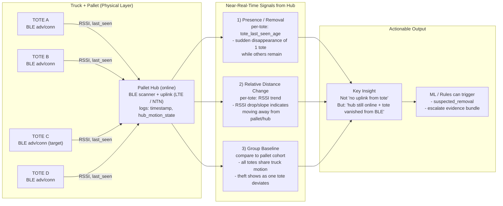
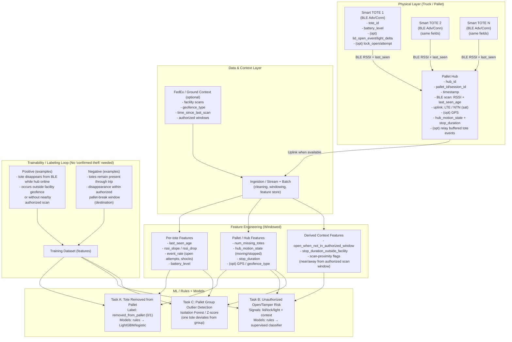

## High-level architecture

```mermaid
flowchart LR
  %% Hub-visible signals that make ML theft detection workable (WP-D)

  subgraph TruckPallet["Truck + Pallet (Physical Layer)"]
    direction TB
    HUB["Pallet Hub (online)\nBLE scanner + uplink (LTE / NTN)\nlogs: timestamp, hub_motion_state"]
    T1["TOTE A\nBLE adv/conn"]
    T2["TOTE B\nBLE adv/conn"]
    T3["TOTE C\nBLE adv/conn (target)"]
    T4["TOTE D\nBLE adv/conn"]

    T1 -->|RSSI, last_seen| HUB
    T2 -->|RSSI, last_seen| HUB
    T3 -->|RSSI, last_seen| HUB
    T4 -->|RSSI, last_seen| HUB
  end

  subgraph Signals["Near-Real-Time Signals from Hub"]
    direction TB
    S1["1) Presence / Removal\nper-tote: tote_last_seen_age\n- sudden disappearance of 1 tote\n  while others remain"]
    S2["2) Relative Distance Change\nper-tote: RSSI trend\n- RSSI drop/slope indicates\n  moving away from pallet/hub"]
    S3["3) Group Baseline\ncompare to pallet cohort\n- all totes share truck motion\n- theft shows as one tote deviates"]
  end

  HUB --> S1
  HUB --> S2
  HUB --> S3

  subgraph Actionable["Actionable Output"]
    direction TB
    A0["Key Insight\nNot 'no uplink from tote'\nBut: 'hub still online + tote vanished from BLE'"]
    A1["ML / Rules can trigger\n- suspected_removal\n- escalate evidence bundle"]
  end

  S1 --> A0
  S2 --> A0
  S3 --> A0
  A0 --> A1

```

## Detailed flow

```mermaid
flowchart TB
  %% High-level: Pallet Hub + BLE Presence + ML for WP-D (Theft/Unauthorized Access)

  subgraph Physical["Physical Layer (Truck / Pallet)"]
    direction TB
    T1["Smart TOTE 1\n(BLE Adv/Conn)\n- tote_id\n- battery_level\n- (opt) lid_open_event/light_delta\n- (opt) lock_open/attempt"]
    T2["Smart TOTE 2\n(BLE Adv/Conn)\n(same fields)"]
    Tn["Smart TOTE N\n(BLE Adv/Conn)\n(same fields)"]

    HUB["Pallet Hub\n- hub_id\n- pallet_id/session_id\n- timestamp\n- BLE scan: RSSI + last_seen_age\n- uplink: LTE / NTN (sat)\n- (opt) GPS\n- hub_motion_state + stop_duration\n- (opt) relay buffered tote events"]
    T1 -->|BLE RSSI + last_seen| HUB
    T2 -->|BLE RSSI + last_seen| HUB
    Tn -->|BLE RSSI + last_seen| HUB
  end

  subgraph Data["Data & Context Layer"]
    direction TB
    FDX["FedEx / Ground Context (optional)\n- facility scans\n- geofence_type\n- time_since_last_scan\n- authorized windows"]
    HUB -->|Uplink when available| PIPE["Ingestion / Stream + Batch\n(cleaning, windowing, feature store)"]
    FDX --> PIPE
  end

  subgraph Features["Feature Engineering (Windowed)"]
    direction TB
    FE1["Per-tote Features\n- last_seen_age\n- rssi_slope / rssi_drop\n- event_rate (open attempts, shocks)\n- battery_level"]
    FE2["Pallet / Hub Features\n- num_missing_totes\n- hub_motion_state (moving/stopped)\n- stop_duration\n- (opt) GPS / geofence_type"]
    FE3["Derived Context Features\n- open_when_not_in_authorized_window\n- stop_duration_outside_facility\n- scan-proximity flags\n  (near/away from authorized scan window)"]
    PIPE --> FE1
    PIPE --> FE2
    PIPE --> FE3
  end

  subgraph ML["ML / Rules + Models"]
    direction TB
    A["Task A: Tote Removed from Pallet\nLabel: removed_from_pallet (0/1)\nModels: rules → LightGBM/logistic"]
    B["Task B: Unauthorized Open/Tamper Risk\nSignals: lid/lock/light + context\nModels: rules → supervised classifier"]
    C["Task C: Pallet Group Outlier Detection\nIsolation Forest / Z-score\n(one tote deviates from group)"]
    FE1 --> A
    FE2 --> A
    FE2 --> B
    FE3 --> B
    FE1 --> C
    FE2 --> C
  end

  subgraph Labeling["Trainability / Labeling Loop (No 'confirmed theft' needed)"]
    direction TB
    POS["Positive (examples)\n- tote disappears from BLE while hub online\n- occurs outside facility geofence\n  or without nearby authorized scan"]
    NEG["Negative (examples)\n- totes remain present through trip\n- disappearance within authorized\n  pallet-break window (destination)"]
    POS --> TRAIN["Training Dataset (features)"]
    NEG --> TRAIN
    TRAIN --> A
    TRAIN --> B
    TRAIN --> C
  end

```