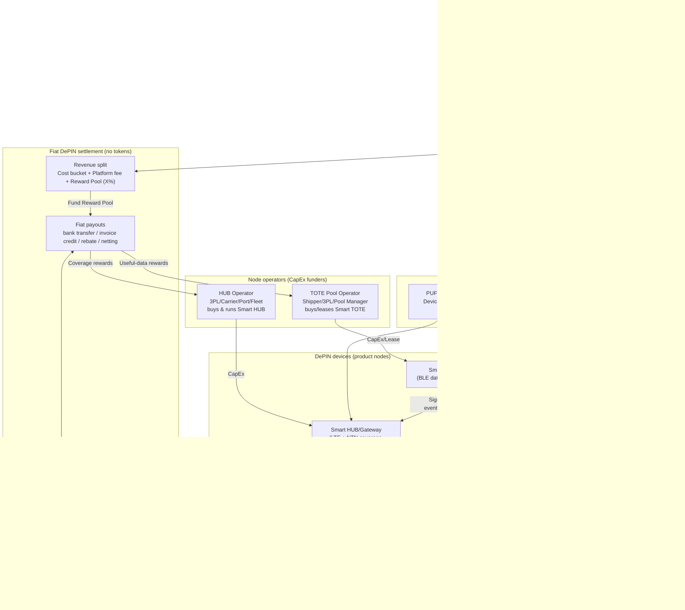

```mermaid 
flowchart TD
  subgraph Payers["Fiat payers (Opex)"]
    CUST["Shippers / 3PLs / Insurers<br/>Pay for outcomes + optional NTN premium"]
  end

  subgraph Operators["Node operators (CapEx funders)"]
    OP_HUB["HUB Operator<br/>3PL/Carrier/Port/Fleet<br/>buys & runs Smart HUB"]
    OP_TOTE["TOTE Pool Operator<br/>Shipper/3PL/Pool Manager<br/>buys/leases Smart TOTE"]
  end

  subgraph Devices["DePIN devices (product nodes)"]
    TOTE["Smart TOTE<br/>(BLE data/event node)"]
    HUB["Smart HUB/Gateway<br/>(LTE + NTN coverage node)"]
  end

  subgraph Trust["Trust layer"]
    PUF["PUF UID + Attestation<br/>Device identity + signed telemetry"]
  end

  subgraph Platform["Value delivery"]
    AI["iTracXing AI-MaaS<br/>Risk scoring / prediction"]
    EVID["Arviem Control Tower<br/>Alerts + evidence packs"]
    BILL["Fiat Billing<br/>subscription/per shipment/per container-day/API"]
  end

  subgraph Settlement["Fiat DePIN settlement (no tokens)"]
    SCORE["Contribution scoring<br/>HUB: uptime/coverage/latency/NTN efficiency<br/>TOTE: data quality/verified events/tote-hours"]
    SPLIT["Revenue split<br/>Cost bucket + Platform fee + Reward Pool (X%)"]
    PAY["Fiat payouts<br/>bank transfer / invoice credit / rebate / netting"]
  end

  OP_TOTE -->|CapEx/Lease| TOTE
  OP_HUB  -->|CapEx| HUB

  PUF --> TOTE
  PUF --> HUB
  TOTE -->|Signed BLE events/summary| HUB
  HUB -->|LTE/NTN uplink| AI
  AI --> EVID -->|Outcomes + evidence| CUST

  CUST -->|Fiat payment| BILL --> SPLIT
  AI --> SCORE
  SCORE --> PAY
  SPLIT -->|Fund Reward Pool| PAY
  PAY -->|Coverage rewards| OP_HUB
  PAY -->|Useful-data rewards| OP_TOTE


```