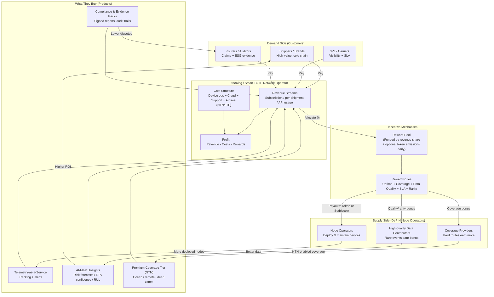

```mermaid 
flowchart TB
  %% =========================
  %% Business-Only View: Money, Value, Incentives
  %% =========================

  subgraph DEM["Demand Side (Customers)"]
    A["Shippers / Brands<br/>High-value, cold chain"]
    B["3PL / Carriers<br/>Visibility + SLA"]
    C["Insurers / Auditors<br/>Claims + ESG evidence"]
  end

  subgraph OFFER["What They Buy (Products)"]
    S1["Telemetry-as-a-Service<br/>Tracking + alerts"]
    S2["AI-MaaS Insights<br/>Risk forecasts / ETA confidence / RUL"]
    S3["Compliance & Evidence Packs<br/>Signed reports, audit trails"]
    S4["Premium Coverage Tier (NTN)<br/>Ocean / remote / dead zones"]
  end

  subgraph PLATFORM["ItracXing / Smart TOTE Network Operator"]
    REV["Revenue Streams<br/>Subscription / per-shipment / API usage"]
    COST["Cost Structure<br/>Device ops + Cloud + Support + Airtime (NTN/LTE)"]
    PROF["Profit<br/>Revenue - Costs - Rewards"]
  end

  subgraph SUPPLY["Supply Side (DePIN Node Operators)"]
    N1["Node Operators<br/>Deploy & maintain devices"]
    N2["Coverage Providers<br/>Hard routes earn more"]
    N3["High-quality Data Contributors<br/>Rare events earn bonus"]
  end

  subgraph INC["Incentive Mechanism"]
    POOL["Reward Pool<br/>(Funded by revenue share<br/>+ optional token emissions early)"]
    RULES["Reward Rules<br/>Uptime + Coverage + Data Quality + SLA + Rarity"]
  end

  %% Flows
  A -->|Pay| REV
  B -->|Pay| REV
  C -->|Pay| REV

  S1 --> REV
  S2 --> REV
  S3 --> REV
  S4 --> REV

  REV --> PROF
  COST --> PROF

  REV -->|Allocate %| POOL
  POOL --> RULES
  RULES -->|Payouts: Token or Stablecoin| N1
  RULES -->|Coverage bonus| N2
  RULES -->|Quality/rarity bonus| N3

  %% Value feedback loop
  N1 -->|More deployed nodes| S1
  N2 -->|NTN-enabled coverage| S4
  N3 -->|Better data| S2
  S2 -->|Higher ROI| A
  S3 -->|Lower disputes| C


```