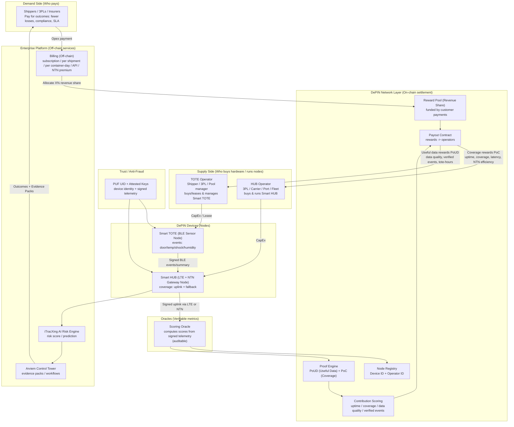

```mermaid 

flowchart TD
  %% =========================
  %% DePIN Model: Smart TOTE + Smart HUB
  %% =========================

  subgraph Payers["Demand Side (Who pays)"]
    CUST["Shippers / 3PLs / Insurers<br/>Pay for outcomes: fewer losses, compliance, SLA"]
  end

  subgraph DePIN["DePIN Network Layer (On-chain settlement)"]
    REG["Node Registry<br/>Device ID + Operator ID"]
    PROOF["Proof Engine<br/>PoUD (Useful Data) + PoC (Coverage)"]
    SCORE["Contribution Scoring<br/>uptime / coverage / data quality / verified events"]
    POOL["Reward Pool (Revenue Share)<br/>funded by customer payments"]
    PAY["Payout Contract<br/>rewards -> operators"]
  end

  subgraph Oracles["Oracles (Verifiable metrics)"]
    ORA["Scoring Oracle<br/>computes scores from signed telemetry<br/>(auditable)"]
  end

  subgraph Nodes["Supply Side (Who buys hardware / runs nodes)"]
    OP_HUB["HUB Operator<br/>3PL / Carrier / Port / Fleet<br/>buys & runs Smart HUB"]
    OP_TOTE["TOTE Operator<br/>Shipper / 3PL / Pool manager<br/>buys/leases & manages Smart TOTE"]
  end

  subgraph Hardware["DePIN Devices (Nodes)"]
    TOTE["Smart TOTE (BLE Sensor Node)<br/>events: door/temp/shock/humidity"]
    HUB["Smart HUB (LTE + NTN Gateway Node)<br/>coverage: uplink + fallback"]
  end

  subgraph Trust["Trust / Anti-Fraud"]
    PUF["PUF UID + Attested Keys<br/>device identity + signed telemetry"]
  end

  subgraph Platform["Enterprise Platform (Off-chain services)"]
    AI["iTracXing AI Risk Engine<br/>risk score / prediction"]
    EVID["Arviem Control Tower<br/>evidence packs / workflows"]
    BILL["Billing (Off-chain)<br/>subscription / per shipment / per container-day / API / NTN premium"]
  end

  %% --- Who buys hardware (CapEx) ---
  OP_TOTE -->|CapEx / Lease| TOTE
  OP_HUB  -->|CapEx| HUB

  %% --- Device identity & signed data ---
  PUF --> TOTE
  PUF --> HUB
  TOTE -->|Signed BLE events/summary| HUB
  HUB -->|Signed uplink via LTE or NTN| ORA

  %% --- Proof & scoring ---
  ORA --> REG
  ORA --> PROOF
  PROOF --> SCORE

  %% --- Customer revenue funds rewards (DePIN economics) ---
  CUST -->|Opex payment| BILL
  BILL -->|Allocate X% revenue share| POOL

  %% --- Rewards paid to node operators ---
  SCORE --> PAY
  POOL --> PAY
  PAY -->|Coverage rewards PoC<br/>uptime, coverage, latency, NTN efficiency| OP_HUB
  PAY -->|Useful data rewards PoUD<br/>data quality, verified events, tote-hours| OP_TOTE

  %% --- Outcomes delivered back to customers ---
  HUB --> AI
  AI --> EVID
  EVID -->|Outcomes + Evidence Packs| CUST


```