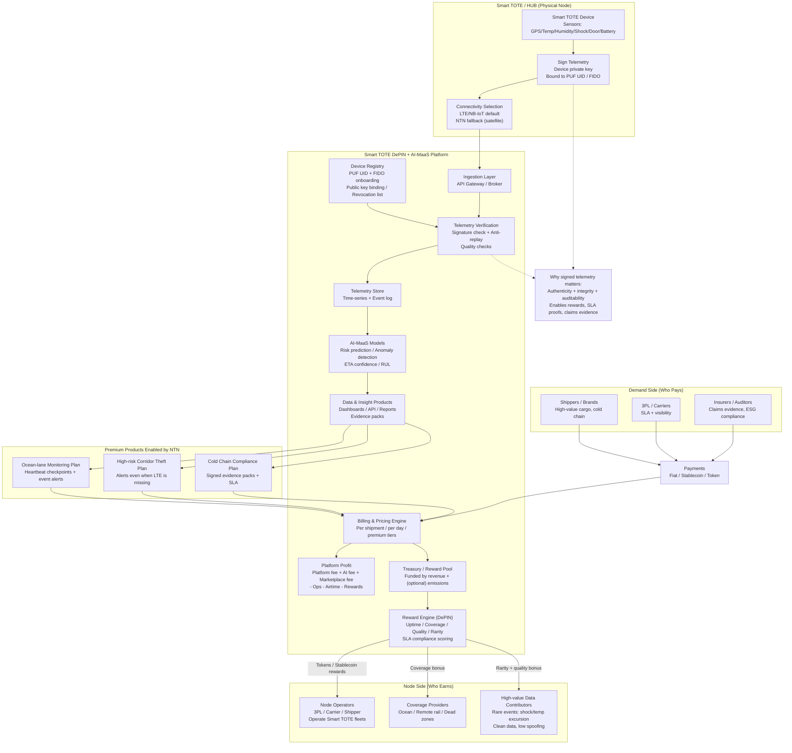

```mermaid 
flowchart TB
  %% =========================
  %% Demand Side (Pays)
  %% =========================
  subgraph DEM["Demand Side (Who Pays)"]
    C1["Shippers / Brands<br/>High-value cargo, cold chain"]
    C2["3PL / Carriers<br/>SLA + visibility"]
    C3["Insurers / Auditors<br/>Claims evidence, ESG compliance"]
  end

  PAY["Payments<br/>Fiat / Stablecoin / Token"]
  C1 --> PAY
  C2 --> PAY
  C3 --> PAY

  %% =========================
  %% DePIN + AI-MaaS Platform
  %% =========================
  subgraph PLAT["Smart TOTE DePIN + AI-MaaS Platform"]
    REG["Device Registry<br/>PUF UID + FIDO onboarding<br/>Public key binding / Revocation list"]
    ING["Ingestion Layer<br/>API Gateway / Broker"]
    VERIFY["Telemetry Verification<br/>Signature check + Anti-replay<br/>Quality checks"]
    STORE["Telemetry Store<br/>Time-series + Event log"]
    AI["AI-MaaS Models<br/>Risk prediction / Anomaly detection<br/>ETA confidence / RUL"]
    MARKET["Data & Insight Products<br/>Dashboards / API / Reports<br/>Evidence packs"]
    BILL["Billing & Pricing Engine<br/>Per shipment / per day / premium tiers"]
    REWARD["Reward Engine (DePIN)<br/>Uptime / Coverage / Quality / Rarity<br/>SLA compliance scoring"]
    TREAS["Treasury / Reward Pool<br/>Funded by revenue + (optional) emissions"]
    FEE["Platform Profit<br/>Platform fee + AI fee + Marketplace fee<br/>- Ops - Airtime - Rewards"]
  end

  PAY --> BILL
  BILL --> FEE
  BILL --> TREAS
  TREAS --> REWARD

  %% =========================
  %% Node Side (Earns)
  %% =========================
  subgraph NODES["Node Side (Who Earns)"]
    OP1["Node Operators<br/>3PL / Carrier / Shipper<br/>Operate Smart TOTE fleets"]
    OP2["Coverage Providers<br/>Ocean / Remote rail / Dead zones"]
    OP3["High-value Data Contributors<br/>Rare events: shock/temp excursion<br/>Clean data, low spoofing"]
  end

  REWARD -->|"Tokens / Stablecoin rewards"| OP1
  REWARD -->|"Coverage bonus"| OP2
  REWARD -->|"Rarity + quality bonus"| OP3

  %% =========================
  %% Smart TOTE Telemetry Path
  %% =========================
  subgraph EDGE["Smart TOTE / HUB (Physical Node)"]
    DEV["Smart TOTE Device<br/>Sensors: GPS/Temp/Humidity/Shock/Door/Battery"]
    SIGN["Sign Telemetry<br/>Device private key<br/>Bound to PUF UID / FIDO"]
    TX["Connectivity Selection<br/>LTE/NB-IoT default<br/>NTN fallback (satellite)"]
  end

  DEV --> SIGN --> TX --> ING
  REG --> VERIFY
  ING --> VERIFY --> STORE --> AI --> MARKET

  %% =========================
  %% Products & Premium NTN Tiers
  %% =========================
  subgraph SKU["Premium Products Enabled by NTN"]
    P1["Ocean-lane Monitoring Plan<br/>Heartbeat checkpoints + event alerts"]
    P2["High-risk Corridor Theft Plan<br/>Alerts even when LTE is missing"]
    P3["Cold Chain Compliance Plan<br/>Signed evidence packs + SLA"]
  end

  MARKET --> P1
  MARKET --> P2
  MARKET --> P3
  P1 --> BILL
  P2 --> BILL
  P3 --> BILL

  %% =========================
  %% Why Signing Matters for Incentives
  %% =========================
  NOTE["Why signed telemetry matters:<br/>Authenticity + integrity + auditability<br/>Enables rewards, SLA proofs, claims evidence"]
  SIGN -.-> NOTE
  VERIFY -.-> NOTE

```