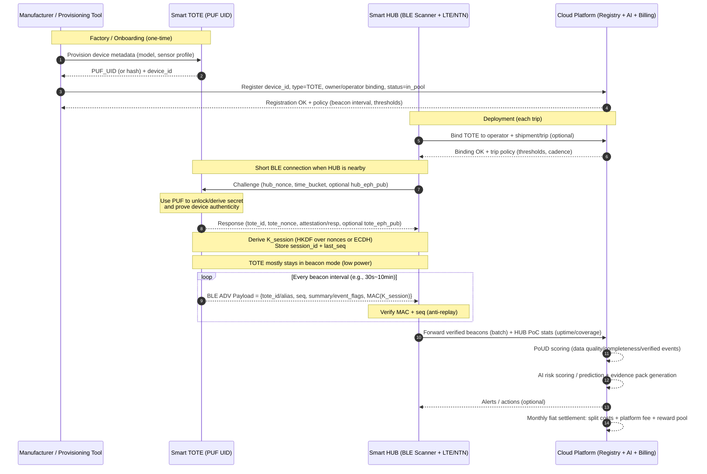

```mermaid 

  sequenceDiagram
  autonumber
  participant M as Manufacturer / Provisioning Tool
  participant T as Smart TOTE (PUF UID)
  participant H as Smart HUB (BLE Scanner + LTE/NTN)
  participant C as Cloud Platform (Registry + AI + Billing)

  %% ----------------------------
  %% 1) Registration (one-time)
  %% ----------------------------
  Note over M,T: Factory / Onboarding (one-time)
  M->>T: Provision device metadata (model, sensor profile)
  T-->>M: PUF_UID (or hash) + device_id
  M->>C: Register device_id, type=TOTE, owner/operator binding, status=in_pool
  C-->>M: Registration OK + policy (beacon interval, thresholds)

  %% ------------------------------------
  %% 2) Deployment / Binding to shipment
  %% ------------------------------------
  Note over H,C: Deployment (each trip)
  H->>C: Bind TOTE to operator + shipment/trip (optional)
  C-->>H: Binding OK + trip policy (thresholds, cadence)

  %% -----------------------------------------
  %% 3) Session auth (short 2-way BLE exchange)
  %% -----------------------------------------
  Note over H,T: Short BLE connection when HUB is nearby
  H->>T: Challenge (hub_nonce, time_bucket, optional hub_eph_pub)
  Note over T: Use PUF to unlock/derive secret<br/>and prove device authenticity
  T-->>H: Response (tote_id, tote_nonce, attestation/resp, optional tote_eph_pub)
  Note over H,T: Derive K_session (HKDF over nonces or ECDH)<br/>Store session_id + last_seq

  %% ------------------------------------------
  %% 4) BLE beacon transmission (advertising-only)
  %% ------------------------------------------
  Note over T,H: TOTE mostly stays in beacon mode (low power)
  loop Every beacon interval (e.g., 30s~10min)
    T-->>H: BLE ADV Payload = {tote_id/alias, seq, summary/event_flags, MAC(K_session)}
    Note over H: Verify MAC + seq (anti-replay)
  end

  %% ----------------------------
  %% 5) Uplink + scoring + AI
  %% ----------------------------
  H->>C: Forward verified beacons (batch) + HUB PoC stats (uptime/coverage)
  C-->>C: PoUD scoring (data quality/completeness/verified events)
  C-->>C: AI risk scoring / prediction + evidence pack generation
  C-->>H: Alerts / actions (optional)
  C-->>C: Monthly fiat settlement: split costs + platform fee + reward pool


```