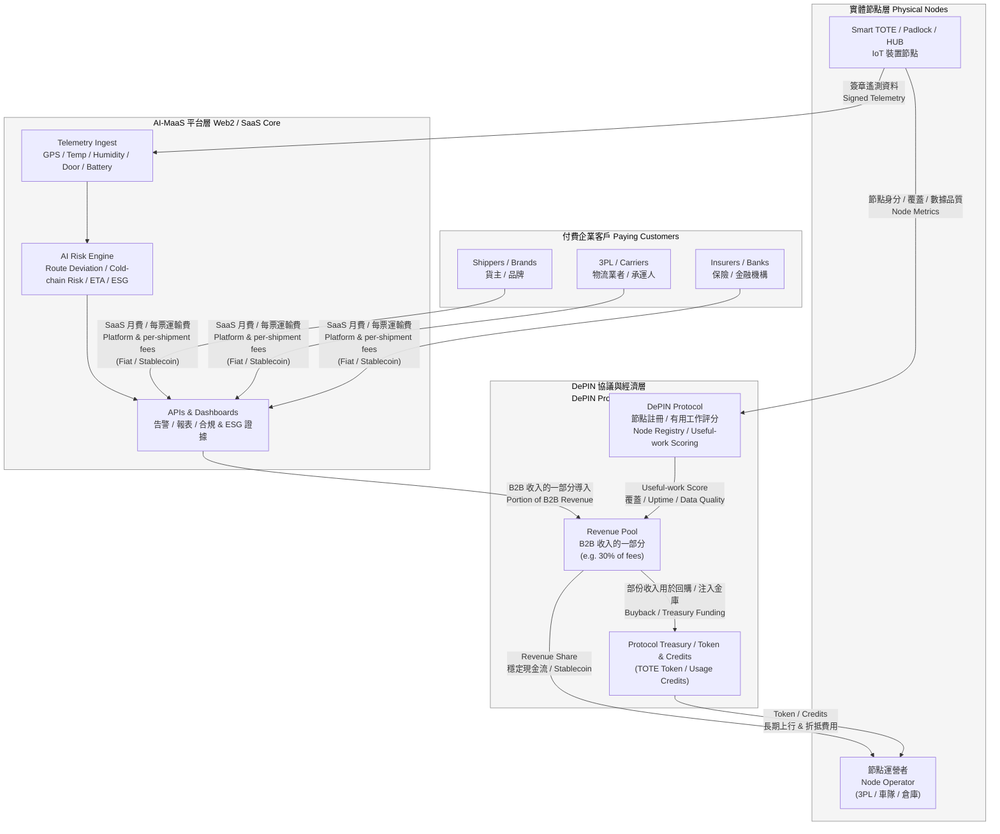
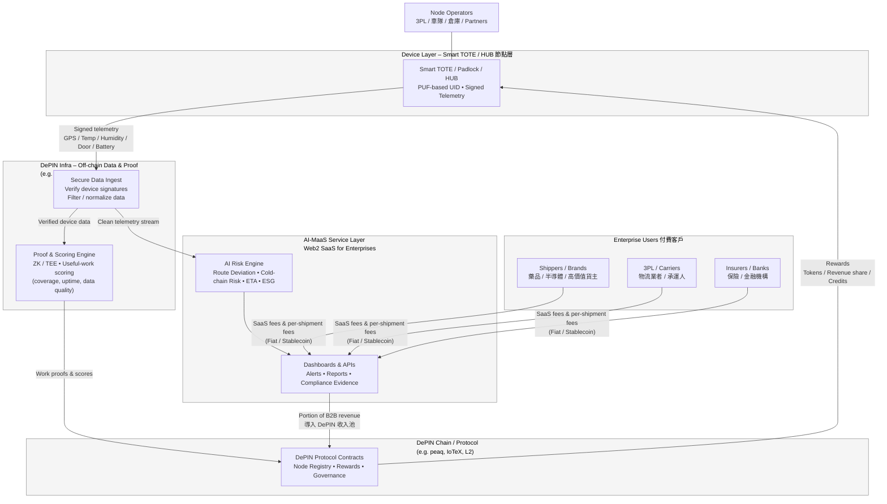

How to read / explain this (for slides or proposal)

EDGE

Smart TOTE / HUB（有 PUF UID）產生並簽章遙測資料 → 保證「這真的是那顆裝置」。

INFRA (W3bstream-style)

COLLECT：驗證簽章、清洗資料。

PROOF：把 coverage、uptime、data quality 算成「有用工作分數」，產生 proof。

CHAIN / CONTRACTS (peaq / IoTeX 之類 L1/L2)

接收 proof & scores，更新 Node Registry、分配 rewards、治理參數。

SERVICE (AI-MaaS)

同一批資料直接餵進 AI Risk Engine，
給企業客戶做 route deviation / 冷鏈風險 / ESG 報表 → 這邊收 真實 SaaS / per-shipment 費用。

CUSTOMER + CONTRACTS + TOTE

企業付費 → 一部分進入 DePIN 協議收入池 →
CONTRACTS 按照「有用工作分數」把收入 / token 分給 Smart TOTE 節點運營者 (OP)。

如果你要，我可以再幫你產一個「簡化版 4 box 圖」，專門給 MOEA 或非 Web3 的人看，只保留：

Smart TOTE / HUB nodes

AI-MaaS service (Web2 收費)

DePIN protocol (分潤規則)

Node operators & customers