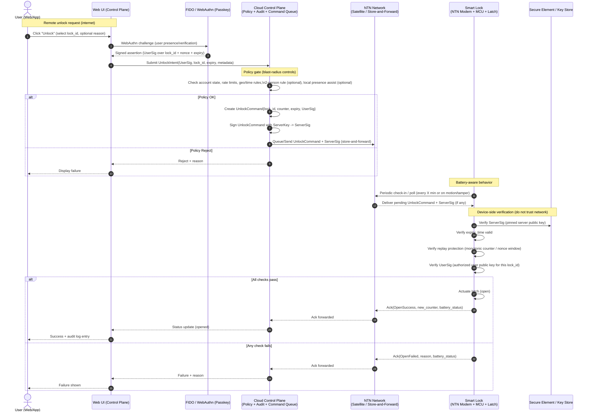

# Two-person rule for unlock (two passkey approvals)

This adds a strict **2-person approval gate** to remote unlock so that **two distinct human approvers** must each complete a **passkey/WebAuthn assertion** before an unlock command is issued.

## Security goal and model

- **Goal:** prevent a single compromised account/device/operator from remotely unlocking a high-value lock.
- **Assumptions:** the lock already verifies `ServerSig` and `UserSig` (as shown in the sequence diagram).
- **Two levels of strength:**
    - **Policy-only 2-person (simpler):** cloud verifies both approvals, then signs a single `UnlockCommand`. Lock trusts server policy enforcement.
    - **Device-enforced 2-person (stronger):** lock verifies **both** WebAuthn-derived approvals on-device (or verifies a threshold signature), reducing reliance on the server being uncompromised.

For high-value unlocks, prefer **device-enforced 2-person**, and treat policy-only as a fallback if the lock cannot store/verify multiple approver keys.

## Roles and constraints

- **Initiator:** requests unlock (may be one of the approvers).
- **Approver A / Approver B:** must be **distinct users** and must use **distinct passkey credentials**.
- **Constraints to enforce server-side:**
    - `approver_user_id` must be different for A vs B
    - `credential_id` (WebAuthn credential) must be different for A vs B
    - optional: approvers must belong to different groups (e.g., Operations + Security)
    - optional: “freshness” window (e.g., both approvals within 10 minutes)

## Data structures (recommended)

### UnlockIntent (control plane)

- `intent_id`
- `lock_id`
- `requested_by_user_id`
- `reason` (required for high-value)
- `policy_profile` (e.g., `high_value_two_person`)
- `expires_at`
- `command_digest` (hash of canonical command fields; see below)
- `approvals[]` (initially empty)

### Approval (what each passkey signs)

Each approver signs a **stable digest** (not UI text) to avoid confusion and signature ambiguity.

- `approver_user_id`
- `credential_id`
- `webauthn_assertion` (authenticator data + client data JSON + signature)
- `signed_payload` should effectively bind to:
    - `intent_id`
    - `lock_id`
    - `command_digest`
    - `expires_at`
    - optional: `reason_hash`

### UnlockCommand (sent to lock)

- `lock_id`
- `counter` (monotonic)
- `expires_at`
- `intent_id`
- `command_digest`
- `approvals[]` (A + B) **or** a compact threshold signature
- `server_sig` (signature over the full command envelope)

## Canonical “command digest”

To keep signatures consistent across platforms, compute a deterministic digest:

- `command_digest = SHA-256( canonical_json({ lock_id, intent_id, counter, expires_at, policy_profile, reason_hash }) )`

Where `canonical_json` uses a strict, documented field order and encoding.

## End-to-end flow (2 approvals)

1. **Initiate:** user requests unlock in UI; completes passkey prompt (Approval A).
2. **Create pending intent:** control plane stores `UnlockIntent` with `status=pending_second_approval`.
3. **Notify second approver:** push/SMS/email/in-app task to Approver B with lock, reason, expiry.
4. **Approve:** Approver B completes passkey prompt (Approval B).
5. **Policy gate:** server verifies:
    - both WebAuthn assertions valid
    - distinct users + distinct credential IDs
    - both approvals match the same `command_digest` and are unexpired
    - account/geo/rate limits satisfied
6. **Issue command:** server creates `UnlockCommand`, signs it (`server_sig`), enqueues via NTN.
7. **Device verifies & actuates:** lock verifies signatures, counters, and expiry; actuates if all checks pass.

## On-device verification options

### Option A: Policy-only (server enforces 2-person)

- Lock verifies only `server_sig` (and optionally a single `UserSig`).
- Pros: simplest firmware; minimal payload.
- Cons: server compromise or insider with server signing access can bypass 2-person.

### Option B: Device-enforced (recommended for high-value)

- Lock stores an allowlist of approver public keys (or references signed by the server and cached).
- `UnlockCommand` includes **two approvals**, and the lock verifies both against its allowlist.
- Pros: materially stronger; server can’t unilaterally bypass approvals.
- Cons: key distribution/revocation complexity; larger command payload.

### Option C: Threshold signature (advanced)

- Use a 2-of-N threshold scheme so the device verifies a single compact signature.
- Pros: compact payload; strong device enforcement.
- Cons: higher implementation complexity and operational key management.

## UX and safety details (reduce reviewer friction)

- Show a clear approval screen to each approver: `lock_id`, location/name, reason, expiry, and a “deny” button.
- Support **explicit denial**; denials should close the intent and require a new request.
- Support **cancellation** by requester until second approval is given.
- Enforce **short expiries** for high-value unlocks (e.g., 5–15 minutes).

## Audit and forensics

- Persist both approvals (raw WebAuthn assertion objects) with timestamps and device metadata.
- Log: who requested, who approved, who denied, policy profile, and final device ACK.
- Make “2-person satisfied” a first-class audit field, not derived later.

## Recovery and break-glass

High-value systems usually need an exception path, but it must be *hard to abuse*:

- Define a **break-glass policy profile** requiring stronger friction (e.g., two security admins + time delay) and louder alerts.
- Alternatively: allow local physical override (mechanical key / on-site PIN) that is independent of remote unlock.

## Common pitfalls (avoid)

- Allowing the same user to approve twice (must enforce distinct `user_id` and distinct `credential_id`).
- Letting approvals sign “free text” (always sign a stable digest with lock + intent + expiry).
- Not binding approvals to the exact command parameters (counter/expiry).
- Missing replay protection on the lock (counter/nonce window).
