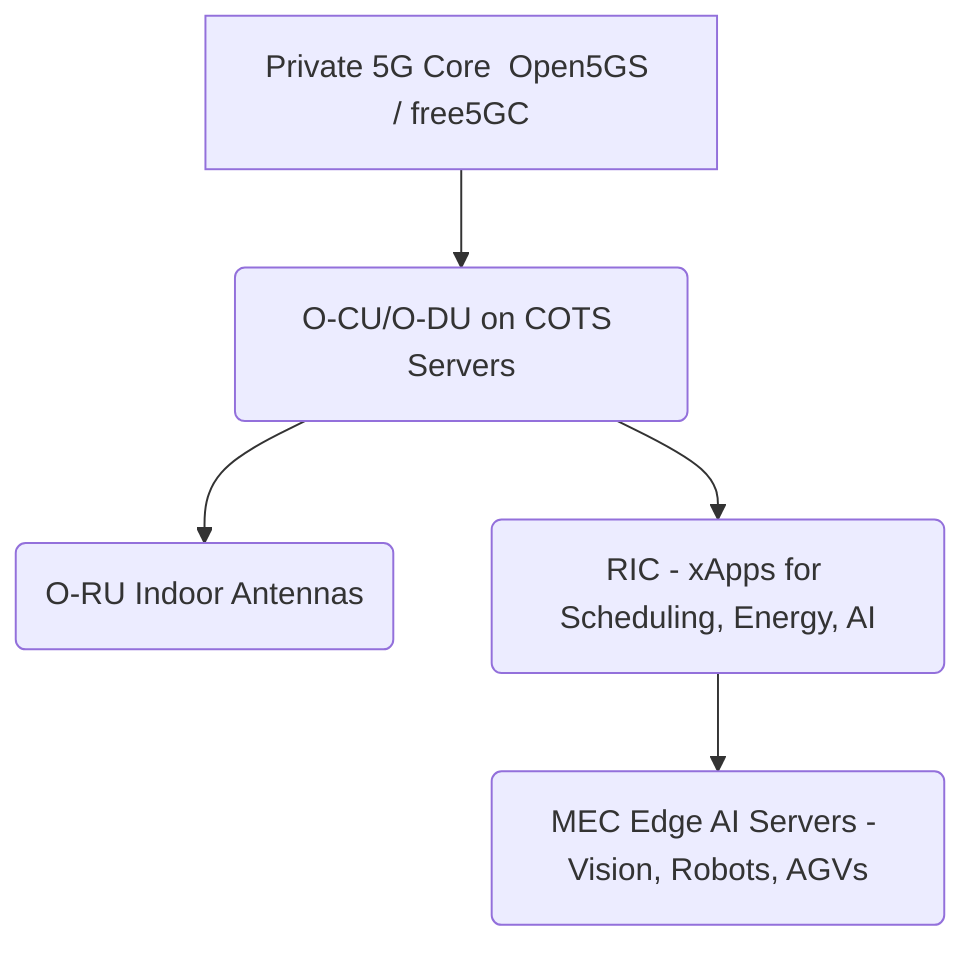

```mermaid 

graph TD
A[Private 5G Core  Open5GS / free5GC ] --> B(O-CU/O-DU on COTS Servers)
B --> C(O-RU Indoor Antennas)
B --> D(RIC - xApps for Scheduling, Energy, AI)
D --> E(MEC Edge AI Servers - Vision, Robots, AGVs)

```