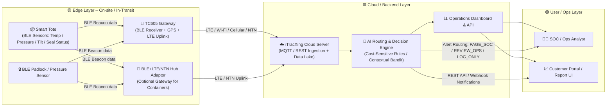

✅ The Smart Tote itself does not include NTN (satellite) connectivity.
It’s a BLE-only edge node, while the NTN capability resides in the external BLE + GPS + LTE + NTN Hub adaptor or the TC605 gateway.

Here’s the architecture hierarchy as confirmed across your files:

Device	Connectivity	Function	NTN?
Smart Tote	BLE 5.0 (short-range)	Sends sensor data (temperature, pressure, tilt, seal-open)	❌ No NTN
BLE Padlock / Pressure Sensor	BLE 5.0	Tamper / pressure beacon	❌ No NTN
TC605 Gateway	BLE receiver + GPS + LTE uplink	Collects BLE beacons → uploads to cloud	⚪ No NTN (cellular only)
BLE + GPS + LTE + NTN Hub Adaptor	BLE ↔ LTE/NTN (nRF9151 Cat-M + NB + NTN modem)	Uplink bridge for totes in no-coverage areas	✅ Yes — NTN built-in

So your diagram and interpretation are accurate:

Smart Tote → Gateway / NTN Hub → Cloud Server

That’s the configuration to use in your Phase I proposal — emphasize:

“Smart Tote provides BLE sensor intelligence.”

“Connectivity (LTE / NTN) is provided by optional gateways for extended coverage.”

This keeps Phase I within low-power, high-feasibility IoT scope, and you can later expand to full NTN hybrid connectivity in Phase II.