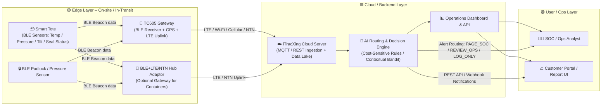
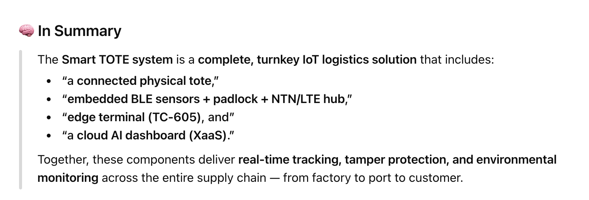

📦 Smart TOTE System – What It Includes
Layer	Component	Description	Typical Supplier / Origin
1️⃣ Container Body	Smart TOTE plastic box (HDPE / MIT production)	Heavy-duty reusable container (27×17×12 inches typ.), designed to house sensors and power modules; water-resistant and tamper-hardened.	iTX / M.I.T. molded tote partner
2️⃣ BLE Pressure & Temperature Sensor (A2-PN)	Mini sensor inside lid or sidewall; detects pressure (open/close) + temperature changes.	準旺 Tech / iTracXing	
3️⃣ BLE G-sensor / Orientation module	Detects shock, vibration, and tilt to identify tampering or improper handling.	準旺 Tech / Sinox	
4️⃣ BLE Smart Padlock (Sinox × iTracXing)	Solar + USB-C rechargeable padlock with Bluetooth unlock and event logging. Tamper-proof, records each open action.	Sinox Group Taiwan	
5️⃣ BLE + GPS + LTE + NTN Adaptor (Core Hub)	The gateway module that collects BLE data and uploads to cloud via LTE or satellite (3GPP Release 17). Integrates nRF9151 chipset with eSIM/iSIM.	準旺 Tech hardware + iTracXing firmware	
6️⃣ BLE MESH Repeater / Beacon Transceiver	Extends coverage in warehouses or ships; provides RTLS (distance-based localization) and OTA firmware updates.	iTracXing	
7️⃣ Edge Device – TC-605 Industrial Android Terminal	Handheld controller used for pairing, calibration, and data relay over 5G/Wi-Fi 6E. Also used for on-site AI Edge processing.	iMozen / 準旺 Tech	
8️⃣ Power & Charging Modules	Coin-cell batteries (CR2450 / CR2032), 720 mAh Li-ion for HUB, solar panels on padlock and HUB, USB-C charging port.	All modules integrated M.I.T. design	
9️⃣ Software / Firmware Stack	BLE firmware, LTE/NTN connectivity stack, OTA update service, device provisioning scripts, RESTful API for cloud integration.	iTracXing Cloud Team	
🔟 Cloud Platform (iTracXing Cloud)	Data storage, visual dashboard, real-time alerts, AI anomaly detection, and ESG carbon tracking reports (API-ready).	iTracXing / Arviem Joint Platform	
1️⃣1️⃣ XaaS Service Layer	Subscription plan (Logistics Protection / Monitoring as a Service) including hardware rental, maintenance, data hosting, and support.	Vector / Arviem / iTracXing consortium	
🧠 In Summary

The Smart TOTE system is a complete, turnkey IoT logistics solution that includes:

a connected physical tote,

embedded BLE sensors + padlock + NTN/LTE hub,

edge terminal (TC-605), and

a cloud AI dashboard (XaaS).

Together, these components deliver real-time tracking, tamper protection, and environmental monitoring across the entire supply chain — from factory to port to customer.

✅ The Smart Tote itself does not include NTN (satellite) connectivity.
It’s a BLE-only edge node, while the NTN capability resides in the external BLE + GPS + LTE + NTN Hub adaptor or the TC605 gateway.

Here’s the architecture hierarchy as confirmed across your files:

Device	Connectivity	Function	NTN?
Smart Tote	BLE 5.0 (short-range)	Sends sensor data (temperature, pressure, tilt, seal-open)	❌ No NTN
BLE Padlock / Pressure Sensor	BLE 5.0	Tamper / pressure beacon	❌ No NTN
TC605 Gateway	BLE receiver + GPS + LTE uplink	Collects BLE beacons → uploads to cloud	⚪ No NTN (cellular only)
BLE + GPS + LTE + NTN Hub Adaptor	BLE ↔ LTE/NTN (nRF9151 Cat-M + NB + NTN modem)	Uplink bridge for totes in no-coverage areas	✅ Yes — NTN built-in

So your diagram and interpretation are accurate:

Smart Tote → Gateway / NTN Hub → Cloud Server

That’s the configuration to use in your Phase I proposal — emphasize:

“Smart Tote provides BLE sensor intelligence.”

“Connectivity (LTE / NTN) is provided by optional gateways for extended coverage.”

This keeps Phase I within low-power, high-feasibility IoT scope, and you can later expand to full NTN hybrid connectivity in Phase II.

