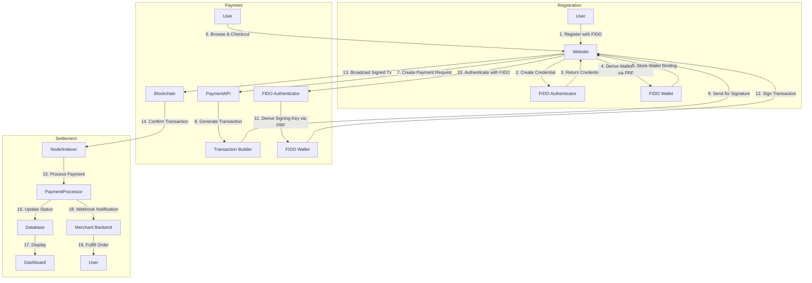

Registration: User registers with FIDO → derives wallet address via PRF
Payment: User authenticates with FIDO → derives signing key via PRF → signs stablecoin transaction → broadcasts to blockchain
Settlement: Blockchain confirms → merchant receives webhook → fulfills order

Yes, this design works with any ERC-20 stablecoin on EVM-compatible chains. Here's why:

Compatible Stablecoins
Ethereum Mainnet:

USDT (Tether)
USDC (Circle)
DAI (MakerDAO)
BUSD (Binance - deprecated but still works)
FRAX, TUSD, USDP, etc.
Layer 2 / Side Chains:

Polygon (USDC, USDT, DAI)
Arbitrum (USDC.e, USDT)
Optimism (USDC, DAI)
Base (USDC)
Avalanche C-Chain (USDC, USDT)
Why It Works
Your FIDO PRF wallet design is chain-agnostic and token-agnostic:

BIP44 Derivation: Supports any EVM chain

Ethereum: m/44'/60'/0'/0/0
Polygon: Same keys work (EVM-compatible)
Can add chain-specific paths if needed
Transaction Signing: Standard ECDSA (secp256k1)

Same signature algorithm for all ERC-20 tokens
Only difference: contract address + calldata
ERC-20 Standard: All stablecoins use same interface

Implementation Considerations
What changes between stablecoins:

Contract Address: USDC vs USDT have different addresses
Decimals: USDC (6), DAI (18), USDT (6)
Gas Costs: Vary slightly by implementation
Chain: Ethereum vs Polygon vs Arbitrum (different RPC endpoints)
What stays the same:

✅ FIDO PRF wallet unlock flow
✅ Key derivation (prfOutput → KEK → DEK → mnemonic → BIP32)
✅ Transaction signing algorithm
✅ Your entire crypto-fido-prf.md architecture
Recommended Approach
Answer: Yes, works with any ERC-20 stablecoin on any EVM chain. Your FIDO PRF design is a general-purpose signing solution - the merchant/payment processor handles token-specific details (address, decimals, ABI).