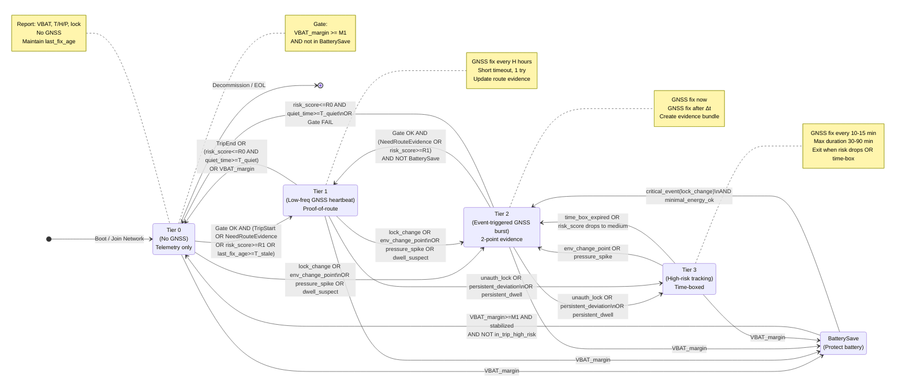

```mermaid 
stateDiagram-v2
  direction LR

  [*] --> Tier0: Boot / Join Network

  %% -------------------------
  %% Tier 0 (Default)
  %% -------------------------
  state "Tier 0<br/>(No GNSS)<br/>Telemetry only" as Tier0
  note left of Tier0
    Report: VBAT, T/H/P, lock
    No GNSS
    Maintain last_fix_age
  end note

  %% Gate condition (battery margin)
  note right of Tier0
    Gate:
    VBAT_margin >= M1
    AND not in BatterySave
  end note

  %% -------------------------
  %% Tier 1 (Low-frequency GNSS)
  %% -------------------------
  state "Tier 1<br/>(Low-freq GNSS heartbeat)<br/>Proof-of-route" as Tier1
  note right of Tier1
    GNSS fix every H hours
    Short timeout, 1 try
    Update route evidence
  end note

  %% -------------------------
  %% Tier 2 (Event-triggered GNSS burst)
  %% -------------------------
  state "Tier 2<br/>(Event-triggered GNSS burst)<br/>2-point evidence" as Tier2
  note right of Tier2
    GNSS fix now
    GNSS fix after Δt
    Create evidence bundle
  end note

  %% -------------------------
  %% Tier 3 (High-risk tracking)
  %% -------------------------
  state "Tier 3<br/>(High-risk tracking)<br/>Time-boxed" as Tier3
  note right of Tier3
    GNSS fix every 10-15 min
    Max duration 30-90 min
    Exit when risk drops OR time-box
  end note

  %% -------------------------
  %% Entry to Tier 1 from Tier 0
  %% -------------------------
  Tier0 --> Tier1: Gate OK AND (TripStart OR NeedRouteEvidence<br/>OR risk_score>=R1 OR last_fix_age>=T_stale)

  %% -------------------------
  %% Jump to Tier 2 from any state on critical events
  %% -------------------------
  Tier0 --> Tier2: lock_change OR env_change_point\nOR pressure_spike OR dwell_suspect
  Tier1 --> Tier2: lock_change OR env_change_point\nOR pressure_spike OR dwell_suspect
  Tier3 --> Tier2: env_change_point OR pressure_spike

  %% -------------------------
  %% Escalate to Tier 3 on high-risk
  %% -------------------------
  Tier2 --> Tier3: unauth_lock OR persistent_deviation\nOR persistent_dwell
  Tier1 --> Tier3: unauth_lock OR persistent_deviation\nOR persistent_dwell

  %% -------------------------
  %% Return paths
  %% -------------------------
  %% Tier2 returns to Tier1 if route evidence still needed and power allows
  Tier2 --> Tier1: Gate OK AND (NeedRouteEvidence OR risk_score>=R1)<br/>AND NOT BatterySave

  %% Tier2 returns to Tier0 if low risk and no route evidence needed
  Tier2 --> Tier0: risk_score<=R0 AND quiet_time>=T_quiet\nOR Gate FAIL

  %% Tier3 exits after time-box or when risk decreases
  Tier3 --> Tier2: time_box_expired OR risk_score drops to medium

  %% Tier1 returns to Tier0 with hysteresis or shipment end
  Tier1 --> Tier0: TripEnd OR (risk_score<=R0 AND quiet_time>=T_quiet)<br/>OR VBAT_margin<M0

  %% -------------------------
  %% Battery save / protection (global)
  %% -------------------------
  state "BatterySave<br/>(Protect battery)" as BatterySave
  Tier0 --> BatterySave: VBAT_margin<M0 OR rapid_vbat_drop
  Tier1 --> BatterySave: VBAT_margin<M0 OR rapid_vbat_drop
  Tier2 --> BatterySave: VBAT_margin<M0 OR rapid_vbat_drop
  Tier3 --> BatterySave: VBAT_margin<M0 OR rapid_vbat_drop

  BatterySave --> Tier0: VBAT_margin>=M1 AND stabilized<br/>AND NOT in_trip_high_risk
  BatterySave --> Tier2: critical_event(lock_change)\nAND minimal_energy_ok

  %% End
  Tier0 --> [*]: Decommission / EOL

```