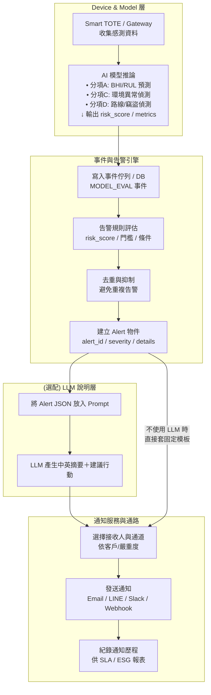

```mermaid 
flowchart TD
  %% ========== Device & Model Layer ==========
  subgraph S["Device & Model 層"]
    S1["Smart TOTE / Gateway<br/>收集感測資料"]
    S2["AI 模型推論<br/>• 分項A: BHI/RUL 預測<br/>• 分項C: 環境異常偵測<br/>• 分項D: 路線/竊盜偵測<br/>↓ 輸出 risk_score / metrics"]
  end

  %% ========== Event & Alert Engine ==========
  subgraph E["事件與告警引擎"]
    E1["寫入事件佇列 / DB<br/>MODEL_EVAL 事件"]
    E2["告警規則評估<br/>risk_score / 門檻 / 條件"]
    E3["去重與抑制<br/>避免重複告警"]
    E4["建立 Alert 物件<br/>alert_id / severity / details"]
  end

  %% ========== (Optional) LLM Explanation ==========
  subgraph L["(選配) LLM 說明層"]
    L1["將 Alert JSON 放入 Prompt"]
    L2["LLM 產生中英摘要＋建議行動"]
  end

  %% ========== Notification Layer ==========
  subgraph N["通知服務與通路"]
    N1["選擇接收人與通道<br/>依客戶/嚴重度"]
    N2["發送通知<br/>Email / LINE / Slack / Webhook"]
    N3["紀錄通知歷程<br/>供 SLA / ESG 報表"]
  end

  %% Flow
  S1 --> S2 --> E1
  E1 --> E2 --> E3 --> E4

  E4 --> L1 --> L2 --> N1
  E4 -->|不使用 LLM 時<br/>直接套固定模板| N1

  N1 --> N2 --> N3


```